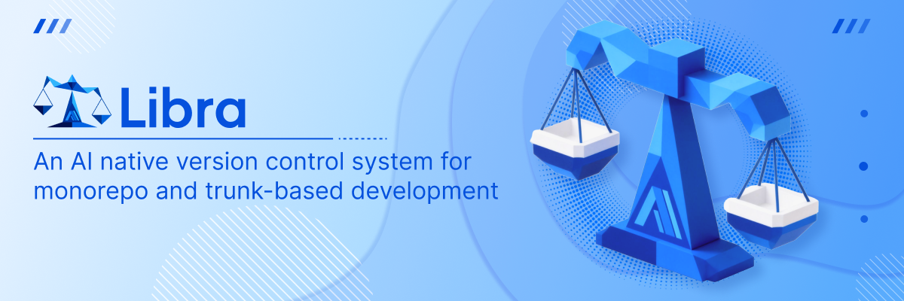
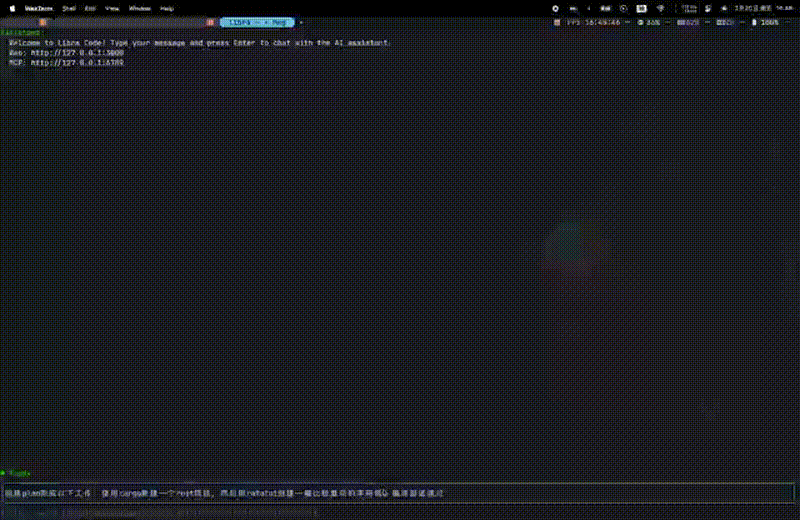

Libra is a partial implementation of a **Git** client, developed in **Rust**. The goal is **not** to build a perfect, 100% feature-complete reimplementation of Git (if you want that, take a look at [gitoxide](https://github.com/Byron/gitoxide)). Instead, Libra is evolving into an **AI agent–native version control system**.

The `libra code` command starts an interactive TUI (with a background web server) that is designed to be driven collaboratively by AI agents and humans.



---

## Example

```bash
$ libra

Usage: libra <COMMAND>

Commands:
  init         Initialize a new repository
  clone        Clone a repository into a new directory
  code         Start Libra Code interactive TUI (with background web server)
  graph        Inspect an AI thread version graph in a TUI
  add          Add file contents to the index
  rm           Remove files from the working tree and from the index
  restore      Restore working tree files
  status       Show the working tree status
  clean        Remove untracked files from the working tree
  stash        Stash the changes in a dirty working directory away
  lfs          Large File Storage
  log          Show commit logs
  show         Show various types of objects
  branch       List, create, or delete branches
  tag          Create a new tag
  commit       Record changes to the repository
  switch       Switch branches
  rebase       Reapply commits on top of another base tip
  merge        Merge changes
  reset        Reset current HEAD to specified state
  rev-parse    Parse and normalize revision names and repository paths
  rev-list     List commit objects reachable from a revision
  cherry-pick  Apply the changes introduced by some existing commits
  push         Update remote refs along with associated objects
  fetch        Download objects and refs from another repository
  pull         Fetch from and integrate with another repository or a local branch
  diff         Show changes between commits, commit and working tree, etc
  blame        Show author and history of each line of a file
  bisect       Find the commit that introduced a bug by binary search
  revert       Revert some existing commits
  remote       Manage set of tracked repositories
  open         Open the repository in the browser
  config       Manage repository configurations
  vault        Manage vault-backed signing and SSH keys
  reflog       Manage the log of reference changes (e.g., HEAD, branches)
  worktree     Manage multiple working trees attached to this repository
  cloud        Cloud backup and restore operations (D1/R2)
  help         Print this message or the help of the given subcommand(s)

Options:
  -h, --help     Print help
  -V, --version  Print version
```

---

## grep

`grep` searches tracked working-tree files, the index (`--cached`), or committed trees (`--tree <revision>`) using regular expressions by default. It also supports fixed-string mode, multiple explicit patterns, pattern files, and requiring all patterns to match within the same file.

```bash
# Search tracked working-tree files with a regex
libra grep "foo.*bar"

# Search with multiple explicit patterns
libra grep -e alpha -e beta

# Require every pattern to appear in the same file
libra grep --all-match -e alpha -e beta

# Search the staged/index version of tracked files
libra grep --cached "needle"

# Search a specific revision or branch
libra grep --tree HEAD "needle"
libra grep --tree main "needle"

# Read patterns from a file
libra grep -f patterns.txt
```

---

## Error Reporting

CLI failures use stable exit codes and stable error codes. When `stderr` is not a TTY, Libra also appends a JSON stderr report for agents and wrappers. Set `LIBRA_ERROR_JSON=1` to force that structured report in interactive terminals.
Run `libra help error-codes` for the built-in CLI reference.
See [docs/error-codes.md](docs/error-codes.md).

---

## Libra Code Modes

Libra Code supports three operation modes, each designed for different use cases.

### 1. TUI Mode (Default)

Starts an interactive Terminal User Interface along with a background web server.  
This is the standard mode for developers who want to work directly in the terminal with AI assistance.

```bash
libra code
```

- **Storage**: Uses the local project directory (`.libra/`) to isolate history and context per project.

### 2. Web Mode

Runs only the web server without the TUI.  
Useful for remote development or when you prefer using the browser interface exclusively.

```bash
libra code --web
```

- **Storage**: Uses the local project directory (`.libra/`).

### 3. Stdio Mode (MCP)

Runs the Model Context Protocol (MCP) server over standard input/output.  
This mode is designed for integration with AI clients like **Claude Desktop**.

```bash
libra code --stdio
```

- **Storage**: Uses the local project directory (`.libra/`) for history persistence (same as TUI/Web modes).  
  The directory must be writable by the calling process (including sandboxed desktop AI apps).

#### Claude Desktop Configuration

To use Libra with Claude Desktop, you must configure the MCP server to run within a valid Libra repository.
Update your `claude_desktop_config.json` as follows:

```json
{
  "mcpServers": {
    "libra": {
      "command": "/path/to/libra",
      "args": ["code", "--stdio"],
      "cwd": "/path/to/your/libra/repo"
    }
  }
}
```

> **Note**: The `cwd` (current working directory) must be set to the root of a valid Libra repository.
> If `libra code` is launched outside of a repository, it will exit with an error.

#### Managed Runtime Migration

The legacy `claudecode` provider was removed. Use `libra code --provider codex`
for Libra's managed agent runtime, or `libra code --provider anthropic` for
direct Anthropic chat completions. Claude provider-session flags such as
`--resume-session`, `--fork-session`, `--session-id`, and `--resume-at` are no
longer accepted; use Libra's canonical `--resume <thread_id>` flow for persisted
sessions.

Useful inspection commands:

```bash
libra graph <thread_id> [--repo /path/to/repo]
libra cat-file --ai-list ai_session
libra cat-file --ai-list run
libra cat-file --ai-list task
libra cat-file --ai-list tool_invocation_event
libra cat-file --ai-list patchset_snapshot
libra --json=pretty cat-file --ai ai_session:<ai_session_id>
```

### AI Provider Selection

Libra Code supports multiple AI provider backends. Use the `--provider` and `--model` flags to choose which LLM to use:

```bash
# Gemini (default)
libra code --provider gemini
libra code --provider gemini --model gemini-2.5-flash

# OpenAI
libra code --provider openai --model gpt-4o

# Anthropic (direct chat completions)
libra code --provider anthropic --model claude-sonnet-4-6

# DeepSeek
libra code --provider deepseek
libra code --provider deepseek --model deepseek-v4-pro --deepseek-thinking enabled --deepseek-reasoning-effort high
libra code --provider deepseek --model deepseek-v4-pro --deepseek-thinking enabled --deepseek-reasoning-effort high --deepseek-stream true
libra code --env-file .env.test --provider deepseek --model deepseek-v4-pro --deepseek-thinking enabled --deepseek-reasoning-effort high --deepseek-stream true

# Zhipu (GLM)
libra code --provider zhipu --model glm-5

# Ollama (local inference, no API key required, --model is required)
libra code --provider ollama --model llama3.2
libra code --provider ollama --model codellama

# Ollama with a remote instance
libra code --provider ollama --model llama3.2 --api-base http://remote-host:11434/v1
libra code --provider ollama --model minimax-m2.7:cloud --api-base http://remote-host:11434/v1 --ollama-compact-tools

# Ollama thinking control for reasoning models
OLLAMA_THINK=false libra code --provider ollama --model qwen3.6
libra code --provider ollama --model qwen3.6 --ollama-thinking high
```

> **Note**: The `--api-base` CLI flag is only honored for the `ollama` provider. Other providers accept custom base URLs through their respective environment variables (e.g. `OPENAI_BASE_URL`). Use `--env-file .env.test` to load provider keys from a dotenv-style file and override stale shell environment variables. DeepSeek reasoning fields are opt-in with `--deepseek-thinking enabled|disabled` and `--deepseek-reasoning-effort low|medium|high|max`; `xhigh` is accepted as an alias for `max`. DeepSeek streaming is opt-in with `--deepseek-stream true`; `--stream` is accepted as a DeepSeek-only alias. Ollama requests stream `/api/chat` responses by default, include a per-request `request_id` in debug logs, and default to `think:false` to keep tool calls responsive; use `--ollama-thinking auto|off|on|low|medium|high` for one run, or set `OLLAMA_THINK=true`, `low`, `medium`, `high`, or `auto` as the environment default. `auto` omits the `think` field and lets Ollama decide. Use `--ollama-compact-tools` or `OLLAMA_COMPACT_TOOLS=true` for remote/cloud Ollama endpoints that return 503s when receiving Libra's full tool schemas.

| Provider | Default Model | Auth Env Variable | Base URL Override |
|----------|--------------|-------------------|-------------------|
| `gemini` | `gemini-2.5-flash` | `GEMINI_API_KEY` | — |
| `openai` | `gpt-4o-mini` | `OPENAI_API_KEY` | `OPENAI_BASE_URL` |
| `anthropic` | `claude-sonnet-4-6` | `ANTHROPIC_API_KEY` | `ANTHROPIC_BASE_URL` |
| `deepseek` | `deepseek-chat` | `DEEPSEEK_API_KEY` | *(programmatic only)* |
| `zhipu` | `glm-5` | `ZHIPU_API_KEY` | `ZHIPU_BASE_URL` |
| `ollama` | *(requires `--model`)* | `OLLAMA_API_KEY` for direct Cloud API | `OLLAMA_BASE_URL`, `OLLAMA_THINK`, `OLLAMA_COMPACT_TOOLS`, `--api-base`, `--ollama-thinking`, or `--ollama-compact-tools` |

---

## Features

### Clean Code

The codebase is designed to be clean and easy to read, making it maintainable and approachable for developers of all skill levels.

### Cross-Platform

- [x] Windows  
- [x] Linux  
- [x] macOS

### Compatibility with Git

Libra’s core implementation is essentially compatible with **Git** (developed with reference to Git’s own documentation), including support for on-disk formats such as:

- `objects`
- `index`
- `pack`
- `pack-index`

This allows Libra to interact seamlessly with Git servers (for example, `push` and `pull` work with standard Git remotes).

### Differences from Git

While maintaining compatibility with Git, Libra intentionally diverges in some areas:

- Uses an **SQLite** database to manage loosely structured files such as `config`, `HEAD`, and `refs`, providing unified and transactional management instead of plain-text files.

---

## Vault-Backed Signing

Libra supports repository-local vault initialization for commit signing:

```bash
libra init [--separate-libra-dir <dir>] [<repo_directory>]
```

Vault is enabled by default for all `libra init` invocations — no extra flag is needed.

When vault is enabled:

- A vault database (`vault.db`) is created in the repository storage directory (`.libra/` or the directory passed via `--separate-libra-dir`).
- Libra generates a signing key and enables `vault.signing=true`.
- The vault unseal key is stored outside the repository at `~/.libra/vault-keys/<repoid>`.
- The encrypted root token is stored in repository config (`vault.roottoken_enc`).

Security note:

- Libra no longer falls back to storing the unseal key inside repository config.
- If the home directory is not writable/usable, `libra init` fails with a fatal error.

Troubleshooting:

- Ensure `HOME` (or `USERPROFILE` on Windows) points to a writable directory.
- In container/CI environments, explicitly set `HOME` to a writable path before running `libra init`.

Key management commands:

```bash
# Print current signing GPG public key (for GitHub GPG key settings)
libra config get vault.gpg.pubkey

# Generate a repo-local SSH key for a configured remote
libra config generate-ssh-key --remote origin

# Print the SSH public key for a configured remote
libra config get vault.ssh.origin.pubkey

# Generate (or rotate) vault GPG signing key and print public key
libra config generate-gpg-key [--name <user>] [--email <mail>]
```

See `docs/commands/config/README.md` for the full `libra config` command reference and migration notes.

### GitHub End-to-End Verification (libvault + Git conversion)

The following flow validates:

- `libvault` integration with Libra storage (`.libra/vault.db` + config metadata in SQLite)
- Conversion from Git repository format to Libra repository format
- Vault-backed GPG signing on commit
- SSH push from Libra to GitHub

```bash
# 1) Clone an existing GitHub repository locally with Git (SSH).
#    (This step can use your existing SSH credential.)
git clone git@github.com:<owner>/<repo>.git /tmp/<repo>-git

# 2) Convert the cloned Git repository into a Libra repository and
#    initialize vault in the same command.
mkdir -p /tmp/<repo>-libra
cd /tmp/<repo>-libra
libra init --from-git-repository /tmp/<repo>-git

# 3) Export vault public keys and register them in GitHub settings:
#    - GPG key: GitHub -> Settings -> SSH and GPG keys -> New GPG key
#    - SSH key: GitHub -> Settings -> SSH and GPG keys -> New SSH key
libra config get vault.gpg.pubkey
libra config generate-ssh-key --remote origin
libra config get vault.ssh.origin.pubkey

# 4) Make sure origin points to GitHub SSH URL in Libra config.
libra remote set-url origin git@github.com:<owner>/<repo>.git

# 5) Create a signed commit and push through SSH.
echo "vault e2e" > vault-e2e.txt
libra add vault-e2e.txt
libra commit -m "feat(vault): verify signed commit to GitHub"
libra push origin master
```

Verification points:

- `libra commit` should produce a commit object containing `gpgsig`.
- `libra push` should succeed over SSH (`git@github.com:...`).
- The commit should appear in GitHub with signature metadata.

Note:

- For the very first `git clone` in step 1, Git may still use your existing SSH credentials.
  After step 3, Libra fetch/push uses the vault-generated key for this repository.

---

## Bisect - Binary Search for Bugs

Libra implements a `bisect` subcommand that uses binary search to find the commit that introduced a bug. It is broadly compatible with `git bisect`.

### Basic Usage

```bash
# Start a bisect session
libra bisect start

# Mark the current commit as bad (contains the bug)
libra bisect bad

# Mark a known-good commit
libra bisect good <commit>

# After marking, bisect will checkout commits for you to test
# Continue marking commits as good/bad until the culprit is found

# End the session and restore your original HEAD
libra bisect reset
```

### Quick Start with Known Bounds

```bash
# Start with both bad and good commits specified
libra bisect start HEAD~10 HEAD~20  # HEAD~10 is bad, HEAD~20 is good
```

### Subcommands

- `libra bisect start [<bad> [<good>]]` – start a new bisect session
- `libra bisect bad [<rev>]` – mark a commit as bad (contains the bug)
- `libra bisect good [<rev>]` – mark a commit as good (bug-free)
- `libra bisect skip [<rev>]` – skip the current commit (untestable)
- `libra bisect reset [<rev>]` – end the session and restore original HEAD
- `libra bisect log` – show the current bisect state

### Safety Features

Libra's bisect implementation includes several safety guards:

- **Clean working tree required**: Bisect will not start if you have uncommitted changes (including ignored files like `.env`)
- **Bare repository protection**: Bisect is blocked in bare repositories (no working tree)
- **State preserved until reset**: After finding the culprit, bisect state is preserved so you can run `bisect reset` to restore your original branch
- **Branch restoration**: `bisect reset` restores you to your original branch, not a detached HEAD

---

## Worktree Management

Libra implements a `worktree` subcommand that is broadly compatible with `git worktree`, allowing you to manage multiple working directories attached to the same repository storage.

Unlike `git worktree remove`, Libra does **not** delete worktree directories on disk by default.

Supported subcommands:

- `libra worktree add <path>` – create a new linked working tree at `<path>`
- `libra worktree list` – list all registered working trees (including the main worktree)
- `libra worktree lock <path> [--reason <msg>]` – mark a worktree as locked with an optional reason
- `libra worktree unlock <path>` – unlock a previously locked worktree
- `libra worktree move <src> <dest>` – move a worktree directory to a new location
- `libra worktree prune` – prune missing or non-existent worktrees from the registry
- `libra worktree remove <path>` – remove a worktree from the registry without deleting its directory on disk (the main worktree cannot be removed)
- `libra worktree repair` – repair inconsistent worktree state if the registry and directories get out of sync

---

## Object Storage Configuration

Libra supports using S3-compatible object storage (AWS S3, Cloudflare R2, MinIO, etc.) as an alternative or supplement to local storage.  
This feature implements a **tiered storage architecture**:

- **Small objects** (< threshold) – stored in both local and remote storage
- **Large objects** (≥ threshold) – stored in remote storage with a local LRU cache

If `LIBRA_STORAGE_TYPE` is **not** set, Libra falls back to local-only storage under `.libra/objects`.

### Environment Variables

Configure object storage by setting these environment variables:

| Variable                     | Description                                                   | Required (for S3/R2) | Default              |
|-----------------------------|---------------------------------------------------------------|----------------------|----------------------|
| `LIBRA_STORAGE_TYPE`        | Storage backend type: `s3` or `r2`                            | Yes                  | –                    |
| `LIBRA_STORAGE_BUCKET`      | Bucket name                                                   | Yes                  | `libra`              |
| `LIBRA_STORAGE_ENDPOINT`    | S3-compatible endpoint URL (required for R2)                  | Yes (for R2)         | AWS S3 default       |
| `LIBRA_STORAGE_REGION`      | Region for bucket                                             | No                   | `auto`               |
| `LIBRA_STORAGE_ACCESS_KEY`  | Access key ID                                                 | Yes                  | –                    |
| `LIBRA_STORAGE_SECRET_KEY`  | Secret access key                                             | Yes                  | –                    |
| `LIBRA_STORAGE_THRESHOLD`   | Size threshold in bytes for tiering                           | No                   | `1048576` (1 MB)     |
| `LIBRA_STORAGE_CACHE_SIZE`  | Local cache size limit in bytes                               | No                   | `209715200` (200 MB) |
| `LIBRA_STORAGE_ALLOW_HTTP`  | Allow HTTP (non-TLS) endpoints for testing (not for prod)     | No                   | `false`              |

> Note: If any mandatory variable is invalid or empty (for example, empty bucket or credentials), Libra automatically falls back to local storage and logs an error message.

---

## Cloud Backup & Restore

Libra supports backing up your repository to Cloudflare D1 (metadata) and R2 (objects).

### Environment Variables for Backup

In addition to the Object Storage variables, you need to configure D1 credentials:

| Variable | Description | Required |
|----------|-------------|----------|
| `LIBRA_D1_ACCOUNT_ID` | Cloudflare Account ID | Yes |
| `LIBRA_D1_API_TOKEN` | Cloudflare API Token | Yes |
| `LIBRA_D1_DATABASE_ID` | Cloudflare D1 Database ID | Yes |

### Commands

- `libra cloud sync` - Sync local repository to cloud (automatically registers project name)
- `libra cloud restore --name <NAME>` - Restore repository by project name
- `libra cloud restore --repo-id <ID>` - Restore repository by ID
- `libra cloud status` - Show synchronization status

### Configuration

You can customize the project name used for cloud backup (defaults to the directory name):

```bash
libra config cloud.name <my-unique-project-name>
```


---

## 🚧 Pending Git commands (not yet supported)

The following Git top-level commands are currently **not implemented** in Libra (excluding `submodule` and `subtree`, which are intentionally omitted):

- `gc` – garbage-collect unreachable objects and pack files
- `prune` – remove loose objects that are no longer reachable
- `fsck` – verify repository integrity
- `maintenance` – periodic maintenance tasks
- `cat-file` – display raw object contents
- `hash-object` – compute object hash for raw data
- `describe` – human-readable description based on tags
- `show-ref` – list all refs
- `symbolic-ref` – read/write symbolic refs
- `verify-pack` – validate pack files
- `pack-objects` / `unpack-objects` – pack and unpack object collections
- `ls-remote` – list remote references
- `remote-show` – show detailed remote info
- `remote-prune` – prune stale remote-tracking branches
- `fetch-pack` / `push-pack` – low-level fetch/push operations
- `filter-branch` (or `git filter-repo`) – rewrite history
- `notes` – attach arbitrary metadata to objects
- `archive` – create tar/zip archives of tree snapshots
- `rebase --autosquash` / `rebase --reapply-cherry-picks` – advanced rebase options

These commands are slated for future implementation according to the project roadmap.

## Note on Submodule and Subtree

Libra does **not** provide the `submodule` or `subtree` commands. Because Libra stores objects in an S3-compatible backend and is designed around a **Monorepo** layout with **Trunk-based Development**, the use-cases that `git submodule`/`git subtree` address (embedding separate repositories) are handled differently – large external data lives in S3 and all code lives in a single repository.

This design choice simplifies dependency management and aligns with Libra’s goal of supporting ultra-large repositories while keeping a single source of truth.

## Contributing & Development

Before submitting a Pull Request, please ensure your code passes the following checks:

```bash
# Run clippy with all warnings treated as errors
cargo clippy --all-targets --all-features -- -D warnings

# Check code formatting (requires nightly toolchain)
cargo +nightly fmt --all --check
```

Both commands must complete without any warnings. The clippy check treats all warnings as errors, and the formatter check ensures code follows the project style guide.

If the formatting check fails, you can automatically fix formatting issues by running:

```bash
cargo +nightly fmt --all
```


## Run on Windows

If you are building Libra on Windows for the first time, install OpenSSL before running
`cargo build` or `cargo test`. The easiest setup is to use a precompiled OpenSSL package:
<https://slproweb.com/products/Win32OpenSSL.html>

Recommended setup:

1. Install a 64-bit OpenSSL build that matches the default Rust Windows target
   `x86_64-pc-windows-msvc`.
2. Note the installation directory, for example `D:\OpenSSL-Win64`.
3. Create `.cargo/config.toml` in the project root if it does not already exist.
4. Add OpenSSL environment overrides so Cargo and dependent build scripts can find the
   headers and libraries.

Project layout:

```text
.cargo/
  config.toml
```

Example `.cargo/config.toml`:

```toml
[env]
OPENSSL_DIR = "D:\\OpenSSL-Win64"
OPENSSL_LIB_DIR = "D:\\OpenSSL-Win64\\lib\\VC\\static"
OPENSSL_INCLUDE_DIR = "D:\\OpenSSL-Win64\\include"
OPENSSL_NO_VENDOR = "1"
```

Notes:

- Update the paths if OpenSSL is installed in a different directory.
- If `.cargo/config.toml` already exists, merge these entries instead of replacing the file.
- Some OpenSSL installers place libraries in a different subdirectory. If `VC\\static` does
  not exist in your installation, point `OPENSSL_LIB_DIR` at the directory that contains the
  `.lib` files for your installation.
- After updating the config, open a new terminal and verify the setup with:

```bash
cargo build
```
