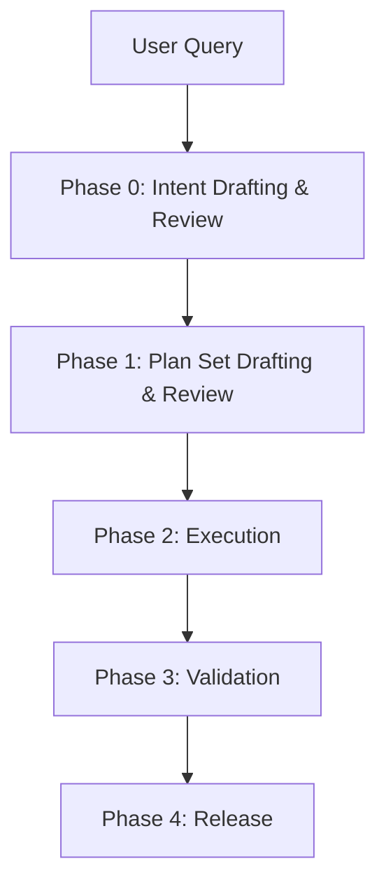

# Agent Workflow: From Intent to Release

> Local implementation note (2026-03-13)
>
> Libra currently supports explicit objective kinds (`implementation` /
> `analysis`). Code-changing objectives may now run concurrently inside
> task-specific linked worktrees, with successful results replayed back
> into the primary workspace after conflict checks.


This document defines the runtime workflow after the snapshot / event /
Libra split described in `docs/agent.md`.

## Workflow Contract

- `git-internal` snapshot objects store immutable definitions and
  revisioned structure.
- `git-internal` event objects store append-only execution facts.
- Libra owns mutable runtime state: scheduler queues, thread /
  workspace state, selected plan set heads, live context window, and reverse
  indexes.

The workflow must not depend on rewriting parent snapshot objects to
append runtime history.

## Phase-to-Layer Mapping

| Phase | Libra runtime / projection | Snapshot writes (`git-internal`) | Event writes (`git-internal`) |
|---|---|---|---|
| Phase 0 | Thread bootstrap, current intent revision, IntentSpec review, live context bootstrap | `Intent`, optional `ContextSnapshot` | `ToolInvocation`, `ContextFrame`, optional terminal `Decision` / `IntentEvent` |
| Phase 1 | selected plan set heads, current plan heads, plan-set review, ready queue preview | `Plan`, `Task` | `ToolInvocation`, `ContextFrame`, optional terminal `Decision` / `IntentEvent` |
| Phase 2 | live context window, stage-gated DAG staging area, retry / replan / rework loop | `Run`, `PatchSet`, `Provenance` | `TaskEvent`, `RunEvent`, `PlanStepEvent`, `ToolInvocation`, `Evidence`, `ContextFrame`, `RunUsage` |
| Phase 3 | audit indexing, release candidate view, test-plan sufficiency routing | optional final `ContextSnapshot` | `Evidence`, `Decision`, terminal `TaskEvent` / `RunEvent` / `IntentEvent` |
| Phase 4 | review UI, current thread / workspace pointers | none | `Decision`, optional terminal `IntentEvent` |

## Workflow Overview



```text
══════════════════════════════════════════════════════════════════
 Phase 0: Intent Drafting & Review
 ══════════════════════════════════════════════════════════════════
 User Query
 ↓
 ├─ Normalize input into local IntentSpec Draft
 ├─ Persist root draft Intent or draft revision
 ├─ Call provider to refine IntentSpec
 │    - readonly tools only
 │    - ToolInvocation / ContextFrame are persisted
 ├─ Render IntentSpec Markdown review
 │    - Confirm / Modify / Cancel
 ├─ Optionally persist initial ContextSnapshot
 └─ Initialize / refresh Libra runtime context
      - Thread projection
      - Scheduler bootstrap
      - live context window
      - reverse indexes for retrieval

══════════════════════════════════════════════════════════════════
 Phase 1: Plan Set Drafting & Review
 ══════════════════════════════════════════════════════════════════
 confirmed Intent[S] + runtime context[Libra]
 ↓
 [Scheduler]
 ├─ Call provider to generate plan set
 │    - readonly tools only
 │    - ToolInvocation / ContextFrame are persisted
 ├─ Create Plan snapshot(s)
 │    - Plan.parents expresses replan / merge history
 │    - Plan.steps captures immutable step structure
 │    - Exactly one `execution` plan and one `test` plan
 ├─ Create Task snapshots for delegated work units
 ├─ Render Plan Set Markdown review
 │    - Execute / Modify Plan / Revise Intent / Cancel
 └─ Libra derives:
      - selected plan set heads
      - current plan heads
      - ready queue preview
      - checkpoints

══════════════════════════════════════════════════════════════════
 Phase 2: Execution
 ══════════════════════════════════════════════════════════════════
 For each ready Task / PlanStep:
 ├─ Libra prepares runtime context
 │    - load prerequisite outputs
 │    - merge selected ContextFrame records
 │    - retrieve code/docs/history
 │    - provision sandbox + task worktree
 │    - stage sandbox state
 │
 ├─ Persist Run snapshot + Provenance snapshot
 │
 ├─ Append execution facts
 │    - TaskEvent / RunEvent
 │    - PlanStepEvent
 │    - ToolInvocation
 │    - Evidence
 │    - ContextFrame
 │    - RunUsage
 │
 ├─ Persist candidate outputs as immutable PatchSet snapshots
 │
 └─ Libra maintains mutable control state
      - retry counters
      - staging area
      - batch integration state
      - replanning decisions

══════════════════════════════════════════════════════════════════
 Phase 3: Validation & Audit
 ══════════════════════════════════════════════════════════════════
 ├─ Run system-level validation and security audit
 ├─ Append Evidence / RunEvent / TaskEvent / Decision records
 ├─ Optionally persist final ContextSnapshot
 └─ Libra reconstructs release candidate and audit views from
      immutable snapshots + events

══════════════════════════════════════════════════════════════════
 Phase 4: Decision & Release
 ══════════════════════════════════════════════════════════════════
 ├─ Low risk: auto-merge
 ├─ High risk: human review in Libra UI
 ├─ Record final Decision / IntentEvent if applicable
 └─ Libra advances current thread / workspace pointers
```

## Libra Thread Projection and Scheduler State

Thread and Scheduler state belong to Libra, not to `git-internal`
snapshots. They track the current conversational view and current
execution view over immutable objects.

### Thread projection

| Field | Type | Description |
|---|---|---|
| `thread_id` | `Uuid` | Libra-side primary key. |
| `title` | `Option<String>` | Human-readable thread title. |
| `owner` | `ActorRef` | Conversation creator. |
| `participants` | `Vec<ThreadParticipant>` | Agent + human members with thread-local role and join time metadata. |
| `current_intent_id` | `Option<Uuid>` | Intent currently focused by the UI / scheduler. |
| `latest_intent_id` | `Option<Uuid>` | Most recently linked Intent revision; default resume fallback when no explicit current intent is selected. |
| `intents` | `Vec<ThreadIntentRef>` | Ordered Intent membership list; each entry carries `intent_id`, `ordinal`, `is_head`, `linked_at`, and `link_reason`. |
| `metadata` | `Option<serde_json::Value>` | Routing and UI hints. |
| `archived` | `bool` | Read-only marker for closed threads. |

- `ThreadParticipant` extends `ActorRef` with `role` and `joined_at`.
- `ThreadIntentRef.is_head` marks current branch heads in the projected Intent DAG; the projection does not keep a separate `head_intent_ids` array.

### Scheduler state

| Field | Type | Description |
|---|---|---|
| `selected_plan_ids` | `Vec<Uuid>` | Current canonical plan set heads in the UI; exactly two ids in stable order: `[execution_plan_id, test_plan_id]`. |
| `current_plan_heads` | `Vec<Uuid>` | Active plan leaves under review or execution. |
| `active_task_id` | `Option<Uuid>` | Task currently emphasized by the scheduler / UI. |
| `active_run_id` | `Option<Uuid>` | Live execution attempt, if any. |
| `live_context_window` | `Vec<Uuid>` | Current visible `ContextFrame` ids. |

### Projection relation graph

```text
Thread[L] --------current_intent_id-> Intent[S]
Thread[L] --------latest_intent_id--> Intent[S]
Thread[L] --------intents[].intent_id> Intent[S]
Thread[L] --------intents[].is_head--> marks current branch heads

Scheduler[L] ----selected_plan_ids--> Plan[S]
Scheduler[L] ----current_plan_heads-> Plan[S]
Scheduler[L] ----active_task_id-----> Task[S]
Scheduler[L] ----active_run_id------> Run[S]
Scheduler[L] ----live_context_window> ContextFrame[E]
```

### Projection rebuild policy

1. Libra creates / updates Thread rows and Scheduler state when new
   Intents, Plans, Tasks, and Runs appear.
2. Rebuild is always possible from immutable `Intent`, `Plan`, `Task`,
   `Run`, `ContextFrame`, and related event streams.
3. Missing projection rows must not block read access; Libra can rebuild
   from object history.

## Phase 0: Intent Drafting & Review

The entry point transforms raw user input into a reviewed `IntentSpec`,
not a final execution plan.

1. **Local Draft Assembly**:
   - Analyze the `User Query` to identify the user goal, constraints,
     quality requirements, and initial risk view.
   - Produce a local `IntentSpec Draft`.

2. **Intent Snapshot Bootstrap**:
   - New threads persist a root draft `Intent` snapshot first; its UUID
     becomes the canonical `thread_id`.
   - Refinements persist new `Intent` revisions linked through
     `Intent.parents`.

3. **Provider-Assisted Intent Refinement**:
   - Send the draft + feedback to the provider to refine `IntentSpec`.
   - Provider may call readonly tools only.
   - Readonly analysis facts are persisted as `ToolInvocation` and
     `ContextFrame` events.

4. **Intent Review Loop**:
   - Render the provider result as Markdown for developer review.
   - Developer may `Confirm`, `Modify`, or `Cancel`.
   - `Modify` stays inside Phase 0 and creates a new `Intent`
     revision.
   - If the UI offers "try again" / "regenerate" affordances, they are
     modeled as `Modify` without introducing a separate workflow state.
   - `Cancel` appends terminal `Decision` / `IntentEvent` and ends the
     thread before planning.

5. **Environment Setup**:
   - Persist an initial `ContextSnapshot` only when a stable baseline is
     worth keeping.
   - Initialize or refresh Libra Thread state, Scheduler state, reverse
     indexes, and the live context window using the confirmed `Intent`.

## Phase 1: Plan Drafting & Review

The Scheduler translates the confirmed `Intent` revision into reviewed
plan and task definitions, while Libra derives the mutable planning
view.

Implementation note: the current generic TUI path is a transitional
single execution-plan path while the full execution/test dual-plan
Scheduler cutover is in progress. Even in that path, provider output is
only a draft; Libra persists a formal `Plan(role=execution)` and matching
`Task` snapshots, and every `Task.origin_step_id` must point to the
persisted `Plan.steps[*].step_id`.

1. **Plan Construction**:
   - Read the confirmed `Intent` snapshot and relevant context material.
   - Call the provider to generate a plan candidate; provider may call
     readonly tools only.
   - Persist readonly analysis facts as `ToolInvocation` /
     `ContextFrame`.
   - Persist base `Plan` snapshots:
     - `Plan.intent` links the Plan to its `Intent`.
     - `Plan.parents` records replan or merge history.
     - `Plan.steps` defines immutable step structure.
   - The reviewable current set must contain exactly two heads:
     one `execution` plan and one `test` plan. Revisions replace one side
     or both sides of that pair without introducing additional plan roles.

2. **Task Construction**:
   - Persist `Task` snapshots for delegated work units.
   - `Task.dependencies`, `Task.parent`, `Task.intent`, and
     `Task.origin_step_id` remain immutable provenance links.

3. **Plan Review Loop**:
   - Render the current dual plan (`execution` + `test`) as Markdown for developer review.
   - Developer may `Execute`, `Modify Plan`, `Revise Intent`, or
     `Cancel`.
   - `Modify Plan` stays inside Phase 1 and creates new `Plan` / `Task`
     revisions.
   - `Revise Intent` returns to Phase 0 to create a new `Intent`
     revision.
   - `Cancel` appends terminal `Decision` / `IntentEvent` and ends the
     thread before execution.

4. **Scheduler Projection**:
   - Libra derives the runtime Task graph, checkpoints, ready queue
     preview, and the selected execution/test plan heads from `Plan` + `Task` snapshots.
   - There is no mutable `ExecutionPlan` object in `git-internal`.

## Phase 2: Execution

The Scheduler executes ready Tasks in topological order using a
conservative two-stage policy: first run `execution_dag` built from the
selected `execution` plan, then cross a stage barrier, then run
`test_dag` built from the selected `test` plan. All mutable coordination
remains in Libra.

### For each ready Task

0. **Stage-Gated Plan Set**:
   - Phase 2 always starts with exactly two selected plans:
     `execution` and `test`.
   - Libra compiles and runs `execution_dag` first.
   - Only after required execution work completes does Libra compile and
     run `test_dag`.
   - No cross-plan DAG edges are allowed in this baseline policy.
   - The `test` plan is still a planner-defined task DAG. It is executed
     in Phase 2, even though its outputs become validation `Evidence`.
     Phase 3 consumes those artifacts; it does not execute this second
     plan itself.

1. **Runtime Context Preparation**:
   - Load prerequisite outputs from immutable `PatchSet`,
     `ContextSnapshot`, and `ContextFrame` records.
   - Merge branch-local context in Libra when branches inside the current stage
     converge.
   - Provision task-local `Sandbox` and `Worktree` through Libra-owned
     execution environment services.
   - Detect conflicts in Libra. Auto-resolve when safe; otherwise
     suspend for human review.

2. **Run Start**:
   - Persist a `Run` snapshot for the execution attempt.
   - Persist `Provenance` for provider / model / parameter settings.
   - Append initial `TaskEvent` / `RunEvent` entries for execution
     start.

3. **Code Generation and Tool Use**:
   - The Coder Agent invokes tools inside the Libra-provided sandbox and
     task worktree.
   - Each tool call is stored as a `ToolInvocation` event.
   - New incremental context is stored as immutable `ContextFrame`
     events, not by mutating a shared pipeline object.
   - Sandbox execution facts and worktree sync results are captured by
     Libra and persisted into the immutable audit trail.

4. **Verification Loop**:
   - Static checks, tests, logic review, and security checks produce
     `Evidence` events.
   - Step progress is recorded via `PlanStepEvent`, including
     `consumed_frames` and `produced_frames`.
   - Failures append more `RunEvent` / `TaskEvent` records.
   - Retry counters and retry routing remain in Libra.
   - If execution changes the remaining strategy, persist a new `Plan`
     revision rather than mutating the old one.

5. **Patch Production**:
   - Each candidate diff is stored as a new immutable `PatchSet`
     snapshot with its own `sequence`.
   - Acceptance, rejection, or final selection is not written back onto
     the `PatchSet`; it is expressed later by `Decision`.

6. **Usage and Cost Capture**:
   - Persist `RunUsage` after the attempt or batch completes.

7. **Phase 2 Rework Loop**:
   - If Phase 3 reports that the test plan is insufficient,
     Libra routes back into Phase 2 with validator evidence.
   - Libra may append new `Plan` / `Task` revisions for execution or test
     work under the already confirmed Intent and restart the
     `execution_dag -> test_dag` sequence before re-running execution.

### Incremental Integration (Post-Batch)

After a stage batch completes:

1. **Batch Merge in Libra**:
   - Libra merges staging PatchSets from task worktrees into the main
     sandbox view.
   - Libra validates interface contracts and runs batch integration
     tests.

2. **Immutable Audit Trail**:
   - Integration verification emits `Evidence` and, if needed,
     additional `RunEvent` / `TaskEvent` records.
   - If the remaining graph is no longer valid, persist a new `Plan`
     snapshot revision and update Libra scheduler state.

## Phase 3: System-level Validation and Audit

Once all planned work is complete, the system performs release-level
validation and assembles the final audit chain.

Boundary rule:
- If the system is still executing a task to produce or repair a
  candidate result, it remains in Phase 2.
- If the system is executing the Phase 1 `test` / verification plan,
  it also remains in Phase 2. That plan is the second selected plan in
  the Phase 2 `execution_dag -> test_dag` sequence, not the Phase 3
  audit pipeline.
- Once the system starts evaluating the aggregated release candidate as
  a whole, it has entered Phase 3.
- Phase 3 does not build or execute a planner-defined DAG; it runs a
  fixed validator pipeline over the release candidate.

1. **Global Validation**:
   - Run end-to-end tests, performance benchmarks, and compatibility
     checks.
   - Record results as `Evidence`.

2. **Security Audit**:
   - Run full SAST, full SCA, and focused security / compliance checks.
   - Record findings as `Evidence`.
   - If issues are caused by insufficient testing or validator-detected
     fixable gaps, Libra writes Phase 2 rework facts and re-enters the
     Scheduler through Phase 2.
   - If issues require broader replanning, Libra writes replan facts and
     re-enters through Phase 1.
   - If issues are blocking, Libra preserves the candidate and enters
     Phase 4 human review instead of silently continuing execution.

3. **Final Snapshot / Event Assembly**:
   - Persist a final `ContextSnapshot` when a stable release candidate
     snapshot is needed.
   - Append terminal `RunEvent`, `TaskEvent`, and optional `IntentEvent`
     records.
   - The audit chain is reconstructed from immutable objects:
     `Intent` -> `Plan` -> `Task` -> `Run` -> `PatchSet` /
     `Evidence` / `Decision` / `ContextFrame`.

## Phase 4: Decision and Release

The final gate decides whether the release candidate is accepted.

1. **Risk Aggregation**:
   - Libra combines the original request risk, execution findings,
     validation evidence, and scope of change into the current review
     view.

2. **Decision Path**:
   - **Low Risk -> Auto-Merge**:
     - create the final repository commit,
     - persist `Decision`,
     - optionally append an `IntentEvent` for completion,
     - advance Thread / Scheduler state in Libra.
   - **High Risk -> Human Review**:
     - Libra presents change summary, audit chain, evidence, and impact
       analysis,
     - reviewer chooses approve / reject / request changes,
     - approval persists `Decision` and advances Libra projections.

## Summary Rule

```text
1. Snapshot stores "what it is"
2. Event stores "what happened"
3. Libra stores "what is current"
```
