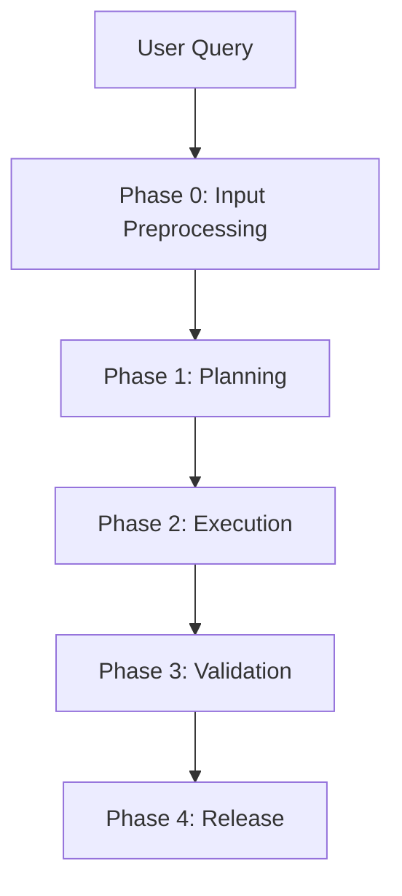

# Agent Workflow: From Intent to Release

This document outlines the lifecycle of an AI agent task execution, from initial user query to final code release. The process is designed to be robust, secure, and verifiable, incorporating automated planning, execution, verification, and auditing.

## Workflow Overview



```text
══════════════════════════════════════════════════════ 
 Phase 0: Input Preprocessing 
 ══════════════════════════════════════════════════════ 
 User Query 
 ↓ 
 ├─ Extract Intent, Constraints, Quality Goals 
 ├─ Identify Risk Level (Affects Human-in-the-loop threshold) 
 └─ Standardized Output: IntentSpec { goal, constraints, risk_level } 
 ↓ 
 ├─ Create Isolated Sandbox Environment 
 ├─ Initialize ContextState (Codebase Snapshot + Dep Graph + Type Info) 
 └─ Lightweight SCA Baseline Scan (Record initial dependency security state) 
 ══════════════════════════════════════════════════════ 
 Phase 1: Planning & Task Graph Generation 
 ══════════════════════════════════════════════════════ 
 IntentSpec + ContextState 
 ↓ 
 [Orchestrator Agent] 
 ├─ Generate TaskGraph (DAG) 
 │    Each Task includes: 
 │    - task_id, description 
 │    - dependencies: [task_id] 
 │    - expected_outputs (Interface contracts for parallel task negotiation) 
 │    - risk_score (Determines if manual review is needed) 
 └─ Output ExecutionPlan { task_graph, parallel_groups, checkpoints } 
 ══════════════════════════════════════════════════════ 
 Phase 2: Task Execution (Main Loop) 
 ══════════════════════════════════════════════════════ 
 Scheduler drives execution in topological order, running independent tasks in parallel: 
 For each ready Task (parallel where dependencies allow): 
 ┌─ [Context Compaction] 
 │   ├─ Load verified state from prerequisite tasks 
 │   ├─ If parallel branches converge: Merge Contexts 
 │   │    Conflict Detection → Conflict Exists → 
 │   │                           ├─ Auto-resolvable → Merge & Continue 
 │   │                           └─ Unresolvable   → Suspend → Human Review 
 │   └─ Inject Incremental ContextDelta (Not full rebuild) 
 │ 
 ├─ [Context Injection]
 │   ├─ Semantic Retrieval of code snippets, docs, historical PatchSets 
 │   └─ Inject Task-level Security Constraints 
 │ 
 ├─ [Coder Agent: Code Generation] 
 │   └─ ToolInvocation → Generate/Modify code in Sandbox 
 │ 
 ├─ [Verification Loop] (3 Layers) 
 │   │ 
 │   ├─ Layer 1: Static Verification 
 │   │   ├─ Compilation Check 
 │   │   ├─ Linter / Type Check 
 │   │   ├─ Lightweight SAST (Scan only changed files) 
 │   │   └─ Incremental SCA (Check only new/changed deps) 
 │   │ 
 │   ├─ Layer 2: Dynamic Verification 
 │   │   ├─ Unit Tests (Sandbox) 
 │   │   └─ Logic & Spec Review 
 │   │        Issue Found → Generate ReviewComment → Retry 
 │   │ 
 │   └─ Layer 3: Retry Control 
 │        ├─ Any Layer Fails → Diagnose 
 │        │    └─ Generate Fix Prompt → Return to Code Generation 
 │        │         Retry Count < N → Continue 
 │        │         Retry Count = N → [Final Failure Routing]: 
 │        │              ├─ Downgradable (Non-core Task) → Skip + Warning 
 │        │              ├─ Replannable (Bypassable dep) → Trigger Replan 
 │        │              └─ Blocking Failure → Suspend → Human Intervention 
 │        └─ All Layers Pass → Task Verified 
 │ 
 └─ [Staging & Provenance]
 ├─ Write PatchSet to Task Staging Area (Not merged to Main Sandbox yet) 
 ├─ Update ContextState: ContextState.apply_delta(task_id, patch) 
 └─ Record Task Provenance (Input Snapshot, Exec Chain, Output Hash) 
 ─── After Parallel Task Group Completes ────────────────── 
 [Incremental Integration Verification] (Post-batch, not per-task) 
 ├─ Merge all staging PatchSets in batch → Main Sandbox 
 ├─ Run Interface Contract Verification (Check expected_outputs) 
 ├─ Run Cross-module Integration Test Subset 
 └─ Validation Failed → (Replan remaining tasks) 
 (Triggered after each batch integration) 
 └─ Evaluate if prerequisites for remaining tasks still hold 
 Needed → Revise TaskGraph (Modify unexecuted parts only) 
 Not Needed → Continue to next batch 
 ══════════════════════════════════════════════════════ 
 Phase 3: System-level Verification & Security Audit 
 ══════════════════════════════════════════════════════ 
 [Global Validation] 
 ├─ End-to-End Integration Tests 
 ├─ Performance Benchmarks (Compare vs Baseline, Regression Check) 
 └─ Compatibility Tests (API Backward Compatibility, Data Formats) 
 ↓ 
 ├─ Full SAST (Cover all changed files) 
 ├─ Full SCA (Complete dependency tree review) 
 ├─ IDOR / Injection Risk Scans 
 └─ Compliance Check (License, Privacy Data Handling) 
 │ 
 ↓ Issue Found → Locate Task → Trigger Task-level Fix (Back to Phase 2) 
 ↓ All Pass 
 (Generated only after success) 
 ├─ Aggregate all Task Provenance → Batch-level Complete Exec Chain 
 ├─ Hash & Sign Full ContextState Snapshot 
 ├─ Record: IntentSpec → TaskGraph → PatchSets → TestResults → SecurityReport 
 └─ Write to Append-only Audit Log (Support rollback to any Task boundary) 
 [Documentation Generation] 
 ├─ Auto-generate Change Log based on PatchSet + Task Description 
 └─ Update API Docs, CHANGELOG 
 ══════════════════════════════════════════════════════ 
 Phase 4: Decision & Release 
 ══════════════════════════════════════════════════════ 
 ├─ Aggregate Risk Score (IntentSpec.risk_level + Security Report + Scope) 
 │ 
 ├─ Low Risk → Auto-Merge 
 │    └─ commit → Production Repo + Sync Docs + Trigger CD Pipeline 
 │ 
 └─ High Risk → Human-in-the-loop Review 
 ├─ Show: Change Summary, Exec Chain, Security Report, Impact Analysis 
 ├─ Options: Approve / Reject / Request Changes (Re-exec) 
 └─ Approve → commit → Production Repo + Sync Docs + Trigger CD Pipeline 
```

## Phase 0: Input Preprocessing

The entry point where raw user input is transformed into a structured, actionable specification.

1.  **Intent Extraction**:
    -   Analyzes the `User Query` to identify the functional intent, specific constraints, and quality goals.
    -   Outputs a structured `IntentSpec` containing `{ goal, constraints, risk_level }`.

2.  **Risk Assessment**:
    -   Evaluates the potential impact of the request.
    -   Assigns a risk level (Low, Medium, High) which determines the threshold for human intervention in later stages.

3.  **Environment Setup**:
    -   **Sandbox Creation**: Establishes an isolated environment to prevent side effects during execution.
    -   **Context Initialization**: Captures a snapshot of the codebase, builds a dependency graph, and extracts type information (`ContextState`).
    -   **Baseline SCA**: Performs a lightweight Software Composition Analysis to record the initial security posture of dependencies.

## Phase 1: Planning & Task Graph Generation

The Orchestrator Agent translates the high-level intent into a concrete execution plan.

1.  **Task Graph Generation**:
    -   The Orchestrator takes the `IntentSpec` and `ContextState`.
    -   Generates a **TaskGraph** (Directed Acyclic Graph).
    -   Each Task includes:
        -   `task_id`, `description`.
        -   `dependencies`: List of prerequisite task IDs.
        -   `expected_outputs`: Interface contracts for boundary negotiation between parallel tasks.
        -   `risk_score`: Determines if the specific task requires manual review.

2.  **Execution Plan Output**:
    -   Produces an `ExecutionPlan` containing the `task_graph`, identified `parallel_groups`, and necessary `checkpoints`.

## Phase 2: Task Execution (Main Loop)

The core execution phase where the Scheduler drives the workflow. Tasks are executed in topological order, with independent tasks running in parallel.

### For each ready Task (or Parallel Group):

1.  **Context Compaction**:
    -   Loads the verified state from prerequisite tasks.
    -   **Merge Contexts**: If multiple parallel branches converge, their contexts are merged.
        -   *Conflict Detection*: If conflicts arise, the system attempts automatic resolution. If unsolvable, it suspends for Human Review.
    -   Injects the incremental `ContextDelta` rather than rebuilding the full context.

2.  **Context Injection**:
    -   Retrieves semantically relevant code snippets, documentation, and historical PatchSets.
    -   Injects task-specific security constraints and guidelines into the prompt.

3.  **Code Generation (Coder Agent)**:
    -   The Coder Agent invokes tools to generate or modify code within the sandbox.

4.  **Verification Loop (Three Layers)**:
    -   **Layer 1: Static Verification**:
        -   Compilation checks.
        -   Linter and type checking.
        -   Lightweight SAST (Static Application Security Testing) on changed files.
        -   Incremental SCA on new/changed dependencies.
    -   **Layer 2: Dynamic Verification**:
        -   Runs unit tests in the isolated sandbox.
        -   Performs logical and specification reviews.
        -   *Failure*: Generates a ReviewComment and enters the retry loop.
    -   **Layer 3: Retry Control**:
        -   If any layer fails, the system diagnoses the error and generates a correction prompt.
        -   *Retry Logic*: Returns to Code Generation up to `N` times.
        -   *Final Failure Routing*:
            -   **Downgrade**: If non-core, skip and record a warning.
            -   **Replan**: If dependencies can be bypassed, trigger a replan.
            -   **Block**: If critical, suspend for Human Intervention.
        -   *Success*: Task is marked as verified.

5.  **Staging & Provenance**:
    -   Writes the resulting `PatchSet` to a task-specific staging area (not yet merged to the main sandbox).
    -   Updates `ContextState` via `apply_delta(task_id, patch)`.
    -   Records **Task Provenance**: Input snapshot, execution chain, and output hash.

### Incremental Integration (Post-Batch)

After a group of parallel tasks completes:

1.  **Merge & Verify**:
    -   Merges all staging PatchSets from the batch into the main sandbox.
    -   Validates `expected_outputs` against the interface contracts.
    -   Runs a subset of cross-module integration tests.
    -   *Failure*: Triggers replanning for remaining tasks.

2.  **Dynamic Replanning**:
    -   Evaluates if the prerequisites for the remaining tasks in the graph still hold based on the current `ContextState`.
    -   **Adjust**: Modifies the `TaskGraph` (only unexecuted parts) if necessary.
    -   **Continue**: Proceeds to the next batch if valid.

## Phase 3: System-level Verification & Security Audit

Once all tasks are complete, the system performs a comprehensive validation.

1.  **Global Validation**:
    -   **End-to-End Testing**: Verifies full system flows.
    -   **Performance Benchmarking**: Compares against baselines to detect regressions.
    -   **Compatibility Testing**: Checks API backward compatibility and data formats.

2.  **Security Audit**:
    -   **Full SAST**: Scans all changed files.
    -   **Full SCA**: Reviews the complete dependency tree.
    -   **Risk Scans**: Checks for privilege escalation and injection vulnerabilities.
    -   **Compliance**: Verifies license compliance and privacy data handling.

    *Feedback*: If issues are found, the system locates the specific responsible Task and triggers a fix (returning to Phase 2).

3.  **Finalization & Documentation**:
    -   **Provenance Aggregation**: Combines all Task Provenance records into a batch-level execution chain.
    -   **Snapshot**: Computes a hash of the final `ContextState` and signs it.
    -   **Audit Log**: specific records (`IntentSpec` → `TaskGraph` → `PatchSets` → `TestResults` → `SecurityReport`) are written to an append-only log.
    -   **Doc Generation**: Automatically generates change descriptions, updates API docs, and `CHANGELOG`.

## Phase 4: Decision & Release

The final gatekeeping phase before deployment.

1.  **Risk Aggregation**:
    -   Combines the initial `IntentSpec.risk_level`, the Security Report, and the scope of changes to calculate a final risk score.

2.  **Decision Path**:
    -   **Low Risk → Auto-Merge**:
        -   Commits code to the production repository.
        -   Synchronizes documentation.
        -   Triggers the CD (Continuous Deployment) Pipeline.
    -   **High Risk → Human-in-the-loop Review**:
        -   **Presentation**: Displays change summary, execution chain, security report, and impact analysis to a human reviewer.
        -   **Options**: Approve, Reject, or Request Changes (re-execute with feedback).
        -   **Approval**: Upon approval, proceeds to commit, sync docs, and trigger CD.
