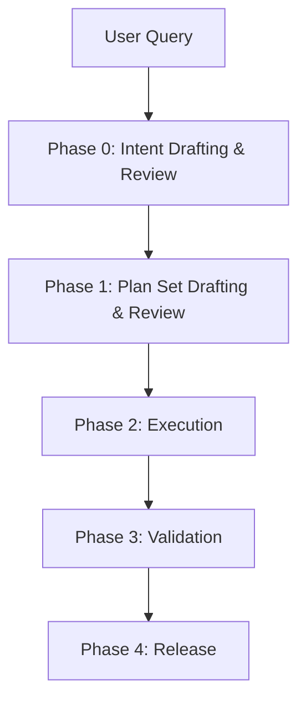

# Agent 工作流：从 Intent 到 Release

> 本地实现说明（2026-03-13）
>
> Libra 目前支持显式的目标类型（`implementation` /
> `analysis`）。更改代码的目标现在可以在任务专属的关联 worktree
> 内并发运行，成功的结果会在冲突检查后回放（replay）到主工作区。
>
> 更新（2026-04-29）：Code-mode 持久化会将已评审的 plan set 写为
> execution/test 的 Plan head，为已执行的 plan task 创建任务级 Run 记录，
> 在 Scheduler state 中物化选定的 plan 对，并从直接的 frame 链接以及
> PlanStepEvent 的 frame 引用重建 ContextFrame 反向索引。Code-mode 的 AI 对象写入
> 经由 `ClientStorage`，因此 `.libra/libra.db` 的 `object_index` 会随 AI
> 历史分支一同填充。


本文档定义了在 `docs/agent.md` 所描述的 snapshot / event /
Libra 拆分之后的运行时工作流。

## 工作流契约

- `git-internal` 的 snapshot 对象存储不可变（immutable）的定义与
  带修订（revisioned）的结构。
- `git-internal` 的 event 对象以追加式（append-only）存储执行事实。
- Libra 拥有可变的运行时状态：scheduler 队列、thread /
  workspace 状态、选定的 plan set head、live context window，以及反向
  索引。

工作流绝不能依赖重写父 snapshot 对象来追加运行时历史。

## Phase 到层的映射

| Phase | Libra 运行时 / 投影（Projection） | Snapshot 写入（`git-internal`） | Event 写入（`git-internal`） |
|---|---|---|---|
| Phase 0 | Thread 引导、当前 intent 修订、IntentSpec 评审、live context 引导 | `Intent`、可选 `ContextSnapshot` | `ToolInvocation`、`ContextFrame`、可选终结性 `Decision` / `IntentEvent` |
| Phase 1 | 选定的 plan set head、当前 plan head、plan-set 评审、ready 队列预览 | `Plan`、`Task` | `ToolInvocation`、`ContextFrame`、可选终结性 `Decision` / `IntentEvent` |
| Phase 2 | live context window、按 stage 设门禁的 DAG 暂存区、retry / replan / rework 循环 | `Run`、`PatchSet`、`Provenance` | `TaskEvent`、`RunEvent`、`PlanStepEvent`、`ToolInvocation`、`Evidence`、`ContextFrame`、`RunUsage` |
| Phase 3 | 审计索引、release candidate 视图、test-plan 充分性路由 | 可选的最终 `ContextSnapshot` | `Evidence`、`Decision`、终结性 `TaskEvent` / `RunEvent` / `IntentEvent` |
| Phase 4 | 评审 UI、当前 thread / workspace 指针 | 无 | `Decision`、可选终结性 `IntentEvent` |

## 工作流概览



```text
══════════════════════════════════════════════════════════════════
 Phase 0: Intent Drafting & Review
 ══════════════════════════════════════════════════════════════════
 User Query
 ↓
 ├─ Normalize input into local IntentSpec Draft
 ├─ Persist root draft Intent or draft revision
 ├─ Call provider to refine IntentSpec
 │    - readonly tools only
 │    - ToolInvocation / ContextFrame are persisted
 ├─ Render IntentSpec Markdown review
 │    - Confirm / Modify / Cancel
 ├─ Optionally persist initial ContextSnapshot
 └─ Initialize / refresh Libra runtime context
      - Thread projection
      - Scheduler bootstrap
      - live context window
      - reverse indexes for retrieval

══════════════════════════════════════════════════════════════════
 Phase 1: Plan Set Drafting & Review
 ══════════════════════════════════════════════════════════════════
 confirmed Intent[S] + runtime context[Libra]
 ↓
 [Scheduler]
 ├─ Call provider to generate plan set
 │    - readonly tools only
 │    - ToolInvocation / ContextFrame are persisted
 ├─ Create Plan snapshot(s)
 │    - Plan.parents expresses replan / merge history
 │    - Plan.steps captures immutable step structure
 │    - Exactly one `execution` plan and one `test` plan
 ├─ Create Task snapshots for delegated work units
 ├─ Render Plan Set Markdown review
 │    - Execute / Modify Plan / Revise Intent / Cancel
 └─ Libra derives:
      - selected plan set heads
      - current plan heads
      - ready queue preview
      - checkpoints

══════════════════════════════════════════════════════════════════
 Phase 2: Execution
 ══════════════════════════════════════════════════════════════════
 For each ready Task / PlanStep:
 ├─ Libra prepares runtime context
 │    - load prerequisite outputs
 │    - merge selected ContextFrame records
 │    - retrieve code/docs/history
 │    - provision sandbox + task worktree
 │    - stage sandbox state
 │
 ├─ Persist Run snapshot + Provenance snapshot
 │
 ├─ Append execution facts
 │    - TaskEvent / RunEvent
 │    - PlanStepEvent
 │    - ToolInvocation
 │    - Evidence
 │    - ContextFrame
 │    - RunUsage
 │
 ├─ Persist candidate outputs as immutable PatchSet snapshots
 │
 └─ Libra maintains mutable control state
      - retry counters
      - staging area
      - batch integration state
      - replanning decisions

══════════════════════════════════════════════════════════════════
 Phase 3: Validation & Audit
 ══════════════════════════════════════════════════════════════════
 ├─ Run system-level validation and security audit
 ├─ Append Evidence / RunEvent / TaskEvent / Decision records
 ├─ Optionally persist final ContextSnapshot
 └─ Libra reconstructs release candidate and audit views from
      immutable snapshots + events

══════════════════════════════════════════════════════════════════
 Phase 4: Decision & Release
 ══════════════════════════════════════════════════════════════════
 ├─ Low risk: auto-merge
 ├─ High risk: human review in Libra UI
 ├─ Record final Decision / IntentEvent if applicable
 └─ Libra advances current thread / workspace pointers
```

## Libra Thread 投影与 Scheduler 状态

Thread 与 Scheduler 状态属于 Libra，而非 `git-internal`
snapshot。它们在不可变对象之上跟踪当前的会话视图与当前的
执行视图。

### Thread 投影

| 字段 | 类型 | 说明 |
|---|---|---|
| `thread_id` | `Uuid` | Libra 侧主键。 |
| `title` | `Option<String>` | 人类可读的 thread 标题。 |
| `owner` | `ActorRef` | 会话创建者。 |
| `participants` | `Vec<ThreadParticipant>` | Agent + 人类成员，携带 thread 本地角色与加入时间元数据。 |
| `current_intent_id` | `Option<Uuid>` | 当前被 UI / scheduler 聚焦的 Intent。 |
| `latest_intent_id` | `Option<Uuid>` | 最近一次链接的 Intent 修订；当未显式选择当前 intent 时作为默认恢复回退。 |
| `intents` | `Vec<ThreadIntentRef>` | 有序的 Intent 成员列表；每个条目携带 `intent_id`、`ordinal`、`is_head`、`linked_at` 与 `link_reason`。 |
| `metadata` | `Option<serde_json::Value>` | 路由与 UI 提示。 |
| `archived` | `bool` | 已关闭 thread 的只读标记。 |

- `ThreadParticipant` 在 `ActorRef` 基础上扩展了 `role` 与 `joined_at`。
- `ThreadIntentRef.is_head` 在投影出的 Intent DAG 中标记当前分支 head；投影不会单独保留一个 `head_intent_ids` 数组。

### Scheduler 状态

| 字段 | 类型 | 说明 |
|---|---|---|
| `selected_plan_ids` | `Vec<Uuid>` | UI 中当前规范的 plan set head；按稳定顺序恰好两个 id：`[execution_plan_id, test_plan_id]`。 |
| `current_plan_heads` | `Vec<Uuid>` | 正在评审或执行的活动 plan 叶子。 |
| `active_task_id` | `Option<Uuid>` | 当前被 scheduler / UI 重点关注的 Task。 |
| `active_run_id` | `Option<Uuid>` | 实时执行尝试（若有）。 |
| `live_context_window` | `Vec<Uuid>` | 当前可见的 `ContextFrame` id。 |

### 投影关系图

```text
Thread[L] --------current_intent_id-> Intent[S]
Thread[L] --------latest_intent_id--> Intent[S]
Thread[L] --------intents[].intent_id> Intent[S]
Thread[L] --------intents[].is_head--> marks current branch heads

Scheduler[L] ----selected_plan_ids--> Plan[S]
Scheduler[L] ----current_plan_heads-> Plan[S]
Scheduler[L] ----active_task_id-----> Task[S]
Scheduler[L] ----active_run_id------> Run[S]
Scheduler[L] ----live_context_window> ContextFrame[E]
```

### 投影重建策略

1. 当新的 Intent、Plan、Task 与 Run 出现时，Libra 创建 / 更新
   Thread 行与 Scheduler 状态。
2. 重建（Rebuild）始终可以从不可变的 `Intent`、`Plan`、`Task`、
   `Run`、`ContextFrame` 及相关 event 流进行。
3. 缺失的投影行不得阻塞读取访问；Libra 可以从对象历史
   进行重建。

## Phase 0：Intent 起草与评审

入口点将原始用户输入转换为一份已评审的 `IntentSpec`，
而非最终执行计划。

1. **Local Draft Assembly**：
   - 分析 `User Query` 以识别用户目标、约束（constraints）、
     质量要求与初始风险（risk）视图。
   - 产出本地的 `IntentSpec Draft`。

2. **Intent Snapshot Bootstrap**：
   - 新 thread 会先持久化一份根草稿 `Intent` snapshot；其 UUID
     成为规范的 `thread_id`。
   - 细化（Refinement）会持久化通过 `Intent.parents` 链接的新
     `Intent` 修订。

3. **Provider-Assisted Intent Refinement**：
   - 将草稿 + 反馈发送给 provider 以细化 `IntentSpec`。
   - provider 只能调用只读（readonly）工具。
   - 只读分析事实被持久化为 `ToolInvocation` 与
     `ContextFrame` 事件。

4. **Intent Review Loop**：
   - 将 provider 结果渲染为 Markdown 供开发者评审。
   - 开发者可以 `Confirm`、`Modify` 或 `Cancel`。
   - `Modify` 仍停留在 Phase 0 内，并创建一个新的 `Intent`
     修订。
   - 如果 UI 提供 “try again” / “regenerate” 的交互方式，它们会被
     建模为 `Modify`，而不引入单独的工作流状态。
   - `Cancel` 追加终结性 `Decision` / `IntentEvent`，并在 planning 之前结束
     thread。

5. **Environment Setup**：
   - 仅当某个稳定基线值得保留时，才持久化初始 `ContextSnapshot`。
   - 使用已确认的 `Intent` 初始化或刷新 Libra Thread 状态、Scheduler 状态、反向
     索引与 live context window。

## Phase 1：Plan 起草与评审

Scheduler 将已确认的 `Intent` 修订转换为已评审的
plan 与 task 定义，同时 Libra 派生出可变的 planning
视图。

实现说明：provider 输出只是草稿。Libra 持久化一份
正式的 execution/test plan set 以及配套的 `Task` snapshot；每个
`Task.origin_step_id` 都必须指向拥有该 task 的 plan 中已持久化的
`Plan.steps[*].step_id`。

1. **Plan Construction**：
   - 读取已确认的 `Intent` snapshot 及相关上下文材料。
   - 调用 provider 生成一个 plan 候选；provider 只能调用
     只读工具。
   - 将只读分析事实持久化为 `ToolInvocation` /
     `ContextFrame`。
   - 持久化基础 `Plan` snapshot：
     - `Plan.intent` 将 Plan 链接到其 `Intent`。
     - `Plan.parents` 记录 replan 或 merge 历史。
     - `Plan.steps` 定义不可变的步骤结构。
   - 可评审的当前集合必须恰好包含两个 head：
     一个 `execution` plan 和一个 `test` plan。修订会替换该对中的
     一侧或两侧，而不引入额外的 plan 角色。

2. **Task Construction**：
   - 为委派的工作单元持久化 `Task` snapshot。
   - `Task.dependencies`、`Task.parent`、`Task.intent` 与
     `Task.origin_step_id` 仍是不可变的 provenance（溯源）链接。

3. **Plan Review Loop**：
   - 将当前双 plan（`execution` + `test`）渲染为 Markdown 供开发者评审。
   - 开发者可以 `Execute`、`Modify Plan`、`Revise Intent` 或
     `Cancel`。
   - `Modify Plan` 仍停留在 Phase 1 内，并创建新的 `Plan` / `Task`
     修订。
   - `Revise Intent` 返回 Phase 0 以创建一个新的 `Intent`
     修订。
   - `Cancel` 追加终结性 `Decision` / `IntentEvent`，并在执行之前结束
     thread。

4. **Scheduler Projection**：
   - Libra 从 `Plan` + `Task` snapshot 派生运行时 Task 图、检查点（checkpoint）、ready 队列
     预览，以及选定的 execution/test plan head。
   - `git-internal` 中不存在可变的 `ExecutionPlan` 对象。

## Phase 2：执行

Scheduler 使用一种保守的两阶段策略，按拓扑顺序执行就绪（ready）的 Task：先运行从
选定 `execution` plan 构建的 `execution_dag`，再越过一道 stage 屏障，然后运行从
选定 `test` plan 构建的 `test_dag`。所有可变的协调（coordination）
都保留在 Libra 中。

### 对每个就绪的 Task

0. **Stage-Gated Plan Set**：
   - Phase 2 始终以恰好两个选定 plan 开始：
     `execution` 与 `test`。
   - Libra 先编译并运行 `execution_dag`。
   - 只有在必需的 execution 工作完成之后，Libra 才会编译并
     运行 `test_dag`。
   - 在此基线策略中不允许跨 plan 的 DAG 边。
   - `test` plan 仍是一个由 planner 定义的 task DAG。它在 Phase 2 中
     执行，尽管其输出会成为验证用的 `Evidence`。
     Phase 3 消费这些产物；它本身并不执行这第二个
     plan。

1. **Runtime Context Preparation**：
   - 从不可变的 `PatchSet`、
     `ContextSnapshot` 与 `ContextFrame` 记录加载前置输出。
   - 当当前 stage 内的分支收敛时，在 Libra 中合并分支本地的
     上下文。
   - 通过 Libra 拥有的执行环境服务，为任务配备任务本地的
     `Sandbox` 与 `Worktree`。
   - 在 Libra 中检测冲突。安全时自动解决；否则
     挂起以供人工评审。

2. **Run Start**：
   - 为该执行尝试持久化一个 `Run` snapshot。
   - 为 provider / model / 参数设置持久化 `Provenance`。
   - 追加初始的 `TaskEvent` / `RunEvent` 条目以标记执行
     开始。

3. **Code Generation and Tool Use**：
   - Coder Agent 在 Libra 提供的 sandbox 与任务
     worktree 内调用工具。
   - 每次工具调用都被存储为一个 `ToolInvocation` 事件。
   - 新增的增量上下文被存储为不可变的 `ContextFrame`
     事件，而不是通过修改某个共享流水线对象。
   - Sandbox 执行事实与 worktree 同步结果由
     Libra 捕获，并持久化进不可变的审计轨迹。

4. **Verification Loop**：
   - 静态检查、测试、逻辑评审与安全检查产生
     `Evidence` 事件。
   - 步骤进度通过 `PlanStepEvent` 记录，包括
     `consumed_frames` 与 `produced_frames`。
   - 失败会追加更多 `RunEvent` / `TaskEvent` 记录。
   - 重试计数器与重试路由保留在 Libra 中。
   - 如果执行改变了剩余策略，应持久化一个新的 `Plan`
     修订，而不是修改旧的修订。

5. **Patch Production**：
   - 每个候选 diff 都被存储为一个新的不可变 `PatchSet`
     snapshot，带有自己的 `sequence`。
   - 验收（acceptance）、拒绝或最终选择不会被写回到
     `PatchSet` 上；它稍后通过 `Decision` 表达。

6. **Usage and Cost Capture**：
   - 在尝试或批次完成后持久化 `RunUsage`。

7. **Phase 2 Rework Loop**：
   - 如果 Phase 3 报告 test plan 不充分，
     Libra 会携带 validator 证据（evidence）路由回 Phase 2。
   - Libra 可以在已确认的 Intent 之下为 execution 或 test
     工作追加新的 `Plan` / `Task` 修订，并在重新运行执行之前重新启动
     `execution_dag -> test_dag` 序列。

### 增量集成（批次后）

在一个 stage 批次完成之后：

1. **Batch Merge in Libra**：
   - Libra 将来自任务 worktree 的 staging PatchSet 合并到主
     sandbox 视图中。
   - Libra 校验接口契约并运行批次集成
     测试。

2. **Immutable Audit Trail**：
   - 集成验证发出 `Evidence`，并在必要时发出
     额外的 `RunEvent` / `TaskEvent` 记录。
   - 如果剩余的图不再有效，应持久化一个新的 `Plan`
     snapshot 修订并更新 Libra scheduler 状态。

## Phase 3：系统级验证与审计

一旦所有已计划的工作完成，系统将执行 release 级别的
验证并装配最终的审计链。

边界规则：
- 如果系统仍在执行某个任务以产出或修复
  候选结果，它仍处于 Phase 2。
- 如果系统正在执行 Phase 1 的 `test` / 验证 plan，
  它同样仍处于 Phase 2。该 plan 是 Phase 2
  `execution_dag -> test_dag` 序列中第二个选定的 plan，而非 Phase 3
  的审计流水线。
- 一旦系统开始将聚合后的 release candidate 作为
  整体进行评估，它就进入了 Phase 3。
- Phase 3 不构建或执行由 planner 定义的 DAG；它在 release candidate 之上
  运行一条固定的 validator 流水线。

1. **Global Validation**：
   - 运行端到端测试、性能基准与兼容性
     检查。
   - 将结果记录为 `Evidence`。

2. **Security Audit**：
   - 运行完整 SAST、完整 SCA 以及聚焦的安全 / 合规检查。
   - 将发现记录为 `Evidence`。
   - 如果问题是由测试不足或 validator 检测到的
     可修复缺口造成的，Libra 会写入 Phase 2 rework 事实并
     通过 Phase 2 重新进入 Scheduler。
   - 如果问题需要更大范围的 replan，Libra 会写入 replan 事实并
     通过 Phase 1 重新进入。
   - 如果问题是阻断性的，Libra 会保留候选并进入
     Phase 4 人工评审，而不是悄无声息地继续执行。

3. **Final Snapshot / Event Assembly**：
   - 当需要一份稳定的 release candidate snapshot 时，持久化一个最终的
     `ContextSnapshot`。
   - 追加终结性的 `RunEvent`、`TaskEvent` 与可选的 `IntentEvent`
     记录。
   - 审计链从不可变对象重建：
     `Intent` -> `Plan` -> `Task` -> `Run` -> `PatchSet` /
     `Evidence` / `Decision` / `ContextFrame`。

## Phase 4：决策与 Release

最终门禁（gate）决定 release candidate 是否被接受。

1. **Risk Aggregation**：
   - Libra 将原始请求风险、执行发现、
     验证证据与变更范围合并进当前评审
     视图。

2. **Decision Path**：
   - **Low Risk -> Auto-Merge**：
     - 创建最终的仓库提交，
     - 持久化 `Decision`，
     - 可选地为完成追加一个 `IntentEvent`，
     - 在 Libra 中推进 Thread / Scheduler 状态。
   - **High Risk -> Human Review**：
     - Libra 呈现变更摘要、审计链、证据与影响
       分析，
     - 评审者选择 approve / reject / request changes，
     - 批准会持久化 `Decision` 并推进 Libra 投影。

## 总结规则

```text
1. Snapshot stores "what it is"
2. Event stores "what happened"
3. Libra stores "what is current"
```
