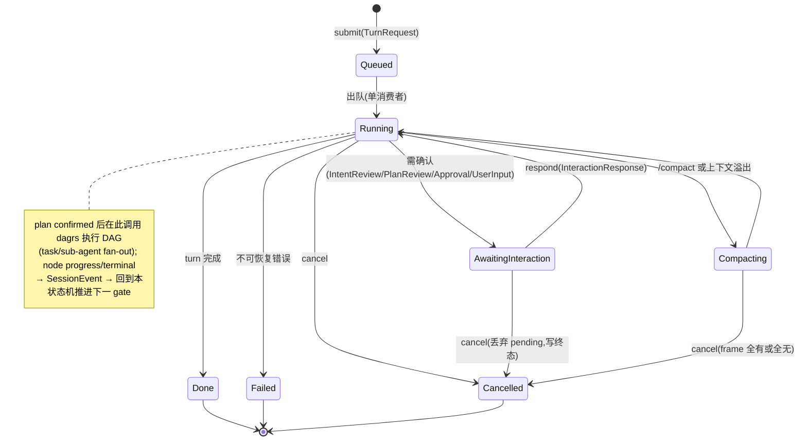

# `libra code` Agent framework 与 Web-only 迁移计划

> Status: draft
> Last updated: 2026-06-03 (post-review: 补充与主计划对齐、当前模块基线、行为清单种子、迁移期 TUI 委托模型、AG-10/AG-07 顺序校准、控制面迁移细节，补充/compact及UI渲染类行为到种子清单、明确 mcp/code-control 相关的兼容性测试和配置校验更新细节、规范 Graph API 的 loopback 与 token 鉴权机制；2026-06-03 follow-up: 对照 c4pt0r/pie 架构补齐 runtime queue/dagrs-backed state machine、event log/projection、session-scoped automation、compaction、permission gate 和 adapter-thinness 验收；明确状态机继续使用 dagrs 0.8.1；2026-06-03 review#2: 基于 `pie` 实际 crate 分解（`ai` 纯流式 crate + `faux` mock、`agent` 的 `agent_loop.rs` + 160KB `agent_harness.rs` 组合层、`coding-agent` 单一 `agent_session.rs` 同时驱动终端 `ui/mod.rs` 与 `ui/web.rs`、`triggers/{dynamic,cron}.rs` 作为 turn-queue producer、session storage/repo 分离、`env/native.rs` 可替换执行环境）深化对照；**修正 dagrs 适用范围**——经核对 dagrs 仅驱动执行/任务 DAG（`orchestrator/executor.rs` + `node_adapter.rs`，已落地），而交互式 Intent/Plan/Approval gate 当前是 `tui/app.rs` 字段散落的 async 状态（`pending_intent_review`/`pending_plan_revision`），目标是序列化 typed turn/interaction 状态机而非 dagrs 图；新增 turn 生命周期状态图、event-log/cursor/snapshot-as-fold 投影契约、Codex 事件归一约束、sub-agent 回写与 cancel 矩阵、harness 作为被持有结构 `CodeAgentServices`；review#2 决策已锁定: event id = per-session u64 序号、交互状态机 = 手写 typed enum 复用 WorkflowPhase(+InteractionKind)、Codex 归一以 Completion 形状为正典、补两类状态机 mermaid 状态转移图)
> Control-plane correction (2026-06-04): 停止把 TUI/MCP 作为 Agent 操作入口；`libra code` 只保留 Web Code UI，外部调度参考 Codex 通过 WebSocket 进入 AgentRuntime。MCP stdio 独立命令拆分见 [`mcp.md`](mcp.md)。
> Scope: 先设计并落地独立 Agent framework，再迁移 TUI-owned 行为，最后移除 Code TUI 并让 Web Code UI 成为唯一交互面。
> Companion docs: Web/runtime 现状见 [`docs/improvement/web.md`](../improvement/web.md)；控制面契约见 [`docs/commands/code-control.md`](../commands/code-control.md)；长期 agent backlog 见 [`docs/improvement/agent.md`](../improvement/agent.md)；本计划是主计划 Part B Implementation Phase 3「Code UI Source Of Truth Unification」及后续 TUI 收口的战术执行蓝图。


## 执行结论

本计划的核心顺序是：

1. 先冻结当前 TUI 行为和测试证据（Phase 0 + AG-00 种子清单）。
2. 设计并落地 UI-neutral Agent framework（**收敛现有模块**，AG-01）。
3. 将 `src/internal/tui/app.rs` 中的 agent 行为迁入 Agent framework；TUI 只作为迁移基线和临时测试参照，不再设计成长期 runtime 消费者。
4. 停止让 TUI / MCP 操作 Agent：`libra code` 只保留 Web Code UI 交互面；外部调度参考 Codex，由 WebSocket 连接 Web/AgentRuntime，而不是通过 MCP 调度 Agent。
5. 再把 `libra code` 默认入口切到 Web，并让旧 TUI / `code --stdio` / `code-control` 写入口 fail closed 或迁出。
6. 最后删除 TUI bridge、Code TUI startup、独立 `libra graph` 终端 UI、TUI 专用 PTY harness，以及只为 TUI automation 存在的控制面。

不能先把默认入口改成 Web 后再补 runtime。TUI 现在仍承载 plan workflow、goal、usage、skills、hooks、multi-agent、resume、approval、request_user_input、repair loop 等核心能力；这些能力必须先有 UI-neutral 等价实现，随后直接关闭 TUI 操作面，而不是把 TUI 保留为 AgentRuntime 的正式委托者。

（2026-06-04 修正：早期 phase 只把 TUI 当作行为冻结和回归参照；harness 替换优先用 Web / WebSocket 路径覆盖 runtime，不再新增或延长 TUI-as-adapter 的生产契约。）

**Review 结论（本轮评估）：** 方案方向合理，关键顺序也正确：先冻结 TUI 行为、再抽 UI-neutral runtime、最后切 Web-only。当前文档已覆盖大多数迁移风险，但若直接交给 Agent 实施，仍有三个不足需要固化为执行约束：

- AgentRuntime 内部形态不够具体，容易被实现成一组 trait 壳，实际状态机仍散落在 TUI/Web adapter。
- session event、snapshot、pending interaction、cancel/lease、usage/compaction/audit 的事实源关系需要更明确，否则 Web adapter、遗留 TUI bridge 和 MCP 协议层可能各自维护 projection。
- `pie` 类 agent harness 已证明「provider streaming 层、stateful harness/runtime、thin CLI/TUI」的分层更利于测试和迁移；本计划应吸收这种分层，但不照搬其 workspace crate 拆分。

因此，本计划不新增一个孤立大框架，而是在现有 `src/internal/ai/*` 内收敛为：统一 provider stream、单 runtime turn queue、**序列化 typed turn/interaction 状态机（交互 gate）**、**dagrs-backed 执行/任务 DAG（仅执行阶段的 task/sub-agent fan-out）**、append-only event log、可重放 snapshot/projection（snapshot = fold(events)）、薄 ControlAdapter。后续 AG 卡必须按这些边界验收。

**Review#2 补充（2026-06-03，基于代码核对 + `pie` crate 分解）：** 上一轮已确立分层方向，但若交给 Agent 直接实施，仍有五处需要在交付前固化为硬约束，否则会被实现成「形似分层、实则状态机仍散落」：

1. **dagrs 适用范围必须澄清（最高优先级修正）。** 经 `rg` 核对：dagrs 0.8.1 实际只出现在 `orchestrator/{executor,decider,replan,verifier,…}.rs` 和 `node_adapter.rs`（把 `Agent`/`ToolLoop` 包成 `dagrs::Action` 节点），用于**多 agent 执行/任务 DAG**；`runtime/phase0..4.rs` 只是数据契约（`WorkflowPhase::Intent` 等），**不是** dagrs 执行器；交互式 Intent/Plan/repair workflow 当前是 `tui/app.rs` 的 `pending_intent_review` / `pending_plan_revision` 字段 + async 方法，**从未跑在 dagrs 上**。因此「workflow 必须由 dagrs 驱动」这条旧约束在交互 gate 上是**净新增迁移**而非「继续使用」，且 dagrs（并行 DAG 调度器，`Action::run` 语义）并不适合线性、人工确认、可挂起的交互 gate。本计划据此拆成两类状态机（见下文「两类状态机的边界」）：执行/任务 DAG 继续用 dagrs；交互 turn/plan/approval gate 用序列化 typed 状态机推进，dagrs 只在执行阶段被该状态机调用。
2. **harness 不是「返回一堆 Arc 的函数」，而是被持有的组合结构。** `pie` 的 `agent_harness.rs`（160KB）是整个系统的心脏，它**拥有并装配** session/compaction/permission/skills/system_prompt/trigger/cost。本计划的 `build_code_agent_services` 必须产出一个被 runtime worker 持有、具备明确生命周期（build → run turns → shutdown）的 `CodeAgentServices` 结构，而不是松散返回 12 个 service 句柄后由 adapter 各自拼装——后者正是本计划自己警告的「trait 壳」反模式。
3. **事件日志/游标/投影需要可实现的契约。** snapshot 必须定义为 SessionEvent 的纯 fold（`snapshot = fold(events ≤ cursor)`），event id 单调递增（**已锁定 per-session `u64` 序号**，gap = N+1，见「事件日志、游标与投影」），持久化 JSONL 是 replay 真源、内存 broadcast 仅尽力实时投递；gap recovery 在客户端 cursor 早于内存缓冲时回退读持久化日志。否则「gap recovery」「SSE from cursor」只是口号。
4. **Codex 路径必须归一进同一 runtime event envelope。** 现状 `CodexTaskExecutor` 经 `CodeUiProviderAdapter` 直驱 Codex WS、不走通用 tool loop（`task_executors.rs:6` 注释自述「both providers… Codex and any generic」共用 `TaskExecutor` trait）。执行路径可以不同，但**投影/SSE/snapshot 层必须只看到一套归一事件流**；否则 normalized event stream 名存实亡，Codex 成为平行宇宙。
5. **sub-agent 回写与 cancel 需要显式矩阵。** 并发只在 sub-agent dispatcher 内发生，但「子 agent 事件如何并回主序列投影」「父 turn cancel 时在途子 agent / 待审批 / 待用户输入各自如何收尾」必须写成不变量与测试矩阵，不能留给实现临时决定。

`pie` 的 `coding-agent` 已用**单一 `agent_session.rs` 同时驱动终端 `ui/mod.rs` 和 Web `ui/web.rs`**，是本计划「共享 session driver + 薄 UI」目标的现成存在性证明；本计划应镜像这一 seam，而非自证可行性。

## 目标

- `libra code` 最终只启动 Web Code UI。
- `libra code --web` / `--web-only` 不保留兼容期；默认 Web 切换时同步删除或立即拒绝。
- `libra code --stdio` / `--mcp-stdio` 从 `code` 命令移出；独立 MCP 命令的 CLI / docs / tests 由 [`mcp.md`](mcp.md) 跟踪。
- Browser/automation 写控制只允许 loopback + controller token；非 loopback 仍 fail closed。
- `libra graph` 终端命令删除；thread/version graph 迁入 Web Code UI。
- `src/internal/tui/*` 不再是任何 agent/session 行为的唯一实现位置。

## 非目标

- 不把当前单 crate 立即拆成 workspace 多 crate。
- 不在本计划中实现 Mega 控制面、rk8s worker、分布式调度或企业租户隔离。
- 不开放公网 Web 写控制。
- 不把 Web terminal 做成任意 shell prompt；工具执行仍必须走 ToolRuntime、sandbox、approval 和 policy。
- 不保留第二套终端 graph UI。

## 设计原则

### Agent framework first

Agent framework 是核心行为层，不是 Web-only 的附属实现。它至少包含四个边界：

| 边界 | 职责 | 当前来源 |
|------|------|----------|
| `AgentDefinition` | AgentSpec、persona、prompt/bootstrap、tools、skills、policies、默认模型路由 | `src/internal/ai/agent/`、profiles、commands、skills、prompt/rules loader |
| `AgentPersistence` | session event、checkpoint、thread projection、usage、artifact、memory anchor、audit、lease | `src/internal/ai/session/`、`projection/`、`.libra/libra.db`、JSONL store |
| `AgentRuntime` | turn loop、model router、tool runtime、sandbox/approval、plan workflow、goal、skills、sub-agent/task、hooks、usage、cancel/resume、repair loop | `src/internal/tui/app.rs`、`web/headless.rs`、`orchestrator/`、`goal/`、`tools/` |
| `AgentControlAdapter` | Web UI / WebSocket / HTTP / batch 的 submit/respond/cancel/observe/snapshot/SSE framing；MCP 仅保留 tools/resources 协议能力，不作为 Agent turn 调度面 | `src/internal/ai/web/`、`src/internal/tui/code_ui_adapter.rs`（迁移源，最终删除）、`src/internal/ai/mcp/`（协议层，不拥有 agent turn） |

ControlAdapter 只能转发用户输入、交互响应、取消、观察请求和快照请求；不能拥有 plan workflow、goal lifecycle、usage accounting、skill activation、approval queue 或 session persistence 私有状态机。

AgentRuntime 不是 trait 名字本身，而是一个可独立运行的 harness。最小内部执行模型如下：

```text
AgentRuntimeHandle
  submit(TurnRequest) / respond(InteractionResponse) / cancel(TurnId)
  observe(EventCursor) -> AgentEvent stream
  snapshot() -> AgentSnapshot

AgentRuntimeWorker  (holds one CodeAgentServices)
  serialized turn queue (single consumer; producers: user submit / control submit / trigger / cron / sub-agent promotion)
  turn/interaction state machine  (typed: Queued → Running → AwaitingInteraction → Running → [Compacting] → Terminal{Done|Cancelled|Failed};
                                   the linear, human-gated Intent/Plan/Approval/UserInput flow — a serialized state machine, NOT a dagrs graph)
  interaction gate (Intent/Plan/Approval/UserInput/FirstContact/etc.) — blocks mutating tools until resolved
  dagrs 0.8.1 execution DAG  (invoked ONLY inside the Running/execution phase for task + sub-agent fan-out, via orchestrator + node_adapter — the existing Runtime Foundation; not the interaction gate)
  model stream consumer (Completion/Codex events normalized into ONE runtime event envelope before any state mutation)
  tool scheduler (sandbox/approval/hooks/source/tool policy before execution)
  command service (/goal, /skill, /usage, /compact, /task, future automation)
  append-only SessionEvent writer (monotonic per-session u64 seq; persisted JSONL is replay source of truth; gap = expected N+1)
  projection builder (single fold: AgentSnapshot, CodeUiSessionSnapshot, graph read models all = fold(events))
```

**必须保持的状态不变量：**

- 同一 session 内 turn、trigger、cron、sub-agent promotion、control submit 都进入同一个 serialized queue；并发只允许发生在明确的 sub-agent dispatcher 内，主 session projection 仍按事件顺序提交。sub-agent 在子 run record 内独立运行其 transcript，**只有完成摘要 / patchset / promoted 结果**经 queue 重新进入父 session event log，绝不直接并写主投影。
- **交互 gate 的状态推进**（Intent draft/confirm、Plan draft/confirm、repair、approval、user-input）由 worker 的**序列化 typed 状态机**推进并写 SessionEvent，**不是 dagrs 图**——这是当前 `tui/app.rs` 字段散落逻辑的中立化目标，不允许把它塞进 dagrs，也不允许留在 adapter 私有 enum。
- **执行/任务 DAG**（一个 confirmed plan 内的多 task / sub-agent fan-out）必须继续通过 `dagrs 0.8.1`（`orchestrator/` + `node_adapter.rs`）表达，由交互状态机在 Running 阶段调用；不允许用 ad-hoc enum loop / async select 自行重写第二套并行调度。两类状态机的边界见下文「两类状态机的边界」。
- pending interaction 是 runtime 的阻塞 gate，而不是 UI 的临时变量；未收到确认前不得执行 mutating tools。
- 所有影响未来恢复的事实先写 `SessionEvent` / SQLite runtime 表，再更新 in-memory snapshot；adapter 只消费 snapshot/event，不直接拼接长期状态。
- cancel 必须写入终态事件和 usage failure row，再中断 provider/tool task；不能只 abort JoinHandle。**cancel 收尾矩阵**（必须各有测试）：(a) `Running` 取消正在流式的 turn；(b) `AwaitingInteraction`（intent/plan/approval/user-input）取消——丢弃 pending interaction 并写终态，不得悬挂；(c) 父 turn 取消时**在途 sub-agent** 须被级联中断并写各自子 run 终态，再写父终态；(d) `Compacting` 取消须保证 compaction event 要么完整写入要么不写，不留半截 context frame。
- compaction 是 append-only event + 新 context frame，不重写历史 transcript；Web 与迁移期 TUI 回归参照只显示压缩后的 projection。
- approval、sandbox、allowed-tools、network policy、SourcePool trust、hook execution 是 tool scheduler 的前置 gate，不能分散到 Web 或遗留 TUI bridge 控制面。

#### 两类状态机的边界（review#2 新增，必须遵守）

本计划区分**两类**状态机，二者不可混为一谈，这是上一轮文档最容易被实现跑偏的地方：

| | 交互 turn/interaction 状态机 | 执行/任务 DAG |
|---|---|---|
| 形态 | 单 session 内**线性、人工确认、可挂起**：Queued → Running → AwaitingInteraction → Running → [Compacting] → Terminal | 一个 confirmed plan 内的**并行 task / sub-agent fan-out**，有依赖边 |
| 实现 | worker 持有的**手写 typed enum**（复用 `WorkflowPhase` 词汇 + 交互 gate 维度，见下图），零新依赖；推进即写 `SessionEvent`，由 projection 产出 pending interaction | `dagrs 0.8.1` 图执行器（`orchestrator/executor.rs` + `node_adapter.rs` 的 `AgentAction`/`ToolLoopAction`） |
| 当前位置 | `tui/app.rs` 的 `pending_intent_review` / `pending_plan_revision` 字段 + async 方法（**尚未中立化**，AG-03 迁出目标） | 已落地的 Runtime Foundation（**保留**，不重写） |
| 是否 dagrs | **否**——dagrs 的 `Action::run` 是并行节点语义，不适合人工 gate / 挂起 / 单步确认 | **是**——这是 dagrs 的本职场景 |

调用关系：交互状态机进入 `Running` 且 plan 已 confirmed 后，**在执行子阶段调用** dagrs 执行 task DAG；dagrs 节点的 progress / terminal report 被翻译回 `SessionEvent`，交互状态机据此推进到下一个 gate 或 Terminal。**任何一方都不得越界**：交互状态机不并行调度 task，dagrs 不表达 intent/plan/approval 确认流。

**本轮评审决策（已锁定）：** 交互状态机用 worker 内**手写 typed enum**，不引入 statechart crate。状态分两个**正交维度**——**控制轴**（turn 生命周期：Queued / Running / AwaitingInteraction / Compacting / Terminal）× **workflow 轴**（直接复用现有 `WorkflowPhase` = Intent / Planning / Execution / Validation / Decision，`runtime/contracts.rs:484`）；`AwaitingInteraction` 携带 `InteractionKind`（IntentReview / PlanReview / Approval / UserInput / FirstContact）。两轴正交，例如「Running × Planning」「AwaitingInteraction(PlanReview) × Planning」。复用 `WorkflowPhase` 避免与既有 runtime 契约出现两套词汇。

控制轴状态转移（执行 DAG 在 `Running` 阶段被调用，不是独立状态）：



> 旧文档中「workflow 必须由 dagrs 驱动」凡指 **intent/plan/approval 交互流** 处，一律按本节理解为「序列化 typed 状态机」；凡指 **plan 内 task/sub-agent 执行** 处，才是 dagrs。AG-01/AG-03 的「dagrs 合同测试」只覆盖执行 DAG，不要求把交互 gate 塞进 dagrs。

#### 事件日志、游标与投影（snapshot = fold(events)）

为让 SSE gap recovery、resume、TUI/Web 一致投影可实现而非口号，固定以下契约：

- **单调 event id（已锁定 = per-session `u64` 序号）：** 每个 `SessionEvent` 带单 session 内单调递增的 `u64` 序号（serialized 单写者保证连续）；gap 检测即「期望 N+1」，cursor 就是该序号。append-only 持久化 JSONL（`session/jsonl.rs`）是 replay 的唯一真源。（评审决策：选 u64 序号而非 uuidv7——单 session 单写者下序号的 gap recovery 最简、仅凭 N+1 即可判漏；uuidv7 仅凭 id 无法判漏。）
- **snapshot 是纯 fold：** `AgentSnapshot` / `CodeUiSessionSnapshot` / graph read model 都由**同一个 projection builder** 对 `events ≤ cursor` 做 fold 得到，没有第二条写路径。adapter 永远不直接拼装长期状态。
- **live 通道是尽力投递：** 内存 broadcast channel 只负责把新事件推给在线订阅者；它**不是**真源，丢失不影响正确性。
- **gap recovery 规则：** 客户端用 `since_event_id` 订阅。若该 id 仍在内存缓冲 → 直接续发（no-gap replay）；若早于缓冲下界 → 回退读持久化日志补发，或返回明确的 `snapshot refresh`（让客户端重取 snapshot+cursor）；若 id 不存在/过旧无法定位 → fail-closed 返回 gap-too-old。三条路径都必须有测试（对应 AG-05 的 SSE 重连矩阵）。
- **Codex 归一（已锁定 = 复用 Completion 形状）：** 以通用 tool-loop 已产出的 normalized model event 形状为**正典**，Codex WS 事件映射进该形状，再进 event log / projection / SSE；投影层不感知 provider 差异（对应 `pie` 的 `ai::event_stream`，见「Codex 路径」约束）。

**TUI 迁移模型（关键）：** 在 Gate 2 完成前，TUI `App` 只作为行为冻结、回归对照和迁移源存在。它必须从「拥有全部 agent 状态机」迁出到中立 runtime；迁移完成后不再把 TUI 设计成可用交互面或 AgentRuntime 委托者。AG-01/AG-02 可以保留最小测试桩证明「不构造 TUI App 也能跑完整 workflow」，但该桩只能服务迁移验证，不能成为生产路径或新的长期 adapter。

### `pie` 架构对照与取舍

参考 [`c4pt0r/pie`](https://github.com/c4pt0r/pie) 后，本计划采用其分层思想，但不照搬其 workspace 多 crate 拆分。`pie` 实际是 4 个 crate（`ai` / `agent` / `coding-agent` / `mcp`），下表按**真实 crate 分解**对照（旧版本用了 `pie-ai`/`pie-agent-core` 等臆造名，已更正）：

| `pie` 真实层次 | 关键文件/证据 | 可借鉴点 | Libra 落点 | 不照搬原因 |
|----------------|--------------|----------|------------|------------|
| `crates/ai`（纯流式 crate，无 agent 逻辑） | `event_stream.rs` / `stream.rs` / `providers/*` / `providers/faux.rs`（mock provider） | provider 差异在**流式事件层**归一成单一 event 类型，runtime 只消费 normalized assistant/tool/thinking/usage events；`faux` 提供确定性测试 provider | 继续收敛 `ProviderFactory` + `completion/` + `providers/`；AG-01 定义 Libra 内部 normalized model event envelope；Libra 的 fake provider / `test-provider` feature 对应 `faux` | Libra 已有 Codex WS 和 Completion 双路径，不能强行改成单一外部 API；但**两路径必须归一进同一 envelope**（见 review#2 约束 4） |
| `crates/agent`：`agent.rs` + `agent_loop.rs`（37KB，turn 执行/工具/abort 独立于 agent 定义） | 与 `harness/` 分离 | 状态机、工具执行、abort、队列、lifecycle events 在核心 runtime，不在 UI | `agent/runtime/{chat,tool_loop,sub_agent*}` 已对应；交互 turn/plan/command state 迁入 worker 的序列化状态机 | Libra 需保留 IntentSpec/Plan/Projection/SQLite formal writes；交互 gate 用 typed 状态机，执行阶段才用既有 dagrs Runtime Foundation |
| **`crates/agent/harness/agent_harness.rs`（160KB，系统心脏）** | 同目录 `session/` `compaction/` `permission.rs` `skills.rs` `system_prompt.rs` `trigger*.rs` `cost.rs` `notification_hook.rs` | harness **拥有并装配** session + compaction + permission + skills + system_prompt + trigger + cost，是被持有的组合结构，可整体喂给 fake stream 做集成测试 | `build_code_agent_services` 产出**被 runtime worker 持有的 `CodeAgentServices` 结构**（非松散 helper），生命周期 build → run → shutdown，生产侧服务 Web，迁移期可供 TUI 回归参照 | Libra 现有 bootstrap 分散在 `code.rs` 和 web headless，需先抽成被持有的结构而非新 crate |
| `crates/agent/harness/session/`：`jsonl_storage.rs`+`jsonl_repo.rs`、`memory_storage.rs`+`memory_repo.rs` | storage（原始 I/O）与 repo（领域访问）分离；session 与 cross-session memory 是两个 repo | append-only session 可 replay；memory 独立于 session | `session/{jsonl,state,store}.rs` + `SessionEvent`；建议明确 storage↔repo seam；memory anchor 走独立路径不混入 turn 事件 | Libra 有 SQLite runtime tables 和 thread graph，JSONL 只作为事件源之一 |
| `crates/agent/harness/compaction/`：`compaction.rs` + `branch_summarization.rs` | compaction 是一等模块，含 branch 摘要 | append-only compaction + replay 一致 | `/compact` 迁为 runtime command，生成 append-only compaction event/context frame；可借鉴 branch summarization 做 projection | Libra 用 SQLite + context_budget，不需要 pie 的目录形态 |
| `crates/coding-agent/triggers/`：`dynamic.rs`(67KB) `cron.rs`(45KB) `mcp_notification_hook.rs` | trigger/cron 在 **app 层**，但「进入同一 serialized agent turn queue」；notification hook 把 MCP push 归一成**带 dedup key 的 bounded envelope**；fire-once 默认；audit 不持久化 raw payload | 外部事件进入同一 turn queue，输出可选 promote-to-chat，audit 有边界 | 后续 Automation/Source/cron 通过 WebSocket/Web API 进入 `AgentRuntime` queue；MCP push 只作为可选事件 source 被归一成 bounded envelope，不是外部调度 Agent 的主路径 | 本计划不实现 hub/公网通知；只保留 session-scoped local automation 设计点 |
| `crates/coding-agent`：**单一 `agent_session.rs` 同时驱动 `ui/mod.rs`（终端）与 `ui/web.rs`（Web）** | `ui/listener.rs` + `ui/kernel.rs`（订阅事件 + 驱动渲染） | **同一 session driver 服务多 UI 是存在性证明**；UI 只订阅事件 + 取 snapshot，从不直接改状态 | 本计划只保留 Web 作为生产消费者；TUI 只借鉴 listener/kernel 的薄 UI 形态完成迁移验证，随后删除 | Libra 的目标不是双 UI parity，而是 Web-only 收敛 |
| `crates/agent/harness/permission.rs` + `crates/agent/harness/env/native.rs` | permission 在 harness 不在 UI；执行环境抽象（`native` 之外可注入 fake） | 工具执行前统一 permission gate；环境可替换便于测试 | `ToolRuntimeContext` + sandbox + approval + hooks + SourcePool trust 由 tool scheduler 统一调用；ToolRuntime 执行环境应可在测试中替换 | Libra 有更强 VCS/sandbox/approval TTL 语义，不能退化为 CLI prompt 确认 |
| `crates/mcp`（纯协议：`client/http/stdio/protocol/errors`） | transport 与 agent 解耦 | MCP 作为独立协议层，可被 stdio / HTTP 复用 | 对应 [`mcp.md`](mcp.md)：MCP server 初始化逻辑与 `code` 解耦 | Libra 的 MCP 已在 `ai/mcp/` |
| `docs/web-ui-parity.md` | pie 用一份**长期存活**的 parity 文档跟踪 TUI↔Web 能力对齐 | 迁移期 parity 不是一次性 checklist，而是 living 文档 | AG-00 的行为清单应在迁移后**保留为 parity 矩阵**，而非 Gate 6 后丢弃 | — |

从 `pie` 得出的设计要求（已按 review#2 修正 dagrs 表述）：

- AG-01 必须定义 normalized runtime event stream，**Completion 与 Codex WS 都归一进同一 envelope**；不允许 Web 或遗留 TUI bridge 直接消费 provider-specific chunks 后各自改 snapshot。
- AG-02 的 `build_code_agent_services` 必须像 `agent_harness.rs` 那样产出**被持有的 `CodeAgentServices` 结构**：一次性装配 provider、prompt/context、session store、skills、hooks、tools、usage、approval、SourcePool、sub-agent runtime、compaction policy、permission/env；不是返回一堆 Arc 让 adapter 自拼。
- AG-03 迁出的 **交互 plan workflow** 必须进入 runtime queue，由 worker 的**序列化 typed 状态机**推进（写 SessionEvent → projection 出 pending interaction）；AG-03/AG-04 的「dagrs 合同」只覆盖 **plan 内 task/sub-agent 执行 DAG**，不要求把 intent/plan/approval gate 塞进 dagrs。command（goal/usage/skill/compact/task）作为 command service 进队，而非 adapter 任意调用的 stateless helper。
- AG-05 的 Web SSE 必须从 runtime event cursor 派生，支持 gap recovery（no-gap replay / snapshot refresh / gap-too-old fail-closed 三路径，见「事件日志、游标与投影」）；不能只转发当前 HTTP handler 内存通道。
- AG-10 的 harness 应优先用 fake provider（对应 `faux`）/ synthetic event stream / JSONL replay 测 runtime，不依赖真实模型或浏览器时序。
- trigger/cron 采用 pie 的保守语义：bounded envelope + 稳定 dedup key、fire-once 默认、不持久化 raw payload、默认不注入 chat、全程 audit、session-scoped；外部主动调度 Agent 走 WebSocket/Web API，MCP 只作为 tools/resources 或可选事件 source。

### 与主计划 (docs/improvement/agent.md) 的关系

本计划是 [`docs/improvement/agent.md`](../improvement/agent.md) Part B「`libra code` 实现规格」中 **Implementation Phase 3: Code UI Source Of Truth Unification** 的具体落地路线图，同时为 Phase 4/5 及 Part C TUI automation harness 演进创造条件。

- 主计划强调：**完整 unification（shared interaction state / typed delta / gap recovery / IntentSpec workflow）仍是后续**；Headless v1 已有 direct turn，但「后续完整 IntentSpec plan approval workflow 必须先抽共享 session driver，不能复制 ratatui `App` 状态机」。
- 本计划的「Agent framework first」+ Gate 1-4 正是对该要求的响应：先建立 UI-neutral 的 `AgentRuntime`（承载 IntentSpec/Plan/repair/goal/usage/skills/hooks/sub-agent），再让 Web 成为唯一生产 ControlAdapter；TUI 删除，MCP 不作为外部 Agent 调度入口。
- 迁移完成后，主计划的 Phase 3 指标（TUI/Web 共享 interaction/plan-set/patchset 事实）将由本计划的 AG-03/AG-05 自然达成；后续 Phase 4 的 `ArtifactLedger`/`DecisionProposal` 可直接构建在共享 runtime 之上。
- 跨引用：主计划的「Step 1.x 与 Part B Implementation Phase 对照」表中，Implementation Phase 3 映射到 UI 收敛；本计划的 AG-01~AG-05 即该收敛的拆解执行步骤。

任何对本计划的调整必须同步检查主计划 Part B Phase 3/4/5 的完成定义与风险项，避免两份文档漂移。

### 现阶段模块边界

当前先在单 crate 内建立模块边界。**不要为了「新建模块」而新建模块**。建议的收敛目标（最终布局在 AG-01 按当时代码现状决定，优先增强而非并行新建）：

```text
# 推荐方向（基于 2026-06 现状）：收敛而非孤立新建
src/internal/ai/
  agent/                 # 已有 Agent/AgentBuilder/ChatAgent + runtime/ (tool_loop, sub_agent, sub_agent_dispatcher)
    runtime/             # ← 继续增强作为 AgentRuntime / services 核心
  runtime/               # 已有 RuntimeConfig / contracts / phases 0-4 / hardening / TaskExecutor
    dagrs_driver.rs      # 可选：若需要收口 glue，封装 dagrs 0.8.1 graph construction/event translation
  orchestrator/          # planner/decider/executor/verifier/replan/gate（多 agent 计划相关）
  intentspec/            # draft/repair/validator/review/scope（plan workflow 的中立核心）
  goal/                  # supervisor/verifier/driver（goal 能力中立实现）
  web/
    code_ui.rs           # 共享 snapshot / interaction / CodeUiCommandAdapter / CodeUiReadModel
    headless.rs          # Web adapter 实现（只能薄，不能拥有 workflow 状态机）
  automation/            # 已有/未来 automation 规则、cron、source events 只作为 runtime queue producer；外部调度走 WebSocket/Web API
  # 可能的轻量收口（可选）
  # agent_framework.rs 或在 agent/mod.rs 下 re-export 统一 facade
```

**当前已有的中立/半中立基石（AG-01 必须复核并复用，避免重复抽象）：**

- `src/internal/ai/agent/runtime/{builder,chat,tool_loop,sub_agent*,mod}.rs`：`AgentBuilder`、`ChatAgent`、`run_tool_loop*`、`SubAgentDispatcher`、`ToolLoopConfig` 已存在。
- `src/internal/ai/runtime/{mod,contracts,task_executors,phase*.rs,hardening.rs,snapshot.rs}`：`Runtime`、`TaskExecutor`（Codex + Completion 两路）、`AuditSink`、`ArtifactLedger`/`ValidatorEngine`（phase3/4）。
- `src/internal/ai/intentspec/{mod,draft,repair,review,validator,types,persistence}.rs`：IntentSpec/Plan 的草稿、修复、评审、校验已部分中立。
- `src/internal/ai/goal/{mod,supervisor,verifier,driver,state,spec}.rs`：Goal 状态机已有独立实现。
- `src/internal/ai/session/{jsonl,state,store}.rs` + `SessionEvent`：replay / persistence 起点。
- `src/internal/ai/web/code_ui.rs`：`CodeUiSessionSnapshot`、`CodeUiInteraction*`、`CodeUiCommandAdapter`（TUI/Web 适配器抽象已存在，goal/task 部分方法已带 default-not-supported）。
- `ProviderFactory` + `completion/` + `providers/`：model 构造统一入口。
- `ToolRegistryBuilder` + `ToolRuntimeContext` + `sandbox/` + `sources/`：工具/沙箱/来源边界。

**抽取纪律（AG-01 必须遵守）：**

- 优先把 TUI `App` 中仍私有的 plan workflow、repair loop、builtin command 处理、goal 控制、slash 效果等**逻辑**迁入/委托给上述已有中立模块或新增的 thin `AgentRuntime` facade。
- `headless.rs` 继续只做「把 CodeUi* 请求翻译成对 AgentRuntime 的调用 + 观察 snapshot 回灌」，绝不复制 plan/goal/repair 状态机。
- TUI 在过渡期（Gate 2 之前）将成为 `AgentRuntime` 的一个**消费者**（通过内部 adapter 或直接持有 runtime handle），而非唯一状态机主人。
- 迁移期 `src/internal/tui/app.rs` 只允许保留 ratatui 事件循环、历史单元渲染、键盘映射；所有 agent 决策、workflow、persistence 都来自中立层；默认 Web 切换后删除该生产路径。
- `AgentSnapshot` / `CodeUiSessionSnapshot` 必须由同一 projection builder 生成；Web 与临时 TUI 回归参照可以有不同 render DTO，但不能各自维护 session truth。
- `/compact`、trigger/cron/source notification、hub-like inbound message（若未来实现）都必须作为 runtime command/event producer 进入 queue；不得直接向 transcript 注入未审计内容。
- **执行/任务 DAG**（plan 内 task/sub-agent fan-out）必须继续复用 `dagrs 0.8.1` 和现有 `orchestrator/` + `node_adapter.rs` contracts；新增 facade 只能封装 graph construction、node execution、event translation，不能平行实现第二套并行调度。
- **交互 Intent/Plan/Approval gate** 是单独的序列化 typed 状态机（当前散落在 `tui/app.rs` 字段，AG-03 中立化目标），**不**塞进 dagrs；`runtime/phase0..4.rs` 是数据契约（`WorkflowPhase` 等）而非 dagrs 执行器，不要误以为 phase 已是 dagrs 驱动。两类状态机边界见「两类状态机的边界」。

`web/headless.rs` 只能作为 Web adapter 起点，不能继续膨胀成核心 runtime。Codex 路径通过 `CodeUiProviderAdapter` 继续特殊处理（它直接驱动 Codex WS，不走通用 tool loop）——但**执行路径的差异不得泄漏到投影层**：Codex WS 事件必须先归一成 **Completion 形状的** runtime event envelope（**已锁定以 Completion 为正典**，Codex 映射进去），再进 event log / projection / SSE / snapshot，使下游不感知 provider 差异（对应 review#2 约束 4 与 AG-01 的 Codex 归一合同）。这是 `pie` 的 `ai::event_stream` 把所有 provider 归一成单一事件类型的直接借鉴。

### Web-only 的最终 CLI 契约

```bash
libra code
libra code --provider ollama --model llama3
libra code --port 4400 --host 127.0.0.1
libra code --resume <thread_id>
```

MCP stdio 的最终命令契约由 [`mcp.md`](mcp.md) 跟踪；Agent turn submit/respond/cancel/observe 的外部控制面是 WebSocket/Web API。

最终不再支持：

```bash
libra code --web
libra code --web-only
libra code --stdio
libra code --mcp-stdio
libra graph
```

旧 flags 必须 fail fast，不能作为隐藏兼容路径继续运行。

## 当前基线

执行前先用 `rg` 复核符号仍存在，行号不要作为唯一依据。Phase 0 校准清单时必须更新本节输出。

```bash
rg -n "fn execute\\(|execute_tui|execute_web_only|execute_stdio|validate_mode_args" src/command/code.rs
rg -n "start_plan_workflow|begin_plan_workflow|handle_intent_review_choice|handle_post_plan_choice|automatic_plan_repair|goal_session|handle_builtin_command|handle_tui_control_command" src/internal/tui src/command/code.rs
rg -n "HeadlessCodeRuntime|CodeUiCommandAdapter|CodeUiInitialController|TuiCodeUiAdapter|TuiControlCommand" src/internal src/command/code.rs
rg -n "GraphArgs|GRAPH_EXAMPLES|run_graph_tui|render_graph|load_thread_graph" src/command/graph.rs
rg -n "default_tui_runtime_context|build_non_codex_headless_runtime|build_headless_tool_registry" src/command/code.rs src/internal/ai/web
rg -n "SubAgentDispatcher|run_tool_loop_with_history_and_observer|ToolLoopConfig" src/internal/ai
```

当前可确认的事实（执行任何 AG 卡前必须用 rg 刷新）：

- `src/command/code.rs` 有 `execute_tui`、`execute_web_only`、`execute_stdio` 三条 mode path。
- `--web` 是 `CodeArgs.web_only` 的 alias；`--mcp-stdio` 是 `CodeArgs.stdio` 的 alias。
- generic provider 的 IntentSpec/Plan 两阶段确认和 repair loop 仍在 TUI App 中（headless 仅支持部分 plan 工具投影 + direct turn）。
- goal、usage、skill、task 等 slash command 效果仍由 TUI 私有 handler 承载（部分已通过 `CodeUiCommandAdapter` 暴露默认 "not supported"）。
- Web headless path 已有 submit/streaming/approval/user-input/cancel/patchset/session persistence 的部分能力 + 复用 `ProviderFactory` + `ToolRuntimeContext`，**但仍调用 `default_tui_runtime_context` 且未完整加载 skills/hooks/profiles/SourcePool**，不能作为最终核心 runtime。
- `TuiCodeUiAdapter`/`TuiControlCommand` 仍是 Web write 进入 TUI App 的桥；reclaim 语义仍存在。
- `src/command/graph.rs` 仍是独立 ratatui/crossterm graph 命令。
- `src/internal/ai/agent/runtime/` 已提供 `ChatAgent` / `run_tool_loop*` / `SubAgentDispatcher` 等可复用的中立执行原语；`intentspec/` / `goal/` / `runtime/phase*.rs` 已有部分 workflow 合同。
- **dagrs 的实际位置（核对结论，勿误判）：** `rg "dagrs::|use dagrs"` 显示 dagrs 只在 `orchestrator/{executor,decider,replan,verifier,checkpoint_policy,persistence,run_state,types,mod}.rs`、`node_adapter.rs`（`AgentAction`/`ToolLoopAction` 把 agent/tool-loop 包成 `dagrs::Action`）使用；`runtime/phase1.rs`、`task_executors.rs` 中只是**注释**提到 dagrs。`runtime/mod.rs` 仅 `pub mod phase0..4` + 类型 re-export，**不是** dagrs 执行器。结论：dagrs 驱动的是**多 agent 执行 DAG**，不是 Intent/Plan/Validation 的 phase 推进。
- **交互 plan workflow 现状：** 在 `tui/app.rs` 是 `pending_intent_review: Option<PendingIntentReview>` / `pending_plan_revision: Option<String>` 字段 + `handle_intent_review_choice` / `handle_post_plan_choice` 等 async 方法（约 `app.rs:527-529`、`6015`、`6508`），**字段散落、非 dagrs、非单一 enum**。AG-03 的中立化目标即把它收敛成 worker 持有的序列化 typed 状态机。
- `CodexTaskExecutor`（`task_executors.rs:65`）经 `Arc<dyn CodeUiProviderAdapter>` 直驱 Codex WS，与 `CompletionTaskExecutor` 共用 `TaskExecutor` trait（`task_executors.rs:6` 注释自述）；两者结果汇入同一 trait seam，但**事件归一仍需 AG-01 显式补齐**。
- `AuditSink` 是 trait（`hardening.rs:453`，impl 有 `TracingAuditSink` / `InMemoryAuditSink`）；`build_code_agent_services` / `CodeAgentServices` / `AgentRuntime*` / `AgentSnapshot` / `AgentInteraction` / `TurnRequest` 等本计划提出的类型**当前均不存在**（AG-01/AG-02 新建）。
- 与 `pie` 相比，Libra 已有更丰富的 formal runtime tables / projection / approval TTL / SourcePool / dagrs 执行 DAG（Runtime Foundation），因此本计划只吸收 `pie` 的 harness 组合层、event queue、append-only session、compaction、permission gate、单一 session 驱动多 UI 思路，不引入新的 workspace crate 拆分，也**不替换执行 DAG 的 dagrs 调度**（交互 gate 则本就不是 dagrs，按本计划新建为序列化状态机）。

## 总体门禁

| Gate | 必须完成后才能进入下一门 | 禁止提前做的事 | 对应任务卡 |
|------|--------------------------|----------------|----------|
| Gate 0: 行为冻结 | TUI-owned 行为清单、source guard、关键回归测试 | 不能切默认 Web | AG-00 |
| Gate 1: Agent framework 设计完成 | Definition/Persistence/Runtime/ControlAdapter 边界、DTO、contract tests；收敛到现有 agent/runtime + runtime + intentspec + goal 等模块而非孤立新建；交互 gate = 序列化 typed 状态机，执行 DAG 继续用 dagrs 0.8.1 | 不能在 runtime 等价前删除唯一可用行为实现；不能把 TUI startup 设计成长期 adapter；不能新增第二套 workflow loop，不能把交互 gate 塞进 dagrs | AG-01 |
| Gate 2: TUI 行为迁移完成 | plan/goal/usage/skills/hooks/sub-agent/resume/approval/compact 都能不构造 TUI `App` 运行（TUI 仅作为 AgentRuntime 的渲染/输入委托者） | 不能让 Web 复制一套私有状态机 | AG-02 ~ AG-04 |
| Gate 3: Web adapter parity | Web submit/respond/cancel/snapshot/SSE 直接驱动 AgentRuntime，SSE 从 runtime event cursor 派生并支持 gap recovery | 不能保留 TUI write bridge | AG-05 |
| Gate 4: CLI 默认 Web | 默认 `libra code` 走 Web adapter，旧 `--web` flags 拒绝 | 不能保留 `code` 的 stdio mode | AG-07 |
| Gate 5: Web graph parity | Web Graph view 覆盖原 `libra graph` 数据能力 | 不能删除 graph loader | AG-09 |
| Gate 6: TUI 删除 | PTY harness、TUI startup、TUI bridge、graph TUI 都无调用者 | 不能移除仍被复用的非 UI helper | AG-10 ~ AG-12 |

## 实施阶段

### Phase 0: 行为冻结

目标：避免后续删除时丢能力。

任务：

- 列出 `src/internal/tui/app.rs` 中所有 agent/session 行为（使用本节提供的种子清单启动）。
- 将行为标为 `must-migrate`、`web-replace`、`delete-with-tui`。
- 对 `must-migrate` 行为补 source guard 或最小测试（fake provider + replay 优先）。
- 标记所有 TUI-default、`local-tui-control.md`、`--web-only`、`libra graph` 文档和测试引用。
- 执行 `rg` 命令复核符号存在性（见「当前基线」）并更新本节清单。

**种子行为清单（AG-00 必须校准、补全、标注目标模块；基于 2026-06 当前代码 rg + 模块阅读）**：

| 行为 | 当前主要位置 | 分类 | 目标中立模块/边界 | 最小测试锚点 |
|------|--------------|------|-------------------|-------------|
| plan workflow (IntentSpec draft/confirm, Plan draft/confirm, repair loop, /plan continue) | `tui/app.rs`: `start_plan_workflow*`, `begin_plan_workflow`, `handle_intent_review_choice`, `handle_post_plan_choice`, `automatic_plan_repair*` | must-migrate | `intentspec/` + `agent/runtime/` + 新 `AgentRuntime` workflow 驱动 | fake provider + interaction queue replay test（未确认前不执行 apply_patch） |
| intent/plan review choice handling + pending interaction 状态机 | `tui/app.rs` + history cells | must-migrate | `AgentInteraction` + `CodeUiInteraction*` 映射 | `CodeUiSessionSnapshot` 含 pending interaction；headless 集成测试 |
| goal session (start/status/cancel/criteria, /goal 内置命令) | `tui/app.rs`: `goal_session`, `goal_session_*_from_control`, `handle_builtin_command` | must-migrate | `ai/goal/` (supervisor + session) + `CodeUiCommandAdapter` 扩展 | `ai_code_ui_headless_test` + goal 矩阵（task flag 仍 gated） |
| usage 记录/查询/展示 (/usage, header badge, transcript) | `tui/app.rs` + `UsageRecorder` 调用点 | must-migrate (recorder 已中立) | `ai/usage/` + `AgentSnapshot` 暴露 | usage report + snapshot 集成；TUI 渲染仍本地 |
| skill 加载与激活 (/skill, allowed-tools 限制) | `tui/app.rs` 附近 + `load_skills`/`SkillDispatcher` | must-migrate | `ai/skills/` (已有 loader/dispatcher) + `build_code_agent_services` | skill 激活不放宽 allowed-tools 的 contract test |
| hook 加载与运行 (pre/post tool) | `run_tui_with_model_inner` + `HookRunner::load` | must-migrate | `ai/hooks/` (已有 runner) + 服务 bootstrap | hook 事件 audit + sandbox 条件门禁 |
| multi-agent / sub-agent / task dispatch (`task`, `submit_*_complete`, SubAgentDispatcher) | `tui/app.rs` control handler + `agent/runtime/sub_agent*` | must-migrate (部分已中立) | `agent/runtime/sub_agent_dispatcher` + `AgentRuntime` service | `task` flag off 时返回 unsupported；multi-agent matrix |
| resume (`--resume <thread_id>`, session replay, file_history) | launch path + `tui/app.rs` + `session/` | must-migrate | `ai/session/` + projection + `AgentPersistence` | resume 后 pending interaction + transcript 一致性（headless + TUI 过渡） |
| cancel (turn / goal) | `tui/app.rs` + control command | must-migrate | `AgentRuntime` cancel + `CodeUiCommandAdapter::cancel_turn` | cancel 矩阵（含 SSE/lease） |
| controller reclaim / TuiControlCommand 处理 | `tui/app.rs`: `handle_tui_control_command` (含 ReclaimController), `code_ui_adapter.rs` | must-migrate (reclaim 语义待移除) | 由 lease expiry/detach/cancel 替代；`TuiCodeUiAdapter` 仅 TUI 模式使用 | reclaim 测试改成 lease conflict/expiry 场景 |
| thread / version graph (load_thread_graph, projection, render) | `command/graph.rs` + `projection/` + tui 历史 | web-replace (TUI graph 删) | `projection/` + 新 `GET /api/code/graph` + Web Graph view | graph 端点 + Web 视图覆盖 DAG/list/detail/status |
| builtin slash commands (除 goal/skill/usage 外) + history cell 副作用 | `tui/app.rs`: `handle_builtin_command`, 各种 HistoryCell | delete-with-tui (渲染部分) / migrate (效果) | 效果迁入 runtime command service；渲染留 TUI | 仅 UI 单元测试 |
| approval / user-input / sandbox policy 执行路径 | 穿插在 tool loop 与 handler 中 | must-migrate (执行已部分中立) | `sandbox/` + `ToolRuntimeContext` + `AgentRuntime` | approval matrix + network deny + Ubuntu sandbox 门禁 |
| `/compact` 内存压缩与清理周期 | `tui/app.rs`: `/compact` 处理, context compaction 逻辑 | must-migrate | `ai/usage/` (compaction filter/pruning) | `ai_compaction_filter_test` + `ai_provider_context_overflow_compact_loop_test` |
| welcome shader / animation / welcome banner | `tui/app.rs` / `welcome.rs` | delete-with-tui | 无 (纯 TUI 渲染) | 无 |
| TUI specific themes / styles | `tui/theme.rs` | delete-with-tui | 无 (纯 TUI 渲染) | 无 |
| window resize event handlers | `tui/app.rs` event loop | delete-with-tui | 无 (纯 TUI 渲染) | 无 |

**AG-00 的核心增量价值（区别于种子清单本身）：**

- 用 `rg` 刷新每个行为的**当前文件:行号范围**（不能依赖本计划中的固定行号），确认符号仍存在。
- 补齐种子清单中遗漏的 TUI-only 行为（例如 `/compact` 生命周期、welcome shader、TUI 专用配色主题、窗口 resize handler 等纯渲染项可归入 `delete-with-tui`，但必须先列出）。
- 对 `must-migrate` 项补全「目标中立模块」到具体文件/函数级别，而非仅到目录。
- 对 `must-migrate` 项标注最小测试锚点（fake provider / replay / headless integration 具体测什么）。
- 本阶段不改默认 CLI 行为；所有 must-migrate 项在 TUI 路径上继续可观测（无静默降级）。

**验收（除原有外新增）：**

- 种子清单中的每一项在 AG-00 后都有准确的「当前文件:行号范围」（用 rg 固定）、目标模块和可执行的测试命令。
- `rg "default_tui_runtime_context" src/internal/ai/web src/command/code.rs` 在 Phase 2 后只剩兼容 wrapper。
- 新增遗漏行为 ≤ 10 项（若超过，说明种子清单不完整，需更新本计划）。
- 所有 `must-migrate` 项的目标模块精确到 `src/internal/ai/<module>/<file.rs>` 级别。
- 该行为清单**保留为 living parity 矩阵**（借鉴 `pie` 的 `docs/web-ui-parity.md`），随每张 AG 卡更新「TUI 行为 → 中立实现 → Web/MCP 覆盖」三列状态，不在 Gate 6 后丢弃；它是 Gate 6 删 TUI 前「无能力丢失」的权威依据。

### Phase 1: 设计并落地 Agent framework 契约

目标：让 Agent framework 成为可编译、可测试、可逐步接入的核心边界。

任务：

- 定义最小 DTO：`AgentSpec`、`RuntimeSpec`、`SessionContext`、`TurnRequest`、`TurnResult`、`AgentInteraction`、`AgentSnapshot`（复用/对齐现有 `CodeUiSessionSnapshot` / `CodeUiInteraction*` 形状）。
- 定义 trait 或等价边界：`AgentDefinition`、`AgentPersistence`、`AgentRuntime`、`AgentControlAdapter`（可在现有 `CodeUiCommandAdapter` / `CodeUiReadModel` 之上收敛）。
- 定义 normalized runtime event：provider text/thinking/tool-call/usage、tool lifecycle、interaction requested/resolved、command result、compaction、cancel、audit、projection invalidation 必须可从 fake stream 和 JSONL replay 产生。
- 定义 turn queue / interaction queue / event cursor 的最小合同：submit 只入队，worker 通过**序列化 typed 状态机**推进交互 workflow（执行阶段调用 dagrs 执行 task DAG）；observe 支持 `since_event_id` 或等价 cursor；snapshot 由 projection builder fold 当前状态。
- 定义 `dagrs 0.8.1` 驱动边界（**仅执行 DAG**）：如何从 confirmed Plan 的 **Task / sub-agent** 构建 graph node（IntentSpec/Plan 确认本身**不是** dagrs 节点），如何把 dagrs node progress/checkpoint/termination 翻译成 `SessionEvent` / Scheduler projection / `AgentSnapshot`，如何在交互状态机的 cancel/retry/repair 信号下暂停或恢复执行 graph。
- 复用现有 `ProviderFactory`、`ToolRegistry`、`ToolRuntimeContext`、`SandboxPolicy`、`SessionEvent`、`ToolLoopConfig`、`SubAgentDispatcher`，避免重复抽象。
- 建立 `build_code_agent_services` 设计，承载 hooks、commands、skills、profiles、agents config、SourcePool、usage recorder、approval config、runtime context、sub-agent runtime。**此 helper 必须同时可被 TUI launch path 与 headless path 调用**。
- 增加 contract/replay tests 骨架（fake provider + JSONL replay + pending interaction queue）。
- 产出 TUI 委托 contract 桩：让 `App` 在过渡期能把 workflow 委托出去，同时保持现有 ratatui 行为。

验收：

- Agent framework 模块或等价边界存在（增强现有 `agent/runtime/` + `runtime/` + `intentspec/` 优于新建孤立目录）。
- Web/headless 和 TUI 后续都能依赖同一 runtime/service handle。
- `HeadlessCodeRuntime` 不新增 Web-only 私有 plan/goal/usage/skills 状态机。
- 测试不需要真模型，使用 fake/faux provider、fixture 或 replay。
- 存在「不构造 TUI App 也能运行完整 workflow」的可编译集成示例；如需 TUI 桩，只能用于迁移验证，不能成为生产 adapter。
- fake provider / synthetic event stream 能驱动一次 submit → model stream → pending interaction → response → tool gate → terminal snapshot 的完整链路。
- `AgentSnapshot` 与 `CodeUiSessionSnapshot` 的核心字段来自同一 projection builder，测试验证二者不会因 adapter 不同而漂移。
- 存在交互状态机 contract test：fake provider 下 submit → stream → pending interaction → response → tool gate → terminal 的 typed 状态转移稳定且全部写 SessionEvent。
- 存在 dagrs **执行 DAG** contract test：相同 fixture（confirmed plan 的 task 集）在 fake provider 下稳定产出 node progress、terminal report、projection update；交互层的 cancel/pending interaction 由状态机处理，不要求经过 dagrs（但能正确暂停/恢复执行 graph）。

### Phase 2: 抽出 session bootstrap

目标：TUI 和 Web 使用同一套 Agent service bootstrap。

任务：

- 从 `run_tui_with_model_inner` 抽出无 terminal 副作用的 `build_code_agent_services`，返回**被持有的 `CodeAgentServices` 结构**（镜像 `pie` 的 `agent_harness.rs`：拥有并装配 services、具备 build → run → shutdown 生命周期），而非松散返回一堆 `Arc` 句柄交给 adapter 自拼。
- 迁出 hook loading、command loading、skill loading、profile router、AgentsConfig、SourcePool、usage recorder/context、approval config、sub-agent runtime（全部由 `CodeAgentServices` 拥有）。
- 迁出 context/compaction policy、memory anchor、prompt bootstrap、model/provider descriptor、runtime feature gates，避免 Web headless 自己拼 system prompt。
- Web headless path 改用同一 helper。
- **配置一致性校验**：确保 `sub_agents` 和 `auto_merge` 的嵌套配置校验逻辑（如 `AutoMergeRequiresSubAgentsEnabled` 校验规则）在统一的 bootstrap 流程中被严格触发并测试，防止 Web 独立启动路径发生校验降级。

验收：

- Web/headless tests 能证明 `--env-file`、`--network-access`、`--approval-policy`、`--approval-ttl` 生效。
- `task` tool 仍按 feature/config gate，不被无条件开放。
- `rg "default_tui_runtime_context" src/internal/ai/web src/command/code.rs` 只剩兼容 wrapper 或无 Web 调用（当前 headless 仍通过它构造 ToolRuntimeContext，此为 Phase 2 必须消除的遗留耦合）。
- 同一份 `build_code_agent_services` / bootstrap helper 被 TUI path 与 `build_non_codex_headless_runtime` / `build_headless_web_code_ui_runtime` 共同使用（无逻辑分叉）。
- `build_code_agent_services` 的测试覆盖 skills/hooks/profiles/SourcePool/usage/approval/compaction/sub-agent gate 的组合装配，等价于 `pie` 的 harness composer 级别验证。

### Phase 3: 抽出 plan workflow

目标：IntentSpec/Plan 两阶段确认和 repair loop 不再依赖 TUI App。

任务：

- 从 TUI App 抽出 IntentSpec draft/confirm、Plan draft/confirm、execute/modify/cancel、network policy selection。
- 抽出 failed execution repair loop 和 `/plan continue` 等价能力。
- 将 pending choice 表达为 UI-neutral `AgentInteraction`。
- 交互 workflow 状态推进由 worker 的**序列化 typed 状态机**驱动，每步写 runtime event / session event，并由 projection 产生 pending interaction；不得停留在 adapter 私有内存 enum，也不要求塞进 dagrs。**plan 内 task 执行 fan-out** 才进入 dagrs 执行 DAG。
- Web adapter 将 `AgentInteraction` 映射为 `CodeUiInteractionRequest`。
- 确保 mutating tools 只在 confirmed plan 后执行。

验收：

- 不构造 TUI `App` 也能跑完整 generic provider plan workflow。
- 用户提交开发请求后先出现 pending intent review，不执行 `apply_patch`。
- intent confirm 后出现 pending plan review。
- execute plan 后才允许 mutating tools。
- repair threshold 后进入 pending interaction，而不是静默继续或失败。
- plan workflow fixture 能证明 Intent/Plan/Repair 的 transition 来自中立序列化状态机（写 SessionEvent），Execution 阶段的 task DAG transition 来自 dagrs；两者都不来自 TUI/Web adapter 私有 loop。

### Phase 4: 抽出 goal/usage/skill/task 控制

目标：TUI slash commands 中影响 runtime 状态的能力迁为 Agent command service。

任务：

- 将 `goal_session` 迁到 UI-neutral 模块，例如 `src/internal/ai/goal/session.rs`。
- 实现 UI-neutral goal start/status/cancel。
- usage summary 通过 Agent snapshot 或 transcript info 暴露。
- skill activation 复用 `SkillDispatcher`，并保留 allowed-tools 限制。
- task dispatch 继续受 feature/config gate 控制。
- `/compact` 迁为 runtime command：生成 append-only compaction event/context frame，projection 可隐藏旧上下文但 replay 仍保留完整历史。
- future trigger/cron/source notification 入口只作为 runtime queue producer；默认 session-scoped，不写 user-global scheduler，执行结果必须审计且默认不注入未来 chat context。采用 `pie` 的保守语义：source/MCP notification 若保留，只能归一成**带稳定 dedup key 的 bounded envelope**（重复更新折叠为最新）并作为可选事件 source；dynamic trigger **fire-once 默认**（重复需显式声明）、**不持久化 raw payload**（只存 bounded 摘要）、`promote_to_chat` 显式选择才回灌主上下文。复用现有 `automation/{scheduler,executor,history,events}.rs`，不另起调度器；外部主动调度 Agent 统一走 WebSocket/Web API。
- Web API 或 `CodeUiCommandAdapter` 只调用 Agent command service，不拥有业务状态机。

验收：

- Web adapter 可通过 HTTP 或 Code UI command start/cancel goal。
- `task` flag off 时仍返回 actionable unsupported。
- `rg "goal_session" src/internal/tui src/internal/ai` 显示源实现不再在 TUI 私有模块。
- `/compact` 不依赖 TUI `App`；JSONL replay 后 snapshot 与 compaction 前后的 context budget 一致。
- automation/trigger/cron 相关设计若进入本计划实现，必须有 session-scoped queue/audit 测试，不允许直接从 Web handler 执行 agent turn。

### Phase 5: 收口 control adapter

目标：Web write 不再通过 TUI App。

任务：

- Web submit/respond/cancel 直接进入 AgentRuntime adapter。
- 移除 `TuiCodeUiAdapter` 对 `libra code` 默认 path 的依赖。
- `CodeUiControllerKind::Tui` 不再出现在默认 `libra code` session。
- 移除 `/control reclaim` 语义；冲突由 lease expiry/detach/cancel 解决。
- 将 `TuiControlError` downcast 改为 UI-neutral control error。
- SSE/HTTP snapshot 从 runtime event cursor / projection 读取；断线重连时按 cursor 补发或返回明确 gap recovery 响应。
- Web adapter 禁止直接消费 provider stream 或 tool callbacks 更新 UI 状态；只能订阅 runtime events。

验收：

- `GET /api/code/session` 返回 `controller.kind in {none,browser,automation,cli}`，不会返回 `tui`。
- Web wire/runtime 层不依赖 `crate::internal::tui`。
- lease detach 后 controller 回到 `none` 或 browser-expected 状态，不回到 `tui`。
- SSE 重连测试覆盖 no-gap replay、gap-too-old fail-closed、snapshot refresh 三种路径。

### Phase 6: 依赖独立 MCP 命令拆分

目标：让 agent 迁移计划只依赖“`code` 不再承载 MCP stdio”这一边界。`libra mcp --stdio` 的 CLI grammar、stdio runner、compat 文档和 MCP e2e 验收全部转到 [`mcp.md`](mcp.md)。

任务：

- 等待 / 依赖 [`mcp.md`](mcp.md) 完成独立 `libra mcp --stdio` 迁移。
- `libra code --stdio` / `--mcp-stdio` 在本计划后续 Phase 中只允许作为 migration error，不再作为 `code` 的运行模式。
- Agent 外部 submit/respond/cancel/observe 继续只走 WebSocket/Web API；MCP 不承担 Agent turn 控制面。
- **明确 `libra code-control --stdio` 的边界**：`code-control` 是 TUI automation 的 JSON-RPC shim，不是 MCP server。TUI 删除后，`code-control` 失去其主要用途（驱动 TUI session）。Web-only 时代，automation / external agent control 应直接通过 WebSocket/Web API 控制面接入；`libra mcp --stdio` 只保留 MCP protocol/tools/resources。AG-12 中需要决定：
  - 方案 A：`libra code-control` 随 TUI 同步删除（推荐，因为 Web API 已直接暴露）。在 Phase 11 / Phase 12 删除 `docs/commands/code-control.md` 的同时，必须修改/删除 `tests/compat/matrix_alignment.rs` 中的 `docs_consistency_covers_code_ui_router_matrix` 测试，或者将其重定向到对 `docs/agent/web-api.md` 的一致性检查，以确保 `compat_matrix_alignment` 验收命令通过。
  - 方案 B：保留 `libra code-control` 作为纯 HTTP/SSE 的 JSON-RPC shim，但文档必须更新为不再提及 TUI，且 `--url` 指向 Web server 而非 TUI control surface。
  - **本计划推荐方案 A**，因为 `code-control` 的核心价值是跨进程驱动 TUI；Web 时代直接 HTTP 调用更简单，无需 shim层。
- **`--control` flag 的迁移**：当前 `--control write` 为 TUI session 生成 token/lease，使 automation 可写。Web-only 默认后，browser/automation control 默认通过 loopback + controller token 运作，`--control` 的语义收缩为：
  - `--control observe`（默认）：Web server 启动，loopback 可读，browser write 受 controller lease 约束（与当前 `--web-only --browser-control loopback` 等价）。
  - `--control write`：额外生成 `X-Libra-Control-Token`，允许 automation 通过 HTTP 控制面 attach（语义保留，但实现不再经过 TUI `TuiCodeUiAdapter`）。
  - AG-05 完成后，`--control` 的 token/lease 机制直接由 Web adapter / AgentRuntime 提供，不再依赖 TUI。

验收：

- [`mcp.md`](mcp.md) 的 MCP 命令拆分验收通过。
- 若 `libra code --stdio` 暂存，只能作为未发布同栈过渡；默认 Web 切换前必须变为 migration error。
- `docs/commands/code-control.md` 中明确 `code-control` 的 deprecation / removal 计划（若选方案 A）或更新为 Web-only shim（若选方案 B）。

### Phase 7: 默认 Web 并删除旧 Web flags

目标：`libra code` 默认启动 Web adapter backed by AgentRuntime。

依赖：Phase 1-6。

任务：

- `execute()` 默认调用 Web adapter path。
- `execute_web_only()` 改名或收敛为 `execute_web()`。
- 删除 `CodeArgs.web_only`、`--web-only`、`--web` alias 和所有 `args.web_only` 分支。
- 旧 `--web` / `--web-only` unknown argument 或立即 usage error。
- `validate_mode_args()` 删除 Web-only/TUI-specific 的旧互斥规则。
- provider/model/context/resume/env-file/approval/network/goal 等 flags 在 Web mode 合法。
- browser-control 默认改为 loopback host 可写、非 loopback off。

验收：

- `CodeArgs::try_parse_from(["libra"])` 后走 Web adapter。
- `CodeArgs::try_parse_from(["libra", "--web"])` 和 `["libra", "--web-only"]` 失败。
- 默认 Web path 的 plan/goal/usage/skills/session persistence 来自 AgentRuntime/service handle，不来自 TUI `App`。
- `rg "web_only|--web-only|alias = \"web\"" src/command/code.rs tests/command tests/code_cli_dispatch_test.rs` 无结果。

### Phase 8: 从 `libra code` 移除 stdio mode

目标：`code` 命令只剩 Web interactive mode。

任务：

- 删除 `CodeArgs.stdio` / `alias = "mcp-stdio"`。
- 如保留最小解析入口，只能立即返回 usage error。
- 错误提示：`libra code is Web-only; use libra mcp --stdio for MCP stdio transport`。
- 测试和文档迁到新 MCP 命令。

验收：

- `libra code --stdio` 非零退出并包含新命令提示。
- `rg -n "libra code --stdio|--mcp-stdio|MCP/stdio mode|libra code --web|libra code --web-only" docs/commands/code.md README.md tests` 只剩迁移说明或无结果。

### Phase 9: Web Graph view 并删除 `libra graph`

目标：迁移 thread graph 数据和交互能力到 Web。

任务：

- 从 `src/command/graph.rs` 提取 `load_thread_graph`、projection index rows、object detail、status mapping 到 UI-neutral graph service。
- 定义 JSON DTO：thread metadata、nodes、edges、summary/detail、selected/active/current 标记和状态枚举。
- 新增 `GET /api/code/graph?thread_id=<uuid>`。
- 如 detail 独立加载，新增 detail endpoint，限制 kind 白名单、同 repo/session 权限和截断上限。
- **权限与性能约束**：Graph API 继承现有 `ensure_loopback_api_request` 的 loopback 强制；在此基础上增加：
  - **Loopback 与控制鉴权**：除强制 loopback 外，新增的 `/api/code/graph` 等 API 访问，必须校验 `X-Code-Controller-Token`（证明拥有有效的 browser/automation controller lease）或在未建立 lease 时拒绝涉及 mutation 的操作，以保证未授权页面无法发起控制或读取敏感图细节。
  - `thread_id` 必须属于当前 session 的 repo（防止跨 repo 读取）。
  - `kind` 白名单限制为 `{intent, plan, task, run, patchset, decision}`，拒绝未知 kind 的 detail 请求。
  - 单节点 detail 响应体上限 256 KiB（与现有写路径 body limit 对齐），超限截断并标记 `truncated: true`。
  - Graph 节点数上限 10,000，超限返回 `GRAPH_TOO_LARGE` 错误并提示过滤。
- Web UI 增加 Graph 视图，覆盖 DAG/tree、children/list、detail、状态、搜索/过滤、loading/empty/error。
- 删除 `libra graph` CLI surface、docs、help/compat 注册和 ratatui renderer。

验收：

- `GET /api/code/graph` 能返回当前 thread graph。
- Web Graph view 能展示 intent、plan、task、run、patchset 节点及状态。
- Graph view 可键盘操作；颜色不是唯一状态表达。
- `rg -n "libra graph|GraphArgs|GRAPH_EXAMPLES|run_graph_tui|render_graph|Inspect this thread graph" src docs tests README.md` 无结果，本计划除外。

### Phase 10: 替换 PTY harness

目标：跨进程测试不再依赖 TUI/PTY。

**顺序约束（已校准）**：AG-10 与 AG-07 的先后关系取决于 harness 启动方式：
- **若 AG-10 先于 AG-07 执行**（推荐，作为过渡）：harness 仍用 `--web-only` 显式启动，证明 AgentRuntime + Web adapter 在无 TUI 情况下完整可用，同时默认 CLI 行为不变。
- **若 AG-10 在 AG-07 之后执行**：默认入口已是 Web，`--web-only` 已删除，harness 直接以 `libra code --provider fake --port 0 --mcp-port 0` 启动，无需显式 `--web-only`。

本计划推荐 **AG-10 先于 AG-07**（或在同一 release 中按此顺序），这样 AG-10 的 `--web-only` 启动命令在 AG-07 前仍合法，且提前验证 Web 路径的完备性。

任务：

- 将 `tests/harness/code_session.rs` 从 `portable-pty` 改为 `std::process::Command`。
- **AG-07 前**：启动时显式传递 `--web-only`（`libra code --web-only --provider fake --port 0 --mcp-port 0`），以绕过任何 TUI 初始化路径。**AG-07 后**：改为 `libra code --provider fake --port 0 --mcp-port 0`。
- 读取 `control.json` 或 stdout 中的 bound URL（web server 端口）。
- 通过 HTTP/SSE 完成 attach/submit/respond/cancel（复用现有 browser/automation lease 机制）。
- 增加 runtime-level fake stream / JSONL replay harness，优先验证 AgentRuntime queue/state machine，不把所有覆盖押在跨进程 Web 时序上。
- 删除 `write_tui_line`、`/control reclaim` DSL、PTY fixtures（仅 Code UI 场景；若仍有纯 TUI UX 测试需单独保留最小 PTY harness）。
- CI step 名称从 TUI automation 改成 Code UI automation。
- 确保 `CodeSessionOptions` 的 browser_control_loopback 等 flag 继续生效于 web-only / 默认 Web 进程。

验收：

- `LIBRA_ENABLE_TEST_PROVIDER=1 cargo test --features test-provider --test code_ui_scenarios -- --test-threads=1` 不需要 TTY 且不启动 ratatui/crossterm。
- `rg "portable-pty|write_tui_line|/control reclaim|pty.log|TUI automation" tests .github/workflows/base.yml` 无默认 Code UI harness 依赖。
- harness 启动的进程在 `--web-only`（AG-07 前）或默认 Web（AG-07 后）下仍能正确加载 skills/hooks/profiles/SourcePool/approval/sandbox（通过共享 bootstrap 证明）。
- fake stream/replay harness 覆盖 submit、pending interaction、approval、cancel、compact、resume 的 runtime-only 场景，证明问题定位不依赖浏览器或 TUI。

### Phase 11: 删除 Code TUI startup

目标：`src/command/code.rs` 不再引用 terminal/TUI runtime。

任务：

- 删除 `execute_tui`、`TuiLaunchConfig`、`run_tui_with_model*`、`build_tui_code_ui_runtime`。
- 移除 `App`、`Tui`、`tui_init`、`tui_restore` imports。
- Codex provider 只保留 Web managed runtime。
- 删除或迁移 `build_tui_code_ui_transcript` 等可复用 helper，重命名为 UI-neutral。
- 确认 `src/internal/tui/*` 剩余文件是否仍有真实调用者。
- 无调用者后移除 ratatui/crossterm 依赖。

验收：

- `rg "execute_tui|run_tui_with_model|TuiLaunchConfig|TuiCodeUiAdapter|TuiControlCommand|tui_init\\(|tui_restore\\(" src/command/code.rs` 无结果。
- `cargo check` 通过。
- `rg -n "ratatui|crossterm::event" src docs tests README.md Cargo.toml` 无旧 Code TUI/graph TUI 依赖，本计划除外。

### Phase 12: 文档与兼容矩阵收口

目标：公开文档不再暗示 `libra code` 支持 TUI、stdio mode 或冗余 Web flags。

任务：

- `docs/commands/code.md` synopsis 只保留 Web usage。
- README 只描述 Web interactive + separate MCP command。
- `docs/commands/code-control.md` 从 local TUI 改为 local Code UI automation control。
- 删除或重定向 `docs/commands/graph.md`。
- 更新 `COMPATIBILITY.md`、`docs/error-codes.md`、`docs/commands/README.md`。
- `docs/automation/local-tui-control.md` 在错误码 source-of-truth 和引用迁完后删除。

验收：

```bash
rg -n "libra code.*TUI|TUI Mode \\(Default\\)|Local TUI Automation|libra code --stdio|libra code --web|libra code --web-only|libra graph|--web-only.*without the TUI" README.md docs/commands docs/improvement docs/automation tests
cargo test --test compat_matrix_alignment
```

允许本计划保留历史迁移说明。

## 任务卡

### AG-00: 校准清单

只修改本文件。复核 TUI-owned behavior inventory，补齐遗漏行为、目标模块和最小验收测试。

验收：

- 每个 must-migrate 行为都有目标 Agent framework 模块。
- 本卡不改 Rust。

### AG-01: Agent framework 契约

**收敛**（而非孤立新建）UI-neutral Agent framework 边界，定义最小 DTO、trait、source guard 和 contract/replay tests。优先增强 `ai/agent/runtime/`、`ai/runtime/`、`ai/intentspec/`、`ai/goal/` 等现有模块；必要时在 `ai/` 下加薄 facade。

本卡必须产出 `pie`-style harness 形态：normalized model event stream（Completion + Codex 归一）、serialized turn queue、**序列化 typed turn/interaction 状态机**、**dagrs-backed 执行 DAG（仅 task/sub-agent fan-out）**、runtime event cursor（snapshot = fold(events)）、append-only persistence、projection builder、command service、tool scheduler gate、被持有的 `CodeAgentServices` 组合结构。可以是现有模块的组合 facade，但不能只是空 trait，不能把交互 gate 塞进 dagrs，也不能替换执行 DAG 的 `dagrs 0.8.1`。

验收：

- 不删除 TUI。
- 不切默认 Web。
- 有 fake provider / replay / interaction queue / sandbox policy 合约测试骨架。
- 存在 TUI 委托桩（App 可持有 runtime handle 而不拥有 workflow 状态）。
- `HeadlessCodeRuntime` / 任意新 adapter 都不拥有 plan/repair/goal 私有状态机。
- 事件流合同覆盖 provider stream 归一、tool lifecycle、usage、interaction、cancel、compaction、audit。
- runtime queue 合同证明多个 producer（user submit、automation submit、future trigger/cron）进入同一 serialized session queue。
- 交互状态机合同证明 turn/interaction 的 typed 转移与 pending interaction 全部写 SessionEvent 并由 projection fold。
- dagrs **执行 DAG** 合同证明（confirmed plan 的 task 集）graph construction、node event translation、ExecutionReport → projection update、execution 的 cancel/pause/resume 走 `dagrs 0.8.1`；交互 gate 不要求经过 dagrs。
- Codex 归一合同证明 Codex WS 事件映射进 **Completion 形状的** runtime event envelope（Completion 为正典），projection/SSE/snapshot 不区分 provider。

### AG-02: Service bootstrap parity

抽 `build_code_agent_services`，产出被持有的 `CodeAgentServices` 结构，让 TUI 和 Web 使用同一 hooks/skills/profiles/SourcePool/usage/sub-agent/permission/env bootstrap。

验收：

- Web/headless env-file、approval、network、sandbox policy 测试通过。
- TUI path 行为不变。
- bootstrap 包含 prompt/context/compaction/memory/provider descriptor，不允许 headless 另拼 system prompt 或上下文预算。
- `CodeAgentServices` 是**被 runtime worker 持有**的单一结构（非松散 helper 返回值）；TUI launch path 与 headless path 装配出的 services 集合等价（同一构造、无逻辑分叉），等价于 `pie` `agent_harness.rs` 级别的 composer 验证。

### AG-03: Plan workflow parity

把 IntentSpec/Plan/revision/repair 交互 state machine 从 `tui/app.rs` 字段迁到 AgentRuntime worker 的**序列化 typed 状态机**（手写 typed enum，复用 `WorkflowPhase` 词汇 + `InteractionKind`，零新依赖）；confirmed plan 内的 task/sub-agent 执行 fan-out 用 `dagrs 0.8.1` 执行 DAG 表达。

验收：

- 未确认 intent/plan 前 mutating tools 不执行。
- Web snapshot 可表达 pending interactions。
- 交互状态机写出的 SessionEvent 是 plan/repair transition 的唯一来源；执行 DAG transition 来自 dagrs；adapter 不得直接推进任一方的 state。

### AG-04: Runtime command service

把 goal/usage/skill/task/compact 从 TUI slash handler 迁到 Agent command service，并为 future trigger/cron/source notification 保留 session-scoped queue producer 边界。

验收：

- Web adapter 可以 start/cancel goal。
- skill allowed-tools 限制不放宽。
- compact 是 append-only runtime command，replay 后 projection 一致。
- automation 类 producer 默认 session-scoped、可审计、受同一 approval/sandbox/tool gate 约束。

### AG-05: Web adapter parity

Web submit/respond/cancel/snapshot/SSE 直接驱动 AgentRuntime。

验收：

- Web wire 层无 TUI control downcast。
- controller 不返回 `tui`。
- SSE 来自 runtime event cursor；重连/gap recovery 有测试。
- Web adapter 不维护私有 transcript、pending interaction、usage 或 compaction state。

### AG-06: Independent MCP command dependency

依赖 [`mcp.md`](mcp.md) 完成独立 `libra mcp --stdio`。本任务卡只检查 agent 迁移计划不再把 MCP stdio 当成 `libra code` 的运行模式，也不把 MCP 当成 Agent turn 控制面。

验收：

- [`mcp.md`](mcp.md) 的新 MCP stdio 命令验收通过。
- `code` stdio 只作为同栈过渡，并在 AG-08 变为 migration error。
- Agent submit/respond/cancel/observe 只走 WebSocket/Web API。

### AG-07: Default Web switch

默认 `libra code` 启动 Web adapter，删除 `--web` / `--web-only`。

验收：

- 旧 flags 拒绝。
- 默认 path 不调用 `execute_tui`。

### AG-08: Remove code stdio mode

从 `CodeArgs` 移除 `stdio` / `mcp-stdio` 或改为立即 migration error。

验收：

- `libra code --stdio` 提示 `libra mcp --stdio`。

### AG-09: Web Graph replacement

迁 graph service/API/UI，删除 `libra graph` CLI。

验收：

- Web Graph 覆盖 DAG/list/detail/status/history thread。
- graph TUI renderer 无调用者。

### AG-10: Web process harness

用 Web process + HTTP/SSE harness 替代 portable-pty harness。

**启动方式（分阶段）**：
- **AG-07 前**：`libra code --web-only --provider fake --port 0 --mcp-port 0`
- **AG-07 后**：`libra code --provider fake --port 0 --mcp-port 0`（默认已是 Web）

验收：

- `code_ui_scenarios` 无 TTY 运行。
- harness 进程使用 Web 模式，证明 AgentRuntime 路径在无 TUI 的情况下完整可用。
- AG-07 后，harness 启动命令不包含 `--web-only`。

### AG-11: Remove Code TUI startup

删除 `execute_tui` 和 Code TUI startup。

验收：

- `src/command/code.rs` 无 TUI imports。
- cargo check 通过。

### AG-12: Docs/release/compat closeout

更新用户文档、兼容矩阵、错误码和 release notes。

验收：

- `compat_matrix_alignment` 通过。
- 用户文档不再推荐 TUI/stdio/web-only flags/`libra graph`。

## 验收命令

基础文档/契约检查：

```bash
rg -n "execute_tui|run_tui_with_model|TuiLaunchConfig|TuiCodeUiAdapter|TuiControlCommand|tui_init\\(|tui_restore\\(" src/command/code.rs
rg -n "libra code --web|libra code --web-only|libra code --stdio|--mcp-stdio|libra graph|GraphArgs|GRAPH_EXAMPLES|Launch the default TUI session" README.md docs/commands docs/improvement docs/automation tests src/command/code.rs
rg -n "default_tui_runtime_context" src/internal/ai/web src/command/code.rs
cargo test --test compat_matrix_alignment
```

Agent framework / Web runtime 检查：

```bash
cargo +nightly fmt --all --check
LIBRA_SKIP_WEB_BUILD=1 cargo clippy --all-targets --all-features -- -D warnings
LIBRA_ENABLE_TEST_PROVIDER=1 cargo test --features test-provider \
  --test ai_code_ui_wire_test \
  --test ai_code_ui_headless_test \
  --test code_ui_scenarios \
  --test code_ui_remote_lease_matrix \
  --test code_ui_remote_sse_matrix \
  --test code_ui_remote_state_matrix \
  --test code_ui_remote_security_matrix \
  --test code_ui_remote_generation_matrix \
  --test code_ui_remote_approval_matrix \
  -- --test-threads=1
pnpm --dir web lint
pnpm --dir web build
```

Ubuntu sandbox 条件门禁：

只有触达 `src/internal/ai/sandbox/*`、runtime context、approval、network policy、mutating tool gating、或删除承担 approval glue 的 TUI 代码时才必跑：

```bash
cargo test --test command_test sandbox_status
cargo test --lib sandbox
cargo test --test ai_code_ui_headless_test
LIBRA_ENABLE_TEST_PROVIDER=1 cargo test --features test-provider \
  --test code_ui_remote_approval_matrix \
  -- --test-threads=1
libra sandbox status
libra sandbox --json status
libra sandbox --machine status
LIBRA_USE_LINUX_SANDBOX_BWRAP=1 libra sandbox status
LIBRA_LINUX_SANDBOX_EXE=/tmp/libra-never-exists \
  LIBRA_SANDBOX_ENFORCEMENT=required \
  libra sandbox status
```

## 禁止提前执行

- 未完成 AG-01/AG-02/AG-03/AG-04，不要执行 AG-07、AG-05 的 TUI bridge 删除、AG-11。
- 未完成 AG-06，不要执行 AG-08。
- 未完成 AG-09 的 Web Graph API/UI，不要删除 `src/command/graph.rs` 的 loader。
- 未完成 AG-10，不要删除所有 PTY fixtures（但 Code UI 场景的 harness 替换必须在 AG-10 完成时切换到 --web-only 启动，不再依赖 PTY）。
- 不要把 `--web` / `--web-only` 留作旧脚本兼容入口。
- 不要让 Web adapter 拥有只属于 Web 的 plan/goal/usage/skill/session 状态机。
- 不要用 ad-hoc enum loop、async select 分支或 adapter-local queue 替换**执行 DAG 的 `dagrs 0.8.1`**；serialized queue 只负责 producer 排队，不负责表达执行 DAG。
- 反过来也不要把**交互 Intent/Plan/Approval gate** 硬塞进 dagrs：它是 worker 持有的序列化 typed 状态机；dagrs 只在 confirmed plan 的执行阶段被它调用。两类状态机不可互相替代。
- 过渡期任何 TUI 改动都必须证明「不走 TUI App 也能执行完整 workflow」（用独立测试守住）。

## 风险和缓解

| 风险 | 影响 | 缓解 |
|------|------|------|
| 未先独立 Agent framework 就切默认 Web | Web path 复制 TUI 私有状态机，后续删除困难 | AG-01 至 AG-04 先完成，AG-07 依赖它们 |
| 未迁移 runtime 前直接删除 TUI 导致 plan workflow 丢失 | generic provider 从两阶段计划退化成直接执行 | AG-03 先迁 workflow 并加 replay/interaction 测试，迁完后关闭 TUI 操作面 |
| Web 默认可写扩大攻击面 | 本机恶意页面或远程访问尝试控制 session | loopback-only + controller token + body limit + audit |
| 移除 `--stdio` 破坏 MCP 用户 | Claude Desktop/MCP tools/resources 集成失败 | 先按 [`mcp.md`](mcp.md) 完成独立 MCP 命令拆分，AG-08 再删除旧入口；Agent 调度仍走 WebSocket/Web API |
| PTY harness 删除后覆盖下降 | approval/cancel/controller regressions 更难发现 | AG-10 用 Web process + HTTP/SSE harness 替代，不减少矩阵维度 |
| TUI 删除绕过 sandbox/approval glue | Web mode 可能静默降级或丢 network deny | runtime context 变更触发 Ubuntu sandbox 条件门禁 |
| Graph 数据层耦合 ratatui | 删除 graph TUI 时丢 projection loader | AG-09 先抽 UI-neutral graph service |
| 文档和 source-of-truth 分裂 | 用户仍按旧 TUI/`--web-only` 文档操作 | AG-12 统一 docs/compat/error-code/release notes |
| 模块边界提案与现状脱节 | AG-01 产出难以维护的并行结构，增加认知负载 | AG-01 强制「收敛现有 ai/agent/runtime + runtime + intentspec + goal」，新目录仅作为可选 facade；本计划 review 已固化此纪律 |
| AgentRuntime 抽象层引入性能退化 | TUI 直接状态机转为 trait 调用 / async channel / snapshot 序列化，增加延迟 | AG-01 建立/复用 **runtime-level fake-stream bench**（如 `benches/ai_runtime_baseline.rs`，若不存在则本卡新建），在 runtime 层（不经 Web/TUI）测单 turn submit→terminal 延迟，门槛 ≤ 现 TUI 基线 +20%；AG-02 的 shared `CodeAgentServices` 避免重复初始化；snapshot delta 在 AG-05 后逐步替代全量序列化 |
| `--control` / `code-control` 语义未同步迁移 | TUI 删除后用户仍尝试用 `--control write` 驱动不存在的 TUI，或 `code-control` 指向失效 endpoint | Phase 6 / AG-06 同步定义 `--control` 在 Web-only 时代的语义；AG-12 明确 `code-control` 删除或重定向方案 |
| 只照搬 `pie` 分层而忽略 Libra formal runtime | 可能丢失 IntentSpec/Plan/Projection、SQLite audit、approval TTL 和 graph 语义 | 只吸收 `pie` 的 provider-stream/runtime-harness/thin-adapter/append-only 思路；所有 Libra formal writes、projection、sandbox、SourcePool 仍是硬约束 |
| Web SSE 直接绑定 provider stream | 断线重连、resume、TUI/Web projection 会产生漂移 | AG-05 要求 SSE 来自 runtime event cursor；provider stream 先归一成 runtime events，再由 projection/SSE 消费 |
| automation/trigger/cron 绕过主 turn queue | 外部事件可能与用户 turn 并发写 transcript 或绕过 approval | AG-04 约束所有外部 producer 进入 session-scoped serialized queue，默认不写 user-global scheduler，执行结果必须 audit |
| 抽 AgentRuntime 时替换掉**执行 DAG 的** dagrs | 破坏主计划 Part B Runtime Foundation，Plan/Task DAG、Scheduler projection、ExecutionReport 语义分裂 | AG-01/AG-03 硬性要求执行 DAG 继续用 `dagrs 0.8.1`；新 facade 只封装 graph construction/event translation，不允许第二套执行调度 |
| 误把**交互 gate** 也当成 dagrs（旧文档表述遗留） | 实现者强行用 `dagrs::Action` 表达人工确认/挂起，复杂度爆炸或干脆退回 adapter 私有 enum | 本计划明确交互 gate = 序列化 typed 状态机；AG-01/AG-03 的 dagrs 合同只覆盖执行 DAG；「两类状态机的边界」为权威表述 |

## 完成定义

- Agent Definition / Persistence / Runtime / ControlAdapter 已有 UI-neutral 边界。
- TUI App 不再是任何 `libra code` 核心行为的唯一实现位置。
- `libra code` 默认启动 Web adapter backed by AgentRuntime。
- `libra code --web`、`--web-only`、`--stdio`、`--mcp-stdio` 均不再作为 `code` mode 运行。
- MCP stdio protocol/tools/resources 由 [`mcp.md`](mcp.md) 的独立命令覆盖；Agent turn 外部调度只走 WebSocket/Web API。
- Web UI 覆盖 message submit、streaming、intent/plan review、tool approval、request_user_input、cancel、resume、goal、usage、skills、multi-agent dispatch。
- AgentRuntime 具备可测试 harness：normalized model event stream（Completion + Codex 归一）、serialized turn queue、序列化 typed turn/interaction 状态机、dagrs-backed 执行 DAG（task/sub-agent fan-out）、runtime event cursor（snapshot = fold(events)）、append-only replay、projection builder、tool scheduler gate、command service、被持有的 `CodeAgentServices`。
- Web Graph view 覆盖 thread graph 的 DAG/list/detail/status/history thread。
- `libra graph` 命令、docs、help、CLI 注册和 TUI renderer 均已删除。
- PTY/TUI harness 已被 Web process + HTTP/SSE harness 替换。
- `src/command/code.rs` 不引用 TUI runtime（仅保留为历史迁移说明）。
- 用户文档不再描述 `libra code` 支持 TUI，也不推荐 `--web-only` 或 `libra graph`。
- TUI `App` 在 Gate 6 后不应存在于任何生产路径；若测试仍需最小 TUI 桩（仅用于验证 AgentRuntime 的 backward compatibility），必须显式标注为 `#[cfg(test)]` 且仅做渲染/输入委托，不拥有 plan/goal/workflow 状态机。
- 所有 must-migrate 行为在种子清单中都有对应的中立实现与回归测试。
