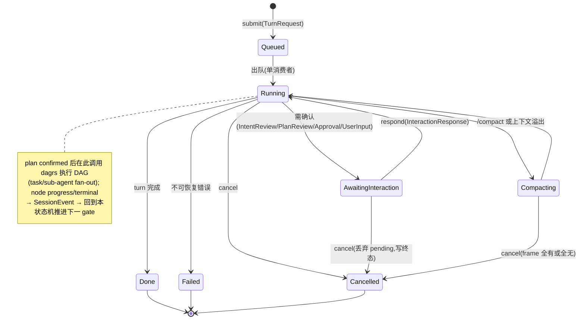
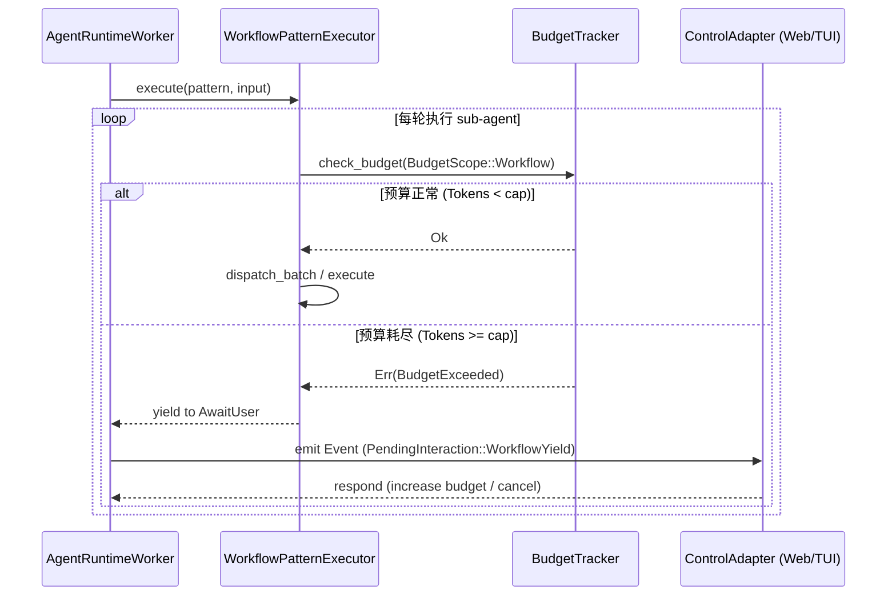

# `libra code` Agent framework 与 Web-only 迁移计划

> Status: agent-executable（可交给 Agent 按卡执行；本文档已包含自举清单、执行协议、代码漂移防护、测试骨架、接口契约与常见陷阱，具备直接开发条件）
> Scope: 先设计并落地独立 Agent framework，再迁移 TUI-owned 行为，最后移除 Code TUI 并让 Web Code UI 成为唯一交互面。
> Companion docs: Web/runtime 现状见 [`docs/improvement/web.md`](../improvement/web.md)；控制面契约见 [`docs/commands/code-control.md`](../commands/code-control.md)；长期 agent backlog 见 [`docs/improvement/agent.md`](../improvement/agent.md)；MCP stdio 独立命令拆分见 [`mcp.md`](mcp.md)；外部 Agent 会话捕获（`libra agent` / `refs/libra/agent-traces`，与本计划**正交**的独立子系统）见 [`docs/improvement/entire.md`](../improvement/entire.md)。
> Control-plane correction (2026-06-04): 停止把 TUI/MCP 作为 Agent 操作入口；`libra code` 只保留 Web Code UI，外部调度参考 Codex 通过 WebSocket 进入 AgentRuntime。
> 术语消歧（跨文档）：本文的"外部 Agent / 外部调度"指经 WebSocket/Web API **驱动 Libra 内部 runtime** 的外部调用方；[`docs/improvement/entire.md`](../improvement/entire.md) 的"外部 Agent"则指**被观测捕获的第三方编码 Agent**（Claude Code/Gemini/Cursor…），二者同词反义。本文的"session/checkpoint"指内部 runtime 的 session 与 orchestrator/dagrs 执行 checkpoint；entire.md 的"`agent_session`/`agent_checkpoint`"指外部会话表与 `refs/libra/agent-traces` 上的 transcript 检查点。两者的表 / 类型 / ref / 命令命名空间均不重叠。

变更记录：

1. 2026-06-03 post-review: 补充与主计划对齐、当前模块基线、行为清单种子、迁移期 TUI 委托模型、AG-10/AG-07 顺序校准、控制面迁移细节，补充 `/compact` 及 UI 渲染类行为到种子清单、明确 mcp/code-control 相关兼容性测试和配置校验更新细节、规范 Graph API 的 loopback 与 token 鉴权机制。
2. 2026-06-03 follow-up: 对照 c4pt0r/pie 架构补齐 runtime queue、dagrs-backed state machine、event log/projection、session-scoped automation、compaction、permission gate 和 adapter-thinness 验收；明确状态机继续使用 dagrs 0.8.1。
3. 2026-06-03 review#2: 基于 `pie` 实际 crate 分解深化对照，修正 dagrs 适用范围，锁定「交互 gate = 手写 typed enum + `WorkflowPhase`/`InteractionKind`」「执行 DAG = dagrs 0.8.1」「event id = per-session u64」「Codex 归一以 Completion 形状为正典」等决策。
4. 2026-06-04 dynamic-workflows: 依据 Anthropic「A harness for every task: dynamic workflows in Claude Code」与 [@trq212 thread](https://x.com/trq212/status/2061907337154367865)，新增「Dynamic Workflows：任务自适应编排层」设计节，落地 Gate 7 + Phase 13 + AG-13/AG-14/AG-15。
5. 2026-06-05 agent-executable: 补齐 Agent 执行协议、来源设计追踪矩阵、AG-00~AG-15 任务拆分矩阵和每卡交付证据要求，使本文可作为 Agent 领取实现任务的直接计划。
6. 2026-06-05 agent-bootstrap: 添加 Agent 开发前置检查清单、Source Anchor Refresh Protocol、Mid-card Checkpoint、Rollback & Recovery Protocol、测试骨架模板与命名约定、核心接口骨架（Rust 类型契约）、常见陷阱与纠偏、AG-00 执行模板，增强 AG-01/AG-02 验收的可量化指标；修复两处格式断裂；使文档达到可直接交给 Agent 开发的程度。
7. 2026-06-05 entire-alignment: 与 [`docs/improvement/entire.md`](../improvement/entire.md)（外部 Agent 会话捕获子系统）对齐，消除共享耦合处的隐患——Companion docs 增列 entire.md 并标注正交；新增跨文档「外部 Agent / session / checkpoint」术语消歧；在「事件日志、游标与投影」节固化 `SessionEvent` schema 主权归 AG-01 + 向后兼容/unknown-event-safe 承诺（entire.md 复用同一 `SessionStore` JSONL，仅以 `.libra/sessions/{code,agent}/` 子目录隔离）。本计划删除 Code TUI 后，entire.md 的会话展示面统一改走 Web Code UI。
8. 2026-06-05 claude-execution-hardening: 清理会误导 Claude 直接复制的伪代码（`TaskInvocation.instruction`、`TaskFailure::from`、不存在的 budget 构造器），把绝对 `file://` 链接改为仓库相对路径，并把执行协议中的非 Libra-native VCS 命令替换为 Libra-native 工作流。


## 执行结论

本计划的核心顺序是：

1. 先冻结当前 TUI 行为和测试证据（Phase 0 + AG-00 种子清单）。
2. 设计并落地 UI-neutral Agent framework（**收敛现有模块**，AG-01）。
3. 将 `src/internal/tui/app.rs` 中的 agent 行为迁入 Agent framework；TUI 只作为迁移基线和临时测试参照，不再设计成长期 runtime 消费者。
4. 停止让 TUI / MCP 操作 Agent：`libra code` 只保留 Web Code UI 交互面；外部调度参考 Codex，由 WebSocket 连接 Web/AgentRuntime，而不是通过 MCP 调度 Agent。
5. 再把 `libra code` 默认入口切到 Web，并让旧 TUI / `code --stdio` / `code-control` 写入口 fail closed 或迁出。
6. 最后删除 TUI bridge、Code TUI startup、独立 `libra graph` 终端 UI、TUI 专用 PTY harness，以及只为 TUI automation 存在的控制面。

不能先把默认入口改成 Web 后再补 runtime。TUI 现在仍承载 plan workflow、goal、usage、skills、hooks、multi-agent、resume、approval、request_user_input、repair loop 等核心能力；这些能力必须先有 UI-neutral 等价实现，随后直接关闭 TUI 操作面，而不是把 TUI 保留为 AgentRuntime 的正式委托者。

（2026-06-04 修正：早期 phase 只把 TUI 当作行为冻结和回归参照；harness 替换优先用 Web / WebSocket 路径覆盖 runtime，不再新增或延长 TUI-as-adapter 的生产契约。）

**Review 结论（本轮评估）：** 方案方向合理，关键顺序也正确：先冻结 TUI 行为、再抽 UI-neutral runtime、最后切 Web-only。当前文档已覆盖大多数迁移风险，但若直接交给 Agent 实施，仍有三个不足需要固化为执行约束：

- AgentRuntime 内部形态不够具体，容易被实现成一组 trait 壳，实际状态机仍散落在 TUI/Web adapter。
- session event、snapshot、pending interaction、cancel/lease、usage/compaction/audit 的事实源关系需要更明确，否则 Web adapter、遗留 TUI bridge 和 MCP 协议层可能各自维护 projection。
- `pie` 类 agent harness 已证明「provider streaming 层、stateful harness/runtime、thin CLI/TUI」的分层更利于测试和迁移；本计划应吸收这种分层，但不照搬其 workspace crate 拆分。

因此，本计划不新增一个孤立大框架，而是在现有 `src/internal/ai/*` 内收敛为：统一 provider stream、单 runtime turn queue、**序列化 typed turn/interaction 状态机（交互 gate）**、**dagrs-backed 执行/任务 DAG（仅执行阶段的 task/sub-agent fan-out）**、append-only event log、可重放 snapshot/projection（snapshot = fold(events)）、薄 ControlAdapter。后续 AG 卡必须按这些边界验收。

**Review#2 补充（2026-06-03，基于代码核对 + `pie` crate 分解）：** 上一轮已确立分层方向，但若交给 Agent 直接实施，仍有五处需要在交付前固化为硬约束，否则会被实现成「形似分层、实则状态机仍散落」：

1. **dagrs 适用范围必须澄清（最高优先级修正）。** 经 `rg` 核对：dagrs 0.8.1 实际只出现在 `orchestrator/{executor,decider,replan,verifier,…}.rs` 和 `node_adapter.rs`（把 `Agent`/`ToolLoop` 包成 `dagrs::Action` 节点），用于**多 agent 执行/任务 DAG**；`runtime/phase0..4.rs` 只是数据契约（`WorkflowPhase::Intent` 等），**不是** dagrs 执行器；交互式 Intent/Plan/repair workflow 当前是 `tui/app.rs` 的 `pending_intent_review` / `pending_plan_revision` 字段 + async 方法，**从未跑在 dagrs 上**。因此「workflow 必须由 dagrs 驱动」这条旧约束在交互 gate 上是**净新增迁移**而非「继续使用」，且 dagrs（并行 DAG 调度器，`Action::run` 语义）并不适合线性、人工确认、可挂起的交互 gate。本计划据此拆成两类状态机（见下文「两类状态机的边界」）：执行/任务 DAG 继续用 dagrs；交互 turn/plan/approval gate 用序列化 typed 状态机推进，dagrs 只在执行阶段被该状态机调用。
2. **harness 不是「返回一堆 Arc 的函数」，而是被持有的组合结构。** `pie` 的 `agent_harness.rs`（160KB）是整个系统的心脏，它**拥有并装配** session/compaction/permission/skills/system_prompt/trigger/cost。本计划的 `build_code_agent_services` 必须产出一个被 runtime worker 持有、具备明确生命周期（build → run turns → shutdown）的 `CodeAgentServices` 结构，而不是松散返回 12 个 service 句柄后由 adapter 各自拼装——后者正是本计划自己警告的「trait 壳」反模式。
3. **事件日志/游标/投影需要可实现的契约。** snapshot 必须定义为 SessionEvent 的纯 fold（`snapshot = fold(events ≤ cursor)`），event id 单调递增（**已锁定 per-session `u64` 序号**，gap = N+1，见「事件日志、游标与投影」），持久化 JSONL 是 replay 真源、内存 broadcast 仅尽力实时投递；gap recovery 在客户端 cursor 早于内存缓冲时回退读持久化日志。否则「gap recovery」「SSE from cursor」只是口号。
4. **Codex 路径必须归一进同一 runtime event envelope。** 现状 `CodexTaskExecutor` 经 `CodeUiProviderAdapter` 直驱 Codex WS、不走通用 tool loop（`task_executors.rs:6` 注释自述「both providers… Codex and any generic」共用 `TaskExecutor` trait）。执行路径可以不同，但**投影/SSE/snapshot 层必须只看到一套归一事件流**；否则 normalized event stream 名存实亡，Codex 成为平行宇宙。
5. **sub-agent 回写与 cancel 需要显式矩阵。** 并发只在 sub-agent dispatcher 内发生，但「子 agent 事件如何并回主序列投影」「父 turn cancel 时在途子 agent / 待审批 / 待用户输入各自如何收尾」必须写成不变量与测试矩阵，不能留给实现临时决定。

`pie` 的 `coding-agent` 已用**单一 `agent_session.rs` 同时驱动终端 `ui/mod.rs` 和 Web `ui/web.rs`**，是本计划「共享 session driver + 薄 UI」目标的现成存在性证明；本计划应镜像这一 seam，而非自证可行性。

## 目标

- `libra code` 最终只启动 Web Code UI。
- `libra code --web` / `--web-only` 不保留兼容期；默认 Web 切换时同步删除或立即拒绝。
- `libra code --stdio` / `--mcp-stdio` 从 `code` 命令移出；独立 MCP 命令的 CLI / docs / tests 由 [`mcp.md`](mcp.md) 跟踪。
- Browser/automation 写控制只允许 loopback + controller token；非 loopback 仍 fail closed。
- `libra graph` 终端命令删除；thread/version graph 迁入 Web Code UI。
- `src/internal/tui/*` 不再是任何 agent/session 行为的唯一实现位置。

## 非目标

- 不把当前单 crate 立即拆成 workspace 多 crate。
- 不在本计划中实现 Mega 控制面、rk8s worker、分布式调度或企业租户隔离。
- 不开放公网 Web 写控制。
- 不把 Web terminal 做成任意 shell prompt；工具执行仍必须走 ToolRuntime、sandbox、approval 和 policy。
- 不保留第二套终端 graph UI。

## 设计原则

### Agent framework first

Agent framework 是核心行为层，不是 Web-only 的附属实现。它至少包含四个边界：

| 边界 | 职责 | 当前来源 |
|------|------|----------|
| `AgentDefinition` | AgentSpec、persona、prompt/bootstrap、tools、skills、policies、默认模型路由 | `src/internal/ai/agent/`、profiles、commands、skills、prompt/rules loader |
| `AgentPersistence` | session event、checkpoint、thread projection、usage、artifact、memory anchor、audit、lease | `src/internal/ai/session/`、`projection/`、`.libra/libra.db`、JSONL store |
| `AgentRuntime` | turn loop、model router、tool runtime、sandbox/approval、plan workflow、goal、skills、sub-agent/task、hooks、usage、cancel/resume、repair loop | `src/internal/tui/app.rs`、`web/headless.rs`、`orchestrator/`、`goal/`、`tools/` |
| `AgentControlAdapter` | Web UI / WebSocket / HTTP / batch 的 submit/respond/cancel/observe/snapshot/SSE framing；MCP 仅保留 tools/resources 协议能力，不作为 Agent turn 调度面 | `src/internal/ai/web/`、`src/internal/tui/code_ui_adapter.rs`（迁移源，最终删除）、`src/internal/ai/mcp/`（协议层，不拥有 agent turn） |

ControlAdapter 只能转发用户输入、交互响应、取消、观察请求和快照请求；不能拥有 plan workflow、goal lifecycle、usage accounting、skill activation、approval queue 或 session persistence 私有状态机。

AgentRuntime 不是 trait 名字本身，而是一个可独立运行的 harness。最小内部执行模型如下：

```text
AgentRuntimeHandle
  submit(TurnRequest) / respond(InteractionResponse) / cancel(TurnId)
  observe(EventCursor) -> AgentEvent stream
  snapshot() -> AgentSnapshot

AgentRuntimeWorker  (holds one CodeAgentServices)
  serialized turn queue (single consumer; producers: user submit / control submit / trigger / cron / sub-agent promotion)
  turn/interaction state machine  (typed: Queued → Running → AwaitingInteraction → Running → [Compacting] → Terminal{Done|Cancelled|Failed};
                                   the linear, human-gated Intent/Plan/Approval/UserInput flow — a serialized state machine, NOT a dagrs graph)
  interaction gate (Intent/Plan/Approval/UserInput/FirstContact/etc.) — blocks mutating tools until resolved
  dagrs 0.8.1 execution DAG  (invoked ONLY inside the Running/execution phase for task + sub-agent fan-out, via orchestrator + node_adapter — the existing Runtime Foundation; not the interaction gate)
  model stream consumer (Completion/Codex events normalized into ONE runtime event envelope before any state mutation)
  tool scheduler (sandbox/approval/hooks/source/tool policy before execution)
  command service (/goal, /skill, /usage, /compact, /task, future automation)
  append-only SessionEvent writer (monotonic per-session u64 seq; persisted JSONL is replay source of truth; gap = expected N+1)
  projection builder (single fold: AgentSnapshot, CodeUiSessionSnapshot, graph read models all = fold(events))
```

#### 核心接口骨架（AG-01 必须落地的类型契约）

以下不是最终实现，而是**类型边界的最低共识**。AG-01 允许调整字段/泛型，但以下能力必须可表达：

```rust
// src/internal/ai/agent/runtime/mod.rs 或 ai/runtime/mod.rs（由 AG-01 根据现状决定具体落点）
use std::sync::Arc;
use tokio::sync::{mpsc, RwLock};
use uuid::Uuid;

/// 外部持有，线程安全，可 clone
#[derive(Clone)]
pub struct AgentRuntimeHandle {
    pub session_id: Uuid,
    // 内部 channel 或 async queue 的 sender 侧
    cmd_tx: mpsc::UnboundedSender<RuntimeCommand>,
}

impl AgentRuntimeHandle {
    pub async fn submit(&self, req: TurnRequest) -> anyhow::Result<TurnId>;
    pub async fn respond(&self, turn_id: TurnId, resp: InteractionResponse) -> anyhow::Result<()>;
    pub async fn cancel(&self, turn_id: TurnId) -> anyhow::Result<()>;
    /// SSE / 长轮询入口；从 cursor 开始回放，支持 gap recovery
    pub async fn observe(&self, cursor: EventCursor) -> impl Stream<Item = AgentEvent>;
    pub async fn snapshot(&self) -> anyhow::Result<AgentSnapshot>;
}

/// worker = 单 session 内串行消费者；由独立 async task 持有
pub struct AgentRuntimeWorker {
    pub session_id: Uuid,
    pub services: Arc<CodeAgentServices>,  // AG-02 产出
    pub queue: mpsc::UnboundedReceiver<RuntimeCommand>,
    pub state: TurnStateMachine,           // 手写 typed enum（见下）
    pub event_store: Arc<dyn SessionEventStore>, // append-only JSONL + SQLite
    pub projection: RwLock<AgentSnapshot>, // fold(events)
    // dagrs 执行图由 orchestrator/executor.rs 的现有逻辑驱动，worker 只在 Running 阶段调用
}

/// 控制轴 × workflow 轴（两类状态机的边界）
#[derive(Debug, Clone, PartialEq, Eq)]
pub enum TurnControlState {
    Queued,
    Running {
        phase: WorkflowPhase, // Intent / Planning / Execution / Validation / Decision
    },
    AwaitingInteraction {
        phase: WorkflowPhase,
        kind: InteractionKind,
    },
    Compacting,
    Terminal(TurnTerminalState),
}

#[derive(Debug, Clone, PartialEq, Eq)]
pub enum TurnTerminalState {
    Done,
    Cancelled { reason: String },
    Failed { error: String },
}

#[derive(Debug, Clone, PartialEq, Eq)]
pub enum InteractionKind {
    IntentReview,
    PlanReview,
    Approval { tool_name: String, args: serde_json::Value },
    UserInput { prompt: String },
    FirstContact,
}

/// 归一 runtime event envelope（Codex 与 Completion 统一进此形状）
#[derive(Debug, Clone, Serialize, Deserialize, PartialEq)]
pub enum AgentEvent {
    // 控制生命周期
    TurnSubmitted { turn_id: TurnId, seq: u64 },
    StateTransition { seq: u64, from: TurnControlState, to: TurnControlState },
    InteractionRequested { seq: u64, kind: InteractionKind, payload: serde_json::Value },
    InteractionResolved { seq: u64, kind: InteractionKind, response: InteractionResponse },
    TurnTerminal { seq: u64, state: TurnTerminalState, usage: UsageSummary },
    // 模型流
    ModelTextDelta { seq: u64, turn_id: TurnId, delta: String },
    ModelThinkingDelta { seq: u64, turn_id: TurnId, delta: String },
    ModelToolCall { seq: u64, turn_id: TurnId, call: ToolCall },
    // 工具生命周期
    ToolScheduled { seq: u64, call: ToolCall },
    ToolStarted { seq: u64, call: ToolCall },
    ToolCompleted { seq: u64, call: ToolCall, result: ToolResult },
    ToolDenied { seq: u64, call: ToolCall, reason: String },
    // 系统
    CompactionApplied { seq: u64, new_context_frame: ContextFrame },
    Audit { seq: u64, record: AuditRecord },
    // workflow 层（AG-13 扩展）
    Workflow(WorkflowEvent),
}

/// per-session u64 单调序号；cursor = 期望的下一个 seq
pub type EventCursor = u64;
pub type TurnId = Uuid;

/// fold(events ≤ cursor) 的产物；唯一事实源投影
#[derive(Debug, Clone, Default)]
pub struct AgentSnapshot {
    pub session_id: Uuid,
    pub current_turn: Option<TurnId>,
    pub turn_history: Vec<TurnSummary>,
    pub pending_interaction: Option<PendingInteraction>,
    pub usage: UsageSummary,
    pub last_event_seq: u64,
    pub context_budget: ContextBudgetStatus,
}
```

**AG-01 的最低交付要求（接口骨架）：**
- `AgentRuntimeHandle` 可被 TUI launch path 与 Web adapter path 各自持有（clone）。
- `AgentRuntimeWorker` 被一个独立 async task 持有；drop handle 时须优雅 shutdown（ flush event store、写 terminal event）。
- `TurnControlState` 必须是 `Serialize + Deserialize + PartialEq + Eq + Clone + Debug`，以便 JSONL replay 和 contract test。
- `AgentEvent` 必须统一 Codex WS 事件与 Completion stream 事件；**Codex 为正典方向是错误表述**——已锁定 **Completion 形状为正典**，Codex 事件映射进 `AgentEvent::Model*` / `AgentEvent::Tool*`（review#2 约束 4）。
- `AgentSnapshot` 必须从 `SessionEventStore::scan(0..=cursor)` 纯 fold 得到；**不允许**从 worker 内存直接构造 snapshot 作为第二条路径。

**骨架 helper 类型的复用映射（2026-06-05 核对；勿重新发明）：** 上面骨架里的占位类型大多可复用现有类型，AG-01 应优先复用、必要时再 newtype 包装：

| 骨架类型 | 复用 | 文件:行 |
|---|---|---|
| `ToolResult` | 直接复用 | `internal/ai/completion/message.rs:82` |
| `ToolCall` | 复用 `ToolCallRecord`（orchestrator 层）或 completion 层 tool-call 形状 | `internal/ai/orchestrator/types.rs:377` |
| `UsageSummary` | 复用 `CompletionUsageSummary` | `internal/ai/completion/mod.rs:57` |
| `ContextFrame` | 复用 `ContextFrameEvent` | `internal/ai/context_budget/frame.rs:144` |
| `WorkflowEvent` | AG-13 在 `session/jsonl.rs` 新增（见 §1.1） | 待建 |
| `AuditRecord` | **当前无此名**；复用 `AuditSink`（`runtime/hardening.rs:453`）的记录形状或本卡定义 | 待建/复用 |
| `TurnSummary` / `PendingInteraction` / `ContextBudgetStatus` | 本卡新建（与 `CodeUiSessionSnapshot` 字段对齐，避免投影漂移） | 待建 |

**必须保持的状态不变量：**

- 同一 session 内 turn、trigger、cron、sub-agent promotion、control submit 都进入同一个 serialized queue；并发只允许发生在明确的 sub-agent dispatcher 内，主 session projection 仍按事件顺序提交。sub-agent 在子 run record 内独立运行其 transcript，**只有完成摘要 / patchset / promoted 结果**经 queue 重新进入父 session event log，绝不直接并写主投影。
- **交互 gate 的状态推进**（Intent draft/confirm、Plan draft/confirm、repair、approval、user-input）由 worker 的**序列化 typed 状态机**推进并写 SessionEvent，**不是 dagrs 图**——这是当前 `tui/app.rs` 字段散落逻辑的中立化目标，不允许把它塞进 dagrs，也不允许留在 adapter 私有 enum。
- **执行/任务 DAG**（一个 confirmed plan 内的多 task / sub-agent fan-out）必须继续通过 `dagrs 0.8.1`（`orchestrator/` + `node_adapter.rs`）表达，由交互状态机在 Running 阶段调用；不允许用 ad-hoc enum loop / async select 自行重写第二套并行调度。两类状态机的边界见下文「两类状态机的边界」。
- pending interaction 是 runtime 的阻塞 gate，而不是 UI 的临时变量；未收到确认前不得执行 mutating tools。
- 所有影响未来恢复的事实先写 `SessionEvent` / SQLite runtime 表，再更新 in-memory snapshot；adapter 只消费 snapshot/event，不直接拼接长期状态。
- cancel 必须写入终态事件和 usage failure row，再中断 provider/tool task；不能只 abort JoinHandle。**cancel 收尾矩阵**（必须各有测试）：(a) `Running` 取消正在流式的 turn；(b) `AwaitingInteraction`（intent/plan/approval/user-input）取消——丢弃 pending interaction 并写终态，不得悬挂；(c) 父 turn 取消时**在途 sub-agent** 须被级联中断并写各自子 run 终态，再写父终态；(d) `Compacting` 取消须保证 compaction event 要么完整写入要么不写，不留半截 context frame。
- compaction 是 append-only event + 新 context frame，不重写历史 transcript；Web 与迁移期 TUI 回归参照只显示压缩后的 projection。
- approval、sandbox、allowed-tools、network policy、SourcePool trust、hook execution 是 tool scheduler 的前置 gate，不能分散到 Web 或遗留 TUI bridge 控制面。

#### 两类状态机的边界（review#2 新增，必须遵守）

本计划区分**两类**状态机，二者不可混为一谈，这是上一轮文档最容易被实现跑偏的地方：

| | 交互 turn/interaction 状态机 | 执行/任务 DAG |
|---|---|---|
| 形态 | 单 session 内**线性、人工确认、可挂起**：Queued → Running → AwaitingInteraction → Running → [Compacting] → Terminal | 一个 confirmed plan 内的**并行 task / sub-agent fan-out**，有依赖边 |
| 实现 | worker 持有的**手写 typed enum**（复用 `WorkflowPhase` 词汇 + 交互 gate 维度，见下图），零新依赖；推进即写 `SessionEvent`，由 projection 产出 pending interaction | `dagrs 0.8.1` 图执行器（`orchestrator/executor.rs` + `node_adapter.rs` 的 `AgentAction`/`ToolLoopAction`） |
| 当前位置 | `tui/app.rs` 的 `pending_intent_review` / `pending_plan_revision` 字段 + async 方法（**尚未中立化**，AG-03 迁出目标） | 已落地的 Runtime Foundation（**保留**，不重写） |
| 是否 dagrs | **否**——dagrs 的 `Action::run` 是并行节点语义，不适合人工 gate / 挂起 / 单步确认 | **是**——这是 dagrs 的本职场景 |

调用关系：交互状态机进入 `Running` 且 plan 已 confirmed 后，**在执行子阶段调用** dagrs 执行 task DAG；dagrs 节点的 progress / terminal report 被翻译回 `SessionEvent`，交互状态机据此推进到下一个 gate 或 Terminal。**任何一方都不得越界**：交互状态机不并行调度 task，dagrs 不表达 intent/plan/approval 确认流。

**本轮评审决策（已锁定）：** 交互状态机用 worker 内**手写 typed enum**，不引入 statechart crate。状态分两个**正交维度**——**控制轴**（turn 生命周期：Queued / Running / AwaitingInteraction / Compacting / Terminal）× **workflow 轴**（直接复用现有 `WorkflowPhase` = Intent / Planning / Execution / Validation / Decision，`runtime/contracts.rs:484`）；`AwaitingInteraction` 携带 `InteractionKind`（IntentReview / PlanReview / Approval / UserInput / FirstContact）。两轴正交，例如「Running × Planning」「AwaitingInteraction(PlanReview) × Planning」。复用 `WorkflowPhase` 避免与既有 runtime 契约出现两套词汇。

控制轴状态转移（执行 DAG 在 `Running` 阶段被调用，不是独立状态）：



> 旧文档中「workflow 必须由 dagrs 驱动」凡指 **intent/plan/approval 交互流** 处，一律按本节理解为「序列化 typed 状态机」；凡指 **plan 内 task/sub-agent 执行** 处，才是 dagrs。AG-01/AG-03 的「dagrs 合同测试」只覆盖执行 DAG，不要求把交互 gate 塞进 dagrs。

#### 事件日志、游标与投影（snapshot = fold(events)）

为让 SSE gap recovery、resume、TUI/Web 一致投影可实现而非口号，固定以下契约：

- **单调 event id（已锁定 = per-session `u64` 序号）：** 每个 `SessionEvent` 带单 session 内单调递增的 `u64` 序号（serialized 单写者保证连续）；gap 检测即「期望 N+1」，cursor 就是该序号。append-only 持久化 JSONL（`session/jsonl.rs`）是 replay 的唯一真源。（评审决策：选 u64 序号而非 uuidv7——单 session 单写者下序号的 gap recovery 最简、仅凭 N+1 即可判漏；uuidv7 仅凭 id 无法判漏。）
- **snapshot 是纯 fold：** `AgentSnapshot` / `CodeUiSessionSnapshot` / graph read model 都由**同一个 projection builder** 对 `events ≤ cursor` 做 fold 得到，没有第二条写路径。
- **`SessionEvent` schema 主权与外部消费者兼容（跨文档约束）：** 本计划（AG-01）持有 `src/internal/ai/session/` `SessionEvent` 的 schema 主权。除本 runtime 外，[`docs/improvement/entire.md`](../improvement/entire.md) 的**外部 Agent 捕获子系统**也复用同一 `SessionStore` JSONL（但走独立 `.libra/sessions/agent/` 子目录，本 runtime 用 `.libra/sessions/code/`，互不共享 session 实例与文件锁）。因此 `SessionEvent` 的演进必须：(a) 保持 **serde 向后兼容并提供 unknown-event-safe 兜底**（新增 variant 如 `Workflow` 不破坏旧 reader）；(b) 在收紧 runtime 不变量（`u64` 序号、`turn_id` 等）时不得使**外部 hook 生命周期事件**无法表达——若不可调和，则由 entire.md 改用独立 event 类型、仅共享 `SessionStore` 文件锁/恢复原语。任何 `SessionEvent` 变更须同步检查 entire.md §11 第 6 条。

### Dynamic Workflows：任务自适应编排层（借鉴 Claude Code「A harness for every task」）

> 来源：Anthropic 博客「A harness for every task: dynamic workflows in Claude Code」(claude.com/blog) 与 [@trq212 的同名 thread](https://x.com/trq212/status/2061907337154367865)。本节把该设计吸收进 Libra 的**执行/任务 DAG层**与 **goal supervisor 外循环**，作为 AgentRuntime 的能力扩展。它**不改变**上文「两类状态机的边界」——所有 workflow pattern 都属于**执行侧**（dagrs 执行 DAG + sub-agent dispatcher + goal 外循环），绝不进入交互 gate。

为了让开发 Agent 能够直接在此规范上不加猜测地开发，以下固化其核心 Rust API、SessionEvent DTO 扩展、六大 Pattern 运行伪代码与失效守卫不变量。

#### 1. 一等公民 `WorkflowPattern` API 与数据结构

本层设计为执行侧的**声明式编排 facade**，其核心定义位于 [`src/internal/ai/agent/runtime/sub_agent.rs`](../../src/internal/ai/agent/runtime/sub_agent.rs) 或新增的 `src/internal/ai/agent/runtime/workflow.rs`：

```rust
use std::sync::{Arc, Mutex};
use uuid::Uuid;
use futures::future::BoxFuture;
use crate::internal::ai::{
    agent::runtime::sub_agent::{SubAgentDispatcher, DispatchContext, TaskInvocation, TaskResult, TaskFailure},
    session::jsonl::{SessionJsonlStore, SessionEvent},
    agent::budget::BudgetTracker,
};

/// 编排上下文，携带沙箱配置与预算监视器
pub struct WorkflowContext {
    pub workflow_id: Uuid,
    pub session_id: Uuid,
    pub budget_tracker: Arc<Mutex<BudgetTracker>>,
    pub dispatcher: Arc<dyn SubAgentDispatcher>,
    pub jsonl_store: Arc<SessionJsonlStore>,
}

#[derive(Debug, Clone, Copy, PartialEq, Eq, Serialize, Deserialize)]
pub enum WorkflowPatternKind {
    ClassifyAndAct,
    FanOutAndSynthesize,
    AdversarialVerification,
    GenerateAndFilter,
    Tournament,
    LoopUntilDone,
}

/// 统一的 Workflow Pattern 执行接口
pub trait WorkflowPattern: Send + Sync {
    fn execute<'a>(
        &self,
        ctx: &'a WorkflowContext,
        input: TaskInvocation,
    ) -> BoxFuture<'a, Result<TaskResult, TaskFailure>>;

    fn kind(&self) -> WorkflowPatternKind;
}
```

##### 1.1 SessionEvent 扩展
为了在 Session 审计中完整记录 Workflow 轨迹，在 [`src/internal/ai/session/jsonl.rs`](../../src/internal/ai/session/jsonl.rs) 里的 `SessionEvent` 枚举中新增 `Workflow` variant 并在 `payload` 中承载以下结构体：

```rust
#[derive(Debug, Clone, Serialize, Deserialize, PartialEq)]
pub enum WorkflowEvent {
    Started {
        workflow_id: Uuid,
        pattern: WorkflowPatternKind,
        input: TaskInvocation,
        started_at: chrono::DateTime<chrono::Utc>,
    },
    StepCompleted {
        workflow_id: Uuid,
        step_index: usize,
        sub_agent_run_id: Uuid,
        success: bool,
        duration_ms: u64,
    },
    Completed {
        workflow_id: Uuid,
        result: Result<TaskResult, TaskFailure>,
        completed_at: chrono::DateTime<chrono::Utc>,
    },
}
```

#### 2. 六大 Workflow Pattern 核心控制逻辑与算法伪代码

所有的 Pattern 均在 `WorkflowPattern::execute` 内运行，严禁在交互状态机内硬编码。

##### 2.1 Classify-and-act (分类并路由)
* **机制**：通过专用的 `TaskIntentClassifier` 解析输入意图，获取分类，按分类将任务分派给不同的 sub-agent 或者后续专门的 pattern。
* **伪代码（控制流示意；真实字段以 §2.7 为准）**：
  ```rust
  async fn execute_classify_and_act(ctx: &WorkflowContext, input: TaskInvocation) -> Result<TaskResult, TaskFailure> {
      // 1. 进行意图分类
      let intent = ctx
          .classifier
          .classify(TaskIntentClassificationRequest::new(input.prompt.clone()))
          .await?;
      // 2. 根据分类路由到不同的执行策略/下游 sub-agent profile
      let target_profile = ctx.router.select(intent.intent.as_str());
      // 3. 执行分派
      let child_ctx = ctx.create_child_dispatch_context();
      // role = "route" 写入 WorkflowEvent；不要新增 TaskEntryKind variant
      let mut routed_input = input;
      if let Some(profile) = target_profile {
          routed_input.subagent_type = profile.name.clone();
      }
      ctx.dispatcher.dispatch(child_ctx, routed_input, TaskEntryKind::LlmInitiated).await
  }
  ```

##### 2.2 Fan-out-and-synthesize (并行拆分与合成)
* **机制**：把一个大指令拆分为 $M$ 个独立的子任务。利用 `SubAgentDispatcher::dispatch_batch` 触发并行调用（拥有相互隔离的 worktree），然后用 Synthesizer Agent 对所有子任务的 `TaskResult` 进行合并。
* **伪代码（控制流示意；真实字段以 §2.7 为准）**：
  ```rust
  async fn execute_fan_out_and_synthesize(ctx: &WorkflowContext, input: TaskInvocation) -> Result<TaskResult, TaskFailure> {
      // 1. 拆分子任务序列
      let sub_tasks: Vec<TaskInvocation> = ctx.planner.split_task(&input).await?;
      let mut batch_inputs = Vec::new();
      for task in sub_tasks {
          let child_ctx = ctx.create_child_dispatch_context();
          batch_inputs.push((child_ctx, task, TaskEntryKind::LlmInitiated, vec![]));
      }
      // 2. 并行执行 batch 调度
      let results = ctx.dispatcher.dispatch_batch(batch_inputs, ctx.max_parallel).await;
      // 3. 收集并合成
      let successful_payloads: Vec<TaskResult> = results.into_iter().filter_map(|r| r.ok()).collect();
      let synthesized = ctx.synthesizer.merge_results(successful_payloads).await?;
      Ok(synthesized)
  }
  ```

##### 2.3 Adversarial verification (对抗验证反馈环)
* **机制**：Producer Agent $A$ 产出结果，自动指派一个独立的 Verifier Agent $B$ 依据 criteria 评审。如果不通过，则把 verifier 反馈附加到下一次 A 的输入中重新生成。
* **伪代码（控制流示意；真实字段以 §2.7 为准）**：
  ```rust
  async fn execute_adversarial_verification(ctx: &WorkflowContext, input: TaskInvocation) -> Result<TaskResult, TaskFailure> {
      let mut current_input = input.clone();
      let mut retries = 0;
      loop {
          // 1. 派生 Producer 产生草稿
          let draft_ctx = ctx.create_child_dispatch_context();
          // role = "draft" 写入 WorkflowEvent；不要新增 TaskEntryKind variant
          let draft_res = ctx.dispatcher.dispatch(draft_ctx, current_input.clone(), TaskEntryKind::LlmInitiated).await?;
          
          // 2. 派生独立 Verifier 审查
          let verifier_ctx = ctx.create_child_dispatch_context();
          let verify_task = TaskInvocation {
              prompt: format!("Verify the draft against criteria. Draft: {}", draft_res.final_text),
              ..input.clone()
          };
          // role = "verify" 写入 WorkflowEvent；不要新增 TaskEntryKind variant
          let verify_res = ctx.dispatcher.dispatch(verifier_ctx, verify_task, TaskEntryKind::LlmInitiated).await?;
          let verifier_verdict = VerifierVerdict::parse(&verify_res.final_text)?;
          
          // 3. 评估裁决。注意：模型自评仅 advisory，必须通过 Objective Gate / Deterministic verification
          let deterministic_pass = ctx.deterministic_verifier.check(&draft_res)?;
          if verifier_verdict.approved && deterministic_pass {
              return Ok(draft_res);
          }
          
          retries += 1;
          if retries >= ctx.max_retries {
              return Err(WorkflowError::VerificationLimitExceeded { attempts: retries }.into_task_failure());
          }
          // 4. 重构下一次输入，携带 Feedback
          current_input.prompt = format!("Previous attempt failed. Feedback: {}. Please fix it.", verifier_verdict.feedback);
      }
  }
  ```

##### 2.4 Generate-and-filter (生成并过滤)
* **机制**：并行生成 $N$ 个结果候选，由过滤模块按规则查重、筛选，只返回符合质量指标且唯一的最高得分候选。
* **伪代码（控制流示意；真实字段以 §2.7 为准）**：
  ```rust
  async fn execute_generate_and_filter(ctx: &WorkflowContext, input: TaskInvocation) -> Result<TaskResult, TaskFailure> {
      // 1. 并行派生 N 个 sub-agent 生成候选想法
      let batch_inputs = (0..ctx.candidate_count).map(|_| {
          (ctx.create_child_dispatch_context(), input.clone(), TaskEntryKind::LlmInitiated, vec![])
      }).collect();
      let candidates = ctx.dispatcher.dispatch_batch(batch_inputs, ctx.max_parallel).await;
      
      // 2. 过滤查重与客观条件筛选
      let mut filtered = Vec::new();
      for res in candidates.into_iter().filter_map(|r| r.ok()) {
          if ctx.filter.passes_static_checks(&res) && !ctx.filter.is_duplicate(&res, &filtered) {
              filtered.push(res);
          }
      }
      // 3. 打分排序并取最优者
      filtered.sort_by_key(|cand| ctx.scorer.evaluate(cand));
      filtered.into_iter().next().ok_or_else(|| WorkflowError::NoCandidatePassedFilter.into_task_failure())
  }
  ```

##### 2.5 Tournament (两两锦标赛)
* **机制**：派生 $N$ 个 sub-agents 产生不同的解决方案。由 `JudgeAgent` 进行两两（`pairwise`）对比，直到决出最终的 Winner。这种对比由于不是绝对打分，可以极高地抵抗偏见。
* **伪代码（控制流示意；真实字段以 §2.7 为准）**：
  ```rust
  async fn execute_tournament(ctx: &WorkflowContext, input: TaskInvocation) -> Result<TaskResult, TaskFailure> {
      // 1. 生成所有初始竞争者候选
      let mut competitors = execute_generate_candidates(ctx, &input).await?;
      // 2. 淘汰制循环
      while competitors.len() > 1 {
          let mut next_round = Vec::new();
          let chunks = competitors.chunks_exact_mut(2);
          let remainder = chunks.remainder();
          
          for pair in chunks {
              // 让 Judge 评估两两对比胜负（比绝对打分更鲁棒）
              let winner = ctx.judge.pairwise_compare(&pair[0], &pair[1]).await?;
              next_round.push(winner);
          }
          // 处理奇数竞争者直接晋级
          next_round.extend(remainder.to_vec());
          competitors = next_round;
      }
      competitors.into_iter().next().ok_or_else(|| WorkflowError::EmptyTournament.into_task_failure())
  }
  ```

##### 2.6 Loop-until-done (循环直到收敛)
* **机制**：持续调度子 Agent 执行任务（例如持续扫描并修复 bug），直到不满足迭代条件（比如没有在日志里发现新错误，或者测试全过）或达到 token / 步数预算上限，此时退出或由 AwaitUser 交互挂起。

#### 2.7 实现契约：上文伪代码 ≠ 真实类型（AG-13/14/15 必读，2026-06-05 ground-truth 核对）

> **⚠️ §2.1–2.6 的伪代码只表达控制流，字段/方法/enum 名不是字面量。** 直接照抄会编译失败。实现 `WorkflowPattern` 必须对齐以下**已核对的真实类型**（`rg` 现场复核行号；符号经 2026-06-05 全量核对存在）。

**真实类型签名（`src/internal/ai/agent/runtime/sub_agent.rs`）：**

```rust
pub struct TaskInvocation {        // :493  #[serde(deny_unknown_fields)]
    pub description: String,        // 人类可读摘要
    pub prompt: String,            // 发给 sub-agent 的消息体 —— 伪代码的 `instruction` = 此字段
    pub subagent_type: String,     // 目标 agent profile 名
    pub task_id: Option<String>,   // 续跑 token
}
pub struct TaskResult {            // :513
    pub task_id: String, pub agent_name: String, pub provider_id: String, pub model_id: String,
    pub final_text: String,        // 伪代码的 `output` = 此字段
    pub steps_used: u32, pub tool_call_count: u32, pub usage: CompletionUsageSummary,
}
pub enum TaskEntryKind {           // :539  —— 只有这两个 variant
    LlmInitiated,
    UserInitiated { bypass_permission_ask: bool },
}
pub enum TaskFailure { FeatureDisabled, UnknownSubagent{..}, DepthExceeded{..}, /* …结构化，无 From<&str> */ } // :623
pub struct DispatchContext<'a> { /* 借用字段：parent_thread_id/-_session_id/-_agent/-_ruleset/-_model_binding,
    parent_message_id, permission_service, session_store, provider_factory, …, abort_token, depth … */ } // :739
pub trait SubAgentDispatcher {     // :1589
    fn dispatch<'a>(&'a self, ctx: DispatchContext<'a>, invocation: TaskInvocation, entry_kind: TaskEntryKind)
        -> BoxFuture<'a, Result<TaskResult, TaskFailure>>;                      // :1590
    fn dispatch_batch<'a>(&'a self,
        tasks: Vec<(DispatchContext<'a>, TaskInvocation, TaskEntryKind, Vec<String> /* write_scope */)>,
        max_parallel: usize,
    ) -> BoxFuture<'a, Vec<Result<TaskResult, TaskFailure>>>;                   // :1620 默认顺序；DefaultSubAgentDispatcher 覆盖为并行
}
```

**伪代码 → 真实 映射（实现时逐条替换）：**

| 伪代码写法 | 真实 | 处理动作 |
|---|---|---|
| `input.instruction` | `TaskInvocation.prompt` | 直接改名 |
| `draft_res.output` / `res.output` | `TaskResult.final_text` | 直接改名 |
| `verify_res.is_approved()` / `.feedback` | **不存在** | AG-13 自定义 verdict 解析：解析 `final_text` 或新增 `VerifierVerdict { approved: bool, feedback: String }`（放 `workflow.rs`） |
| `TaskFailure::from("...")` | **不存在**（结构化 enum，无 `From<&str>`） | pattern 层错误用**新 `WorkflowError` 类型**或复用具体 `TaskFailure` variant；不要 `From<&str>` |
| `TaskEntryKind::{Route,Draft,Verify,Candidate,ParallelChunk}` | **不存在**（仅 `LlmInitiated` / `UserInitiated`） | 一律传 `TaskEntryKind::LlmInitiated`（pattern 自动派生属于 LLM 流）；pattern 角色记录到 `WorkflowEvent` 或新增 pattern-role 字段，**禁止新增 `TaskEntryKind` variant** |
| `ctx.create_child_dispatch_context()` | **不存在** | `DispatchContext` 是借用字段结构，逐字段构造；AG-13 写一个 per-child helper：克隆借用 + 新 `parent_message_id` + `abort_token.child()` |
| `dispatch_batch(inputs, ctx.max_parallel)` | 第 2 参 `max_parallel: usize`；每个 input 是 4 元组含 `write_scope: Vec<String>` | 补 `write_scope` 元素（决定并行 co-edit 串行化）；`max_parallel` 取自 cap（生产经 CP-S2-4 解析为 1） |

**`WorkflowContext` 协作者来源（AG-13 必须 wire，不要凭空 `ctx.*`）：** §1 的 `WorkflowContext` 当前只含 `workflow_id/session_id/budget_tracker/dispatcher/jsonl_store`。伪代码用到的协作者必须由 AG-13 扩展进 `WorkflowContext`（或新增 `WorkflowCollaborators` bundle），区分**既有真实模块**与**本卡新建组件**：

| 伪代码协作者 | 真实归属 | 状态 |
|---|---|---|
| `ctx.classifier` | `agent/classifier.rs::TaskIntentClassifier`（:179，`classify` :197 → `TaskIntentDecision` :157） | 既有，wire 进来 |
| `ctx.router` | `agent/profile/router.rs::AgentProfileRouter`（:28，`select` :52） | 既有 |
| `ctx.deterministic_verifier` | `goal/verifier.rs::DeterministicGoalVerifier`（:191）/ `orchestrator/gate.rs::run_gates`（:51） | 既有（最终裁决，见 AG-14） |
| `ctx.planner.split_task` | — | **AG-13 新建**（task 拆分；放 `workflow.rs`） |
| `ctx.synthesizer.merge_results` | — | **AG-13 新建**（合并 N 个 `TaskResult`） |
| `ctx.filter` / `ctx.scorer` | — | **AG-13 新建**（generate-and-filter 的 dedup/rubric/score） |
| `ctx.judge.pairwise_compare` | — | **AG-13 新建**（tournament 两两裁决 sub-agent） |
| `ctx.max_parallel` / `ctx.max_retries` / `ctx.candidate_count` | — | **AG-13 新建**（pattern 配置项，挂 `WorkflowContext`） |

> 实现顺序提示：先在 `workflow.rs` 定稿 `WorkflowContext` 全字段 + `VerifierVerdict` + `WorkflowError` + per-child `DispatchContext` 构造 helper（Checkpoint Alpha 必过项），再写六 pattern；否则会反复返工。

#### 3. 三大失效模式守卫（Failure-Mode Guards）的测试断言设计

为彻底防止 AI Agent 在执行长工作流时因幻觉或自傲而悄悄降级，AG-14 要求引入强命名的测试守卫以提供刚性约束。

> **⚠️ §3.1–3.3 的断言代码同样是 shape-illustration，名字不是字面量**（2026-06-05 ground-truth 核对）。实现 AG-14 时对齐以下真实符号：
> - **Agentic laziness：** 真实入口是 `goal/driver.rs::goal_turn_outcome_from_tool_loop_turn(turn: &ToolLoopTurn) -> GoalTurnOutcome`（driver.rs:229；`ToolLoopTurn` 在 tool_loop.rs:64）。**没有** `GoalTurnResult` 这个输入类型。非空 final text 且无 completion claim 时返回的真实变体是 `GoalTurnOutcome::FinalTextWithoutClaim { text }`（supervisor.rs:98），随后 `GoalSupervisor::step`（supervisor.rs:226）据此产出 `GoalLoopDecision::Continue { prompt }`。断言应写 `matches!(outcome, GoalTurnOutcome::FinalTextWithoutClaim { .. })`，**不是** `== GoalLoopDecision::Continue`（真实 `Continue` 携带 `prompt`，见下）。
> - **`GoalLoopDecision` 真实变体（supervisor.rs:174）：** `Continue { prompt: String }` / `AwaitUser { question: String }` / `Completed { report: Box<GoalCompletionReport> }` / `Cancelled` —— 无裸 `Continue`。
> - **Self-preferential-bias：** 没有 `create_adversarial_verifier_context()` / `is_isolated_from()` 现成 API；AG-14 需用真实的独立 sub-agent 派生（`DispatchContext` 的独立 `parent_message_id` + child `abort_token`，见 §2.7）断言 producer / verifier 的 run_id 不同，最终裁决走 `DeterministicGoalVerifier`（verifier.rs:191）/ `run_gates`（gate.rs:51）。
> - **Goal-drift：** 没有 `GoalState::new` / `compact_transcript` / `build_next_continuation_prompt`。真实面：`GoalState::from_spec(spec)`（state.rs:247）、`goal::state::apply`（state.rs:420）、`goal::state::replay`（state.rs:772）；不可变 `GoalSpec`（spec.rs:187）+ `GoalCriterion`（spec.rs:71）。守卫断言应基于「`GoalSpec.objective` 在多轮 `apply`(含 compaction event) 后仍逐字出现在续跑 prompt / sub-agent dispatch 头部」。
> AG-14 卡正文（本文「任务卡 → AG-14」）的**机制散文**为权威；以上代码块仅示意。

##### 3.1 Agentic laziness 守卫测试断言
* **原理**：模型不得仅通过返回一段没有证据支撑的散文 FinalText 来声称任务完成。测试需要构造一个 fake-provider 返回空证据但声称 done，断言 runtime 必须报错或继续轮询。
* **断言代码规范**：
  ```rust
  #[test]
  fn test_guard_agentic_laziness_incomplete_claim_rejected() {
      let run_outcome = goal_turn_outcome_from_tool_loop_turn(GoalTurnResult {
          final_text: Some("I have verified everything, it works!".to_string()),
          has_completed_claim: false, // 缺乏 completion claim 证据
          system_evidence: None,       // 缺乏 patchset / verification
      });
      // 必须被强制判定为 Progressing / Continue，禁止终止
      assert_eq!(run_outcome, GoalLoopDecision::Continue);
  }
  ```

##### 3.2 Self-preferential-bias 守卫测试断言
* **原理**：完成性审查（Completion verify）的裁决必须是客观/确定性的（如 CI gates 执行），或者由另外派生的、与其独立的 Verifier Sub-Agent 执行，绝对不允许让产出该结果的同一个 Agent 做自评。
* **断言代码规范**：
  ```rust
  #[test]
  fn test_guard_self_preferential_bias_independent_verifier_enforced() {
      let producer_agent_run_id = Uuid::new_v4();
      let verifier_context = create_adversarial_verifier_context();
      // 必须断言 Verifier 的运行 ID 绝对独立于 Producer
      assert_ne!(verifier_context.sub_agent_run_id, producer_agent_run_id);
      // 必须断言 verifier context 无法获取 producer 的内部私有变量
      assert!(verifier_context.is_isolated_from(&producer_agent_run_id));
  }
  ```

##### 3.3 Goal-drift 守卫测试断言
* **原理**：长任务多轮 compaction 时会丢上下文。测试构造一个多次 compaction 的 transcript，并断言原始不可变 `GoalSpec` 的 `objective` 依然能够精确且完整地包含在每一次 sub-agent dispatch 或 prompt 构造的首部，没有被 compaction 机制摘要或修改。
* **断言代码规范**：
  ```rust
  #[test]
  fn test_guard_goal_drift_original_criteria_preserved_after_compaction() {
      let mut goal_state = GoalState::new(GoalSpec {
          objective: "DO NOT use library X under any circumstance".to_string(),
          ..Default::default()
      });
      // 模拟 5 次 Compaction
      for _ in 0..5 {
          goal_state.compact_transcript();
      }
      let prompt = goal_state.build_next_continuation_prompt();
      // 原始不可变指令必须强存在
      assert!(prompt.contains("DO NOT use library X under any circumstance"));
  }
  ```

#### 4. 预算拦截与 AwaitUser 挂起交互数据流

每次执行 `WorkflowPattern` 或 sub-agent 派生时，必须声明一个 per-workflow token 预算，并由 `BudgetTracker` 细粒度拦截。
其控制流如下：



### Dynamic Workflows ↔ 既有执行原语的落地映射

Dynamic Workflows 设计的核心洞察——用**确定性控制流**协调多个**互相隔离的推理 context**，把结构（bracket / 任务依赖）留在确定性层，让每个 sub-agent 只专注自己的子任务。Libra 的对应物**已经存在且更正式**：确定性控制流 = `orchestrator` + `dagrs 0.8.1` 执行 DAG（`orchestrator/executor.rs::execute_dag`, executor.rs:2062）；隔离 context = `sub_agent_dispatcher` 的 per-run workspace（`materialize_isolated_workspace`, sub_agent_dispatcher.rs:1116）；完成判定 = `goal/supervisor.rs` 外循环 + `DeterministicGoalVerifier`。本节的任务不是引入新框架，而是把这套既有机制**显式抽象成可复用的 workflow pattern 词汇**并补齐缺失原语，使「Agent 为任务现编排一套多 agent workflow」在 Libra 中可表达、可审计、可预算。

#### 三种单 context 失效模式 → Libra 既有缓解（失效模式守卫，必须保持并测试）

设计强调：单一 context window 跑长任务会出现三种系统性失效。Libra 的 goal/orchestrator 层**已经内建对应缓解**；本计划把它们固化为**失效模式守卫（failure-mode guard）契约**，AG-14 为每条补命名测试，新增 pattern 原语必须继承这些守卫，不得绕过。

| 失效模式 | 设计描述 | Libra 既有缓解（anchor，行号仅参考，须 rg 复核） | 守卫不变量 |
|---|---|---|---|
| **Agentic laziness**（提前收工） | 复杂多步任务只完成一部分就宣告完成（如 50 项安全审查只做了 35 项） | 运行时循环 `run_goal_supervised_tool_loop`（`goal/driver.rs:111`）每轮把非空 final text 经 `goal_turn_outcome_from_tool_loop_turn`（driver.rs:229）强制判为 `FinalTextWithoutClaim`（绝不判 `Progressing`），`GoalSupervisor::step` 据此合成 progress 并 `Continue`（`goal/supervisor.rs:226`，opencode.md:657 明示「绝不让 Goal 仅凭 final text 闲置」）；`orchestrator/verifier.rs::build_system_report`（verifier.rs:23）要求 patchset/artifact 证据（`test_incomplete_or_failed_execution_never_passes_system_report`） | 模型不能仅凭散文 final text 终止；终止必须经可验证 completion claim + 客观证据 |
| **Self-preferential bias**（自评偏袒） | 模型倾向认可自己的产物，尤其在被要求按 rubric 自评时 | **判定权交给确定性 verifier / 独立 sub-agent，而非产出结果的同一模型**：`DeterministicGoalVerifier`（`goal/verifier.rs:191`，「the deterministic verifier remains the final gate」, verifier.rs:65）；`orchestrator/gate.rs::run_gates`（gate.rs:51）跑 build/test/lint 客观 `Check` → `GateReport`；adversarial verification = 派生**独立** sub-agent 复核（见下表 `dispatch_batch`） | completion/verify 的最终判定来自确定性 verifier 或独立 sub-agent，绝不来自产出该结果的同一 agent 的自评 |
| **Goal drift**（目标漂移） | 跨多轮（尤其 compaction 后）逐步丢失原始目标，edge-case / 「don't do X」约束被摘要掉 | 不可变 `GoalSpec`（objective + `GoalCriterion`，`goal/spec.rs:187`/`spec.rs:71`）独立持久化并事件溯源（`GoalState::replay`, `goal/state.rs:772`）；每轮 continuation prompt 重新列出未满足的 required criteria（`continuation_prompt_lists_pending_required_criteria`） | 原始 objective/criteria 与 transcript 分离持久化，compaction 不触碰；每次续跑都按原 spec 重新对齐 |

这三条与本计划已有的 compaction「append-only event + 新 context frame，不重写历史」约束一致：**goal spec 永远不进 compaction 的有损摘要路径**。

#### 六种 workflow pattern → Libra 执行原语映射

设计给出六种可复用编排 pattern。下表把每种映射到 Libra 既有/待建原语，并标注状态（`exists`/`partial`/`missing`）。**所有 pattern 都在执行/任务 DAG 层 + sub-agent dispatcher + goal 外循环表达，复用 `dagrs 0.8.1` 与 `DefaultSubAgentDispatcher::dispatch_batch`，不新起第二套并行调度，也不进交互 gate。**

| Pattern | 设计语义 | Libra 落点（anchor） | 状态 |
|---|---|---|---|
| **classify-and-act** | classifier agent 判定任务类型并路由到不同 agent/行为；或末端用 classifier 决定输出 | `agent/classifier.rs::TaskIntentClassifier::classify`（classifier.rs:197）→ `TaskIntent`；`agent/profile/router.rs::AgentProfileRouter::select`（router.rs:52）按输入选 persona + `ModelBinding` | partial（分类与 persona/model 路由已存在；按分类**分支到不同 sub-agent workflow** 尚未一等化） |
| **fan-out-and-synthesize** | 拆成多个小步，各自 clean context 跑再 synthesize；适合步骤多、或每步需隔离避免 cross-contamination | `orchestrator/executor.rs::execute_dag` 把 plan 的 task 建成 `TaskDagrsAction` 并行节点（executor.rs:1660 / `build_dagrs_graph` 1913），结果汇入 `orchestrator/verifier.rs::build_system_report`（verifier.rs:23）；细粒度 fan-out = `sub_agent_dispatcher::dispatch_batch`（sub_agent_dispatcher.rs:1092）+ per-run workspace 隔离 | partial（DAG fan-out 已落地；通用 synthesize 仅 verifier 专用，缺通用「合并 sub-agent 结构化产物」原语；生产 `dispatch_batch` 受 CP-S2-4 cap=1 门禁） |
| **adversarial-verification** | 每个派生 agent 的输出，由一个**独立**派生 agent 按 rubric/criteria 复核 | goal 层：`DeterministicGoalVerifier`；orchestrator 层：`build_system_report` + `run_gates`；多 agent 层缺「为每个 sub-agent 产出自动派生独立 verifier sub-agent」的复用原语 | partial（确定性 verify 已强；per-output 独立 verifier sub-agent 原语 missing） |
| **generate-and-filter** | 生成 N 个想法，按 rubric/验证过滤、去重，只返回最高质量、已验证者 | 可建于 `dispatch_batch`（生成 N）+ 新增 dedup/rubric filter 阶段；当前无通用 filter/dedup 原语 | missing |
| **tournament** | 派生 N 个 agent 用不同方法做同一任务，judge agent 两两 pairwise 比较直到产生 winner（pairwise 比绝对打分可靠）；确定性 loop 持有 bracket，仅「运行顺序」留在 context | 可建于 `dispatch_batch`（N 个不同 approach）+ 新增 pairwise judge sub-agent + 确定性 bracket loop | missing |
| **loop-until-done** | 工作量未知时，持续派生 agent 直到停止条件（无新发现 / 日志无新错误），而非固定轮数 | goal 外循环 `run_goal_supervised_tool_loop`（driver.rs:111）依 `GoalSupervisor::step` 返回的 `GoalLoopDecision::{Continue,Completed,AwaitUser}`（supervisor.rs:174/226）续跑至终态；plan 内 `Orchestrator::run`（orchestrator/mod.rs:330）以 `replan_count < max_replans` 循环 + `replan.rs::detect_replan`（replan.rs:34）按失败触发 replan（`max_replans` 上限, replan.rs:26）；面向任意 sub-agent 任务的「派生到无新发现为止」(loop-until-dry) 入口缺失 | partial（goal/plan 层已有收敛循环；通用 loop-until-dry missing） |

**边界声明（必须遵守）：** 上述 pattern 一律是**执行侧确定性编排**，对应「两类状态机」中的**执行/任务 DAG**与其上的 **goal 外循环**；它们**不是**交互 turn/interaction 状态机的一部分。交互 gate（Intent/Plan/Approval/UserInput 确认）仍由 worker 的序列化 typed 状态机推进；pattern 只在 `Running`（plan confirmed 后）阶段被调度，进度/终态翻译回 `SessionEvent` 再驱动状态机推进。

#### `WorkflowPattern` 抽象、预算与模板化

为让「Agent 为任务现编排一套 workflow」可表达，AG-13 引入薄 `WorkflowPattern` 层（封装在执行 DAG 之上，**不替换** dagrs）：

- **抽象：** `WorkflowPattern` = 一段确定性编排（输入 spec → 用 `dispatch_batch` / `execute_dag` 派生 sub-agent → 收敛/过滤/判定 → 结构化结果 + `SessionEvent`）。六种 pattern 是其内建实现；每个 sub-agent 复用既有 `AgentExecutionSpec`（`agent/profile/spec.rs:354`）、workspace 隔离、approval/sandbox/tool gate。生产侧默认受 CP-S2-4 cap=1 与 feature gate 约束（与现有 sub-agent 并行同一闸门）；cap=1 下 pattern 退化为顺序执行且 byte-identical（与本计划「flag-off 字节等价」纪律一致）。
- **Token 预算（设计明确要求「set explicit token budgets」）：** 复用 `agent/budget.rs::BudgetTracker`（budget.rs:181；`BudgetAxis`=cost/tokens/steps/wall-clock × `BudgetScope`=session/agent/goal）与 `goal/spec.rs::GoalBudget`（spec.rs:126）。每次 `WorkflowPattern` 运行必须声明 token/步数预算并由 `check_*` / `drain_warnings` 强制，预算耗尽走 `GoalLoopDecision::AwaitUser`（对应 `budget_hard_cap_yields_blocked_and_await_user`），**不静默截断、不静默继续**。
- **模板化与复用（设计的 save/share 机制）：** 设计建议把 workflow 存为可复用模板并经 skill 分发；Libra 对应物：
  - **skill 携带 workflow 模板：** `skills/parser.rs::SkillDefinition`（parser.rs:13）当前只 render prompt 字符串；AG-15 在 frontmatter 增加可选 `workflow:` 引用（指向内建 pattern + 参数），`SkillDispatcher::dispatch`（dispatcher.rs:32）据此装配 `WorkflowPattern` 而非纯 prompt。按设计，模板应被当作**模板而非逐字脚本**——runtime 可据任务调整 fan-out 宽度 / 轮数 / 模型档位。
  - **/loop × /goal 配对（设计的重复任务用法）：** 可重复 workflow（triage / research / verify）通过 `automation/scheduler.rs::AutomationScheduler`（scheduler.rs:9；`due_rules_at` 18 / `run_event` 57）按 cron/event 间隔触发，对应设计的 `/loop`；硬完成判据由 goal 外循环提供，对应设计的 `/goal`。所有 automation 触发遵循上文 pie 保守语义（bounded envelope + dedup key + fire-once + audit + session-scoped），经同一 serialized turn queue 进入，绝不绕过 approval/sandbox。

> **实施顺序：** 本层依赖 Gate 1（UI-neutral AgentRuntime + 执行 DAG + sub-agent dispatcher 已抽出）与已落地的 Runtime Foundation，**不依赖默认 Web 切换**，可与主迁移并行推进；但**生产启用**仍受 CP-S2-4 并行 cap 解锁这一过程闸门约束。详见 [Phase 13](#phase-13-dynamic-workflow-编排层与主迁移并行) 与 AG-13 / AG-14 / AG-15。

#### 来源设计 → Libra 任务追踪矩阵

下表是把 @trq212 / Dynamic Workflows 设计落到本文任务卡的追踪矩阵。后续 Agent 领取 AG-13~AG-15 或修改 runtime 时，必须先更新本表的「证明方式」，否则容易只实现表面 API、遗漏 harness 设计的核心约束。

| 来源设计点 | Libra 落点 | 任务卡 | 完成证明 |
|---|---|---|---|
| 为具体任务动态生成 harness，而不是把所有工作塞进同一聊天上下文 | `WorkflowPattern` 作为执行侧确定性编排层；pattern 只封装 graph construction / fan-out / synthesize / verification / stop condition | AG-13 | 六 pattern fake-provider/replay 合约测试，证明 harness 结构由确定性 runtime 持有，sub-agent 只执行局部任务 |
| 子 Agent 独立 context、可选独立 worktree | `DefaultSubAgentDispatcher::dispatch_batch` + `materialize_isolated_workspace` + `AgentExecutionSpec` | AG-13、AG-14 | 每个 pattern 的派生测试检查 agent spec、workspace 隔离、approval/sandbox/tool gate 都未旁路 |
| 模型路由与智能档位选择 | `TaskIntentClassifier` + `AgentProfileRouter` + `ModelBinding`，并允许 pattern 内按分类路由 | AG-13 | classify-and-act 测试覆盖分类后选择下游 pattern/persona/model，而不是只在首条消息做一次分类 |
| 独立验证、adversarial review、避免自评偏袒 | `DeterministicGoalVerifier`、`run_gates`、独立 verifier sub-agent；LLM verifier 仅 advisory | AG-14 | `self-preferential-bias` 守卫测试证明最终裁决不来自产出方自评；移除 LLM verifier 后确定性 gate 仍裁决 |
| loop-until-done 与硬停止条件 | `GoalSupervisor` 外循环 + `GoalSpec` + 新 loop-until-dry pattern | AG-13、AG-14 | `agentic-laziness` / `goal-drift` 守卫测试 + loop-until-done 停止条件测试（无新发现 / 达预算 / AwaitUser） |
| 明确 token budget，避免 workflow 失控 | `BudgetTracker` 增 per-workflow/per-run 维度 | AG-15 | 预算耗尽进入 `AwaitUser`，不静默截断、不继续派生；对应 budget hard-cap 测试 |
| workflow 可保存、可分享、作为模板而非逐字脚本 | skill frontmatter `workflow:` + automation workflow 模板 schema | AG-15 | skill/automation fixture 证明模板可调 fan-out/轮数/模型档，且仍经 serialized turn queue 与 approval/sandbox |
| routine task 不应滥用动态 workflow | Gate 7 启用条件 + CP-S2-4 cap + per-workflow budget + prompt contract 的「是否需要更多 compute」判断 | AG-13~AG-15 | flag-off/cap=1 字节等价测试；任务卡要求说明为何需要 workflow 或选择不用 workflow |
| quarantine：读取不可信内容的 Agent 不得执行高权限动作 | Source/automation producer 使用 bounded envelope，`AgentExecutionSpec` 工具/权限收窄，高权限动作由主 runtime approval gate 执行 | AG-04、AG-13、AG-15 | automation/triage workflow 测试证明 untrusted reader agent 的 allowed tools 受限，act-on-info 阶段另走 approval |

### 与主计划 (docs/improvement/agent.md) 的关系

本计划是 [`docs/improvement/agent.md`](../improvement/agent.md) Part B「`libra code` 实现规格」中 **Implementation Phase 3: Code UI Source Of Truth Unification** 的具体落地路线图，同时为 Phase 4/5 及 Part C TUI automation harness 演进创造条件。

- 主计划强调：**完整 unification（shared interaction state / typed delta / gap recovery / IntentSpec workflow）仍是后续**；Headless v1 已有 direct turn，但「后续完整 IntentSpec plan approval workflow 必须先抽共享 session driver，不能复制 ratatui `App` 状态机」。
- 本计划的「Agent framework first」+ Gate 1-4 正是对该要求的响应：先建立 UI-neutral 的 `AgentRuntime`（承载 IntentSpec/Plan/repair/goal/usage/skills/hooks/sub-agent），再让 Web 成为唯一生产 ControlAdapter；TUI 删除，MCP 不作为外部 Agent 调度入口。
- 迁移完成后，主计划的 Phase 3 指标（TUI/Web 共享 interaction/plan-set/patchset 事实）将由本计划的 AG-03/AG-05 自然达成；后续 Phase 4 的 `ArtifactLedger`/`DecisionProposal` 可直接构建在共享 runtime 之上。
- 跨引用：主计划的「Step 1.x 与 Part B Implementation Phase 对照」表中，Implementation Phase 3 映射到 UI 收敛；本计划的 AG-01~AG-05 即该收敛的拆解执行步骤。

任何对本计划的调整必须同步检查主计划 Part B Phase 3/4/5 的完成定义与风险项，避免两份文档漂移。

### 现阶段模块边界

当前先在单 crate 内建立模块边界。**不要为了「新建模块」而新建模块**。建议的收敛目标（最终布局在 AG-01 按当时代码现状决定，优先增强而非并行新建）：

```text
# 推荐方向（基于 2026-06 现状）：收敛而非孤立新建
src/internal/ai/
  agent/                 # 已有 Agent/AgentBuilder/ChatAgent + runtime/ (tool_loop, sub_agent, sub_agent_dispatcher)
    runtime/             # ← 继续增强作为 AgentRuntime / services 核心
  runtime/               # 已有 RuntimeConfig / contracts / phases 0-4 / hardening / TaskExecutor
    dagrs_driver.rs      # 可选：若需要收口 glue，封装 dagrs 0.8.1 graph construction/event translation
  orchestrator/          # planner/decider/executor/verifier/replan/gate（多 agent 计划相关）
  intentspec/            # draft/repair/validator/review/scope（plan workflow 的中立核心）
  goal/                  # supervisor/verifier/driver（goal 能力中立实现）
  web/
    code_ui.rs           # 共享 snapshot / interaction / CodeUiCommandAdapter / CodeUiReadModel
    headless.rs          # Web adapter 实现（只能薄，不能拥有 workflow 状态机）
  automation/            # 已有/未来 automation 规则、cron、source events 只作为 runtime queue producer；外部调度走 WebSocket/Web API
  # 可能的轻量收口（可选）
  # agent_framework.rs 或在 agent/mod.rs 下 re-export 统一 facade
```

**当前已有的中立/半中立基石（AG-01 必须复核并复用，避免重复抽象）：**

- `src/internal/ai/agent/runtime/{builder,chat,tool_loop,sub_agent*,mod}.rs`：`AgentBuilder`、`ChatAgent`、`run_tool_loop*`、`SubAgentDispatcher`、`ToolLoopConfig` 已存在。
- `src/internal/ai/runtime/{mod,contracts,task_executors,phase*.rs,hardening.rs,snapshot.rs}`：`Runtime`、`TaskExecutor`（Codex + Completion 两路）、`AuditSink`、`ArtifactLedger`/`ValidatorEngine`（phase3/4）。
- `src/internal/ai/intentspec/{mod,draft,repair,review,validator,types,persistence}.rs`：IntentSpec/Plan 的草稿、修复、评审、校验已部分中立。
- `src/internal/ai/goal/{mod,supervisor,verifier,driver,state,spec}.rs`：Goal 状态机已有独立实现。
- `src/internal/ai/session/{jsonl,state,store}.rs` + `SessionEvent`：replay / persistence 起点。
- `src/internal/ai/web/code_ui.rs`：`CodeUiSessionSnapshot`、`CodeUiInteraction*`、`CodeUiCommandAdapter`（TUI/Web 适配器抽象已存在，goal/task 部分方法已带 default-not-supported）。
- `ProviderFactory` + `completion/` + `providers/`：model 构造统一入口。
- `ToolRegistryBuilder` + `ToolRuntimeContext` + `sandbox/` + `sources/`：工具/沙箱/来源边界。

**抽取纪律（AG-01 必须遵守）：**

- 优先把 TUI `App` 中仍私有的 plan workflow、repair loop、builtin command 处理、goal 控制、slash 效果等**逻辑**迁入/委托给上述已有中立模块或新增的 thin `AgentRuntime` facade。
- `headless.rs` 继续只做「把 CodeUi* 请求翻译成对 AgentRuntime 的调用 + 观察 snapshot 回灌」，绝不复制 plan/goal/repair 状态机。
- TUI 在过渡期（Gate 2 之前）将成为 `AgentRuntime` 的一个**消费者**（通过内部 adapter 或直接持有 runtime handle），而非唯一状态机主人。
- 迁移期 `src/internal/tui/app.rs` 只允许保留 ratatui 事件循环、历史单元渲染、键盘映射；所有 agent 决策、workflow、persistence 都来自中立层；默认 Web 切换后删除该生产路径。
- `AgentSnapshot` / `CodeUiSessionSnapshot` 必须由同一 projection builder 生成；Web 与临时 TUI 回归参照可以有不同 render DTO，但不能各自维护 session truth。
- `/compact`、trigger/cron/source notification、hub-like inbound message（若未来实现）都必须作为 runtime command/event producer 进入 queue；不得直接向 transcript 注入未审计内容。
- **执行/任务 DAG**（plan 内 task/sub-agent fan-out）必须继续复用 `dagrs 0.8.1` 和现有 `orchestrator/` + `node_adapter.rs` contracts；新增 facade 只能封装 graph construction、node execution、event translation，不能平行实现第二套并行调度。
- **交互 Intent/Plan/Approval gate** 是单独的序列化 typed 状态机（当前散落在 `tui/app.rs` 字段，AG-03 中立化目标），**不**塞进 dagrs；`runtime/phase0..4.rs` 是数据契约（`WorkflowPhase` 等）而非 dagrs 执行器，不要误以为 phase 已是 dagrs 驱动。两类状态机边界见「两类状态机的边界」。

`web/headless.rs` 只能作为 Web adapter 起点，不能继续膨胀成核心 runtime。Codex 路径通过 `CodeUiProviderAdapter` 继续特殊处理（它直接驱动 Codex WS，不走通用 tool loop）——但**执行路径的差异不得泄漏到投影层**：Codex WS 事件必须先归一成 **Completion 形状的** runtime event envelope（**已锁定以 Completion 为正典**，Codex 映射进去），再进 event log / projection / SSE / snapshot，使下游不感知 provider 差异（对应 review#2 约束 4 与 AG-01 的 Codex 归一合同）。这是 `pie` 的 `ai::event_stream` 把所有 provider 归一成单一事件类型的直接借鉴。

### Web-only 的最终 CLI 契约

```bash
libra code
libra code --provider ollama --model llama3
libra code --port 4400 --host 127.0.0.1
libra code --resume <thread_id>
```

MCP stdio 的最终命令契约由 [`mcp.md`](mcp.md) 跟踪；Agent turn submit/respond/cancel/observe 的外部控制面是 WebSocket/Web API。

最终不再支持：

```bash
libra code --web
libra code --web-only
libra code --stdio
libra code --mcp-stdio
libra graph
```

旧 flags 必须 fail fast，不能作为隐藏兼容路径继续运行。

## 当前基线

执行前先用 `rg` 复核符号仍存在，行号不要作为唯一依据。Phase 0 校准清单时必须更新本节输出。

```bash
rg -n "fn execute\\(|execute_tui|execute_web_only|execute_stdio|validate_mode_args" src/command/code.rs
rg -n "start_plan_workflow|begin_plan_workflow|handle_intent_review_choice|handle_post_plan_choice|automatic_plan_repair|goal_session|handle_builtin_command|handle_tui_control_command" src/internal/tui src/command/code.rs
rg -n "HeadlessCodeRuntime|CodeUiCommandAdapter|CodeUiInitialController|TuiCodeUiAdapter|TuiControlCommand" src/internal src/command/code.rs
rg -n "GraphArgs|GRAPH_EXAMPLES|run_graph_tui|render_graph|load_thread_graph" src/command/graph.rs
rg -n "default_tui_runtime_context|build_non_codex_headless_runtime|build_headless_tool_registry" src/command/code.rs src/internal/ai/web
rg -n "SubAgentDispatcher|run_tool_loop_with_history_and_observer|ToolLoopConfig" src/internal/ai
```

当前可确认的事实（执行任何 AG 卡前必须用 rg 刷新）：

- `src/command/code.rs` 有 `execute_tui`、`execute_web_only`、`execute_stdio` 三条 mode path。
- `--web` 是 `CodeArgs.web_only` 的 alias；`--mcp-stdio` 是 `CodeArgs.stdio` 的 alias。
- generic provider 的 IntentSpec/Plan 两阶段确认和 repair loop 仍在 TUI App 中（headless 仅支持部分 plan 工具投影 + direct turn）。
- goal、usage、skill、task 等 slash command 效果仍由 TUI 私有 handler 承载（部分已通过 `CodeUiCommandAdapter` 暴露默认 "not supported"）。
- Web headless path 已有 submit/streaming/approval/user-input/cancel/patchset/session persistence 的部分能力 + 复用 `ProviderFactory` + `ToolRuntimeContext`，**但仍调用 `default_tui_runtime_context` 且未完整加载 skills/hooks/profiles/SourcePool**，不能作为最终核心 runtime。
- `TuiCodeUiAdapter`/`TuiControlCommand` 仍是 Web write 进入 TUI App 的桥；reclaim 语义仍存在。
- `src/command/graph.rs` 仍是独立 ratatui/crossterm graph 命令。
- `src/internal/ai/agent/runtime/` 已提供 `ChatAgent` / `run_tool_loop*` / `SubAgentDispatcher` 等可复用的中立执行原语；`intentspec/` / `goal/` / `runtime/phase*.rs` 已有部分 workflow 合同。
- **dagrs 的实际位置（核对结论，勿误判）：** `rg "dagrs::|use dagrs"` 显示 dagrs 只在 `orchestrator/{executor,decider,replan,verifier,checkpoint_policy,persistence,run_state,types,mod}.rs`、`node_adapter.rs`（`AgentAction`/`ToolLoopAction` 把 agent/tool-loop 包成 `dagrs::Action`）使用；`runtime/phase1.rs`、`task_executors.rs` 中只是**注释**提到 dagrs。`runtime/mod.rs` 仅 `pub mod phase0..4` + 类型 re-export，**不是** dagrs 执行器。结论：dagrs 驱动的是**多 agent 执行 DAG**，不是 Intent/Plan/Validation 的 phase 推进。
- **交互 plan workflow 现状：** 在 `tui/app.rs` 是 `pending_intent_review: Option<PendingIntentReview>` / `pending_plan_revision: Option<String>` 字段 + `handle_intent_review_choice` / `handle_post_plan_choice` 等 async 方法（约 `app.rs:527-529`、`6015`、`6508`），**字段散落、非 dagrs、非单一 enum**。AG-03 的中立化目标即把它收敛成 worker 持有的序列化 typed 状态机。
- `CodexTaskExecutor`（`task_executors.rs:65`）经 `Arc<dyn CodeUiProviderAdapter>` 直驱 Codex WS，与 `CompletionTaskExecutor` 共用 `TaskExecutor` trait（`task_executors.rs:6` 注释自述）；两者结果汇入同一 trait seam，但**事件归一仍需 AG-01 显式补齐**。
- `AuditSink` 是 trait（`hardening.rs:453`，impl 有 `TracingAuditSink` / `InMemoryAuditSink`）；`build_code_agent_services` / `CodeAgentServices` / `AgentRuntime*` / `AgentSnapshot` / `AgentInteraction` / `TurnRequest` 等本计划提出的类型**当前均不存在**（AG-01/AG-02 新建）。
- 与 `pie` 相比，Libra 已有更丰富的 formal runtime tables / projection / approval TTL / SourcePool / dagrs 执行 DAG（Runtime Foundation），因此本计划只吸收 `pie` 的 harness 组合层、event queue、append-only session、compaction、permission gate、单一 session 驱动多 UI 思路，不引入新的 workspace crate 拆分，也**不替换执行 DAG 的 dagrs 调度**（交互 gate 则本就不是 dagrs，按本计划新建为序列化状态机）。

### 已核对锚点表（2026-06-05 ground-truth；行号会漂移，开工仍须 `rg` 复核，但符号存在性已确认）

> 本表是一次性全量核对结果，供 Agent 快速定位。**“存在”= 符号当前在该文件中；“待建”= 本计划新增、当前不存在。** 行号偏移按「Source Anchor Refresh Protocol」处理。

| 符号 | 文件:行 | 状态 |
|---|---|---|
| `enum WorkflowPhase` | `internal/ai/runtime/contracts.rs:484` | 存在 |
| `fn execute_dag` / `fn build_dagrs_graph` / `struct TaskDagrsAction` | `internal/ai/orchestrator/executor.rs:2062` / `:1913` / `:1660` | 存在 |
| `trait SubAgentDispatcher` / `fn dispatch` / `fn dispatch_batch` | `internal/ai/agent/runtime/sub_agent.rs:1589` / `:1590` / `:1620` | 存在 |
| `struct TaskInvocation` / `TaskResult` / `enum TaskEntryKind` / `enum TaskFailure` / `struct DispatchContext` | `…/sub_agent.rs:493` / `:513` / `:539` / `:623` / `:739` | 存在（字段见 §2.7） |
| `DefaultSubAgentDispatcher::dispatch_batch` / `dispatch_parallel` / `materialize_isolated_workspace` | `…/sub_agent_dispatcher.rs:1092` / `:270` / `:1116` | 存在 |
| `run_goal_supervised_tool_loop` / `goal_turn_outcome_from_tool_loop_turn` | `internal/ai/goal/driver.rs:111` / `:229` | 存在 |
| `enum GoalLoopDecision` / `struct GoalSupervisor` / `fn step` / `enum GoalTurnOutcome` | `internal/ai/goal/supervisor.rs:174` / `:198` / `:226` / `:98` | 存在 |
| `struct DeterministicGoalVerifier` | `internal/ai/goal/verifier.rs:191` | 存在 |
| `struct GoalSpec` / `GoalCriterion` / `GoalBudget` | `internal/ai/goal/spec.rs:187` / `:71` / `:126` | 存在 |
| `GoalState::from_spec` / `goal::state::apply` / `replay` | `internal/ai/goal/state.rs:247` / `:420` / `:772` | 存在（**无** `new`/`compact_transcript`/`build_next_continuation_prompt`） |
| `fn build_system_report` / `fn run_gates` / `fn detect_replan` / `fn max_replans` | `orchestrator/verifier.rs:23` / `gate.rs:51` / `replan.rs:34` / `replan.rs:26` | 存在 |
| `Orchestrator::run`（`max_replans`/`replan_count` 循环） | `internal/ai/orchestrator/mod.rs:330` | 存在 |
| `TaskIntentClassifier` / `fn classify` / `struct TaskIntentDecision` | `internal/ai/agent/classifier.rs:179` / `:197` / `:157` | 存在 |
| `AgentProfileRouter` / `fn select` / `struct AgentExecutionSpec` | `agent/profile/router.rs:28` / `:52` / `agent/profile/spec.rs:354` | 存在 |
| `struct BudgetTracker` / `enum BudgetScope` / `enum BudgetAxis` | `internal/ai/agent/budget.rs:181` / `:77` / `:48` | 存在（**无** `BudgetScope::Workflow`，AG-15 新增） |
| `struct SkillDefinition` / `SkillDispatcher` / `fn dispatch` | `skills/parser.rs:13` / `skills/dispatcher.rs:15` / `:32` | 存在（frontmatter `workflow:` 待 AG-15 加） |
| `AutomationScheduler` / `due_rules_at` / `run_event` / `enum AutomationAction` | `automation/scheduler.rs:9` / `:18` / `:57` / `automation/config.rs:111` | 存在（多步 workflow 模板 schema 待 AG-15 加） |
| `enum SessionEvent` | `internal/ai/session/jsonl.rs:32` | 存在（`Workflow` variant 待 AG-13 加） |
| `CodexTaskExecutor` / `CompletionTaskExecutor` / `trait AuditSink` | `runtime/task_executors.rs:65` / `:286` / `runtime/hardening.rs:453` | 存在 |
| `CodeUiSessionSnapshot` / `CodeUiInteractionRequest` / `HeadlessCodeRuntime` | `web/code_ui.rs:268` / `:158` / `web/headless.rs:163` | 存在 |
| `fn default_tui_runtime_context` | `command/code.rs:3419` | 存在（仅 code.rs 定义；web/ 不直接引用——Phase 2 须消除其作为 headless ToolRuntimeContext 来源的耦合） |
| `fn execute_tui` / `execute_web_only` / `execute_stdio` / `validate_mode_args` | `command/code.rs:1401` / `:759` / `:4056` / `:4096` | 存在 |
| `fn load_thread_graph` / `struct GraphArgs` | `command/graph.rs:176` / `:133` | 存在 |
| `App` plan-workflow 字段/方法：`pending_intent_review` / `pending_plan_revision` / `handle_intent_review_choice` / `handle_post_plan_choice` / `start_plan_workflow` / `begin_plan_workflow` | `internal/tui/app.rs:527` / `:529` / `:6015` / `:6508` / `:7126` / `:7179` | 存在（AG-03 迁出源） |
| `AgentRuntimeHandle` / `AgentRuntimeWorker` / `CodeAgentServices` / `AgentEvent` / `AgentSnapshot` / `TurnRequest` / `AgentInteraction` | — | **待建**（AG-01/AG-02） |
| `WorkflowPattern` / `WorkflowContext` / `WorkflowEvent` / `workflow.rs` | — | **待建**（AG-13） |
| `benches/ai_runtime_baseline.rs` | — | **不存在**（无 `benches/` 目录、Cargo.toml 无 `[[bench]]`）；AG-01 必须新建（见该卡） |

**Phase 1「复用现有」基石锚点（AG-01/AG-02 直接 import，勿重新抽象；注意非直觉落点）：**

| 复用类型 | 文件:行 | 备注 |
|---|---|---|
| `ProviderFactory` | `internal/ai/providers/factory.rs:74` | model 构造统一入口 |
| `ToolRegistry` / `ToolRegistryBuilder` | `internal/ai/tools/registry.rs:74` / `:523` | 工具注册 |
| `ToolRuntimeContext` | `internal/ai/sandbox/mod.rs:66` | **在 sandbox/ 不在 tools/**（易找错） |
| `enum SandboxPolicy` | `internal/ai/sandbox/policy.rs:523` | **是 enum 不是 struct**（`rg "struct SandboxPolicy"` 会落空） |
| `ToolLoopConfig` | `internal/ai/agent/runtime/tool_loop.rs:139` | tool loop 配置 |
| `trait CodeUiReadModel` / `CodeUiCommandAdapter` / `CodeUiProviderAdapter` | `internal/ai/web/code_ui.rs:692` / `:705` / `:766` | adapter 抽象（已存在，AG-05 在其上收敛） |
| `ContextFrameEvent` | `internal/ai/context_budget/frame.rs:144`（codex 镜像 `codex/model.rs:237`） | compaction 上下文帧 |
| `CompletionUsageSummary` | `internal/ai/completion/mod.rs:57` | usage 聚合（`TaskResult.usage` 用它） |

## 总体门禁

| Gate | 必须完成后才能进入下一门 | 禁止提前做的事 | 对应任务卡 |
|------|--------------------------|----------------|----------|
| Gate 0: 行为冻结 | TUI-owned 行为清单、source guard、关键回归测试 | 不能切默认 Web | AG-00 |
| Gate 1: Agent framework 设计完成 | Definition/Persistence/Runtime/ControlAdapter 边界、DTO、contract tests；收敛到现有 agent/runtime + runtime + intentspec + goal 等模块而非孤立新建；交互 gate = 序列化 typed 状态机，执行 DAG 继续用 dagrs 0.8.1 | 不能在 runtime 等价前删除唯一可用行为实现；不能把 TUI startup 设计成长期 adapter；不能新增第二套 workflow loop，不能把交互 gate 塞进 dagrs | AG-01 |
| Gate 2: TUI 行为迁移完成 | plan/goal/usage/skills/hooks/sub-agent/resume/approval/compact 都能不构造 TUI `App` 运行（TUI 仅作为 AgentRuntime 的渲染/输入委托者） | 不能让 Web 复制一套私有状态机 | AG-02 ~ AG-04 |
| Gate 3: Web adapter parity | Web submit/respond/cancel/snapshot/SSE 直接驱动 AgentRuntime，SSE 从 runtime event cursor 派生并支持 gap recovery | 不能保留 TUI write bridge | AG-05 |
| Gate 4: CLI 默认 Web | 默认 `libra code` 走 Web adapter，旧 `--web` flags 拒绝 | 不能保留 `code` 的 stdio mode | AG-07 |
| Gate 5: Web graph parity | Web Graph view 覆盖原 `libra graph` 数据能力 | 不能删除 graph loader | AG-09 |
| Gate 6: TUI 删除 | PTY harness、TUI startup、TUI bridge、graph TUI 都无调用者 | 不能移除仍被复用的非 UI helper | AG-10 ~ AG-12 |
| Gate 7: Dynamic Workflow 编排层（与 Gate 2–6 **并行**，只依赖 Gate 1） | `WorkflowPattern` 层在 UI-neutral 执行 DAG + `dispatch_batch` 之上落地六 pattern 原语 + 三失效模式守卫 + per-workflow token 预算 + skill/automation 模板 | 不在 Gate 1 完成前实现；不把任何 pattern 塞进交互 gate；不绕过 approval/sandbox/budget；生产启用不得早于 CP-S2-4 cap 解锁 | AG-13 ~ AG-15 |

> **Gate 7 是与 Gate 2–6 并行的能力扩展轨道**：只依赖 Gate 1（UI-neutral AgentRuntime）与已落地的 Runtime Foundation，不阻塞主迁移、也不被其阻塞。它把上文「Dynamic Workflows」设计落地为可执行原语；生产启用仍受 CP-S2-4 并行 cap 解锁这一过程闸门约束（cap=1 顺序退化路径除外）。

## Agent 开发前置检查清单

> 任何 Agent 在领取本文档中的 AG 卡之前，必须先完成以下检查清单。**未完成则禁止开工。**

### 1. 环境基线验证

```bash
# 1.1 Rust 工具链
rustc --version  # 须与 Cargo.toml 的 edition/rust-version 兼容
cargo +nightly --version  # fmt/clippy 需要 nightly

# 1.2 Node / pnpm（Web 构建相关 AG 卡）
node --version  # CI 使用 Node 22
pnpm --version  # CI 使用 pnpm 11.1.0

# 1.3 项目状态（本仓库使用 Libra-native VCS）
libra status --short
# 若工作区不干净，须先确认改动归属；不相关改动不得覆盖、不得回滚。
# 必要时换干净工作区或暂停并请 owner 处理；不要用其它 VCS 的 stash/reset 规避脏树。
```

### 2. 文档上下文确认

- [ ] 已阅读根目录 `AGENTS.md`，了解项目结构、构建命令、测试约定。
- [ ] 已阅读 `CLAUDE.md`（若存在且比 `AGENTS.md` 新）。
- [ ] 已确认当前处于哪个 Gate（见本文「总体门禁」）；**禁止跨 Gate 提前实现**。
- [ ] 已确认本卡的所有硬依赖 AG 卡已完成并通过验收（见「任务拆分矩阵」Dependencies 列）。
- [ ] 若发现本文档与代码现状严重不符（如整模块已重构、trait 已删除），**立即停止**，先更新本文档的「当前基线」节，再开工。

### 3. Source Anchor 现场刷新

行号在本文档中仅作**定位提示**，Agent 必须现场用 `rg` 刷新锚点。每张 AG 卡开工前必须运行对应锚点命令并记录结果：

```bash
# 3.1 通用锚点刷新（所有 AG 卡必须）
rg -n "fn execute\(|execute_tui|execute_web_only|execute_stdio|validate_mode_args" src/command/code.rs
rg -n "HeadlessCodeRuntime|CodeUiCommandAdapter|CodeUiInitialController|TuiCodeUiAdapter|TuiControlCommand" src/internal src/command/code.rs

# 3.2 根据 AG 卡范围选择专项锚点
# AG-01/AG-02/AG-03: runtime & bootstrap
rg -n "SubAgentDispatcher|run_tool_loop_with_history_and_observer|ToolLoopConfig" src/internal/ai
rg -n "struct Runtime|pub struct TaskExecutor|pub enum WorkflowPhase" src/internal/ai/runtime
rg -n "struct GoalSpec|struct GoalState|pub enum GoalLoopDecision" src/internal/ai/goal

# AG-05/AG-10: Web adapter
rg -n "default_tui_runtime_context|build_non_codex_headless_runtime|build_headless_tool_registry" src/command/code.rs src/internal/ai/web

# AG-13~AG-15: workflow pattern
rg -n "fn execute_dag|fn build_dagrs_graph|TaskDagrsAction" src/internal/ai/orchestrator/executor.rs
rg -n "trait SubAgentDispatcher|fn dispatch_batch" src/internal/ai/agent/runtime/sub_agent.rs
rg -n "fn dispatch_batch|fn dispatch_parallel|materialize_isolated_workspace" src/internal/ai/agent/runtime/sub_agent_dispatcher.rs
```

**锚点漂移处理协议：**
- 若符号仍存在但行号偏移 ≤ 20 行：视为正常漂移，用新行号更新本文档的注释引用（在交付证据中说明）。
- 若符号仍存在但行号偏移 > 50 行：说明该模块可能有近期大改，须用 `libra log --oneline --number 10 -- <file>` 检查最近提交，确认是否有未记录的并发改动。
- 若符号**不存在**：立即停止，用 `rg "symbol_name" src/` 全项目搜索确认迁移位置；若找不到，在交付证据中标记为「锚点丢失」，并评估是否阻塞本卡。

### 4. 工作区隔离

- [ ] 已确认 `LIBRA_SKIP_WEB_BUILD=1` 在非 Web 相关 AG 卡中可用，以加速编译。
- [ ] 已确认测试命令不需要额外 env（如 `DEEPSEEK_API_KEY`、`LIBRA_D1_*`）时才跑 live AI/cloud 测试；本计划所有 AG 卡优先使用 fake provider / replay / fixture。
- [ ] 若本卡涉及 sandbox/approval/network policy 改动，须标记「Ubuntu sandbox 条件门禁」为必跑。

---

## Agent 执行协议

本节是把本文交给 Agent 执行时的固定协议。任何 AG 卡都必须按这里开工、验收和汇报；如果任务卡正文与本节冲突，以本节和「总体门禁」为准。

### Prompt contract

给 Agent 分配任务时，使用以下结构。不得只说「实现 AG-xx」：

```text
目标：
  执行 docs/development/agent.md 中的 AG-xx。

当前状态刷新：
  先运行 libra status --short，并用任务卡指定的 rg 命令刷新 source anchors。
  若发现同一文件已有他人改动，先读懂并在实现中兼容，不得回滚。

硬依赖：
  列出必须已完成的 Gate / AG 卡；未满足时停止实现，转为补前置卡或更新计划。

范围：
  允许触达的模块/文件族。
  必须同步更新的测试、文档、compat 矩阵。

禁止：
  列出本卡不得提前删除/切换/绕过的路径，例如 TUI 删除、MCP turn 控制、交互 gate 塞进 dagrs、第二套并行调度。

验收：
  列出任务卡验收项、必须新增/更新的 source guard、必须跑的命令。

交付证据：
  汇报 diff 范围、关键文件:行号、测试命令与结果、未跑测试的原因、剩余风险。
```

### Execution rules

- **先刷新现状再写代码。** 每张卡开始时必须运行 `libra status --short`，再用本文件「当前基线」「验收命令」里的 `rg` 刷新锚点；本文中的行号只作定位提示，不能当成当前事实。
- **任务卡不可偷换 scope。** AG-00 只改本文；AG-06 只检查 `mcp.md` 给出的独立 MCP 命令边界；AG-13~AG-15 不允许顺手切默认 Web 或删除 TUI。
- **每卡必须留下可执行证据。** 交付时至少包含：改动范围、被验证的不变量、测试命令、测试结果、未跑命令的原因、是否触发下一 Gate。
- **共享事实源优先。** 任何 Web/TUI/automation/MCP 相关实现只能消费 `AgentRuntime` event log / projection / snapshot；不得在 adapter 内复制 transcript、pending interaction、usage、goal 或 compaction 状态。
- **失败时收窄。** 若任务卡发现前置缺口，先把缺口变成更小的前置卡或 source guard；不要跨越 Gate 继续实现高层行为。
- **并行开发只在依赖清楚时允许。** AG-13~AG-15 在 Gate 1 后可与 AG-02~AG-12 并行；AG-05 与 AG-10 可并行补 Web harness，但都必须等 AG-01/AG-02 的 runtime/bootstrap 合同稳定。任何共享 DTO / event envelope 改动由 AG-01 owner 先定契约。

#### Mid-card Checkpoint（中途检查点）

每张 AG 卡在编码过程中必须设置至少两个检查点。通过检查点后再继续，防止"写了一大半才发现方向错误"。

**Checkpoint Alpha（设计完成，未写实现）：**
- [ ] 已确认需要新建/修改的文件列表（精确到 `src/.../*.rs`）。
- [ ] 已确认不会删除/修改任何「禁止」列表中的路径。
- [ ] 已用 `cargo check` 验证基线编译通过（未改代码前）。
- [ ] 接口/类型定义已写在草稿中（可以是注释或 TODO impl），且与依赖方（如 AG-01 的 DTO 被 AG-03 消费）不冲突。

**Checkpoint Beta（核心逻辑完成，未写全测试）：**
- [ ] 新增/修改的代码能通过 `cargo check`（允许 test-only 代码未编译）。
- [ ] 至少有一个"happy path"手动验证通过（如 `cargo test --test <target> <one_test>` 绿）。
- [ ] 自检问题已回答（见「常见陷阱」每节的自检问题）。

**未通过 Checkpoint 的处理：**
- 若 Alpha 未通过：停止编码，先回到文档/设计；若发现本卡 scope 过大，拆分为子任务或更新本文档。
- 若 Beta 未通过：不允许通过加更多代码来"绕过去"；先定位失败根因（编译错误、逻辑错误、还是测试期望错误），修复后再继续。

#### Rollback & Recovery Protocol（回滚与恢复）

Agent 在执行过程中可能遇到以下需要回滚的场景：

| 场景 | 触发条件 | 恢复动作 |
|------|----------|----------|
| 跨 Gate 提前实现 | 发现代码已依赖未完成的下游 AG 卡类型/函数 | 只回退**本卡刚写入且未提交**的越界改动（用 `libra diff -- <paths>` 先确认，再用 `apply_patch` 手工反向修改）；若已经提交且确认提交只属于本卡，可用 `libra reset HEAD~1` 回到工作树后重切范围；将需求拆分为新的前置卡 |
| 符号被他人并发修改 | `rg` 发现关键符号已不存在或被重命名 | `libra log --oneline --number 5 -- <file>` 查看最近改动；读懂当前实现后在本卡范围内兼容，不得执行历史重写、合并或回滚他人改动来凑计划 |
| 测试期望与现状冲突 | 新测试要求的行为与现有代码（未在本卡改动范围内）冲突 | 不修改非本卡范围的代码来"让测试通过"；更新测试期望或标记为「依赖后续卡」 |
| 接口假设错误 | 实现到一半发现 trait/struct 签名无法表达设计 | 停止；更新「核心接口骨架」节；通知依赖本接口的 AG 卡 |
| CI 失败但本地通过 | 通常是 feature gate、env 或平台差异 | 对照本文「验收命令」节，在本地用与 CI 相同的 feature/env 重跑；禁止盲目 retry |

**禁止的恢复动作：**
- 不得用任何硬重置/强制回滚命令丢弃包含他人提交或他人工作树改动的基线。
- 不得在交付前用 `TODO` / `FIXME` / `unimplemented!()` 填充核心路径来"让编译通过"。
- 不得因"时间不够"而降低验收标准。

#### Source Anchor Refresh Protocol（代码漂移防护）

本文档引用大量代码符号（函数名、类型名、模块路径）和近似行号。这些锚点**必然漂移**。Agent 必须按以下协议处理：

**刷新命令模板（每卡开工必跑）：**

```bash
# 通用锚点（所有 AG 卡）
rg -n "fn execute\(|execute_tui|execute_web_only|execute_stdio|validate_mode_args" src/command/code.rs
rg -n "HeadlessCodeRuntime|CodeUiCommandAdapter|CodeUiInitialController|TuiCodeUiAdapter|TuiControlCommand" src/internal src/command/code.rs

# 按卡专项锚点（示例，须根据实际 Scope 调整）
# AG-01: runtime 边界
rg -n "struct Runtime|pub struct TaskExecutor|pub enum WorkflowPhase|struct SessionEvent" src/internal/ai/runtime src/internal/ai/session
rg -n "struct GoalSpec|struct GoalState|pub enum GoalLoopDecision" src/internal/ai/goal
rg -n "SubAgentDispatcher|run_tool_loop_with_history_and_observer|ToolLoopConfig" src/internal/ai/agent/runtime
# AG-02: bootstrap
rg -n "default_tui_runtime_context|build_non_codex_headless_runtime|build_headless_tool_registry" src/command/code.rs src/internal/ai/web
rg -n "fn load_skills|struct SkillDispatcher|struct HookRunner" src/internal/ai/skills src/internal/ai/hooks
# AG-03: plan workflow
rg -n "pending_intent_review|pending_plan_revision|handle_intent_review_choice|handle_post_plan_choice|automatic_plan_repair" src/internal/tui/app.rs
rg -n "struct IntentSpec|struct Plan|fn draft|fn repair" src/internal/ai/intentspec
# AG-04: goal/command service
rg -n "goal_session|handle_builtin_command|/goal|/skill|/usage|/compact" src/internal/tui/app.rs src/command/code.rs
# AG-05: Web adapter
rg -n "CodeUiSessionSnapshot|CodeUiInteraction|struct CodeUiCommandAdapter" src/internal/ai/web
# AG-09: graph
rg -n "GraphArgs|GRAPH_EXAMPLES|run_graph_tui|render_graph|load_thread_graph" src/command/graph.rs
# AG-13~AG-15: workflow pattern
rg -n "fn execute_dag|fn build_dagrs_graph|TaskDagrsAction" src/internal/ai/orchestrator/executor.rs
rg -n "trait SubAgentDispatcher|fn dispatch_batch" src/internal/ai/agent/runtime/sub_agent.rs
rg -n "fn dispatch_batch|fn dispatch_parallel|materialize_isolated_workspace" src/internal/ai/agent/runtime/sub_agent_dispatcher.rs
rg -n "run_goal_supervised_tool_loop|goal_turn_outcome_from_tool_loop_turn" src/internal/ai/goal/driver.rs
rg -n "struct BudgetTracker|enum BudgetScope|enum BudgetAxis" src/internal/ai/agent/budget.rs
```

**漂移判定与处理：**

| 条件 | 判定 | 处理动作 |
|------|------|----------|
| 符号仍存在，行号偏移 ≤ 20 行 | 正常漂移 | 记录新行号到交付证据；可选更新本文档注释引用 |
| 符号仍存在，行号偏移 > 50 行 | 模块近期大改 | 用 `libra log --oneline --number 10 -- <file>` 检查；确认是否有未记录的并发改动；必要时更新本文档「当前基线」 |
| 符号不存在，全项目 `rg` 可找到新位置 | 符号迁移 | 用新位置继续；在交付证据中标注「锚点迁移: old→new」 |
| 符号不存在，全项目 `rg` 找不到 | 锚点丢失 | **立即停止本卡**；在交付证据中标记「锚点丢失：symbol_name」；评估是否阻塞；若阻塞，先更新本文档或补前置卡 |
| trait/struct 签名变更（字段增删、泛型参数变化） | 接口漂移 | 停止；评估是否破坏本计划假设；若破坏，更新相关 AG 卡范围并通知依赖方 |

**禁止行为：**
- 不得忽略锚点丢失继续编码。
- 不得假设"大概在这个文件附近"而不用 `rg` 确认。
- 不得因行号漂移而删除/重命名既有测试或 source guard（除非该测试确实已失效，且须在交付证据中解释）。

### Task card fields

每张 AG 卡在执行前必须被解释成以下字段；若正文缺字段，Agent 要先在本节下方「任务拆分矩阵」找补，仍缺失则先补文档而非写代码：

| 字段 | 要求 |
|---|---|
| Dependencies | 必须完成的 Gate/AG 卡，以及允许并行的条件 |
| Scope | 允许改动的模块/文件族；跨 scope 改动必须在交付证据里解释 |
| Must not | 本卡禁止提前执行的删除、切换、旁路或行为收敛 |
| Acceptance | 具体可测行为，不接受「看起来合理」 |
| Verification | repo-native 命令；需要 env/feature gate 时写清楚 |
| Evidence | 最终回复中必须给出的 `file:line`、测试结果和残余风险 |

## 测试骨架模板与命名约定

每张 AG 卡新增测试必须遵循以下结构。验收时不接受"测试在本地跑过但无文件"。

### 测试文件命名

```
tests/
  <scope>_<feature>_<variant>_test.rs       # 集成测试（Cargo [[test]] 目标）
  compat/                                   # 非自动发现，须显式注册
src/internal/ai/<module>/
  < submodule >_test.rs                     # 单元测试（同文件 mod tests 或邻近 _test.rs）
```

- 与 Runtime / AgentFramework 相关：`ai_` 前缀 + 模块名 + `_test.rs`
- 与 Web adapter 相关：`ai_code_ui_` 前缀 + `_test.rs`
- 与 TUI 迁移回归相关：`code_ui_` 前缀 + `_test.rs`
- 与 workflow pattern 相关：`ai_workflow_` 前缀 + `_test.rs`
- 与失效模式守卫相关：`ai_workflow_guard_` 前缀 + `_test.rs`
- flag-off / cap=1 回归：`ai_<module>_flag_off_regression_test.rs`

### 每张 AG 卡必须包含的测试类别

| 类别 | 说明 | 最小数量 | 示例 |
|------|------|----------|------|
| Contract test | 接口/状态机/DTO 的序列化与反序列化、状态转移、不变量 | ≥ 2 | fake provider 下 submit → pending interaction → response → terminal 的完整链路 |
| Replay test | JSONL / fixture 重放后 snapshot/projection 一致 | ≥ 1 | 同一 event log fold 出相同 `AgentSnapshot` |
| Source guard | 防止符号被意外删除/重命名/迁移的编译时断言 | ≥ 1 | `#[test] fn build_code_agent_services_symbol_must_exist()` |
| Flag-off regression | 功能关闭时行为 byte-identical / 不崩溃 | ≥ 1 | cap=1 时 `WorkflowPattern` 退化为顺序执行 |
| Integration test | 跨模块真实调用（可用 fake provider） | ≥ 1 | headless Web adapter 提交 turn 并观察 SSE |
| Negative test | 错误路径、取消、预算耗尽、越权 | ≥ 1 | budget hard-cap 时 `AwaitUser` 而非静默截断 |

### 测试环境标注

```rust
// 需要 fake provider 的测试
#[cfg_attr(not(feature = "test-provider"), ignore)]
#[test]
fn test_fake_provider_submit_turn_lifecycle() { ... }

// 需要单线程的测试（变异全局状态/端口/DB）
#[test]
#[serial]  // 来自 serial_test crate
fn test_session_event_monotonic_id() { ... }

// 需要真实 Web 构建的测试不要使用 `cfg_attr(env = ...)`（Rust cfg 不读取环境变量）。
// 做法：放到不设置 LIBRA_SKIP_WEB_BUILD 的 CI job，或在测试开头显式检查并跳过 fixture 初始化。
#[test]
fn web_build_required_test() {
    if std::env::var_os("LIBRA_SKIP_WEB_BUILD").is_some() {
        eprintln!("skipping: requires real web/out build");
        return;
    }
    // ...
}
```

### 测试fixture 与 helper 复用

- 通用 fake provider / model stream builder：`tests/helpers/fake_provider.rs`（若已存在则复用）
- 通用 session fixture / JSONL builder：`tests/helpers/session_fixture.rs`
- 通用 Web harness：`tests/harness/code_session.rs`（AG-10 后改为 Web process harness）
- **禁止**每个测试文件私造一套 provider mock；差异应通过参数化表达。

---

## 任务拆分矩阵

| 卡 | 依赖 / 可并行性 | 主范围 | 必须交付的证据 | 禁止 |
|---|---|---|---|---|
| AG-00 | 无；第一张卡 | `docs/development/agent.md` | living parity 矩阵含当前 `file:line`、目标模块、最小测试；本卡不改 Rust | 不实现 runtime；不切默认 Web |
| AG-01 | AG-00 + Gate 0 | `src/internal/ai/agent/runtime/`、`ai/runtime/`、`ai/intentspec/`、`ai/goal/`、session/projection 薄 facade | DTO/event envelope、serialized turn queue、typed interaction state、event cursor、fake/replay 合同测试 | 不删除 TUI；不把交互 gate 塞进 dagrs；不替换执行 DAG 的 dagrs |
| AG-02 | AG-01 合同稳定 | bootstrap / provider / skills / hooks / SourcePool / usage / permission 装配 | `CodeAgentServices` 是 runtime worker 持有的单一结构；TUI/Web bootstrap 等价测试 | 不让 Web/headless 私拼 system prompt 或上下文预算 |
| AG-03 | AG-01、AG-02 | `intentspec/`、runtime worker、TUI plan workflow 迁移源 | Intent/Plan/Repair transition 写 SessionEvent；未确认前 mutating tools 不执行 | 不让 adapter 私有推进 workflow；不新增 statechart 依赖 |
| AG-04 | AG-01~AG-03 | goal/usage/skill/task/compact command service、automation producer 边界 | Web 可 start/cancel goal；skill allowed-tools 不放宽；compact replay 一致 | 不让 trigger/cron/source 旁路 serialized queue 或 approval/sandbox |
| AG-05 | AG-01~AG-04；可与 AG-10 协调 | `src/internal/ai/web/`、WebSocket/HTTP/SSE/snapshot | SSE 来自 runtime cursor；重连/gap recovery 三路径；controller 不返回 `tui` | 不保留 TUI write bridge；不在 Web adapter 存私有 transcript |
| AG-06 | `mcp.md` 独立命令验收 | `code`/MCP 边界检查、docs cross-link | `libra mcp --stdio` 边界已在 mcp.md 验收；Agent submit/respond/cancel/observe 只走 WebSocket/Web API | 不把 MCP 设计成 Agent turn 控制面 |
| AG-07 | Gate 1~3 + AG-10 推荐先完成 | `src/command/code.rs` CLI 默认入口、tests/docs | 默认 `libra code` 走 Web；旧 `--web`/`--web-only` 拒绝；默认 path 不调 `execute_tui` | 不保留 `code` stdio；不在 runtime 等价前切默认 |
| AG-08 | AG-06、AG-07 | `CodeArgs` stdio/mcp-stdio、docs/tests | `libra code --stdio` 明确提示 `libra mcp --stdio` | 不破坏独立 MCP tools/resources 命令 |
| AG-09 | 可在 AG-01 后启动，删除需等 Web Graph 验收 | graph service/API/UI、`src/command/graph.rs` | Web 覆盖 DAG/list/detail/status/history thread；graph loader 中立化 | 不先删 loader；不留下 ratatui-only 数据层 |
| AG-10 | AG-01、AG-02；推荐早于 AG-07 | Web process + HTTP/SSE harness、CI scenario | `code_ui_scenarios` 无 TTY；fake provider Web 进程能跑完整 AgentRuntime | 不降低 approval/cancel/controller 矩阵覆盖 |
| AG-11 | AG-05、AG-07、AG-10 | 删除 Code TUI startup 和 bridge 调用者 | `src/command/code.rs` 无 TUI imports；cargo check 通过 | 不删除仍被复用的非 UI helper；测试桩只能 `#[cfg(test)]` |
| AG-12 | AG-07~AG-11 + AG-09 | README、docs/commands、COMPATIBILITY、error codes、release notes | `compat_matrix_alignment` 通过；用户文档不再推荐 TUI/stdio/web-only/`libra graph` | 不把 MCP/stdout/control 语义写回 `libra code` |
| AG-13 | Gate 1；可与 AG-02~AG-12 并行 | `WorkflowPattern`、orchestrator/sub-agent dispatcher 收敛层 | 六 pattern fake/replay 测试；cap=1 字节等价；sub-agent 隔离与 gate 未旁路 | 不新起第二套并行调度；不进交互 gate；不绕过 CP-S2-4 |
| AG-14 | AG-13 pattern seam 可用；可先写守卫测试 | goal/orchestrator verifier、pattern guard tests | 三失效模式命名测试；LLM verifier 仅 advisory | 不让产出方自评成为 final gate |
| AG-15 | AG-13、AG-14 | skills parser/dispatcher、automation template、budget tracker | skill `workflow:` + automation 模板 + per-workflow budget；耗尽 `AwaitUser` | 不把模板当逐字脚本；不让模板触发绕过 serialized queue |

## 实施阶段

### Phase 0: 行为冻结

目标：避免后续删除时丢能力。

任务：

- 列出 `src/internal/tui/app.rs` 中所有 agent/session 行为（使用本节提供的种子清单启动）。
- 将行为标为 `must-migrate`、`web-replace`、`delete-with-tui`。
- 对 `must-migrate` 行为补 source guard 或最小测试（fake provider + replay 优先）。
- 标记所有 TUI-default、`local-tui-control.md`、`--web-only`、`libra graph` 文档和测试引用。
- 执行 `rg` 命令复核符号存在性（见「当前基线」）并更新本节清单。

**种子行为清单（AG-00 必须校准、补全、标注目标模块；基于 2026-06 当前代码 rg + 模块阅读）**：

| 行为 | 当前主要位置 | 分类 | 目标中立模块/边界 | 最小测试锚点 |
|------|--------------|------|-------------------|-------------|
| plan workflow (IntentSpec draft/confirm, Plan draft/confirm, repair loop, /plan continue) | `tui/app.rs`: `start_plan_workflow*`, `begin_plan_workflow`, `handle_intent_review_choice`, `handle_post_plan_choice`, `automatic_plan_repair*` | must-migrate | `intentspec/` + `agent/runtime/` + 新 `AgentRuntime` workflow 驱动 | fake provider + interaction queue replay test（未确认前不执行 apply_patch） |
| intent/plan review choice handling + pending interaction 状态机 | `tui/app.rs` + history cells | must-migrate | `AgentInteraction` + `CodeUiInteraction*` 映射 | `CodeUiSessionSnapshot` 含 pending interaction；headless 集成测试 |
| goal session (start/status/cancel/criteria, /goal 内置命令) | `tui/app.rs`: `goal_session`, `goal_session_*_from_control`, `handle_builtin_command` | must-migrate | `ai/goal/` (supervisor + session) + `CodeUiCommandAdapter` 扩展 | `ai_code_ui_headless_test` + goal 矩阵（task flag 仍 gated） |
| usage 记录/查询/展示 (/usage, header badge, transcript) | `tui/app.rs` + `UsageRecorder` 调用点 | must-migrate (recorder 已中立) | `ai/usage/` + `AgentSnapshot` 暴露 | usage report + snapshot 集成；TUI 渲染仍本地 |
| skill 加载与激活 (/skill, allowed-tools 限制) | `tui/app.rs` 附近 + `load_skills`/`SkillDispatcher` | must-migrate | `ai/skills/` (已有 loader/dispatcher) + `build_code_agent_services` | skill 激活不放宽 allowed-tools 的 contract test |
| hook 加载与运行 (pre/post tool) | `run_tui_with_model_inner` + `HookRunner::load` | must-migrate | `ai/hooks/` (已有 runner) + 服务 bootstrap | hook 事件 audit + sandbox 条件门禁 |
| multi-agent / sub-agent / task dispatch (`task`, `submit_*_complete`, SubAgentDispatcher) | `tui/app.rs` control handler + `agent/runtime/sub_agent*` | must-migrate (部分已中立) | `agent/runtime/sub_agent_dispatcher` + `AgentRuntime` service | `task` flag off 时返回 unsupported；multi-agent matrix |
| resume (`--resume <thread_id>`, session replay, file_history) | launch path + `tui/app.rs` + `session/` | must-migrate | `ai/session/` + projection + `AgentPersistence` | resume 后 pending interaction + transcript 一致性（headless + TUI 过渡） |
| cancel (turn / goal) | `tui/app.rs` + control command | must-migrate | `AgentRuntime` cancel + `CodeUiCommandAdapter::cancel_turn` | cancel 矩阵（含 SSE/lease） |
| controller reclaim / TuiControlCommand 处理 | `tui/app.rs`: `handle_tui_control_command` (含 ReclaimController), `code_ui_adapter.rs` | must-migrate (reclaim 语义待移除) | 由 lease expiry/detach/cancel 替代；`TuiCodeUiAdapter` 仅 TUI 模式使用 | reclaim 测试改成 lease conflict/expiry 场景 |
| thread / version graph (load_thread_graph, projection, render) | `command/graph.rs` + `projection/` + tui 历史 | web-replace (TUI graph 删) | `projection/` + 新 `GET /api/code/graph` + Web Graph view | graph 端点 + Web 视图覆盖 DAG/list/detail/status |
| builtin slash commands (除 goal/skill/usage 外) + history cell 副作用 | `tui/app.rs`: `handle_builtin_command`, 各种 HistoryCell | delete-with-tui (渲染部分) / migrate (效果) | 效果迁入 runtime command service；渲染留 TUI | 仅 UI 单元测试 |
| approval / user-input / sandbox policy 执行路径 | 穿插在 tool loop 与 handler 中 | must-migrate (执行已部分中立) | `sandbox/` + `ToolRuntimeContext` + `AgentRuntime` | approval matrix + network deny + Ubuntu sandbox 门禁 |
| `/compact` 内存压缩与清理周期 | `tui/app.rs`: `/compact` 处理, context compaction 逻辑 | must-migrate | `ai/usage/` (compaction filter/pruning) | `ai_compaction_filter_test` + `ai_provider_context_overflow_compact_loop_test` |
| welcome shader / animation / welcome banner | `tui/app.rs` / `welcome.rs` | delete-with-tui | 无 (纯 TUI 渲染) | 无 |
| TUI specific themes / styles | `tui/theme.rs` | delete-with-tui | 无 (纯 TUI 渲染) | 无 |
| window resize event handlers | `tui/app.rs` event loop | delete-with-tui | 无 (纯 TUI 渲染) | 无 |

**AG-00 的核心增量价值（区别于种子清单本身）：**

- 用 `rg` 刷新每个行为的**当前文件:行号范围**（不能依赖本计划中的固定行号），确认符号仍存在。
- 补齐种子清单中遗漏的 TUI-only 行为（例如 `/compact` 生命周期、welcome shader、TUI 专用配色主题、窗口 resize handler 等纯渲染项可归入 `delete-with-tui`，但必须先列出）。
- 对 `must-migrate` 项补全「目标中立模块」到具体文件/函数级别，而非仅到目录。
- 对 `must-migrate` 项标注最小测试锚点（fake provider / replay / headless integration 具体测什么）。
- 本阶段不改默认 CLI 行为；所有 must-migrate 项在 TUI 路径上继续可观测（无静默降级）。

**验收（除原有外新增）：**

- 种子清单中的每一项在 AG-00 后都有准确的「当前文件:行号范围」（用 rg 固定）、目标模块和可执行的测试命令。
- `rg "default_tui_runtime_context" src/internal/ai/web src/command/code.rs` 在 Phase 2 后只剩兼容 wrapper。
- 新增遗漏行为 ≤ 10 项（若超过，说明种子清单不完整，需更新本计划）。
- 所有 `must-migrate` 项的目标模块精确到 `src/internal/ai/<module>/<file.rs>` 级别。
- 该行为清单**保留为 living parity 矩阵**（借鉴 `pie` 的 `docs/web-ui-parity.md`），随每张 AG 卡更新「TUI 行为 → 中立实现 → Web/MCP 覆盖」三列状态，不在 Gate 6 后丢弃；它是 Gate 6 删 TUI 前「无能力丢失」的权威依据。

### Phase 1: 设计并落地 Agent framework 契约

目标：让 Agent framework 成为可编译、可测试、可逐步接入的核心边界。

任务：

- 定义最小 DTO：`AgentSpec`、`RuntimeSpec`、`SessionContext`、`TurnRequest`、`TurnResult`、`AgentInteraction`、`AgentSnapshot`（复用/对齐现有 `CodeUiSessionSnapshot` / `CodeUiInteraction*` 形状）。
- 定义 trait 或等价边界：`AgentDefinition`、`AgentPersistence`、`AgentRuntime`、`AgentControlAdapter`（可在现有 `CodeUiCommandAdapter` / `CodeUiReadModel` 之上收敛）。
- 定义 normalized runtime event：provider text/thinking/tool-call/usage、tool lifecycle、interaction requested/resolved、command result、compaction、cancel、audit、projection invalidation 必须可从 fake stream 和 JSONL replay 产生。
- 定义 turn queue / interaction queue / event cursor 的最小合同：submit 只入队，worker 通过**序列化 typed 状态机**推进交互 workflow（执行阶段调用 dagrs 执行 task DAG）；observe 支持 `since_event_id` 或等价 cursor；snapshot 由 projection builder fold 当前状态。
- 定义 `dagrs 0.8.1` 驱动边界（**仅执行 DAG**）：如何从 confirmed Plan 的 **Task / sub-agent** 构建 graph node（IntentSpec/Plan 确认本身**不是** dagrs 节点），如何把 dagrs node progress/checkpoint/termination 翻译成 `SessionEvent` / Scheduler projection / `AgentSnapshot`，如何在交互状态机的 cancel/retry/repair 信号下暂停或恢复执行 graph。
- 复用现有 `ProviderFactory`、`ToolRegistry`、`ToolRuntimeContext`、`SandboxPolicy`、`SessionEvent`、`ToolLoopConfig`、`SubAgentDispatcher`，避免重复抽象。
- 建立 `build_code_agent_services` 设计，承载 hooks、commands、skills、profiles、agents config、SourcePool、usage recorder、approval config、runtime context、sub-agent runtime。**此 helper 必须同时可被 TUI launch path 与 headless path 调用**。
- 增加 contract/replay tests 骨架（fake provider + JSONL replay + pending interaction queue）。
- 产出 TUI 委托 contract 桩：让 `App` 在过渡期能把 workflow 委托出去，同时保持现有 ratatui 行为。

验收：

- Agent framework 模块或等价边界存在（增强现有 `agent/runtime/` + `runtime/` + `intentspec/` 优于新建孤立目录）。
- Web/headless 和 TUI 后续都能依赖同一 runtime/service handle。
- `HeadlessCodeRuntime` 不新增 Web-only 私有 plan/goal/usage/skills 状态机。
- 测试不需要真模型，使用 fake/faux provider、fixture 或 replay。
- 存在「不构造 TUI App 也能运行完整 workflow」的可编译集成示例；如需 TUI 桩，只能用于迁移验证，不能成为生产 adapter。
- fake provider / synthetic event stream 能驱动一次 submit → model stream → pending interaction → response → tool gate → terminal snapshot 的完整链路。
- `AgentSnapshot` 与 `CodeUiSessionSnapshot` 的核心字段来自同一 projection builder，测试验证二者不会因 adapter 不同而漂移。
- 存在交互状态机 contract test：fake provider 下 submit → stream → pending interaction → response → tool gate → terminal 的 typed 状态转移稳定且全部写 SessionEvent。
- 存在 dagrs **执行 DAG** contract test：相同 fixture（confirmed plan 的 task 集）在 fake provider 下稳定产出 node progress、terminal report、projection update；交互层的 cancel/pending interaction 由状态机处理，不要求经过 dagrs（但能正确暂停/恢复执行 graph）。

### Phase 2: 抽出 session bootstrap

目标：TUI 和 Web 使用同一套 Agent service bootstrap。

任务：

- 从 `run_tui_with_model_inner` 抽出无 terminal 副作用的 `build_code_agent_services`，返回**被持有的 `CodeAgentServices` 结构**（镜像 `pie` 的 `agent_harness.rs`：拥有并装配 services、具备 build → run → shutdown 生命周期），而非松散返回一堆 `Arc` 句柄交给 adapter 自拼。
- 迁出 hook loading、command loading、skill loading、profile router、AgentsConfig、SourcePool、usage recorder/context、approval config、sub-agent runtime（全部由 `CodeAgentServices` 拥有）。
- 迁出 context/compaction policy、memory anchor、prompt bootstrap、model/provider descriptor、runtime feature gates，避免 Web headless 自己拼 system prompt。
- Web headless path 改用同一 helper。
- **配置一致性校验**：确保 `sub_agents` 和 `auto_merge` 的嵌套配置校验逻辑（如 `AutoMergeRequiresSubAgentsEnabled` 校验规则）在统一的 bootstrap 流程中被严格触发并测试，防止 Web 独立启动路径发生校验降级。

验收：

- `CodeAgentServices` 结构体存在于代码中（非 trait），且被 `AgentRuntimeWorker` 持有（`services: Arc<CodeAgentServices>`）。**验证：** `rg "struct CodeAgentServices" src/internal/ai/` 有定义；`rg "CodeAgentServices" src/internal/ai/agent/runtime/` 或 `src/internal/ai/runtime/` 显示 worker 字段引用。
- Web/headless tests 能证明 `--env-file`、`--network-access`、`--approval-policy`、`--approval-ttl` 生效。**验证：** `ai_code_ui_headless_test` 或等价测试在 `LIBRA_ENABLE_TEST_PROVIDER=1` 下覆盖上述 flag。
- `task` tool 仍按 feature/config gate，不被无条件开放。**验证：** `rg "task" src/internal/ai/agent/runtime/` 或工具注册处显示 `task` 的启用条件与之前一致（feature gate + config gate）；新增测试 `task_tool_requires_feature_gate` 证明 flag-off 时返回 unsupported。
- `rg "default_tui_runtime_context" src/internal/ai/web src/command/code.rs` 只剩兼容 wrapper 或无 Web 调用（当前 headless 仍通过它构造 ToolRuntimeContext，此为 Phase 2 必须消除的遗留耦合）。**验证：** 上述 rg 命令无 Web 路径调用；若存在 TUI-only wrapper，须标注 `#[cfg(feature = "tui")]` 或含 `tui` 路径名。
- 同一份 `build_code_agent_services` / bootstrap helper 被 TUI path 与 `build_non_codex_headless_runtime` / `build_headless_web_code_ui_runtime` 共同使用（无逻辑分叉）。**验证：** `rg "build_code_agent_services" src/` 显示被 `src/command/code.rs`（TUI path）和 `src/internal/ai/web/headless.rs`（Web path）同时调用；两者的调用参数差异只限于 UI-neutral 配置（如 port/host），不涉及 skills/hooks/profiles/SourcePool/approval/sandbox 的装配逻辑差异。
- `build_code_agent_services` 的测试覆盖 skills/hooks/profiles/SourcePool/usage/approval/compaction/sub-agent gate 的组合装配，等价于 `pie` 的 harness composer 级别验证。**验证：** 新增 `ai_bootstrap_composer_test.rs` 或 lib test：`services_assemble_all_modules`、`services_skills_gate_not_weakened`、`services_hooks_loaded_and_audited`、`services_source_pool_trust_preserved`、`services_sub_agent_cap_respected`。每项断言一个装配不变量。

### Phase 3: 抽出 plan workflow

目标：IntentSpec/Plan 两阶段确认和 repair loop 不再依赖 TUI App。

任务：

- 从 TUI App 抽出 IntentSpec draft/confirm、Plan draft/confirm、execute/modify/cancel、network policy selection。
- 抽出 failed execution repair loop 和 `/plan continue` 等价能力。
- 将 pending choice 表达为 UI-neutral `AgentInteraction`。
- 交互 workflow 状态推进由 worker 的**序列化 typed 状态机**驱动，每步写 runtime event / session event，并由 projection 产生 pending interaction；不得停留在 adapter 私有内存 enum，也不要求塞进 dagrs。**plan 内 task 执行 fan-out** 才进入 dagrs 执行 DAG。
- Web adapter 将 `AgentInteraction` 映射为 `CodeUiInteractionRequest`。
- 确保 mutating tools 只在 confirmed plan 后执行。

验收：

- 不构造 TUI `App` 也能跑完整 generic provider plan workflow。
- 用户提交开发请求后先出现 pending intent review，不执行 `apply_patch`。
- intent confirm 后出现 pending plan review。
- execute plan 后才允许 mutating tools。
- repair threshold 后进入 pending interaction，而不是静默继续或失败。
- plan workflow fixture 能证明 Intent/Plan/Repair 的 transition 来自中立序列化状态机（写 SessionEvent），Execution 阶段的 task DAG transition 来自 dagrs；两者都不来自 TUI/Web adapter 私有 loop。

### Phase 4: 抽出 goal/usage/skill/task 控制

目标：TUI slash commands 中影响 runtime 状态的能力迁为 Agent command service。

任务：

- 将 `goal_session` 迁到 UI-neutral 模块，例如 `src/internal/ai/goal/session.rs`。
- 实现 UI-neutral goal start/status/cancel。
- usage summary 通过 Agent snapshot 或 transcript info 暴露。
- skill activation 复用 `SkillDispatcher`，并保留 allowed-tools 限制。
- task dispatch 继续受 feature/config gate 控制。
- `/compact` 迁为 runtime command：生成 append-only compaction event/context frame，projection 可隐藏旧上下文但 replay 仍保留完整历史。
- future trigger/cron/source notification 入口只作为 runtime queue producer；默认 session-scoped，不写 user-global scheduler，执行结果必须审计且默认不注入未来 chat context。采用 `pie` 的保守语义：source/MCP notification 若保留，只能归一成**带稳定 dedup key 的 bounded envelope**（重复更新折叠为最新）并作为可选事件 source；dynamic trigger **fire-once 默认**（重复需显式声明）、**不持久化 raw payload**（只存 bounded 摘要）、`promote_to_chat` 显式选择才回灌主上下文。复用现有 `automation/{scheduler,executor,history,events}.rs`，不另起调度器；外部主动调度 Agent 统一走 WebSocket/Web API。
- Web API 或 `CodeUiCommandAdapter` 只调用 Agent command service，不拥有业务状态机。

验收：

- Web adapter 可通过 HTTP 或 Code UI command start/cancel goal。
- `task` flag off 时仍返回 actionable unsupported。
- `rg "goal_session" src/internal/tui src/internal/ai` 显示源实现不再在 TUI 私有模块。
- `/compact` 不依赖 TUI `App`；JSONL replay 后 snapshot 与 compaction 前后的 context budget 一致。
- automation/trigger/cron 相关设计若进入本计划实现，必须有 session-scoped queue/audit 测试，不允许直接从 Web handler 执行 agent turn。

### Phase 5: 收口 control adapter

目标：Web write 不再通过 TUI App。

任务：

- Web submit/respond/cancel 直接进入 AgentRuntime adapter。
- 移除 `TuiCodeUiAdapter` 对 `libra code` 默认 path 的依赖。
- `CodeUiControllerKind::Tui` 不再出现在默认 `libra code` session。
- 移除 `/control reclaim` 语义；冲突由 lease expiry/detach/cancel 解决。
- 将 `TuiControlError` downcast 改为 UI-neutral control error。
- SSE/HTTP snapshot 从 runtime event cursor / projection 读取；断线重连时按 cursor 补发或返回明确 gap recovery 响应。
- Web adapter 禁止直接消费 provider stream 或 tool callbacks 更新 UI 状态；只能订阅 runtime events。

验收：

- `GET /api/code/session` 返回 `controller.kind in {none,browser,automation,cli}`，不会返回 `tui`。
- Web wire/runtime 层不依赖 `crate::internal::tui`。
- lease detach 后 controller 回到 `none` 或 browser-expected 状态，不回到 `tui`。
- SSE 重连测试覆盖 no-gap replay、gap-too-old fail-closed、snapshot refresh 三种路径。

### Phase 6: 依赖独立 MCP 命令拆分

目标：让 agent 迁移计划只依赖“`code` 不再承载 MCP stdio”这一边界。`libra mcp --stdio` 的 CLI grammar、stdio runner、compat 文档和 MCP e2e 验收全部转到 [`mcp.md`](mcp.md)。

任务：

- 等待 / 依赖 [`mcp.md`](mcp.md) 完成独立 `libra mcp --stdio` 迁移。
- `libra code --stdio` / `--mcp-stdio` 在本计划后续 Phase 中只允许作为 migration error，不再作为 `code` 的运行模式。
- Agent 外部 submit/respond/cancel/observe 继续只走 WebSocket/Web API；MCP 不承担 Agent turn 控制面。
- **明确 `libra code-control --stdio` 的边界**：`code-control` 是 TUI automation 的 JSON-RPC shim，不是 MCP server。TUI 删除后，`code-control` 失去其主要用途（驱动 TUI session）。Web-only 时代，automation / external agent control 应直接通过 WebSocket/Web API 控制面接入；`libra mcp --stdio` 只保留 MCP protocol/tools/resources。AG-12 中需要决定：
  - 方案 A：`libra code-control` 随 TUI 同步删除（推荐，因为 Web API 已直接暴露）。在 Phase 11 / Phase 12 删除 `docs/commands/code-control.md` 的同时，必须修改/删除 `tests/compat/matrix_alignment.rs` 中的 `docs_consistency_covers_code_ui_router_matrix` 测试，或者将其重定向到对 `docs/agent/web-api.md` 的一致性检查，以确保 `compat_matrix_alignment` 验收命令通过。
  - 方案 B：保留 `libra code-control` 作为纯 HTTP/SSE 的 JSON-RPC shim，但文档必须更新为不再提及 TUI，且 `--url` 指向 Web server 而非 TUI control surface。
  - **本计划推荐方案 A**，因为 `code-control` 的核心价值是跨进程驱动 TUI；Web 时代直接 HTTP 调用更简单，无需 shim层。
- **`--control` flag 的迁移**：当前 `--control write` 为 TUI session 生成 token/lease，使 automation 可写。Web-only 默认后，browser/automation control 默认通过 loopback + controller token 运作，`--control` 的语义收缩为：
  - `--control observe`（默认）：Web server 启动，loopback 可读，browser write 受 controller lease 约束（与当前 `--web-only --browser-control loopback` 等价）。
  - `--control write`：额外生成 `X-Libra-Control-Token`，允许 automation 通过 HTTP 控制面 attach（语义保留，但实现不再经过 TUI `TuiCodeUiAdapter`）。
  - AG-05 完成后，`--control` 的 token/lease 机制直接由 Web adapter / AgentRuntime 提供，不再依赖 TUI。

验收：

- [`mcp.md`](mcp.md) 的 MCP 命令拆分验收通过。
- 若 `libra code --stdio` 暂存，只能作为未发布同栈过渡；默认 Web 切换前必须变为 migration error。
- `docs/commands/code-control.md` 中明确 `code-control` 的 deprecation / removal 计划（若选方案 A）或更新为 Web-only shim（若选方案 B）。

### Phase 7: 默认 Web 并删除旧 Web flags

目标：`libra code` 默认启动 Web adapter backed by AgentRuntime。

依赖：Phase 1-6。

任务：

- `execute()` 默认调用 Web adapter path。
- `execute_web_only()` 改名或收敛为 `execute_web()`。
- 删除 `CodeArgs.web_only`、`--web-only`、`--web` alias 和所有 `args.web_only` 分支。
- 旧 `--web` / `--web-only` unknown argument 或立即 usage error。
- `validate_mode_args()` 删除 Web-only/TUI-specific 的旧互斥规则。
- provider/model/context/resume/env-file/approval/network/goal 等 flags 在 Web mode 合法。
- browser-control 默认改为 loopback host 可写、非 loopback off。

验收：

- `CodeArgs::try_parse_from(["libra"])` 后走 Web adapter。
- `CodeArgs::try_parse_from(["libra", "--web"])` 和 `["libra", "--web-only"]` 失败。
- 默认 Web path 的 plan/goal/usage/skills/session persistence 来自 AgentRuntime/service handle，不来自 TUI `App`。
- `rg "web_only|--web-only|alias = \"web\"" src/command/code.rs tests/command tests/code_cli_dispatch_test.rs` 无结果。

### Phase 8: 从 `libra code` 移除 stdio mode

目标：`code` 命令只剩 Web interactive mode。

任务：

- 删除 `CodeArgs.stdio` / `alias = "mcp-stdio"`。
- 如保留最小解析入口，只能立即返回 usage error。
- 错误提示：`libra code is Web-only; use libra mcp --stdio for MCP stdio transport`。
- 测试和文档迁到新 MCP 命令。

验收：

- `libra code --stdio` 非零退出并包含新命令提示。
- `rg -n "libra code --stdio|--mcp-stdio|MCP/stdio mode|libra code --web|libra code --web-only" docs/commands/code.md README.md tests` 只剩迁移说明或无结果。

### Phase 9: Web Graph view 并删除 `libra graph`

目标：迁移 thread graph 数据和交互能力到 Web。

任务：

- 从 `src/command/graph.rs` 提取 `load_thread_graph`、projection index rows、object detail、status mapping 到 UI-neutral graph service。
- 定义 JSON DTO：thread metadata、nodes、edges、summary/detail、selected/active/current 标记和状态枚举。
- 新增 `GET /api/code/graph?thread_id=<uuid>`。
- 如 detail 独立加载，新增 detail endpoint，限制 kind 白名单、同 repo/session 权限和截断上限。
- **权限与性能约束**：Graph API 继承现有 `ensure_loopback_api_request` 的 loopback 强制；在此基础上增加：
  - **Loopback 与控制鉴权**：除强制 loopback 外，新增的 `/api/code/graph` 等 API 访问，必须校验 `X-Code-Controller-Token`（证明拥有有效的 browser/automation controller lease）或在未建立 lease 时拒绝涉及 mutation 的操作，以保证未授权页面无法发起控制或读取敏感图细节。
  - `thread_id` 必须属于当前 session 的 repo（防止跨 repo 读取）。
  - `kind` 白名单限制为 `{intent, plan, task, run, patchset, decision}`，拒绝未知 kind 的 detail 请求。
  - 单节点 detail 响应体上限 256 KiB（与现有写路径 body limit 对齐），超限截断并标记 `truncated: true`。
  - Graph 节点数上限 10,000，超限返回 `GRAPH_TOO_LARGE` 错误并提示过滤。
- Web UI 增加 Graph 视图，覆盖 DAG/tree、children/list、detail、状态、搜索/过滤、loading/empty/error。
- 删除 `libra graph` CLI surface、docs、help/compat 注册和 ratatui renderer。

验收：

- `GET /api/code/graph` 能返回当前 thread graph。
- Web Graph view 能展示 intent、plan、task、run、patchset 节点及状态。
- Graph view 可键盘操作；颜色不是唯一状态表达。
- `rg -n "libra graph|GraphArgs|GRAPH_EXAMPLES|run_graph_tui|render_graph|Inspect this thread graph" src docs tests README.md` 无结果，本计划除外。

### Phase 10: 替换 PTY harness

目标：跨进程测试不再依赖 TUI/PTY。

**顺序约束（已校准）**：AG-10 与 AG-07 的先后关系取决于 harness 启动方式：
- **若 AG-10 先于 AG-07 执行**（推荐，作为过渡）：harness 仍用 `--web-only` 显式启动，证明 AgentRuntime + Web adapter 在无 TUI 情况下完整可用，同时默认 CLI 行为不变。
- **若 AG-10 在 AG-07 之后执行**：默认入口已是 Web，`--web-only` 已删除，harness 直接以 `libra code --provider fake --port 0 --mcp-port 0` 启动，无需显式 `--web-only`。

本计划推荐 **AG-10 先于 AG-07**（或在同一 release 中按此顺序），这样 AG-10 的 `--web-only` 启动命令在 AG-07 前仍合法，且提前验证 Web 路径的完备性。

任务：

- 将 `tests/harness/code_session.rs` 从 `portable-pty` 改为 `std::process::Command`。
- **AG-07 前**：启动时显式传递 `--web-only`（`libra code --web-only --provider fake --port 0 --mcp-port 0`），以绕过任何 TUI 初始化路径。**AG-07 后**：改为 `libra code --provider fake --port 0 --mcp-port 0`。
- 读取 `control.json` 或 stdout 中的 bound URL（web server 端口）。
- 通过 HTTP/SSE 完成 attach/submit/respond/cancel（复用现有 browser/automation lease 机制）。
- 增加 runtime-level fake stream / JSONL replay harness，优先验证 AgentRuntime queue/state machine，不把所有覆盖押在跨进程 Web 时序上。
- 删除 `write_tui_line`、`/control reclaim` DSL、PTY fixtures（仅 Code UI 场景；若仍有纯 TUI UX 测试需单独保留最小 PTY harness）。
- CI step 名称从 TUI automation 改成 Code UI automation。
- 确保 `CodeSessionOptions` 的 browser_control_loopback 等 flag 继续生效于 web-only / 默认 Web 进程。

验收：

- `LIBRA_ENABLE_TEST_PROVIDER=1 cargo test --features test-provider --test code_ui_scenarios -- --test-threads=1` 不需要 TTY 且不启动 ratatui/crossterm。
- `rg "portable-pty|write_tui_line|/control reclaim|pty.log|TUI automation" tests .github/workflows/base.yml` 无默认 Code UI harness 依赖。
- harness 启动的进程在 `--web-only`（AG-07 前）或默认 Web（AG-07 后）下仍能正确加载 skills/hooks/profiles/SourcePool/approval/sandbox（通过共享 bootstrap 证明）。
- fake stream/replay harness 覆盖 submit、pending interaction、approval、cancel、compact、resume 的 runtime-only 场景，证明问题定位不依赖浏览器或 TUI。

### Phase 11: 删除 Code TUI startup

目标：`src/command/code.rs` 不再引用 terminal/TUI runtime。

任务：

- 删除 `execute_tui`、`TuiLaunchConfig`、`run_tui_with_model*`、`build_tui_code_ui_runtime`。
- 移除 `App`、`Tui`、`tui_init`、`tui_restore` imports。
- Codex provider 只保留 Web managed runtime。
- 删除或迁移 `build_tui_code_ui_transcript` 等可复用 helper，重命名为 UI-neutral。
- 确认 `src/internal/tui/*` 剩余文件是否仍有真实调用者。
- 无调用者后移除 ratatui/crossterm 依赖。

验收：

- `rg "execute_tui|run_tui_with_model|TuiLaunchConfig|TuiCodeUiAdapter|TuiControlCommand|tui_init\\(|tui_restore\\(" src/command/code.rs` 无结果。
- `cargo check` 通过。
- `rg -n "ratatui|crossterm::event" src docs tests README.md Cargo.toml` 无旧 Code TUI/graph TUI 依赖，本计划除外。

### Phase 12: 文档与兼容矩阵收口

目标：公开文档不再暗示 `libra code` 支持 TUI、stdio mode 或冗余 Web flags。

任务：

- `docs/commands/code.md` synopsis 只保留 Web usage。
- README 只描述 Web interactive + separate MCP command。
- `docs/commands/code-control.md` 从 local TUI 改为 local Code UI automation control。
- 删除或重定向 `docs/commands/graph.md`。
- 更新 `COMPATIBILITY.md`、`docs/error-codes.md`、`docs/commands/README.md`。
- `docs/automation/local-tui-control.md` 在错误码 source-of-truth 和引用迁完后删除。

验收：

```bash
rg -n "libra code.*TUI|TUI Mode \\(Default\\)|Local TUI Automation|libra code --stdio|libra code --web|libra code --web-only|libra graph|--web-only.*without the TUI" README.md docs/commands docs/improvement docs/automation tests
cargo test --test compat_matrix_alignment
```

允许本计划保留历史迁移说明。

### Phase 13: Dynamic Workflow 编排层（与主迁移并行）

目标：把上文「Dynamic Workflows」设计落地为执行侧可复用原语——六种 workflow pattern、三条失效模式守卫、per-workflow token 预算、skill/automation 模板化——全部建立在 UI-neutral 执行 DAG（`orchestrator/executor.rs::execute_dag`, executor.rs:2062）+ `SubAgentDispatcher::dispatch_batch` + goal 外循环（`goal/driver.rs::run_goal_supervised_tool_loop`, driver.rs:111）之上，**不**新起第二套并行调度、**不**进交互 gate。

依赖：Gate 1（AG-01 的 UI-neutral 执行原语 + sub-agent dispatcher 已抽出）与已落地 Runtime Foundation。可与 Phase 2–12 并行；生产启用受 CP-S2-4 cap 解锁约束。

任务：

- **复用既有 batch 入口（无需新建调度）：** `dispatch_batch` 已是 `SubAgentDispatcher` trait 方法（`agent/runtime/sub_agent.rs:1620`，经 `dyn` 可达——见测试 `dispatch_batch_trait_method_reachable_via_dyn_and_preserves_order`, sub_agent_dispatcher.rs:1785），`DefaultSubAgentDispatcher` 覆盖为并行实现（`sub_agent_dispatcher.rs:1092`）。`WorkflowPattern` 直接调用该 trait 方法 fan-out；生产并行仍受 CP-S2-4 cap=1 与 tool-loop 内并行 eligibility 闸门约束，cap=1 顺序退化 byte-identical。新增工作仅是 pattern 层的**收敛/过滤/裁决**环节，不改 dispatcher 并发模型。
- **`WorkflowPattern` 薄层（AG-13）：** 在执行 DAG 之上新增 `WorkflowPattern`（封装 graph 构造 / `dispatch_batch` / 结果收敛），实现六 pattern：
  - **classify-and-act**：复用 `TaskIntentClassifier::classify`（classifier.rs:197）→ `TaskIntentDecision` + `AgentProfileRouter::select`（router.rs:52）选择下游 pattern / persona；新增「按分类分支到不同 sub-agent workflow」的路由（现状分类只在首条消息做一次，须支持 pattern 内复用）。
  - **fan-out-and-synthesize**：`dispatch_batch` 派生 N + 新增通用 synthesize（合并 sub-agent 结构化产物——补 dispatcher 现缺的「N 选 1 / 合并」环节，`build_system_report` 之外的通用版）。
  - **adversarial-verification**：为每个 sub-agent 产出**自动派生一个独立 verifier sub-agent** 按 rubric 复核（补 dispatcher 现缺的 same-task 独立复核入口）；裁决仍以确定性 verifier / gate 为**最终 gate**，LLM verifier 仅 advisory（不取代 `DeterministicGoalVerifier` / `run_gates`）。这同时补上 goal verifier 现缺的「证据是否**支持** criterion（而非仅**存在**）」语义检查。
  - **generate-and-filter**：`dispatch_batch` 生成 N + rubric/验证过滤 + dedup（补 dispatcher 现缺的 score/rank/select）。
  - **tournament**：`dispatch_batch` 派生 N 个不同 approach + pairwise judge sub-agent + 确定性 bracket loop（仅运行顺序留 context）。
  - **loop-until-done**：新增 loop-until-dry 入口（连续 K 轮无新发现即停），与 goal 外循环 / `detect_replan` 共用收敛语义，但面向任意 sub-agent 任务（补 dispatcher 现缺的横向多轮派生）。
- **失效模式守卫（AG-14）：** 把三条缓解固化为命名测试，并要求每个新 pattern 原语继承（见 AG-14）。
- **per-workflow token 预算（AG-13/AG-15）：** 现状只有 session-wide / per-agent 预算（已确认缺口：**无 per-workflow/per-run token cap**）。在 `BudgetTracker`（budget.rs:181）新增 `BudgetScope::Workflow`（或等价 per-run 维度），每次 `WorkflowPattern` 运行声明 token/步数预算并由 `check_*` / `drain_warnings` 强制，耗尽走 `GoalLoopDecision::AwaitUser`，不静默截断。
- **模板化（AG-15）：** `SkillDefinition`（skills/parser.rs:13）frontmatter 增加可选 `workflow:`（pattern 名 + 参数），`SkillDispatcher::dispatch`（dispatcher.rs:32）据此装配 `WorkflowPattern`；automation 侧新增「可保存的多步 workflow 模板」schema（补 `AutomationAction` 仅单步 Prompt/Webhook/Shell 的缺口，config.rs:111），可重复 workflow 经 `AutomationScheduler`（scheduler.rs:9）按 /loop 间隔触发、goal 提供硬完成判据，遵循 pie 保守语义（dedup key + fire-once + audit + session-scoped）。

验收：

- `WorkflowPattern` 六实现都有 fake-provider / replay 合约测试：相同 fixture 下派生、收敛与终止稳定且全部写 `SessionEvent`。
- CP-S2-4 cap=1 时 pattern 退化为顺序执行且与现状 byte-identical（flag-off 字节等价测试）。
- 失效模式守卫三测试存在且绿（见 AG-14）。
- per-workflow token 预算被 `BudgetTracker::check_*` 强制；耗尽产出 `AwaitUser` 而非静默截断（对应 `budget_hard_cap_yields_blocked_and_await_user` 同形测试）。
- skill `workflow:` 模板能装配并跑通一个内建 pattern；automation workflow 模板经 scheduler 触发且全程 audit、session-scoped、不绕过 approval/sandbox。
- adversarial-verification 的 LLM verifier 仅 advisory：移除 LLM verifier 后确定性 verifier / gate 仍是最终裁决（守住「确定性 verifier 为 final gate」不变量）。

## 任务卡

> **如何读一张卡（每张卡的完整执行规格分布在四处，按此拼装）：** ①本节卡正文 = 目标 + 验收要点；②「任务拆分矩阵」= 该卡的 Dependencies / Scope / Evidence / Must-not；③同名「实施阶段 Phase N」= 详细任务步骤与逐条验收（卡号↔Phase 对应：AG-00→Phase 0，AG-01→Phase 1，AG-02→Phase 2，AG-03→Phase 3，AG-04→Phase 4，AG-05→Phase 5，AG-06→Phase 6，AG-07→Phase 7，AG-08→Phase 8，AG-09→Phase 9，AG-10→Phase 10，AG-11→Phase 11，AG-12→Phase 12，AG-13/14/15→Phase 13）；④「验收命令」节 = 必跑命令。开工前先按「Agent 执行协议 → Task card fields」把这四处合并成六字段，再按「Agent 开发前置检查清单」过一遍。锚点一律以「当前基线 → 已核对锚点表」为准 + 现场 `rg` 复核。

### AG-00: 校准清单（Agent 领取的第一张卡）

只修改本文件。复核 TUI-owned behavior inventory，补齐遗漏行为、目标模块和最小验收测试。

#### AG-00 执行模板（Agent 必须按此顺序执行）

**Step 1: 环境基线（5 min）**
```bash
libra status --short
rustc --version
cargo +nightly --version
```
确认工作区干净，工具链可用。

**Step 2: Source Anchor 现场刷新（15 min）**
运行「当前基线」节的所有 `rg` 命令，记录输出。对比本文档中的近似行号，标注漂移项。

**Step 3: 种子清单逐行复核（30 min）**
对「Phase 0: 行为冻结」中的种子行为清单（plan workflow、goal session、usage、skill、hook、sub-agent、resume、cancel、approval、compact 等）逐行执行：
1. 用 `rg "symbol_name" src/internal/tui/app.rs` 确认符号仍存在。
2. 用 `rg -A 5 -B 2 "symbol_name" src/internal/tui/app.rs` 读取上下文，确认分类（must-migrate / web-replace / delete-with-tui）仍然合理。
3. 检查「目标中立模块/边界」是否精确到 `src/internal/ai/<module>/<file.rs>` 级别；若只到目录，补到文件级。
4. 检查「最小测试锚点」是否可执行（提到具体测试文件名或测试函数名）。

**Step 4: 补齐遗漏行为（20 min）**
用以下命令发现种子清单未覆盖的 TUI-only 行为：
```bash
# 列出 tui/app.rs 中所有 pub fn 和关键 impl 方法
rg "^\s*(pub\s+)?(async\s+)?fn\s+\w+" src/internal/tui/app.rs | awk '{print $NF}' | sort -u
# 列出所有 HistoryCell 变体/处理
rg "HistoryCell|enum.*Cell|struct.*Cell" src/internal/tui/
# 列出所有 /command 处理
rg "handle_builtin_command|handle_tui_control_command|/\w+" src/internal/tui/app.rs | head -40
```
将遗漏的纯渲染项（welcome shader、theme、resize handler 等）归入 `delete-with-tui`；将遗漏的 agent/session 行为归入 `must-migrate` 或 `web-replace`，并补全四列（行为、当前位置、分类、目标模块、最小测试锚点）。

**Step 5: 更新 living parity 矩阵（15 min）**
在种子清单表格后新增/更新一列「状态」，标注：
- `inventory` = 已识别，待迁移
- `ag-xx` = 由哪张 AG 卡负责迁移
- `done` = 已中立化（若本文档更新时已有前置完成项）

**Step 6: 更新「当前基线」节（10 min）**
将 Step 2 的 `rg` 输出粘贴到「当前基线」节，替换旧输出；更新日期戳。

**Step 7: 格式与自洽检查（5 min）**
```bash
cargo +nightly fmt --all --check  # 虽然不改 Rust，确认基线能通过
```
检查本文档内部链接是否有效（`mcp.md`、`docs/improvement/agent.md` 等）。

验收：

- 每个 must-migrate 行为都有目标 Agent framework 模块，精确到 `src/internal/ai/<module>/<file.rs>` 级别。
- 每个 must-migrate 行为都有可命名的最小测试锚点（具体到测试文件或函数名）。
- 本卡不改 Rust；交付证据用 `libra diff -- docs/development/agent.md` 说明本卡新增 diff 范围，若 `libra status --short` 还有其它预存变更，逐项标注为非本卡改动。
- 新增遗漏行为 ≤ 10 项；若超过，在交付证据中解释为何种子清单遗漏如此之多（可能是近期大改未同步到文档）。
- 交付证据包含：Step 2 的 rg 输出摘要、种子清单中变更项列表、新增遗漏项列表。

### AG-01: Agent framework 契约

**收敛**（而非孤立新建）UI-neutral Agent framework 边界，定义最小 DTO、trait、source guard 和 contract/replay tests。优先增强 `ai/agent/runtime/`、`ai/runtime/`、`ai/intentspec/`、`ai/goal/` 等现有模块；必要时在 `ai/` 下加薄 facade。

本卡必须产出 `pie`-style harness 形态：normalized model event stream（Completion + Codex 归一）、serialized turn queue、**序列化 typed turn/interaction 状态机**、**dagrs-backed 执行 DAG（仅 task/sub-agent fan-out）**、runtime event cursor（snapshot = fold(events)）、append-only persistence、projection builder、command service、tool scheduler gate、被持有的 `CodeAgentServices` 组合结构。可以是现有模块的组合 facade，但不能只是空 trait，不能把交互 gate 塞进 dagrs，也不能替换执行 DAG 的 `dagrs 0.8.1`。

验收：

- 不删除 TUI。
- 不切默认 Web。
- 有 fake provider / replay / interaction queue / sandbox policy 合约测试骨架。**具体测试须存在且通过：**
  - `ai_runtime_contract_test.rs` 或等价的 lib test：`fake_provider_submit_to_terminal_lifecycle`
  - `ai_runtime_contract_test.rs`：`serialized_queue_multiple_producers_preserve_order`
  - `ai_runtime_contract_test.rs`：`interaction_state_machine_writes_session_event_on_every_transition`
  - `ai_runtime_contract_test.rs`：`snapshot_is_pure_fold_of_events_no_second_write_path`
  - `ai_runtime_contract_test.rs`：`codex_events_normalize_to_completion_shape_in_event_envelope`
  - `ai_runtime_contract_test.rs`：`dagrs_execution_dag_produces_node_progress_and_terminal_events`
- 存在 TUI 委托桩（App 可持有 runtime handle 而不拥有 workflow 状态）。**证据：** `src/internal/tui/app.rs` 或邻近 adapter 中出现 `AgentRuntimeHandle` 字段，且 `handle_intent_review_choice` 等方法的实现改为 `runtime.respond(...).await` 而非直接操作私有字段。
- `HeadlessCodeRuntime` / 任意新 adapter 都不拥有 plan/repair/goal 私有状态机。**验证：** `rg "struct HeadlessCodeRuntime" src/internal/ai/web/` 的字段中不得出现 `pending_intent_review`、`pending_plan_revision`、`goal_state`、`usage_recorder` 等私有状态；这些状态只能来自 `AgentRuntimeHandle::snapshot()`。
- 事件流合同覆盖 provider stream 归一、tool lifecycle、usage、interaction、cancel、compaction、audit。**验证：** `AgentEvent` 枚举定义存在于代码中，且至少包含「核心接口骨架」中列出的 12+ 个 variant。
- runtime queue 合同证明多个 producer（user submit、automation submit、future trigger/cron）进入同一 serialized session queue。**验证：** 测试 `serialized_queue_multiple_producers_preserve_order` 中，从至少 3 个不同 producer 并发 submit，断言 event seq 单调递增且无交错。
- 交互状态机合同证明 turn/interaction 的 typed 转移与 pending interaction 全部写 SessionEvent 并由 projection fold。**验证：** 测试 `interaction_state_machine_writes_session_event_on_every_transition` 遍历 `Queued → Running → AwaitingInteraction → Running → Terminal` 全路径，断言每个转移前后 `SessionEventStore::scan()` 的 event 数严格 +1。
- dagrs **执行 DAG** 合同证明（confirmed plan 的 task 集）graph construction、node event translation、ExecutionReport → projection update、execution 的 cancel/pause/resume 走 `dagrs 0.8.1`；交互 gate 不要求经过 dagrs。**验证：** `dagrs_execution_dag_produces_node_progress_and_terminal_events` 使用与现有 `orchestrator/executor.rs` 相同的 fixture 构建 graph，确认 `dagrs::Graph` 被实际实例化并运行；cancel 信号由外部 `AbortHandle` 或等价机制传入，不依赖 dagrs 内部状态机。
- Codex 归一合同证明 Codex WS 事件映射进 **Completion 形状的** runtime event envelope（Completion 为正典），projection/SSE/snapshot 不区分 provider。**验证：** `codex_events_normalize_to_completion_shape_in_event_envelope` 构造 Codex 原生 `ToolUse` / `Thinking` 事件，经过归一层后，断言输出的 `AgentEvent` variant 与 Completion 路径完全一致。

### AG-02: Service bootstrap parity

抽 `build_code_agent_services`，产出被持有的 `CodeAgentServices` 结构，让 TUI 和 Web 使用同一 hooks/skills/profiles/SourcePool/usage/sub-agent/permission/env bootstrap。

验收：

- Web/headless env-file、approval、network、sandbox policy 测试通过。
- TUI path 行为不变。
- bootstrap 包含 prompt/context/compaction/memory/provider descriptor，不允许 headless 另拼 system prompt 或上下文预算。
- `CodeAgentServices` 是**被 runtime worker 持有**的单一结构（非松散 helper 返回值）；TUI launch path 与 headless path 装配出的 services 集合等价（同一构造、无逻辑分叉），等价于 `pie` `agent_harness.rs` 级别的 composer 验证。

### AG-03: Plan workflow parity

把 IntentSpec/Plan/revision/repair 交互 state machine 从 `tui/app.rs` 字段迁到 AgentRuntime worker 的**序列化 typed 状态机**（手写 typed enum，复用 `WorkflowPhase` 词汇 + `InteractionKind`，零新依赖）；confirmed plan 内的 task/sub-agent 执行 fan-out 用 `dagrs 0.8.1` 执行 DAG 表达。

验收：

- 未确认 intent/plan 前 mutating tools 不执行。
- Web snapshot 可表达 pending interactions。
- 交互状态机写出的 SessionEvent 是 plan/repair transition 的唯一来源；执行 DAG transition 来自 dagrs；adapter 不得直接推进任一方的 state。

**具体测试（须存在且绿，fake provider）：**
- `ai_plan_workflow_parity_test::intent_review_blocks_apply_patch` — submit 开发请求后状态停在 `AwaitingInteraction(IntentReview)`，断言本 turn `apply_patch` 从未进入 tool scheduler。
- `ai_plan_workflow_parity_test::plan_review_after_intent_confirm` — `respond(IntentReview, confirm)` 后出现 `AwaitingInteraction(PlanReview)`。
- `ai_plan_workflow_parity_test::mutating_tools_only_after_plan_execute` — 仅在 `respond(PlanReview, execute)` 之后 mutating tool 才被调度。
- `ai_plan_workflow_parity_test::repair_threshold_yields_pending_interaction_not_silent` — 失败达 `automatic_plan_repair` 阈值（现默认 10，见 app.rs 测试 `automatic_plan_repair_default_threshold_is_ten`）后进入 pending interaction，不静默继续/失败。
- `ai_plan_workflow_parity_test::plan_transitions_replay_from_session_event` — replay 同一 JSONL 重建的 plan/repair transition 序列与运行时一致（证明 SessionEvent 是唯一来源）。

**验证（rg）：** 迁移后 `rg -n "pending_intent_review|pending_plan_revision" src/internal/ai/web src/internal/ai/agent/runtime` 显示交互来自 runtime 状态机/projection，而非 adapter 私有字段；`rg -n "handle_intent_review_choice|handle_post_plan_choice" src/internal/tui/app.rs` 若仍有，其实现体只剩对 `runtime.respond(...)` 的委托（不再直接读写 `pending_*` 字段）。

### AG-04: Runtime command service

把 goal/usage/skill/task/compact 从 TUI slash handler 迁到 Agent command service，并为 future trigger/cron/source notification 保留 session-scoped queue producer 边界。

验收：

- Web adapter 可以 start/cancel goal。
- skill allowed-tools 限制不放宽。
- compact 是 append-only runtime command，replay 后 projection 一致。
- automation 类 producer 默认 session-scoped、可审计、受同一 approval/sandbox/tool gate 约束。

**具体测试（须存在且绿，fake provider）：**
- `ai_command_service_test::goal_start_and_cancel_via_web_adapter` — 经 `CodeUiCommandAdapter` / HTTP start goal → snapshot 现 goal 运行中 → cancel → 终态写 `GoalEvent`，无悬挂。
- `ai_command_service_test::skill_activation_does_not_widen_allowed_tools` — 激活 skill 前后 allowed-tools 集合相等或更窄（复用 `SkillDispatcher`，dispatcher.rs:32）。
- `ai_command_service_test::compact_append_only_replay_consistent` — `/compact` 只 append `CompactionApplied` event + 新 `ContextFrameEvent`；replay 后 `context_budget` 与压缩前后一致，历史 event 未被删改。
- `ai_command_service_test::task_flag_off_returns_unsupported` — `code.multi_agent.enabled=false` 时 `task` 返回 `TaskFailure::FeatureDisabled`（sub_agent.rs:623），不静默放行。
- `ai_command_service_test::automation_producer_enters_serialized_queue_and_is_audited` — automation/trigger 经同一 serialized turn queue 进入、写 audit、session-scoped，不从 Web handler 直接执行 turn。

**验证（rg）：** `rg -n "goal_session" src/internal/tui src/internal/ai` 显示 goal 源实现已不在 TUI 私有模块（在 `ai/goal/`）；`rg -n "fn .*goal.*from_control|fn .*goal_session" src/internal/ai/goal` 显示中立入口存在。

### AG-05: Web adapter parity

Web submit/respond/cancel/snapshot/SSE 直接驱动 AgentRuntime。

验收：

- Web wire 层无 TUI control downcast。
- controller 不返回 `tui`。
- SSE 来自 runtime event cursor；重连/gap recovery 有测试。
- Web adapter 不维护私有 transcript、pending interaction、usage 或 compaction state。

**具体测试（须存在且绿；复用现有 `code_ui_remote_*` 矩阵文件，见「验收命令」）：**
- `ai_code_ui_wire_test::controller_kind_never_tui` — `GET /api/code/session` 的 `controller.kind ∈ {none,browser,automation,cli}`，永不返回 `tui`。
- `code_ui_remote_sse_matrix::{sse_no_gap_replay, sse_gap_too_old_fail_closed, sse_snapshot_refresh}` — 断线重连三路径：无 gap 按 cursor 续发 / gap 过旧 fail-closed / snapshot 刷新。
- `ai_code_ui_headless_test::adapter_has_no_private_session_state` — 反射/构造检查：Web adapter 结构无 `transcript`/`pending_*`/`usage`/`compaction` 私有可变字段（只能从 `snapshot()`/`observe()` 派生）。
- `code_ui_remote_lease_matrix::detach_returns_controller_to_none_not_tui` — lease detach 后 controller 回 `none`/browser，不回 `tui`。

**验证（rg）：** `rg -n "crate::internal::tui|TuiControlError|TuiControlCommand" src/internal/ai/web` 无结果（wire/runtime 层不依赖 TUI）。

### AG-06: Independent MCP command dependency

依赖 [`mcp.md`](mcp.md) 完成独立 `libra mcp --stdio`。本任务卡只检查 agent 迁移计划不再把 MCP stdio 当成 `libra code` 的运行模式，也不把 MCP 当成 Agent turn 控制面。

验收：

- [`mcp.md`](mcp.md) 的新 MCP stdio 命令验收通过。
- `code` stdio 只作为同栈过渡，并在 AG-08 变为 migration error。
- Agent submit/respond/cancel/observe 只走 WebSocket/Web API。

### AG-07: Default Web switch

默认 `libra code` 启动 Web adapter，删除 `--web` / `--web-only`。

验收：

- 旧 flags 拒绝。
- 默认 path 不调用 `execute_tui`。

### AG-08: Remove code stdio mode

从 `CodeArgs` 移除 `stdio` / `mcp-stdio` 或改为立即 migration error。

验收：

- `libra code --stdio` 提示 `libra mcp --stdio`。

### AG-09: Web Graph replacement

迁 graph service/API/UI，删除 `libra graph` CLI。

验收：

- Web Graph 覆盖 DAG/list/detail/status/history thread。
- graph TUI renderer 无调用者。

### AG-10: Web process harness

用 Web process + HTTP/SSE harness 替代 portable-pty harness。

**启动方式（分阶段）**：
- **AG-07 前**：`libra code --web-only --provider fake --port 0 --mcp-port 0`
- **AG-07 后**：`libra code --provider fake --port 0 --mcp-port 0`（默认已是 Web）

验收：

- `code_ui_scenarios` 无 TTY 运行。
- harness 进程使用 Web 模式，证明 AgentRuntime 路径在无 TUI 的情况下完整可用。
- AG-07 后，harness 启动命令不包含 `--web-only`。

### AG-11: Remove Code TUI startup

删除 `execute_tui` 和 Code TUI startup。

验收：

- `src/command/code.rs` 无 TUI imports。
- cargo check 通过。

### AG-12: Docs/release/compat closeout

更新用户文档、兼容矩阵、错误码和 release notes。

验收：

- `compat_matrix_alignment` 通过。
- 用户文档不再推荐 TUI/stdio/web-only flags/`libra graph`。

### AG-13: Workflow pattern library

> **开工前必读**：「Dynamic Workflows」节的 **§2.7 实现契约（伪代码 ≠ 真实类型）** + 「当前基线 → 已核对锚点表」。§2.1–2.6 / §3.1–3.3 的代码块是控制流示意，字段/enum/方法名非字面量；按 §2.7 的映射对齐 `TaskInvocation.prompt`、`TaskResult.final_text`、真实 `TaskEntryKind`（仅 `LlmInitiated`/`UserInitiated`）、结构化 `TaskFailure`，并在 `workflow.rs` 先定稿 `WorkflowContext` 全字段 + `VerifierVerdict` + `WorkflowError` + per-child `DispatchContext` helper（Checkpoint Alpha 必过）。

在 UI-neutral 执行 DAG + `dispatch_batch` 之上新增薄 `WorkflowPattern` 层，实现六种任务自适应编排 pattern：
1. **Classify-and-act**：路由与分类。
2. **Fan-out-and-synthesize**：子任务并行与合并。
3. **Adversarial-verification**：生成与独立验证。
4. **Generate-and-filter**：生成与过滤。
5. **Tournament**：pairwise 两两对比锦标赛。
6. **Loop-until-done**：直到收敛退出。

##### 1. 涉及文件
* 核心 Trait 与 Pattern 定义：[`src/internal/ai/agent/runtime/sub_agent.rs`](../../src/internal/ai/agent/runtime/sub_agent.rs)（或新建 `src/internal/ai/agent/runtime/workflow.rs`）
* 并行分派方法 `dispatch_batch` 实现处：[`src/internal/ai/agent/runtime/sub_agent_dispatcher.rs`](../../src/internal/ai/agent/runtime/sub_agent_dispatcher.rs)
* Session 审计事件定义：[`src/internal/ai/session/jsonl.rs`](../../src/internal/ai/session/jsonl.rs)

##### 2. 输入输出与核心接口规格
- **输入**:
  * `ctx: &WorkflowContext`，包含 `workflow_id`，`budget_tracker`（类型 `Arc<Mutex<BudgetTracker>>`）和 `dispatcher: Arc<dyn SubAgentDispatcher>`。
  * `input: TaskInvocation`，真实指令字段是 `prompt`；`description` 只作人类可读摘要。
- **输出**:
  * `Result<TaskResult, TaskFailure>`，表示合并/过滤/对比后的最终任务产出。

##### 3. 锦标赛 (Tournament) 两两对比算法细节
对于 Tournament 模式，必须实现基于两两竞争的胜者晋级赛。若总数为 $N$（奇数时其中一个自动晋级），将其分组，并让 `JudgeAgent` 仅比对成对的两个候选 $A$ 和 $B$ 并产出胜者，递归执行直到只剩最后一个 Winner。

```rust
// 锦标赛核心算法实现细节
pub async fn run_tournament<'a>(
    ctx: &'a WorkflowContext,
    mut competitors: Vec<TaskResult>,
    judge: &JudgeAgent
) -> Result<TaskResult, TaskFailure> {
    while competitors.len() > 1 {
        let mut next_round = Vec::new();
        let mut chunks = competitors.into_iter().peekable();
        
        while let Some(c1) = chunks.next() {
            if let Some(c2) = chunks.next() {
                // 两两对比
                let winner = judge.pairwise_compare(ctx, &c1, &c2).await?;
                next_round.push(winner);
            } else {
                // 奇数剩余，直接晋级
                next_round.push(c1);
            }
        }
        competitors = next_round;
    }
    competitors.into_iter().next().ok_or_else(|| WorkflowError::EmptyTournament.into_task_failure())
}
```

##### 4. 验收标准
- 不新起第二套并行调度（复用 `dagrs 0.8.1` 与 `dispatch_batch`）；不把任何 pattern 塞进交互 gate。
- 六 pattern 各有 fake-provider / replay 合约测试，派生/收敛/终止稳定且写 `SessionEvent`。
- generate-and-filter / tournament 提供 dispatcher 现缺 of score/rank/select；loop-until-done 提供面向任意 sub-agent 任务的 loop-until-dry 入口。
- CP-S2-4 cap=1 时 byte-identical（顺序退化）。
- 每个 sub-agent 走既有 `AgentExecutionSpec`（[`src/internal/ai/agent/profile/spec.rs`](../../src/internal/ai/agent/profile/spec.rs)）+ workspace 隔离（`materialize_isolated_workspace`，[`src/internal/ai/agent/runtime/sub_agent_dispatcher.rs`](../../src/internal/ai/agent/runtime/sub_agent_dispatcher.rs)）+ approval/sandbox/tool gate，不旁路。

### AG-14: Failure-mode guard contract

把三条单 context 失效模式缓解固化为命名守卫测试，并要求 AG-13 的每个 pattern 继承。

##### 1. 涉及文件
* 目标测试目录: `tests/ai_workflow_guard_test.rs` (新建)
* 监督循环驱动处: [`src/internal/ai/goal/driver.rs`](../../src/internal/ai/goal/driver.rs)
* 判定与证据收集处: [`src/internal/ai/goal/verifier.rs`](../../src/internal/ai/goal/verifier.rs)

##### 2. 守卫守则与断言机制
* **Agentic laziness 守卫**：
  * **机制**：如果 sub-agent 的 Final text 不包含明确的 completion claim 并且缺失客观证据（如 `system_evidence` 里的测试报告或 patchset 为 None），Goal 状态机决不能退出，必须返回 `GoalLoopDecision::Continue` 或报 `TaskFailure`。
* **Self-preferential-bias 守卫**：
  * **机制**：对于任何 verification 节点，独立 verifier 的 `run_id` 与 persona 设定必须与 producer 隔离，并且 deterministics check (如 cargo check/test 的退出状态码) 具有一票否决权，LLM verifier 的打分或评估仅作为参考（advisory）。
* **Goal-drift 守卫**：
  * **机制**：每次 compaction / replan 均不修改不可变的 `GoalSpec`，并在每次构建新 continuation prompt 或分发子任务时，将原始 objective 拼装到提示词头部。

##### 3. 验收标准
- `agentic-laziness` 守卫：final-text-without-claim 不允许终止（[`src/internal/ai/goal/driver.rs`](../../src/internal/ai/goal/driver.rs) 路径 + `build_system_report` 证据要求）。
- `self-preferential-bias` 守卫：completion/verify 最终裁决来自确定性 verifier（[`src/internal/ai/goal/verifier.rs`](../../src/internal/ai/goal/verifier.rs)）/ 客观 gate（[`src/internal/ai/orchestrator/gate.rs`](../../src/internal/ai/orchestrator/gate.rs)）/ 独立 verifier sub-agent，绝非产出方自评；adversarial-verification 的 LLM verifier 仅 advisory，移除后确定性 gate 仍是最终裁决。
- `goal-drift` 守卫：每次续跑 / 每个 sub-agent 从不可变 `GoalSpec` / 任务 contract 重新对齐；goal spec 不进 compaction 有损路径。
- 三守卫是 source-of-truth 测试：任何 pattern 原语未继承对应守卫则失败。

### AG-15: Workflow templates & per-workflow budget

把 workflow 做成可保存 / 可分发模板，并补 per-workflow token 预算。

##### 1. 涉及文件
* 预算跟踪器: [`src/internal/ai/agent/budget.rs`](../../src/internal/ai/agent/budget.rs)
* 技能定义与解析: [`src/internal/ai/skills/parser.rs`](../../src/internal/ai/skills/parser.rs)
* 自动化计划触发: [`src/internal/ai/automation/scheduler.rs`](../../src/internal/ai/automation/scheduler.rs)

##### 2. 预算控制与挂起逻辑
每次 Pattern 开始运行，实例化带有 `BudgetScope::Workflow { workflow_id: Uuid }` 的预算项。每次 LLM completion 消耗均在 [`src/internal/ai/agent/budget.rs`](../../src/internal/ai/agent/budget.rs) 的 `BudgetTracker` 累加：

```rust
// budget.rs 中新增 check_workflow 拦截；字段名按现有 BudgetExceededError 形状对齐。
impl BudgetTracker {
    pub fn check_workflow(&self, workflow_id: &Uuid) -> Result<(), BudgetExceededError> {
        if let Some(total) = self.workflow_totals.get(workflow_id) {
            if total.tokens >= self.max_workflow_tokens {
                return Err(BudgetExceededError {
                    axis: BudgetAxis::Tokens,
                    scope: BudgetScope::Workflow { workflow_id: *workflow_id },
                    threshold: self.max_workflow_tokens.to_string(),
                    actual: total.tokens.to_string(),
                });
            }
        }
        Ok(())
    }
}
```
当拦截到 `BudgetExceededError` 时，Worker 状态机必须返回 `GoalLoopDecision::AwaitUser` 并抛出 `Interaction`，将挂起状态推送到客户端，等待用户通过 response 增加预算或取消任务，绝不静默丢弃或强行继续。

##### 3. 验收标准
- `SkillDefinition` frontmatter 支持可选 `workflow:`（pattern + 参数）；`SkillDispatcher::dispatch`（[`src/internal/ai/skills/dispatcher.rs`](../../src/internal/ai/skills/dispatcher.rs)）据此装配 `WorkflowPattern`（保留 allowed-tools 限制）；模板被当作模板而非逐字脚本（runtime 可调 fan-out 宽度 / 轮数 / 模型档）。
- automation 侧有「可保存多步 workflow 模板」schema；可重复 workflow 经 `AutomationScheduler`（[`src/internal/ai/automation/scheduler.rs`](../../src/internal/ai/automation/scheduler.rs)）按间隔触发（对应 /loop）、goal 提供硬完成判据（对应 /goal），遵循 dedup key + fire-once + audit + session-scoped。
- `BudgetTracker`（[`src/internal/ai/agent/budget.rs`](../../src/internal/ai/agent/budget.rs)）新增 per-workflow/per-run token 预算维度；每次 pattern 运行声明并强制预算，耗尽 `AwaitUser` 不静默截断。
- 所有模板触发进入同一 serialized turn queue，受同一 approval/sandbox/tool gate 约束。

## 验收命令

基础文档/契约检查：

```bash
rg -n "execute_tui|run_tui_with_model|TuiLaunchConfig|TuiCodeUiAdapter|TuiControlCommand|tui_init\\(|tui_restore\\(" src/command/code.rs
rg -n "libra code --web|libra code --web-only|libra code --stdio|--mcp-stdio|libra graph|GraphArgs|GRAPH_EXAMPLES|Launch the default TUI session" README.md docs/commands docs/improvement docs/automation tests src/command/code.rs
rg -n "default_tui_runtime_context" src/internal/ai/web src/command/code.rs
cargo test --test compat_matrix_alignment
```

Agent framework / Web runtime 检查：

```bash
cargo +nightly fmt --all --check
LIBRA_SKIP_WEB_BUILD=1 cargo clippy --all-targets --all-features -- -D warnings
LIBRA_ENABLE_TEST_PROVIDER=1 cargo test --features test-provider \
  --test ai_code_ui_wire_test \
  --test ai_code_ui_headless_test \
  --test code_ui_scenarios \
  --test code_ui_remote_lease_matrix \
  --test code_ui_remote_sse_matrix \
  --test code_ui_remote_state_matrix \
  --test code_ui_remote_security_matrix \
  --test code_ui_remote_generation_matrix \
  --test code_ui_remote_approval_matrix \
  -- --test-threads=1
pnpm --dir web lint
pnpm --dir web build
```

Ubuntu sandbox 条件门禁：

只有触达 `src/internal/ai/sandbox/*`、runtime context、approval、network policy、mutating tool gating、或删除承担 approval glue 的 TUI 代码时才必跑：

```bash
cargo test --test command_test sandbox_status
cargo test --lib sandbox
cargo test --test ai_code_ui_headless_test
LIBRA_ENABLE_TEST_PROVIDER=1 cargo test --features test-provider \
  --test code_ui_remote_approval_matrix \
  -- --test-threads=1
libra sandbox status
libra sandbox --json status
libra sandbox --machine status
LIBRA_USE_LINUX_SANDBOX_BWRAP=1 libra sandbox status
LIBRA_LINUX_SANDBOX_EXE=/tmp/libra-never-exists \
  LIBRA_SANDBOX_ENFORCEMENT=required \
  libra sandbox status
```

Dynamic Workflow 编排层检查：

只有触达 `WorkflowPattern` 层、`dispatch_batch`、`BudgetTracker`、goal supervisor/verifier、orchestrator verifier、或 skill/automation 模板时才必跑：

```bash
# 失效模式守卫 + workflow pattern 合约（确定性 / fake provider）
cargo test --test ai_goal_supervisor_test --test ai_goal_verifier_test --test ai_goal_completion_gate_test
cargo test --test ai_subagent_parallel_test
cargo test --lib goal::supervisor goal::verifier orchestrator::verifier agent::budget
# flag-off 字节等价（cap=1 / workflow 关闭路径）
cargo test --test ai_subagent_flag_off_regression_test --test ai_goal_flag_off_regression_test
# 锚点复核（行号仅参考，必须 rg 现场刷新）
rg -n "fn execute_dag|fn build_dagrs_graph|TaskDagrsAction" src/internal/ai/orchestrator/executor.rs
rg -n "trait SubAgentDispatcher|fn dispatch_batch" src/internal/ai/agent/runtime/sub_agent.rs
rg -n "fn dispatch_batch|fn dispatch_parallel|materialize_isolated_workspace" src/internal/ai/agent/runtime/sub_agent_dispatcher.rs
rg -n "run_goal_supervised_tool_loop|goal_turn_outcome_from_tool_loop_turn" src/internal/ai/goal/driver.rs
rg -n "struct BudgetTracker|enum BudgetScope|enum BudgetAxis" src/internal/ai/agent/budget.rs
```

## 禁止提前执行

- 未完成 AG-01/AG-02/AG-03/AG-04，不要执行 AG-07、AG-05 的 TUI bridge 删除、AG-11。
- 未完成 AG-06，不要执行 AG-08。
- 未完成 AG-09 的 Web Graph API/UI，不要删除 `src/command/graph.rs` 的 loader。
- 未完成 AG-10，不要删除所有 PTY fixtures（但 Code UI 场景的 harness 替换必须在 AG-10 完成时切换到 --web-only 启动，不再依赖 PTY）。
- 不要把 `--web` / `--web-only` 留作旧脚本兼容入口。
- 不要让 Web adapter 拥有只属于 Web 的 plan/goal/usage/skill/session 状态机。
- 不要用 ad-hoc enum loop、async select 分支或 adapter-local queue 替换**执行 DAG 的 `dagrs 0.8.1`**；serialized queue 只负责 producer 排队，不负责表达执行 DAG。
- 反过来也不要把**交互 Intent/Plan/Approval gate** 硬塞进 dagrs：它是 worker 持有的序列化 typed 状态机；dagrs 只在 confirmed plan 的执行阶段被它调用。两类状态机不可互相替代。
- 过渡期任何 TUI 改动都必须证明「不走 TUI App 也能执行完整 workflow」（用独立测试守住）。
- 未完成 AG-01（UI-neutral 执行 DAG + sub-agent dispatcher 抽出），不要实现 AG-13/AG-14/AG-15 的 `WorkflowPattern` 层。
- 不要把任何 workflow pattern（classify-and-act / fan-out / adversarial-verify / generate-and-filter / tournament / loop-until-done）实现进**交互 gate**；它们只在执行侧（dagrs DAG + sub-agent dispatcher + goal 外循环）表达。
- 不要用 workflow pattern 新起第二套并行调度替换执行 DAG 的 `dagrs 0.8.1`；`WorkflowPattern` 只能复用 `dispatch_batch` / `execute_dag`。
- adversarial-verification 的 LLM verifier 只能是 advisory；确定性 verifier / 客观 gate 必须保持为最终裁决，不得被模型自评取代。
- 在 CP-S2-4 并行 cap 解锁前，不要在生产启用并行 workflow pattern（cap=1 顺序退化路径除外）。

## 风险和缓解

| 风险 | 影响 | 缓解 |
|------|------|------|
| 未先独立 Agent framework 就切默认 Web | Web path 复制 TUI 私有状态机，后续删除困难 | AG-01 至 AG-04 先完成，AG-07 依赖它们 |
| 未迁移 runtime 前直接删除 TUI 导致 plan workflow 丢失 | generic provider 从两阶段计划退化成直接执行 | AG-03 先迁 workflow 并加 replay/interaction 测试，迁完后关闭 TUI 操作面 |
| Web 默认可写扩大攻击面 | 本机恶意页面或远程访问尝试控制 session | loopback-only + controller token + body limit + audit |
| 移除 `--stdio` 破坏 MCP 用户 | Claude Desktop/MCP tools/resources 集成失败 | 先按 [`mcp.md`](mcp.md) 完成独立 MCP 命令拆分，AG-08 再删除旧入口；Agent 调度仍走 WebSocket/Web API |
| PTY harness 删除后覆盖下降 | approval/cancel/controller regressions 更难发现 | AG-10 用 Web process + HTTP/SSE harness 替代，不减少矩阵维度 |
| TUI 删除绕过 sandbox/approval glue | Web mode 可能静默降级或丢 network deny | runtime context 变更触发 Ubuntu sandbox 条件门禁 |
| Graph 数据层耦合 ratatui | 删除 graph TUI 时丢 projection loader | AG-09 先抽 UI-neutral graph service |
| 文档和 source-of-truth 分裂 | 用户仍按旧 TUI/`--web-only` 文档操作 | AG-12 统一 docs/compat/error-code/release notes |
| 模块边界提案与现状脱节 | AG-01 产出难以维护的并行结构，增加认知负载 | AG-01 强制「收敛现有 ai/agent/runtime + runtime + intentspec + goal」，新目录仅作为可选 facade；本计划 review 已固化此纪律 |
| AgentRuntime 抽象层引入性能退化 | TUI 直接状态机转为 trait 调用 / async channel / snapshot 序列化，增加延迟 | AG-01 **新建** `benches/ai_runtime_baseline.rs`（**已核对：当前无 `benches/` 目录、Cargo.toml 无 `[[bench]]`**——本卡须建目录 + 在 Cargo.toml 加 `[[bench]] name = "ai_runtime_baseline" harness = false` 或 criterion harness），在 runtime 层（不经 Web/TUI、用 fake provider）测单 turn submit→terminal 延迟，记录为基线；后续卡的门槛 = 不回归超过该基线 +20%。AG-02 的 shared `CodeAgentServices` 避免重复初始化；snapshot delta 在 AG-05 后逐步替代全量序列化 |
| `--control` / `code-control` 语义未同步迁移 | TUI 删除后用户仍尝试用 `--control write` 驱动不存在的 TUI，或 `code-control` 指向失效 endpoint | Phase 6 / AG-06 同步定义 `--control` 在 Web-only 时代的语义；AG-12 明确 `code-control` 删除或重定向方案 |
| 只照搬 `pie` 分层而忽略 Libra formal runtime | 可能丢失 IntentSpec/Plan/Projection、SQLite audit、approval TTL 和 graph 语义 | 只吸收 `pie` 的 provider-stream/runtime-harness/thin-adapter/append-only 思路；所有 Libra formal writes、projection、sandbox、SourcePool 仍是硬约束 |
| Web SSE 直接绑定 provider stream | 断线重连、resume、TUI/Web projection 会产生漂移 | AG-05 要求 SSE 来自 runtime event cursor；provider stream 先归一成 runtime events，再由 projection/SSE 消费 |
| automation/trigger/cron 绕过主 turn queue | 外部事件可能与用户 turn 并发写 transcript 或绕过 approval | AG-04 约束所有外部 producer 进入 session-scoped serialized queue，默认不写 user-global scheduler，执行结果必须 audit |
| 抽 AgentRuntime 时替换掉**执行 DAG 的** dagrs | 破坏主计划 Part B Runtime Foundation，Plan/Task DAG、Scheduler projection、ExecutionReport 语义分裂 | AG-01/AG-03 硬性要求执行 DAG 继续用 `dagrs 0.8.1`；新 facade 只封装 graph construction/event translation，不允许第二套执行调度 |
| 误把**交互 gate** 也当成 dagrs（旧文档表述遗留） | 实现者强行用 `dagrs::Action` 表达人工确认/挂起，复杂度爆炸或干脆退回 adapter 私有 enum | 本计划明确交互 gate = 序列化 typed 状态机；AG-01/AG-03 的 dagrs 合同只覆盖执行 DAG；「两类状态机的边界」为权威表述 |
| 把 workflow pattern 实现成第二套并行调度 | 与执行 DAG 的 dagrs 调度分裂，违反 Runtime Foundation | AG-13 强制 `WorkflowPattern` 复用 `dagrs` + `dispatch_batch`，只封装 graph 构造/收敛，不新起调度 |
| adversarial-verification 退化为模型自评 | self-preferential-bias 失效模式重新引入 | AG-14 守卫：最终裁决来自确定性 verifier / 客观 gate / 独立 verifier sub-agent；LLM verifier 仅 advisory，移除后确定性 gate 仍裁决 |
| 并行 pattern 在 CP-S2-4 cap 解锁前被生产启用 | 绕过既定并发安全闸门，workspace 冲突 / 资源放大 | Gate 7 明确生产启用不早于 CP-S2-4 cap 解锁；cap=1 下 byte-identical 测试守住 |
| per-workflow 预算缺失导致 token 失控 | 设计要求的「explicit token budget」无法兑现 | AG-15 在 `BudgetTracker` 增 per-workflow 维度，耗尽 `AwaitUser` 不静默截断 |
| workflow 模板被当作逐字脚本 | 失去对任务自适应（fan-out 宽度 / 轮数 / 模型档）的能力 | AG-15 约定 skill `workflow:` 模板为模板而非脚本，runtime 可据任务调整 |

## 常见陷阱与纠偏

> 本节集中列出 Agent 在执行本计划时最容易犯的实现错误。每条陷阱给出**快速自检问题**和**纠偏动作**。Agent 在编码前应先过一遍本节，编码后用自检问题验证。

### 陷阱 1：把交互 gate 实现成 dagrs graph

- **表现**：看到 "workflow" 和 "dagrs" 就想把 Intent/Plan/Approval/UserInput 确认流也建成 `dagrs::Action` 节点。
- **后果**：人工确认/挂起/单步推进与 dagrs 的并行 `Action::run` 语义冲突，要么实现爆炸复杂，要么偷偷退回 adapter 私有 enum。
- **自检问题**：我的 "workflow" 代码里有没有 `dagrs::Action` 去表达 "等待用户点击确认"？
- **纠偏**：交互 gate = `TurnControlState` 手写 typed enum；dagrs 只在 `Running × Execution` 阶段被调用。

### 陷阱 2：把 `AgentRuntime` 做成空 trait 壳

- **表现**：定义一堆 `trait AgentRuntime { fn submit(...); }`，然后让 TUI `App` 和 Web adapter 各自 impl，各自内部仍维护私有的 plan/goal/transcript 状态。
- **后果**：状态机仍散落在 adapter，"UI-neutral" 名存实亡。
- **自检问题**：不构造 TUI `App`、不启动 Web server，能否用 `AgentRuntimeHandle` 跑完一次 submit → model stream → pending interaction → response → tool gate → terminal？
- **纠偏**：`AgentRuntimeWorker` 是被持有的组合结构（拥有 session/queue/state/event_store/projection），不是 trait；adapter 只消费 handle/snapshot/event。

### 陷阱 3：adapter 私有维护 transcript / pending interaction / usage

- **表现**：Web adapter 为了"加速"或"简化"，自己维护一份 `Vec<ChatMessage>` 或 `pending_approval: Vec<...>`，而不是从 `AgentRuntimeHandle::snapshot()` 读取。
- **后果**：TUI 与 Web 投影漂移；cancel/lease/resume 状态不一致。
- **自检问题**：我的 adapter 代码里有没有直接修改 `transcript`、`usage`、`pending` 字段，而不是从 snapshot/event 消费？
- **纠偏**：adapter 内禁止私自追加/修改/删除 message；所有 UI 状态必须从 `observe()` 或 `snapshot()` 派生。

### 陷阱 4：Codex 路径绕过归一 event envelope

- **表现**：Codex WS 事件直接送进 Web SSE，或 Codex 的 `ToolCall` 形状直接进 tool scheduler，没有经过 `AgentEvent` 映射。
- **后果**：Codex 成为平行宇宙；projection/snapshot 层必须感知 provider 差异。
- **自检问题**：在 `AgentEvent` 枚举里搜不到 Codex 特有字段（如 `codex_tool_use`），Codex 事件是否被翻译成 `AgentEvent::ModelToolCall`？
- **纠偏**：Codex WS 事件必须先映射成 **Completion 形状的** `AgentEvent`（`ModelTextDelta`、`ModelThinkingDelta`、`ModelToolCall` 等），再进入 event store / projection。

### 陷阱 5：sub-agent 直接并写主 session projection

- **表现**：`dispatch_batch` 返回后，把每个子 agent 的完整 transcript 直接合并到父 session 的 message list。
- **后果**：主 session 上下文膨胀；子 agent 的中间思考/错误污染父上下文；cancel 时无法级联中断子 agent。
- **自检问题**：sub-agent 的产物是否只有 `TaskResult` / patchset / 完成摘要进入父 event log？子 agent 的完整 transcript 是否保存在独立的子 run JSONL 中？
- **纠偏**：sub-agent 只通过 queue 提交**收敛后的结果**（`TaskResult`、`WorkflowEvent::Completed`）到父 session；子 run 的完整 transcript 独立持久化。

### 陷阱 6：compaction 重写历史 event

- **表现**：compact 时把旧 event 从 JSONL 里删除或替换，以"节省空间"。
- **后果**：replay 后 snapshot 与 compaction 前不一致；审计链断裂。
- **自检问题**：compaction 实现是否只 append 新的 `CompactionApplied` event 和 context frame，没有 `rm` 或 `sed -i` 历史 JSONL 记录？
- **纠偏**：compaction = append-only；旧 events 仍在，projection 可以选择隐藏（不渲染）旧上下文，但 replay 必须能还原完整历史。

### 陷阱 7：预算耗尽静默截断或继续

- **表现**：`BudgetTracker::check_workflow()` 返回 `Err(BudgetExceeded)` 后，代码用 `unwrap_or_default()` 或 `let _ =` 忽略错误，继续派生子 agent。
- **后果**：token 失控；用户账单暴增。
- **自检问题**：预算超支时是否有明确的 `GoalLoopDecision::AwaitUser` 或 `TurnControlState::AwaitingInteraction(BudgetExceeded)` 路径？是否 emit 了 `AgentEvent::InteractionRequested`？
- **纠偏**：预算超支必须进入交互 gate，让用户决定增加预算或取消；**绝不**静默截断、**绝不**强行继续。

### 陷阱 8：TUI 删除时连带删除仍被复用的 helper

- **表现**：`rg -n "ratatui|crossterm" src/command/code.rs` 无结果后就认为 TUI 清理完毕，但实际上 `src/internal/tui/theme.rs` 的某个 color helper 仍被 `src/internal/ai/web/` 的 markdown renderer 引用。
- **后果**：编译失败；需要回滚或紧急修复。
- **自检问题**：删除每个 TUI 文件前是否用 `rg "pub fn|pub struct|pub trait" <file>` 检查其导出符号是否被非 TUI 模块引用？
- **纠偏**：AG-11 要求"不删除仍被复用的非 UI helper"；删除前先 `rg` 确认符号引用；若被复用，先迁到 UI-neutral 位置再删原文件。

### 陷阱 9：测试只靠跨进程 Web harness，没有 runtime-level 覆盖

- **表现**：所有测试都走 `std::process::Command` 启动 Web server + HTTP attach，测一次需要 5-10 秒，且时序脆弱。
- **后果**：CI 慢；flaky tests；问题定位困难。
- **自检问题**：是否存在不启动 Web server、不启动 TUI App、直接用 `AgentRuntimeHandle` + fake provider 的测试？单测运行时间是否 < 1 秒？
- **纠偏**：AG-01 必须建立 runtime-level fake-stream bench / contract test；AG-10 的 Web harness 是补充覆盖，不是唯一覆盖。

### 陷阱 10：把 workflow pattern 写进交互状态机的 match 分支

- **表现**：在 `TurnControlState::Running` 的 match 分支里，看到 `WorkflowPhase::Execution` 就直接写死 classify-and-act / fan-out 的逻辑。
- **后果**：pattern 与交互状态机耦合；新增 pattern 需要改状态机代码；无法复用。
- **自检问题**：我的 pattern 代码是否在一个独立的 `WorkflowPattern::execute` trait 方法里？交互状态机是否只调用 `pattern.execute(ctx, input).await` 并等待其结果事件？
- **纠偏**：pattern = 执行侧独立模块；交互状态机只负责"启动 pattern → 等待 `WorkflowEvent::Completed` → 推进到下一 gate"；pattern 内部逻辑不进状态机 match。

---

## 完成定义

- Agent Definition / Persistence / Runtime / ControlAdapter 已有 UI-neutral 边界。
- TUI App 不再是任何 `libra code` 核心行为的唯一实现位置。
- `libra code` 默认启动 Web adapter backed by AgentRuntime。
- `libra code --web`、`--web-only`、`--stdio`、`--mcp-stdio` 均不再作为 `code` mode 运行。
- MCP stdio protocol/tools/resources 由 [`mcp.md`](mcp.md) 的独立命令覆盖；Agent turn 外部调度只走 WebSocket/Web API。
- Web UI 覆盖 message submit、streaming、intent/plan review、tool approval、request_user_input、cancel、resume、goal、usage、skills、multi-agent dispatch。
- AgentRuntime 具备可测试 harness：normalized model event stream（Completion + Codex 归一）、serialized turn queue、序列化 typed turn/interaction 状态机、dagrs-backed 执行 DAG（task/sub-agent fan-out）、runtime event cursor（snapshot = fold(events)）、append-only replay、projection builder、tool scheduler gate、command service、被持有的 `CodeAgentServices`。
- Web Graph view 覆盖 thread graph 的 DAG/list/detail/status/history thread。
- `libra graph` 命令、docs、help、CLI 注册和 TUI renderer 均已删除。
- PTY/TUI harness 已被 Web process + HTTP/SSE harness 替换。
- `src/command/code.rs` 不引用 TUI runtime（仅保留为历史迁移说明）。
- 用户文档不再描述 `libra code` 支持 TUI，也不推荐 `--web-only` 或 `libra graph`。
- TUI `App` 在 Gate 6 后不应存在于任何生产路径；若测试仍需最小 TUI 桩（仅用于验证 AgentRuntime 的 backward compatibility），必须显式标注为 `#[cfg(test)]` 且仅做渲染/输入委托，不拥有 plan/goal/workflow 状态机。
- 所有 must-migrate 行为在种子清单中都有对应的中立实现与回归测试。
- Dynamic Workflows 设计已落地为执行侧可复用原语：六 workflow pattern（`WorkflowPattern` 层，复用 `dagrs` + `dispatch_batch`，不进交互 gate）、三失效模式守卫（agentic-laziness / self-preferential-bias / goal-drift 命名测试）、per-workflow token 预算、skill/automation 模板化。
- 三条单 context 失效模式在 goal/orchestrator 层有命名守卫测试，新增 pattern 原语全部继承；adversarial-verification 的最终裁决始终来自确定性 verifier / 客观 gate / 独立 verifier sub-agent，绝不来自产出方自评。
- `WorkflowPattern` 生产启用受 CP-S2-4 并行 cap 解锁约束；cap=1 顺序退化路径与现状 byte-identical。
