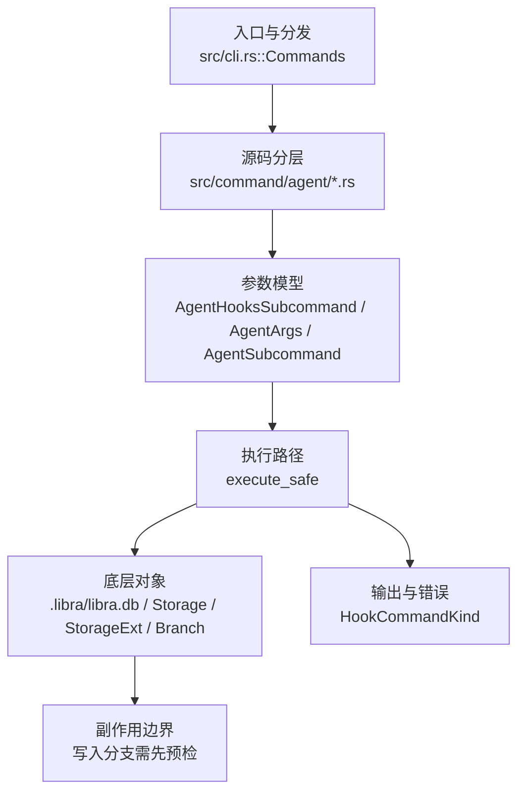

# `libra agent` 开发设计

## 命令实现目标

`libra agent` 的目标是管理 Libra 外部代理捕获能力，包括安装/移除 provider hooks、查看会话与 checkpoint 状态、输出只读诊断信息，以及把 `refs/libra/agent-traces` 推送到远端。该命令服务于 Agent 运行记录和外部工具接入，不对应 Git 原生命令。

## 对比 Git 与兼容性

- 兼容级别：`intentionally-different`。Libra external-agent capture extension, not a Git command

- 该命令或行为属于 Libra 扩展/有意差异；重点是清晰边界、结构化输出和可测试错误，而不是 Git 完全同形。

## 设计方案

- 入口与分发：已公开接入 `src/cli.rs::Commands`；已由 `src/command/mod.rs` 导出。CLI 层在 `src/cli.rs` 把解析后的参数交给命令模块，命令模块负责把领域错误转换为 `CliError` / `CliResult`。
- 源码分层：主要实现文件为 `src/command/agent/checkpoint.rs`、`src/command/agent/clean.rs`、`src/command/agent/doctor.rs`、`src/command/agent/hooks.rs`、`src/command/agent/mod.rs`、`src/command/agent/push.rs`、`src/command/agent/rpc.rs`、`src/command/agent/session.rs`、`src/command/agent/status.rs`。参数/子命令类型包括：`AgentHooksSubcommand`、`AgentArgs`、`AgentSubcommand`、`EnableArgs`、`DisableArgs`、`CleanArgs`、`DoctorArgs`、`PushArgs`、`CheckpointSubcommand`、`CheckpointListArgs`、`CheckpointShowArgs`、`CheckpointRewindArgs`；输出、错误或状态类型包括：`HookCommandKind`；主要执行函数包括：`execute_safe`。
- 执行路径：`execute_safe` 负责 CLI 安全包装、错误映射和输出配置；索引路径会加载、比较、刷新或保存 `.libra/index`；对象路径会解析 revision 并读写 blob/tree/commit/tag 等对象；引用路径会读取或更新 SQLite refs、HEAD 与 reflog；数据库路径会通过 SeaORM/SQLite 或 D1 客户端持久化元数据；AI 路径会读写 session、checkpoint、thread graph 或 agent profile 状态。

- 流程图：以下流程图按当前源码分层展示主路径和底层对象边界，便于维护者把代码入口、执行函数和副作用范围对应起来。

- 底层操作对象：agent checkpoint（Agent 运行快照、回放和 transcript 截断输入）；Agent profile / runtime 对象（外部代理、hook、权限和运行状态）；session/thread store（AI 会话、线程、事件和恢复状态）；SeaORM / `.libra/libra.db`（配置、refs、reflog、AI/发布元数据等 SQLite 表）；`Storage` / `StorageExt`（对象存储抽象，覆盖本地、remote 和 publish 存储）；`Branch` / branch store（SQLite refs 上的分支读写、过滤和上游关系）；`Commit`（提交对象、父提交关系和提交消息载荷）；`Tree`（由索引或对象遍历生成的目录树对象）；`Index` / `.libra/index`（暂存区状态、路径条目和刷新/保存边界）；`ClientStorage`（本地/分层对象存储读写入口）；`LocalStorage`（本地对象或发布存储根目录）；`DatabaseConnection`（SeaORM 数据库连接）
- 输出与错误契约：人类输出、`--json` / `--machine` 输出和 quiet/verbose 分支必须继续走现有 `OutputConfig` / `emit_json_data` / `CliError` 路径；新增失败模式要补稳定错误码、用户提示和回归测试。
- 副作用边界：凡是写入索引、对象库、refs/HEAD、reflog、SQLite/D1、工作树或远端的路径，都必须先完成参数校验和 dry-run/预检分支，再执行持久化，避免部分写入后静默成功。

## 实现历史

- 本节依据本地 main 分支提交历史重写，筛选与该命令实现、测试或文档路径直接相关的提交；以下是归纳后的实现脉络。
- 2026-02-05 `ab75c7f2`（`Introduce AI Agent Infrastructure (#187)`）：基础实现节点：Introduce AI Agent Infrastructure (#187)；当前实现的主要轮廓可追溯到该提交。
- 2026-06-05 `fa450e91`（`feat(agent): support promoted transcript truncation`）：功能演进：support promoted transcript truncation；该节点扩展了当前命令可用的参数或行为。
- 2026-06-05 `8761159f`（`feat(agent): install hooks for the 5 promoted external agents`）：功能演进：install hooks for the 5 promoted external agents；该节点扩展了当前命令可用的参数或行为。
- 2026-06-01 `4aab5988`（`fix(agent): extract checkpoint transcripts`）：实现修正：extract checkpoint transcripts；该节点把边界行为、错误处理或兼容差异纳入当前实现约束。
- 2026-06-05 `15e51a85`（`docs(agent): sync agent.md with the 7-agent hook matrix and rewind truncation`）：文档与兼容口径：sync agent.md with the 7-agent hook matrix and rewind truncation；当前文档按该节点之后的实现状态校准。
- 历史结论：当前文档应以这些提交之后的代码、测试和兼容矩阵为准；更早的迁移式文档只保留为背景，不再作为事实来源。

## 当前状态

- 公开状态：已公开；模块状态：已导出。
- 用户文档：`docs/commands/agent.md`。
- Synopsis：`libra agent status`。
- 公开参数/子命令以用户文档和 CLI help 为准；当前未抽取到独立 Options/Subcommands 小节。

## 还未实现的功能

| 类别 | 未完成项 | 当前处理 |
|---|---|---|
| 兼容矩阵说明 | Libra 外部代理捕获扩展, 不是 Git 命令 | 按当前兼容矩阵保留；实现状态变化时同步 `_compatibility.md` 和测试证据。 |
| Agent 迁移约束 | claudecode 硬删除已完成；`src/internal/ai/claudecode/` 不存在，不能重新作为活跃 provider 规划。 | 该约束必须保留，避免旧 provider 路径被重新规划为活跃实现。 |
| Agent 迁移约束 | `diagnostics_redaction_test` 仍是 diagnostics 字段脱敏的回归测试。 | 该约束必须保留，避免旧 provider 路径被重新规划为活跃实现。 |

## 维护要求

- 改进本命令前，必须先阅读并遵循 [docs/development/commands/_general.md](_general.md)；这是命令设计、实现、测试和文档同步的强制要求。
- 任何行为变更都要先核对实现源码，再同步 `COMPATIBILITY.md`、`docs/commands/<cmd>.md` 和相关测试。
- 新增 Git 兼容参数时必须明确 tier、错误码、JSON/机器输出契约和回归测试。
