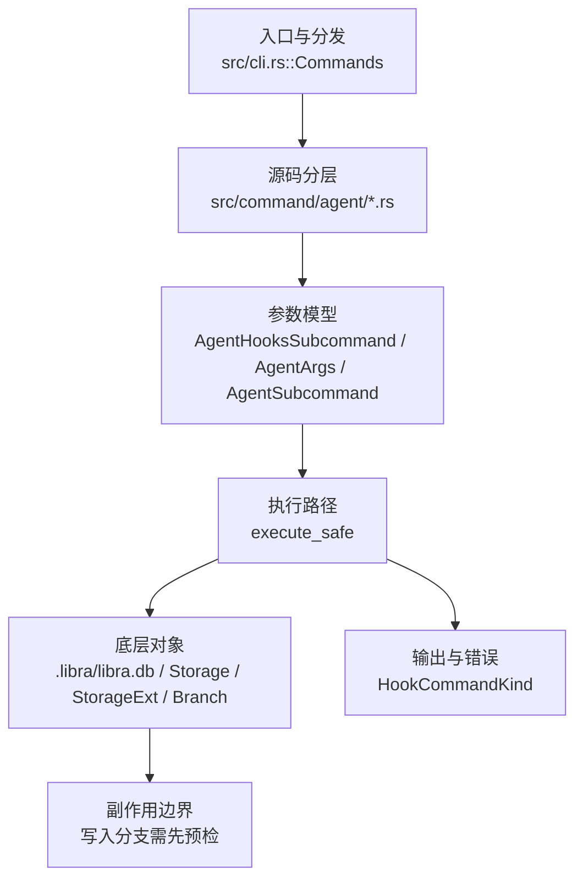

# `libra agent` 开发设计

## 命令实现目标

`libra agent` 的目标是管理 Libra 外部代理捕获能力，包括安装/移除 provider hooks、查看会话与 checkpoint 状态、输出只读诊断信息，以及把 `refs/libra/agent-traces` 推送到远端。该命令服务于 Agent 运行记录和外部工具接入，不对应 Git 原生命令。

## 对比 Git 与兼容性

- 兼容级别：`intentionally-different`。Libra external-agent capture extension, not a Git command

- 该命令或行为属于 Libra 扩展/有意差异；重点是清晰边界、结构化输出和可测试错误，而不是 Git 完全同形。

## 设计方案

- 入口与分发：已公开接入 `src/cli.rs::Commands`；已由 `src/command/mod.rs` 导出。CLI 层在 `src/cli.rs` 把解析后的参数交给命令模块，命令模块负责把领域错误转换为 `CliError` / `CliResult`。
- 源码分层：主要实现文件为 `src/command/agent/checkpoint.rs`、`src/command/agent/clean.rs`、`src/command/agent/doctor.rs`、`src/command/agent/hooks.rs`、`src/command/agent/mod.rs`、`src/command/agent/push.rs`、`src/command/agent/rpc.rs`、`src/command/agent/session.rs`、`src/command/agent/status.rs`。参数/子命令类型包括：`AgentHooksSubcommand`、`AgentArgs`、`AgentSubcommand`、`StatusArgs`、`EnableArgs`、`DisableArgs`、`CleanArgs`、`DoctorArgs`、`PushArgs`、`CheckpointSubcommand`、`CheckpointListArgs`、`CheckpointShowArgs`、`CheckpointRewindArgs`、`SessionSubcommand`、`SessionListArgs`、`SessionShowArgs`、`SessionStopArgs`、`SessionResumeArgs`、`SessionPromoteArgs`、`SessionDeriveToolCallsArgs`、`AgentRpcSubcommand`、`AgentRpcListArgs`、`AgentRpcInvokeArgs`；输出、错误或状态类型包括：`HookCommandKind`；主要执行函数包括：`execute_safe`。
- 执行路径：`execute_safe` 负责 CLI 安全包装、错误映射和输出配置；索引路径会加载、比较、刷新或保存 `.libra/index`；对象路径会解析 revision 并读写 blob/tree/commit/tag 等对象；引用路径会读取或更新 SQLite refs、HEAD 与 reflog；数据库路径会通过 SeaORM/SQLite 或 D1 客户端持久化元数据；AI 路径会读写 session、checkpoint、thread graph 或 agent profile 状态。

- 流程图：以下流程图按当前源码分层展示主路径和底层对象边界，便于维护者把代码入口、执行函数和副作用范围对应起来。

- 底层操作对象：agent checkpoint（Agent 运行快照、回放和 transcript 截断输入）；Agent profile / runtime 对象（外部代理、hook、权限和运行状态）；session/thread store（AI 会话、线程、事件和恢复状态）；SeaORM / `.libra/libra.db`（配置、refs、reflog、AI/发布元数据等 SQLite 表）；`Storage` / `StorageExt`（对象存储抽象，覆盖本地、remote 和 publish 存储）；`Branch` / branch store（SQLite refs 上的分支读写、过滤和上游关系）；`Commit`（提交对象、父提交关系和提交消息载荷）；`Tree`（由索引或对象遍历生成的目录树对象）；`Index` / `.libra/index`（暂存区状态、路径条目和刷新/保存边界）；`ClientStorage`（本地/分层对象存储读写入口）；`LocalStorage`（本地对象或发布存储根目录）；`DatabaseConnection`（SeaORM 数据库连接）
- 输出与错误契约：人类输出、`--json` / `--machine` 输出和 quiet/verbose 分支必须继续走现有 `OutputConfig` / `emit_json_data` / `CliError` 路径；新增失败模式要补稳定错误码、用户提示和回归测试。
- 副作用边界：凡是写入索引、对象库、refs/HEAD、reflog、SQLite/D1、工作树或远端的路径，都必须先完成参数校验和 dry-run/预检分支，再执行持久化，避免部分写入后静默成功。

## 实现历史

- 本节依据本地 main 分支提交历史重写，筛选与该命令实现、测试或文档路径直接相关的提交；以下是归纳后的实现脉络。
- 2026-02-05 `ab75c7f2`（`Introduce AI Agent Infrastructure (#187)`）：基础实现节点：Introduce AI Agent Infrastructure (#187)；当前实现的主要轮廓可追溯到该提交。
- 2026-06-05 `fa450e91`（`feat(agent): support promoted transcript truncation`）：功能演进：support promoted transcript truncation；该节点扩展了当前命令可用的参数或行为。
- 2026-06-05 `8761159f`（`feat(agent): install hooks for the 5 promoted external agents`）：功能演进：install hooks for the 5 promoted external agents；该节点扩展了当前命令可用的参数或行为。
- 2026-06-01 `4aab5988`（`fix(agent): extract checkpoint transcripts`）：实现修正：extract checkpoint transcripts；该节点把边界行为、错误处理或兼容差异纳入当前实现约束。
- 2026-06-05 `15e51a85`（`docs(agent): sync agent.md with the 7-agent hook matrix and rewind truncation`）：文档与兼容口径：sync agent.md with the 7-agent hook matrix and rewind truncation；当前文档按该节点之后的实现状态校准。
- 历史结论：当前文档应以这些提交之后的代码、测试和兼容矩阵为准；更早的迁移式文档只保留为背景，不再作为事实来源。

## 当前状态

- 公开状态：已公开；模块状态：已导出。
- 用户文档：`docs/commands/agent.md`。
- Synopsis：`libra agent <status|enable|disable|session|checkpoint|clean|doctor|push|rpc>`。
- 公开参数/子命令包括：`status`、`enable [--agent <NAME>...]`、`disable [--agent <NAME>...]`、`session <list|show|stop|resume|promote|derive-tool-calls>`、`checkpoint <list|show|rewind>`、`clean [--all]`、`doctor`、`push [--remote <NAME>]`、`rpc <list|invoke>`（隐藏的 `hooks` 子命令供已安装的 provider hook 内部调用）。

## 与参考代码的功能差距分析

本章节基于 `/run/media/eli/data/GitMono/cli`（Go 实现的 entire CLI，功能参考）和 `/run/media/eli/data/GitMono/cli-checkpoints`（entire 的 checkpoint 数据归档）的最新情况，对比 libra 当前实现，列出需要改进的方向。

### 参考项目说明

- `/run/media/eli/data/GitMono/cli`：entire CLI 的 Go 实现，提供完整的 agent 捕获、hook 分发、多 agent 协作、review / investigate / spawn 等能力。
- `/run/media/eli/data/GitMono/cli-checkpoints`：entire 运行产生的 checkpoint 数据归档（非源代码），目录下是按 bucket 组织的 checkpoint，包含 `metadata.json`、`full.jsonl`、`context.md`、`prompt.txt` 等文件。它反映了 entire 实际落盘的 checkpoint 数据模型，可作为 libra checkpoint 数据丰富度的参考。

### 1. Agent 命令面差距

| entire CLI | libra 当前 | 差距说明 |
|---|---|---|
| `entire agent list`：列出已安装和可用的 agents | 无 `libra agent list`；只有 `status` | 缺少面向用户的 agent 目录/安装状态一览命令 |
| `entire agent add <agent>` / `remove <agent>`，支持 `--local-dev`、`--force` | `libra agent enable` / `disable`，无 `--local-dev` / `--force` | 安装/卸载语义和选项不完整；本地开发迭代和强制重装场景未覆盖 |
| `entire hooks <agent> <verb>`：按 agent 动态注册的顶层 hook 分发 | `libra hooks <provider> <subcommand>` 和隐藏的 `libra agent hooks` 存在，但不是按 agent 动态注册 verb | hook 分发层与 agent registry 未完全打通；新增 agent 需要手动改命令代码 |

### 2. Agent 能力模型差距

entire CLI 的 `cmd/entire/cli/agent/agent.go` 定义了丰富的可选能力接口，而 libra 当前 `src/internal/ai/observed_agents/adapter.rs` 的 `ObservedAgent` trait 只暴露了少量能力。

| entire 能力接口 | 当前 libra 状态 | 建议 |
|---|---|---|
| `HookSupport`（hook 安装/卸载/解析） | 仅 Claude/Gemini 有 `HookProvider` | 把 hook 安装能力抽象为可选 trait，让 Cursor/Codex/OpenCode/Copilot/FactoryAI 也能逐步实现安装 |
| `ProtectedFilesProvider` | 无 | agent 可声明需要保护的文件/目录，避免被误改或误捕获 |
| `TranscriptAnalyzer` / `PromptExtractor` / `TranscriptPreparer` | 无 | 支持按 agent 解析/准备/分析 transcript |
| `TokenCalculator` / `ModelExtractor` | 无 | 从 transcript 提取 token 用量和模型信息 |
| `TextGenerator` | 无 | Codex 等 agent 的独立文本生成能力 |
| `TranscriptCompactor` | 无 | transcript 压缩/condensation 能力 |
| `HookResponseWriter` | 无 | agent 向 hook 调用方写回响应 |
| `RestoredSessionPathResolver` | 无 | 恢复会话时解析路径 |
| `Launcher` / `SkillDiscoverer` / `SessionBaseDirProvider` | 无 | agent 启动器、skill 发现、会话基础目录 |
| `SubagentAwareExtractor` | 仅内部 sub_agent 有相关逻辑 | 外部 agent 也应支持子 agent 感知提取 |

### 3. Hook 与生命周期差距

| entire CLI | libra 当前 | 差距说明 |
|---|---|---|
| `DispatchLifecycleEvent`：把规范化 `agent.Event` 转成框架动作 | hook runtime 直接写入 `agent_session` / `agent_checkpoint` | 缺少统一的 lifecycle dispatcher，框架侧与 agent 侧耦合较紧 |
| Agent ownership filtering：Cursor IDE 同时向多个 hooks 转发时，按记录的 `AgentType` 忽略非属主事件 | 无 | 当多个 provider 配置互相转发时可能产生重复 checkpoint |
| Codex trust-gap detection：检测用户未本地批准的新 hook | 无 | 安全性/透明性不足 |
| 标准化 `Event` / `EventType`：SessionStart/TurnStart/TurnEnd/Compaction/SessionEnd/SubagentStart/SubagentEnd/ModelUpdate/ToolUse | hook event 类型较简单 | 事件模型不够丰富，难以支持 compaction、subagent 等高级生命周期 |

### 4. Transcript 与 Checkpoint 差距

| entire CLI | libra 当前 | 差距说明 |
|---|---|---|
| `ChunkJSONL` / `ReassembleJSONL` / `ChunkTranscript` / `ReassembleTranscript`（50MB 分块） | 仅有 truncation/redaction；无分块重组 | 大 transcript 无法分片存储/传输 |
| Rewind preview / cleanup / condensation / shadow branches / manual-commit strategy | 仅有 `checkpoint rewind --dry-run/--apply` | 缺少 preview、cleanup、condensation、shadow branch 等高级回放/清理策略 |
| Checkpoint 元数据包含 `context.md`、`prompt.txt` 等（见 cli-checkpoints） | `checkpoint show` 只展示部分元数据 | 需要支持导出/展示更完整的 checkpoint 上下文 |

### 5. 外部插件 / RPC 差距

| entire CLI | libra 当前 | 差距说明 |
|---|---|---|
| External agent plugin protocol：`entire-agent-<name>` 二进制，JSON-over-stdio，协议版本 1，capability 声明 | `libra agent rpc list/invoke` 发现 `libra-agent-*` 二进制 | 缺少协议版本、capability negotiation、规范的生命周期子命令（`info`/`detect`/`parse-hook`/`install-hooks` 等） |
| `CapabilityDeclarer` + `DeclaredCaps` 门控可选接口 | 无 | 外部二进制无法声明自己支持哪些能力 |

### 6. 多 Agent / Review / Investigate 差距

| entire CLI | libra 当前 | 差距说明 |
|---|---|---|
| `entire review --agent`、多 agent 并行 review | 无命令层 review --agent | 无法按指定 agent 运行 review |
| `entire investigate`：多 agent 轮询调查、quorum | 无 investigate 命令 | 缺少多 agent 协作调查能力 |
| `LaunchFixAgent` / `Spawner`：非交互式启动 agent 会话 | 无 | 无法由 libra 主动启动外部 agent 进行修复/审查 |
| `entire attach --agent` / `entire resume --agent` | 无 `--agent` 过滤 | attach/resume 不能按 agent 筛选 |

### 7. Skill Discovery 差距

| entire CLI | libra 当前 | 差距说明 |
|---|---|---|
| `SkillDiscoverer` 接口 + `skilldiscovery` 注册表：按 agent 提供 curated review skills 和安装提示 | 有通用 skills 系统，但无 agent-specific skill discovery | 外部 agent 无法被发现/推荐专属 skill |

### 8. Agent 覆盖差距

| entire CLI | libra 当前 | 差距说明 |
|---|---|---|
| 内置 9+ agents：Claude Code、Codex、Cursor、Gemini CLI、OpenCode、Factory AI Droid、Copilot CLI、Pi、Vogon | registry 有 7 种，稳定可安装仅 Claude Code / Gemini；5 个 promoted 无 hook provider；无 Pi / Vogon | 需要继续补齐 promoted agents 的 hook provider，并考虑 Pi / Vogon 等 agent 的适配 |

### 9. 测试与架构差距

| entire CLI | libra 当前 | 差距说明 |
|---|---|---|
| `architecture_test.go`：agents 禁止导入 `strategy`/`checkpoint`/`session`/`commands`/top-level `cli`；每个 agent package 必须有 `init()` 调用 `agent.Register` | 仅有 `tests/compat/agent_docs_contract.rs`、`tests/compat/agent_run_non_exhaustive_guard.rs` | 缺少 architecture import 约束和 self-register 强制测试，agent 包容易与框架层循环依赖 |
| `agent_test.go`、`registry_test.go`、`capabilities_test.go`、`chunking_test.go` 等 + 大量 integration / E2E tests | 命令层和内部单元测试已覆盖基础路径 | 需要补充 chunking、capability gating、external plugin protocol、multi-agent review/investigate 等测试 |

### 10. 来自 cli-checkpoints 的数据模型差距

`/run/media/eli/data/GitMono/cli-checkpoints` 中每个 checkpoint bucket 至少包含：

- `metadata.json`：checkpoint 元数据
- `full.jsonl`：完整 transcript
- `context.md`：会话上下文
- `prompt.txt`：提示词快照

libra 当前 `agent_checkpoint` 表和 `checkpoint show` 主要关注 `parent_commit`、`tree_oid`、`metadata_blob_oid`、`traces_commit` 等对象级字段，对上述用户可读的上下文文件缺乏直接导出能力。

建议改进：

1. `libra agent checkpoint show` 支持 `--format=full` 展示/导出 `context.md`、`prompt.txt` 内容摘要。
2. `libra agent session show` 支持 `--extract-transcript` 之外，增加 `--extract-context` / `--extract-prompt`。
3. checkpoint 元数据 blob 中规范存储 `context.md`、`prompt.txt` 的 OID，确保归档结构与 entire 兼容。

## 还未实现的功能

| 类别 | 未完成项 | 当前处理 | 参考来源 |
|---|---|---|---|
| 兼容矩阵说明 | Libra 外部代理捕获扩展, 不是 Git 命令 | 按当前兼容矩阵保留；实现状态变化时同步 `_compatibility.md` 和测试证据。 | libra 当前实现 |
| Agent 迁移约束 | claudecode 硬删除已完成；`src/internal/ai/claudecode/` 不存在，不能重新作为活跃 provider 规划。 | 该约束必须保留，避免旧 provider 路径被重新规划为活跃实现。 | libra 当前实现 |
| Agent 迁移约束 | `diagnostics_redaction_test` 仍是 diagnostics 字段脱敏的回归测试。 | 该约束必须保留，避免旧 provider 路径被重新规划为活跃实现。 | libra 当前实现 |
| 命令面 | `libra agent list` / `add` / `remove` 及 `--local-dev` / `--force` | 当前只有 `enable` / `disable` / `status`；需新增或扩展子命令。 | entire `cmd/entire/cli/agent_group.go` |
| 命令面 | 按 agent 动态注册的顶层 `libra hooks <agent> <verb>` | 当前 `libra hooks` 按 provider 硬编码子命令。 | entire `cmd/entire/cli/hook_registry.go` |
| 能力模型 | 补齐 `ProtectedFilesProvider`、`TranscriptAnalyzer`、`TokenCalculator`、`TranscriptCompactor` 等可选 trait | 当前 `ObservedAgent` 能力矩阵较薄。 | entire `cmd/entire/cli/agent/agent.go` |
| Hook 生命周期 | 统一 `DispatchLifecycleEvent` 和 agent ownership filtering | 当前 hook runtime 直接写库，无统一 dispatcher。 | entire `cmd/entire/cli/lifecycle.go` |
| 安全 | Codex trust-gap detection | 当前无 hook 信任缺口检测。 | entire `cmd/entire/cli/agent/codex/hooks.go` |
| Transcript | 分块/重组大 transcript（50MB 阈值） | 当前只有 redaction / truncation。 | entire `cmd/entire/cli/agent/chunking.go` |
| Checkpoint | rewind preview / cleanup / condensation / shadow branch | 当前只有 `checkpoint rewind --dry-run/--apply`。 | entire `cmd/entire/cli/strategy/` |
| 外部插件 | 完整 external agent plugin protocol（版本、capability 声明） | 当前只有 `libra agent rpc list/invoke`。 | entire `cmd/entire/cli/agent/external/` |
| 多 Agent | `libra review --agent`、`libra investigate`、agent spawn/launch | 当前命令层无 review/investigate/spawn/launch。 | entire `cmd/entire/cli/review/cmd.go`、`cmd/entire/cli/investigate/cmd.go` |
| Skill | agent-specific skill discovery | 当前 skills 系统未与 agent registry 打通。 | entire `cmd/entire/cli/agent/skilldiscovery/` |
| Agent 覆盖 | 补齐 Cursor/Codex/OpenCode/Copilot/FactoryAI hook provider；评估 Pi / Vogon | 当前仅 Claude Code / Gemini 可安装。 | entire `cmd/entire/cli/agent/*` |
| 架构测试 | agent package import 约束 + self-register 强制测试 | 当前 compat guard 不足。 | entire `cmd/entire/cli/agent/architecture_test.go` |
| 数据模型 | checkpoint 导出 `context.md` / `prompt.txt` / `full.jsonl` | 当前 `checkpoint show` / `session show` 不支持。 | cli-checkpoints bucket 内容 |

## 维护要求

- 改进本命令前，必须先阅读并遵循 [docs/development/commands/_general.md](_general.md)；这是命令设计、实现、测试和文档同步的强制要求。
- 任何行为变更都要先核对实现源码，再同步 `COMPATIBILITY.md`、`docs/commands/<cmd>.md` 和相关测试。
- 新增 Git 兼容参数时必须明确 tier、错误码、JSON/机器输出契约和回归测试。
