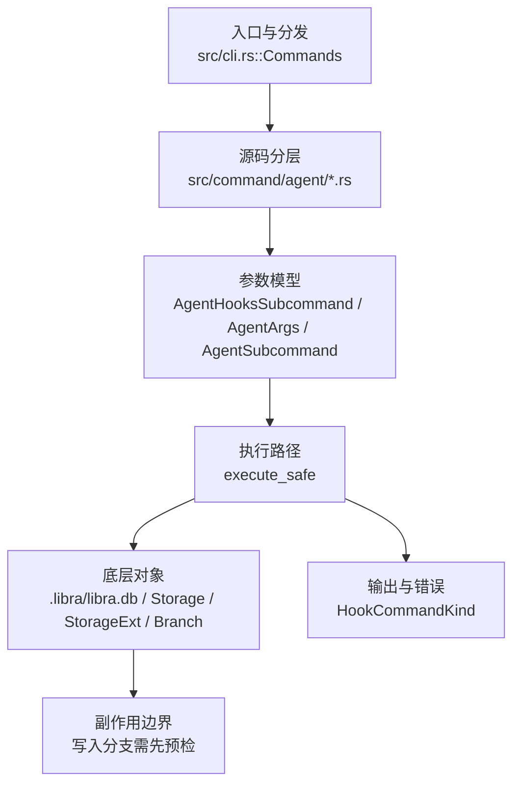

# `libra agent` 开发设计

> 本文件是 `libra agent`（外部 Agent 捕获子系统）的**公共 CLI/行为事实源**，已从 [`docs/development/agent.md`](../agent.md) 拆入 external-agent 捕获需要的 entireio/cli 对齐契约、AG-16~AG-24 任务卡、E1–E9 wire contract、checkpoint/export、review/investigate 与验收命令。`docs/development/agent.md` 继续负责内部 AgentRuntime、Web-only 迁移、MCP/control-plane 边界和 Gate 8 的总览追踪；两份文档任一处修改 public surface、E 契约、AG-16~AG-24 或有意差异时，必须同一 PR 同步。

> **术语与特性边界澄清**：本文档中的 "SubagentStart / SubagentEnd" 与 checkpoint `scope = 'subagent'` 专指**被观测的外部 Agent**（Claude Code 等）在其 transcript 中产生的子代理事件，由 `libra agent` 捕获。**与此正交**的是 Cargo feature `subagent-scaffold`（CEX-S2-10，Step 2 子代理契约 schema-only 脚手架），它用于 `src/internal/ai/agent/`、`goal/` 等内部 AgentRuntime 的子代理合约定义，当前受 CP-4 gate 保护。Cargo.toml 中的注释引用本文档 "Step 2 audit closure" 应理解为外部捕获计划为整体子代理事件面提供上下文；内部 scaffold 的实际实现与审计位于内部 AI 模块与 `docs/development/agent.md`。新增/修改任一 "subagent" 语义时，必须同步更新 Cargo 注释与两份文档。

## Agent 命令实现功能边界

本节根据 `/Volumes/Data/entireio/cli` 当前 `entire agent` 命令面和 `cmd/entire/cli/agent/` 抽象，冻结 `libra agent` 改进方案的功能边界。参考实现中 `entire agent` 负责 repository 内的 Agent integration 管理（`list` / `add` / `remove`），底层 `agent` package 负责 registry、capability、hook、transcript、token、skill 与 external plugin protocol；`review`、`investigate`、`session`、`checkpoint`、`attach`、`resume`、`rewind` 是消费这些能力的相邻工作流。Libra 当前已把 `session`、`checkpoint`、`clean`、`doctor`、`push`、`rpc` 放在 `libra agent` 下，因此它们只在**操作外部 Agent 捕获产物**时属于本命令边界。

`libra agent` 改进方案包含以下功能面：

- **Agent 集成管理**：列出 registered / available / installed agents；安装与移除 hook；保留 `status` / `enable` / `disable` canonical 入口，并新增 `list` / `add` / `remove` 兼容别名。输出必须区分 `registered`、`hook_installable`、`transcript_readable`、`launchable_review`、`launchable_investigate`、`external_binary`，不得把“可注册”误报为“可安装 hook”或“可启动 reviewer”。
- **能力声明与 registry**：以 `DeclaredAgentCaps` / capability-gated helper 表达 hooks、transcript analyzer/preparer、token calculator、text generator、compaction、hook response、subagent-aware extractor 等可选能力。built-in adapter 可通过 trait/impl 直接声明；external binary 必须先通过协议声明能力，未声明的方法 fail-closed。
- **Hook 与 lifecycle 捕获**：已安装 provider hook、隐藏 `agent hooks` 入口和 external RPC parser 只能产出 provider-neutral lifecycle event，经统一校验、owner filtering、path/session validation、redaction 后再写入 checkpoint。事件边界包括 `SessionStart`、`TurnStart`、`TurnEnd`、`Compaction`、`SessionEnd`、`SubagentStart`、`SubagentEnd`、`ModelUpdate`、`ToolUse`。
- **Session / checkpoint 捕获与诊断**：`agent_session`、`agent_checkpoint`、`agent_usage_stats`、`.libra/sessions/agent/`、`refs/libra/agent-traces` 和 `object_index` 共同构成外部捕获事实源。`session list/show` 与 `checkpoint list/show` 默认 metadata-first；读取 transcript、prompt、context、stderr、raw payload 必须走显式 detail/raw 路径，并受 size cap、streaming/chunk、redaction、audit 约束。`clean`、`doctor`、`push`、`rewind` 只处理这些外部捕获对象，不扩大为通用 Git/工作区维护命令。
- **External `libra-agent-<name>` 协议**：保留 Libra 的 JSON-RPC 传输，能力面与 entire external protocol 对齐：`info`、`protocol_version`、8-bool capability schema、repo-root/env 注入、timeout、IO cap、settings gate、provenance、内置 slug 仿冒防护、stderr capture/redaction。它不是 MCP stdio，也不是内部 AgentRuntime turn 控制面。
- **Transcript intelligence 与 skill event**：允许按 capability 做 transcript 准备、文件/模型/token/prompt/skill/subagent 提取和 native transcript chunk/reassemble；extractor 缺失或可选字段缺失可 fail-open 并标 `partial`，但 redaction、path 安全、UTF-8/JSON envelope、写入、rewind apply、hook install/uninstall、external launch/fix 一律 fail-closed。
- **Review / investigate 相邻工作流**：review / investigate 可以消费 `libra agent` 的 registry、capability、checkpoint、transcript 和 findings/provenance 数据；但 mutating fix/action 必须桥接内部 `libra code` AgentRuntime serialized queue、approval、sandbox 和 tool gate。observed external agent 只能提供 transcript、hook event、findings、manual attach/provenance，不能直接成为 Libra 的受控 mutating executor。

### 第一批支持项目（执行本文档时的强制范围）

执行本文档的 agent 集成计划时，第一批 supported roster **只允许**包含以下 3 个 observed external agent：

| slug | AgentKind / DB value | 第一批状态 | 必须支持的能力 | 安装配置面 |
|---|---|---|---|---|
| `claude-code` | `ClaudeCode` / `claude_code` | first-batch supported；hook-installable | hook install/uninstall/status、lifecycle ingest、transcript read、checkpoint/export、review evidence | `.claude/settings.json` |
| `codex` | `Codex` / `codex` | first-batch supported；Codex HookProvider 落地前只能 transcript-readable，不能标 installed | capability row、transcript read；HookProvider 落地后 hook install/uninstall/status、lifecycle ingest、checkpoint/export | `.codex/hooks.json` + `.codex/config.toml` |
| `opencode` | `OpenCode` / `opencode` | first-batch supported；OpenCode HookProvider 落地前只能 transcript-readable，不能标 installed | capability row、transcript read；HookProvider 落地后 hook install/uninstall/status、lifecycle ingest、checkpoint/export、review evidence | `.opencode/hooks.json`（或实现 PR 依据 OpenCode 上游格式固定的等价项目级 hook 配置） |

首批之外的 `gemini`、`cursor`、`copilot`、`factory-ai`、`pi`、`vogon`、未知 external slug 和历史/预览 adapter **不得作为 supported agent 暴露**：`list/status --json` 不能把它们标成 `supported=true`、`hook_installable=true`、`installed=true`、`launchable_review=true` 或 `launchable_investigate=true`；`add/enable` 必须返回 actionable unsupported / skipped diagnostic；hook ingest 不得为这些 slug 写入 `agent_session.agent_kind`。源码中已有的 `AgentKind`、SQL CHECK 或历史 provider 只能作为 migration/backward-compat 背景，不能扩大本文执行范围。

首批 capability matrix 必须固定这些字段：`slug`、`agent_kind`、`db_value`、`supported`、`support_wave="first_batch"`、`registered`、`transcript_readable`、`hook_installable`、`installed`、`launchable_review`、`launchable_investigate`、`external_binary`、`config_paths`、`capabilities`。新增首批外 agent 必须另开 PR 更新本节、E9、任务卡、用户文档和 compat schema pin test。

### Claude Code 安装流程契约（第一批必须满足）

Claude Code 是第一批必须可安装的 external-agent hook provider。执行 `libra agent enable --agent claude-code`（以及未来 alias `libra agent add claude-code`）时必须满足以下条件：

1. **注册与状态输出**

   `claude-code` 行必须暴露：`supported=true`、`support_wave="first_batch"`、`registered=true`、`agent_kind=claude-code`、`db_value=claude_code`、`provider_name=claude`、`stability=stable`、`protected_dirs=[".claude"]`、`transcript_readable=true`、`hook_installable=true`、`installed=<bool>`、`capabilities.hooks=true`、`capabilities.native_transcript=true`。

2. **启用顺序**

   启用命令的实现顺序必须是：解析 CLI slug `claude-code` / alias `claude` → 映射 `AgentKind::ClaudeCode` → 查找 `provider_name=claude` 的 `HookProvider` → 构造 `ProviderInstallOptions`（优先使用当前 `libra` 二进制绝对路径，fallback 为 `libra`）→ 读取 `.claude/settings.json` → upsert Libra-managed hook entries → 原子写回 → 重新读取配置验证 → `list/status` 报告 `installed=true`。任一步失败都必须 fail-closed，不得写半截 JSON，不得创建 `agent_session`，不得把 `installed` 标为 true。

3. **安装后的 `.claude/settings.json` 目标形态**

   Libra 只管理自己写入的 command hook，必须保留用户已有 top-level keys、matcher、非 Libra hook 和额外字段。安装器按 event key 增量 upsert `matcher=null` 的 Libra hook entry；如果用户已有同 event 的其它 matcher 或 command，必须保留。

   ```json
   {
     "hooks": {
       "SessionStart": [
         {
           "matcher": null,
           "hooks": [
             {
               "type": "command",
               "command": "libra hooks claude session-start",
               "timeout": 10
             }
           ]
         }
       ],
       "UserPromptSubmit": [
         {
           "matcher": null,
           "hooks": [
             {
               "type": "command",
               "command": "libra hooks claude prompt",
               "timeout": 10
             }
           ]
         }
       ],
       "PostToolUse": [
         {
           "matcher": null,
           "hooks": [
             {
               "type": "command",
               "command": "libra hooks claude tool-use",
               "timeout": 10
             }
           ]
         }
       ],
       "Stop": [
         {
           "matcher": null,
           "hooks": [
             {
               "type": "command",
               "command": "libra hooks claude stop",
               "timeout": 10
             }
           ]
         }
       ],
       "SessionEnd": [
         {
           "matcher": null,
           "hooks": [
             {
               "type": "command",
               "command": "libra hooks claude session-end",
               "timeout": 10
             }
           ]
         }
       ]
     }
   }
   ```

   `ModelUpdate`、`Compaction`、`ToolUse` parser 能力可以存在，但当前 Claude Code 安装器只要求写入上表 5 个 forward events；若未来增加安装事件，必须同步本节、`docs/development/commands/hooks.md`、schema tests 和 uninstall 规则。

4. **停用与移除**

   `libra agent disable --agent claude-code` / `remove claude-code` 只能删除 `libra hooks claude ...` managed entries；不得删除用户自定义 hook、`.claude/settings.json` 中其它配置或已捕获的 `agent_session` / `agent_checkpoint` / `refs/libra/agent-traces` 数据。停用后 capability matrix 必须显示 `supported=true`、`hook_installable=true`、`installed=false`。

### OpenCode 安装流程契约（第一批必须满足）

OpenCode 是第一批 supported agent；执行本文档时必须补齐 OpenCode HookProvider，而不能继续只把它当 generic stable-promoted transcript adapter。HookProvider 落地前，OpenCode capability row 只能显示 `supported=true`、`registered=true`、`transcript_readable=true`、`hook_installable=false`、`installed=false`；实现完成后才可置为 hook-installable。

1. **注册与状态输出**

   `opencode` 行必须暴露：`supported=true`、`support_wave="first_batch"`、`registered=true`、`agent_kind=opencode`、`db_value=opencode`、`provider_name=opencode`、`stability=stable`、`protected_dirs=[".opencode"]`、`transcript_readable=true`、`hook_installable=<bool>`、`installed=<bool>`、`capabilities.native_transcript=true`。HookProvider 落地后还必须有 `capabilities.hooks=true`。

2. **启用顺序**

   未来 `libra agent enable --agent opencode` / `add opencode` 的实现顺序必须是：解析 CLI slug `opencode` / alias `open-code` → 映射 `AgentKind::OpenCode` → 查找 `provider_name=opencode` 的 `HookProvider` → 构造 `ProviderInstallOptions` → 读取项目级 OpenCode hook 配置（首选 `.opencode/hooks.json`；若实现 PR 采用上游不同文件名，必须在同 PR 修改本节并加 compat test 固定）→ upsert Libra-managed hook entries → 原子写回 → 重新读取验证 → `list/status` 报告 `installed=true`。

3. **安装后的 `.opencode/hooks.json` 目标形态**

   目标形态按 Claude/Codex 同一原则设计：保留用户配置，只 upsert Libra-managed command hook。OpenCode 上游格式若不使用该 JSON shape，实现 PR 必须把本示例替换为实际格式；在替换前，本文档执行不得声称 OpenCode hook install 已完成。

   ```json
   {
     "hooks": {
       "SessionStart": [
         {
           "matcher": null,
           "hooks": [
             {
               "type": "command",
               "command": "libra hooks opencode session-start",
               "timeout": 30
             }
           ]
         }
       ],
       "UserPromptSubmit": [
         {
           "matcher": null,
           "hooks": [
             {
               "type": "command",
               "command": "libra hooks opencode prompt",
               "timeout": 30
             }
           ]
         }
       ],
       "PostToolUse": [
         {
           "matcher": null,
           "hooks": [
             {
               "type": "command",
               "command": "libra hooks opencode tool-use",
               "timeout": 30
             }
           ]
         }
       ],
       "Stop": [
         {
           "matcher": null,
           "hooks": [
             {
               "type": "command",
               "command": "libra hooks opencode stop",
               "timeout": 30
             }
           ]
         }
       ],
       "SessionEnd": [
         {
           "matcher": null,
           "hooks": [
             {
               "type": "command",
               "command": "libra hooks opencode session-end",
               "timeout": 30
             }
           ]
         }
       ]
     }
   }
   ```

4. **停用与移除**

   `disable/remove opencode` 只能删除 `libra hooks opencode ...` managed entries；不得删除用户自定义 OpenCode 配置，也不得删除已捕获数据。OpenCode hook parser 只能产 `LifecycleEvent`，不得直接写 checkpoint；写入仍必须走统一 validation/redaction/owner filtering/checkpoint writer。

### Codex 捕获目标契约（未来 hook provider，不是当前实现）

本小节描述 **AG-19 之后 Codex HookProvider 落地时** `libra agent` 应满足的外部 Codex 捕获目标契约，不能作为当前可运行能力解读。当前源码中 Codex 已是 stable-promoted observed adapter，具备 `registered`、`stability=stable`、`transcript_readable=true`（读取 `AgentSessionCtx.transcript_path` 指向的 transcript bytes），但 **没有 Codex `HookProvider`**，不属于当前代码的 `STABLE_AGENT_SLUGS`，`hook_installable=false`、`installed=false`，`libra agent enable --agent codex` 只会因没有 provider 被跳过。执行本文档时必须补齐 Codex HookProvider，使 Codex 进入第一批 supported roster；当前代码里 Gemini 可安装只是历史实现事实，不属于本文第一批支持目标。

以下流程只用于固定未来 Codex hook provider 的 public contract：当 Codex provider 真正实现后，Libra 可以安装 `.codex` hook、读取 Codex JSONL transcript、把捕获结果写入 `agent_session` / `agent_checkpoint` / `agent_usage_stats`，并把 checkpoint blob 推送到 `refs/libra/agent-traces`。这里描述的是外部 Codex 捕获路径；内部受控执行、tool approval、sandbox 和 workspace mutation 仍属于 `libra code` AgentRuntime。

1. **注册与可见性检查**

   Codex 的注册来自内置 adapter / capability registry，而不是用户手动创建一条 DB 记录。当前源码事实是 `agent_for(AgentKind::Codex)` 返回 stable-promoted adapter；当前 CLI 尚无 `list` 子命令，`status` 只输出 session/checkpoint 聚合，不输出 per-agent capability matrix。AG-16/AG-17 落地 capability matrix 与 `list` 后，用户才应通过以下命令确认 Codex 已进入 `libra agent` 目录，并且不得把 `registered` / `transcript_readable` 误读为已可安装 hook：

   ```bash
   libra agent list
   libra agent status
   libra agent doctor
   ```

   AG-16/AG-17 目标态中，`codex` 行必须至少暴露这些状态字段：`registered=true`、`agent_kind=codex`、`provider_name=codex`、`stability=stable`、`protected_dirs=[".codex"]`、`transcript_readable=true`、`hook_installable=false`、`installed=false`、`capabilities.hooks=false`、`capabilities.native_transcript=true`。未来 Codex HookProvider 落地的同一 PR 才能把 `hook_installable` / `capabilities.hooks` 改成 true，并必须同步本节、用户文档与 schema pin tests。`list --json` 与未来 capability-matrix JSON 是自动化脚本和测试的事实源；人类输出只用于诊断，不得作为稳定解析面。

2. **启用（未来安装 Codex hook）**

   当前 `libra agent enable --agent codex` 不会安装 hook；实现必须保持 actionable unsupported / skip diagnostic，不得静默标记 installed。未来 Codex HookProvider 落地后，canonical 命令仍是 `enable`，`add` 只是兼容别名，二者必须同语义、同退出码、同 JSON schema：

   ```bash
   libra agent enable --agent codex
   libra agent add codex
   libra agent add codex --force
   ```

   未来启用命令的实现顺序必须是：解析 CLI slug `codex` → 映射 `AgentKind::Codex` → 查找 `provider_name=codex` 的 `HookProvider` → 构造 `ProviderInstallOptions`（优先使用当前 `libra` 二进制路径）→ 读取现有 `.codex/hooks.json` / `.codex/config.toml` → upsert Libra-managed hook entries → 原子写回项目配置 → 重新读取配置验证安装结果 → `list/status` 报告 `installed=true`。任一步失败都必须 fail-closed：不得留下半写入 JSON/TOML，不得创建 `agent_session`，不得把 `installed` 标成 true。

   安装成功后的副作用只允许是 Libra 管理的 Codex hook 配置：

   - 创建或更新 `.codex/hooks.json` 中 Libra-managed handler，保留用户已有 top-level keys 和非 Libra hook。
   - 启用项目级 `.codex/config.toml` 的 `[features] hooks = true`；只支持该完成态 feature key，不设计旧键兼容分支。
   - 安装 canonical provider events：`SessionStart`、`UserPromptSubmit`、`Stop`、`PostToolUse`。`PreToolUse` 可解析但不产生 lifecycle event，不进入 checkpoint 写入链。
   - `--force` 只能重写 Libra-managed Codex hook entries，不得删除用户自定义 hook。

3. **未来安装后的 `.codex/hooks.json` 示例**

   `libra agent enable --agent codex` 执行后，`.codex/hooks.json` 的目标形态如下。示例保留了用户已有的 `$schema` 和一个非 Libra hook，Libra 只追加或重写自己管理的 `libra hooks codex ...` entries：

   ```json
   {
     "$schema": "preserved-user-schema-value",
     "hooks": {
       "SessionStart": [
         {
           "matcher": null,
           "hooks": [
             {
               "type": "command",
               "command": "libra hooks codex session-start",
               "timeout": 30
             }
           ]
         }
       ],
       "UserPromptSubmit": [
         {
           "matcher": null,
           "hooks": [
             {
               "type": "command",
               "command": "libra hooks codex prompt",
               "timeout": 30
             }
           ]
         }
       ],
       "Stop": [
         {
           "matcher": null,
           "hooks": [
             {
               "type": "command",
               "command": "libra hooks codex stop",
               "timeout": 30
             },
             {
               "type": "command",
               "command": "my-existing-stop-hook"
             }
           ]
         }
       ],
       "PostToolUse": [
         {
           "matcher": null,
           "hooks": [
             {
               "type": "command",
               "command": "libra hooks codex tool-use",
               "timeout": 30
             }
           ]
         }
       ]
     }
   }
   ```

   安装器必须按 event key 增量 upsert：如果同一 event 下已经存在 `matcher=null` group，则把 Libra hook 追加到该 group；如果不存在，则创建新的 matcher group。`--force` 只删除并重建 `libra hooks codex ...` entries；`my-existing-stop-hook` 这类非 Libra command 必须保留。

4. **未来安装后的 `.codex/config.toml` 示例**

   `libra agent enable --agent codex` 同时要确保项目级 `.codex/config.toml` 启用 hook feature。目标形态只固定 Libra 负责的 `[features] hooks = true`，其它 Codex 配置继续由用户或 Codex 自身维护：

   ```toml
   # Existing user-owned Codex project settings remain unchanged.

   [features]
   hooks = true
   ```

   如果 `.codex/config.toml` 已存在 `[features]` 表，安装器只能 upsert `hooks = true`，不得删除同表下其它 feature key。由于该能力此前没有用户，文档、实现和测试都不需要旧键读取、迁移或写出逻辑。停用 Codex 捕获时，只能清理 Libra 写入的 `hooks = true`，不得删除用户维护的其它配置。

5. **未来运行 Codex 并自动捕获**

   当前没有 Codex hook 自动捕获路径。未来启用后，用户正常运行外部 Codex。Libra 不接管 Codex 进程，也不替 Codex 执行 tool；Codex 在自己的生命周期事件上调用 hook 命令，把事件 JSON 从 stdin 传给 Libra：

   ```bash
   libra hooks codex session-start
   libra hooks codex prompt
   libra hooks codex tool-use
   libra hooks codex stop
   ```

   为兼容 agent 模块内部路由，`libra agent hooks codex <verb>` 可以保留为同一路径的内部入口；但 hook 文件写出的稳定调用面是 `libra hooks codex <verb>`。provider event 到 Libra lifecycle event 的映射必须固定：

   | Codex 事件 | Hook 命令 | Libra lifecycle | 最小捕获字段 | 写入边界 |
   |---|---|---|---|---|
   | `SessionStart` | `session-start` | `SessionStart` | `session_id`、`transcript_path`、`cwd`、`model` | upsert `agent_session`，记录 owner/model/transcript path |
   | `UserPromptSubmit` | `prompt` | `TurnStart` | `session_id`、`turn_id`、`prompt`、`transcript_path` | 追加 session event，允许 prompt 摘要进入 metadata |
   | `PostToolUse` | `tool-use` | `ToolUse` | `tool_name`、`tool_use_id`、`tool_input`、`cwd` | 只把 `apply_patch` / `Write` / `Edit` 归入文件变更集 |
   | `Stop` | `stop` | `TurnEnd` | `session_id`、`turn_id`、`transcript_path` | 形成 checkpoint 边界，触发 transcript 增量读取 |

6. **Transcript 读取与解析**

   `transcript_path` 可以来自 hook payload 的绝对路径，也可以由 `session_id` 反查 `CODEX_HOME/sessions/YYYY/MM/DD/rollout-*.jsonl`。读取只允许发生在显式 detail/raw、checkpoint 写入或 rewind/export 需要时；默认 list/status 不读完整 transcript。

   解析器的最小职责是：按 JSONL 行 offset 计算增量；从 user `input_text` 提取 prompt；从 `apply_patch` custom tool call 提取新增/修改/删除文件；从 `event_msg.token_count` 计算 token delta；portable export/restore 时剥离 `encrypted_content` 与 compaction-only 历史。解析失败可以把 extractor 标成 `partial`，但路径越界、非 UTF-8/JSON envelope、redaction 失败、size cap 超限、写入 checkpoint 失败必须 fail-closed。

7. **持久化、查看与同步**

   lifecycle event 与 transcript bytes 经过 validation、owner filtering、path safety、redaction、size/chunk limit 和 audit 后，才允许写入 `agent_session`、`agent_checkpoint`、`agent_usage_stats`，并把 transcript/checkpoint blob 挂到 `refs/libra/agent-traces` 与 `object_index`。一次 Codex 会话产生数据后，用户用以下命令查看和同步捕获结果：

   ```bash
   libra agent doctor
   libra agent session list --agent codex
   libra agent session show <session_id>
   libra agent checkpoint list
   libra agent checkpoint show <checkpoint_id>
   libra agent push
   ```

   默认 `list/show` 只展示 metadata，不自动展示 raw prompt、context、stderr 或完整 transcript；需要 raw/detail 的命令必须显式声明，并写 audit log。

8. **未来停用与移除**

   canonical 停用命令是 `disable`，`remove` 只是兼容别名：

   ```bash
   libra agent disable --agent codex
   libra agent remove codex
   ```

   当前 `libra agent disable --agent codex` 不应删除任何 `.codex` 配置。未来停用只移除 `.codex/hooks.json` 中 Libra-managed Codex hook entries，并关闭或清理 Libra 写入的 `[features] hooks = true` 项；不得删除用户自定义 Codex 配置，也不得删除已经捕获的 `agent_session`、`agent_checkpoint`、`refs/libra/agent-traces` 数据。未来 provider 已落地但停用后 `libra agent list --json` 必须显示 `registered=true`、`hook_installable=true`、`installed=false`。历史数据清理仍走 `libra agent clean` / retention / GC 策略。

9. **消费与执行边界**

   `session`、`checkpoint`、`doctor`、`push`、`rewind` 可以消费捕获到的 Codex 数据；`review` / `investigate` 可以把这些数据作为 evidence/provenance。任何 fix、workspace mutation、tool approval 或 sandbox 执行仍必须进入内部 `libra code` AgentRuntime，不能由 observed Codex 捕获路径直接执行。

明确不属于 `libra agent` 改进方案的范围：

- 不实现或迁移内部 `libra code` 的 turn state、runtime replay truth、WebSocket/Web API control plane、MCP stdio command；这些由 `docs/development/agent.md` 与 `docs/development/mcp.md` 承接。
- 不把 `libra agent` 设计成 Git 兼容命令，也不要求与 entire 的 subcommand+stdio 传输 wire-compatible；只对齐能力语义、schema、checkpoint/export 形状和安全边界。
- 不复活 `claudecode` provider；第一批 observed external-agent slug / hook provider 只允许 `claude-code`、`codex`、`opencode`。
- 不允许 unknown / preview / external agent kind 直接写入 `agent_session.agent_kind` CHECK enum；未知类型进入 quarantine/unsupported。
- 不默认读取、展示、上传或导出完整 raw transcript/prompt/context/stderr；raw 访问必须显式授权并写 audit log。

## 命令实现目标

`libra agent` 的目标是管理 Libra 外部代理捕获能力，包括安装/移除 provider hooks、查看会话与 checkpoint 状态、输出只读诊断信息，以及把 `refs/libra/agent-traces` 推送到远端。该命令服务于 Agent 运行记录和外部工具接入，不对应 Git 原生命令。

## 对比 Git 与兼容性

- 兼容级别：`intentionally-different`。Libra external-agent capture extension, not a Git command

- 该命令或行为属于 Libra 扩展/有意差异；重点是清晰边界、结构化输出和可测试错误，而不是 Git 完全同形。

## 独立分析结论（11 维度）

> 本表是本文档 11 维度独立分析结论的**唯一事实源**。后续章节只能引用本表，不再维护第二张 11 维度评审表；任何对结论、评级或实施门禁的修改都必须直接更新本表。

| 维度 | 评级 | 解释 | 唯一结论 | 必须落到实施的门禁 / 证据 |
|---|---|---|---|---|
| 合理性 | ✅ 合理 | 目标与现有命令分工一致：外部 Agent 捕获、hook、transcript 和 checkpoint 归 `libra agent`；受控执行、approval、sandbox 和 workspace mutation 归 `libra code`。因此方向成立，风险主要是实现时把 observed external agent 边界外扩。 | `libra agent` 继续做外部 Agent 捕获，`libra code` 继续做内部受控 AgentRuntime，边界符合当前源码和 Gate 8 方向；observed external agent 只能提供 transcript、hook event、findings、provenance。 | Gate 8 任何任务不得把 observed external agent 变成 mutating executor；fix、workspace mutation、tool approval、sandbox 执行只能桥接内部 AgentRuntime。 |
| 可行性 | ⚠️ 部分有条件可行 | 已有基础设施，所以不是从零开始；但关键安全、修复、并发和 workflow 能力仍是净新建。尤其 AG-22 / AG-23 依赖 AG-13 的 batch dispatch、workspace isolation 复用边界和内部 fix bridge，必须先满足前置条件。 | 已有 `AgentKind`、`ObservedAgent`、hook dispatcher、RPC v1、checkpoint writer；但 settings gate、stderr 捕获、doctor repair、prune 并发保护、review / investigate 命令层都是净新建。AG-22 / AG-23 依赖的 AG-13 workflow seam 仍有风险：`dispatch_batch` / `dispatch_parallel` 不存在；per-run workspace isolation helper 已在 `DefaultSubAgentDispatcher::dispatch` 路径中存在，但 review/investigate 复用方式仍需源码锚点确认。 | 分阶段落地：AG-16 / AG-18 先冻结 capability 与安全 contract，AG-19 / AG-20 再接 writer。AG-22 / AG-23 的前置必须是 AG-13 已交付 `dispatch_batch`，并明确复用或抽取现有 `materialize_isolated_workspace` 隔离 helper，且内部 serialized fix 入口有源码锚点。 |
| 完整性 | ⚠️ 主路径完整，门禁待补 | 主流程覆盖面已经足够支撑方案拆分，但跨阶段的版本、迁移、崩溃恢复、分页、资源预算和超时重试还没有统一冻结。也就是说功能轮廓完整，交付闭环还缺可执行门禁。 | 主路径覆盖 capability contract、CLI、RPC、lifecycle、checkpoint/export、review/investigate；缺 public schema version、migration/backfill/rollback、crash recovery、分页、资源预算、超时重试和索引门禁的统一冻结。 | 保留已补的 `AgentKind` 命名映射、资源预算、超时重试、分页复合索引要求；AG-20 必须有 crash recovery 矩阵、分页契约、migration/backfill/rollback 证据。 |
| 安全性 | ⚠️ 当前态即为攻击面 | 当前外部 binary 发现和 spawn 路径默认信任 PATH，且仍会继承环境和 stderr；在补齐 fail-closed gate 前，任何外部 agent 都可能成为 secret 泄露、仿冒或未脱敏落盘入口。 | `discover_rpc_agents` 对 PATH 上任意 `libra-agent-*` 零 gate 自动注册；spawn 无 `env_clear` 且继承 stderr；无 provenance、受信目录 allowlist、内置 slug 仿冒防护；`RedactedSink` 仍为 placeholder。 | env 默认 fail-closed：`env_clear` + allowlist；stderr 捕获、截断、redaction；provenance 使用受信目录或 sha256 登记并缓解 TOCTOU；内置 slug skip-and-log；raw hook input 不得落盘；`RedactedSink` 必须类型级接入 checkpoint writer / cloud uploader。exec-bit 已实现，勿重做。 |
| 功能正确性与接口兼容性 | ⚠️ 有已知事实错误与接口风险 | 文档和实现之间存在容易误用的命名与字段差异：返回字段、DB 列、RPC v1/v2 capability 形状、CLI slug 和 SQL enum 并不完全同名。若不加 schema pin 和 round-trip 测试，后续 alias 或 JSON 输出很容易漂移。 | `append_checkpoint_commit` 返回字段是 `commit_hash`，写 DB 列时才对应 `traces_commit`；RPC v1 `capabilities` method 与 v2 `info.capabilities` 同名异构；SQL `agent_kind` 用 snake_case，CLI slug 用 kebab-case，转换由 `AgentKind` 四个 match 函数负责。 | `list` / `add` / `remove` 只是 `status` / `enable` / `disable` alias，必须同语义、同退出码、同 JSON；RPC v1/v2 协商和错误语义见版本兼容矩阵；所有 `--json` 字段加 schema pin test；命名映射必须满足 CLI、DB、JSON、docs、测试 round-trip。 |
| 数据流与控制流正确性 | ⚠️ 大方向正确，写序需固化 | parser 到 writer 的分层方向正确，但真实持久化不是一个原子动作；ref CAS 已完成而 DB catalog 未写入时会留下可见不一致。该风险需要用 crash-window 矩阵、幂等重试和 doctor repair 固化。 | 正确方向是 parser -> normalized event -> validation/redaction -> writer；真实 checkpoint 写序是 blob/tree -> `object_index` enqueue -> ref CAS -> `agent_checkpoint` INSERT -> 用户输出，其中 ref 已提升但 DB 行未 INSERT 是高风险窗口。 | 固化 5 阶段 crash window；doctor repair 覆盖 DB 行缺对象、ref 可达无 catalog、`object_index` 缺索引三类；ref CAS 冲突必须可重试；prune 并发保护区分 loose-object 窗口和 catalog-vs-ref 窗口；redaction 失败必须 fail-closed。 |
| 性能与效率 | ⚠️ 有硬编码上限 | 现有默认路径还存在硬编码 LIMIT 和潜在大 transcript / stdout / stderr 无界读取。只要 list/show、review sink 或 RPC reader 进入大仓库/长会话场景，就可能退化为高延迟或高内存占用。 | `session list` 仍有硬编码 LIMIT 200；大 transcript 默认读取、review sink、RPC stdout/stderr 都可能出现 unbounded 行为；keyset cursor 若无复合索引会退化成全表排序。 | `session list` / `checkpoint list` 默认 `--limit 50`、cap 500、keyset cursor、page envelope；添加 `agent_session(started_at DESC, id DESC)` 和 `agent_checkpoint(created_at DESC, checkpoint_id DESC)` 复合索引并用 `EXPLAIN QUERY PLAN` 验证；detail 才读 transcript；large transcript / zstd / chunk streaming；review sink 和 RPC reader bounded。 |
| 可靠性与容错性 | ⚠️ 部分 fail-open/fail-closed 未分类 | 有些 extractor 失败可以降级为 partial，但写入、安装、停用、rewind、外部启动和 fix 不能降级成功。当前 doctor 不修复、DB INSERT 不幂等，崩溃重放和超时取消都需要明确 terminal state。 | extractor 可 fail-open 并标 partial；写入、rewind、hook install/uninstall、external launch/fix 必须 fail-closed。当前 doctor 只读且仅查一类 orphan；`agent_checkpoint` INSERT 无 `ON CONFLICT`，崩溃重放会主键冲突。 | 冻结 external RPC、hook ingest、checkpoint write、review/investigate terminal-state 枚举；object 写已幂等，DB INSERT 必须探测或 UPSERT；timeout/cancel 必须释放进程、reader、lock、lease、pending turn；redaction 失败列入 fail-closed；doctor repair 是净新建交付。 |
| 兼容性与互操作性 | ⚠️ 需显式治理 | Libra 与 entire 对齐的是能力语义和数据契约，不是传输协议完全一致。若不把 wire-compatible 与 parity-compatible 明确区分，后续实现可能把有意差异误判成缺陷，或把旧 reader/writer 形态长期保留下来。 | Libra 保留 JSON-RPC 传输，不照搬 entire subcommand+stdio，是设计差异；兼容目标是 capability/schema/checkpoint 语义 parity，不是 wire-compatible。legacy reader/writer 方向必须逐项写死，避免「有意差异」退化为「过时」。 | 用户输出和文档必须说明 capability parity, transport differs；E4 legacy content_hash/model/session_id/.zst 仅按方向兼容，writer 不输出 legacy 形态；第一批 supported roster 固定为 `claude-code`/`codex`/`opencode`，Gemini/Cursor/Copilot/FactoryAI 不得作为 supported 暴露；E9 parity 复跑须记录日期和基线。 |
| 可扩展性与可维护性 | ⚠️ 架构守卫不足 | closed enum 和 SQL CHECK 能保护核心数据形状，但也意味着新增 agent 时必须同步多个表面。没有单一 registry 和守卫断言，新增 provider 容易只改 CLI 或只改 DB，造成状态不一致。 | closed enum + SQL CHECK 有利于稳定，但新增 agent 需要同步 enum、DB CHECK、docs、schema tests、capability registry；registry 单一入口和守卫断言必须明确。 | 以 `AgentKind` 为 key 定义静态 capability registry；新增 AgentKind 必须同步 SQL CHECK、docs、schema tests、architecture guard；守卫断言 `AgentKind` 变体集合、`agent_session.agent_kind` CHECK 列表、本文 roster 三者一致。 |
| 合规性与标准符合性 | ⚠️ 缺少可执行门禁 | redaction 只是合规基础，还不足以覆盖保留期、删除权、raw export 授权和 cloud restore/delete 一致性。没有 audit 与 retention 门禁时，捕获数据会变成无限期、难删除、难解释的隐私风险。 | 已有 redaction 方向，但缺 transcript retention、删除权、cloud restore/delete 一致性、raw export 授权、audit log 不可变性和 redaction report 的可执行规则。 | 落地 retention / GC、删除一致性矩阵、redaction report、raw `--allow-raw` 显式授权；audit log 必须 append-only，字段包含 actor、scope、raw/detail 标志、redaction summary、object ids、reason；cloud restore 不得复活已删除对象。 |

**总体结论**：文档方向合理、基线清晰，但当前实现的安全边界与部分净新建能力尚未落地。改进重点是：把风险说明转化为实施门禁（schema 版本、env fail-closed、provenance、crash recovery、分页、合规），并通过测试与文档守卫防止「有意差异」退化为「过时」。

> **维护规则**：本节是唯一 11 维度结论表。下文「实现基线」「独立核对备注」「强制补强项」「Gate 8 阶段」只能提供证据、任务和测试要求，不得再新增或维护第二张 11 维度结论表。

## 设计方案

- 入口与分发：已公开接入 `src/cli.rs::Commands`；已由 `src/command/mod.rs` 导出。CLI 层在 `src/cli.rs` 把解析后的参数交给命令模块，命令模块负责把领域错误转换为 `CliError` / `CliResult`。
- 源码分层：主要实现文件为 `src/command/agent/checkpoint.rs`、`src/command/agent/clean.rs`、`src/command/agent/doctor.rs`、`src/command/agent/hooks.rs`、`src/command/agent/mod.rs`、`src/command/agent/push.rs`、`src/command/agent/rpc.rs`、`src/command/agent/session.rs`、`src/command/agent/status.rs`。参数/子命令类型包括：`AgentHooksSubcommand`、`AgentArgs`、`AgentSubcommand`、`StatusArgs`、`EnableArgs`、`DisableArgs`、`CleanArgs`、`DoctorArgs`、`PushArgs`、`CheckpointSubcommand`、`CheckpointListArgs`、`CheckpointShowArgs`、`CheckpointRewindArgs`、`SessionSubcommand`、`SessionListArgs`、`SessionShowArgs`、`SessionStopArgs`、`SessionResumeArgs`、`SessionPromoteArgs`、`SessionDeriveToolCallsArgs`、`AgentRpcSubcommand`、`AgentRpcListArgs`、`AgentRpcInvokeArgs`；输出、错误或状态类型包括：`HookCommandKind`；主要执行函数包括：`execute_safe`。
- 捕获实现分层：观测 adapter 在 `src/internal/ai/observed_agents/`（`adapter.rs` 的 `ObservedAgent` + `ObservedAgentHooks`/`TranscriptTruncator`/`TranscriptChunker` optional traits、`AgentKind`；`rpc.rs` 的 external `libra-agent-*`；`redaction.rs`；`builtin/`）；hook 生命周期在 `src/internal/ai/hooks/`（`lifecycle.rs` 的 `LifecycleEventKind`、`runtime.rs`、当前代码已有 `providers/{claude,gemini}`，但执行本文档的第一批目标必须收敛为 `providers/{claude,codex,opencode}`）；checkpoint 写入在 `src/internal/ai/history.rs`（`HistoryManager::append_checkpoint_commit`）。
- 执行路径：`execute_safe` 负责 CLI 安全包装、错误映射和输出配置；索引路径会加载、比较、刷新或保存 `.libra/index`；对象路径会解析 revision 并读写 blob/tree/commit/tag 等对象；引用路径会读取或更新 SQLite refs、HEAD 与 reflog；数据库路径会通过 SeaORM/SQLite 或 D1 客户端持久化元数据；AI 路径会读写 session、checkpoint、thread graph 或 agent profile 状态。

- 流程图：以下流程图按当前源码分层展示主路径和底层对象边界，便于维护者把代码入口、执行函数和副作用范围对应起来。



- 底层操作对象：agent checkpoint（Agent 运行快照、回放和 transcript 截断输入）；Agent profile / runtime 对象（外部代理、hook、权限和运行状态）；session/thread store（AI 会话、线程、事件和恢复状态）；SeaORM / `.libra/libra.db`（配置、refs、reflog、AI/发布元数据等 SQLite 表）；`Storage` / `StorageExt`（对象存储抽象，覆盖本地、remote 和 publish 存储）；`Branch` / branch store（SQLite refs 上的分支读写、过滤和上游关系）；`Commit`（提交对象、父提交关系和提交消息载荷）；`Tree`（由索引或对象遍历生成的目录树对象）；`Index` / `.libra/index`（暂存区状态、路径条目和刷新/保存边界）；`ClientStorage`（本地/分层对象存储读写入口）；`LocalStorage`（本地对象或发布存储根目录）；`DatabaseConnection`（SeaORM 数据库连接）。**注意**：`agent_session` / `agent_checkpoint` / `agent_usage_stats` 三表只有 raw SQL（migration `2026050303_agent_capture.sql` 等），**没有 Sea-ORM entity**，扩展字段走 metadata blob 或新 migration。
- 输出与错误契约：人类输出、`--json` / `--machine` 输出和 quiet/verbose 分支必须继续走现有 `OutputConfig` / `emit_json_data` / `CliError` 路径；新增失败模式要补稳定错误码、用户提示和回归测试。
- 副作用边界：凡是写入索引、对象库、refs/HEAD、reflog、SQLite/D1、工作树或远端的路径，都必须先完成参数校验和 dry-run/预检分支，再执行持久化，避免部分写入后静默成功。

## 实现历史

- 本节依据本地 main 分支提交历史重写，筛选与该命令实现、测试或文档路径直接相关的提交；以下是归纳后的实现脉络。
- 2026-02-05 `ab75c7f2`（`Introduce AI Agent Infrastructure (#187)`）：基础实现节点：Introduce AI Agent Infrastructure (#187)；当前实现的主要轮廓可追溯到该提交。
- 2026-06-05 `fa450e91`（`feat(agent): support promoted transcript truncation`）：功能演进：support promoted transcript truncation；该节点扩展了当前命令可用的参数或行为。
- 2026-06-05 `8761159f`（`feat(agent): install hooks for the 5 promoted external agents`）：功能演进：install hooks for the 5 promoted external agents；该节点扩展了当前命令可用的参数或行为。
- 2026-06-01 `4aab5988`（`fix(agent): extract checkpoint transcripts`）：实现修正：extract checkpoint transcripts；该节点把边界行为、错误处理或兼容差异纳入当前实现约束。
- 2026-06-05 `15e51a85`（`docs(agent): sync agent.md with the 7-agent hook matrix and rewind truncation`）：文档与兼容口径：sync agent.md with the 7-agent hook matrix and rewind truncation；当前文档按该节点之后的实现状态校准。
- 历史结论：当前文档应以这些提交之后的代码、测试和兼容矩阵为准；更早的迁移式文档只保留为背景，不再作为事实来源。

## 当前状态

- 公开状态：已公开；模块状态：已导出。
- 用户文档：`docs/commands/agent.md`。
- Synopsis：`libra agent <status|enable|disable|session|checkpoint|clean|doctor|push|rpc>`。
- 公开参数/子命令包括：`status`、`enable [--agent <NAME>...]`、`disable [--agent <NAME>...]`、`session <list|show|stop|resume|promote|derive-tool-calls>`、`checkpoint <list|show|rewind>`、`clean [--all]`、`doctor`、`push [--remote <NAME>]`、`rpc <list|invoke>`（隐藏的 `hooks` 子命令供已安装的 provider hook 内部调用）。
- 当前源码已注册 `AgentKind`：`ClaudeCode`、`Cursor`、`Codex`、`Gemini`、`OpenCode`、`Copilot`、`FactoryAi`（7 类，`observed_agents/adapter.rs:27`），这是实现基线和迁移事实，不等于本文第一批 supported roster。当前代码可安装 hook 的仅 `claude-code` / `gemini`（`STABLE_AGENT_SLUGS`，`src/command/agent/mod.rs:216`）；执行本文档时必须把支持面收敛为 `claude-code` / `codex` / `opencode`，并把 `gemini`、`cursor`、`copilot`、`factory-ai` 从 supported/installable/launchable 输出中移除或标为 unsupported。

> **⚠️ 当前安全现状（AG-18 落地前）**：`discover_rpc_agents` 对 `$PATH` 上任意 `libra-agent-*` 执行零 gate 自动注册（仅 exec-bit 检查）；`RpcAgent::spawn` 使用 `Stdio::inherit()` 继承 child stderr 且**不执行 `env_clear`**，子进程继承父进程全部环境（包含 `*_API_KEY`、`LIBRA_*` 凭证）；**无 provenance 校验、无受信目录 allowlist、无内置 slug 仿冒防护**；`RedactedSink` 仍是占位 trait，redaction 仅手工散点调用（`hooks/runtime.rs`）。外部 `libra-agent-*` 及 hook stdin 在 AG-18 完成 settings gate + env allowlist + provenance + stderr 捕获 + slug 防护前，**必须视为不可信代码执行入口**。生产环境或包含敏感仓库的场景暂不建议启用外部 RPC / 新 hook 捕获。所有强制补强项 #2 措施落地前，`rpc invoke` 与 hook ingest 路径存在 secret 泄露、仿冒、未脱敏数据落盘、DoS 等风险。

## 实现基线（2026-06-17 ground-truth 核对）

> 本节是 Gate 8 的事实起点。下文「方案评审」「强制补强项」「Gate 8 阶段」反复使用「补强」「扩展」「保留」等措辞，极易把**当前已实现**与**从零新建**混为一谈，从而低估排期。凡下表标「净新建」的项，拆卡与估时**不得**按「在既有实现上加约束」处理；凡标「已实现」的项，**不得**重复造轮子或当作差距上报。锚点均经源码核对。

| 能力 | 当前实现基线（核对锚点） | Gate 8 性质 |
|---|---|---|
| 外部 binary 安全 | `discover_rpc_agents`（`rpc.rs:552`）对 PATH 上任意 `libra-agent-*` **零 gate 自动注册**；spawn（`rpc.rs:162`，`Stdio::inherit()` at `:166`）继承 child stderr，且**无 `env_clear`**，子进程继承父进程全部 env（含 `*_API_KEY`、`LIBRA_STORAGE_*`、`LIBRA_D1_*`）；内置 slug 冲突未 skip、无 provenance、无 settings gate；**exec-bit 校验已实现**（`rpc.rs:586`，`mode() & 0o111 == 0` 则 skip） | settings gate / stderr 捕获 / env allowlist / provenance / 内置 slug 仿冒防护＝**净新建**；exec-bit＝**已实现，勿重做** |
| Redaction | 仅 `hooks/runtime.rs` 手工调 `Redactor::redact`；类型级 `RedactedSink`（`redaction.rs:219`）明确标注为 **Phase-1 placeholder**，尚未对 checkpoint writer / cloud uploader 生效——任何新增持久化路径都能绕过 redaction | 「raw-input-never-persisted」类型级不变量＝**净新建** |
| doctor | 只读（`DoctorReport` 仅 emit，`doctor.rs`）；唯一不一致检测是 orphan checkpoint（`session_id` 不能 JOIN `agent_session` 的 FK-cascade 失败，`doctor.rs:66`）；**无任何 repair** | DB↔object / ref / object_index 三类一致性检测 + repair＝**净新建** |
| 分页 | `session list` 硬编码 `ORDER BY started_at DESC LIMIT 200`（`session.rs:297`），无 cursor、无 `--limit` | keyset cursor + `--limit` + page envelope＝**净新建**（须替换硬编码 LIMIT 200） |
| schema 版本 | `agent_session`/`agent_checkpoint` 已有 `schema_version INTEGER NOT NULL DEFAULT 1`（`2026050303:34`），`agent_usage_stats` 同（`2026050302:26`） | DB 行版本＝**已有**；external-JSON 与 RPC `protocol_version` 两个版本轴＝净新建 |
| prune / rewind | `libra agent clean [--all]` → `prune_checkpoint_commits`（`history.rs:1066`）按 catalog 重建 `refs/libra/agent-traces`＝**cleanup/prune 已实现**；`checkpoint rewind --dry-run/--apply`（`checkpoint.rs:142`）是 worktree restore（委派 `restore --source <parent_commit>`），**与 prune 无关** | preview/condensation/shadow-branch＝净新建；prune 并发保护＝净新建 |
| lifecycle 解耦 | hook provider parser（当前代码 `providers/{claude,gemini}`）只产 `LifecycleEvent`，**不直接写 checkpoint**；写入集中在 `runtime.rs` | 「parser↔writer 解耦」对现有内置 provider＝**已成立**；AG-19 真实 delta＝owner filtering + `SubagentStart/End` + Codex/OpenCode HookProvider + 约束未来 external-binary parser 维持同边界；Gemini 不进入第一批 supported roster |
| review / investigate | 命令层**不存在**（无 `libra review` / `libra investigate`）；fix 依赖的内部 AgentRuntime serialized fix 入口当前**无源码锚点** | 整个 workflow + fix bridge＝**净新建 / 0→1**；AG-22/AG-23 前置须先确认 fix 入口存在 |
| AG-13 workflow seam | `SubAgentDispatcher` 仅 `dispatch`（`src/internal/ai/agent/runtime/sub_agent.rs:1481`）；`dispatch_batch` / `dispatch_parallel` **不存在**。`materialize_isolated_workspace` 已存在于 `src/internal/ai/agent/runtime/sub_agent_dispatcher.rs:738`，并有 `materialize_isolated_workspace_reroots_registry_and_rebases_sandbox` 测试，但它当前服务单次 dispatch 路径，尚未形成 batch/review/investigate 可直接复用的公开 seam。 | AG-22/AG-23 依赖的 batch dispatch＝**净新建**；workspace 隔离＝已有 helper，但须在 AG-13 中明确抽取/复用边界，**不得继续声称完全不存在** |

## 独立核对备注（2026-06-17，代码锚点复核）

> 本节只保留源码核对事实、锚点和修正记录，不再维护第二张 11 维度结论表；11 维度结论的唯一表单是上文「独立分析结论（11 维度）」。

本文档的 11 维度评审表经独立源码核对（`append_checkpoint_commit` 5 阶段写序 + `runtime.rs:898` 之后 INSERT、`discover_rpc_agents` 全 PATH 扫描 + 仅 exec-bit、`session list` 硬编码 LIMIT 200、`doctor` 仅单类 orphan 只读、`RedactedSink` 占位 trait 未 wiring、`CheckpointCommit.commit_hash` 映射 `traces_commit` 列、`prune` catalog-driven 重建而非 ancestor 移动、`agent_checkpoint` 纯 INSERT 无 ON CONFLICT、`push` 委托 refspec 等）后结论基本一致。补强重点仍为 AG-18 安全边界、AG-20 crash/prune 窗口 + doctor repair、AG-24 retention/GC + schema 版本三轴 + 守卫断言。已落地的部分（exec-bit、transcript 路径 root 校验、object_index enqueue、已注册 compat 守卫）在表中已正确标注&#8220;已实现，勿重做&#8221;。

**本 PR 独立复核新增发现**（20 项声明，18/20 正确）：
1. `sub_agent.rs` 路径应补全为 `src/internal/ai/agent/runtime/sub_agent.rs:1481`（原文档少 `agent/runtime/`）
2. `rpc.rs:166` 实际是 `Stdio::inherit()` 调用行，`RpcAgent::spawn` 函数定义在 `:162`（行为锚点正确，函数锚点微偏）
3. SQL `agent_kind` CHECK 约束使用 snake_case（`claude_code`），CLI slug 使用 kebab（`claude-code`），转换由 4 个 match 函数（`AgentKind::as_db_str`/`as_cli_slug`/`from_db_str`/`from_cli_slug`，`adapter.rs:40/66/81/96`）实现，`from_cli_slug` 额外接受 short-form aliases（`"claude"`/`"factory"` 等），`from_db_str` 严格只接受 snake_case——文档之前未明确该命名映射规则
4. env allowlist 缺 `HOME`/`USER`/`SHELL`/`TZ`/`LANG`/`LC_ALL`/`TERM` 等外部 CLI 常见依赖变量
5. provenance 缺少 TOCTOU 竞争条件缓解（校验后须同一文件句柄派生，不允许校验→重新 open 窗口）
6. 分页 keyset cursor 依赖复合索引（`agent_session(started_at DESC, id DESC)`），文档未要求创建

**二轮复核发现**（首轮新增的 `AgentKind` 命名映射表中存在事实错误）：
- 不存在 `agent_slug_to_kind()` 函数（首轮错引）；实际是 4 个独立 match 函数。
- 不存在 `AgentKind::as_str()` 或 `::Display` impl（首轮错引）；实际有 `as_db_str()` 与 `as_cli_slug()`，`Debug` derive 但无 `Display`。
- `from_cli_slug` 接受 **short-form aliases**（`"claude"`/`"open-code"`/`"github-copilot"`/`"factory"`），不仅是 kebab/snake 双向。
- `from_db_str` 是 **strict mode**（拒绝 `"claude-code"` 这类 kebab 输入），与 `from_cli_slug` 行为不对称。
- 函数行号：`as_db_str` 在 `adapter.rs:40`（首轮错写 42），`as_cli_slug` 在 `:81`（首轮错写 90）。

## 强制补强项

1. **Public schema versioning（区分三条版本轴）**：版本不是单一概念，必须分清并各自加测试——(a) **DB 行版本** `agent_session`/`agent_checkpoint`/`agent_usage_stats` 的 `schema_version` 列**已存在**（`2026050303:34`、`2026050302:26`，DEFAULT 1），AG-19/AG-20 扩列时 bump 该值并写 backfill SQL；(b) **external-JSON 版本** 所有新增 `--json` 输出、checkpoint export metadata、review/investigate state 须带顶层 `schema_version`；(c) **RPC protocol 版本** `libra-agent-* info.protocol_version`（见 E2）。稳定字段只能 additive，删除/重命名需 migration notes、backfill 与 compat snapshot test；文档须给出「DB 列 ↔ external-JSON 字段」映射表，避免两套版本号互相误用。
2. **外部二进制安全边界**：现状（必须先承认再修复，见「实现基线」表）——`discover_rpc_agents` 零 gate 自动注册、spawn 无 `env_clear`、`Stdio::inherit()` 继承 stderr、无 provenance、内置 slug 冲突未防；其中**仅 exec-bit 校验已实现**（`rpc.rs:586`，AG-18 勿重做）。AG-18 必须从无到有补齐：
   - **settings gate**：默认受 `external_agents` 等价开关控制；未启用时 discovery 不注册外部 binary。
   - **env fail-closed（完整 allowlist 规格）**：spawn 前 `env_clear()`，仅注入下列显式 allowlist，**严禁透传 `*_API_KEY`、`LIBRA_STORAGE_*`、`LIBRA_D1_*`、`*_BASE_URL`、`*_TOKEN`、`*_SECRET`、`*_PASSWORD`** 等凭证/端点变量。回归测试：会回显 env 的 fake binary 拿不到任何 secret。

     允许列表（大小写敏感，精确匹配变量名）：
     - `LIBRA_AGENT_PROTOCOL_VERSION` — 协议版本协商
     - `LIBRA_CLI_VERSION` — CLI 版本信息
     - `LIBRA_REPO_ROOT` — 仓库根路径（只读用途）
     - `PATH` — 子进程自身查找依赖
     - `HOME` — 许多 CLI 需要（配置查找、dotfile 等）
     - `USER` / `LOGNAME` — 进程身份标识（部分 agent 依赖）
     - `SHELL` — 子进程 shell 调用需要
     - `TZ` — 时区一致性
     - `LANG` / `LC_ALL` / `LC_CTYPE` — 区域/编码（locale group）
     - `TERM` — 终端类型（部分 agent 检测颜色支持）
     - `LIBRA_AGENT_PROTOCOL_DEBUG` — 仅当显式启用时注入，默认清除
     - 以上未列出的任何变量一律清除，不做通配保留
   - **provenance（exec-bit ≠ provenance）**：定义为至少其一——(a) 二进制路径必须落在受信目录 allowlist（如 `~/.libra/agents/` 或 settings 登记目录），拒绝任意用户可写 PATH 项；(b) settings 按 slug 登记已批准二进制的绝对路径 + sha256，运行前校验未变更。**TOCTOU 缓解**：provenance 校验与 spawn 之间不得存在窗口——sha256 校验后必须通过同一文件句柄（`File` 已打开 + `fexecve`/`Command::arg0`）或 `O_RDONLY | O_EXEC` 原子路径派生，不允许校验后重新 `stat`/`open` 路径字符串。首次发现的新二进制默认 quarantine，须 `libra agent enable --agent <slug>` 显式批准后方可 invoke。
   - **内置 slug 仿冒防护**：discovery 对 slug ∈ `STABLE_AGENT_SLUGS`（含任何 built-in `AgentKind`）的外部 `libra-agent-*` 二进制 skip-and-log，绝不允许外部冒用内置身份；JSON/CLI 对 external agent 必须带 `external_binary:true` 与解析出的绝对路径。
   - **stderr**：不得长期继承到用户终端，必须捕获、cap、redact 后按 error/debug 输出。
3. **Checkpoint 原子性与恢复**：按真实写序固化 crash window 表（5 阶段，注意 DB INSERT 在 ref CAS **之后**且在 `append_checkpoint_commit` **之外**）——(a) blob/tree 已写；(b) `object_index` 已 enqueue（`history.rs:914`）；(c) ref CAS 已提升（`history.rs:307/749`）；(d) `agent_checkpoint` INSERT（`runtime.rs:900`，`commit_hash`→`traces_commit` 列）；(e) 用户输出。重点标注 (c)→(d) 之间崩溃会留下「ref 指向合法 commit 但 catalog 无行」的状态，且对依赖 catalog 的 prune/clean/doctor 不可见。baseline：`doctor` 当前只读、仅检一类 FK-orphan（`doctor.rs:66`），**无 repair**。AG-20 必须把 doctor 从单一只读检测扩展为覆盖 (i) DB 行指向缺失 commit/tree/blob 对象、(ii) ref 可达 checkpoint commit 但无 catalog 行（insert-pending 残留）、(iii) `object_index` 缺该对象索引 三类检测，并给出 repair 或可操作的人工处理建议（区分幂等重建与需人工）。
4. **Prune 并发保护（两个窗口）**：prune（`libra agent clean` → `prune_checkpoint_commits`，`history.rs:1066`）是 **catalog-driven 重建**——`load_checkpoint_history_rows`（`history.rs:1136`）读 `agent_checkpoint`，再由 `rebuild_checkpoint_history`（`history.rs:1157`）完全从 catalog 行重写整条 `refs/libra/agent-traces`，**不是**「把 ref 移到祖先」。因此有两个并发窗口：**窗口 A（loose-object）** writer 写完 blob/tree、`object_index` 后、ref CAS 前，loose object 不可达，并发 prune 误删 loose object；**窗口 B（catalog-vs-ref，此前漏写）** ref CAS 已提升但 `agent_checkpoint` INSERT 未完成，prune 的 catalog 扫描看不到该 checkpoint，rebuild 重写 ref 时把这个**已可达、合法**的 checkpoint 直接从历史抹掉。AG-20 的保护（临时保护 ref / writer lease / in-progress marker）必须覆盖到 **DB INSERT 完成为止**，仅保护 loose object 不够；或要求 prune 在重建前对比「ref 可达 commit 集」与「catalog」，ref 多于 catalog 时 fail-closed 拒绝重建。并发 prune 测试须拆为窗口 A、窗口 B 两个用例。
5. **列表与大对象性能（固定数值，不留口子）**：baseline——`session list` 当前硬编码 `ORDER BY started_at DESC LIMIT 200`（`session.rs:297`），无 cursor，须替换。统一分页契约：默认 `--limit 50`、上限 cap 500；keyset cursor（排序键 `(started_at DESC, id DESC)`，cursor 不透明）；`--json` 输出 page envelope `{items, next_cursor, has_more}`，并加回归测试。`session list`、`checkpoint list`、review/investigate run list 一律走该契约。**数据库索引**：keyset cursor 的排序键必须对应复合索引（`agent_session(started_at DESC, id DESC)`、`agent_checkpoint(created_at DESC, checkpoint_id DESC)`），否则分页在大表上退化为全表排序，违反 cap 500 的性能预期。migration 中补索引并加 `EXPLAIN QUERY PLAN` 回归测试验证索引命中。默认 `show` 只读 metadata/content hash/token usage/summary；读取 `full.jsonl`、chunks、`.zst` 或 raw context/prompt 只能走显式 detail/flag，并有 size cap、streaming reader 和 redaction（instrumented 测试证明默认路径不触碰 transcript body）。
6. **Fail-open / fail-closed 分类**：可 fail-open（warning + partial metadata）——extractor、model/token/skill 解析、optional context/prompt 缺失。必须 fail-closed——hook install/uninstall、RPC protocol mismatch、unknown mutating method、rewind apply、fix/mutation、DB/ref/object 写失败，**外加**：(a) **redaction 执行失败 / size-cap 命中后无法安全截断 / transcript 路径校验（symlink canonicalize 后须落在 adapter home-relative roots）失败 / UTF-8·JSON envelope 解码失败**——一律 fail-closed，绝不退化为写入未脱敏 raw bytes（redaction 失败＝写失败）；(b) **untrusted seed**（issue-link / seed prompt 间接 prompt-injection）进入任何 mutating / 高权限 workflow（fix、tool 调用、AgentRuntime turn）默认拒绝，非交互须显式 flag/approval，且 seed 文本进入 prompt 前须 redaction 并标 `provenance=untrusted`。关键区分：metadata 字段缺失→fail-open 标 partial；内容脱敏/路径安全失败→fail-closed。
7. **合规与保留策略（可执行门禁，非口号）**：外部 transcript、prompt、context、stderr、review findings 都按潜在 PII 处理。AG-24 必须落地：
   - **保留期**：给出 transcript/prompt/context 的默认 retention（如 stopped-session checkpoint 默认保留 N 天，可由 settings 覆盖），到期由 GC 清理。
   - **删除一致性矩阵**：`refs/libra/agent-traces` 是 GC root（`history.rs`），单删对象不可达；删除/被遗忘权（erasure）必须**重写 agent-traces ref**（catalog 重建剔除目标 checkpoint）+ 删 `agent_checkpoint`/`agent_session` 行 + 删 `object_index` + **传播为 cloud delete**（D1/R2 与本地一致），否则 cloud restore 会复活已删数据。
   - **redaction report**：schema 化、带版本、可审计（命中规则计数、是否触发 size-cap、是否 fail-closed），不含原文。
   - **raw 显式授权**：读取/导出未脱敏原文仅经显式 `--allow-raw`（或等价 approval），且每次写一条 audit 记录（who/when/which checkpoint/scope）。**审计日志不可变性**：audit 记录必须是 append-only（写入后不可修改或删除），存储在单独 SQLite 表或 append-only 日志文件；1 年保留期（见合规保留期表），到期前不得 truncate 或 single-row delete ——删除整表或整文件须走合规审批流程，非常规 GC。
   - **前置**：`RedactedSink` 类型级 wiring（强制补强项见 #2/持久化第 5 条）未完成前，不得宣称 raw-input-never-persisted。
8. **稳定错误码目录（E10）**：E2/E8 反复出现 fail-closed 但全文无统一 `StableErrorCode` 目录。AG-18 起每个 fail-closed 失败模式（protocol mismatch、undeclared method、timeout、oversize、PATH/slug 冲突、provenance 拒绝、path traversal、unknown agent kind、redaction 失败、ref/DB/object 写失败）须分配稳定错误码，错误消息含 binary path/slug/method 与可操作下一步，并按 CLAUDE.md 要求同步 `docs/error-codes.md`（`compat_error_codes_doc_sync` 守卫）。
9. **可观测性**：长生命周期路径（hook ingest、checkpoint write、RPC invoke、prune、review/investigate run）须有 tracing span 与计数器（捕获事件数、redaction 命中数、checkpoint 写入/失败数、prune 删除数、RPC timeout/oversize 数），便于诊断与压测断言「无 unbounded growth」。
10. **隐藏 `hooks` 子命令契约**：`AgentSubcommand::Hooks`（`mod.rs`，`hide=true`）供已安装 provider hook 内部调用，是不可信外部输入入口，须明确：stdin size cap + UTF-8/JSON + `SessionHookEnvelope` + expected `LifecycleEventKind` 校验顺序、未知 verb/事件的退出码、校验失败 fail-closed 且不 panic、不回显 raw stdin。
11. **超时/重试策略（逐操作固化，不留歧义）**：
    | 操作 | 超时 | 重试策略 | 失败模式 |
    |---|---|---|---|
    | RPC invoke（`libra agent rpc invoke`） | 30s（`RPC_DEFAULT_TIMEOUT`，`rpc.rs:54`） | 幂等方法最多 2 次退避（100ms + jitter）；非幂等方法不重试 | fail-closed + 稳定错误码 |
    | hook ingest（stdin 读取） | 10s 首字节 + 30s 完整帧 | 不重试（不可重入） | fail-closed，不再处理该事件 |
    | checkpoint write（`append_checkpoint_commit`） | 60s | CAS 冲突重试 3 次（50ms + jitter）；INSERT 非幂等领域探测后 UPSERT | fail-closed，写失败=不返回成功 |
    | prune（`libra agent clean`） | 120s | 不自动重试；显示清理进度后可手动重试 | fail-open（部分清理可接受） |
    | doctor 检测 | 30s | 不重试 | fail-open（报告超时项可跳过） |
    | doctor repair | 60s 每类 repair | 幂等 repair 重试 2 次 | fail-closed（不留下半修复状态） |
    | review/investigate run | 按 max_turns * 120s 估算，绝对上限 3600s | run-level 超时写 terminal-state `timeout` | fail-closed（释放所有进程/锁/lease） |
    | cloud sync（push） | 300s | 网络错误 3 次退避（1s/5s/15s + jitter） | fail-open（部分推送，提示网络异常） |
12. **资源预算与并发上限**：所有"bounded"承诺必须有结构化数字上限，不得留"合理上限"或"适当限制"等模糊措辞。
    | 资源 | 上限 | 可配置 | 超限行为 |
    |---|---|---|---|
    | 单次 RPC 帧 | 16 MiB（`RPC_MAX_FRAME_BYTES`，`rpc.rs:60`） | 否 | fail-closed（拒绝该帧） |
    | 并发 RPC invoke | 4 路 | 否 | 排队等待，不静默丢弃 |
    | 单次 stdin 大小（hook ingest） | 16 MiB | 否 | fail-closed（拒绝该 hook 事件） |
    | 单次 transcript 读取（detail 路径） | 256 MiB | settings `max_transcript_read_bytes` | 截断 + redaction + 标记 `truncated:true` |
    | 并发 checkpoint write | 1 路（writer lease） | 否 | 排队等待，CAS 冲突重试 |
    | 并发 prune | 1 路 | 否 | 返回"清理进行中"提示 |
    | 并发 doctor | 1 路 | 否 | 返回"诊断进行中"提示 |
    | 并发 review/investigate run | settings `max_concurrent_runs`（默认 2） | 是 | 排队，队列上限 10，超限返回 actionable error |
    | review sink 内存缓冲区 | 64 KiB | 否 | 阻塞 reviewer 直到 sink 消费（反压） |
    | stderr 捕获缓冲区（per RPC） | 64 KiB | 否 | 截断 + redaction，标 `stderr_truncated:true` |
    | hook event 处理队列 | 128 个事件 | 否 | 拒绝新事件，返回退避建议 |

## 威胁建模与 fail-closed 矩阵

> 本节把「当前安全现状」与「强制补强项 #2/#6/#7」中的风险结构化，便于 AG-18/AG-19/AG-24 按威胁逐项设计回归测试。

| 威胁 ID | 威胁描述 | 攻击面 | 当前状态 | 缓解（必须落地） | 失败模式 |
|---|---|---|---|---|---|
| T1 | 任意 PATH 上的 `libra-agent-*` 被自动注册并执行 | `discover_rpc_agents` | 仅 exec-bit 检查，零 gate | settings gate + provenance allowlist/SHA256 + 新二进制 quarantine | 拒绝注册/调用，记录 slug 与绝对路径 |
| T2 | 外部 binary 继承父进程 env，泄露 API key / storage / D1 凭证 | `RpcAgent::spawn` | 无 `env_clear`，`Stdio::inherit()` | `env_clear()` + allowlist（见 #2）；stderr 捕获 | 拒绝 spawn；fake binary 回显测试失败 |
| T3 | 外部 binary 冒用内置 agent slug | `libra-agent-claude-code` 等 | 未 skip | 对 slug ∈ `STABLE_AGENT_SLUGS`/built-in `AgentKind` 的 external binary skip-and-log；JSON 带 `external_binary:true` | 拒绝注册，记录仿冒尝试 |
| T4 | Hook stdin / RPC frame 含未脱敏 PII 被直接落盘 | hook ingest、RPC invoke | `RedactedSink` placeholder，仅 runtime 散点 redact | `RedactedSink` 类型级 wiring；redaction 失败 fail-closed | 写失败，不返回成功 |
| T5 | 外部 stderr 泄露 token/path/prompt 到终端/JSON | `Stdio::inherit()` | 直接继承 | 捕获、cap、redact 后进入诊断摘要 | stderr 不直接暴露；JSON 错误只含 redacted 摘要 |
| T6 | Untrusted seed（issue-link / prompt）进入 mutating workflow | review `--fix` / investigate fix | 命令层不存在，无 gate | 默认拒绝；显式 flag/approval；seed redaction + `provenance=untrusted` | fail-closed，提示需显式授权 |
| T7 | Path traversal 或 symlink 逃逸导致读取/写入仓库外文件 | transcript path、context.md、prompt.txt | 依赖 adapter home-relative roots 校验 | canonicalize 后校验前缀；失败 fail-closed | 拒绝事件，不写入 checkpoint |
| T8 | 未知 agent kind 直接写入 `agent_session.agent_kind` CHECK enum | discovery / hook | 当前 `AgentKind` 7 类；外部未知需 quarantine | unknown/quarantine policy；不强插 DB enum | 拒绝写入，标 unsupported/quarantine |

**关键原则**：对外部不可信输入（binary、stdin、stderr、seed、path）默认 fail-closed；对内部 extractor 可选字段缺失可 fail-open 但须标 `partial`。

## 文档边界与 Gate 8

- `libra agent` 是外部 Agent 捕获命令；本文执行目标的第一批 supported roster 仅为 Claude Code/Codex/OpenCode。当前源码和历史迁移中仍可能出现 Gemini/Cursor/Copilot/FactoryAI 等枚举或 adapter，但它们不得作为第一批 supported/installable/launchable agent 暴露。
- `libra code` 是内部 AgentRuntime/Web Code UI 迁移主线：turn submit/respond/cancel/observe 只走 WebSocket/Web API；MCP stdio 仍由 `docs/development/mcp.md` 独立承接；`code-control` 只是 Web-only 迁移前后的 automation shim。
- `libra agent` 可以复用 `SessionStore` 原语、Web 展示和内部 AgentRuntime 的 review/fix bridge，但不得与内部 `libra code` 的 turn state、checkpoint 类型、DB 表语义或 MCP 控制面混同。
- `claudecode` provider 已硬删除；本文第一批只允许 `claude-code`、`codex`、`opencode` 作为 observed external-agent slug/hook provider。`src/internal/ai/claudecode/` 不存在，`src/cli.rs` 对 `--provider claudecode` 返回移除错误，`diagnostics_redaction_test` 仍是 diagnostics 字段脱敏回归测试。
- Gate 8 的执行顺序：AG-16 先冻结 capability contract；AG-17/AG-18 扩 CLI alias 与 `libra-agent-*` RPC；AG-19/AG-20 扩 lifecycle dispatcher 与 checkpoint/export；AG-21 补 transcript intelligence/skill events；AG-22/AG-23 补 review/investigate workflow；AG-24 收敛 docs/tests/compat。

## 持久化与对象边界

| 平面 | 输入来源 | 事实源 | SQLite 角色 | Libra 对象角色 |
|---|---|---|---|---|
| 内部 `libra code` AgentRuntime | WebSocket/Web API、provider stream、tool/sub-agent/goal 事件 | append-only `SessionEvent` JSONL，目标隔离到 `.libra/sessions/code/<session_id>/events.jsonl` | `ai_*` 表保存 thread/scheduler/index/artifact/usage projection，不是 transcript 真源 | Task/Run/Artifact metadata 可经 `StorageExt` 写 blob/history |
| 外部 `libra agent` 捕获 | provider hook / RPC 解析出的 `LifecycleEvent` | `agent_session` / `agent_checkpoint` catalog + `refs/libra/agent-traces` checkpoint commit；辅助 log 在 `.libra/sessions/agent/<session_id>/events.jsonl` | `agent_session`、`agent_checkpoint`、`agent_usage_stats` 三表 raw SQL，无 SeaORM entity；SQLite 只存摘要与 OID 指针 | redacted transcript、metadata、events JSONL、root/session export payload 写成 Git-compatible blob/tree/commit |
| 共享 repo 元数据 | refs、对象同步、cloud restore | `.libra/objects` + SQLite ref/index | `reference` 存 HEAD/branch/tag/ref；`object_index` 是 cloud sync 可见性边界 | 所有大 payload 必须可由对象 OID 恢复，绕过 `ClientStorage::put`/`append_checkpoint_commit` 时必须证明写入 `object_index` |

外部捕获写入规则：

1. hook/RPC 输入先做 stdin size、UTF-8、JSON、`SessionHookEnvelope`、expected `LifecycleEventKind` 校验；provider parser 只产 `LifecycleEvent`，不得直接写 checkpoint。
2. `HookTarget::AgentTraces` 使用 `SessionStore::from_storage_path_with_subdir(storage_path, "agent")`，外部捕获日志与内部 `libra code` session lock 隔离。
3. `agent_session` / `agent_checkpoint` / `agent_usage_stats` 无 SeaORM entity；**注意**：这三表当前**没有** D1 mirror（`sql/publish/` 只含 publish_* 表）——D1 mirror 是 AG-19/AG-20 扩字段时的**待建**要求，不是现状。扩字段时同步写 raw SQL migration、D1 mirror、测试和本文表格。
4. `HistoryManager::append_checkpoint_commit`（`history.rs:880`）是 checkpoint 对象写入唯一封装：依次写 redacted transcript / metadata / events blob、build tree、`enqueue_agent_blob_object_index_update` 写 `object_index`（**关键**：无此步则 cloud restore 看不到 transcript blob）、再做 `refs/libra/agent-traces` 的 CAS 提升（`update_ref_if_matches`），返回 `CheckpointCommit { commit_hash, tree_oid, metadata_blob_oid }`（`history.rs:1560`）。**注意**：返回结构体字段名是 `commit_hash`，**不是** `traces_commit`；`agent_checkpoint` 行的 INSERT **不在本函数内**，由调用方 `hooks/runtime.rs`（`runtime.rs:900`）在函数成功返回、ref 已提升之后执行，并把 `commit_hash` 写入 `agent_checkpoint.traces_commit` **列**。全文 `traces_commit` 一律指该 DB 列名，与返回字段 `commit_hash` 不得混用。**现状 INSERT 为普通 INSERT（无 ON CONFLICT/UPSERT）**，同一 checkpoint_id 重放或崩溃重试会触发主键冲突（见可靠性与 AG-20）。
5. 现状：redaction 仅在 `hooks/runtime.rs` 手工调用 `Redactor::redact`，类型级 `RedactedSink`（`redaction.rs:219`）仍是 Phase-1 placeholder，**未对 checkpoint writer / cloud uploader 生效**——任何新增持久化路径都可能绕过 redaction。目标（AG-19/AG-20 必做）：把 `append_checkpoint_commit` 与 cloud-sync uploader 改为只接受 `RedactedBytes`（impl `RedactedSink`），使 `&[u8]` 在类型层面无法进入持久化 sink；redaction 失败＝写失败（fail-closed），不得 fall back 到写 raw transcript。校验和 redaction 必须在任何持久化之前完成；不得走“先 insert DB 再补对象”的新路径，否则会产生 DB 指向不存在对象、cloud restore 缺 blob 或 prune 删除未挂 ref 对象的窗口。

## Checkpoint 写序、崩溃恢复与并发窗口详细矩阵

> 本节把「强制补强项 #3/#4」和「持久化第 4 条」中的写序、崩溃窗口、并发风险与治疗措施表格化，作为 AG-20 实现与测试的直接输入。

| 阶段 | 操作 | 源码锚点 | 阶段成功后状态 | 阶段失败后状态 | 是否幂等 | 恢复/重试规则 |
|---|---|---|---|---|---|---|
| (a) | 写 redacted transcript / metadata / events blob | `append_checkpoint_commit` 内部 | loose blob 存在，尚未挂 tree/ref | 无垃圾，可重试 | 是（按 OID 去重） | 重试写即可 |
| (b) | 写 tree + enqueue `object_index` | `history.rs:914` | tree/blob 可被对象库遍历，cloud sync 可见 | loose object 存在但 cloud restore 可能缺失索引 | 是（按 OID 去重） | 重试 enqueue |
| (c) | ref CAS 提升 `refs/libra/agent-traces` | `history.rs:307/749` | ref 指向合法 commit；`git show` 可见 checkpoint | loose object 仍可达（若 a/b 成功）但 ref 未更新 | 是（CAS 重试） | 重试 CAS；若旧 ref 已前进则冲突处理 |
| (d) | `agent_checkpoint` INSERT (`traces_commit` 列) | `runtime.rs:900` | catalog 行存在；`session list`/`doctor` 可见 | **ref 已提升但 catalog 缺失**（窗口 B 残留） | **否**（现状纯 INSERT） | AG-20 改为 UPSERT/探测；doctor repair 识别并补行 |
| (e) | 用户输出 / tracing span 结束 | caller | 用户感知成功 | 即使输出失败，(a)-(d) 已持久化 | — | 不rollback |

**并发窗口**：

- **窗口 A（loose-object）**：(a)→(b)→(c) 之间，ref 尚未指向新 commit，loose object 不可达。并发 `prune` 若按对象可达性扫描，可能误删未挂 ref 的 blob/tree。
  - 治疗：writer lease / in-progress marker 覆盖到 (c) 完成；或 prune 扫描时保留 in-progress marker 指向的 OIDs。
- **窗口 B（catalog-vs-ref）**：(c)→(d) 之间，ref 已指向合法 commit，但 `agent_checkpoint` 行未写入。`prune_checkpoint_commits` 是 catalog-driven rebuild，会重写 ref 并**丢弃**该合法 checkpoint。
  - 治疗：保护 ref / in-progress marker 必须覆盖到 (d) 完成；或 prune 重建前对比「ref 可达 commit 集」与「catalog 行集」，ref 多于 catalog 时 fail-closed 拒绝重建。

**doctor repair 矩阵（AG-20 净新建）**：

| 不一致类型 | 检测方法 | 修复动作 | 是否自动 |
|---|---|---|---|
| DB 行指向缺失 commit/tree/blob | 遍历 `agent_checkpoint` 行，解析 `traces_commit`/tree/metadata_blob OID，检查对象存在性 | 若对象缺失但 ref 可达，可从 ref 重建 catalog 行；若对象真正缺失，标 `missing_objects` 需人工 | 部分自动 |
| ref 可达 commit 但无 catalog 行（窗口 B 残留） | 遍历 `refs/libra/agent-traces` commit 祖先，与 `agent_checkpoint` 行 JOIN | INSERT 缺失行（幂等探测）；若 commit 元数据不可解析，标需人工 | 自动 |
| `object_index` 缺失 | 比对对象 OID 与 `object_index` 表 | 幂等 re-enqueue；若对象缺失，转上一条 | 自动 |

## 已验证 wire 契约（E1-E9）

> 本块是 AG-16~AG-24 的冻结引用，来自 2026-06-16 对 `/Volumes/Data/entireio/cli` 源码和 `/Volumes/Data/entireio/cli-checkpoints` 归档的逐项核对。当前归档统计：根 `metadata.json` 4,377 个、per-session `metadata.json` 5,949 个、最大单 checkpoint 61 session、最大 `full.jsonl` 48,774,003 bytes（46.51 MiB）、唯一 `.zst` 路径 `e6/5d9bec561a/0/full.jsonl.zst`。未来复跑若数字变化，先更新本节，再同步 `docs/development/agent.md` 的 Gate 8 总览。

> **Parity 治理（防止「有意差异」退化为「过时」）**：entire 是活跃演进的外部项目，其 roster/能力/wire key 会变化。规则：(1) E1 `DeclaredCaps` 8 key、E2 `info` 字段、E6/E7 wire key 的任何变更由 compat schema pin test 锁定 **Libra 侧**契约，entire 上游变化不自动跟进；(2) 每次复跑核对须在本节记录核对日期与 entire commit/版本（当前基线 2026-06-16）；(3) 有意差异（保留 JSON-RPC 传输、首批 supported roster 只取 `claude-code`/`codex`/`opencode`、不导入 `pi`/`vogon`、不把 Gemini/Cursor/Copilot/FactoryAI 暴露为 supported）一律标注为 **Libra 设计选择**而非待补差距，AG-24 复核时逐条确认其仍是「有意」而非「漏跟」。

### E1：Optional capability 集合 + `DeclaredCaps`

- entire `Agent` 核心方法包括 identity、transcript storage、legacy session/resume 能力；`ResolveSessionFile` 对未受信 `agentSessionID` 必须先做 session-id validation。
- optional capability interfaces 包括 `HookSupport`、`FileWatcher`、`ProtectedFilesProvider`、`TranscriptAnalyzer`、`PromptExtractor`、`TranscriptPreparer`、`TokenCalculator`、`ModelExtractor`、`TextGenerator`、`TranscriptCompactor`、`HookResponseWriter`、`RestoredSessionPathResolver`、`Launcher`、`SkillDiscoverer`、`SessionBaseDirProvider`、`SubagentAwareExtractor`、`SkillEventExtractor`、`CapabilityDeclarer`、`TestOnly`。
- `DeclaredCaps` 恰好 8 个 bool wire key：`hooks`、`transcript_analyzer`、`transcript_preparer`、`token_calculator`、`compact_transcript`、`text_generator`、`hook_response_writer`、`subagent_aware_extractor`。
- 故意不进 `DeclaredCaps`：`SessionBaseDirProvider`、`ModelExtractor`、`SkillEventExtractor`；`PromptExtractor` 无独立 key，gate 复用 `transcript_analyzer`。
- **external binary 的 gate 规则（必须移植，否则 AG-18 会自行发明语义）**：不进 `DeclaredCaps` 的三能力对 external `libra-agent-*` 的解锁依据 v1 `capabilities.methods[]` 是否声明对应 method（如 `model_extract` / `skill_events` / `session_base_dir`），未声明则该 method **fail-closed**；built-in adapter 走 trait impl 直接判定，不经 8-bool。`PromptExtractor` 对 external 由 `transcript_analyzer=true` 解锁，不单独声明。schema pin test 须同时断言：(a) 序列化后恰好 8 个 snake_case key 不多不少；(b) 三非声明能力按 `methods[]` 解锁、`PromptExtractor` 复用 `transcript_analyzer` 的 gate 行为。

### E2：External plugin 协议

- Libra 使用 `libra-agent-<name>`，保留现有 JSON-RPC frame 传输；不照搬 entire 的 subcommand+stdio，但要对齐 `info`、protocol version、capability schema、PATH conflict、exec-bit、settings gate、repo-root/env、timeout 与 IO hard cap。
- `info` 响应字段：`protocol_version`、`name`、`type`、`description`、`is_preview`、`protected_dirs`、`protected_files`、`hook_names`、`capabilities`（E1 8-bool object）。⚠️ **同名异构告警**：此处的 `info.capabilities`（8-bool object）≠ 现网 v1 RPC 的 `capabilities` **method**（`{methods:[string]}`，`rpc.rs:375`，由 `negotiate_capabilities()` 缓存）；两者 wire 形状不同、不可混淆，并存与协商规则见 Phase 14「RPC 版本兼容矩阵」与下文「接口兼容性承诺矩阵」。
- method 集覆盖必备 read/write/resolve/chunk/reassemble/format-resume 与按 cap 解锁的 hooks、transcript analyzer/preparer、token/text、hook response、subagent-aware、compaction。
- 环境变量**注入**使用 `LIBRA_AGENT_PROTOCOL_VERSION`、`LIBRA_CLI_VERSION`、`LIBRA_REPO_ROOT`；不得复用 `ENTIRE_*`。⚠️ 同样关键的是**清除**：spawn 前必须 `env_clear()` 再注入 allowlist（见强制补强项 #2），不得让子进程继承父进程的 `*_API_KEY`/`LIBRA_STORAGE_*`/`LIBRA_D1_*` 等凭证——「注入什么」与「清除什么」是两条独立契约。
- protocol version mismatch fail closed；discovery 整体 fail-open=skip-and-log；`rpc invoke` 不得调用未声明 method。

### E3：Lifecycle event 模型

- entire 标准事件是 `SessionStart`、`TurnStart`、`TurnEnd`、`Compaction`、`SessionEnd`、`SubagentStart`、`SubagentEnd`、`ModelUpdate`、`ToolUse`。
- Libra 已有 `LifecycleEventKind` 11 变体和 dispatcher 原语；AG-19 的真实 delta 是补 `SubagentStart`/`SubagentEnd`、first-writer-wins owner filtering、Codex trust-gap，以及 provider parser 与 checkpoint writer 解耦。
- owner filtering：`SessionStart`/`TurnStart` 豁免，其余事件若 recorded owner agent kind 不匹配则 skip，防多 provider 转发重复 checkpoint；第一批测试只要求覆盖 Claude Code/Codex/OpenCode。
- Codex trust-gap：结构性比较 repo hook 声明与本地已批准状态，只在 Codex `SessionStart` banner 提示待批准 hook 数。

### E4：Checkpoint/export payload

- 分片布局：`<id[:2]>/<id[2:]>/N/`，checkpoint id 12 lowercase hex。
- root `metadata.json`（CheckpointSummary）key：`cli_version`、`checkpoint_id`、`strategy`、`branch`、`checkpoints_count`、`files_touched`、`sessions`、`token_usage`、`combined_attribution`、`has_review`、`has_investigation`。
- per-session `metadata.json`（CommittedMetadata）key：`cli_version`、`checkpoint_id`、`session_id`、`strategy`、`created_at`、`branch`、`checkpoints_count`、`save_step_count`、`files_touched`、`agent`、`model`、`turn_id`、`is_task`、`tool_use_id`、`transcript_identifier_at_start`、`checkpoint_transcript_start`、`token_usage`、`skill_events_version`、`skill_events`、`session_metrics`、`summary`、`initial_attribution`、`prompt_attributions`、`kind`、`review_skills`、`review_prompt`、`investigate_run_id`、`investigate_topic`。
- `content_hash.txt` = `sha256:<64-lowercase-hex>` 且无换行；reader 兼容 legacy bare hex，writer 必须带 `sha256:`。
- 真实 fixture 必须覆盖 multi-session、缺失 optional 文件、`full.jsonl.zst`、旧记录无 `model`、裸 UUID `session_id`、接近 50 MiB transcript。
- **legacy 兼容方向表（reader/writer 非对称，逐类写死，不能笼统「reader 兼容 legacy」一句）**：

  | legacy 形态 | reader 方向 | writer 方向 |
  |---|---|---|
  | `content_hash` 裸 hex（无 `sha256:`） | 容忍并接受 | 必带 `sha256:` 前缀 |
  | 旧记录无 `model` 字段 | 容忍并标 `model: unknown`（partial metadata） | 始终写 `model` |
  | 裸 UUID `session_id` | 容忍 | 保留原值不规范化（便于与 entire 归档比对） |
  | `.zst` 取代 `full.jsonl` | 必须能解 `.zst` 与未压缩两种 | 导出策略二选一并写死：统一 `full.jsonl`，或在 manifest 标压缩 |

### E5：Transcript chunking

- 阈值 `50 * 1024 * 1024`；chunk suffix `.%03d`。
- JSONL 按行边界切，单行超阈值报错；OpenCode/Codex 若使用 whole-JSON 或非 JSONL transcript，必须通过 trim 后 JSON object + agent-specific root key 判断并写 fixture 固定。
- Libra 已有 `TranscriptChunker` trait（无 impl）；AG-20/AG-21 必须补 line-safe chunk/reassemble、manifest、可选压缩和 lazy detail。

### E6：Token usage

JSON key 冻结为 `input_tokens`、`cache_creation_tokens`、`cache_read_tokens`、`output_tokens`、`api_call_count`、`subagent_tokens`。AG-21 必须写 entire 到 Libra `CompletionUsageSummary` 的显式映射函数与测试。

### E7：Skill event

`SkillEvent` 结构包含 `ID`、`EventType`、`Skill{Name}`、`Source{Agent,Signal,Confidence}`、`TurnID`、`Timestamp`、`TranscriptAnchor`、`Native`、`Collapse`。EventType 为 `prompt_invocation` / `tool_invocation`；signal 为 `input_slash_command` / `prompt_slash_command` / `skill_tool_use`。首批 curated registry：`claude-code` -> `/review`,`/security-review`,`/simplify`；`codex` -> `/review`；`opencode` -> `/review`（若 OpenCode 上游无等价 slash command，必须在实现 PR 改为 empty 并解释原因）。

### E8：Review / Investigate / Launch

- review：多 reviewer 并发、fan-in channel、串行 sink dispatch；findings 是 agent stdout 自由文本，`--fix` 才启发式解析 severity/ID/title/body。Libra 可以增强结构化 manifest，但必须标注这是 Libra 增强，不是 entire parity。
- investigate：strict round-robin，`RunState` 持久化 `run_id/topic/agents/max_turns/quorum/completed_rounds/turn/next_agent_idx/stances/findings_doc/starting_sha/started_at/updated_at/pending_turn`；单线程写 `findings.md`；issue-link/untrusted seed 默认只读，非交互必须显式允许。
- launch/fix：剥离 review/investigate provenance env 后进入普通 session。Libra 的 mutating fix 必须桥接回内部 AgentRuntime serialized queue、approval/sandbox/tool gate；observed external agent 只能提供 transcript、hook event、findings、manual attach/provenance。
- ⚠️ **fix-bridge 前置（可行性支点，不得假设已存在）**：上述「内部 AgentRuntime serialized fix 入口」当前**无源码锚点**（review/investigate 命令层本身也是 0→1）。AG-22 启动前，必须由 `docs/development/agent.md` 给出该 serialized fix 入口（+ approval/sandbox/tool gate）的源码锚点并确认存在；若该入口尚未抽出（属 Gate 1~Gate 7 / AG-13 范围），AG-22/AG-23 **只能交付 read-only review/investigate**（findings manifest + manual attach），fix 路径延后到 bridge 就绪，并在 release notes 写明延后原因与重启条件。

### E9：Agent roster

entire 当前是 1 stable（`claude-code`）+ 7 preview（`codex`、`copilot-cli`、`cursor`、`factoryai-droid`、`gemini`、`opencode`、`pi`）+ 1 test-only canary（`vogon`）+ external 动态。Libra 当前源码仍保持 7 known `AgentKind`，但本文执行目标的第一批 supported roster 固定为 `claude-code` / `codex` / `opencode`。`gemini`、`cursor`、`copilot`、`factory-ai`、`pi`、`vogon` 和未知 external slug 必须 quarantine/unsupported，不直接写入新的 supported capability rows，也不得在 `list/status --json` 中标为 supported、hook-installable 或 launchable。

### 接口兼容性承诺矩阵

> 本节明确 `libra agent` public surface 的兼容承诺，防止后续字段/命令重命名破坏脚本与外部 binary。

| Surface | 兼容承诺 | 版本轴 | 变更流程 |
|---|---|---|---|
| `libra agent status/enable/disable/session/checkpoint/clean/doctor/push/rpc` 子命令 | 保留 canonical 入口；新增子命令 additive | CLI 语义 major | 删除/重命名需 deprecation cycle + release notes |
| `libra agent list/add/remove` | `status`/`enable`/`disable` 的 alias，**严格同语义/退出码/JSON** | CLI 语义 major | alias 只增不减；canonical 变更自动继承 |
| `--json` 输出字段名 | additive only；删除/重命名需 `schema_version` bump + migration notes | external-JSON `schema_version` | 加 compat snapshot test |
| RPC v1 `capabilities` method | 至少保留一个 release window | RPC `protocol_version` | v2 binary 必须继续应答 |
| RPC v2 `info` method | 字段 additive；`protocol_version` 显式 | RPC `protocol_version` | 与 v1 协商语义加 snapshot test |
| checkpoint export `metadata.json` | additive only；key 重命名需 migration + backfill | external-JSON `schema_version` | fixture 覆盖旧格式 |
| `AgentKind` enum / SQL CHECK | 新增变体需 migration + 文档 roster + architecture guard | DB `schema_version` + roster | 三者一致守卫 |
| legacy reader 行为（bare hex、missing model、UUID session_id、`.zst`） | 永久 reader 兼容 | — | writer 方向不带 legacy 形态 |

### Rust 契约草图（AG-16 pin）

```rust
#[derive(Debug, Clone, Copy, PartialEq, Eq, Serialize, Deserialize, Default)]
pub struct DeclaredAgentCaps {
    pub hooks: bool,
    pub transcript_analyzer: bool,
    pub transcript_preparer: bool,
    pub token_calculator: bool,
    pub compact_transcript: bool,
    pub text_generator: bool,
    pub hook_response_writer: bool,
    pub subagent_aware_extractor: bool,
}

pub trait CapabilityDeclarer {
    fn declared_capabilities(&self) -> DeclaredAgentCaps;
}
```

Schema pin test 必须断言序列化后的 8 个 snake_case key 精确匹配 E1，不多不少。

### `AgentKind` 命名映射规则（snake_case ↔ kebab-case ↔ short-form aliases）

`AgentKind` 枚举（`src/internal/ai/observed_agents/adapter.rs:27`）在 6 个域之间通过显式函数转换，**不是**简单的字符串替换。各域命名风格与示例：

| 域 | 命名风格 | 示例 | 来源/接口 |
|---|---|---|---|
| Rust `AgentKind` 枚举变体 | PascalCase | `ClaudeCode`, `FactoryAi` | `pub enum AgentKind`（`adapter.rs:27`） |
| DB value（`agent_session.agent_kind`） | snake_case | `claude_code`, `factory_ai` | `AgentKind::as_db_str()`（`adapter.rs:40`） |
| DB value 反向解析 | snake_case（strict） | `claude_code` → `Some(ClaudeCode)`；`claude-code` → `None` | `AgentKind::from_db_str()`（`adapter.rs:66`，**strict mode，kebab 一律拒绝**） |
| CLI slug（`--agent`, `status` 输出, JSON `slug`） | kebab-case | `claude-code`, `factory-ai` | `AgentKind::as_cli_slug()`（`adapter.rs:81`） |
| CLI slug 反向解析 | kebab + snake + short form aliases | `claude-code` / `claude_code` / `claude` → `Some(ClaudeCode)` | `AgentKind::from_cli_slug()`（`adapter.rs:96`，**permissive mode**） |
| SQL CHECK constraint | snake_case | `'claude_code'`, `'factory_ai'` | migration `2026050303:17` |
| 当前代码 `STABLE_AGENT_SLUGS` | kebab-case | `"claude-code"`, `"gemini"` | `mod.rs:216`；这是现状锚点，不是本文第一批目标 |
| 第一批 supported roster | kebab-case | `"claude-code"`, `"codex"`, `"opencode"` | 本文“第一批支持项目”；实现时应作为 capability matrix 的 supported 事实源 |
| external binary 命名 | kebab-case | `libra-agent-claude-code` | `RPC_BINARY_PREFIX = "libra-agent-"`（`rpc.rs:50`） |

**Short-form aliases**（仅 `from_cli_slug` 接受，DB 与 binary 命名永远不会使用）：
- `"claude"` → `ClaudeCode`
- `"open-code"` → `OpenCode`
- `"github-copilot"` → `Copilot`
- `"factory"` → `FactoryAi`

**规则**：
1. **所有新增 `AgentKind` 变体必须同时更新以下 6 个域**，不得遗漏：Rust enum、`as_db_str`/`as_cli_slug` 双向转换、SQL CHECK migration、docs roster、第一批 supported roster（仅当明确进入支持范围）、external binary 命名。
2. **转换函数不依赖字符串 transform**：现有实现使用 `match` 显式列举，不做 `"-"` → `"_"` 自动转换。新增变体必须**同时**更新 4 个 match 表（`as_db_str`、`as_cli_slug`、`from_db_str`、`from_cli_slug`），不依赖"自动推导"。
3. **双向不变量**：
   - `AgentKind::as_db_str(k) → from_db_str` 必须恒为 `Some(k)`
   - `AgentKind::as_cli_slug(k) → from_cli_slug` 必须恒为 `Some(k)`
   - 反向：`from_db_str` 仅接受 snake_case；`from_cli_slug` 接受 kebab/snake/short-form aliases。
4. **回归测试（已存在，固定命名映射）**（`src/internal/ai/observed_agents/adapter.rs` 单元测试）：
   - `agent_kind_round_trip`（`:261`） — round-trip `as_db_str`/`as_cli_slug` 双向
   - `agent_kind_accepts_underscore_aliases`（`:269`） — 接受 underscore alias
   - `agent_kind_rejects_unknown`（`:285`） — 拒绝未知 kind
   - `agent_kind_from_db_str_round_trips_every_variant`（`:297`） — 7 个变体 round-trip
   - `agent_kind_from_db_str_rejects_cli_slug_aliases_and_unknowns`（`:315`） — strict mode 拒绝 kebab
   - `agent_kind_as_db_str_pins_seven_snake_case_strings`（`:338`） — pin 7 个 snake_case 字面量
   - `agent_kind_as_cli_slug_pins_seven_hyphenated_strings`（`:356`） — pin 7 个 hyphenated 字面量
   - `agent_kind_from_cli_slug_accepts_short_form_aliases`（`:375`） — short form aliases
   - `agent_kind_all_returns_seven_variants_in_registration_order`（`:394`） — `all()` 顺序固定
5. **新增变体的 architecture guard**：在 `compat_agent_architecture_guard` target（已规划，Wave 1）中添加 `agent_kind_variant_count_matches_sql_check` 与 `agent_kind_roundtrip_from_db_and_cli_slug` 守卫，断言：
   - `AgentKind::all().len() == SQL CHECK 条目数`（migration 中枚举）
   - 对每个变体，`from_db_str(as_db_str(k)) == Some(k)`
   - 对每个变体，`from_cli_slug(as_cli_slug(k)) == Some(k)`
6. **external binary slug 发现**（`discover_rpc_agents`）：kebab-case slug 直接匹配（无 short-form alias 解析），不做 re-hydration 到 snake。未知 slug 走 quarantine/unsupported，不写入 `agent_session.agent_kind` CHECK enum。

## 与参考代码的功能差距分析

> **核对基线（2026-06-16）**：本章基于 `/Volumes/Data/entireio/cli`（Go 实现的 entire CLI，功能参考）与 `/Volumes/Data/entireio/cli-checkpoints`（entire 落盘的 checkpoint 归档）的**当前**源码逐项核对，并对照 Libra 现仓库实现。每条差距都映射到本文 AG-16~AG-24 与上文 E1–E9 wire 契约。旧 d0a714 分析版的 10 节结论已并入此处并升级为 source-grounded 形态；旧分析里引用的 `/run/media/eli/...` 路径与"9 agents"等口径以本章为准。

### 参考项目说明

- `/Volumes/Data/entireio/cli`：entire CLI 的 Go 实现，提供完整的 agent 捕获、hook 分发、多 agent 协作、review / investigate / spawn 等能力。核心包：`cmd/entire/cli/agent/`（capability 模型、registry、event、chunking、skill events、external 插件）、`cmd/entire/cli/lifecycle.go`（生命周期 dispatcher）、`cmd/entire/cli/{review,investigate}/`、`cmd/entire/cli/checkpoint/`。
- `/Volumes/Data/entireio/cli-checkpoints`：entire 运行产生的 checkpoint 数据归档（非源代码），按 `<id[:2]>/<id[2:]>/N/` 分片，含 `metadata.json`、`full.jsonl`、`context.md`、`prompt.txt`、`content_hash.txt`。它反映 entire 实际落盘的 checkpoint 数据模型，是 Libra checkpoint 丰富度与 fixture 的参考来源。

### 1. Agent 命令面差距（→ AG-17）

| entire CLI | libra 当前 | 差距说明 |
|---|---|---|
| `entire agent list`：列出已安装和可用的 agents，安装项标 `✓` | 无 `libra agent list`；只有 `status` | 缺少面向用户的 agent 目录/安装状态一览命令 |
| `entire agent add <agent>` / `remove <agent>`，支持 `--local-dev`、`--force` | `libra agent enable` / `disable`，无 `--local-dev` / `--force` | 安装/卸载语义和选项不完整；本地开发迭代和强制重装场景未覆盖；第一批仅 `claude-code`/`codex`/`opencode` 可进入 supported/installable 目标 |
| `entire hooks <agent> <verb>`：按 agent 的 `HookNames()` 动态注册顶层 hook verb | `libra hooks <provider> <subcommand>` 与隐藏 `libra agent hooks` 存在，但按 provider 硬编码、不按 agent 动态注册 | hook 分发层与 agent registry 未完全打通；新增 agent 需手动改命令代码 |

落地：`list` 作为 `status` 的 focused listing；`add <name>`/`remove <name>` 等价 `enable`/`disable --agent <name>`，**旧入口保持 canonical 不删除**；JSON list 字段冻结 `slug/agent_kind/stability/hook_installable/hooks_installed/transcript_readable/external_binary`。alias 精确契约（避免「alias 比 canonical 功能多」或退出码分叉）：

1. alias 必须与 canonical **严格同语义、同退出码、同 JSON 形状**：`add` == `enable --agent`，`remove` == `disable --agent`；`add`/`remove` **无 name** 时与无参 `enable`/`disable` 一致，作用于全部 stable agents（`mod.rs:117` 「Empty means all stable agents」）。任何 alias-only 的行为差异视为契约违规。
2. `--local-dev`/`--force` 若实现，必须**同时**挂在 canonical `enable`/`disable` 与 alias 上，不得只给 alias，以保持「旧入口 canonical」的完整性。
3. 明确并统一 `add gemini` / `add cursor` / `add copilot` / `add factory-ai` 与对应 `enable --agent <name>` 在「非第一批 supported roster」输入上的行为：必须 actionable unsupported 或 skip diagnostic，不得静默成功，不得写 hook 配置，不得把状态标为 supported/installable/launchable。

### 2. Agent 能力模型差距（→ AG-16，契约 E1）

entire `cmd/entire/cli/agent/agent.go` 定义核心 `Agent`（identity 6 + transcript storage 3 + legacy 6）+ ~18 个 optional capability interface，每个都有 `As<Cap>(ag) (T, bool)` gate helper；`DeclaredCaps`（`capabilities.go`）是 **8 个 bool** 的 wire 门控。Libra 当前 `observed_agents/adapter.rs` 只有 `ObservedAgent`(5 方法) + `ObservedAgentHooks`/`TranscriptTruncator`/`TranscriptChunker`(无 impl)。

| entire 能力接口 | 当前 libra 状态 | 建议 |
|---|---|---|
| `HookSupport`（install/uninstall/are-installed/parse） | 当前代码仅 Claude/Gemini 有 `HookProvider`（`hooks/providers/`） | 执行目标必须收敛为 Claude Code/Codex/OpenCode 三个第一批 provider；Gemini 不得作为 supported 暴露；按实际 adapter 能力标注，不为非首批 agent 误报可安装 |
| `ProtectedFilesProvider` | 无（仅 `protected_dirs`） | agent 可声明受保护文件，避免误改/误捕获 |
| `TranscriptAnalyzer` / `PromptExtractor` / `TranscriptPreparer` | 无 | 按 agent 解析/准备/分析 transcript（`PromptExtractor` gate 复用 `transcript_analyzer`） |
| `TokenCalculator` / `ModelExtractor` | 无 | 从 transcript 提取 token 用量（E6 key）和模型信息 |
| `TextGenerator` | 无 | 第一批仅为 Claude Code/Codex/OpenCode 设计 `--print` 式独立文本生成能力；其它 agent 不进入首批支持 |
| `TranscriptCompactor` | 无 | transcript 压缩/condensation（→ Entire Transcript Format） |
| `HookResponseWriter` | 无 | agent 向 hook 调用方写回 systemMessage |
| `RestoredSessionPathResolver` | 无 | 恢复会话时解析路径 |
| `Launcher` / `SkillDiscoverer` / `SessionBaseDirProvider` | 无 | agent 启动器、skill 发现、会话基础目录 |
| `SubagentAwareExtractor` | 仅内部 `sub_agent` 有相关逻辑 | 外部 agent 也支持子 agent 感知的文件/token 提取 |
| `CapabilityDeclarer` + `DeclaredCaps`（8 bool 门控） | 无 | external 二进制按 declared caps 解锁能力，未声明 fail closed（E1） |

`DeclaredCaps` 8 个冻结 wire key：`hooks`、`transcript_analyzer`、`transcript_preparer`、`token_calculator`、`compact_transcript`、`text_generator`、`hook_response_writer`、`subagent_aware_extractor`。`SessionBaseDirProvider`/`ModelExtractor`/`SkillEventExtractor` 故意不进 declared caps（built-in 直接判定）——这条规则必须随之移植。

### 3. Hook 与生命周期差距（→ AG-19，契约 E3）

| entire CLI | libra 当前 | 差距说明 |
|---|---|---|
| `DispatchLifecycleEvent(ctx, ag, event)`：规范化 `agent.Event` → 框架动作 | `hooks/lifecycle.rs` 已有 `apply_lifecycle_event` + `LifecycleEventKind`(11 变体) | **Libra 已有 dispatcher 原语**；当前代码内置 provider parser（`providers/{claude,gemini}`）已只产 `LifecycleEvent`、不直接写 checkpoint（写入集中在 `runtime.rs`）。执行本文档时第一批目标是保留 Claude 路径并补 Codex/OpenCode provider；Gemini 只能作为历史实现事实，不进入 supported roster。AG-19 真实 delta 是 owner filtering + `SubagentStart/End`，并**约束未来 external-binary parser 维持同一边界** |
| 标准化 `EventType`：SessionStart/TurnStart/TurnEnd/Compaction/SessionEnd/**SubagentStart/SubagentEnd**/ModelUpdate/ToolUse（9 个） | `LifecycleEventKind` 有 11 变体（含 entire 7 个 + `CompactionCompleted`/`PermissionRequest`/`SourceEnabled`/`SourceDisabled`），**缺 `SubagentStart`/`SubagentEnd`** | 补 subagent 两事件并打通 `CheckpointScope::subagent` |
| Agent ownership filtering：按记录的 `AgentType` first-writer-wins，忽略非属主转发事件 | 靠 `make_dedup_key`，无 agent-kind 归属 claim | 多 provider 转发时可能重复 checkpoint；第一批仅需覆盖 Claude Code/Codex/OpenCode 的 owner claim（`SessionStart`/`TurnStart` 豁免），非首批 agent 不得触发 supported 写入路径 |
| Codex trust-gap detection：检测用户未本地批准的新 hook | 无 | 安全/透明性不足；补 `codex.HookTrustGaps` 等价（结构性 key-presence 比对，仅 Codex SessionStart banner 提示） |

**AG-19 是扩展现有 `LifecycleEvent` 体系，不是新造平行 `ObservedAgentEvent`。**

### 4. Transcript 与 Checkpoint 差距（→ AG-20/AG-21，契约 E4/E5）

| entire CLI | libra 当前 | 差距说明 |
|---|---|---|
| `ChunkTranscript`/`ReassembleTranscript` + `ChunkJSONL`/`ReassembleJSONL`，阈值 `MaxChunkSize = 50 MiB` | 有 `TranscriptTruncator`（truncation/redaction）+ `TranscriptChunker` trait（**无 impl**） | 第一批需覆盖 Claude Code/Codex/OpenCode transcript；大 transcript 无法分片存储/传输；归档实测最大 `full.jsonl` ≈ 46.5 MiB，逼近阈值 |
| Rewind preview / cleanup / condensation / shadow branches / manual-commit strategy | `checkpoint rewind --dry-run/--apply` 是 **worktree restore**（`checkpoint.rs:142`，委派 `restore --source <parent_commit>`，与 prune 无关）；`libra agent clean [--all]` → `prune_checkpoint_commits`（`history.rs:1066`）**已提供 cleanup/prune**（按 catalog 重建 `refs/libra/agent-traces`） | 缺 rewind preview、condensation、shadow branch 等高级策略；**cleanup/prune 已实现**，不要误标为缺而重复造轮子（rewind ≠ prune） |
| checkpoint 元数据含 `context.md`、`prompt.txt`、root `CheckpointSummary` + per-session `CommittedMetadata`（见 §10） | `checkpoint show` 只展示部分元数据 | 需支持 entire-style root/session export contract 与 lazy 大 transcript 读取 |

### 5. 外部插件 / RPC 差距（→ AG-18，契约 E2）

| entire CLI | libra 当前 | 差距说明 |
|---|---|---|
| External plugin 协议：`entire-agent-<name>` 二进制，subcommand + JSON-over-stdio，`ProtocolVersion = 1`，`info` 声明 capability，30s timeout，stdout/stderr 各 10 MiB cap，`ENTIRE_*` env，`external_agents` settings gate | `libra agent rpc list/invoke` 发现 `libra-agent-*`，JSON-RPC v1，`RPC_BINARY_PREFIX="libra-agent-"`、`RPC_DEFAULT_TIMEOUT=30s`、`RPC_MAX_FRAME_BYTES=16 MiB`、`negotiate_capabilities()`，**exec-bit 校验已实现**（`rpc.rs:586`） | 缺 `info`/protocol version、hooks/prepare/analyze/token/text/subagent method、settings gate、provenance、内置 slug 仿冒防护、`env_clear`+allowlist、stderr 捕获、docs parity。**勿重做** exec-bit（已有） |
| `CapabilityDeclarer` + `DeclaredCaps` 门控可选接口 | 无 | external 二进制无法声明能力（同 §2） |

落地：保留 Libra **JSON-RPC 传输**（不切 subcommand+stdio），只对齐能力面、cap 集、版本协商；env 用 `LIBRA_*`，**不复用 `ENTIRE_*`**。

### 6. 多 Agent / Review / Investigate 差距（→ AG-22/AG-23，契约 E8）

| entire CLI | libra 当前 | 差距说明 |
|---|---|---|
| `entire review [--agent]`：`AgentReviewer`/`Process`/`Sink`/`RunMulti` 多 agent 并发 + fan-in + 串行 sink | 无命令层 review；内部 workflow 规划在 AG-13~AG-15 | 无法按指定 agent 运行 review；findings 是自由文本 manifest（entire **无结构化 Finding**，`--fix` 才用启发式 `reviewFinding{ID,Title,Body}`） |
| `entire investigate`：strict round-robin、`RunState`/`PendingTurn`/`TurnStance`、quorum/stall/pause/cancel、`fix`/`show`/`clean` | 无 investigate 命令 | 缺多 agent 轮询调查；`plan_changed` 用 whole-file 指纹（非 per-finding dedup）；untrusted seed 默认拒绝（需 `--allow-untrusted-seed`） |
| `LaunchFixAgent` / `Spawner`：非交互启动 agent 会话；fix 前剥离所有 `ENTIRE_REVIEW_*`/`ENTIRE_INVESTIGATE_*` env | 无 | `--fix`/investigate fix 必须回到内部 AgentRuntime serialized queue + approval/sandbox/tool gate，observed agent 只当数据源/launcher |
| `entire attach --agent` / `entire review attach` | 无 `--agent` 过滤 | attach/resume 不能按 agent 筛选（`--agent` = 创建该 session 的 agent，用于 transcript 解析） |

### 7. Skill Discovery 差距（→ AG-21，契约 E7）

| entire CLI | libra 当前 | 差距说明 |
|---|---|---|
| `SkillDiscoverer` + `skilldiscovery` 注册表：按 agent 提供 curated review skills（`claude-code`→`/review`,`/security-review`,`/simplify`；`codex`→`/review`）+ install hints | `skills/` 有通用 skill 系统（loader/parser/dispatcher/scanner），**无 agent-specific discovery** | 外部 agent 无法被发现/推荐专属 skill；`SkillEvent`（E7）未纳入 session/checkpoint/search 投影 |

### 8. Agent 覆盖差距（→ AG-16，契约 E9）

| entire CLI | libra 当前 | 差距说明 |
|---|---|---|
| 内置 1 stable（Claude Code）+ 7 preview（Codex、Copilot CLI、Cursor、Factory AI Droid、Gemini CLI、OpenCode、Pi）+ 1 test-only canary（Vogon，`IsTestOnly`）+ external 动态 | 当前源码 `AgentKind` 7 类，hook-installable 仅 `claude-code`/`gemini`；Codex/OpenCode 为 stable-promoted 无 hook provider；无 Pi / Vogon | 执行目标不是补齐全部 promoted agents，而是**只支持第一批 `claude-code`/`codex`/`opencode`**。须补 Codex/OpenCode HookProvider，并把 `gemini`/`cursor`/`copilot`/`factory-ai`/`pi`/`vogon`/未知 external 名从 supported/installable/launchable 输出移除或标为 unsupported/quarantine。 |

### 9. 测试与架构差距（→ AG-24）

| entire CLI | libra 当前 | 差距说明 |
|---|---|---|
| `architecture_test.go`：agents 禁止 import `strategy`/`checkpoint`/`session`/`commands`/top-level `cli`；每个 agent 包必须 `init()` 调 `agent.Register` | `tests/compat/agent_docs_contract.rs`、`tests/compat/agent_run_non_exhaustive_guard.rs`（须在 `Cargo.toml` 注册 `[[test]]`） | 缺 import 约束与 self-register 强制测试 |
| `agent_test.go`/`registry_test.go`/`capabilities_test.go`/`chunking_test.go` + 大量 integration/E2E | 命令层与内部单元测试覆盖基础路径 | 需补 chunking、capability gating、external protocol、multi-agent review/investigate 测试（目标命名见本文「验收命令」） |

### 10. 来自 cli-checkpoints 的数据模型差距（→ AG-20，契约 E4）

归档实测（2026-06-16）：**4,377 个 checkpoint（根 `metadata.json` 计数）、5,949 个 session 目录**；session/checkpoint 分布 3,439×1、685×2、…、**最大 61 session**（`7b/7c2be8a262/`）；最大 `full.jsonl` ≈ **46.5 MiB**；**全归档仅 1 个 `.zst`**（`e6/5d9bec561a/0/full.jsonl.zst`，取代 `full.jsonl`）；`context.md` 仅 1,504 个（≈75% session 缺失）；`prompt.txt` 缺失 ~828；旧 v0.5.1 记录**无 `model` 字段**、`session_id` 是裸 UUID。

每个 session 目录含：`metadata.json`（per-session `CommittedMetadata`）、`full.jsonl`（或 `.zst`）、`prompt.txt`、`content_hash.txt`（`sha256:<64-hex>`，**无换行**）、可选 `context.md`。根目录 `metadata.json` = `CheckpointSummary`（聚合 + `sessions[]` 路径映射）。

libra 当前 `agent_checkpoint` 表关注 `parent_commit`、`tree_oid`、`metadata_blob_oid`、`traces_commit`，对上述用户可读上下文文件缺直接导出。建议：

1. `libra agent checkpoint show` 支持 `--format=full` 展示/导出 `context.md`、`prompt.txt` 摘要（默认 lazy，不读 MB 级 transcript）。
2. `libra agent session show` 在 `--extract-transcript` 之外增加 `--extract-context` / `--extract-prompt`。
3. metadata blob 中规范存储 `context.md`、`prompt.txt` 的 OID（无 Sea-ORM entity，走 raw SQL / blob），归档结构兼容 entire root+session payload。

## Gate 8 实施阶段

### Phase 14：外部 Agent capability、CLI 与 RPC contract

目标：先把 entireio/cli 的 Agent 能力模型稳定成 Libra 的公共 contract，再改 CLI/外部 binary。该阶段只定义和验证“能否调用某能力”，不改变 checkpoint writer 语义。

- 在 `src/internal/ai/observed_agents/adapter.rs` 增加 `DeclaredAgentCaps` / `ObservedAgentCapability`，覆盖 hooks、transcript analyze/prepare、token/text/compaction、hook response、subagent-aware 等 E1 能力。
- 为 optional trait 增加 capability-gated helper：built-in adapter 可通过 trait impl + declared caps 进入；external binary 必须先声明 capability，未声明直接拒绝调用。
- `agent_for` / registry 输出 capability matrix，但 `supported=true` 只能给第一批 `claude-code`、`codex`、`opencode`；当前源码其它 known `AgentKind` 只能显示为 unsupported/quarantined/migration-background，不得标为 `hook_installable`、`installed`、`launchable_review` 或 `launchable_investigate`。
- `libra agent list` 是 `status` 的 focused listing；`libra agent add <name>` 等价 `enable --agent <name>`；`remove <name>` 等价 `disable --agent <name>`；旧入口保持 canonical。
- 升级 `libra-agent-<name>` RPC：在现有 JSON-RPC v1 上增加 `info`、protocol version、capability schema、settings gate、provenance、`env_clear`+allowlist、repo-root/env 注入、timeout/IO cap、内置 slug 仿冒防护；PATH conflict 去重亦在此。**exec-bit 校验已实现（`rpc.rs:586`），勿重做。**
- 所有新增 public JSON 必须带 `schema_version` 或 `protocol_version`；`capabilities` v1 兼容窗口至少保留一版，`info` v2 与旧 `capabilities.methods[]` 的关系要有 snapshot test 固定（须同时固定两种 wire 形状）。
- **RPC 版本兼容矩阵（AG-18，消除同名异构 `capabilities` 歧义）**：
  1. v1 method 仍叫 `capabilities` → `{methods:[string]}`；v2 binary **必须继续应答**该 method（至少一个 release window）以兼容旧 client。
  2. v2 新增 `info` method，其 `capabilities` 字段是 E1 的 8-bool object；文档/代码须显式标注「此 `info.capabilities` ≠ v1 `capabilities` method」。
  3. client 协商顺序：先试 `info`；缺失或 `protocol_version` 不符则回退 v1 `capabilities`；两者皆失败则 discovery **fail-open = skip-and-log**。
  4. `info` 缺 `protocol_version` 视为 v1；version mismatch **fail-closed**。
- AG-18 不能把当前 `rpc.rs` 的 stderr 继承行为（`rpc.rs:166` `Stdio::inherit()`）当作安全实现；v2 必须改为捕获 stderr、截断、redaction，并在错误里包含 binary path、slug、method、稳定错误码（见强制补强项 #8）和可操作下一步。

验收：

- `libra agent list --json` 每个首批 agent 都有 capability/stability/support_wave 字段，schema 测试固定字段名；非首批 agent 若出现，必须 `supported=false` 且不可 install/launch。
- `libra agent add gemini` / `add cursor` / `add copilot` / `add factory-ai` 返回 actionable unsupported，不静默成功；`libra agent add claude-code` 走 Claude hook install，`add codex` / `add opencode` 在各自 HookProvider 落地后走对应安装流程。
- fake `libra-agent-test` fixture 覆盖 protocol mismatch、capability 未声明、method error、stdout 超限、timeout、PATH conflict。
- fixture 覆盖 stderr 泄露风险：外部二进制输出疑似 token/email/path 到 stderr 时，默认用户输出和 JSON 错误必须只出现 redacted/truncated 摘要。
- `rg -n "claudecode|claude_code provider|src/internal/ai/claudecode" src docs` 不出现被复活的 provider 设计；允许 `claude-code` external-agent slug 和历史迁移说明。

### Phase 15：lifecycle dispatcher 与 checkpoint/export

目标：把 external-agent hook/parser 输出归一成 provider-independent lifecycle event，由统一 dispatcher 做校验、redaction、owner filtering 与 checkpoint/export，而不是让 provider hook 直接写 checkpoint。

- 扩展现有 `LifecycleEvent` / `LifecycleEventKind`，补 `SubagentStart`、`SubagentEnd`、tool/subagent/model/skill/token 等字段；已有变体保持兼容。
- 建立 central validation：session id/provider session id 非空；tool/subagent event 必须有对应 id；`cwd` 可信；path 不得 traversal；unknown agent kind quarantine。
- 建立 owner filtering：根据 transcript path/session owner/provider session id 判定事件归属，避免多 adapter 重复 checkpoint。
- Hook providers 和 external binary parser 只返回 `LifecycleEvent` 或 provider-neutral builder；checkpoint writer 只消费 validated/redacted event。
- export payload 兼容 entire root/session 结构，但保留 `refs/libra/agent-traces`、raw SQL `agent_*` 表和 Libra 对象存储。
- `checkpoint list/show` 默认只读 metadata、content hash、token usage 和 session summary；显式 `--transcript` / detail endpoint 才读取大 transcript，且必须 redaction + size cap。
- 写入协议必须记录 crash recovery matrix，按**真实写序**（注意 `agent_checkpoint` INSERT 在 ref CAS 之后、`append_checkpoint_commit` 之外）：(a) blob/tree 写入 → (b) `object_index` enqueue → (c) ref CAS 提升 → (d) `agent_checkpoint` INSERT（`runtime.rs:900`）→ (e) 用户输出，逐阶段失败后的可观测状态、`doctor` 修复动作和幂等重试规则；重点标注 (c)→(d) 崩溃残留「ref 有 commit、catalog 无行」。`doctor` repair 为净新建（baseline 只读、仅一类 FK-orphan）。
- 关闭 prune 两类并发窗口（A loose-object：ref CAS 前 loose object 不可达被误删；B catalog-vs-ref：ref 已提升但 DB 行未 INSERT，catalog-driven `rebuild_checkpoint_history` 会丢弃已可达 checkpoint）：实现的临时保护 ref / writer lease / in-progress marker **必须覆盖到 DB INSERT 完成为止**；或 prune 重建前对比 ref 可达 commit 集与 catalog，ref 多于 catalog 时 fail-closed。

验收：

- fixture 覆盖 1-session、multi-session、缺失 optional、裸 hash、Codex JSONL envelope、OpenCode whole-JSON、`full.jsonl.zst`。
- `checkpoint show` 对 49 MiB 级 transcript 默认不一次性读取；instrumented reader 证明默认路径只访问 metadata。
- redaction 测试覆盖 `prompt.txt`、`context.md`、`full.jsonl` 的 token/email/path/command output；raw bytes 不能进入默认 stdout/JSON。
- invalid session id、path traversal、unknown agent kind、duplicated owner event fail closed 或 quarantine，且不 panic。
- checkpoint writer crash/retry 测试覆盖 DB 行缺失、ref 缺失、object_index 缺失、CAS conflict，且 **concurrent prune 拆成窗口 A（loose-object）与窗口 B（ref 已提升 / DB 未 INSERT）两个用例**；`agent_checkpoint` INSERT 当前非幂等（无 `ON CONFLICT`），重试前须探测 `traces_commit` 是否已存在或改 UPSERT，须有回归测试；`doctor` 输出必须能定位三类缺口并给出修复或人工处理建议。

### Phase 16：transcript intelligence、review 与 investigate workflow

目标：补齐 entireio/cli 在 transcript 提取、review、多 Agent investigate 上的用户可见能力，同时保持 mutating 操作只由内部 AgentRuntime 执行。

- 在 observed agent adapter 层补 `TranscriptAnalyzer`、`PromptExtractor`、`TranscriptPreparer`、`TokenCalculator`、`ModelExtractor`、`TextGenerator`、`TranscriptCompactor`、`HookResponseWriter`、`SubagentAwareExtractor`、`SkillEventExtractor`。
- extractor 默认 fail-open：checkpoint 仍可保存，但 metadata 标 `unknown` 或 `partial` 并记录 warning。`rewind --apply`、hook install/uninstall、external binary launch/fix 等 mutating path 必须 fail closed。
- 实现 `AgentReviewWorkflow`：多 reviewer 并发，事件 fan-in 到单一 dispatcher；sink serial dispatch 且不得阻塞；findings manifest 带 source/checkpoint/context/provenance；fix 进入正常 AgentRuntime turn。
- 实现 `AgentInvestigateWorkflow`：strict round-robin，不并发写 findings；`state.json` 持久化 run id/topic/agents/quorum/max_turns/next_agent_idx/pending_turn/stances/findings_doc/starting_sha；支持 continue/show/clean/fix。
- issue link / seed prompt 属于 untrusted seed：默认只读，必须显式 flag 或 UI approval 才可进入高权限 workflow。
- review/investigate launchability 与 observed-agent capability 分开；registered/readable 不等于 launchable reviewer。
- 所有 review/investigate run 都必须有 terminal state（success/error/cancel/timeout/partial），取消和超时必须释放外部进程、reader thread、locks、workspace lease 和 pending turn。
- `session list`、`checkpoint list`、review run list、investigate run list 默认分页；任何读取 transcript body 的路径必须是显式 detail/flag，并以 streaming/chunk reader 实现。

验收：

- Claude/Codex/OpenCode launchable fake fixture 覆盖 review fan-in；Gemini/Cursor/Copilot/FactoryAI fixture 必须证明非首批 agent 走 unsupported/manual attach fallback，不能进入 launchable path。
- review sinks 压力测试：单个 reviewer 高频输出不会阻塞其它 reviewer；cancel 后 task 收敛并写 terminal state。
- investigate 测试覆盖 max-turns、quorum reached、no-new-findings stalled、agent failure pause、continue resume、fix bridge。
- `review --fix` / investigate fix 的 mutating tool 调用必须经过 AgentRuntime serialized queue、approval/sandbox/tool gate。
- 压力测试覆盖大量 findings、慢 reviewer、外部进程 stderr flood、cancel during pending turn，并断言无 unbounded memory growth 或卡死。

### Phase 17：docs、compat、release closeout

目标：把 Gate 8 public behavior、JSON schema、fixtures 和用户文档收敛，避免 `docs/development/agent.md`、本文、`docs/commands/agent.md` 继续漂移。

- 本文包含 capability matrix、list/add/remove alias、RPC protocol、lifecycle event、checkpoint/export shape、review/investigate 用户流。
- 更新 `docs/commands/agent.md` / zh-CN 文档（若存在）与 `COMPATIBILITY.md`，把 `libra agent` 标记为 Libra-only extension，并列出 JSON output compatibility guarantees。
- 更新 `tests/INDEX.md`：新增/重命名的 `agent_*`、`observed_agents_*`、`agent_review_*`、`agent_investigate_*` 测试 target 必须有 wave、purpose、source mapping。
- 旧 d0a714 分析关闭表必须保留：每个旧 phase 映射到 AG-16~AG-24 或说明因当前架构变化废弃（例如 `claudecode` provider）。
- release notes / migration notes 明确 `enable/disable` 仍可用，`list/add/remove` 是 alias；external binary protocol version bump 的兼容窗口和错误提示要写清。
- 补合规 closeout：transcript/prompt/context/stderr/review findings 的 retention、GC、cloud restore/delete 一致性、raw export 显式授权、redaction report 可审计字段必须进入用户文档或运维文档。
- 交付前复核上文“独立分析结论（11 维度）”唯一表，所有“必须落到实施的门禁 / 证据”要么有测试和文档证据，要么在 release notes 中明确延后原因和重启条件。

## 任务卡（AG-16~AG-24）

| 卡 | 依赖 | Scope | Evidence | Must-not |
|---|---|---|---|---|
| AG-16 Observed Agent capability contract | 无；Gate 8 第一张卡 | `observed_agents/adapter.rs`、registry、doctor/status JSON schema | `DeclaredAgentCaps`、capability-gated helper、第一批 supported roster（`claude-code`/`codex`/`opencode`）、unknown/quarantine policy | 不声称非首批 agent 可安装 hooks 或可 launch；不改存储 schema前先改 writer |
| AG-17 CLI alias parity | AG-16 | `src/command/agent/*`、`docs/commands/agent.md`、compat tests | `list/add/remove` 兼容别名；stable/preview/read-only/launchable 字段；enable/disable 旧入口不破坏 | 不删除 `status/enable/disable`；不把 add/remove 解释成内部 AgentRuntime 管理 |
| AG-18 External `libra-agent-<name>` protocol v2 | AG-16 | `observed_agents/rpc.rs`、`command/agent/rpc.rs`、external protocol docs | versioned `libra-agent-<name>` protocol、fake binary fixtures、timeout/IO/conflict/settings gate、`env_clear`+allowlist（secret 不泄露）、provenance、内置 slug 仿冒防护、stderr capture/redaction、RPC 版本兼容矩阵 snapshot、terminal-state 枚举 + idempotent-retry 测试 | 不用 MCP；不调用未声明能力；不继承或泄露 stderr/secrets；不重做已实现的 exec-bit |
| AG-19 Normalized observed-agent lifecycle dispatcher | AG-16；AG-18 可并行 | hooks runtime、lifecycle dispatcher、SessionStore/SQLite 写入边界 | `LifecycleEvent` 扩展、central validation、owner filtering、redaction-before-persist、tool/subagent/model/skill event tests | 不让 provider hook 直接写 checkpoint；不让 invalid session/tool id fail-open |
| AG-20 Entire-style checkpoint export and lazy transcript IO | AG-16、AG-19 writer contract | `history.rs`、`command/agent/checkpoint.rs`、objects/DB/Web detail | root/session payload、content_hash、chunking/zstd、metadata-first list/show（`--limit 50`/cap 500/keyset cursor）、大 transcript fixture、按真实写序的 crash recovery matrix、doctor 三类检测+repair（净新建）、prune 窗口 A/B 并发测试、`agent_checkpoint` INSERT 幂等 | 默认路径不读完整 transcript；不把大 payload 存 SQLite；不留下 ref/DB/object_index 不一致却返回成功；不把 `commit_hash`（返回字段）与 `traces_commit`（DB 列）混用 |
| AG-21 Transcript intelligence and skill-event extraction | AG-16、AG-18、AG-20 | transcript analyzer/preparer/token/model/subagent/skill traits | optional extractor traits、fallback semantics、Claude/Codex/OpenCode fixture、missing optional file tests | 不让 extractor error 阻断 checkpoint；mutating path 不允许 silent fallback |
| AG-22 Agent review workflow parity | AG-13（须先交付 `dispatch_batch`+workspace 隔离 helper，**净新建**）、AG-16、AG-21；fix 路径另需 AgentRuntime serialized fix 入口**经源码确认存在** | review workflow、findings manifest、AgentRuntime fix bridge | multi-agent review fan-in、bounded sinks、findings schema、terminal states({success,error,cancelled,timeout,partial})、`review --fix` 等价路径进入 AgentRuntime | 不把 reviewer stdout 当 canonical result；不绕过 approval/sandbox 执行 fix；不让 cancel/timeout 泄漏进程或锁；**fix 入口未经源码确认存在时不得声称 `review --fix` 可用**（先交付 read-only） |
| AG-23 Agent investigate workflow parity | AG-13（同上，净新建）、AG-16、AG-21；fix 路径同 AG-22 前置 | investigate workflow、run state、quorum/stall/fix | strict round-robin、state.json、pending turn/stance、quorum/max-turns/continue/show/clean/fix fixtures、并发 run-id lock、terminal-state 释放进程·reader·lock·lease·pending-turn | 不并发写 findings；不默认信任 issue-link seed；不把 review 并发模型套到 investigate；**fix 入口未确认存在时不得声称 investigate fix 可用** |
| AG-24 Gate 8 docs, tests, and compatibility closeout | AG-16~AG-23 | docs/tests/compat/release notes | 本文、`docs/development/agent.md`、`docs/commands/agent.md`、COMPATIBILITY、tests/INDEX 同步；旧 d0a714 分析关闭表；retention/GC/raw export 合规说明 | 不把 `claudecode` provider 写回文档；不让 MCP/control 面边界回退；不发布无 schema/version/retention 说明的 public surface |

### 测试目标与 INDEX 同步

> **2026-06-17 漂移修正**：当前仓库在 `Cargo.toml` / `tests/INDEX.md` 中只落地了 `compat_agent_docs_contract` 与 `compat_agent_run_non_exhaustive_guard` 两个相关 compat target。下表凡标记为「规划 target（未注册）」或「规划测试（未实现）」的项，都是 Gate 8 交付要求，**不是当前可运行命令**；迁移到「已注册」前必须同时补测试文件、`Cargo.toml [[test]]`、`tests/INDEX.md` 行和实际 `<target>::<test_fn>`。另外，`tests/command/agent_checkpoint_test.rs` 当前存在但未在 `tests/command/mod.rs` 中 re-export，因此不会进入 `command_test`。

| AG / 契约 | target 状态 | 必须包含的 `<target>::<test_fn>` | 注册 / INDEX / 命令要求 |
|---|---|---|---|
| AG-16 / E1 / E9 | `compat_agent_capability_matrix_pin`：规划 target（未注册） | `compat_agent_capability_matrix_pin::declared_agent_caps_wire_keys_are_exactly_e1`; `compat_agent_capability_matrix_pin::known_agent_capability_matrix_matches_current_roster`; `compat_agent_capability_matrix_pin::unsupported_external_agent_kind_is_quarantined` | 新增 target 时同步 `Cargo.toml` + `tests/INDEX.md`；未注册前不得把该命令列入当前必跑清单 |
| AG-16 + AG-24 | `compat_agent_architecture_guard`：规划 target（未注册） | `compat_agent_architecture_guard::observed_agent_modules_do_not_import_runtime_or_checkpoint_layers`; `compat_agent_architecture_guard::all_known_agent_kinds_resolve_non_null_adapter`; `compat_agent_architecture_guard::external_agent_info_is_required_for_registration`; `compat_agent_architecture_guard::agent_kind_enum_sql_check_and_doc_roster_stay_in_sync` | 新增 target 时同步 `Cargo.toml` + `tests/INDEX.md`；失败才可作为 Gate 8 阻断信号 |
| AG-24 partial（已交付） | `compat_agent_docs_contract`：已注册 | `compat_agent_docs_contract::agent_doc_keeps_claudecode_marked_removed_not_active` | 当前唯一已落地的 public-agent doc 守卫；守卫 `claudecode` 不得复活 + 文档事实一致性 |
| AG-24 docs/schema/compliance | `compat_agent_docs_contract`：规划测试（函数未实现） | `compat_agent_docs_contract::agent_doc_tracks_schema_versioning_and_retention_policy` | 该函数当前不存在；新增 public schema/retention/raw export 约束时补入同一 target，并更新 `tests/compat/agent_docs_contract.rs`、`tests/INDEX.md` 说明 |
| AG-24 partial（已交付） | `compat_agent_run_non_exhaustive_guard`：已注册 | （见 `agent_run/` 下 `#[non_exhaustive]` 各 enum） | Wave 1；守卫内部 agent run 类型演进 |
| AG-17 | `command_test`：已注册 target，可复用；AG-17 具体测试未实现 | `command_test::agent_list_add_remove_aliases_parse`; `command_test::agent_list_json_contains_capability_fields`; `command_test::agent_add_non_hook_installable_returns_actionable_unsupported` | `list` / `add` / `remove` alias 落地时补测试；未补前不得声称 AG-17 有 command coverage |
| AG-18 / E2 | `agent_rpc_external_test`：规划 target（未注册） | `agent_rpc_external_test::info_success_registers_binary`; `agent_rpc_external_test::version_mismatch_is_skipped_with_reason`; `agent_rpc_external_test::timeout_and_oversize_are_fail_closed`; `agent_rpc_external_test::undeclared_capability_method_is_rejected`; `agent_rpc_external_test::stderr_is_capped_redacted_and_not_inherited` | Wave 1/2；原场景名 `agent_external_protocol_v2_matrix` 只作为目的说明，不再作为命令名 |
| AG-19 / E3 | `agent_lifecycle_event_test`：规划 target（未注册） | `agent_lifecycle_event_test::invalid_hook_envelopes_are_rejected_before_checkpoint`; `agent_lifecycle_event_test::owner_claim_prevents_duplicate_checkpoint`; `agent_lifecycle_event_test::subagent_start_end_write_subagent_checkpoint`; `agent_lifecycle_event_test::codex_trust_gap_banner_only_for_unapproved_hooks` | Wave 2；覆盖 owner claim、SubagentStart/End、trust-gap |
| AG-19 redaction | `agent_checkpoint_redaction_test`：规划 target（未注册） | `agent_checkpoint_redaction_test::raw_hook_input_is_redacted_before_persist`; `agent_checkpoint_redaction_test::extractor_warning_does_not_include_secret_owner_or_prompt` | Wave 2；与 lifecycle/checkpoint writer 同 PR 更新 |
| AG-20 / E4 / E5 | `agent_checkpoint_export_test`：规划 target（未注册） | `agent_checkpoint_export_test::exports_single_and_multi_session_layouts`; `agent_checkpoint_export_test::checkpoint_show_list_are_metadata_first`; `agent_checkpoint_export_test::content_hash_reader_accepts_legacy_bare_hex_and_writes_prefixed`; `agent_checkpoint_export_test::large_or_zstd_transcript_requires_explicit_detail`; `agent_checkpoint_export_test::doctor_repairs_partial_checkpoint_write`; `agent_checkpoint_export_test::concurrent_prune_does_not_delete_in_flight_checkpoint_objects` | Wave 2；原场景名 `agent_checkpoint_export_e4_fixtures` 落到该 target |
| AG-20 existing rewind guard | `command_test`：文件存在但未接入 | `command::agent_checkpoint_test::agent_checkpoint_rewind_dry_run_and_apply_restore_worktree_only` | `tests/command/agent_checkpoint_test.rs` 当前未在 `tests/command/mod.rs` 中 re-export；接入前不会运行，接入后用 `cargo test --test command_test agent_checkpoint_rewind` 验证 |
| AG-21 / E5 / E6 / E7 | `agent_transcript_intelligence_test`：规划 target（未注册） | `agent_transcript_intelligence_test::claude_codex_opencode_fixtures_extract_metadata_or_partial`; `agent_transcript_intelligence_test::token_usage_mapping_uses_e6_wire_keys`; `agent_transcript_intelligence_test::missing_optional_files_return_partial_not_panic`; `agent_transcript_intelligence_test::skill_events_project_for_claude_and_codex` | Wave 2；新增时同步 `tests/INDEX.md`；若拆 target，矩阵必须同步 |
| AG-22 / E8 | `agent_review_workflow_test`：规划 target（未注册） | `agent_review_workflow_test::fake_reviewers_cover_success_error_cancel_and_slow_output`; `agent_review_workflow_test::review_sink_is_not_blocked_by_high_frequency_reviewer`; `agent_review_workflow_test::review_fix_bridge_enters_agent_runtime_mutating_path`; `agent_review_workflow_test::cancel_releases_reviewer_processes_and_locks` | Wave 3+；需 `--features test-provider` 时在命令中标注 |
| AG-23 / E8 | `agent_investigate_workflow_test`：规划 target（未注册） | `agent_investigate_workflow_test::round_robin_reaches_quorum_and_max_turns`; `agent_investigate_workflow_test::stalled_cancelled_paused_and_continue_resume_are_pinned`; `agent_investigate_workflow_test::concurrent_same_run_id_fails_closed`; `agent_investigate_workflow_test::investigate_fix_bridge_enters_agent_runtime_mutating_path` | Wave 3+；需 `--features test-provider` 时在命令中标注 |

AG-24 交付时必须逐行核对：没有 target、没有具体 test function、没有 `Cargo.toml` / `tests/INDEX.md` 注册、或验收命令未覆盖，均视为测试方案未闭环。

## 验收命令

只有触达 `src/internal/ai/observed_agents/*`、`src/command/agent/*`、external `libra-agent-*` RPC、agent checkpoint/export、review/investigate workflow、或 external-agent docs/tests 时才必跑。当前命令必须区分“已落地守卫”和“规划 target”：

```bash
# 当前已落地的兼容守卫（必须持续通过）
cargo test --test compat_agent_docs_contract
cargo test --test compat_agent_run_non_exhaustive_guard

# 当前可运行的 agent command 聚合目标；AG-17/AG-20 新用例接入后才可作为对应验收
cargo test --test command_test agent
cargo test --test command_test agent_checkpoint_rewind -- --list

# 当前源码事实核对
cargo test --lib observed_agents
rg -n "enum AgentKind|trait ObservedAgent|DeclaredAgentCaps|ObservedAgentCapability|TranscriptAnalyzer|TokenCalculator|SubagentAwareExtractor" src/internal/ai/observed_agents
rg -n "AgentSubcommand|List|Add|Remove|Rpc" src/command/agent

# 规划 target：只有在测试文件、Cargo.toml [[test]] 和 tests/INDEX.md 都落地后才加入必跑
cargo test --test compat_agent_capability_matrix_pin
cargo test --test compat_agent_architecture_guard
cargo test --test agent_rpc_external_test
cargo test --test agent_lifecycle_event_test
cargo test --test agent_checkpoint_export_test
cargo test --test agent_checkpoint_redaction_test
cargo test --test agent_transcript_intelligence_test
rg -n "LifecycleEvent|LifecycleEventKind|refs/libra/agent-traces|content_hash|full.jsonl|full.jsonl.zst" src/internal/ai src/command/agent docs/development/commands/agent.md

cargo test --test agent_review_workflow_test
cargo test --test agent_investigate_workflow_test
rg -n "AgentReviewWorkflow|AgentInvestigateWorkflow|findings_doc|pending_turn|quorum|round-robin" src/internal/ai src/command docs/development/commands/agent.md

# docs/source-of-truth drift
rg -n "claudecode|claude-code|libra-agent-|agent list|agent add|agent remove|LifecycleEvent|refs/libra/agent-traces" docs/development docs/commands COMPATIBILITY.md tests/INDEX.md

```

## 常见陷阱与纠偏

| 陷阱 | 风险 | 纠偏 |
|---|---|---|
| 把 observed external agent 当成内部受控 AgentRuntime | review/investigate fix 绕过 approval/sandbox/tool gate，产生不可审计 mutation | observed agent 只提供 transcript、hook event、findings、manual attach/provenance；fix/mutation 必须桥接回内部 AgentRuntime |
| 默认读取或展示完整 transcript | 接近 50 MiB 的真实 transcript 造成延迟/OOM，并泄露 prompt、stdout、owner email | list/show/Web summary 默认只读 metadata/content hash；body 只在显式 detail 路径读取，按 chunk/stream 处理并 redaction |
| 把 registered、hook-installable、launchable 混成一个状态 | 用户看到非首批 agent 或 HookProvider 未落地的 Codex/OpenCode 就误以为可 `add` 或可自动 spawn reviewer | capability matrix 单独声明 `supported`、`support_wave`、`registered`、`transcript_readable`、`hook_installable`、`launchable_review`、`launchable_investigate`；非首批路径返回 actionable unsupported 或 manual attach fallback |
| external binary 能力未声明就被调用 | 恶意或旧版本 `libra-agent-*` 可触发未验证方法、挂起或写入错误数据 | AG-16/AG-18 要求 declared caps + protocol version + settings gate + timeout/IO cap；未声明 fail closed |
| unknown agent kind 直接写 DB enum | Pi/Vogon/custom external 导入失败或破坏 `agent_session.agent_kind` CHECK | unknown/quarantine policy，不强插 DB enum |
| 把外部二进制 stderr 当作普通终端输出 | token、路径、prompt 片段或内部错误绕过 JSON/redaction/quiet 契约直接泄露 | AG-18 v2 捕获 stderr，统一 cap/redact 后进入诊断摘要；默认不继承 child stderr |
| checkpoint 写入成功消息早于 ref/DB/object_index 收敛 | 用户看到“已保存”，但 cloud restore、doctor 或后续 show 找不到对象/DB 行 | AG-20 必须有 crash recovery matrix 和 doctor repair；任何 ref/DB/object_index 缺口不得返回成功 |
| prune 与 checkpoint writer 并发 | 窗口 A：ref CAS 前 loose object 被 prune 删除；窗口 B：ref 已提升但 DB 行未 INSERT，catalog-driven prune 重建 ref 时把已可达 checkpoint 抹掉 | AG-20 的 writer lease/临时保护 ref/in-progress marker 须覆盖到 **DB INSERT 完成**，或 prune 重建前比对 ref 可达集与 catalog 后 fail-closed；并发测试拆 A/B 两用例 |
| 外部二进制 spawn 不 `env_clear` | child 继承父进程全部 env，恶意/旧版 `libra-agent-*` 直接读取 `*_API_KEY`/`LIBRA_STORAGE_*`/`LIBRA_D1_*` 等凭证（当前 `rpc.rs` 无 `env_clear`） | AG-18 spawn 前 `env_clear()` + 仅注入显式 allowlist；回归测试用会回显 env 的 fake binary 断言拿不到任何 secret |
| 外部二进制冒用内置 slug | PATH 上的 `libra-agent-claude-code`/`libra-agent-codex`/`libra-agent-opencode` 被注册为内置身份，对用户/JSON 呈现为可信内置 agent（仿冒） | discovery 对 slug ∈ 第一批 supported roster / built-in `AgentKind` 的外部二进制 skip-and-log；external agent JSON 带 `external_binary:true`+绝对路径；回归测试钉死 |
| 把 redaction-before-persist 当作已生效不变量 | `RedactedSink`（`redaction.rs:219`）仍是 Phase-1 placeholder，redaction 只是 runtime 手工散点调用，新增持久化路径可绕过，raw prompt/PII 落盘 | AG-19/AG-20 把 writer/uploader 改为只收 `RedactedBytes`（类型层面挡 `&[u8]`）；redaction 失败＝写失败 fail-closed；未 wire 前不得宣称 raw-input-never-persisted |
| 发布 public JSON 但没有 schema/version | 后续字段重命名或删除破坏脚本、Web UI 和外部 binary | 所有 `--json`、RPC `info`、checkpoint export、review/investigate state 都带 schema/protocol version 和 snapshot/schema pin test |
| 没有 retention/GC/raw export 规则 | redacted 或 raw transcript、prompt/context、review findings 在本地/cloud 中无限期保留，难以满足隐私删除要求 | AG-24 必须记录 retention、GC、cloud restore/delete 一致性和 raw 读取显式授权规则 |

## 还未实现的功能

| 类别 | 未完成项 | 当前处理 | 参考来源 / 卡 |
|---|---|---|---|
| 兼容矩阵说明 | Libra 外部代理捕获扩展, 不是 Git 命令 | 按当前兼容矩阵保留；实现状态变化时同步 `_compatibility.md` 和测试证据。 | libra 当前实现 |
| Agent 迁移约束 | claudecode 硬删除已完成；`src/internal/ai/claudecode/` 不存在，不能重新作为活跃 provider 规划。 | 该约束必须保留，避免旧 provider 路径被重新规划为活跃实现。`src/cli.rs` 对 `--provider claudecode` 返回移除错误。 | libra 当前实现 |
| Agent 迁移约束 | `diagnostics_redaction_test` 仍是 diagnostics 字段脱敏的回归测试。 | 该约束必须保留，避免旧 provider 路径被重新规划为活跃实现。 | libra 当前实现 |
| 命令面 | `libra agent list` / `add` / `remove` 及 `--local-dev` / `--force` | 当前只有 `enable` / `disable` / `status`；新增 alias，旧入口 canonical。 | entire `agent_group.go` / AG-17 |
| 命令面 | 按 agent 动态注册的顶层 `libra hooks <agent> <verb>` | 当前 `libra hooks` 按 provider 硬编码子命令。 | entire `hook_registry.go` / AG-17 |
| 能力模型 | `DeclaredCaps`(8 bool) + capability-gated `As*` helper + `ProtectedFilesProvider`/`TranscriptAnalyzer`/`TokenCalculator`/`TranscriptCompactor` 等 optional trait | 当前 `ObservedAgent` 能力矩阵较薄。 | entire `agent/agent.go`,`capabilities.go` / AG-16,契约 E1 |
| Hook 生命周期 | 补 `SubagentStart`/`SubagentEnd`、first-writer-wins owner filter、Codex trust-gap | 当前 `LifecycleEventKind` 已有 11 变体 + dispatcher 原语，缺上述三项。 | entire `lifecycle.go`,`agent/codex/trust.go` / AG-19,契约 E3 |
| Transcript | 分块/重组大 transcript（50 MiB 阈值，Codex/OpenCode 非 JSONL 或 whole-JSON 检测） | 当前有 truncation/redaction，`TranscriptChunker` trait 无 impl。 | entire `agent/chunking.go` / AG-20,契约 E5 |
| Checkpoint | rewind preview / condensation / shadow branch / entire-style export | `checkpoint rewind --dry-run/--apply` 是 worktree restore（`checkpoint.rs:142`）；cleanup/prune **已由 `libra agent clean` → `prune_checkpoint_commits`（`history.rs:1066`）实现**，不在缺口内。 | entire `checkpoint/`,`strategy/` / AG-20,契约 E4 |
| 外部插件 | `info`/protocol version/capability 声明/扩展 method/settings gate/provenance/`env_clear`+allowlist/stderr 捕获/内置 slug 仿冒防护 | 当前 `rpc list/invoke` + `negotiate_capabilities`（JSON-RPC v1）；**exec-bit 校验已实现**（`rpc.rs:586`），勿重做。 | entire `agent/external/` / AG-18,契约 E2 |
| 多 Agent | `libra review --agent`、`libra investigate`、agent spawn/launch（fix 回内部 AgentRuntime） | 当前命令层无 review/investigate/spawn/launch。 | entire `review/`,`investigate/`,`agentlaunch/` / AG-22,AG-23,契约 E8 |
| Skill | agent-specific skill discovery + `SkillEvent` 投影 | 当前 skills 系统未与 agent registry 打通。 | entire `agent/skilldiscovery/`,`skill_events*` / AG-21,契约 E7 |
| Agent 覆盖 | 第一批只补 `claude-code` / `codex` / `opencode`；移除 Gemini/Cursor/Copilot/FactoryAI 等非首批 supported 暴露 | 当前代码仅 Claude Code / Gemini 可安装；Codex/OpenCode 尚无 HookProvider。 | 本文第一批支持项目 / AG-16,契约 E9 |
| 架构测试 | agent 包 import 约束 + self-register 强制测试 | 当前 compat guard 不足。 | entire `agent/architecture_test.go` / AG-24 |
| 测试装配 | `tests/command/agent_checkpoint_test.rs` 中的 rewind 行为测试未接入 `command_test` | 文件存在但 `tests/command/mod.rs` 未 `mod agent_checkpoint_test;`，因此 `cargo test --test command_test agent_checkpoint_rewind -- --list` 当前只列 help 测试。 | 漂移修正 / AG-20 |
| 数据模型 | checkpoint 导出 `context.md` / `prompt.txt` / `full.jsonl`（lazy） | 当前 `checkpoint show` / `session show` 不支持。 | cli-checkpoints 归档 / AG-20,契约 E4 |

## 合规、保留期、删除权与审计策略详细规格

> 本节把「强制补强项 #7」中的合规要求转化为可执行规格，供 AG-24 实现与用户文档引用。

### 保留期与 GC

| 数据类别 | 默认保留期 | 可配置 | GC 触发条件 | 清理动作 |
|---|---|---|---|---|
| stopped-session checkpoint transcript/prompt/context | 90 天 | settings 可覆盖 | 每日 GC 或 `libra agent clean --gc` | 删除对象 + `object_index` + DB 行 + 重写 `refs/libra/agent-traces` |
| active-session 事件 JSONL | 至 session end + 90 天 | — | session 显式 stop/timeout | 同上 |
| review/investigate findings | 90 天 | settings 可覆盖 | GC | 删除 findings blob + manifest + DB 行 |
| stderr / redaction report | 30 天 | settings 可覆盖 | GC | 删除诊断 blob，保留聚合计数 |
| audit log（raw 读取/export） | 1 年 | 运维设置 | 到期归档/删除 | 按合规策略处理 |

### 删除权（erasure）一致性矩阵

| 操作 | 本地 | `object_index` | D1 | R2 / cloud | 注意 |
|---|---|---|---|---|---|
| 删除单个 checkpoint | 重写 `refs/libra/agent-traces` 剔除该 checkpoint | 删除该 checkpoint 相关 OIDs | 删除 `agent_checkpoint` 行 | 异步 cloud delete | 单删对象不可达但 cloud restore 会复活，必须传播 delete |
| 删除整个 session | 同上 + 删 `agent_session` + 删 session 目录 | 删相关 OIDs | 删 session + checkpoint 行 + usage | 异步 cloud delete | 保留期到后才真正物理删除 |
| raw export（`--allow-raw`） | 写出到用户指定路径 | 不改动 | 写 audit 记录 | 不改动 | 必须记录 who/when/which checkpoint/scope |
| **audit log 删除** | **不允许单行删除** | — | — | — | **追加写、不可逆**：audit log 是 append-only，删除整表/整文件须走合规审批流程 |

### Audit log 规格

| 字段 | 类型 | 说明 |
|---|---|---|
| `audit_id` | UUID | 主键，生成时分配 |
| `timestamp` | UTC ISO 8601 | 记录时间 |
| `user_id` / `user_name` | TEXT | 执行用户标识 |
| `action` | TEXT | `raw_export` 或等价枚举值 |
| `checkpoint_id` | TEXT | 被读取的 checkpoint |
| `scope` | TEXT | 读取范围（`transcript`, `prompt`, `context`, `stderr`, `full`） |
| `export_path` | TEXT | 写出路径（若有） |
| `justification` | TEXT | 授权理由（由用户或审批者填写） |

- audit 表（暂定名 `agent_audit_log`）必须是 append-only：不允许 `UPDATE` 或 `DELETE`，仅允许 `INSERT` 和 `SELECT`。删除整表（`DROP TABLE` / `DELETE FROM`）须走合规审批流程，非常规 GC。
- 保留期 1 年（见保留期表），到期前不允许 truncate 或 single-row delete。到期归档后可选择迁移到合规存储或删除。
- `agent_audit_log` 不受 `libra agent clean --all` 或 GC 影响。

### Redaction report 字段（schema 化）

```json
{
  "schema_version": 1,
  "checkpoint_id": "...",
  "session_id": "...",
  "rules_hit": {"email": 2, "path": 5, "token": 1},
  "size_cap_triggered": false,
  "fail_closed": false,
  "provenance": "hook|rpc|extractor",
  "generated_at": "2026-06-17T08:23:16Z"
}
```

**注意**：report 不得包含任何原文或反推原文的信息。

## 维护要求

- 改进本命令前，必须先阅读并遵循 [docs/development/commands/_general.md](_general.md)；这是命令设计、实现、测试和文档同步的强制要求。
- 任何行为变更都要先核对实现源码，再同步 `COMPATIBILITY.md`、`docs/commands/<cmd>.md` 和相关测试。
- 新增 Git 兼容参数时必须明确 tier、错误码、JSON/机器输出契约和回归测试。
- entireio/cli 对齐的具体执行步骤、wire 契约（E1–E9）、任务卡（AG-16~AG-24）与验收命令以本文作为 `libra agent` public surface 的事实源；[`docs/development/agent.md`](../agent.md) 只保留内部 AgentRuntime/Web-only 迁移、MCP/control-plane 边界与 Gate 8 总览追踪。本文与该计划任一处变更，另一处的边界说明与差距映射都要同步刷新。
- **跨文档同步**：修改涉及 "subagent" 语义、checkpoint scope 或 schema 时，同步检查/更新 `Cargo.toml` `subagent-scaffold` 特性注释（该注释引用本文档 "Step 2 audit closure"）。内部 CEX-S2-10 scaffold（`internal/ai/agent/*` 等）与本文档的外部捕获 subagent lifecycle 事件是不同层；混淆会导致特性 gate 与实现边界错位。

## 术语表与缩略语

| 术语 | 含义 |
|---|---|
| `libra agent` | Libra 外部 Agent 捕获命令（本文主体） |
| `libra code` | 内部 AgentRuntime / Web Code UI 迁移主线 |
| `AgentKind` | 当前源码内置 observed external agent 枚举（7 类）；不等于第一批 supported roster |
| 第一批 supported roster | 执行本文档时唯一允许标为 supported/installable/launchable 的首批 agent 集合：`claude-code`、`codex`、`opencode` |
| `STABLE_AGENT_SLUGS` | 当前代码可安装 hook 的历史 stable slug 集合（`claude-code`、`gemini`）；不是本文第一批支持目标 |
| `DeclaredAgentCaps` / E1 | external binary 声明能力的 8-bool wire 结构 |
| `LifecycleEventKind` | hook/RPC 输入归一化后的事件类型 |
| `CheckpointCommit.commit_hash` | `append_checkpoint_commit` 返回字段，对应 DB 列 `traces_commit` |
| `refs/libra/agent-traces` | agent checkpoint 历史的 ref 指针 |
| `object_index` | cloud sync 可见性边界表 |
| AG-16 ~ AG-24 | Gate 8 任务卡编号 |
| E1 ~ E9 | 与 entireio/cli 对齐的 wire 契约 |
