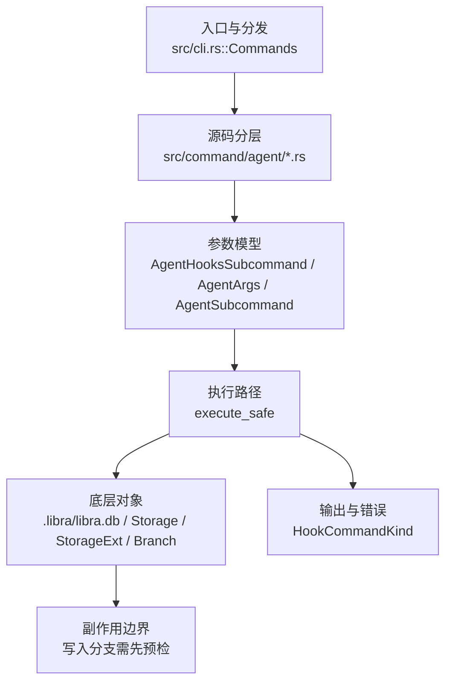

# `libra agent` 开发设计

> 本文件是 `libra agent`（外部 Agent 捕获子系统）的**公共 CLI/行为 source-of-truth**。内部 AgentRuntime 边界、Web-only 迁移、以及 entireio/cli 对齐的执行卡（AG-16~AG-24）与逐项 wire 契约（E1–E9）见 [`docs/development/agent.md`](../agent.md)。两份文档的分工：本文 = `libra agent` 用户可见行为 + 与参考实现 entireio/cli 的差距清单；agent.md = 内部 runtime 计划 + Gate 8 执行追踪。任何行为变更两边都要同步。

## 命令实现目标

`libra agent` 的目标是管理 Libra 外部代理捕获能力，包括安装/移除 provider hooks、查看会话与 checkpoint 状态、输出只读诊断信息，以及把 `refs/libra/agent-traces` 推送到远端。该命令服务于 Agent 运行记录和外部工具接入，不对应 Git 原生命令。

## 对比 Git 与兼容性

- 兼容级别：`intentionally-different`。Libra external-agent capture extension, not a Git command

- 该命令或行为属于 Libra 扩展/有意差异；重点是清晰边界、结构化输出和可测试错误，而不是 Git 完全同形。

## 设计方案

- 入口与分发：已公开接入 `src/cli.rs::Commands`；已由 `src/command/mod.rs` 导出。CLI 层在 `src/cli.rs` 把解析后的参数交给命令模块，命令模块负责把领域错误转换为 `CliError` / `CliResult`。
- 源码分层：主要实现文件为 `src/command/agent/checkpoint.rs`、`src/command/agent/clean.rs`、`src/command/agent/doctor.rs`、`src/command/agent/hooks.rs`、`src/command/agent/mod.rs`、`src/command/agent/push.rs`、`src/command/agent/rpc.rs`、`src/command/agent/session.rs`、`src/command/agent/status.rs`。参数/子命令类型包括：`AgentHooksSubcommand`、`AgentArgs`、`AgentSubcommand`、`StatusArgs`、`EnableArgs`、`DisableArgs`、`CleanArgs`、`DoctorArgs`、`PushArgs`、`CheckpointSubcommand`、`CheckpointListArgs`、`CheckpointShowArgs`、`CheckpointRewindArgs`、`SessionSubcommand`、`SessionListArgs`、`SessionShowArgs`、`SessionStopArgs`、`SessionResumeArgs`、`SessionPromoteArgs`、`SessionDeriveToolCallsArgs`、`AgentRpcSubcommand`、`AgentRpcListArgs`、`AgentRpcInvokeArgs`；输出、错误或状态类型包括：`HookCommandKind`；主要执行函数包括：`execute_safe`。
- 捕获实现分层：观测 adapter 在 `src/internal/ai/observed_agents/`（`adapter.rs` 的 `ObservedAgent` + `ObservedAgentHooks`/`TranscriptTruncator`/`TranscriptChunker` optional traits、`AgentKind`；`rpc.rs` 的 external `libra-agent-*`；`redaction.rs`；`builtin/`）；hook 生命周期在 `src/internal/ai/hooks/`（`lifecycle.rs` 的 `LifecycleEventKind`、`runtime.rs`、`providers/{claude,gemini}`）；checkpoint 写入在 `src/internal/ai/history.rs`（`HistoryManager::append_checkpoint_commit`）。
- 执行路径：`execute_safe` 负责 CLI 安全包装、错误映射和输出配置；索引路径会加载、比较、刷新或保存 `.libra/index`；对象路径会解析 revision 并读写 blob/tree/commit/tag 等对象；引用路径会读取或更新 SQLite refs、HEAD 与 reflog；数据库路径会通过 SeaORM/SQLite 或 D1 客户端持久化元数据；AI 路径会读写 session、checkpoint、thread graph 或 agent profile 状态。

- 流程图：以下流程图按当前源码分层展示主路径和底层对象边界，便于维护者把代码入口、执行函数和副作用范围对应起来。

- 底层操作对象：agent checkpoint（Agent 运行快照、回放和 transcript 截断输入）；Agent profile / runtime 对象（外部代理、hook、权限和运行状态）；session/thread store（AI 会话、线程、事件和恢复状态）；SeaORM / `.libra/libra.db`（配置、refs、reflog、AI/发布元数据等 SQLite 表）；`Storage` / `StorageExt`（对象存储抽象，覆盖本地、remote 和 publish 存储）；`Branch` / branch store（SQLite refs 上的分支读写、过滤和上游关系）；`Commit`（提交对象、父提交关系和提交消息载荷）；`Tree`（由索引或对象遍历生成的目录树对象）；`Index` / `.libra/index`（暂存区状态、路径条目和刷新/保存边界）；`ClientStorage`（本地/分层对象存储读写入口）；`LocalStorage`（本地对象或发布存储根目录）；`DatabaseConnection`（SeaORM 数据库连接）。**注意**：`agent_session` / `agent_checkpoint` / `agent_usage_stats` 三表只有 raw SQL（migration `2026050303_agent_capture.sql` 等），**没有 Sea-ORM entity**，扩展字段走 metadata blob 或新 migration。
- 输出与错误契约：人类输出、`--json` / `--machine` 输出和 quiet/verbose 分支必须继续走现有 `OutputConfig` / `emit_json_data` / `CliError` 路径；新增失败模式要补稳定错误码、用户提示和回归测试。
- 副作用边界：凡是写入索引、对象库、refs/HEAD、reflog、SQLite/D1、工作树或远端的路径，都必须先完成参数校验和 dry-run/预检分支，再执行持久化，避免部分写入后静默成功。

## 实现历史

- 本节依据本地 main 分支提交历史重写，筛选与该命令实现、测试或文档路径直接相关的提交；以下是归纳后的实现脉络。
- 2026-02-05 `ab75c7f2`（`Introduce AI Agent Infrastructure (#187)`）：基础实现节点：Introduce AI Agent Infrastructure (#187)；当前实现的主要轮廓可追溯到该提交。
- 2026-06-05 `fa450e91`（`feat(agent): support promoted transcript truncation`）：功能演进：support promoted transcript truncation；该节点扩展了当前命令可用的参数或行为。
- 2026-06-05 `8761159f`（`feat(agent): install hooks for the 5 promoted external agents`）：功能演进：install hooks for the 5 promoted external agents；该节点扩展了当前命令可用的参数或行为。
- 2026-06-01 `4aab5988`（`fix(agent): extract checkpoint transcripts`）：实现修正：extract checkpoint transcripts；该节点把边界行为、错误处理或兼容差异纳入当前实现约束。
- 2026-06-05 `15e51a85`（`docs(agent): sync agent.md with the 7-agent hook matrix and rewind truncation`）：文档与兼容口径：sync agent.md with the 7-agent hook matrix and rewind truncation；当前文档按该节点之后的实现状态校准。
- 历史结论：当前文档应以这些提交之后的代码、测试和兼容矩阵为准；更早的迁移式文档只保留为背景，不再作为事实来源。

## 当前状态

- 公开状态：已公开；模块状态：已导出。
- 用户文档：`docs/commands/agent.md`。
- Synopsis：`libra agent <status|enable|disable|session|checkpoint|clean|doctor|push|rpc>`。
- 公开参数/子命令包括：`status`、`enable [--agent <NAME>...]`、`disable [--agent <NAME>...]`、`session <list|show|stop|resume|promote|derive-tool-calls>`、`checkpoint <list|show|rewind>`、`clean [--all]`、`doctor`、`push [--remote <NAME>]`、`rpc <list|invoke>`（隐藏的 `hooks` 子命令供已安装的 provider hook 内部调用）。
- 已注册 `AgentKind`：`ClaudeCode`、`Cursor`、`Codex`、`Gemini`、`OpenCode`、`Copilot`、`FactoryAi`（7 类，`observed_agents/adapter.rs:27`）。可安装 hook 的仅 `claude-code` / `gemini`（`STABLE_AGENT_SLUGS`，`src/command/agent/mod.rs:216`）；其它 5 类为 stable-promoted observed adapter，无 hook provider。

## 与参考代码的功能差距分析

> **核对基线（2026-06-16）**：本章基于 `/Volumes/Data/entireio/cli`（Go 实现的 entire CLI，功能参考）与 `/Volumes/Data/entireio/cli-checkpoints`（entire 落盘的 checkpoint 归档）的**当前**源码逐项核对，并对照 Libra 现仓库实现。每条差距都映射到 [`docs/development/agent.md`](../agent.md) 的执行卡（AG-16~AG-24）与冻结 wire 契约（E1–E9）。旧 d0a714 分析版的 10 节结论已并入此处并升级为 source-grounded 形态；旧分析里引用的 `/run/media/eli/...` 路径与"9 agents"等口径以本章为准。

### 参考项目说明

- `/Volumes/Data/entireio/cli`：entire CLI 的 Go 实现，提供完整的 agent 捕获、hook 分发、多 agent 协作、review / investigate / spawn 等能力。核心包：`cmd/entire/cli/agent/`（capability 模型、registry、event、chunking、skill events、external 插件）、`cmd/entire/cli/lifecycle.go`（生命周期 dispatcher）、`cmd/entire/cli/{review,investigate}/`、`cmd/entire/cli/checkpoint/`。
- `/Volumes/Data/entireio/cli-checkpoints`：entire 运行产生的 checkpoint 数据归档（非源代码），按 `<id[:2]>/<id[2:]>/N/` 分片，含 `metadata.json`、`full.jsonl`、`context.md`、`prompt.txt`、`content_hash.txt`。它反映 entire 实际落盘的 checkpoint 数据模型，是 Libra checkpoint 丰富度与 fixture 的参考来源。

### 1. Agent 命令面差距（→ AG-17）

| entire CLI | libra 当前 | 差距说明 |
|---|---|---|
| `entire agent list`：列出已安装和可用的 agents，安装项标 `✓` | 无 `libra agent list`；只有 `status` | 缺少面向用户的 agent 目录/安装状态一览命令 |
| `entire agent add <agent>` / `remove <agent>`，支持 `--local-dev`、`--force` | `libra agent enable` / `disable`，无 `--local-dev` / `--force` | 安装/卸载语义和选项不完整；本地开发迭代和强制重装场景未覆盖 |
| `entire hooks <agent> <verb>`：按 agent 的 `HookNames()` 动态注册顶层 hook verb | `libra hooks <provider> <subcommand>` 与隐藏 `libra agent hooks` 存在，但按 provider 硬编码、不按 agent 动态注册 | hook 分发层与 agent registry 未完全打通；新增 agent 需手动改命令代码 |

落地：`list` 作为 `status` 的 focused listing；`add <name>`/`remove <name>` 等价 `enable`/`disable --agent <name>`，**旧入口保持 canonical 不删除**；JSON list 字段冻结 `slug/agent_kind/stability/hook_installable/hooks_installed/transcript_readable/external_binary`。

### 2. Agent 能力模型差距（→ AG-16，契约 E1）

entire `cmd/entire/cli/agent/agent.go` 定义核心 `Agent`（identity 6 + transcript storage 3 + legacy 6）+ ~18 个 optional capability interface，每个都有 `As<Cap>(ag) (T, bool)` gate helper；`DeclaredCaps`（`capabilities.go`）是 **8 个 bool** 的 wire 门控。Libra 当前 `observed_agents/adapter.rs` 只有 `ObservedAgent`(5 方法) + `ObservedAgentHooks`/`TranscriptTruncator`/`TranscriptChunker`(无 impl)。

| entire 能力接口 | 当前 libra 状态 | 建议 |
|---|---|---|
| `HookSupport`（install/uninstall/are-installed/parse） | 仅 Claude/Gemini 有 `HookProvider`（`hooks/providers/`） | 抽象为 capability-gated trait，按实际 adapter 能力标注，不为 5 个 stable-promoted 误报可安装 |
| `ProtectedFilesProvider` | 无（仅 `protected_dirs`） | agent 可声明受保护文件，避免误改/误捕获 |
| `TranscriptAnalyzer` / `PromptExtractor` / `TranscriptPreparer` | 无 | 按 agent 解析/准备/分析 transcript（`PromptExtractor` gate 复用 `transcript_analyzer`） |
| `TokenCalculator` / `ModelExtractor` | 无 | 从 transcript 提取 token 用量（E6 key）和模型信息 |
| `TextGenerator` | 无 | Codex/Claude 等 `--print` 式独立文本生成 |
| `TranscriptCompactor` | 无 | transcript 压缩/condensation（→ Entire Transcript Format） |
| `HookResponseWriter` | 无 | agent 向 hook 调用方写回 systemMessage |
| `RestoredSessionPathResolver` | 无 | 恢复会话时解析路径 |
| `Launcher` / `SkillDiscoverer` / `SessionBaseDirProvider` | 无 | agent 启动器、skill 发现、会话基础目录 |
| `SubagentAwareExtractor` | 仅内部 `sub_agent` 有相关逻辑 | 外部 agent 也支持子 agent 感知的文件/token 提取 |
| `CapabilityDeclarer` + `DeclaredCaps`（8 bool 门控） | 无 | external 二进制按 declared caps 解锁能力，未声明 fail closed（E1） |

`DeclaredCaps` 8 个冻结 wire key：`hooks`、`transcript_analyzer`、`transcript_preparer`、`token_calculator`、`compact_transcript`、`text_generator`、`hook_response_writer`、`subagent_aware_extractor`。`SessionBaseDirProvider`/`ModelExtractor`/`SkillEventExtractor` 故意不进 declared caps（built-in 直接判定）——这条规则必须随之移植。

### 3. Hook 与生命周期差距（→ AG-19，契约 E3）

| entire CLI | libra 当前 | 差距说明 |
|---|---|---|
| `DispatchLifecycleEvent(ctx, ag, event)`：规范化 `agent.Event` → 框架动作 | `hooks/lifecycle.rs` 已有 `apply_lifecycle_event` + `LifecycleEventKind`(11 变体) | **Libra 已有 dispatcher 原语**；缺 provider parser 与 writer 解耦（parser 不得直接调 checkpoint writer） |
| 标准化 `EventType`：SessionStart/TurnStart/TurnEnd/Compaction/SessionEnd/**SubagentStart/SubagentEnd**/ModelUpdate/ToolUse（9 个） | `LifecycleEventKind` 有 11 变体（含 entire 7 个 + `CompactionCompleted`/`PermissionRequest`/`SourceEnabled`/`SourceDisabled`），**缺 `SubagentStart`/`SubagentEnd`** | 补 subagent 两事件并打通 `CheckpointScope::subagent` |
| Agent ownership filtering：按记录的 `AgentType` first-writer-wins，忽略非属主转发事件 | 靠 `make_dedup_key`，无 agent-kind 归属 claim | Cursor 同时向多 hook 转发时可能重复 checkpoint；补原子 owner claim（`SessionStart`/`TurnStart` 豁免） |
| Codex trust-gap detection：检测用户未本地批准的新 hook | 无 | 安全/透明性不足；补 `codex.HookTrustGaps` 等价（结构性 key-presence 比对，仅 Codex SessionStart banner 提示） |

**AG-19 是扩展现有 `LifecycleEvent` 体系，不是新造平行 `ObservedAgentEvent`。**

### 4. Transcript 与 Checkpoint 差距（→ AG-20/AG-21，契约 E4/E5）

| entire CLI | libra 当前 | 差距说明 |
|---|---|---|
| `ChunkTranscript`/`ReassembleTranscript` + `ChunkJSONL`/`ReassembleJSONL`，阈值 `MaxChunkSize = 50 MiB`，Gemini 整体-JSON 检测 | 有 `TranscriptTruncator`（truncation/redaction）+ `TranscriptChunker` trait（**无 impl**） | 大 transcript 无法分片存储/传输；归档实测最大 `full.jsonl` ≈ 46.5 MiB，逼近阈值 |
| Rewind preview / cleanup / condensation / shadow branches / manual-commit strategy | 仅 `checkpoint rewind --dry-run/--apply`（`history.rs` 的 `prune`/rewrite） | 缺 preview、cleanup、condensation、shadow branch 等高级回放/清理策略 |
| checkpoint 元数据含 `context.md`、`prompt.txt`、root `CheckpointSummary` + per-session `CommittedMetadata`（见 §10） | `checkpoint show` 只展示部分元数据 | 需支持 entire-style root/session export contract 与 lazy 大 transcript 读取 |

### 5. 外部插件 / RPC 差距（→ AG-18，契约 E2）

| entire CLI | libra 当前 | 差距说明 |
|---|---|---|
| External plugin 协议：`entire-agent-<name>` 二进制，subcommand + JSON-over-stdio，`ProtocolVersion = 1`，`info` 声明 capability，30s timeout，stdout/stderr 各 10 MiB cap，`ENTIRE_*` env，`external_agents` settings gate | `libra agent rpc list/invoke` 发现 `libra-agent-*`，JSON-RPC v1，`RPC_BINARY_PREFIX="libra-agent-"`、`RPC_DEFAULT_TIMEOUT=30s`、`RPC_MAX_FRAME_BYTES=16 MiB`、`negotiate_capabilities()` | 缺 `info`/protocol version、hooks/prepare/analyze/token/text/subagent method、settings gate、PATH conflict/exec-bit policy、docs parity |
| `CapabilityDeclarer` + `DeclaredCaps` 门控可选接口 | 无 | external 二进制无法声明能力（同 §2） |

落地：保留 Libra **JSON-RPC 传输**（不切 subcommand+stdio），只对齐能力面、cap 集、版本协商；env 用 `LIBRA_*`，**不复用 `ENTIRE_*`**。

### 6. 多 Agent / Review / Investigate 差距（→ AG-22/AG-23，契约 E8）

| entire CLI | libra 当前 | 差距说明 |
|---|---|---|
| `entire review [--agent]`：`AgentReviewer`/`Process`/`Sink`/`RunMulti` 多 agent 并发 + fan-in + 串行 sink | 无命令层 review；内部 workflow 规划在 AG-13~AG-15 | 无法按指定 agent 运行 review；findings 是自由文本 manifest（entire **无结构化 Finding**，`--fix` 才用启发式 `reviewFinding{ID,Title,Body}`） |
| `entire investigate`：strict round-robin、`RunState`/`PendingTurn`/`TurnStance`、quorum/stall/pause/cancel、`fix`/`show`/`clean` | 无 investigate 命令 | 缺多 agent 轮询调查；`plan_changed` 用 whole-file 指纹（非 per-finding dedup）；untrusted seed 默认拒绝（需 `--allow-untrusted-seed`） |
| `LaunchFixAgent` / `Spawner`：非交互启动 agent 会话；fix 前剥离所有 `ENTIRE_REVIEW_*`/`ENTIRE_INVESTIGATE_*` env | 无 | `--fix`/investigate fix 必须回到内部 AgentRuntime serialized queue + approval/sandbox/tool gate，observed agent 只当数据源/launcher |
| `entire attach --agent` / `entire review attach` | 无 `--agent` 过滤 | attach/resume 不能按 agent 筛选（`--agent` = 创建该 session 的 agent，用于 transcript 解析） |

### 7. Skill Discovery 差距（→ AG-21，契约 E7）

| entire CLI | libra 当前 | 差距说明 |
|---|---|---|
| `SkillDiscoverer` + `skilldiscovery` 注册表：按 agent 提供 curated review skills（`claude-code`→`/review`,`/security-review`,`/simplify`；`codex`→`/review`）+ install hints | `skills/` 有通用 skill 系统（loader/parser/dispatcher/scanner），**无 agent-specific discovery** | 外部 agent 无法被发现/推荐专属 skill；`SkillEvent`（E7）未纳入 session/checkpoint/search 投影 |

### 8. Agent 覆盖差距（→ AG-16，契约 E9）

| entire CLI | libra 当前 | 差距说明 |
|---|---|---|
| 内置 1 stable（Claude Code）+ 7 preview（Codex、Copilot CLI、Cursor、Factory AI Droid、Gemini CLI、OpenCode、Pi）+ 1 test-only canary（Vogon，`IsTestOnly`）+ external 动态 | `AgentKind` 7 类，hook-installable 仅 `claude-code`/`gemini`；5 个 stable-promoted 无 hook provider；无 Pi / Vogon | 继续补齐 promoted agents hook provider；`pi`/`vogon`/未知 external 名导入走 quarantine/unsupported。**有意差异**：entire `gemini.IsPreview()==true`，Libra 把 `gemini` 当 stable hook-installable（文档须标注口径不同） |

### 9. 测试与架构差距（→ AG-24）

| entire CLI | libra 当前 | 差距说明 |
|---|---|---|
| `architecture_test.go`：agents 禁止 import `strategy`/`checkpoint`/`session`/`commands`/top-level `cli`；每个 agent 包必须 `init()` 调 `agent.Register` | `tests/compat/agent_docs_contract.rs`、`tests/compat/agent_run_non_exhaustive_guard.rs`（须在 `Cargo.toml` 注册 `[[test]]`） | 缺 import 约束与 self-register 强制测试 |
| `agent_test.go`/`registry_test.go`/`capabilities_test.go`/`chunking_test.go` + 大量 integration/E2E | 命令层与内部单元测试覆盖基础路径 | 需补 chunking、capability gating、external protocol、multi-agent review/investigate 测试（目标命名见 agent.md「验收命令」） |

### 10. 来自 cli-checkpoints 的数据模型差距（→ AG-20，契约 E4）

归档实测（2026-06-16）：**4,377 个 checkpoint（根 `metadata.json` 计数）、5,949 个 session 目录**；session/checkpoint 分布 3,439×1、685×2、…、**最大 61 session**（`7b/7c2be8a262/`）；最大 `full.jsonl` ≈ **46.5 MiB**；**全归档仅 1 个 `.zst`**（`e6/5d9bec561a/0/full.jsonl.zst`，取代 `full.jsonl`）；`context.md` 仅 1,504 个（≈75% session 缺失）；`prompt.txt` 缺失 ~828；旧 v0.5.1 记录**无 `model` 字段**、`session_id` 是裸 UUID。

每个 session 目录含：`metadata.json`（per-session `CommittedMetadata`）、`full.jsonl`（或 `.zst`）、`prompt.txt`、`content_hash.txt`（`sha256:<64-hex>`，**无换行**）、可选 `context.md`。根目录 `metadata.json` = `CheckpointSummary`（聚合 + `sessions[]` 路径映射）。

libra 当前 `agent_checkpoint` 表关注 `parent_commit`、`tree_oid`、`metadata_blob_oid`、`traces_commit`，对上述用户可读上下文文件缺直接导出。建议：

1. `libra agent checkpoint show` 支持 `--format=full` 展示/导出 `context.md`、`prompt.txt` 摘要（默认 lazy，不读 MB 级 transcript）。
2. `libra agent session show` 在 `--extract-transcript` 之外增加 `--extract-context` / `--extract-prompt`。
3. metadata blob 中规范存储 `context.md`、`prompt.txt` 的 OID（无 Sea-ORM entity，走 raw SQL / blob），归档结构兼容 entire root+session payload。

## 还未实现的功能

| 类别 | 未完成项 | 当前处理 | 参考来源 / 卡 |
|---|---|---|---|
| 兼容矩阵说明 | Libra 外部代理捕获扩展, 不是 Git 命令 | 按当前兼容矩阵保留；实现状态变化时同步 `_compatibility.md` 和测试证据。 | libra 当前实现 |
| Agent 迁移约束 | claudecode 硬删除已完成；`src/internal/ai/claudecode/` 不存在，不能重新作为活跃 provider 规划。 | 该约束必须保留，避免旧 provider 路径被重新规划为活跃实现。`src/cli.rs` 对 `--provider claudecode` 返回移除错误。 | libra 当前实现 |
| Agent 迁移约束 | `diagnostics_redaction_test` 仍是 diagnostics 字段脱敏的回归测试。 | 该约束必须保留，避免旧 provider 路径被重新规划为活跃实现。 | libra 当前实现 |
| 命令面 | `libra agent list` / `add` / `remove` 及 `--local-dev` / `--force` | 当前只有 `enable` / `disable` / `status`；新增 alias，旧入口 canonical。 | entire `agent_group.go` / AG-17 |
| 命令面 | 按 agent 动态注册的顶层 `libra hooks <agent> <verb>` | 当前 `libra hooks` 按 provider 硬编码子命令。 | entire `hook_registry.go` / AG-17 |
| 能力模型 | `DeclaredCaps`(8 bool) + capability-gated `As*` helper + `ProtectedFilesProvider`/`TranscriptAnalyzer`/`TokenCalculator`/`TranscriptCompactor` 等 optional trait | 当前 `ObservedAgent` 能力矩阵较薄。 | entire `agent/agent.go`,`capabilities.go` / AG-16,契约 E1 |
| Hook 生命周期 | 补 `SubagentStart`/`SubagentEnd`、first-writer-wins owner filter、Codex trust-gap | 当前 `LifecycleEventKind` 已有 11 变体 + dispatcher 原语，缺上述三项。 | entire `lifecycle.go`,`agent/codex/trust.go` / AG-19,契约 E3 |
| Transcript | 分块/重组大 transcript（50 MiB 阈值，Gemini 整体-JSON 检测） | 当前有 truncation/redaction，`TranscriptChunker` trait 无 impl。 | entire `agent/chunking.go` / AG-20,契约 E5 |
| Checkpoint | rewind preview / cleanup / condensation / shadow branch / entire-style export | 当前只有 `checkpoint rewind --dry-run/--apply`。 | entire `checkpoint/`,`strategy/` / AG-20,契约 E4 |
| 外部插件 | `info`/protocol version/capability 声明/扩展 method/settings gate | 当前 `rpc list/invoke` + `negotiate_capabilities`（JSON-RPC v1）。 | entire `agent/external/` / AG-18,契约 E2 |
| 多 Agent | `libra review --agent`、`libra investigate`、agent spawn/launch（fix 回内部 AgentRuntime） | 当前命令层无 review/investigate/spawn/launch。 | entire `review/`,`investigate/`,`agentlaunch/` / AG-22,AG-23,契约 E8 |
| Skill | agent-specific skill discovery + `SkillEvent` 投影 | 当前 skills 系统未与 agent registry 打通。 | entire `agent/skilldiscovery/`,`skill_events*` / AG-21,契约 E7 |
| Agent 覆盖 | 补齐 Cursor/Codex/OpenCode/Copilot/FactoryAI hook provider；评估 Pi / Vogon | 当前仅 Claude Code / Gemini 可安装。 | entire `agent/*` / AG-16,契约 E9 |
| 架构测试 | agent 包 import 约束 + self-register 强制测试 | 当前 compat guard 不足。 | entire `agent/architecture_test.go` / AG-24 |
| 数据模型 | checkpoint 导出 `context.md` / `prompt.txt` / `full.jsonl`（lazy） | 当前 `checkpoint show` / `session show` 不支持。 | cli-checkpoints 归档 / AG-20,契约 E4 |

## 维护要求

- 改进本命令前，必须先阅读并遵循 [docs/development/commands/_general.md](_general.md)；这是命令设计、实现、测试和文档同步的强制要求。
- 任何行为变更都要先核对实现源码，再同步 `COMPATIBILITY.md`、`docs/commands/<cmd>.md` 和相关测试。
- 新增 Git 兼容参数时必须明确 tier、错误码、JSON/机器输出契约和回归测试。
- entireio/cli 对齐的具体执行步骤、wire 契约（E1–E9）、任务卡（AG-16~AG-24）与验收命令以 [`docs/development/agent.md`](../agent.md) 为准；本文与该计划任一处变更，另一处的边界说明与差距映射都要同步刷新。
