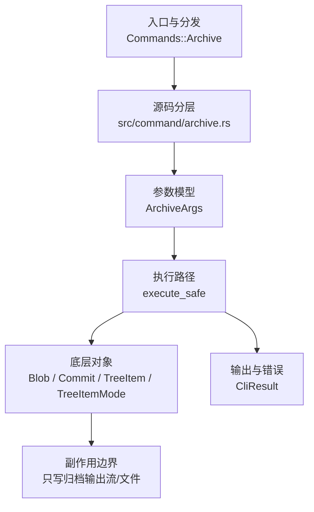

# `libra archive` 开发设计

## 命令实现目标

`libra archive` 的目标是按 commit、branch、tag 或缩写提交解析出树对象，并把该树中的已跟踪文件写成归档流。该设计不修改工作区和索引；省略 `TREEISH` 时使用 `HEAD`，默认输出未压缩 tar 到 stdout，也支持通过 `--output <FILE>`（短选项 `-o`）写入文件。归档格式由 `--format`/`-f`（默认 `tar`）控制，支持四种格式：`tar`、`tar.gz`/`tgz`、`tar.bz2`/`tbz2`/`tbz`、`zip`（bzip2 经 `BzEncoder`、zip 经 `zip::ZipWriter` 实现）。`--prefix <PREFIX>` 可为每个归档路径前置一个相对目录前缀，前缀经 `validate_prefix` 校验并拒绝绝对路径与 `..` 穿越。`-l`/`--list` 可在不要求仓库的情况下列出支持格式；`TREEISH` 后的 `<path>...` 可把归档限制到匹配文件或目录。

## 对比 Git 与兼容性

- 兼容级别：`partial`。基础 archive 创建能力已公开；`--format`、`--output`、`--prefix`、`--list`、`-v`/`--verbose` 和 `TREEISH <path>...` pathspec 限定均已支持。

## 设计方案

- 入口与分发：`src/cli.rs::Commands::Archive` 公开顶层 CLI，`src/command/mod.rs` 导出 `archive` 模块；CLI 层在 `src/cli.rs` 把解析后的参数交给 `command::archive::execute_safe`，命令模块负责把领域错误转换为 `CliError` / `CliResult`。
- 源码分层：主要实现文件为 `src/command/archive.rs`。参数/子命令类型包括：`ArchiveArgs`；输出、错误或状态类型包括：源码未暴露独立输出/错误类型，错误通过 `CliResult` 或上层命令错误统一传播；主要执行函数包括：`execute_safe`。
- 执行路径：`execute_safe` 负责 CLI 安全包装、错误映射和输出配置；核心流程解析 `TREEISH`、读取 commit/tree/blob 对象、遍历 tree 条目，并把归档内容写到 stdout 或 `--output` 指定文件。

- 流程图：以下流程图按当前源码分层展示主路径和底层对象边界，便于维护者把代码入口、执行函数和副作用范围对应起来。

- 底层操作对象：`Blob`（`load_blob_content` 读取 `blob.data` 并原样写入归档，不识别或解引用 LFS pointer，LFS pointer blob 按原始字节写入）；`Commit`（提交对象，仅读取 `commit.tree_id`，不读取父提交关系或提交消息载荷）；`TreeItem` / `TreeItemMode`（tree 中的路径项和 mode）；`Tree`（`resolve_entries` 仅通过 `load_object::<Tree>(&commit.tree_id)` 从对象库加载，不访问索引）；`ObjectHash`（SHA-1/SHA-256 对象 ID 和 revision 解析结果）
- 输出与错误契约：`execute_safe` 把二进制归档写入 `-o`/stdout；签名中接收 `_output: &OutputConfig`（前导下划线表示有意未使用），不读取该参数，也没有 `--json` / `--machine` 分支或 `emit_json_data` 调用。`-v`/`--verbose` 是唯一的进度分支：把每个归档路径打印到 stderr（不影响 stdout 的归档字节）。失败通过 `CliError` / `CliResult` 传播，并已经携带多种稳定错误码：`CliInvalidArguments`（`LBR-CLI-002`，格式或前缀非法）、`CliInvalidTarget`（`LBR-CLI-003`，treeish 无法解析或空树）、`RepoCorrupt`（`LBR-REPO-002`，commit/tree 对象或不安全条目名不可读）、`IoReadFailed`（`LBR-IO-001`，blob 读取失败）、`IoWriteFailed`（`LBR-IO-002`，归档写出/落盘失败）；新增失败模式要补稳定错误码、用户提示和回归测试。
- 副作用边界：该命令不应修改索引、对象库、refs/HEAD 或 reflog；唯一写入面是归档输出流/文件，发布前需要继续验证二进制输出不会误写终端或覆盖非预期路径。

## 实现历史

- 本节依据本地 main 分支提交历史重写，筛选与该命令实现、测试或文档路径直接相关的提交；以下是归纳后的实现脉络。
- 2026-06-09 `3793dfa5`（`Archive assignment (#402)`）：历史节点：Archive assignment (#402)；该提交是本命令实现历史中的直接证据。
- 历史结论：`src/command/archive.rs` 已通过 `src/cli.rs::Commands::Archive` 公开；早期“未公开 CLI”的记录已经过期，当前状态以源码和本页“当前状态”为准。

## 当前状态

- 公开状态：已公开；模块状态：`src/command/mod.rs` 导出 `archive`，`src/cli.rs::Commands::Archive` 负责 CLI 接入。
- 用户文档：`docs/commands/archive.md`。
- Synopsis：`libra archive [OPTIONS] [TREEISH] [PATH]...` / `libra archive --list`。
- 公开参数包括：`[TREEISH]`、`[PATH]...`、`-l, --list`、`-f, --format <FMT>`、`-o, --output <FILE>`、`--prefix <PREFIX>`、`-v, --verbose`。

## 还未实现的功能

| 类别 | 未完成项 | 当前处理 |
|---|---|---|
| Git flag | `--add-file=<file>`（把未跟踪的工作区文件追加进归档） | 未公开；条目仅来自已解析的树，需要读文件系统并注入 `ArchiveEntry`。命令层。 |
| Git flag | `-0`..`-9` / 压缩级别 | 未公开；gzip/bzip2/zip 均使用 `Compression::default()` 硬编码（`archive.rs`）。命令层。 |
| ✅ 已实现 | `-v` / `--verbose`（向 stderr 报告进度） | 已实现：在 `execute_safe` 写归档前，按归档条目顺序把每个（应用 `--prefix` 后的）路径打印到 stderr，对齐 `git archive -v`；归档字节仍走 `-o`/stdout，verbose 不污染 stdout。带集成测试（`test_archive_verbose_lists_paths_on_stderr`）。 |
| Git flag | `--remote=<repo>` / `--exec=<cmd>`（从远端取归档） | 未公开；依赖 `upload-archive` 协议，需打通 `src/internal/protocol`，协议层改造。 |
| 行为差异 | `.gitattributes` 的 `export-ignore` / `export-subst` 属性过滤 | 未实现；与 D5（`.gitattributes` filter/hooks bridge 有意差异）相关，按对象内容属性处理设计后再评估。 |
| 兼容矩阵 | `COMPATIBILITY.md` 已登记该命令。 | 已纳入用户可见兼容矩阵和矩阵守卫。 |
| CLI 接入 | `src/cli.rs::Commands::Archive` 已公开。 | 已接入 CLI；后续扩展参数时同步文档、矩阵和测试。 |

## 维护要求

- 改进本命令前，必须先阅读并遵循 [docs/development/commands/_general.md](_general.md)；这是命令设计、实现、测试和文档同步的强制要求。
- 任何行为变更都要先核对实现源码，再同步 `COMPATIBILITY.md`、`docs/commands/<cmd>.md` 和相关测试。
- 新增 Git 兼容参数时必须明确 tier、错误码、JSON/机器输出契约和回归测试。
- 若决定发布该命令，最小闭环是：CLI 变体、`src/command/mod.rs` 导出、dispatch、用户文档、兼容矩阵和测试。
