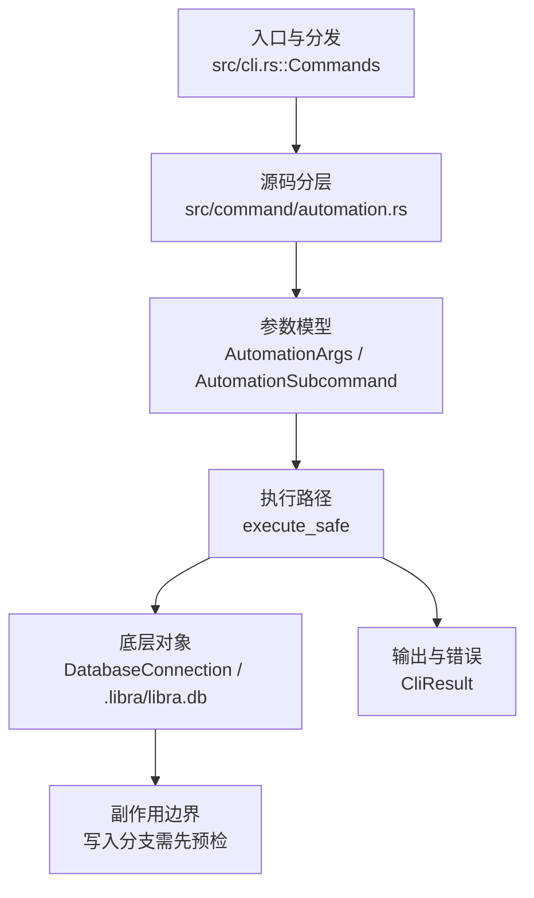

# `libra automation` 开发设计

## 命令实现目标

`libra automation` 的目标是管理 Libra 的自动化规则和历史记录，让用户可以查看（`list`）、运行（`run`）或审计历史（`history`）AI 自动化流程。它属于 Libra AI 工作流扩展，重点是可追踪、可清理和可审计，而不是复刻 Git 命令。

## 对比 Git 与兼容性

- 兼容级别：`intentionally-different`。Libra AI automation rules/history extension, not a Git command

- 该命令或行为属于 Libra 扩展/有意差异；重点是清晰边界、结构化输出和可测试错误，而不是 Git 完全同形。

## 设计方案

- 入口与分发：已公开接入 `src/cli.rs::Commands`；已由 `src/command/mod.rs` 导出。CLI 层在 `src/cli.rs` 把解析后的参数交给命令模块，命令模块负责把领域错误转换为 `CliError` / `CliResult`。
- 源码分层：主要实现文件为 `src/command/automation.rs`。参数/子命令类型包括：`AutomationArgs`、`AutomationSubcommand`；输出、错误或状态类型包括：源码未暴露独立输出/错误类型，错误通过 `CliResult` 或上层命令错误统一传播；主要执行函数包括：`execute_safe`。
- 执行路径：`execute_safe` 负责 CLI 安全包装、错误映射和输出配置；数据库路径会通过 SeaORM/SQLite 或 D1 客户端持久化元数据。

- 流程图：以下流程图按当前源码分层展示主路径和底层对象边界，便于维护者把代码入口、执行函数和副作用范围对应起来。

- 底层操作对象：`DatabaseConnection`（SeaORM 数据库连接）；SeaORM / `.libra/libra.db`（配置、refs、reflog、AI/发布元数据等 SQLite 表）
- 输出与错误契约：人类输出、`--json` / `--machine` 输出和 quiet/verbose 分支必须继续走现有 `OutputConfig` / `emit_json_data` / `CliError` 路径；新增失败模式要补稳定错误码、用户提示和回归测试。
- 副作用边界：凡是写入索引、对象库、refs/HEAD、reflog、SQLite/D1、工作树或远端的路径，都必须先完成参数校验和 dry-run/预检分支，再执行持久化，避免部分写入后静默成功。

## 实现历史

- 本节依据本地 main 分支提交历史重写，筛选与该命令实现、测试或文档路径直接相关的提交；以下是归纳后的实现脉络。
- 2026-05-05 `ee8bb5b1`（`feat(tui): complete Local TUI Automation Control implementation (#356)`）：基础实现节点：complete Local TUI Automation Control implementation (#356)；当前实现的主要轮廓可追溯到该提交。
- 2026-05-17 `bd718ce7`（`feat(automation): add `libra automation prune` for log retention`）：历史功能演进；但当前源码仅保留 `list` / `run` / `history` 三个子命令，`prune` 子命令在当前实现中已不存在，文档以当前代码为准。
- 2026-05-23 `f2865dad`（`docs(automation): add Examples section to match --help banner (v0.17.844)`）：文档与兼容口径：add Examples section to match --help banner (v0.17.844)；当前文档按该节点之后的实现状态校准。
- 历史结论：当前文档应以这些提交之后的代码、测试和兼容矩阵为准；更早的迁移式文档只保留为背景，不再作为事实来源。

## 当前状态

- 公开状态：已公开；模块状态：已导出。
- 用户文档：`docs/commands/automation.md`。
- Synopsis：`libra automation <list|run|history> [options]`。
- 公开参数/子命令包括：`list`、`run [--rule <NAME>] [--now <DATE>] [--live]`、`history [--limit <N>]`（`--json` / `--machine` 为全局输出开关）。

## 还未实现的功能

| 类别 | 未完成项 | 当前处理 |
|---|---|---|
| 兼容矩阵说明 | Libra AI automation rules/history extension, 不是 Git 命令 | 按当前兼容矩阵保留；实现状态变化时同步 `_compatibility.md` 和测试证据。 |

## 维护要求

- 改进本命令前，必须先阅读并遵循 [docs/development/commands/_general.md](_general.md)；这是命令设计、实现、测试和文档同步的强制要求。
- 任何行为变更都要先核对实现源码，再同步 `COMPATIBILITY.md`、`docs/commands/<cmd>.md` 和相关测试。
- 新增 Git 兼容参数时必须明确 tier、错误码、JSON/机器输出契约和回归测试。
