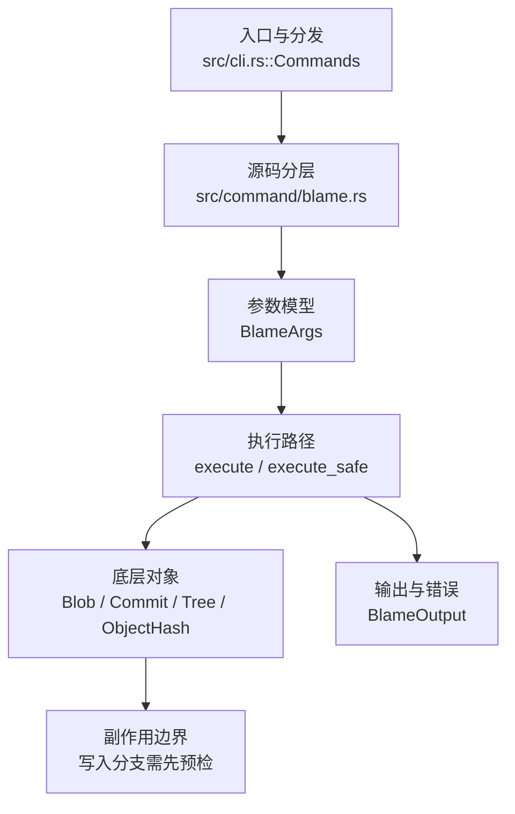

# `libra blame` 开发设计

## 命令实现目标

`libra blame` 的目标是按行展示文件内容的最近修改提交、作者和时间信息。实现需要支持常用显示字段和行号范围等兼容面，同时把 porcelain 输出、空白忽略（-w）、移动/复制检测、反向 blame 等高阶能力列为后续工作（当前 HEAD 均未实现）。

## 对比 Git 与兼容性

- 兼容级别：`partial`。基础文件 blame、数字 `-L` 范围、`--porcelain`/`--line-porcelain` 已支持；reverse、`-w` 空白忽略、incremental 和 copy/move detection 尚未公开。

- 当前矩阵承诺常用 Git 行为已支持；新增语义必须同步矩阵、用户文档和测试。

## 设计方案

- 入口与分发：已公开接入 `src/cli.rs::Commands`；已由 `src/command/mod.rs` 导出。CLI 层在 `src/cli.rs` 把解析后的参数交给命令模块，命令模块负责把领域错误转换为 `CliError` / `CliResult`。
- 源码分层：主要实现文件为 `src/command/blame.rs`。参数/子命令类型包括：`BlameArgs`；输出、错误或状态类型包括：`BlameOutput`；主要执行函数包括：`execute`、`execute_safe`。
- 执行路径：`execute_safe` 负责 CLI 安全包装、错误映射和输出配置；对象路径会解析 revision 并读写 blob/tree/commit/tag 等对象。

- 流程图：以下流程图按当前源码分层展示主路径和底层对象边界，便于维护者把代码入口、执行函数和副作用范围对应起来。

- 底层操作对象：`Blob`（文件内容或 LFS pointer 写入对象库后的 blob 对象）；`Commit`（提交对象、父提交关系和提交消息载荷）；`Tree`（由索引或对象遍历生成的目录树对象）；`ObjectHash`（SHA-1/SHA-256 对象 ID 和 revision 解析结果）
- 输出与错误契约：人类输出、`--json` / `--machine` 输出和 quiet/verbose 分支必须继续走现有 `OutputConfig` / `emit_json_data` / `CliError` 路径；新增失败模式要补稳定错误码、用户提示和回归测试。
- 副作用边界：凡是写入索引、对象库、refs/HEAD、reflog、SQLite/D1、工作树或远端的路径，都必须先完成参数校验和 dry-run/预检分支，再执行持久化，避免部分写入后静默成功。

## 实现历史

- 本节依据本地 main 分支提交历史重写，筛选与该命令实现、测试或文档路径直接相关的提交；以下是归纳后的实现脉络。
- 2025-11-29 `4a66aa45`（`feat(blame, diff): add blame support, bump the git-internal version (#70)`）：基础实现节点：add blame support, bump the git-internal version (#70)；当前实现的主要轮廓可追溯到该提交。
- 2026-06-03 `1d055f9e`（`feat(blame): add ignore-whitespace (-w) attribution and BFS early-exit (v0.17.1290)`）：功能演进：add ignore-whitespace (-w) attribution and BFS early-exit (v0.17.1290)；该提交引入的 `-w` / ignore-whitespace 参数在当前 HEAD 的 `BlameArgs` 中已不存在（已回退），与缺口表保持一致。
- 2026-06-03 `e377e0a6`（`feat(blame): implement porcelain/-p output and clamp overlong -L end with checked arithmetic (v0.17.1289)`）：功能演进：implement porcelain/-p output and clamp overlong -L end with checked arithmetic (v0.17.1289)；该提交引入的 porcelain / `-p` 输出在当前 HEAD 的 `BlameArgs` 与 `execute_safe` 中已不存在（已回退），与缺口表保持一致。
- 2026-06-04 `a0e349a9`（`fix: align blame and bisect compatibility`）：实现修正：align blame and bisect compatibility；该节点把边界行为、错误处理或兼容差异纳入当前实现约束。
- 历史结论：当前文档应以这些提交之后的代码、测试和兼容矩阵为准；更早的迁移式文档只保留为背景，不再作为事实来源。

## 当前状态

- 公开状态：已公开；模块状态：已导出。
- 用户文档：`docs/commands/blame.md`。
- Synopsis：`libra blame <file> [<commit>] [-L <range>]`。
- 公开参数/子命令包括：`<FILE>`、`[<COMMIT>]`、`-L <RANGE>`、`--porcelain`、`--line-porcelain`。
- `--porcelain`/`--line-porcelain`：机器可读输出，每行先打印 `<sha> <orig> <final> [<group>]` 头部，再（`--porcelain` 每个提交一次、`--line-porcelain` 每行）打印 author/author-mail/author-time/author-tz/committer*/summary/filename 元数据块，最后是 `\t<content>`。元数据通过重新加载归属提交读取。**有意差异/限制**：blame 遍历不跟踪每提交的原始行号，`<orig>` 以 `<final>` 近似。

## 还未实现的功能

| 类别 | 未完成项 | 当前处理 |
|---|---|---|
| 兼容差异项 | 正则行范围 | 原始对照：不支持；相关参数/替代：-L :<funcname> / -L /regex/；当前说明：不适用。 后续实现时需要补对应回归测试并同步兼容矩阵。 |
| 兼容差异项 | 反向 blame | 原始对照：不支持；相关参数/替代：--reverse；当前说明：不适用。 后续实现时需要补对应回归测试并同步兼容矩阵。 |
| 兼容差异项 | 显示邮箱 | 原始对照：不支持；相关参数/替代：-e / --show-email；当前说明：不适用。 后续实现时需要补对应回归测试并同步兼容矩阵。 |
| ✅ 已实现（部分） | porcelain 格式 | `--porcelain`/`--line-porcelain` 已支持（重新加载提交取元数据；带集成测试）。限制：`<orig>` 原始行号以 `<final>` 近似（blame 遍历未跟踪每提交原始行号），未输出 `boundary`/`previous` 行。 |
| 兼容差异项 | 忽略空白 | 原始对照：不支持；相关参数/替代：-w / --ignore-whitespace；当前说明：不适用。 后续实现时需要补对应回归测试并同步兼容矩阵。 |
| 兼容差异项 | 增量输出 | 原始对照：不支持；相关参数/替代：--incremental；当前说明：不适用。 后续实现时需要补对应回归测试并同步兼容矩阵。 |
| 兼容差异项 | 相似度阈值 | 原始对照：不支持；相关参数/替代：-M / -C (move/copy detection)；当前说明：不适用。 后续实现时需要补对应回归测试并同步兼容矩阵。 |

## 维护要求

- 改进本命令前，必须先阅读并遵循 [docs/development/commands/_general.md](_general.md)；这是命令设计、实现、测试和文档同步的强制要求。
- 任何行为变更都要先核对实现源码，再同步 `COMPATIBILITY.md`、`docs/commands/<cmd>.md` 和相关测试。
- 新增 Git 兼容参数时必须明确 tier、错误码、JSON/机器输出契约和回归测试。
