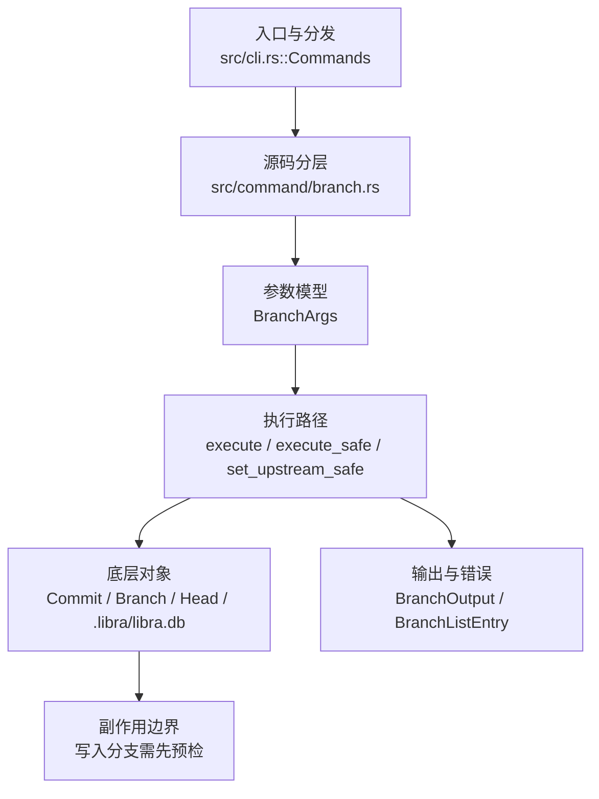

# `libra branch` 开发设计

## 命令实现目标

`libra branch` 的目标是列出、创建、删除、复制、重命名和管理本地分支及其上游信息。实现需要适配 Libra 的 SQLite refs 存储，保护锁定分支，支持过滤和描述信息，并对 Git 中尚未实现或被接受但忽略的排序/格式参数明确标注。

## 对比 Git 与兼容性

- 兼容级别：`supported`。

- 当前矩阵承诺常用 Git 行为已支持；新增语义必须同步矩阵、用户文档和测试。

## 设计方案

- 入口与分发：已公开接入 `src/cli.rs::Commands`；已由 `src/command/mod.rs` 导出。CLI 层在 `src/cli.rs` 把解析后的参数交给命令模块，命令模块负责把领域错误转换为 `CliError` / `CliResult`。
- 源码分层：主要实现文件为 `src/command/branch.rs`。参数/子命令类型包括：`BranchArgs`；输出、错误或状态类型包括：`BranchOutput`、`BranchListEntry`；主要执行函数包括：`execute`、`execute_safe`、`set_upstream_safe`、`create_branch_safe`。
- 源码意图：源码模块注释说明该命令由 `run_branch` 分发到创建、删除、列表、重命名和上游跟踪 helper，并把 branch store 错误映射为命令级错误。
- 执行路径：`execute_safe` 负责 CLI 安全包装、错误映射和输出配置；核心领域逻辑集中在 `set_upstream_safe`、`create_branch_safe`；对象路径会解析 revision 并读写 blob/tree/commit/tag 等对象；引用路径会读取或更新 SQLite refs、HEAD 与 reflog；数据库路径会通过 SeaORM/SQLite 或 D1 客户端持久化元数据。

- 流程图：以下流程图按当前源码分层展示主路径和底层对象边界，便于维护者把代码入口、执行函数和副作用范围对应起来。

- 底层操作对象：`Commit`（提交对象、父提交关系和提交消息载荷）；`Branch` / branch store（SQLite refs 上的分支读写、过滤和上游关系）；`Head`（SQLite 中的 HEAD 指向、当前分支和 detached 状态）；SeaORM / `.libra/libra.db`（配置、refs、reflog、AI/发布元数据等 SQLite 表）；`ObjectHash`（SHA-1/SHA-256 对象 ID 和 revision 解析结果）；`ConfigKv`（配置键值持久化行）
- 输出与错误契约：人类输出、`--json` / `--machine` 输出和 quiet/verbose 分支必须继续走现有 `OutputConfig` / `emit_json_data` / `CliError` 路径；新增失败模式要补稳定错误码、用户提示和回归测试。
- 副作用边界：凡是写入索引、对象库、refs/HEAD、reflog、SQLite/D1、工作树或远端的路径，都必须先完成参数校验和 dry-run/预检分支，再执行持久化，避免部分写入后静默成功。

## 实现历史

- 本节依据本地 main 分支提交历史重写，筛选与该命令实现、测试或文档路径直接相关的提交；以下是归纳后的实现脉络。
- 2025-11-19 `256bfe62`（`feat: add -all  subcommands for branch command (#58)`）：基础实现节点：add -all  subcommands for branch command (#58)；当前实现的主要轮廓可追溯到该提交。
- 2026-06-06 `7e94b815`（`feat(switch): add -C/--force-create (create or reset branch then switch)`）：功能演进：add -C/--force-create (create or reset branch then switch)；该节点扩展了当前命令可用的参数或行为。
- 2026-06-04 `f54123ea`（`feat(branch): decline --track/--no-track, stub --sort/--format, mark compatibility partial [decision-reversal supported->partial] (v0.17.1296)`）：功能演进：decline --track/--no-track, stub --sort/--format, mark compatibility partial [decision-reversal supported->partial] (v0.17.1296)；该节点扩展了当前命令可用的参数或行为。
- 2026-06-04 `07fbf023`（`fix(branch): launch editor via shlex (no shell), reject self-copy/self-rename, harden reflog timestamp (codex review r2) (v0.17.1298)`）：实现修正：launch editor via shlex (no shell), reject self-copy/self-rename, harden reflog timestamp (codex review r2) (v0.17.1298)；该节点把边界行为、错误处理或兼容差异纳入当前实现约束。
- 历史结论：当前文档应以这些提交之后的代码、测试和兼容矩阵为准；更早的迁移式文档只保留为背景，不再作为事实来源。

## 当前状态

- 公开状态：已公开；模块状态：已导出。
- 用户文档：`docs/commands/branch.md`。
- Synopsis：`libra branch [<new_branch>] [<commit_hash>]`。
- 公开参数/子命令包括：`Flag examples`。

## 还未实现的功能

| 类别 | 未完成项 | 当前处理 |
|---|---|---|
| 当前无已确认的参数级缺口 | rename 能力已由当前源码实现，不能再列为未实现项。 | 新增 Git 兼容参数或兼容差异时再补表项，并同步兼容矩阵和测试证据。 |

## 维护要求

- 改进本命令前，必须先阅读并遵循 [docs/development/commands/_general.md](_general.md)；这是命令设计、实现、测试和文档同步的强制要求。
- 任何行为变更都要先核对实现源码，再同步 `COMPATIBILITY.md`、`docs/commands/<cmd>.md` 和相关测试。
- 新增 Git 兼容参数时必须明确 tier、错误码、JSON/机器输出契约和回归测试。
