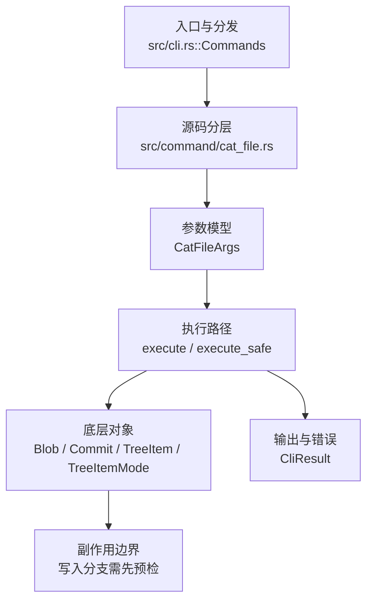

# `libra cat-file` 开发设计

## 命令实现目标

`libra cat-file` 的目标是读取对象仓库中的对象类型、大小和内容，并提供批处理查询能力。实现需要兼顾 Git plumbing 的退出码语义、批量 stdin 解析、对象遍历和符号链接解析，同时声明 `-e` 与机器输出等组合限制。

## 对比 Git 与兼容性

- 兼容级别：`supported`。`-e` does not support JSON

- 当前矩阵承诺常用 Git 行为已支持；新增语义必须同步矩阵、用户文档和测试。

## 设计方案

- 入口与分发：已公开接入 `src/cli.rs::Commands`；已由 `src/command/mod.rs` 导出。CLI 层在 `src/cli.rs` 把解析后的参数交给命令模块，命令模块负责把领域错误转换为 `CliError` / `CliResult`。
- 源码分层：主要实现文件为 `src/command/cat_file.rs`。参数/子命令类型包括：`CatFileArgs`；输出、错误或状态类型包括：源码未暴露独立输出/错误类型，错误通过 `CliResult` 或上层命令错误统一传播；主要执行函数包括：`execute`、`execute_safe`。
- 执行路径：`execute_safe` 负责 CLI 安全包装、错误映射和输出配置；对象路径会解析 revision 并读写 blob/tree/commit/tag 等对象；数据库路径会通过 SeaORM/SQLite 或 D1 客户端持久化元数据；AI 路径会读写 session、checkpoint、thread graph 或 agent profile 状态。

- 流程图：以下流程图按当前源码分层展示主路径和底层对象边界，便于维护者把代码入口、执行函数和副作用范围对应起来。

- 底层操作对象：`Blob`（文件内容或 LFS pointer 写入对象库后的 blob 对象）；`Commit`（提交对象、父提交关系和提交消息载荷）；`TreeItem` / `TreeItemMode`（tree 中的路径项和 mode）；`Tree`（由索引或对象遍历生成的目录树对象）；`ClientStorage`（本地/分层对象存储读写入口）；`LocalStorage`（本地对象或发布存储根目录）；SeaORM / `.libra/libra.db`（配置、refs、reflog、AI/发布元数据等 SQLite 表）；`ObjectHash`（SHA-1/SHA-256 对象 ID 和 revision 解析结果）；`ObjectType`（blob/tree/commit/tag 类型分派）；session/thread store（AI 会话、线程、事件和恢复状态）
- 输出与错误契约：人类输出、`--json` / `--machine` 输出和 quiet/verbose 分支必须继续走现有 `OutputConfig` / `emit_json_data` / `CliError` 路径；新增失败模式要补稳定错误码、用户提示和回归测试。
- 副作用边界：凡是写入索引、对象库、refs/HEAD、reflog、SQLite/D1、工作树或远端的路径，都必须先完成参数校验和 dry-run/预检分支，再执行持久化，避免部分写入后静默成功。

## 实现历史

- 本节依据本地 main 分支提交历史重写，筛选与该命令实现、测试或文档路径直接相关的提交；以下是归纳后的实现脉络。
- 2026-06-04 `e832538e`（`feat(cat-file): implement basic batch-check engine and stdin stream parser (v0.17.1299)`）：历史资料中曾记录 batch-check 方向，但当前 `CatFileArgs` 未公开 `--batch` / `--batch-check`；当前事实以源码为准。
- 2026-06-04 `2946746e`（`feat(cat-file): support batch-all-objects scanning and follow-symlinks resolution (v0.17.1301)`）：历史资料中曾记录 batch-all/follow-symlinks 方向，但当前 `CatFileArgs` 未公开对应 flag；当前事实以源码为准。
- 2026-06-04 `dac8f161`（`feat(cat-file): support full batch content output and buffering control (v0.17.1300)`）：历史资料中曾记录 batch 输出方向，但当前 `CatFileArgs` 未公开对应 flag；当前事实以源码为准。
- 2026-05-24 `8a1c5784`（`fix(cat-file): tighten error code mapping for remaining legacy paths`）：实现修正：tighten error code mapping for remaining legacy paths；该节点把边界行为、错误处理或兼容差异纳入当前实现约束。
- 2026-06-07 `a3d7a262`（`test(cat-file): isolate batch helper processes`）：测试契约：isolate batch helper processes；相关行为已有回归守卫，后续变更需要继续满足。
- 历史结论：当前文档应以这些提交之后的代码、测试和兼容矩阵为准；更早的迁移式文档只保留为背景，不再作为事实来源。

## 当前状态

- 公开状态：已公开；模块状态：已导出。
- 用户文档：`docs/commands/cat-file.md`。
- Synopsis：`libra cat-file [OPTIONS] [OBJECT]`。
- 公开参数/子命令包括：`-t`、`-s`、`-p`、`-e`、`--ai <ID>`、`--ai-type <ID>`、`--ai-list <TYPE>`、`--ai-list-types`、`[OBJECT]`。

## 还未实现的功能

| 类别 | 未完成项 | 当前处理 |
|---|---|---|
| 兼容矩阵说明 | `-e` 已支持，但不支持 JSON / machine 输出 | 按当前兼容矩阵保留；实现状态变化时同步 `_compatibility.md` 和测试证据。 |
| 功能缺口 | cat-file -e does not support --json / --machine (it is purely an exit-code check) | 后续实现时需要同步源码、测试和兼容矩阵。 |
| 兼容差异项 | Batch mode | 原始对照：未实现；相关参数/替代：--batch, --batch-check；当前说明：不适用。 后续实现时需要补对应回归测试并同步兼容矩阵。 |
| 兼容差异项 | 不支持 argument combination | 当前状态：LBR-CLI-002；Git/相关参数：129。 后续实现时需要补对应回归测试并同步兼容矩阵。 |

## 维护要求

- 改进本命令前，必须先阅读并遵循 [docs/development/commands/_general.md](_general.md)；这是命令设计、实现、测试和文档同步的强制要求。
- 任何行为变更都要先核对实现源码，再同步 `COMPATIBILITY.md`、`docs/commands/<cmd>.md` 和相关测试。
- 新增 Git 兼容参数时必须明确 tier、错误码、JSON/机器输出契约和回归测试。
