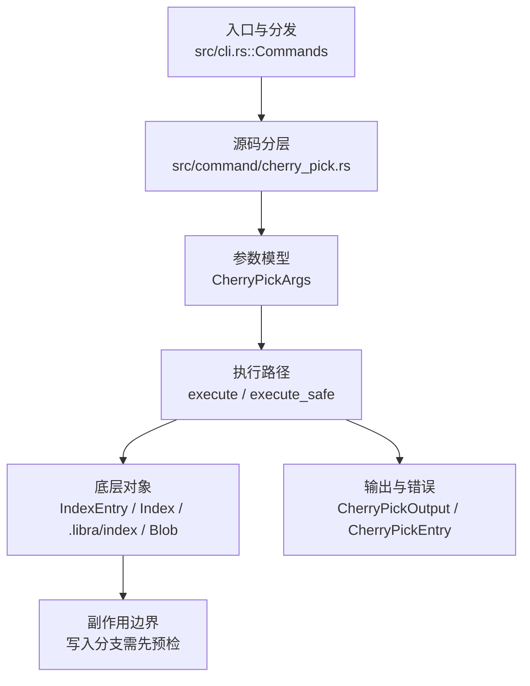

# `libra cherry-pick` 开发设计

## 命令实现目标

`libra cherry-pick` 的目标是把一个或多个已有提交引入当前分支。当前实现支持按顺序重放多个提交、`-n, --no-commit`（单提交时暂存而不自动提交），并对合并提交直接拒绝（`--mainline` 等合并策略不支持），同时对无法解析的提交、detached HEAD 和冲突给出清晰错误。`-x`/`-s`/`-e`、`--ff`、`--mainline`、空提交策略以及 `--continue`/`--skip`/`--abort` sequencer 流程目前未实现（见“还未实现的功能”）。

## 对比 Git 与兼容性

- 兼容级别：`supported`。

- 当前矩阵承诺常用 Git 行为已支持；新增语义必须同步矩阵、用户文档和测试。

## 设计方案

- 入口与分发：已公开接入 `src/cli.rs::Commands`；已由 `src/command/mod.rs` 导出。CLI 层在 `src/cli.rs` 把解析后的参数交给命令模块，命令模块负责把领域错误转换为 `CliError` / `CliResult`。
- 源码分层：主要实现文件为 `src/command/cherry_pick.rs`。参数/子命令类型包括：`CherryPickArgs`；输出、错误或状态类型包括：`CherryPickOutput`、`CherryPickEntry`；主要执行函数包括：`execute`、`execute_safe`。
- 执行路径：`execute_safe` 负责 CLI 安全包装、错误映射和输出配置；索引路径会加载、比较、刷新或保存 `.libra/index`；对象路径会解析 revision 并读写 blob/tree/commit/tag 等对象；引用路径会读取或更新 SQLite refs、HEAD 与 reflog；数据库路径会通过 SeaORM/SQLite 或 D1 客户端持久化元数据。

- 流程图：以下流程图按当前源码分层展示主路径和底层对象边界，便于维护者把代码入口、执行函数和副作用范围对应起来。

- 底层操作对象：`IndexEntry`（索引条目，承载路径、mode、object id 和 stat 元数据）；`Index` / `.libra/index`（暂存区状态、路径条目和刷新/保存边界）；`Blob`（文件内容或 LFS pointer 写入对象库后的 blob 对象）；`Commit`（提交对象、父提交关系和提交消息载荷）；`TreeItem` / `TreeItemMode`（tree 中的路径项和 mode）；`Tree`（由索引或对象遍历生成的目录树对象）；`Branch` / branch store（SQLite refs 上的分支读写、过滤和上游关系）；`Head`（SQLite 中的 HEAD 指向、当前分支和 detached 状态）；`ReflogContext` / `with_reflog`（SQLite reflog 写入和动作记录）；SeaORM / `.libra/libra.db`（配置、refs、reflog、AI/发布元数据等 SQLite 表）；`ObjectHash`（SHA-1/SHA-256 对象 ID 和 revision 解析结果）；`ObjectType`（blob/tree/commit/tag 类型分派）
- 输出与错误契约：人类输出、`--json` / `--machine` 输出和 quiet/verbose 分支必须继续走现有 `OutputConfig` / `emit_json_data` / `CliError` 路径；新增失败模式要补稳定错误码、用户提示和回归测试。
- 副作用边界：凡是写入索引、对象库、refs/HEAD、reflog、SQLite/D1、工作树或远端的路径，都必须先完成参数校验和 dry-run/预检分支，再执行持久化，避免部分写入后静默成功。

## 实现历史

- 本节依据本地 main 分支提交历史重写，筛选与该命令实现、测试或文档路径直接相关的提交；以下是归纳后的实现脉络。
- 2026-06-04 `c0268ec9`（`feat(cherry-pick): add -x/-s/-e and allow-empty flags, lift multi-commit no-commit restriction (v0.17.1309)`）：历史节点：add -x/-s/-e and allow-empty flags, lift multi-commit no-commit restriction (v0.17.1309)；该提交对应的 `-x`/`-s`/`-e`/allow-empty 已在后续被回退，当前 HEAD 不再提供这些参数（见“还未实现的功能”）。
- 2026-06-04 `f3d4a180`（`feat(cherry-pick): support -m mainline for merge commits, --ff fast-forward, reject unsupported strategies (v0.17.1312)`）：功能演进：support -m mainline for merge commits, --ff fast-forward, reject unsupported strategies (v0.17.1312)；该提交对应的 `-m mainline`/`--ff` 已在后续被回退，当前 HEAD 不再提供这些参数（见“还未实现的功能”）。
- 2026-06-04 `bd5f8c4d`（`feat(cherry-pick): persist conflict sequencer in SQLite for continue/skip/abort/quit (v0.17.1311)`）：功能演进：persist conflict sequencer in SQLite for continue/skip/abort/quit (v0.17.1311)；该提交对应的 SQLite sequencer（continue/skip/abort/quit）已在后续被回退，当前 HEAD 不再提供这些参数（见“还未实现的功能”）。
- 2026-06-04 `b9c7d575`（`fix(cherry-pick): keep sequencer state accurate when a resumed pick hard-errors mid-sequence (v0.17.1316)`）：实现修正：keep sequencer state accurate when a resumed pick hard-errors mid-sequence (v0.17.1316)；该节点把边界行为、错误处理或兼容差异纳入当前实现约束。
- 2026-06-07 `ee9570df`（`test(cherry-pick): construct wrong-branch state directly`）：测试契约：construct wrong-branch state directly；相关行为已有回归守卫，后续变更需要继续满足。
- 历史结论：上述 `-x`/`-s`/`-e`、`-m mainline`、`--ff` 与 SQLite sequencer（continue/skip/abort/quit）相关提交对应的实现已在后续被回退，当前 `src/command/cherry_pick.rs` 的公开面只剩 `<commit>...` 与 `-n, --no-commit`，合并提交被直接拒绝。文档应以这些提交之后的现行代码、测试和兼容矩阵为准，历史提交仅作背景，不再作为事实来源。

## 当前状态

- 公开状态：已公开；模块状态：已导出。
- 用户文档：`docs/commands/cherry-pick.md`。
- Synopsis：`libra cherry-pick [-n | --no-commit] [--json] [--quiet] <commit>...`。
- 公开参数/子命令包括：`<commit>...`（位置参数，必填）、`-n, --no-commit`、`--json`、`--quiet`。

## 还未实现的功能

| 类别 | 未完成项 | 当前处理 |
|---|---|---|
| 兼容差异项 | 编辑消息 | 原始对照：--edit / -e；相关参数/替代：不适用；当前说明：不支持 (use -n then commit -m)。 后续实现时需要补对应回归测试并同步兼容矩阵。 |
| 兼容差异项 | 主线父提交 | 原始对照：--mainline <n> / -m <n>；相关参数/替代：不适用；当前说明：不支持 (merge commits rejected)。 后续实现时需要补对应回归测试并同步兼容矩阵。 |
| 兼容差异项 | 记录来源 | 原始对照：-x；相关参数/替代：不适用；当前说明：不支持 (无 -x，CherryPickArgs 未声明该字段)。 后续实现时需要补对应回归测试并同步兼容矩阵。 |
| 兼容差异项 | 追加 Signed-off-by | 原始对照：--signoff / -s；相关参数/替代：不适用；当前说明：不支持 (无 -s/--signoff，CherryPickArgs 未声明该字段)。 后续实现时需要补对应回归测试并同步兼容矩阵。 |
| 兼容差异项 | 快进 | 原始对照：--ff；相关参数/替代：不适用；当前说明：不支持 (无 --ff，CherryPickArgs 未声明该字段)。 后续实现时需要补对应回归测试并同步兼容矩阵。 |
| 兼容差异项 | 冲突后继续 | 原始对照：--continue；相关参数/替代：不适用；当前说明：不支持 (resolve then commit)。 后续实现时需要补对应回归测试并同步兼容矩阵。 |
| 兼容差异项 | 中止进行中操作 | 原始对照：--abort；相关参数/替代：不适用；当前说明：不支持 (no sequencer state)。 后续实现时需要补对应回归测试并同步兼容矩阵。 |
| 兼容差异项 | Skip 当前 commit | 原始对照：--skip；相关参数/替代：不适用；当前说明：不支持。 后续实现时需要补对应回归测试并同步兼容矩阵。 |
| 兼容差异项 | 退出 sequencer | 原始对照：--quit；相关参数/替代：不适用；当前说明：不支持 (no sequencer state)。 后续实现时需要补对应回归测试并同步兼容矩阵。 |
| 兼容差异项 | 策略 | 原始对照：--strategy <s>；相关参数/替代：不适用；当前说明：不支持 (single merge strategy)。 后续实现时需要补对应回归测试并同步兼容矩阵。 |
| 兼容差异项 | 空提交策略 | 原始对照：--allow-empty / --keep-redundant-commits / --empty=<how>；相关参数/替代：不适用；当前说明：不支持 (无 --allow-empty，CherryPickArgs 未声明该字段)。 后续实现时需要补对应回归测试并同步兼容矩阵。 |

## 维护要求

- 改进本命令前，必须先阅读并遵循 [docs/development/commands/_general.md](_general.md)；这是命令设计、实现、测试和文档同步的强制要求。
- 任何行为变更都要先核对实现源码，再同步 `COMPATIBILITY.md`、`docs/commands/<cmd>.md` 和相关测试。
- 新增 Git 兼容参数时必须明确 tier、错误码、JSON/机器输出契约和回归测试。
