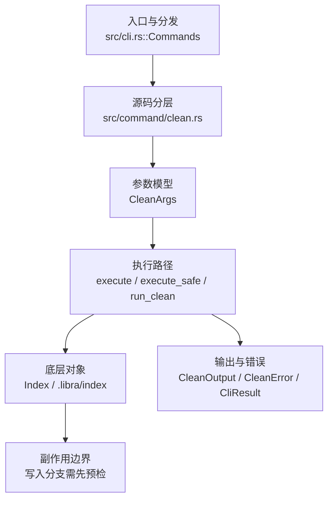

# `libra clean` 开发设计

## 命令实现目标

`libra clean` 的目标是删除未跟踪文件，并在执行前按 Git 兼容规则做 force、dry-run、目录、忽略模式和排除规则判断。实现需要保护嵌套仓库、容忍部分文件删除失败，并把交互模式与部分 pathspec 能力作为后续差异记录。

## 对比 Git 与兼容性

- 兼容级别：`partial`。`-n` / `-f` / `-d` / `-x` / `-X` / `-e`/`--exclude` / `<pathspec>...` 已支持；`-i` 尚未公开。

- 当前矩阵承诺常用 Git 行为已支持；新增语义必须同步矩阵、用户文档和测试。

## 设计方案

- 入口与分发：已公开接入 `src/cli.rs::Commands`；已由 `src/command/mod.rs` 导出。CLI 层在 `src/cli.rs` 把解析后的参数交给命令模块，命令模块负责把领域错误转换为 `CliError` / `CliResult`。
- 源码分层：主要实现文件为 `src/command/clean.rs`。参数/子命令类型包括：`CleanArgs`；输出、错误或状态类型包括：`CleanOutput`（输出结构体）、`CleanError`（错误枚举），错误最终经 `CliResult` 向上层统一传播；主要执行函数包括：`execute`、`execute_safe`、`run_clean`。
- 执行路径：`execute_safe` 负责 CLI 安全包装、错误映射和输出配置；索引路径会加载、比较、刷新或保存 `.libra/index`；工作树路径会显式处理目录、注册表和删除/保留语义。

- 流程图：以下流程图按当前源码分层展示主路径和底层对象边界，便于维护者把代码入口、执行函数和副作用范围对应起来。

- 底层操作对象：`Index` / `.libra/index`（暂存区状态、路径条目和刷新/保存边界）；worktree registry / filesystem layout（附加工作区登记、路径和删除边界）
- 输出与错误契约：人类输出、`--json` / `--machine` 输出和 quiet/verbose 分支必须继续走现有 `OutputConfig` / `emit_json_data` / `CliError` 路径；新增失败模式要补稳定错误码、用户提示和回归测试。
- 副作用边界：凡是写入索引、对象库、refs/HEAD、reflog、SQLite/D1、工作树或远端的路径，都必须先完成参数校验和 dry-run/预检分支，再执行持久化，避免部分写入后静默成功。

## 实现历史

- 本节依据本地 main 分支提交历史重写，筛选与该命令实现、测试或文档路径直接相关的提交；以下是归纳后的实现脉络。
- 2026-02-16 `649dd307`（`此 PR 完成了 r2cn 测试任务 #195：新增 libra clean 命令（仅 -n/--dry-run 与 -f/--force） (#198)`）：基础实现节点：此 PR 完成了 r2cn 测试任务 #195：新增 libra clean 命令（仅 -n/--dry-run 与 -f/--force） (#198)；当前实现的主要轮廓可追溯到该提交。
- 2026-06-04 `afa5c40e`（`feat(clean): implement unit-testable interactive command loop state machine`）：历史背景：该提交的交互式命令循环状态机未在当前 HEAD 落地——`CleanArgs`（`src/command/clean.rs:31-50`）不含 `-i`/`--interactive` 字段，模块内也没有交互状态机代码；交互模式仍按下方缺口表记为兼容差异项。
- 2026-06-04 `f14df4ed`（`feat(clean): add nested repository protection and tolerant file removal (v0.17.1318)`）：功能演进：add nested repository protection and tolerant file removal (v0.17.1318)；该节点扩展了当前命令可用的参数或行为。
- 2026-06-12 `47c841bd`（`tests: Add clean -i intentional-difference test for Phase 0 exit validation`）：测试契约：Add clean -i intentional-difference test for Phase 0 exit validation；相关行为已有回归守卫，后续变更需要继续满足。
- 历史结论：当前文档应以这些提交之后的代码、测试和兼容矩阵为准；更早的迁移式文档只保留为背景，不再作为事实来源。

## 当前状态

- 公开状态：已公开；模块状态：已导出。
- 用户文档：`docs/commands/clean.md`。
- Synopsis：`libra clean (-n | -f) [-d] [-x | -X] [-e <pattern> | --exclude <pattern>]... [<pathspec>...] [--json] [--quiet]`。
- 公开参数/子命令包括：`-n, --dry-run`、`-f, --force`、`-d, --dir`、`-x`、`-X`、`-e, --exclude <pattern>`、`<pathspec>...`。（`-e` 是 `--exclude` 的短别名，复用同一 `exclude` 字段。）

## 还未实现的功能

| 类别 | 未完成项 | 当前处理 |
|---|---|---|
| 功能缺口 | 原始 clean 设计曾有意拒绝目录相关行为；当前以兼容矩阵为准。 | 后续实现时需要同步源码、测试和兼容矩阵。 |
| 兼容差异项 | 交互模式 | 原始对照：不支持；相关参数/替代：-i；当前说明：不适用。 后续实现时需要补对应回归测试并同步兼容矩阵。 |
| 兼容差异项 | 路径规格过滤 | 原始对照：不支持；相关参数/替代：<pathspec>...；当前说明：已支持（文件/目录前缀匹配，空 pathspec 清理全部未跟踪文件）。 |

## 维护要求

- 改进本命令前，必须先阅读并遵循 [docs/development/commands/_general.md](_general.md)；这是命令设计、实现、测试和文档同步的强制要求。
- 任何行为变更都要先核对实现源码，再同步 `COMPATIBILITY.md`、`docs/commands/<cmd>.md` 和相关测试。
- 新增 Git 兼容参数时必须明确 tier、错误码、JSON/机器输出契约和回归测试。
