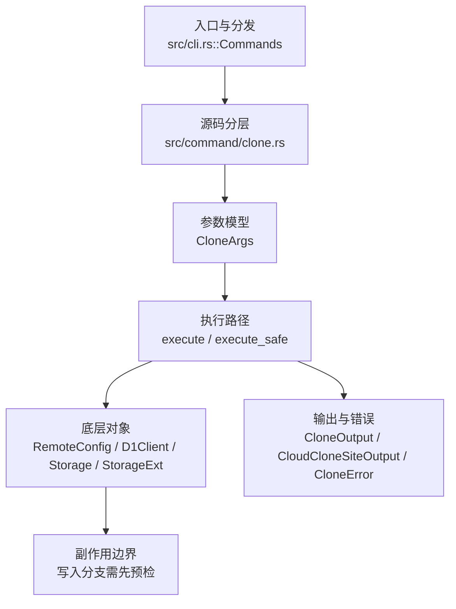

# `libra clone` 开发设计

## 命令实现目标

`libra clone` 的目标是从本地、SSH、HTTPS 或 Libra cloud 来源创建新仓库，并初始化对象、refs、配置和工作区。实现需要覆盖浅克隆、镜像、origin 命名、引用仓库、局部克隆过滤、URL 脱敏和安全边界检查，同时明确子模块与 sparse checkout 的延后决策。

## 对比 Git 与兼容性

- 兼容级别：`partial`。`--depth` and `--single-branch` supported; `--sparse` unsupported (see [docs/development/commands/_compatibility.md#d10-clone---sparse-与顶层-sparse-checkout-命令](docs/development/commands/_compatibility.md#d10-clone---sparse-与顶层-sparse-checkout-命令)); `--recurse-submodules` unsupported (see [docs/development/commands/_compatibility.md#d4-clone---recurse-submodules](docs/development/commands/_compatibility.md#d4-clone---recurse-submodules))

- 当前矩阵明确仍是部分兼容；未覆盖的 Git surface 必须显式列在“还未实现的功能”。

## 设计方案

- 入口与分发：已公开接入 `src/cli.rs::Commands`；已由 `src/command/mod.rs` 导出。CLI 层在 `src/cli.rs` 把解析后的参数交给命令模块，命令模块负责把领域错误转换为 `CliError` / `CliResult`。
- 源码分层：主要实现文件为 `src/command/clone.rs`。参数/子命令类型包括：`CloneArgs`；输出、错误或状态类型包括：`CloneOutput`、`CloudCloneSiteOutput`、`CloneError`；主要执行函数包括：`execute`、`execute_safe`。
- 源码意图：源码模块注释说明该命令会解析 URL、通过协议客户端获取对象、检出工作树，并写入初始 refs/config；执行层生成 `CloneOutput`，渲染层按 `OutputConfig` 输出。
- 执行路径：`execute_safe` 负责 CLI 安全包装、错误映射和输出配置；对象路径会解析 revision 并读写 blob/tree/commit/tag 等对象；引用路径会读取或更新 SQLite refs、HEAD 与 reflog；网络路径会解析 remote 配置、协商协议并处理 pack/idx 数据；数据库路径会通过 SeaORM/SQLite 或 D1 客户端持久化元数据。

- 流程图：以下流程图按当前源码分层展示主路径和底层对象边界，便于维护者把代码入口、执行函数和副作用范围对应起来。

- 底层操作对象：`RemoteConfig`（remote URL、refspec 和凭据配置）；pack / idx 对象（传输包、索引、delta 和完整性校验）；`D1Client`（Cloudflare D1 元数据读写）；`Storage` / `StorageExt`（对象存储抽象，覆盖本地、remote 和 publish 存储）；SeaORM / `.libra/libra.db`（配置、refs、reflog、AI/发布元数据等 SQLite 表）；`Branch` / branch store（SQLite refs 上的分支读写、过滤和上游关系）；`Head`（SQLite 中的 HEAD 指向、当前分支和 detached 状态）；`Tree`（由索引或对象遍历生成的目录树对象）；`Commit`（提交对象、父提交关系和提交消息载荷）；`Blob`（文件内容或 LFS pointer 写入对象库后的 blob 对象）；`TreeItem` / `TreeItemMode`（tree 中的路径项和 mode）；`ReflogContext` / `with_reflog`（SQLite reflog 写入和动作记录）
- 输出与错误契约：人类输出、`--json` / `--machine` 输出和 quiet/verbose 分支必须继续走现有 `OutputConfig` / `emit_json_data` / `CliError` 路径；新增失败模式要补稳定错误码、用户提示和回归测试。
- 副作用边界：凡是写入索引、对象库、refs/HEAD、reflog、SQLite/D1、工作树或远端的路径，都必须先完成参数校验和 dry-run/预检分支，再执行持久化，避免部分写入后静默成功。

## 实现历史

- 本节依据本地 main 分支提交历史重写，筛选与该命令实现、测试或文档路径直接相关的提交；以下是归纳后的实现脉络。
- 2026-01-25 `3703bfab`（`feat(clone): add --depth parameter for shallow clone (#165)`）：基础实现节点：add --depth parameter for shallow clone (#165)；当前实现的主要轮廓可追溯到该提交。
- 2026-06-04 `98e5f47b`（`feat(clone): atomic remote/branch config write and credential redaction`）：功能演进：atomic remote/branch config write and credential redaction；该节点扩展了当前命令可用的参数或行为。
- 2026-06-04 `d03e2902`（`feat(clone): add --filter partial clone with promisor config`）：功能演进：add --filter partial clone with promisor config；该节点扩展了当前命令可用的参数或行为。
- 2026-06-07 `38e31be2`（`fix(clone): close compatibility plan gaps`）：实现修正：close compatibility plan gaps；该节点把边界行为、错误处理或兼容差异纳入当前实现约束。
- 历史结论：当前文档应以这些提交之后的代码、测试和兼容矩阵为准；更早的迁移式文档只保留为背景，不再作为事实来源。

## 当前状态

- 公开状态：已公开；模块状态：已导出。
- 用户文档：`docs/commands/clone.md`。
- Synopsis：`libra clone [OPTIONS] <REMOTE_REPO> [LOCAL_PATH]`。
- 公开参数/子命令包括：`<REMOTE_REPO>` (required)`、`[LOCAL_PATH]`、`-b, --branch <NAME>`、`--single-branch`、`--bare`、`--depth <N>`。

## 还未实现的功能

| 类别 | 未完成项 | 当前处理 |
|---|---|---|
| 兼容矩阵说明 | `--depth` and `--single-branch` 支持; `--sparse` 不支持 (see [docs/development/commands/_compatibility.md#d10-clone---sparse-与顶层-sparse-checkout-命令](docs/development/commands/_compatibility.md#d10-clone---sparse-与顶层-sparse-checkout-命令)); `--recurse-submodules` 不支持 (see [docs/development/commands/_compatibility.md#d4-clone---recurse-submodules](docs/development/commands/_compatibility.md#d4-clone---recurse-submodules)) | 按当前兼容矩阵保留；实现状态变化时同步 `_compatibility.md` 和测试证据。 |
| 功能缺口 | objectsfetched / bytesreceived are 未公开暴露 until the fetch improvement lands | 后续实现时需要同步源码、测试和兼容矩阵。 |
| 功能缺口 | sparse is intentionally 不支持 | 后续实现时需要同步源码、测试和兼容矩阵。 |
| 功能缺口 | the audit-driven decision is to keep --sparse 延后 until there is a concrete | 后续实现时需要同步源码、测试和兼容矩阵。 |
| 功能缺口 | recurse-submodules is intentionally 不支持 | 后续实现时需要同步源码、测试和兼容矩阵。 |
| 功能缺口 | clone --recurse-submodules is also 不支持. See | 后续实现时需要同步源码、测试和兼容矩阵。 |
| 兼容差异项 | Malformed URL or 不支持 scheme | 原始对照：LBR-CLI-003；相关参数/替代：129；当前说明："check the clone URL or scheme"。 后续实现时需要补对应回归测试并同步兼容矩阵。 |

## 维护要求

- 改进本命令前，必须先阅读并遵循 [docs/development/commands/_general.md](_general.md)；这是命令设计、实现、测试和文档同步的强制要求。
- 任何行为变更都要先核对实现源码，再同步 `COMPATIBILITY.md`、`docs/commands/<cmd>.md` 和相关测试。
- 新增 Git 兼容参数时必须明确 tier、错误码、JSON/机器输出契约和回归测试。
