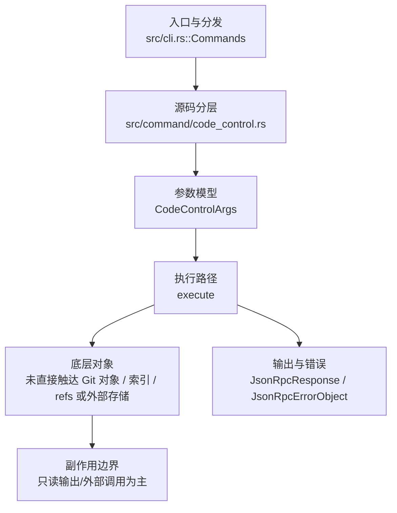

# `libra code-control` 开发设计

## 命令实现目标

`libra code-control` 的目标是驱动本地 Libra Code TUI 的自动化控制会话，用于测试、回放和外部控制当前交互。实现需要围绕控制锁、线程列表、帮助示例和错误输出提供稳定接口。

## 对比 Git 与兼容性

- 兼容级别：`intentionally-different`。Libra AI automation extension, not a Git command

- 该命令或行为属于 Libra 扩展/有意差异；重点是清晰边界、结构化输出和可测试错误，而不是 Git 完全同形。

## 设计方案

- 入口与分发：已公开接入 `src/cli.rs::Commands`；已由 `src/command/mod.rs` 导出。CLI 层在 `src/cli.rs` 把解析后的参数交给命令模块，命令模块负责把领域错误转换为 `CliError` / `CliResult`。
- 源码分层：主要实现文件为 `src/command/code_control.rs`。参数/子命令类型包括：`CodeControlArgs`；输出、错误或状态类型包括：`JsonRpcResponse`、`JsonRpcErrorObject`；主要执行函数包括：`execute`。
- 执行路径：`execute` 是主要执行入口。

- 流程图：以下流程图按当前源码分层展示主路径和底层对象边界，便于维护者把代码入口、执行函数和副作用范围对应起来。

- 底层操作对象：未直接触达 Git 对象、索引、refs 或外部存储；主要副作用集中在 CLI 输出、配置读取或外部进程/浏览器边界。
- 输出与错误契约：该命令没有 `--json` / `--machine` 标志，也不走 `OutputConfig` / `emit_json_data` 路径；`execute` 通过内部 `write_json_value` 辅助函数直接逐行写出 NDJSON 形式的 JSON-RPC 2.0（`JsonRpcResponse` / `JsonRpcErrorObject`），失败路径仍以 `CliError` / `CliResult` 上抛；新增失败模式要补稳定错误码、用户提示和回归测试。
- 副作用边界：当前实现以读操作、格式化输出或外部服务调用为主；若后续增加写入能力，需要先在设计中补齐持久化对象、回滚语义和测试证据。

## 实现历史

- 本节依据本地 main 分支提交历史重写，筛选与该命令实现、测试或文档路径直接相关的提交；以下是归纳后的实现脉络。
- 2026-05-23 `5b8c67e4`（`feat(code-control): wire CODE_CONTROL_EXAMPLES into clap after_help (v0.17.833)`）：基础实现节点：wire CODE_CONTROL_EXAMPLES into clap after_help (v0.17.833)；当前实现的主要轮廓可追溯到该提交。
- 2026-06-01 `34696e91`（`fix(code-control): expose thread listing`）：实现修正：expose thread listing；该节点把边界行为、错误处理或兼容差异纳入当前实现约束。
- 2026-05-16 `65a0ef30`（`test(code_control): pin Display for ControlLockError variants (v0.17.298)`）：测试契约：pin Display for ControlLockError variants (v0.17.298)；相关行为已有回归守卫，后续变更需要继续满足。
- 历史结论：当前文档应以这些提交之后的代码、测试和兼容矩阵为准；更早的迁移式文档只保留为背景，不再作为事实来源。

## 当前状态

- 公开状态：已公开；模块状态：已导出。
- 用户文档：`docs/commands/code-control.md`。
- 公开参数/子命令包括：`--stdio`、`--url <URL>`、`--token-file <PATH>`。无 clap 子命令；具体动作以 stdin 上的 NDJSON JSON-RPC 2.0 方法（`session.get`、`diagnostics.get`、`controller.attach`、`controller.detach`、`message.submit`、`interaction.respond`、`turn.cancel`、`events.subscribe`、`task.dispatch`、`goal.start`、`goal.status`、`goal.cancel`）下发；目前仅支持 `--stdio`，其余调用方式会被拒绝。

## 还未实现的功能

| 类别 | 未完成项 | 当前处理 |
|---|---|---|
| 兼容矩阵说明 | Libra AI 自动化扩展, 不是 Git 命令 | 按当前兼容矩阵保留；实现状态变化时同步 `_compatibility.md` 和测试证据。 |

## 维护要求

- 改进本命令前，必须先阅读并遵循 [docs/development/commands/_general.md](_general.md)；这是命令设计、实现、测试和文档同步的强制要求。
- 任何行为变更都要先核对实现源码，再同步 `COMPATIBILITY.md`、`docs/commands/<cmd>.md` 和相关测试。
- 新增 Git 兼容参数时必须明确 tier、错误码、JSON/机器输出契约和回归测试。
