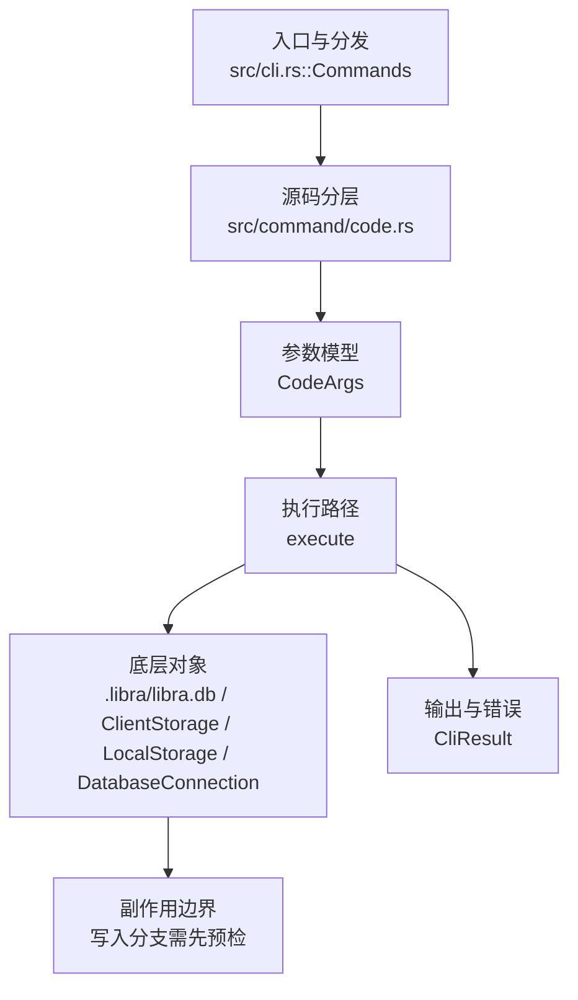

# `libra code` 开发设计

## 命令实现目标

`libra code` 的目标是启动人类开发者与 AI agent 协作的交互式编码会话。默认模式提供 TUI 与后台 Web 服务，普通请求先进入可审阅的 IntentSpec/执行计划流程，再由用户确认是否执行；同时支持 web-only、headless 和 MCP/运行时集成。

## 对比 Git 与兼容性

- 兼容级别：`intentionally-different`。Libra AI extension, not a Git command

- 该命令或行为属于 Libra 扩展/有意差异；重点是清晰边界、结构化输出和可测试错误，而不是 Git 完全同形。

## 设计方案

- 入口与分发：已公开接入 `src/cli.rs::Commands`；已由 `src/command/mod.rs` 导出。CLI 层在 `src/cli.rs` 把解析后的参数交给命令模块，命令模块负责把领域错误转换为 `CliError` / `CliResult`。
- 源码分层：主要实现文件为 `src/command/code.rs`。参数/子命令类型包括：`CodeArgs`；输出、错误或状态类型包括：源码未暴露独立输出/错误类型，错误通过 `CliResult` 或上层命令错误统一传播；主要执行函数包括：`execute`。
- 执行路径：`execute` 是主要执行入口；数据库路径会通过 SeaORM/SQLite 或 D1 客户端持久化元数据；AI 路径会读写 session、checkpoint、thread graph 或 agent profile 状态。

- 流程图：以下流程图按当前源码分层展示主路径和底层对象边界，便于维护者把代码入口、执行函数和副作用范围对应起来。

- 底层操作对象：Agent profile / runtime 对象（外部代理、hook、权限和运行状态）；session/thread store（AI 会话、线程、事件和恢复状态）；AI thread graph（线程版本图和运行关系）；SeaORM / `.libra/libra.db`（配置、refs、reflog、AI/发布元数据等 SQLite 表）；配置层（local/global/system、remote、identity 和运行时设置）；`ClientStorage`（本地/分层对象存储读写入口）；`LocalStorage`（本地对象或发布存储根目录）；`DatabaseConnection`（SeaORM 数据库连接）；Vault/libvault（身份、密钥或 vault-backed 签名边界）
- 输出与错误契约：人类输出、`--json` / `--machine` 输出和 quiet/verbose 分支必须继续走现有 `OutputConfig` / `emit_json_data` / `CliError` 路径；新增失败模式要补稳定错误码、用户提示和回归测试。
- 副作用边界：凡是写入索引、对象库、refs/HEAD、reflog、SQLite/D1、工作树或远端的路径，都必须先完成参数校验和 dry-run/预检分支，再执行持久化，避免部分写入后静默成功。

## 实现历史

- 本节依据本地 main 分支提交历史重写，筛选与 `libra code`、Code UI、Codex runtime 和命令入口直接相关的提交；以下是归纳后的实现脉络。
- 2026-02-20 `5bef0a9e`（`invoke mcp interfaces in command code (#212)`）：基础实现节点：invoke mcp interfaces in command code (#212)；当前实现的主要轮廓可追溯到该提交。
- 2026-06-02 `37d0568c`（`feat(code): activate live-run registry end-to-end (child runner writes, /agents pane reads) (v0.17.1264, CEX-S2-16)`）：功能演进：activate live-run registry end-to-end (child runner writes, /agents pane reads) (v0.17.1264, CEX-S2-16)；该节点扩展了当前命令可用的参数或行为。
- 2026-06-02 `1723ed00`（`feat(code): wire sub-agent PatchSet store; persist merge candidates from libra code (v0.17.1232, CEX-S2-16)`）：功能演进：wire sub-agent PatchSet store; persist merge candidates from libra code (v0.17.1232, CEX-S2-16)；该节点扩展了当前命令可用的参数或行为。
- 2026-05-31 `a94ee7d0`（`fix(code): record resume audit`）：实现修正：record resume audit；该节点把边界行为、错误处理或兼容差异纳入当前实现约束。
- 2026-05-30 `8ce6cedd`（`test(code): pin browser control matrix`）：测试契约：pin browser control matrix；相关行为已有回归守卫，后续变更需要继续满足。
- 历史结论：当前文档应以这些提交之后的代码、测试和兼容矩阵为准；更早的迁移式文档只保留为背景，不再作为事实来源。

## 当前状态

- 公开状态：已公开；模块状态：已导出。
- 用户文档：`docs/commands/code.md`。
- Synopsis：`libra code [--web-only] [--stdio] [--provider <PROVIDER>] [--resume <THREAD_UUID>]`。注意：`--provider`（任何非 Gemini 值）与 `--resume` 是 TUI 专用参数；`validate_mode_args` 对 `--web` 和 `--stdio` 两种非 TUI 模式都会调用 `reject_non_tui_flags`，在那两种模式下设置它们会被拒绝（`src/command/code.rs:4131`、`src/command/code.rs:4151`），因此实际上不能与 `--web-only`/`--stdio` 组合。
- 公开参数/子命令包括：`--web-only`（别名 `--web`）、`-p, --port <PORT>`、`--host <HOST>`、`--cwd <PATH>`、`--repo <PATH>`、`--env-file <PATH>`、`--control <MODE>`、`--browser-control <MODE>`、`--control-token-file <PATH>`、`--control-info-file <PATH>`、`--provider <PROVIDER>`、`--model <MODEL>`、`--temperature <FLOAT>`、`--ollama-thinking <MODE>`（别名 `--thinking`）、`--ollama-compact-tools`、`--deepseek-thinking <MODE>`、`--deepseek-reasoning-effort <EFFORT>`、`--deepseek-stream <BOOL>`（别名 `--stream`）、`--kimi-thinking <MODE>`、`--kimi-stream <BOOL>`、`--agent <NAME>`、`--context <MODE>`、`--resume <THREAD_UUID>`、`--approval-policy <POLICY>`、`--approval-ttl <SECS>`、`--network-access <MODE>`、`--mcp-port <PORT>`、`--stdio`（别名 `--mcp-stdio`）、`--api-base <URL>`、`--codex-bin <PATH>`、`--codex-port <PORT>`、`--plan-mode[=<BOOL>]`、`--goal <OBJECTIVE>` 等。其中部分参数有 provider 互斥约束：`--codex-bin`、`--codex-port`（`src/command/code.rs:4021-4025`）和 `--plan-mode=true`（`src/command/code.rs:4027`）只有在 `--provider=codex` 时才允许，否则报错 “… is only supported with --provider=codex”；反之 `--api-base` 在 `--provider=codex` 时被拒绝（`src/command/code.rs:4032`，报错 “--api-base is not supported with --provider=codex”）。

## 还未实现的功能

| 类别 | 未完成项 | 当前处理 |
|---|---|---|
| 兼容矩阵说明 | Libra AI 扩展, 不是 Git 命令 | 按当前兼容矩阵保留；实现状态变化时同步 `_compatibility.md` 和测试证据。 |

## 维护要求

- 改进本命令前，必须先阅读并遵循 [docs/development/commands/_general.md](_general.md)；这是命令设计、实现、测试和文档同步的强制要求。
- 任何行为变更都要先核对实现源码，再同步 `COMPATIBILITY.md`、`docs/commands/<cmd>.md` 和相关测试。
- 新增 Git 兼容参数时必须明确 tier、错误码、JSON/机器输出契约和回归测试。
