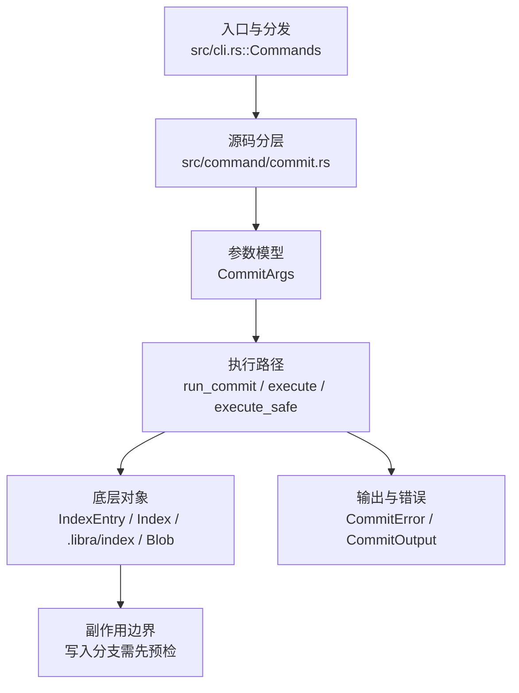

# `libra commit` 开发设计

## 命令实现目标

`libra commit` 的目标是把索引快照记录为新的提交，并处理消息来源、作者、签名、hooks、结构化输出和兼容拒绝。实现需要支持 `--all`、`--author`、交互式编辑器、autosquash、dry-run porcelain、commit trailers 和稳定错误码，同时对 patch/fixup/squash 等未完成行为明确说明。

## 对比 Git 与兼容性

- 兼容级别：`supported`。

- 当前矩阵承诺常用 Git 行为已支持；新增语义必须同步矩阵、用户文档和测试。

## 设计方案

- 入口与分发：已公开接入 `src/cli.rs::Commands`；已由 `src/command/mod.rs` 导出。CLI 层在 `src/cli.rs` 把解析后的参数交给命令模块，命令模块负责把领域错误转换为 `CliError` / `CliResult`。
- 源码分层：主要实现文件为 `src/command/commit.rs`。参数/子命令类型包括：`CommitArgs`；输出、错误或状态类型包括：`CommitError`、`CommitOutput`；主要执行函数包括：`run_commit`、`execute`、`execute_safe`。
- 源码意图：源码模块注释说明该命令会收集暂存变更、构建 tree/commit 对象、校验提交消息和签名，并更新 HEAD/refs。
- 执行路径：`execute_safe` 负责 CLI 安全包装、错误映射和输出配置；核心领域逻辑集中在 `run_commit`；索引路径会加载、比较、刷新或保存 `.libra/index`；对象路径会解析 revision 并读写 blob/tree/commit/tag 等对象；引用路径会读取或更新 SQLite refs、HEAD 与 reflog；数据库路径会通过 SeaORM/SQLite 或 D1 客户端持久化元数据。

- 流程图：以下流程图按当前源码分层展示主路径和底层对象边界，便于维护者把代码入口、执行函数和副作用范围对应起来。

- 底层操作对象：`IndexEntry`（索引条目，承载路径、mode、object id 和 stat 元数据）；`Index` / `.libra/index`（暂存区状态、路径条目和刷新/保存边界）；`Blob`（文件内容或 LFS pointer 写入对象库后的 blob 对象）；`Commit`（提交对象、父提交关系和提交消息载荷）；`TreeItem` / `TreeItemMode`（tree 中的路径项和 mode）；`Tree`（由索引或对象遍历生成的目录树对象）；`Branch` / branch store（SQLite refs 上的分支读写、过滤和上游关系）；`Head`（SQLite 中的 HEAD 指向、当前分支和 detached 状态）；`ReflogContext` / `with_reflog`（SQLite reflog 写入和动作记录）；`ClientStorage`（本地/分层对象存储读写入口）；SeaORM / `.libra/libra.db`（配置、refs、reflog、AI/发布元数据等 SQLite 表）；`ObjectHash`（SHA-1/SHA-256 对象 ID 和 revision 解析结果）
- 输出与错误契约：人类输出、`--json` / `--machine` 输出和 quiet/verbose 分支必须继续走现有 `OutputConfig` / `emit_json_data` / `CliError` 路径；新增失败模式要补稳定错误码、用户提示和回归测试。
- 副作用边界：凡是写入索引、对象库、refs/HEAD、reflog、SQLite/D1、工作树或远端的路径，都必须先完成参数校验和 dry-run/预检分支，再执行持久化，避免部分写入后静默成功。

## 实现历史

- 本节依据本地 main 分支提交历史重写，筛选与该命令实现、测试或文档路径直接相关的提交；以下是归纳后的实现脉络。
- 2025-10-02 `e45fc0f7`（`feat: add option -F/--file for commit command (#10)`）：基础实现节点：add option -F/--file for commit command (#10)；当前实现的主要轮廓可追溯到该提交。
- 2026-06-07 `d399c043`（`feat: support show-ref dereference and commit trailers`）：功能演进：support show-ref dereference and commit trailers；该节点扩展了当前命令可用的参数或行为。
- 2026-06-05 `d68e5d66`（`feat(commit): support autosquash and dry-run porcelain modes`）：功能演进：support autosquash and dry-run porcelain modes；该节点扩展了当前命令可用的参数或行为。
- 2026-06-07 `f2c67a80`（`fix(commit): close compatibility plan gaps`）：实现修正：close compatibility plan gaps；该节点把边界行为、错误处理或兼容差异纳入当前实现约束。
- 历史结论：当前文档应以这些提交之后的代码、测试和兼容矩阵为准；更早的迁移式文档只保留为背景，不再作为事实来源。

## 当前状态

- 公开状态：已公开；模块状态：已导出。
- 用户文档：`docs/commands/commit.md`。
- Synopsis：`libra commit [OPTIONS] -m <MESSAGE>`。
- 公开参数/子命令包括：`-m, --message <MESSAGE>`、`-F, --file <FILE>`、`--amend`、`--no-edit`、`--conventional`、`-a, --all`、`-s, --signoff`、`--allow-empty`、`--disable-pre`、`--no-verify` 等。

## 还未实现的功能

| 类别 | 未完成项 | 当前处理 |
|---|---|---|
| 功能缺口 | fixup and --squash are not 支持; use libra rebase -i for commit restructuring | 后续实现时需要同步源码、测试和兼容矩阵。 |
| 功能缺口 | cleanup mode for comment stripping is not 支持; messages are used as-is | 后续实现时需要同步源码、测试和兼容矩阵。 |

## 维护要求

- 改进本命令前，必须先阅读并遵循 [docs/development/commands/_general.md](_general.md)；这是命令设计、实现、测试和文档同步的强制要求。
- 任何行为变更都要先核对实现源码，再同步 `COMPATIBILITY.md`、`docs/commands/<cmd>.md` 和相关测试。
- 新增 Git 兼容参数时必须明确 tier、错误码、JSON/机器输出契约和回归测试。
