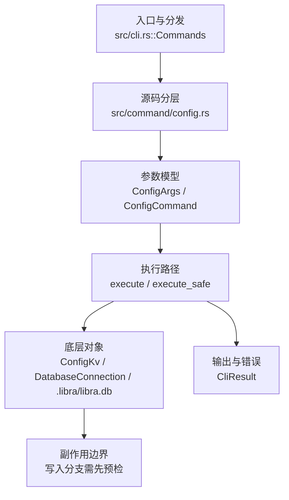

# `libra config` 开发设计

## 命令实现目标

`libra config` 的目标是读取和修改 Libra 配置，覆盖 local/global/system 作用域、多值项、section、类型化输出和机器可读格式。实现需要尊重 SQLite/Vault 存储边界，避免把配置安全性降级为可任意文本编辑，并把 Git 文本配置中的编辑、includeIf、null 输出等差异列为兼容缺口。

## 对比 Git 与兼容性

- 兼容级别：`supported`。vault-backed

- 当前矩阵承诺常用 Git 行为已支持；新增语义必须同步矩阵、用户文档和测试。

## 设计方案

- 入口与分发：已公开接入 `src/cli.rs::Commands`；已由 `src/command/mod.rs` 导出。CLI 层在 `src/cli.rs` 把解析后的参数交给命令模块，命令模块负责把领域错误转换为 `CliError` / `CliResult`。
- 源码分层：主要实现文件为 `src/command/config.rs`。参数/子命令类型包括：`ConfigArgs`、`ConfigCommand`；输出、错误或状态类型包括：`ConfigListEntry`、`ConfigImportSummary`、`ConfigSshKeyEntry`、`ConfigGpgKeyEntry`（`--json` 序列化），错误通过 `CliError` / `CliResult` 统一传播；主要执行函数包括：`execute`、`execute_safe`、`execute_inner`、`resolve_command`。
- 执行路径：`execute_safe` 负责 CLI 安全包装、错误映射和输出配置；数据库路径会通过 SeaORM/SQLite 或 D1 客户端持久化元数据。

- 流程图：以下流程图按当前源码分层展示主路径和底层对象边界，便于维护者把代码入口、执行函数和副作用范围对应起来。

- 底层操作对象：`ConfigKv`（配置键值持久化行）；配置层（local/global/system、remote、identity 和运行时设置）；`DatabaseConnection`（SeaORM 数据库连接）；SeaORM / `.libra/libra.db`（配置、refs、reflog、AI/发布元数据等 SQLite 表）；Vault/libvault（身份、密钥或 vault-backed 签名边界）
- 输出与错误契约：人类输出、`--json` / `--machine` 输出和 quiet/verbose 分支必须继续走现有 `OutputConfig` / `emit_json_data` / `CliError` 路径；新增失败模式要补稳定错误码、用户提示和回归测试。
- 副作用边界：凡是写入索引、对象库、refs/HEAD、reflog、SQLite/D1、工作树或远端的路径，都必须先完成参数校验和 dry-run/预检分支，再执行持久化，避免部分写入后静默成功。

## 实现历史

- 本节依据本地 main 分支提交历史重写，筛选与该命令实现、测试或文档路径直接相关的提交；以下是归纳后的实现脉络。
- 2026-01-07 `a1366d77`（`feat(config): add --global/--local/--system scope support (#108)`）：基础实现节点：add --global/--local/--system scope support (#108)；当前实现的主要轮廓可追溯到该提交。
- 2026-06-03 `05250fe2`（`feat(config): implement git config parity — multi-value, sections, typed values, output flags (v0.17.1277)`）：功能演进：implement git config parity — multi-value, sections, typed values, output flags (v0.17.1277)；该节点扩展了当前命令可用的参数或行为。
- 2026-05-18 `d1f61a92`（`feat(config): expose resolve_env_sync + wire into libra code provider bootstrap`）：功能演进：expose resolve_env_sync + wire into libra code provider bootstrap；该节点扩展了当前命令可用的参数或行为。
- 2026-05-29 `0d7ae4d9`（`fix(config): reject global key generation`）：实现修正：reject global key generation；该节点把边界行为、错误处理或兼容差异纳入当前实现约束。
- 2026-06-02 `ac845f79`（`docs(config): document git config compatibility matrix and decision ledger (v0.17.1276)`）：文档与兼容口径：document git config compatibility matrix and decision ledger (v0.17.1276)；当前文档按该节点之后的实现状态校准。
- 历史结论：当前文档应以这些提交之后的代码、测试和兼容矩阵为准；更早的迁移式文档只保留为背景，不再作为事实来源。

## 当前状态

- 公开状态：已公开；模块状态：已导出。
- 用户文档：`docs/commands/config.md`。
- Synopsis：`libra config [OPTIONS] [key] [value] [COMMAND]`。
- 公开参数/子命令包括：`set`、`get`、`list`、`unset`、`import`、`path`、`edit`、`generate-ssh-key`、`generate-gpg-key`、`--local`、`--global`、`-d, --default <DEFAULT>` 等（另含隐藏 Git 兼容标志 `--get`、`--get-all`、`--unset`、`--unset-all`、`-l, --list`、`--add`、`--import`、`--get-regexp`、`--show-origin`）。`--system` 虽在 clap 中声明，但运行时在 `execute_inner` 中无条件以 `CliError::command_usage` 拒绝（提示改用 `--local` / `--global`），并非可用作用域；详见下方缺口表。

## 还未实现的功能

| 类别 | 未完成项 | 当前处理 |
|---|---|---|
| 功能缺口 | 不支持编辑器编辑：Libra 使用 SQLite 存储，不能安全地通过文本编辑器往返修改；详见设计方案。 | 后续实现时需要同步源码、测试和兼容矩阵。 |
| 兼容差异项 | `--system` 作用域 | 原始对照：git config --system；相关参数/替代：否；当前说明：clap 中声明但运行时无条件拒绝（`execute_inner` 返回 `CliError::command_usage`，提示改用 `--local` / `--global`），并非可用作用域。 后续实现时需要补对应回归测试并同步兼容矩阵。 |
| 兼容差异项 | 编辑器编辑 | 原始对照：git config -e；相关参数/替代：jj config edit；当前说明：不支持 (SQLite 存储)。 后续实现时需要补对应回归测试并同步兼容矩阵。 |
| 兼容差异项 | 类型转换 | 原始对照：--type=bool\|int\|path；相关参数/替代：否 (TOML 类型)；当前说明：不支持 (本批次)。 后续实现时需要补对应回归测试并同步兼容矩阵。 |
| 兼容差异项 | NUL 分隔输出 | 原始对照：-z；相关参数/替代：否；当前说明：不支持 (本批次)。 后续实现时需要补对应回归测试并同步兼容矩阵。 |
| 兼容差异项 | 重命名/删除 section | 原始对照：是；相关参数/替代：否；当前说明：不支持 (本批次)。 后续实现时需要补对应回归测试并同步兼容矩阵。 |
| 兼容差异项 | 条件配置 | 原始对照：includeIf；相关参数/替代：[[when]] blocks；当前说明：不支持。 后续实现时需要补对应回归测试并同步兼容矩阵。 |

## 维护要求

- 改进本命令前，必须先阅读并遵循 [docs/development/commands/_general.md](_general.md)；这是命令设计、实现、测试和文档同步的强制要求。
- 任何行为变更都要先核对实现源码，再同步 `COMPATIBILITY.md`、`docs/commands/<cmd>.md` 和相关测试。
- 新增 Git 兼容参数时必须明确 tier、错误码、JSON/机器输出契约和回归测试。
