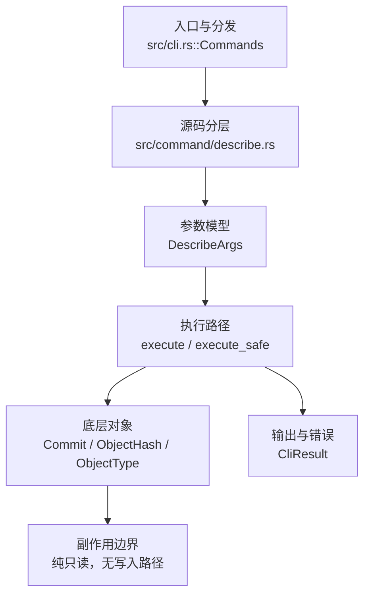

# `libra describe` 开发设计

## 命令实现目标

`libra describe` 的目标是根据可达 tag 为提交生成可读名称。当前实现刻意保持最小子集：仅支持 `[COMMIT]`、`--tags`、`--abbrev <N>`、`--always` 与 JSON 输出，并在无法描述时给出稳定错误；first-parent、候选数量、match/exclude pattern、dirty 标记等 Git 扩展尚未实现。

## 对比 Git 与兼容性

- 兼容级别：`partial`。基础 describe、`--tags`、`--always` 和 `--abbrev` 已支持；long/match/exclude/first-parent/dirty/exact/contains/candidates/all 尚未公开。

- 当前矩阵承诺常用 Git 行为已支持；新增语义必须同步矩阵、用户文档和测试。

## 设计方案

- 入口与分发：已公开接入 `src/cli.rs::Commands`；已由 `src/command/mod.rs` 导出。CLI 层在 `src/cli.rs` 把解析后的参数交给命令模块，命令模块负责把领域错误转换为 `CliError` / `CliResult`。
- 源码分层：主要实现文件为 `src/command/describe.rs`。参数/子命令类型包括：`DescribeArgs`；输出、错误或状态类型包括：`DescribeOutput`、`DescribeError`（均为 crate 私有，未 `pub` 导出），错误最终通过 `CliResult` 向上层命令统一传播；主要执行函数包括：`execute`、`execute_safe`。
- 执行路径：`execute_safe` 负责 CLI 安全包装、错误映射和输出配置；对象路径完全只读——解析 revision 后仅读取 commit 与 tag 对象（经 `tag::list` / `load_object::<Commit>`），不会加载 blob/tree，也不会写入对象库、索引、refs/HEAD、reflog、SQLite 或远端。

- 流程图：以下流程图按当前源码分层展示主路径和底层对象边界，便于维护者把代码入口、执行函数和副作用范围对应起来。

- 底层操作对象：`Commit`（提交对象、父提交关系和提交消息载荷）；`ObjectHash`（SHA-1/SHA-256 对象 ID 和 revision 解析结果）；`ObjectType`（blob/tree/commit/tag 类型分派）
- 输出与错误契约：人类输出、`--json` / `--machine` 输出和 quiet/verbose 分支必须继续走现有 `OutputConfig` / `emit_json_data` / `CliError` 路径；新增失败模式要补稳定错误码、用户提示和回归测试。
- 副作用边界：凡是写入索引、对象库、refs/HEAD、reflog、SQLite/D1、工作树或远端的路径，都必须先完成参数校验和 dry-run/预检分支，再执行持久化，避免部分写入后静默成功。

## 实现历史

- 本节依据本地 main 分支提交历史重写，筛选与该命令实现、测试或文档路径直接相关的提交；以下是归纳后的实现脉络。
- 当前 `src/command/describe.rs` 仅实现 `[COMMIT]`、`--tags`、`--abbrev <N>`、`--always` 与 `--json` 输出，基于一次有界 BFS 查找可达 tag；`--first-parent`、`--exact-match`、`--long`、`--contains`、`--candidates`、`--all`、`--match`、`--exclude`、`--dirty` 均未在当前代码中实现（参见 `docs/commands/describe.md` 中“Why no `--long`/`--match`/`--exclude`”的设计说明）。
- 历史结论：当前文档应以这些提交之后的代码、测试和兼容矩阵为准；更早的迁移式文档只保留为背景，不再作为事实来源。

## 当前状态

- 公开状态：已公开；模块状态：已导出。
- 用户文档：`docs/commands/describe.md`。
- Synopsis：`libra describe [OPTIONS] [COMMIT]`。
- 公开参数/子命令包括：`[COMMIT]`、`--tags`、`--abbrev <N>`、`--always`。

## 还未实现的功能

| 类别 | 未完成项 | 当前处理 |
|---|---|---|
| 兼容差异项 | Force long format | 原始对照：未实现 (use JSON exactmatch)；相关参数/替代：--long；当前说明：不适用。 后续实现时需要补对应回归测试并同步兼容矩阵。 |
| 兼容差异项 | Match tag pattern | 原始对照：未实现；相关参数/替代：--match <glob>；当前说明：不适用。 后续实现时需要补对应回归测试并同步兼容矩阵。 |
| 兼容差异项 | Exclude tag pattern | 原始对照：未实现；相关参数/替代：--exclude <glob>；当前说明：不适用。 后续实现时需要补对应回归测试并同步兼容矩阵。 |
| 兼容差异项 | First-parent only | 原始对照：未实现；相关参数/替代：--first-parent；当前说明：不适用。 后续实现时需要补对应回归测试并同步兼容矩阵。 |
| 兼容差异项 | Dirty suffix | 原始对照：未实现；相关参数/替代：--dirty[=<mark>]；当前说明：不适用。 后续实现时需要补对应回归测试并同步兼容矩阵。 |
| 兼容差异项 | Exact match only | 原始对照：未实现；相关参数/替代：--exact-match；当前说明：不适用（`DescribeArgs` 无此字段）。 后续实现时需要补对应回归测试并同步兼容矩阵。 |
| 兼容差异项 | Find tags containing commit | 原始对照：未实现；相关参数/替代：--contains；当前说明：不适用（`DescribeArgs` 无此字段）。 后续实现时需要补对应回归测试并同步兼容矩阵。 |
| 兼容差异项 | Consider N candidate tags | 原始对照：未实现；相关参数/替代：--candidates <n>；当前说明：不适用（`DescribeArgs` 无此字段）。 后续实现时需要补对应回归测试并同步兼容矩阵。 |
| 兼容差异项 | Consider all refs | 原始对照：未实现；相关参数/替代：--all；当前说明：不适用（`DescribeArgs` 无此字段）。 后续实现时需要补对应回归测试并同步兼容矩阵。 |

## 维护要求

- 改进本命令前，必须先阅读并遵循 [docs/development/commands/_general.md](_general.md)；这是命令设计、实现、测试和文档同步的强制要求。
- 任何行为变更都要先核对实现源码，再同步 `COMPATIBILITY.md`、`docs/commands/<cmd>.md` 和相关测试。
- 新增 Git 兼容参数时必须明确 tier、错误码、JSON/机器输出契约和回归测试。
