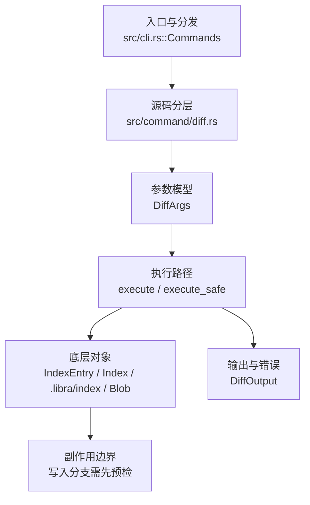

# `libra diff` 开发设计

## 命令实现目标

`libra diff` 的目标是比较提交、索引和工作区之间的内容差异。实现需要覆盖原始输出、相对路径、上下文行、空白忽略、word diff、rename/copy 检测、函数上下文和退出码，同时把二进制补丁、外部 diff 等能力列为差异项。

## 对比 Git 与兼容性

- 兼容级别：`partial`。staged/old-new/pathspec/name/stat/numstat/shortstat/summary/output/algorithm、`--exit-code`/`-s`(`--no-patch`)/`-z`(`--null`)/`--check`（在新增行检测尾随空白与 indent 中 space-before-tab，发现即退出码 2）/`-R`(`--reverse`，交换两侧得到反向 diff)与位置性两点范围 `A..B`（`diff A..B`）已支持；`--no-ext-diff`（接受式 no-op：Libra 无外部 diff 驱动，始终使用内建引擎）已支持；位置性 `diff A B`（空格分隔双 rev）、三点范围 `A...B`（merge-base）、word/binary diff、whitespace-ignoring（`-w`）和外部 diff 驱动（`--ext-diff` / `diff.external`）尚未公开。

- 当前矩阵承诺常用 Git 行为已支持；新增语义必须同步矩阵、用户文档和测试。

## 设计方案

- 入口与分发：已公开接入 `src/cli.rs::Commands`；已由 `src/command/mod.rs` 导出。CLI 层在 `src/cli.rs` 把解析后的参数交给命令模块，命令模块负责把领域错误转换为 `CliError` / `CliResult`。
- 源码分层：主要实现文件为 `src/command/diff.rs`。参数/子命令类型包括：`DiffArgs`；输出、错误或状态类型包括：`DiffOutput`；主要执行函数包括：`execute`、`execute_safe`。
- 执行路径：`execute_safe` 负责 CLI 安全包装、错误映射和输出配置；索引路径会加载、比较、刷新或保存 `.libra/index`；对象路径会解析 revision 并读写 blob/tree/commit/tag 等对象；引用路径会读取或更新 SQLite refs、HEAD 与 reflog。

- 流程图：以下流程图按当前源码分层展示主路径和底层对象边界，便于维护者把代码入口、执行函数和副作用范围对应起来。

- 底层操作对象：`IndexEntry`（索引条目，承载路径、mode、object id 和 stat 元数据）；`Index` / `.libra/index`（暂存区状态、路径条目和刷新/保存边界）；`Blob`（文件内容或 LFS pointer 写入对象库后的 blob 对象）；`Commit`（提交对象、父提交关系和提交消息载荷）；`Tree`（由索引或对象遍历生成的目录树对象）；`Head`（SQLite 中的 HEAD 指向、当前分支和 detached 状态）；`ObjectHash`（SHA-1/SHA-256 对象 ID 和 revision 解析结果）；`ObjectType`（blob/tree/commit/tag 类型分派）
- 输出与错误契约：人类输出、`--json` / `--machine` 输出和 quiet/verbose 分支必须继续走现有 `OutputConfig` / `emit_json_data` / `CliError` 路径；新增失败模式要补稳定错误码、用户提示和回归测试。
- 副作用边界：凡是写入索引、对象库、refs/HEAD、reflog、SQLite/D1、工作树或远端的路径，都必须先完成参数校验和 dry-run/预检分支，再执行持久化，避免部分写入后静默成功。

## 实现历史

- 本节依据本地 main 分支提交历史重写，筛选与该命令实现、测试或文档路径直接相关的提交；以下是归纳后的实现脉络。
- 2025-11-29 `4a66aa45`（`feat(blame, diff): add blame support, bump the git-internal version (#70)`）：基础实现节点：add blame support, bump the git-internal version (#70)；当前实现的主要轮廓可追溯到该提交。
- 2026-06-05 `a9e6093e`（`feat(diff): add -W/--function-context hunk expansion`）：历史节点；`-W`/`--function-context` 当前并未在 `DiffArgs` 中公开，该行为已不在当前实现内。
- 2026-06-05 `45de394f`（`feat(diff): add --word-diff with plain/color and configurable regex`）：历史节点；`--word-diff`/`--color-words` 当前并未在 `DiffArgs` 中公开，仍属于「还未实现的功能」表中的差异项。
- 2026-06-07 `6ef353a3`（`fix(diff): close compatibility plan gaps`）：实现修正：close compatibility plan gaps；该节点把边界行为、错误处理或兼容差异纳入当前实现约束。
- 历史结论：当前文档应以这些提交之后的代码、测试和兼容矩阵为准；更早的迁移式文档只保留为背景，不再作为事实来源。

## 当前状态

- 公开状态：已公开；模块状态：已导出。
- 用户文档：`docs/commands/diff.md`。
- Synopsis：`libra diff [--staged | --cached] [--old <COMMIT> --new <COMMIT>] [<commit>..<commit>] [--stat | --numstat | --shortstat | --name-only | --name-status | --summary] [-s | --no-patch] [--exit-code] [--check] [-R] [-a | --text] [--no-ext-diff] [-z] [<pathspec>...]`。
- 公开参数/子命令包括：`--old <COMMIT>`、`--new <COMMIT>`、`--staged`（`--cached` 为 Git 兼容别名）、`[<pathspec>...]`、`--algorithm <NAME>`、`--output <FILENAME>`、`--name-only`、`--name-status`、`--numstat`、`--stat`、`--shortstat`、`--summary`、`--exit-code`、`-s`/`--no-patch`、`-z`/`--null`、`--check`（`render_diff_check`：扫描每个文件 `raw_diff` 的新增行，按 hunk 头追踪新文件行号，对尾随空白/space-before-tab 报 `<path>:<line>: <msg>`，有问题则 `silent_exit(2)`；不检测 Git 的 blank-at-eof；优先于其他输出模式）、`-R`/`--reverse`（在 `run_diff` 内交换 `old_side`/`new_side` 的 blobs 与 label 后再调 `Diff::diff`，加减号与 status 随之反转；loader 按 hash 内容寻址，交换后仍正确）、`-a`/`--text`（接受式 no-op：Libra 的 diff 从不做二进制检测，始终输出内容 diff，故 `--text` 请求的“按文本处理”已是默认行为；字段 `text` 解析后不被读取。注意与 `--binary`（输出二进制 patch 格式）不同，后者仍未公开）、`--no-ext-diff`（接受式 no-op：Libra 无外部 diff 驱动、始终用内建引擎，故“禁用外部 diff”已是默认行为；字段 `no_ext_diff` 解析后不被读取。外部 diff 驱动本身 `--ext-diff` / `diff.external` 仍未公开）。`--shortstat` 只输出 `--stat` 的汇总行（零项省略）；`--exit-code` 仍打印 diff 但有差异时退出码为 1（区别于 `--quiet` 的静默）；`-s`/`--no-patch` 抑制 patch 主体（与 `--exit-code` 组合做状态检查）；`-z`/`--null` 对 `--name-only`/`--name-status`/`--numstat` 用 NUL 终止每条记录（且 `--name-status` 的状态与路径以 NUL 分隔、无尾随换行；由 `join_diff_records` 实现），其他模式不受影响。
- 位置性两点范围 `diff A..B`：未给 `--old`/`--new`/`--staged` 且首个位置参数是两点范围、且两侧均能解析为提交时，由 `normalize_diff_range` 重写为 `--old A --new B`（`A..` 对工作树，`..B` 以 HEAD 为 old）；任一侧无法解析为提交则原样作为 pathspec（含 `..` 的真实路径不受影响）。三点 `A...B` 暂不处理。

## 还未实现的功能

| 类别 | 未完成项 | 当前处理 |
|---|---|---|
| ✅ 已实现 | Summary | `--summary` 输出 create/delete 的精简摘要（`format_diff_summary` 解析各文件 raw diff 头 `new file mode`/`deleted file mode`），格式与 `git diff --summary` 一致。Libra 的 diff 管线只生成这两类 file-mode 头——不做 rename 检测（重命名显示为 delete+create），也不暴露纯 mode 变更——故仅产出这两类摘要行。带集成测试（`test_diff_summary_lists_creates_and_deletes`）。 |
| 兼容差异项 | Word diff | 原始对照：不支持；相关参数/替代：--word-diff / --color-words；当前说明：不适用。 后续实现时需要补对应回归测试并同步兼容矩阵。 |
| 兼容差异项 | Binary diff | 原始对照：不支持；相关参数/替代：--binary；当前说明：不适用。 后续实现时需要补对应回归测试并同步兼容矩阵。 |
| 兼容差异项 | 上下文行 | 原始对照：不支持；相关参数/替代：-U<n> / --unified=<n>；当前说明：不适用。 后续实现时需要补对应回归测试并同步兼容矩阵。 |
| 兼容差异项 | Ignore whitespace | 原始对照：不支持；相关参数/替代：-w / --ignore-all-space；当前说明：不适用。 后续实现时需要补对应回归测试并同步兼容矩阵。 |
| 部分实现 | External diff tool | `--no-ext-diff` 作为接受式 no-op 已公开（Libra 无外部 diff 驱动、始终用内建引擎）；外部 diff 驱动本身（`--ext-diff` / `diff.external`）仍不支持。 |

## 维护要求

- 改进本命令前，必须先阅读并遵循 [docs/development/commands/_general.md](_general.md)；这是命令设计、实现、测试和文档同步的强制要求。
- 任何行为变更都要先核对实现源码，再同步 `COMPATIBILITY.md`、`docs/commands/<cmd>.md` 和相关测试。
- 新增 Git 兼容参数时必须明确 tier、错误码、JSON/机器输出契约和回归测试。
