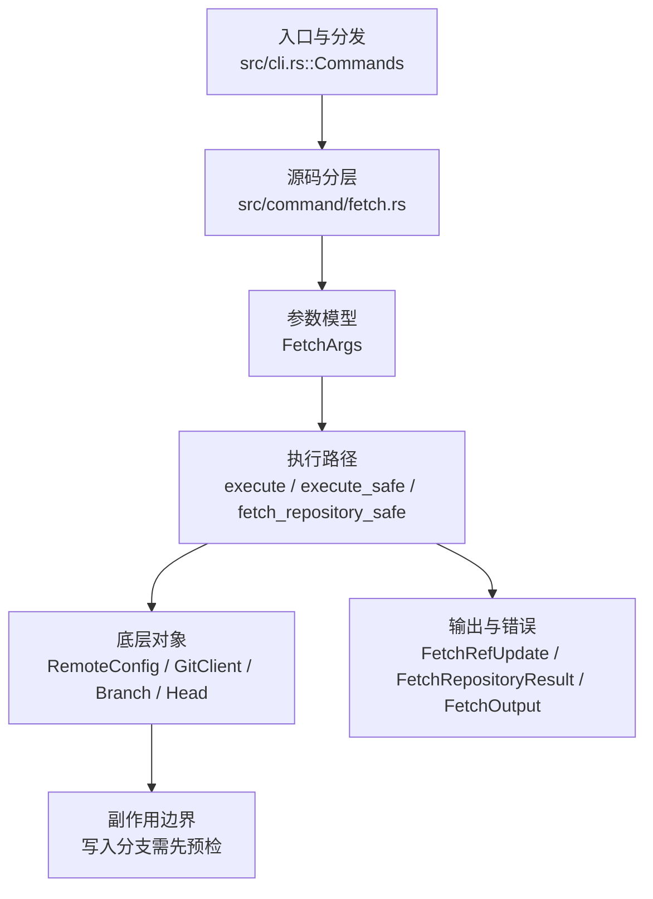

# `libra fetch` 开发设计

## 命令实现目标

`libra fetch` 的目标是从远端下载对象和 refs，并按 refspec、FETCH_HEAD、tag 策略、浅边界和 dry-run/porcelain 规则更新本地状态。实现需要支持原子回滚、prune、force、append、refmap 和远端诊断，同时避免网络/pack 流处理出现静默失败。

## 对比 Git 与兼容性

- 兼容级别：`supported`。`--depth` public flag

- 当前矩阵承诺常用 Git 行为已支持；新增语义必须同步矩阵、用户文档和测试。

## 设计方案

- 入口与分发：已公开接入 `src/cli.rs::Commands`；已由 `src/command/mod.rs` 导出。CLI 层在 `src/cli.rs` 把解析后的参数交给命令模块，命令模块负责把领域错误转换为 `CliError` / `CliResult`。
- 源码分层：主要实现文件为 `src/command/fetch.rs`。参数/子命令类型包括：`FetchArgs`；输出、错误或状态类型包括：`FetchRefUpdate`、`FetchRepositoryResult`、`FetchOutput`、`RemoteSpecErrorKind`、`FetchError`；主要执行函数包括：`execute`、`execute_safe`、`fetch_repository_safe`。
- 源码意图：源码模块注释说明该命令负责远端协商、下载 pack、更新 remote-tracking refs，并处理 prune/depth 选项。
- 执行路径：`execute_safe` 负责 CLI 安全包装、错误映射和输出配置；核心领域逻辑集中在 `fetch_repository_safe`；对象路径会解析 revision 并读写 blob/tree/commit/tag 等对象；引用路径会读取或更新 SQLite refs、HEAD 与 reflog；网络路径会解析 remote 配置、协商协议并处理 pack/idx 数据；数据库路径会通过 SeaORM/SQLite 或 D1 客户端持久化元数据。

- 流程图：以下流程图按当前源码分层展示主路径和底层对象边界，便于维护者把代码入口、执行函数和副作用范围对应起来。

- 底层操作对象：`RemoteConfig`（remote URL、refspec 和凭据配置）；`GitClient` / protocol client（Git wire 协议协商）；SSH transport（SSH remote 连接和认证）；HTTPS transport（HTTP(S) remote 连接和认证）；pack / idx 对象（传输包、索引、delta 和完整性校验）；`Branch` / branch store（SQLite refs 上的分支读写、过滤和上游关系）；`Head`（SQLite 中的 HEAD 指向、当前分支和 detached 状态）；`ReflogContext` / `with_reflog`（SQLite reflog 写入和动作记录）；`ObjectHash`（SHA-1/SHA-256 对象 ID 和 revision 解析结果）；`Commit`（提交对象、父提交关系和提交消息载荷）；SeaORM / `.libra/libra.db`（配置、refs、reflog、AI/发布元数据等 SQLite 表）；Vault/libvault（身份、密钥或 vault-backed 签名边界）
- 输出与错误契约：人类输出、`--json` / `--machine` 输出和 quiet/verbose 分支必须继续走现有 `OutputConfig` / `emit_json_data` / `CliError` 路径；新增失败模式要补稳定错误码、用户提示和回归测试。
- 副作用边界：凡是写入索引、对象库、refs/HEAD、reflog、SQLite/D1、工作树或远端的路径，都必须先完成参数校验和 dry-run/预检分支，再执行持久化，避免部分写入后静默成功。

## 实现历史

- 本节依据本地 main 分支提交历史重写，筛选与该命令实现、测试或文档路径直接相关的提交；以下是归纳后的实现脉络。
- 2026-04-06 `30bed711`（`feat(remote): land batch-5 remote and fetch UX (#341)`）：基础实现节点：land batch-5 remote and fetch UX (#341)；当前实现的主要轮廓可追溯到该提交。
- 2026-06-05 `7d75d886`（`feat(fetch): add --refmap to override fetched-ref destinations`）：历史节点：曾尝试新增 `--refmap`，但当前 `FetchArgs` 已不再公开该参数（仅保留 `--all` / `--depth`）。
- 2026-06-05 `b005e9ee`（`feat(fetch): add --atomic with rollback pack cleanup`）：历史节点：曾尝试新增 `--atomic`，但当前 `FetchArgs` 已不再公开该参数（仅保留 `--all` / `--depth`）。
- 2026-06-07 `b21dc6fd`（`fix(fetch): close compatibility plan gaps`）：实现修正：close compatibility plan gaps；该节点把边界行为、错误处理或兼容差异纳入当前实现约束。
- 历史结论：当前文档应以这些提交之后的代码、测试和兼容矩阵为准；更早的迁移式文档只保留为背景，不再作为事实来源。

## 当前状态

- 公开状态：已公开；模块状态：已导出。
- 用户文档：`docs/commands/fetch.md`。
- Synopsis：`libra fetch [OPTIONS] [<repository> [<refspec>]]`。
- 公开参数/子命令包括：`[<repository>]`、`[<refspec>]`、`-a, --all`、`--depth <N>`。

## 还未实现的功能

| 类别 | 未完成项 | 当前处理 |
|---|---|---|
| 兼容差异项 | Git shallow 扩展参数 | 原始对照：`--deepen` / `--shallow-since` / `--unshallow` 等；当前说明：不支持。 后续实现时需要补对应回归测试并同步兼容矩阵。 |

## 维护要求

- 改进本命令前，必须先阅读并遵循 [docs/development/commands/_general.md](_general.md)；这是命令设计、实现、测试和文档同步的强制要求。
- 任何行为变更都要先核对实现源码，再同步 `COMPATIBILITY.md`、`docs/commands/<cmd>.md` 和相关测试。
- 新增 Git 兼容参数时必须明确 tier、错误码、JSON/机器输出契约和回归测试。
