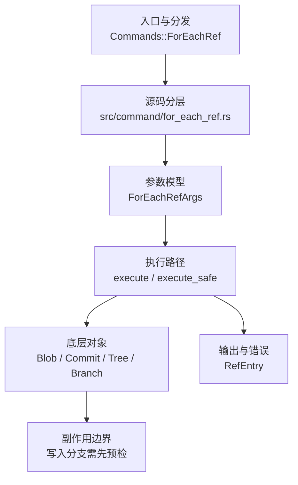

# `libra for-each-ref` 开发设计

## 命令实现目标

`libra for-each-ref` 的目标是按格式列出本地引用，作为 Git ref listing 的 plumbing 兼容入口。当前实现文件、用户文档和顶层 CLI 入口均已公开；剩余工作集中在完整 atom 语言和 quoting mode（contains/merged 类高级过滤已实现）。

## 对比 Git 与兼容性

- 兼容级别：`partial`。`--heads` / `--tags` / `--remotes` / `--all` / `--format` / `--sort`（`refname`/`objectname`/`version:refname`，均可加 `-` 反转）/ `--count` / `--points-at` / `--contains` / `--no-contains` / `--merged` / `--no-merged` / `<pattern>` supported; full Git atom language、其余 sort keys 和 shell quoting modes are not exposed

- 当前矩阵明确仍是部分兼容；未覆盖的 Git surface 必须显式列在“还未实现的功能”。

## 设计方案

- 入口与分发：源码资料存在并已公开接入 `src/cli.rs::Commands`；`src/command/mod.rs` 已导出。CLI 层在 `src/cli.rs` 把解析后的参数交给命令模块，命令模块负责把领域错误转换为 `CliError` / `CliResult`。
- 源码分层：主要实现文件为 `src/command/for_each_ref.rs`。参数/子命令类型包括：`ForEachRefArgs`；输出、错误或状态类型包括：`RefEntry`；主要执行函数包括：`execute`、`execute_safe`。
- 执行路径：`execute_safe` 负责 CLI 安全包装、错误映射和输出配置；对象路径会解析 revision 并读写 blob/tree/commit/tag 等对象；引用路径会读取或更新 SQLite refs、HEAD 与 reflog。

- 流程图：以下流程图按当前源码分层展示主路径和底层对象边界，便于维护者把代码入口、执行函数和副作用范围对应起来。

- 底层操作对象：`Blob`（文件内容或 LFS pointer 写入对象库后的 blob 对象）；`Commit`（提交对象、父提交关系和提交消息载荷）；`Tree`（由索引或对象遍历生成的目录树对象）；`Branch` / branch store（SQLite refs 上的分支读写、过滤和上游关系）；`ConfigKv`（配置键值持久化行）
- 输出与错误契约：人类输出、`--json` / `--machine` 输出和 quiet/verbose 分支必须继续走现有 `OutputConfig` / `emit_json_data` / `CliError` 路径；新增失败模式要补稳定错误码、用户提示和回归测试。
- 副作用边界：凡是写入索引、对象库、refs/HEAD、reflog、SQLite/D1、工作树或远端的路径，都必须先完成参数校验和 dry-run/预检分支，再执行持久化，避免部分写入后静默成功。

## 实现历史

- 本节依据本地 main 分支提交历史重写，筛选与该命令实现、测试或文档路径直接相关的提交；以下是归纳后的实现脉络。
- 2026-06-13 `8d4fb969`（`Implement ref and index listing commands`）：基础实现节点：Implement ref and index listing commands；当前实现的主要轮廓可追溯到该提交。
- 历史结论：`src/command/for_each_ref.rs` 已通过 `src/cli.rs::Commands::ForEachRef` 公开；早期“未公开 CLI”的记录已经过期，当前状态以源码和本页“当前状态”为准。

## 当前状态

- 公开状态：已公开；模块状态：已从 `src/command/mod.rs` 导出。
- 用户文档：`docs/commands/for-each-ref.md`，记录公开 CLI 合约。
- 公开参数/子命令包括：`--heads`、`--tags`、`--remotes`、`--all`、`--format`、`--sort`、`--count`、`--points-at <object>`、`--contains <commit>`、`--no-contains <commit>`、`--merged <commit>`、`--no-merged <commit>`、`<pattern>...`。
- `--contains <commit>` / `--no-contains <commit>`：仅保留（或排除）其提交以 `<commit>` 为祖先的 ref（即 ref 的提交“包含”该 commit）。复用 `log::get_reachable_commits` 对每个 ref 的 peeled commit 做一次可达性遍历。
- `--merged <commit>` / `--no-merged <commit>`：仅保留（或排除）其提交可从 `<commit>` 到达的 ref（即 ref 已合并入 `<commit>`），方向与 `--contains` 相反。复用 `log::get_reachable_commits` 对 `<commit>` 计算一次可达集合后逐 ref 判定，避免逐 ref 重复遍历。

## 还未实现的功能

| 类别 | 未完成项 | 当前处理 |
|---|---|---|
| 兼容矩阵 | `COMPATIBILITY.md` 已登记该命令为 `partial`。 | 保持与矩阵对齐；新增参数时同步矩阵和守卫测试。 |
| 功能缺口 | Git atom 语言子集 | 原始对照：完整 `%(atom)` 集合；相关参数/替代：`--format`；当前说明：支持 `%(refname)` / `%(refname:short)` / `%(objectname)` / `%(objectname:short)`（7 位）/ `%(objecttype)` / `%(HEAD)`（当前分支标 `*`）/ `%(upstream)` / `%(upstream:short)`（来自 `branch.<name>.remote`+`.merge` 的标准追踪 ref，自定义 refspec 映射未建模）/ `%(subject)`（提交或附注标签消息首行，经 `load_object` 读取）/ `%(authorname)` / `%(authoremail)` / `%(committername)` / `%(committeremail)`（提交身份）/ `%(taggername)` / `%(taggeremail)`（附注标签 tagger 身份，非 tag ref 为空；email 带尖括号；对象只加载一次），其余 atom（dates、`%(push)`、`%(contents)` 等）仍缺。 后续扩展时需补回归测试并同步兼容矩阵。 |
| ✅ 已实现 | `--sort=version:refname`（别名 `v:refname`，可加 `-` 反转） | 复用 `utils::util::version_refname_cmp`（与 `ls-remote` 共享）：数字串按数值比较，使 `v1.9` 排在 `v1.10` 前。带集成测试（`test_for_each_ref_sort_version_refname`）。其余 sort keys（date keys、`*objectname` 等）仍缺。 |
| ✅ 已实现 | 高级过滤 | `--contains` / `--no-contains`、`--merged` / `--no-merged` 均已实现（基于 `log::get_reachable_commits` 的可达性判定，`--merged` 对目标提交计算一次可达集合后逐 ref 判定）；`--points-at` 支持 direct refs、lightweight tags 和 annotated tag peeled target。带集成测试（`test_for_each_ref_contains_filter`、`test_for_each_ref_merged_filter`）。 |
| 功能缺口 | 引用命名空间 | 原始对照：`--format` 的 shell/perl/python/tcl 引用模式；当前说明：未实现。 后续实现时需要补对应回归测试并同步兼容矩阵。 |

## 维护要求

- 改进本命令前，必须先阅读并遵循 [docs/development/commands/_general.md](_general.md)；这是命令设计、实现、测试和文档同步的强制要求。
- 任何行为变更都要先核对实现源码，再同步 `COMPATIBILITY.md`、`docs/commands/<cmd>.md` 和相关测试。
- 新增 Git 兼容参数时必须明确 tier、错误码、JSON/机器输出契约和回归测试。
- 若决定发布该命令，最小闭环是：CLI 变体、`src/command/mod.rs` 导出、dispatch、用户文档、兼容矩阵和测试。
