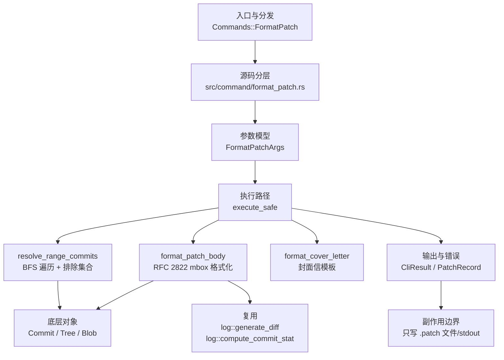

# `libra format-patch` 开发设计

## 命令实现目标

`libra format-patch` 将提交导出为 mbox 格式的邮件补丁文件。该命令解析 `A..B` 修订范围（空左右侧均默认 `HEAD`，单修订号按 `<spec>..HEAD` 处理），对范围内的每个非合并提交生成一个 `.patch` 文件。每个文件按 RFC 2822 标准生成 mbox 信封（`From ` 行）、邮件头（`From:`、`Date:`、`Subject:`、`Message-ID` 等）和邮件体（提交正文 + `---` 分隔 + diffstat + unified diff）。输出通过 `-o` 写入目录或通过 `--stdout` 输出到标准输出。

## 对比 Git 与兼容性

- 兼容级别：`partial`。核心补丁导出能力已公开，支持 15+ 参数，merge 提交默认跳过。未实现的 Git 选项包括 `--attach`、`--inline`、`--suffix`、`--signature`、`--from`、`--to`、`--cc`、`--base`、`--interdiff`、`--range-diff`、`--notes`、`--encode-email-headers` 和 `--force`。

## 设计方案

- 入口与分发：`src/cli.rs::Commands::FormatPatch` 公开顶层 CLI，`src/command/mod.rs` 导出 `format_patch` 模块；CLI 层在 `src/cli.rs` 把解析后的参数交给 `command::format_patch::execute_safe`，命令模块负责把领域错误转换为 `CliError` / `CliResult`。
- 源码分层：主要实现文件为 `src/command/format_patch.rs`。参数类型为 `FormatPatchArgs`；错误类型为 `FormatPatchError`（`thiserror::Error` derive），映射到 `CliError` 的 `NotInRepo`、`CliInvalidTarget`、`IoWriteFailed` 等稳定错误码；主要执行函数为 `execute_safe`、`resolve_range_commits`、`format_patch_body`、`format_cover_letter`、`write_patch_file`。
- 执行路径：`execute_safe` 负责 CLI 安全包装、错误映射和输出配置；核心流程解析修订范围 → 遍历提交图 → 生成 diff → 格式化 mbox → 写入文件或 stdout。

- 流程图：

- 底层操作对象：`Commit`（通过 `log::get_reachable_commits` 加载，读取 `id`、`tree_id`、`parent_commit_ids`、`author`、`committer`、`message`）；`Tree` / `Blob`（由 `log::generate_diff` 和 `log::compute_commit_stat` 内部加载）。
- 输出与错误契约：`execute_safe` 支持 `--json` 输出结构化 `PatchRecord[]`；`--cover-letter` 写出 `0000-cover-letter.patch` 时，该文件以 `number = 0` 的记录出现在 `PatchRecord[]` 中；`--quiet` 抑制文件路径打印；`--no-pager` 跳过分页器；失败通过 `CliError` / `CliResult` 传播，携带稳定错误码：`RepoNotFound`（`LBR-REPO-001`）、`CliInvalidTarget`（`LBR-CLI-003`，范围无提交）、`IoWriteFailed`（`LBR-IO-002`，文件写入失败）。新增失败模式要补稳定错误码、用户提示和回归测试。
- 副作用边界：该命令不应修改索引、对象库、refs/HEAD 或 reflog；唯一写入面是 `.patch` 文件或 stdout。

## 实现历史

- 2026-06-20 `3b43f2ca`（`feat(format-patch): add core implementation`）：初始实现，包含 FormatPatchArgs、范围解析、mbox 格式化、CLI 接入。
- 2026-06-20 `cd7696d4`（`docs(format-patch): add user documentation and compatibility entry`）：用户文档和兼容矩阵。
- 2026-06-20 `66e7a339`（`test(format-patch): add integration tests and compat surface guard`）：20 个集成测试和表面守卫。
- 2026-06-20 `945acee8`（`fix(format-patch): fix commit ordering, double-load, and cover letter reroll`）：修复提交排序、重复加载和封面信版本号。
- 2026-06-20 `1c2fd7b1`（`fix(format-patch): handle empty left side in ..B range and --start-number 0`）：修复空 `..` 侧默认值和编号 0 冲突。
- 2026-06-21 `e7e6c07b`（`fix(format-patch): default empty .. sides to HEAD for Git compatibility`）：空左右侧统一默认 `HEAD`。
- 2026-06-21 `574a6588`（`fix(format-patch): always number filenames and use UTF-8 safe slug truncation`）：文件名始终含序号，slug 截断 UTF-8 安全。

## 当前状态

- 公开状态：已公开；模块状态：`src/command/mod.rs` 导出 `format_patch`，`src/cli.rs::Commands::FormatPatch` 负责 CLI 接入。
- 用户文档：`docs/commands/format-patch.md`。
- Synopsis：`libra format-patch [OPTIONS] [revision-range]`。
- 公开参数包括：`[revision-range]`、`-o, --output-directory <DIR>`、`--stdout`、`-n, --numbered`、`--start-number <N>`、`--subject-prefix <PREFIX>`、`--cover-letter`、`--thread` / `--no-thread`、`--in-reply-to <MESSAGE_ID>`、`-v, --reroll-count <N>`、`-s, --signoff`、`--full-index`、`--no-stat`、`--keep-subject`。

## 还未实现的功能

| 类别 | 未完成项 | 当前处理 |
|---|---|---|
| Git flag | `--attach` / `--inline` / `--no-attach`（MIME 附件/内联模式） | 未公开；当前固定输出 `text/plain; charset=UTF-8` 内联，不加 MIME multipart。命令层。 |
| Git flag | `--suffix <sfx>`（文件名后缀，默认 `.patch`） | 未公开；后缀硬编码为 `.patch`。命令层。 |
| Git flag | `--signature <sig>` / `--signature-file <file>` / `--no-signature`（自定义签名） | 未公开；当前固定使用 libra 版本号作为尾部签名。命令层。 |
| Git flag | `--from` / `--to` / `--cc` / `--no-to` / `--no-cc`（邮件收件人/抄送头） | 未公开；当前不生成这些头。命令层。 |
| Git flag | `--base <tree-ish>`（记录基础提交，供 `git am --base` 使用） | 未公开；需生 `base-commit` 头。命令层。 |
| Git flag | `--interdiff <prev>` / `--range-diff <prev>`（补丁间差异/范围差异） | 未公开；依赖 interdiff/range-diff 引擎。命令层。 |
| Git flag | `--notes[=<ref>]` / `--no-notes`（在补丁中附加 notes） | 未公开；需集成 notes 子系统。命令层。 |
| Git flag | `--encode-email-headers`（QP 编码非 ASCII 邮件头） | 未公开；当前头直接使用 UTF-8。命令层。 |
| Git flag | `--force`（强制覆盖已有文件） | 未公开；当前遇到同名文件直接覆盖。命令层。 |
| Git flag | `--zero-commit`（为根提交输出全零 hash） | 未公开；当前根提交的 `From ` 行使用真实 hash。命令层。 |
| 行为差异 | 合并提交默认跳过，无可选 `--diff-merges` 参数 | 当前实现直接在范围解析时过滤掉所有多父提交。 |
| 兼容矩阵 | `COMPATIBILITY.md` 已登记该命令。 | 已纳入用户可见兼容矩阵和矩阵守卫。 |
| CLI 接入 | `src/cli.rs::Commands::FormatPatch` 已公开。 | 已接入 CLI；后续扩展参数时同步文档、矩阵和测试。 |

## 维护要求

- 改进本命令前，必须先阅读并遵循 [docs/development/commands/_general.md](_general.md)；这是命令设计、实现、测试和文档同步的强制要求。
- 任何行为变更都要先核对实现源码，再同步 `COMPATIBILITY.md`、`docs/commands/<cmd>.md` 和相关测试。
- 新增 Git 兼容参数时必须明确 tier、错误码、JSON/机器输出契约和回归测试。
- 若决定发布该命令，最小闭环是：CLI 变体、`src/command/mod.rs` 导出、dispatch、用户文档、兼容矩阵和测试。
