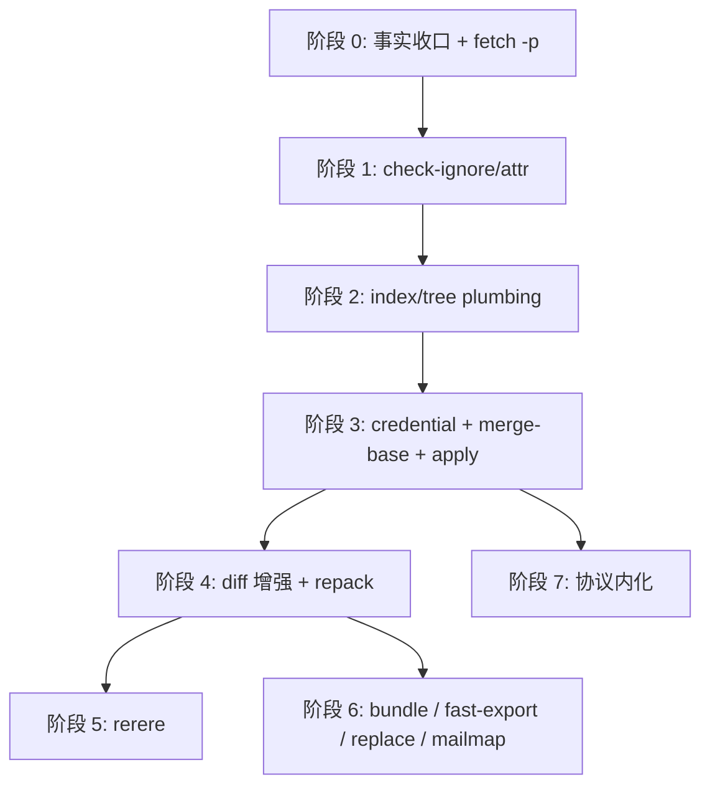
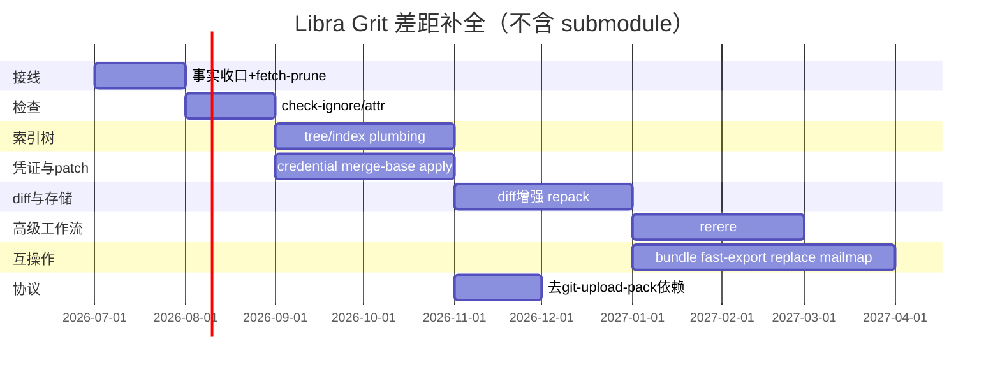

# Grit 差距补全执行计划

本文件记录 Libra 相对 [Grit](https://github.com/gitbutlerapp/grit)（`grit-git` CLI + `grit-lib`）在 Git 兼容命令面上的差距、源码核对结论，以及**按实现顺序排列**的补全路线图。它同时承担 Grit 命令测试重写的全局入口：凡是 Libra 已公开或候选公开的 Git 兼容命令，即使命令实现不在本差距补全计划内，也必须先分析 Grit 测试场景和覆盖范围，再按 Libra 的测试写法规范重写为 Libra 原生测试。它是跨命令执行计划，不替代单命令开发文档、`COMPATIBILITY.md` 或 [`_general.md`](_general.md) 的治理规则。

- **事实来源**：`src/cli.rs`、`src/command/`、[`COMPATIBILITY.md`](../../../COMPATIBILITY.md)、[`docs/development/commands/_general.md`](_general.md)、[`docs/development/commands/_compatibility.md`](_compatibility.md)、`docs/commands/README.md`、`tests/command/mod.rs`、Grit `grit-git/src/commands/`、`grit-git/src/main.rs::KNOWN_COMMANDS`、Grit `tests/` / `data/tests/` / `TESTING.md`。
- **用户承诺**：公开任何新命令前必须同步 [`COMPATIBILITY.md`](../../../COMPATIBILITY.md)、`docs/commands/<cmd>.md`、compat/integration 测试（见 [`_general.md`](_general.md)）。
- **治理交叉引用**：拒绝/延后决策见 [`_compatibility.md`](_compatibility.md)（D 编号）；本计划**不**覆盖 submodule（D1 拒绝，见下文范围声明）。
- **冲突处理原则**：本文件只能提出候选实现顺序；如果候选项与当前 README、`_compatibility.md` 或单命令文档的公开状态冲突，先在本文件标为「待决策」或「文档同步债」，不得直接宣称已经改变用户承诺。

## 方案评估结论速览

本计划已按**合理性/可行性、完整性、安全性、功能正确性/接口兼容性、数据流/控制流、性能/效率、可靠性/容错性、兼容性/互操作性、可扩展性/可维护性、合规性/标准符合性**十个维度完成评估。评估结论用于指导后续阶段优先级和资源分配，所有「必须补强」项已落入对应 GGT 任务或质量门。

| 维度 | 评级 | 关键结论 | 必须补强的控制点 |
|------|------|----------|------------------|
| 合理性 / 可行性 | ★★★★☆ | 阶段递进（检查 → plumbing → 凭证/patch → diff/存储 → 高级工作流 → 互操作 → 协议内化）符合当前架构；阶段 0 旧表述已落后；GGT-00A 若作为串行前置将成为瓶颈。 | 阶段 0 改为事实基线与文档同步；GGT-00A 与实现并行推进，不得阻塞阶段开工。 |
| 完整性 | ★★★☆☆ | 命令/flag 差距清单较全，但缺少跨阶段验收矩阵、回滚/降级策略、错误码基线、测量工具定义和变更影响面分析。 | 增加全局质量门、回滚策略、错误码文档、性能测量命令和决策日志。 |
| 安全性 | ★★★★☆ | credential / apply / fast-import / update-ref / bundle 为高风险；GGT-08 已覆盖侧信道、过期、轮换；apply 与 fast-import 需要扩展路径/资源安全细节。 | apply 路径安全、fast-import 资源限制与畸形输入、update-ref CAS 边界、bundle 签名验证。 |
| 功能正确性 / 接口兼容性 | ★★★★☆ | `direct`/`adapted`/`declined`/`blocked` 分类正确；部分 Git 退出码/输出断言（如 `merge-file` 精确非零码）未经验证。 | 每个命令列断言分类；对未验证退出码加「待确认」标记并补测试。 |
| 数据流 / 控制流 | ★★★★☆ | 阶段依赖基本正确；credential 数据流缺少显式描述；apply 三阶段（验证→索引→工作树）控制流未定。 | 增加 credential 数据流表；定义 apply 控制流与失败回滚点。 |
| 性能 / 效率 | ★★★☆☆ | 有时间基线但无内存基线、无测量命令、无 CI 性能回归阈值。 | 增加内存目标、`hyperfine`/`cargo bench` 测量方法、CI 性能回归 job。 |
| 可靠性 / 容错性 | ★★★☆☆ | 事务边界已提及，但缺磁盘满、网络抖动、部分失败、进程崩溃后的具体恢复策略。 | 增加磁盘满/部分失败/崩溃恢复步骤；定义「失败后仓库状态」标准。 |
| 兼容性 / 互操作性 | ★★★★☆ | 不追求完整 Git parity 的边界合理；导出格式互操作要求明确。 | 明确 Git 版本目标；增加 SHA-1/SHA-256 混用检测和格式版本门。 |
| 可扩展性 / 可维护性 | ★★★★☆ | 复用 `internal/*` 单一实现的方向正确；文档本身较长，需决策日志和可并行切片。 | 增加决策日志；GGT-00A 拆分为可独立推进的切片；新增命令不得复制既有逻辑。 |
| 合规性 / 标准符合性 | ★★★★☆ | 许可证/source 记录要求存在；缺少 DCO 和文档标准引用。 | PR 验收清单增加 DCO；fixture 来源模板；文档标准指向 `_general.md`。 |

> 评级说明：★★★★★ = 当前可直接执行；★★★★☆ = 小风险/需补强；★★★☆☆ = 需新增控制点方可进入开发。

最后核对：2026-06-24（Libra `v0.17.1613` 工作区；Grit 外部基线为 GitHub [`v0.5.0` release](https://github.com/gitbutlerapp/grit/releases/tag/v0.5.0) + [main README](https://github.com/gitbutlerapp/grit/blob/main/README.md) 中的 `grit-git`/`grit-lib` 说明；本次补充核对了 `src/command/{fetch,remote,gc,prune,maintenance}.rs`、`src/command/mod.rs`、`tests/command/mod.rs` 和 `docs/development/commands/{README,fetch,remote,rebase}.md`）。实现任何 Grit 对齐项前，必须重新生成 Grit 命令清单并记录 tag/commit，不能只沿用本文件的历史快照。

---

## 范围声明

### 明确不做

| 能力 | 决策 | 依据 |
|------|------|------|
| `submodule` / `submodule--helper` | **拒绝** | [`_compatibility.md` D1](_compatibility.md#d1submodule-子命令族)；单仓库 / trunk 产品边界 |
| `clone --recurse-submodules` | **拒绝** | D4（依赖 submodule） |
| Git LFS filter / `.gitattributes` smudge-clean 桥接 | **有意差异** | D5；使用 `libra lfs` + `.libra_attributes` |
| Git hooks bridge（`.git/hooks`、`core.hooksPath`） | **拒绝** | D3 |
| 跨命令交互式 patch mode（`add -p` 等） | **拒绝** | D15 |
| 交互式 rebase / todo 编辑（`rebase -i`、`--edit-todo`） | **拒绝** | D16；继续优先支持可脚本化 rebase / autosquash 路径 |
| 顶层 `sparse-checkout` | **延后** | D10 |
| 暴露 `send-pack` / `fetch-pack` 为用户命令 | **不做** | push/fetch 已内嵌协议；见阶段 7 |

gitlink（`0o160000`）在 tree/index 中仍可识别；`ls-tree` / `show` / `fsck` / `gc` 等检查类路径应保留 gitlink 识别能力，但 `merge` / `rebase` 当前会拒绝 gitlink 条目。`push` 等对 submodule 的警告可保留或文档化，但不实现 submodule 工作流。

### 并行推荐（未列入原需求清单，源码显示高价值）

| 命令 | 理由 |
|------|------|
| `merge-base` | `log.rs` / `rebase.rs` 已有算法，缺独立 CLI；解锁 `diff A...B` |
| `apply`（unified diff） | 无 Git patch 应用；仅有 AI 侧 `apply_patch`（Codex 格式） |
| `fetch --prune` | `remote prune` 与 `remote update -p` 已有；`fetch.rs` 仍未实现 prune flag |
| `commit-tree` / `mktree` | `Commit::from_tree_id`、`Tree::from_tree_items` 已在多个命令/测试中使用；与 `write-tree` 同属脚本化 plumbing |
| `check-ref-format` | init/branch 路径已有 Git 风格 ref 校验需求；独立 CLI 可减少脚本侧绕行 |

---

## 对比基准

| 维度 | Grit | Libra |
|------|------|-------|
| Git 兼容 CLI | `grit-git`，README 称 140+ Git-compatible commands；实际阶段执行前以 `KNOWN_COMMANDS` 重新生成 | `libra`，以 `src/cli.rs::Commands` enum 当前变体为准；2026-06-24 实际 `partial`/`supported`/`intentionally-different` 命令约 50 个（不含内部模块） |
| 测试背书 | README 称 `grit-git` 可运行 42k+ 上游 Git tests；具体通过率需按选定 tag/commit 重新记录 | 自有集成测试 + compat guards |
| 存储 | 传统 `.git/` 布局 | `.libra/`：Git 对象 + SQLite refs/config |
| 目标 | Git 行为复刻（库可链接） | AI Agent 原生 VCS + 部分 Git 兼容 |

## 关键假设与外部依赖

本计划的以下假设若变化，需重新评估对应阶段并更新本文件决策日志：

| 假设 | 影响阶段 | 变化时的应对 |
|------|----------|--------------|
| Grit 外部基线保持 `v0.5.0` 或后续稳定 tag | 全部 | 每次阶段开工前重新生成命令清单并 diff；GGT-00A-P3 负责刷新。 |
| Libra 继续以 `.libra/` + SQLite refs 为存储架构 | 2, 6, 7 | 若迁移 refs 存储，`update-ref` / `replace` / protocol 任务需重新设计。 |
| `maintenance run --task gc` 是唯一公开 GC 入口 | 0 | 若产品决策重新公开 `gc`/`prune`，需重启治理并替换 GGT-01。 |
| 不实现 submodule / Git hooks bridge | 全部 | 任何重启 D1/D3 的需求必须先改 `_compatibility.md` 和本文件范围声明。 |
| CI 默认 L1 套件保持 `cargo test --all` | 测试矩阵 | 新增 `--test` target 必须同步 `tests/INDEX.md` 和 CI 配置。 |
| 系统 Git 互操作 smoke 环境可用 | 6, 7 | CI 中 Git 版本变化时，互操作基线需重新标定。 |

---

## 本次本地核对结论

- 计划的依赖顺序总体合理，但阶段 0 需要按当前事实拆分：`gc` / `prune` 已在 `docs/development/commands/README.md` 被降级为内部历史资料，不应再作为默认公开路线推进；`remote update -p` 源码已实现；`fetch --prune` 仍是真实缺口。
- `src/command/gc.rs`、`src/command/prune.rs`、`tests/command/gc_test.rs`、`tests/command/prune_test.rs` 存在，但 `src/command/mod.rs` 与 `src/cli.rs` 未注册，`tests/command/mod.rs` 未纳入对应测试；当前治理结论是内部化，后续只能保留去重/事实核对任务，除非重新完成公开决策。
- `maintenance.rs::run_gc` 与 `gc.rs` 已经是两套实现，且 dry-run 计数等行为可能分叉；即使顶层 `gc` 继续内部化，也必须收口为一套 GC 领域实现，避免维护命令与内部资料分裂。
- `fetch --prune` 仍未公开：`FetchArgs` 只有 `--no-prune` 兼容 no-op，没有 `-p`/`--prune`。`remote update -p` 已在 `RemoteCmds::Update` 中公开并复用 `run_prune_remote`（两段式：先 fetch 全部 resolved 远端、全部成功后再 prune），命令 README 与 `COMPATIBILITY.md` 已同步为已公开，文档同步债已结清。
- `rebase -i` / `--edit-todo` 按 D16 继续拒绝，已从本计划主线移除；当前 `rebase.md` 与命令 README 已记录 `--autosquash`、`--reapply-cherry-picks` 已支持，但 `_compatibility.md` 的概览行仍有旧说法，阶段 0 只做文档同步债收口，不重复规划实现。
- Grit 的命令测试不能作为 shell harness 直接接入 Libra。Grit 当前做法是把上游 Git `git/t/` 测试纳入自身 `tests/`，通过 `scripts/run-tests.sh` 和测试 harness 把 `grit-git` 暴露成 `git`；Libra 的要求不是照搬这些文件，而是阅读并归纳每个测试的场景、前置状态、操作步骤、断言和边界，然后用 `tests/command/*`、`tests/helpers/`、`tests/harness/` 或 `tools/integration-runner` 的既有 Libra 写法重写。
- 这不是完整 Grit parity 清单；它是按当前 Libra 架构与生产风险筛过的补全路线。完整 parity 仍需在 Grit 升级或开始新阶段时重新生成命令清单并 diff。但 Grit 测试重写不是只覆盖本文件差距项：所有 Libra 已公开或候选公开的 Git 兼容命令都要做测试场景清单、覆盖范围分类和 Libra 原生测试落地。

### 综合评估结论

| 维度 | 结论 | 风险等级 | 必须补强的控制点 |
|------|------|----------|------------------|
| 合理性 / 可行性 | 总体可行：路线按低风险接线、查询类命令、plumbing、patch、互操作递进，符合当前架构。阶段 0 旧表述已落后，若继续按旧表述执行会错误扩大公开命令面。 | 中 | 阶段 0 改为事实基线与文档同步；顶层 `gc` / `prune` 只保留“重新公开需重启治理”的候选，不再默认进入实现链路。 |
| 完整性 | 覆盖了主要 Grit/Git 兼容缺口，但缺少跨阶段验收矩阵、回滚/降级策略、错误码基线和测量工具定义。 | 中 | 增加全局质量门、回滚策略、错误码文档、性能测量命令和决策日志；每个 GGT 任务明确“完成后仓库可验证状态”。 |
| 安全性 | 高风险点集中在 `apply` 路径写入、`credential` 密钥流、`update-ref` 引用写入、`fast-import` 批量导入、`pack`/协议解析。 | 高 | 所有写路径必须拒绝 path traversal、绝对路径越界、refname 注入、object format 混用和敏感信息日志；凭证不得进入 JSON、trace、错误详情或 fixture；apply/fast-import 增加资源限制。 |
| 功能正确性 / 接口兼容性 | 采用“公开契约优先”是正确的；但 Grit/Git 行为不能直接等同 Libra 行为，尤其 `.libra`、SQLite refs、LFS 属性、hooks 和 submodule。 | 中 | 每个命令要先列 Git/Grit 断言分类：direct、adapted、declined、blocked；公开 flag 的帮助、退出码、JSON/machine 输出和 docs 必须同步；未验证退出码加「待确认」标记。 |
| 数据流 / 控制流 | 当前阶段依赖大体正确，但 `remote update -p` 已完成，`fetch --prune` 应复用已有 prune 分类而不是再建分支；`gc` 内部化后仍需避免双实现。 | 中 | destructive 操作必须有 dry-run、事务边界、reflog/审计输出和失败后状态说明；多远端、多 ref 批处理要定义部分失败策略；增加 credential 数据流表与 apply 控制流。 |
| 性能 / 效率 | 后期 `apply`、`repack`、`bundle`、`fast-export/import`、`replace` 可能触发全仓遍历或大 pack 内存峰值。 | 中 | 要求流式解析、分页/批处理、对象遍历去重、避免重复加载 blob/tree；大型仓库 smoke 或性能上界说明应随 PR 落地；补充内存基线与测量方法。 |
| 可靠性 / 容错性 | 计划包含测试闭环，但原文对 crash consistency、SQLite 事务、网络超时和 partial write 描述不足。 | 中 | SQLite ref/config 变更用事务；对象写入先落对象后原子更新 refs；网络/协议命令必须保留 timeout、sideband/EOF 错误和可恢复诊断；增加磁盘满、部分失败与崩溃恢复策略。 |
| 兼容性 / 互操作性 | 不追求完整 Git parity 的边界合理；互操作命令需特别保护 Git 格式兼容，不可因 `.libra` 内部实现污染导出格式。 | 中 | `bundle`、`fast-export/import`、pack 命令必须用 Git wire/object 格式验证，并至少与系统 Git/Grit 做读取互操作 smoke；明确 Git 版本目标。 |
| 可扩展性 / 可维护性 | 复用 `diff`、`tree/index`、`merge-base`、pack writer 的方向正确，能避免多套引擎。 | 低 | 新增命令不得复制既有领域逻辑；优先抽 `internal/*` 单一实现，再由 porcelain/plumbing 复用；增加决策日志和 GGT-00A 并行切片。 |
| 合规性 / 标准符合性 | 直接移植 Grit/Git 测试资产有许可证和维护风险；原文已禁止直接拷贝，但还需强制来源记录。 | 低 | 所有来自 Grit/Git 的 fixture 必须记录来源 tag/commit、许可证、裁剪理由；PR 验收清单增加 DCO；不得复制 shell harness、C helper 或大段文本。 |

---

## 冲突审计与处理

| 对照文件 | 冲突 / 风险 | 本文件处理 |
|----------|-------------|------------|
| [`_general.md`](_general.md) | `_general.md` 要求命令页维护固定结构、用户承诺和 integration scenario 闭环；本文件是跨命令路线图，不能替代任何单命令文档。 | 明确本文件只给出执行顺序和任务卡；每个任务的验收都要求同步对应 `docs/development/commands/<cmd>.md`、`docs/commands/<cmd>.md`、`COMPATIBILITY.md` 和 integration scenario。 |
| [`README.md`](README.md) | README 当前把 `gc` / `prune` 列为未公开或未纳入用户承诺的命令资料；旧版本文件写成“本计划直接覆盖该说明”。 | 以 README 的内部化结论为当前事实：本计划不再默认公开 `gc` / `prune`。若未来重启公开，必须新开决策并同步 CLI、README、`COMPATIBILITY.md`、用户文档和测试。 |
| [`_compatibility.md`](_compatibility.md) | `_compatibility.md` 仍保留 `gc` / `prune` “二选一：接入 CLI 或降级为内部资料”的旧描述；`README.md` 已把二者降级为内部历史资料。 | 阶段 0 改为文档一致性收口：把 `_compatibility.md` 与 README 对齐；只保留 GC 单实现去重，不把顶层命令接线作为默认任务。 |
| [`fetch.md`](fetch.md) / [`remote.md`](remote.md) / [`README.md`](README.md) | `fetch --prune` 仍未公开；`remote update -p` 源码、`remote.md`、命令 README 与 `COMPATIBILITY.md` 均已公开/同步。 | 阶段 0 只规划 `fetch -p`/`--prune` 的实际删除 stale tracking ref 语义；`remote update -p` 已实现并完成文档/回归同步。 |
| [`rebase.md`](rebase.md) / [`README.md`](README.md) / [`_compatibility.md`](_compatibility.md) | `rebase.md` 与命令 README 已写 `--autosquash` / `--reapply-cherry-picks` 已支持；`_compatibility.md` 的概览行仍有旧说法。 | 记录为文档同步债，不进入 Grit 补实现计划；由 `GGT-00` 更新 `_compatibility.md` 并保留 compat guard。 |
| [`_compatibility.md`](_compatibility.md) D1/D3/D4/D5/D15/D16 | submodule、Git hooks bridge、clone recurse-submodules、Git LFS filter/hooks、patch mode、interactive rebase 明确拒绝、有意差异或延后。 | 本计划不重启这些项；任何重新纳入都需要先改 D 编号决策和重启条件。 |

## 差距清单与阶段映射

下表为计划内要补全的能力（**不含 submodule**）。「Libra 现状」以当前 `src/` 为准。

| 能力 | 建议阶段 | Libra 源码现状 | Grit 参考 |
|------|----------|----------------|-----------|
| GC / prune 领域实现收口 | **0** | `src/command/gc.rs`、`prune.rs`、测试文件已存在但顶层 CLI 未注册；`docs/development/commands/README.md` 当前将 `gc` / `prune` 降级为内部历史资料；`maintenance.rs::run_gc` 为简化重复实现 | `grit-git/src/commands/gc.rs`、`prune.rs`（仅作行为参考，不默认公开） |
| `fetch --prune` | **0** | `remote.rs::run_prune_remote` 与 `remote update -p` 已有；`FetchArgs` 仅有 `--no-prune` no-op，无 `-p`/`--prune` | `grit fetch -p` |
| `remote update -p` 文档同步 | **✅ 已同步** | `RemoteCmds::Update` 已有 `-p`/`--prune`，`remote.md`、命令 README 与 `COMPATIBILITY.md` 均已记录为已公开 | `git remote update -p` |
| `check-ignore` / `check-attr` | **1** | `utils/ignore.rs`、`utils/lfs.rs`；无 CLI | `check_ignore.rs`、`check_attr.rs` |
| `write-tree` / `read-tree` | **2** | AI `history.rs` 有内部 `write_tree`；无用户命令 | `write_tree.rs`、`read_tree.rs` |
| `update-index` / `update-ref` | **2** | cherry-pick/merge 内部改 index；refs 在 SQLite `reference` 表 | `update_index.rs`、`update_ref.rs` |
| `merge-file` | **2** | `merge.rs` 仅 porcelain 三路合并 | `merge_file.rs`、`grit-lib::merge_file` |
| `commit-tree` / `mktree` / `check-ref-format` | **2（候选）** | 无 CLI；底层对象构造/校验能力分散在命令与测试中 | Git/Grit plumbing |
| `libra credential` | **3** | `vault.ssh.*` + `ask_basic_auth`；`config.rs` 识别 `credential.helper` 但不调用 | 参考协议形状，**不**移植 `credential-cache`/`credential-store` |
| `merge-base` | **3** | `log.rs:738`、`rebase.rs` 有 `find_merge_base` | `grit-lib/src/merge_base.rs` |
| `apply` | **3** | 无 unified diff apply | `grit-lib/src/apply.rs`（体量大） |
| `diff` 增强（`A...B`、`-w`） | **4** | `diff.rs:268` 写明 merge-base range 未实现 | `diff*.rs` |
| `repack` / `pack-objects`（隐藏） | **4** | `maintenance.rs` 有 `create_pack_from_hashes`、`run_incremental_repack` | `repack.rs`、`pack_objects.rs` |
| `diff-index` / `diff-files` / `diff-tree` | **4** | 仅统一 `diff.rs` | 三个 plumbing 命令 |
| `rerere` | **5** | 无模块；`cherry_pick.rs` 拒绝 `--rerere-autoupdate` | `grit-lib/src/rerere.rs` |
| `bundle` | **6** | 无 | `bundle.rs` |
| `fast-export` / `fast-import` | **6** | 无 | `fast_export.rs`、`fast_import.rs` |
| `check-mailmap` | **6** | 无 | `check_mailmap.rs` |
| `replace` | **6** | 无 `refs/replace` 与全局 peel | `replace.rs` |
| 协议去 `git-upload-pack` 依赖 | **7** | `local_client.rs` 部分路径 spawn 系统 git | `upload_pack.rs`（内化，不暴露 CLI） |

### 源码已实现、无需重复规划

| 项 | 位置 | 收口状态 |
|----|------|----------|
| `switch -f` / `--force`（`--discard-changes` 可见别名） | `switch.rs:85-86`、`switch_test.rs::test_switch_force_discards_local_changes` | 代码/测试/兼容矩阵/开发文档已落地；若用户文档 synopsis 或参数表仍缺该 flag，只作为文档同步债处理，不进入 Grit 补实现计划 |
| `cherry-pick --skip` | `cherry_pick.rs:310-312` | 已公开并有用户文档/测试 |
| `remote set-url --push` | `remote.rs:159-161` | 已公开并有用户文档/测试 |
| `remote update -p` / `--prune` | `remote.rs:187-195`、`remote.rs:805-839`、`remote_test.rs` | 源码、单命令文档、命令 README 与 `COMPATIBILITY.md` 均已落地/同步；不再作为待实现或待同步功能规划 |

### 已知源码正确性风险（必须在对应 GGT 任务中收口）

| 风险 | 位置 | 说明 | 对应任务 |
|------|------|------|----------|
| `log.rs::find_merge_base` 文档声明返回「best merge-base (closest ancestor)」但实际返回 first-found，非 LCA | `log.rs:752-792` | 非交叉合并历史下结果可能偶然正确；交叉合并（criss-cross）下排除点可能偏高，导致 `log A..B` 漏提交或多提交。`rebase.rs:3566-3614` 有同一算法但诚实标注了 TODO。 | GGT-09 |
| 两套 `find_merge_base` 实现、签名和算法均不同 | `log.rs:752`（`CliResult<ObjectHash>`，先建全量左祖先集）、`rebase.rs:3566`（`Result<Option<ObjectHash>, String>`，双队列交替） | 抽取 `internal/merge_base.rs` 时必须统一为 LCA 算法，同时覆盖 `--all`（多 merge base）和 `--is-ancestor` 语义。 | GGT-09 |
| `diff.rs` 无 `-w`/`--ignore-all-space` clap 字段 | `diff.rs` DiffArgs | 差距表写「`-w` 忽略空白」但源码中不存在该 flag；GGT-09/4.1 需新增 clap 字段 + diff 引擎空白归一化，不是仅接线。 | GGT-09 / 阶段 4.1 |

### 未覆盖的已知缺口（有意排除出本计划）

以下 `partial` 命令在 `docs/development/commands/README.md` 有记录的缺口，但**不在本 Grit 差距补全计划内**。它们由各自命令开发文档维护，不进入本文件的阶段路线；若 Grit 测试重写（`GGT-00A`）覆盖到这些命令，相关断言按 `direct`/`adapted`/`declined`/`blocked` 分类处理，`blocked` 不指向本计划的任务编号。

| 命令 | README 记录的缺口 | 排除理由 |
|------|-------------------|----------|
| `log` | positional ranges、exact line history (`-L` 完整语义) | 非 Grit 独有差距；`log` 内部 `find_merge_base` 修复在 GGT-09 覆盖 |
| `rev-list` | object/boundary traversal output | 非 Grit 差距，属内部遍历增强 |
| `for-each-ref` | full Git atom language、remaining sort keys、shell quoting | 纯输出格式增强，不触及数据正确性 |
| `ls-tree` | full Git pathspec magic | pathspec 引擎增强，独立于本计划 |
| `grep` | untracked/no-index search | 搜索范围扩展，独立于本计划 |
| `config` | system scope、editor round-trip、typed conversion、NUL output、section operations | 配置子系统增强，独立于本计划 |
| `hash-object` | 仅支持 blob，不支持 tree/commit/tag | plumbing 补充，可在 GGT-05 后视需补齐 |
| `cat-file` | `-e` JSON/machine output | 输出格式补齐，独立于本计划 |
| `blame` | reverse/whitespace/incremental/copy-move detection | 算法增强，体量大且独立 |
| `shortlog` | format/stdin | 输出格式补齐 |
| `rev-parse` | output-filter/parseopt modes | 解析模式补齐 |
| `show` | named pretty presets、raw format、notes/mailmap/signature | 输出格式补齐；`mailmap` 在 GGT-13 覆盖 |
| `stash` | `create` / `store` | 内部 API 暴露，独立于本计划 |
| `symbolic-ref` | 仅支持 HEAD | SQLite refs 架构限制，非 Grit 差距 |
| `tag` | editor (`-e`)、Git GPG interop | 独立于本计划 |
| `cherry-pick` / `revert` | `--edit`、strategy flags、multi-commit todo | sequencer 增强，部分由 D 编号治理 |
| `merge` | octopus/custom strategies、`--verify-signatures`、`--stat` | 策略引擎增强，独立于本计划 |
| `commit` | `--status` / `-t --template` | 编辑器模板增强，独立于本计划 |
| `describe` | `--contains` | 独立于本计划 |
| `reset` / `restore` | merge/keep mode、overlay/conflict variants | 独立于本计划 |
| `bisect` | `replay` | 独立于本计划 |
| `format-patch` | `--attach`/`--inline`/`--from`/`--to`/`--cc`/`--base`/`--interdiff`/`--range-diff`/`--notes`/`--force` | 邮件格式增强，独立于本计划 |
| `fsck` | JSON/machine output、strict mode、pack verification surface | 输出和检查增强，独立于本计划 |
| `archive` / `clean` (`-i`) / `pull` / `push` (local file remote) | 各自 README 记录的缺口 | 独立于本计划 |

---

## 实现顺序（8 个阶段）



### 依赖与风险矩阵

| 阶段 | 前置依赖 | 关键风险 | 风险缓解 |
|------|----------|----------|----------|
| 0 | 无 | `gc` 去重改 `maintenance.rs::run_gc` 可能破坏既有 maintenance 行为 | dry-run 计数/expire/JSON/warning 行为差异必须先有对比测试再改；保留旧实现可切换开关直至验收 |
| 1 | 0 | `check-attr` 语义与 Git `.gitattributes` 混淆 | 文档标明 D5 有意差异；测试验证 `.libra_attributes` 独立解析 |
| 2 | 1 | `update-ref` 改 SQLite refs 架构敏感项 | 先抽 `internal/tree_plumbing.rs` 再开 `update-ref`；CAS + reflog 事务测试先行 |
| 3 | 2 | `apply` parser 体积大且需路径安全 | MVP 只做 `--check`；写入模式延迟到 rerere 需要时；path traversal 拒绝测试 |
| 3 | 0 | `merge-base` LCA 修正可能改变 `log A..B` 和 rebase 行为 | 交叉合并回归测试覆盖 `log` 和 `rebase`；旧 first-found case 有 golden 输出对比 |
| 4 | 3 | `repack` 对大仓库可能长时间阻塞 | 复用 maintenance pack 编码；不新增 pack writer；`pack-objects` hidden 不进公开承诺 |
| 5 | 2 + 3 | rerere 存储模型选择（文件 vs SQLite）影响后续迁移 | 先定存储模型再写 CLI；preimage/postimage 格式与 Git rerere 兼容性测试 |
| 6 | 4 + 5 | `fast-import` 崩溃一致性和 `replace` 全链路 peel 回归 | 事务边界在 checkpoint；`replace` peel 必须覆盖 `load_object`/`rev-parse`/`log`/`show` 全部调用点 |
| 7 | 0 | 协议内化可能改变 fetch/pull 用户可见行为 | 不改变 CLI surface；网络回归测试 + 系统 git 互操作 smoke |

### 阶段 0 — 事实收口、去重与 fetch prune（1–2 周）

**目标**：先解决本计划与当前源码/文档承诺的冲突，把 `gc` / `prune` 按当前 README 结论收口为内部化事实并去重 GC 领域实现；补齐 `fetch -p` / `--prune`。`remote update -p` 已实现，只做文档矩阵同步和回归确认。除 prune stale tracking ref 之外不引入新算法。

| 顺序 | 工作项 | 改动要点 | 验收 |
|------|--------|----------|------|
| 0.0 | **事实基线与文档同步** | 对照 `README.md`、`_compatibility.md`、`docs/commands/gc.md`、`docs/commands/prune.md`、`fetch.md`、`remote.md`，确认 `gc` / `prune` 内部化、`remote update -p` 已实现、`fetch --prune` 未实现。 | README、`_compatibility.md`、本文件和单命令文档不再互相覆盖或互相矛盾。 |
| 0.1 | **内部化 `gc` / `prune` 资料收口** | 保持顶层 CLI 不注册；把 `docs/commands/gc.md`、`docs/commands/prune.md` 等用户资料降级为内部/历史入口或删除公开暗示；记录未来重新公开的治理条件。 | `libra gc --dry-run`、`libra prune -n` 若仍返回 `LBR-CLI-001`，文档必须清楚说明这是当前契约；不再有用户文档暗示可用。 |
| 0.2 | **GC 领域实现去重** | `maintenance run --task gc` 委托共享实现，或抽取 `internal/repository_gc.rs`；`gc.rs` 若保留为内部模块，不得与 maintenance 分叉。 | `maintenance run --task gc` 的 dry-run、expire、JSON、warning 与内部 GC 测试使用同一领域逻辑；只有一套 reachability/prune 规则。 |
| 0.3 | **内部测试定位** | `tests/command/gc_test.rs`、`prune_test.rs` 若不接入 CLI 测试，改为内部模块测试或移入对应 internal 测试；避免死测试文件长期漂移。 | `tests/command/mod.rs` 不遗漏公开命令测试；内部化路径下不保留误导性的 CLI 集成测试文件。 |
| 0.4 | **`fetch --prune`** | `FetchArgs` 加 `prune` / `-p`；fetch 成功后删 stale `refs/remotes/<name>/*`；复用 `remote prune` 的 stale 分类；`--dry-run` 只报告不删 ref；`--no-prune` 与 `--prune` 冲突或按 clap override 明确化。 | 远端删分支后 `fetch -p` 清 tracking ref；`fetch --dry-run -p` 不写 refs/reflog/FETCH_HEAD prune 记录；`fetch --no-prune` 行为与当前一致。 |
| 0.5 | **`remote update -p` 同步债（✅ 已完成）** | 不重复实现；已同步命令 README 与 `COMPATIBILITY.md`，`remote_test.rs` 覆盖解析、无远端通知、不可达 fetch 失败与端到端 stale ref 修剪。 | 文档不再写 `update -p` 未公开；`remote update -p`（两段式 fetch-all-then-prune）与 `fetch --prune` 语义差异已明确记录。 |

**测试**：`cli.gc-smoke` 继续验证当前内部化契约或按治理决策更新；新增 fetch-prune 端到端；确认 remote-update-prune 回归已纳入默认命令测试。

**工作量**：S–M

**首个 PR 建议范围**：仅 0.0–0.3 + `gc_smoke`/文档同步。不要把 `fetch -p` 混入事实收口 PR。

**回滚策略**：若 `maintenance run --task gc` 去重后行为退化，保留旧 `run_gc` 实现作为编译期 feature `legacy-maintenance-gc` 或运行时配置 `libra maintenance run --task gc --compat=legacy`，直至新实现通过所有 golden 输出对比。

---

### 阶段 1 — 检查类命令（1–2 周）

| 顺序 | 工作项 | 复用 / 参考 |
|------|--------|-------------|
| 1.1 | **`check-ignore`** | `utils/ignore.rs::should_ignore`；首版：path、`-v`、`-n`、stdin、`-z`、`--no-index` |
| 1.2 | **`check-attr`**（Libra 语义） | `utils/lfs.rs` + `.libra_attributes`；首版 `filter` 查询；文档标明非 Git smudge/clean（D5） |

**验收**：`check-ignore -v <path>`、`check-attr filter <path>` + `--json`。

**工作量**：S–M

---

### 阶段 2 — 索引 / 树 plumbing（2–3 周）

**目标**：为 `apply`、`rerere` 提供共用底层。

| 顺序 | 工作项 | 说明 |
|------|--------|------|
| 2.0 | **`internal/tree_plumbing.rs`** | 从 `internal/ai/history.rs`、`cherry_pick.rs::update_index_entry` 抽取 write-tree / index 更新 API |
| 2.1 | **`write-tree` / `read-tree`** | 首版：index ↔ tree |
| 2.2 | **`update-index`** | 首版：`--add` / `--remove` / `--cacheinfo` |
| 2.3 | **`update-ref`** | SQLite `reference` 适配（非文件 `refs/`）；扩展 `symbolic-ref` 仅 HEAD 的现状 |
| 2.4 | **`merge-file`** | 首版：`merge-file -p base ours theirs` |
| 2.5 | **plumbing 补充候选** | `commit-tree`、`mktree`、`check-ref-format` 可在抽取对象/引用 helper 后低成本补齐；不阻塞 `apply` |

**暂不实现**：`merge-tree`（rerere 需要时再开）；`rebase -i` / `--edit-todo` 继续按 D16 拒绝，不作为本阶段下游目标。

**工作量**：M–L（`update-ref` 为架构敏感项）

---

### 阶段 3 — 凭证与 patch 基础（2–4 周）

| 顺序 | 工作项 | 说明 |
|------|--------|------|
| 3.1 | **`libra credential`** | `fill` / `store` / `erase`，对接 `internal/vault.rs` + `vault.ssh.*`；**不**移植 Grit `credential-cache`/`credential-store` |
| 3.2 | 协议接入 | SSH 已读 `vault.ssh.<remote>.privkey`；重点补 HTTPS `fill`/`store`/`erase`、`credential.helper` 兼容入口，减少 `ask_basic_auth` 交互 |
| 3.3 | **`merge-base`** | 抽取 `internal/merge_base.rs`（合并 `log.rs` / `rebase.rs` 实现）；首版 `merge-base A B`、`--all`、`--is-ancestor` |
| 3.4 | **`apply` MVP** | 新建 `internal/patch/` + `src/command/apply.rs`：`--check`、worktree、`-p`；**不复用** AI `apply_patch` parser |

**验收**：非交互 fetch/push 可用存储凭证；`apply --check` 对单文件 patch 可用。

**工作量**：M–L（`apply` 为 L）

---

### 阶段 4 — diff 增强与存储优化（2–3 周）

| 顺序 | 工作项 | 说明 |
|------|--------|------|
| 4.1 | **`diff` 增强** | `A...B` merge-base range（依赖 3.3）；`-w` 忽略空白 |
| 4.2 | 顶层 **`repack`** | 复用 `maintenance::run_incremental_repack` |
| 4.3 | **`diff-index` / `diff-files` / `diff-tree`** | 按需：作为 `diff` 内部模式别名，避免三套引擎 |
| 4.4 | **`pack-objects`**（`hide = true`） | 复用 maintenance pack 编码 + `index_pack` |

**工作量**：M

---

### 阶段 5 — rerere（3–5 周）

| 顺序 | 工作项 |
|------|--------|
| 5.1 | `internal/rerere/`（`.libra/rerere/` 或 SQLite 表） |
| 5.2 | `libra rerere`：`status` / `diff` / `forget` / `clear` / `gc` |
| 5.3 | 接入 merge / rebase / cherry-pick；**移除** `cherry_pick.rs` 对 `--rerere-autoupdate` 的拒绝 |

**依赖**：阶段 2.4 `merge-file`、与 `merge.rs` 一致的 conflict marker。

**工作量**：L

---

### 阶段 6 — 互操作与对象替换（4–8 周）

| 顺序 | 工作项 | 依赖 |
|------|--------|------|
| 6.1 | **`bundle`** | 阶段 4 repack + reachability |
| 6.2 | **`fast-export`** | object walk + refs |
| 6.3 | **`fast-import`** | 事务性 object/ref 写入 + SQLite |
| 6.4 | **`check-mailmap`** + log/blame 集成 | 解析 `.mailmap` |
| 6.5 | **`replace`** | SQLite refs + 全链路 object peel（`load_object`、`rev-parse`、`log`、`show`） |

**工作量**：6.1–6.4 各 M–L；6.5 为 L

---

### 阶段 7 — 协议内化（1–2 周）

| 工作项 | 说明 |
|--------|------|
| 去掉 `local_client.rs` 对 **`git-upload-pack`** 的 spawn | 改用 `internal/protocol` 已有 pack 协商（与 `push.rs` `send_pack` 同栈） |
| **不**注册 `libra send-pack` / `libra fetch-pack` | push/fetch 已内嵌 |

**工作量**：M

---

## 里程碑

| 里程碑 | 阶段 | 交付 |
|--------|------|------|
| **M1** | 0 | `gc` / `prune` 内部化事实与 GC 单实现收口；`remote update -p` 文档同步；`fetch -p`；`gc_smoke` 绿 |
| **M2** | 1 + 3.1 | `check-ignore` / `check-attr`；`libra credential` 基础 |
| **M3** | 2 + 3.3–3.4 + 4.1–4.2 | index/tree plumbing；`merge-base`；`apply --check`；`diff A...B`；`repack` |
| **M4** | 5 + 6.1 | `rerere`；`bundle` |
| **M5** | 6.2–6.5 | `fast-export/import`；`mailmap`；`replace` |
| **贯穿** | 7 | 本地协议不再依赖系统 `git` |



> 甘特图日期为粗略估计，实际以里程碑验收为准；任一里程碑未通过质量门不得进入下一阶段。

---

## 每阶段通用收口清单

完成任一阶段中「公开新命令或新 flag」的 PR 时，必须：

1. 更新 [`COMPATIBILITY.md`](../../../COMPATIBILITY.md) tier 与说明。
2. 新增或更新 `docs/development/commands/<cmd>.md` 与 `docs/commands/<cmd>.md`。
3. 若已有 unpublished 用户文档，移除 unpublished 状态并同步 `docs/commands/README.md`；如已有本地化文档，保持状态一致。
4. 在 `src/cli.rs` 补 `EXAMPLES` / compat help guards（见 [`_general.md`](_general.md)）。
5. 补或启用 `tests/command/`，必要时更新 `tests/command/mod.rs`；若新增 cargo integration target，同步 `tests/INDEX.md`。
6. 补 `tools/integration-runner` scenario（若该命令已有场景或对外 smoke）。
7. 若改动拒绝/延后边界，更新 [`_compatibility.md`](_compatibility.md) D 编号或本文件范围声明。
8. 若该命令是 Libra 已公开或候选公开的 Git 兼容命令，不论是否列入本文件差距清单，只要 Grit 已有对应 `tests/t*.sh` 或 `data/tests/<group>/<stem>.toml` 记录，就必须执行 `GGT-00A` 的场景分析和重写流程：能直接表达 Libra 行为的断言重写成 Libra 原生测试；不符合 Libra 公开契约的断言必须改写为 `_compatibility.md` 有意差异/拒绝项，不能静默跳过。

### 高风险变更质量门

触碰引用、对象、索引、工作树写入、凭证、网络协议、pack/bundle 或批量导入导出的 PR，还必须满足：

1. **事务与回滚**：SQLite refs/config/reflog 写入必须在事务中完成；对象写入与 ref 更新的顺序要保证失败后不会产生指向缺失对象的公开 ref；批量命令需定义并测试部分失败策略。
2. **路径与引用边界**：所有用户输入 path、patch path、refname、remote name 和 bundle/export path 必须拒绝 path traversal、绝对路径越界、非法 ref、object format 混用和符号 ref 越界写入。
3. **敏感信息保护**：凭证、token、Authorization header、SSH private key material、remote URL 中的 secret 不得进入 stdout/stderr、JSON、trace、错误 details、测试 fixture 或 snapshot。
4. **输出与错误稳定性**：human、JSON、machine/porcelain 输出字段必须有测试；用户可见失败需要稳定错误码、可读原因、受影响资源和修复建议。
5. **性能上界**：全仓对象遍历、patch 解析、pack 读写、fast-import/export 必须说明复杂度与内存策略；大输入应使用流式或分批处理，不得一次性加载整个 pack/导入流/大型 blob 集合。
6. **互操作验证**：对导出 Git 格式的命令（bundle、fast-export、pack-objects）至少保留一个系统 Git 或 Grit 可读取的 smoke；对导入命令至少验证失败不留下半更新 ref。
7. **许可证与来源记录**：任何来源于 Grit/Git 的数据型 fixture 都要记录 tag/commit、许可证、裁剪理由和不能由 Libra helper 生成的原因；不得复制 shell harness、C helper 或大段测试文本。
8. **崩溃与部分失败恢复**：定义 PR 涉及命令在进程崩溃、磁盘满、网络中断、半包/半导入后的仓库状态；提供可脚本化的恢复路径（如 `libra fsck` + `libra gc` 或 `libra reflog expire`），并在命令文档「可靠性」小节说明。
9. **功能开关与回滚**：对可能改变用户可见行为的内部重构（如 `gc` 去重、`merge-base` LCA 修正、协议内化），优先使用编译期 feature 或运行时配置保留旧行为，直至新行为通过所有回归测试和互操作 smoke。

### PR 验收清单模板（复制到 PR description）

下列清单适用于所有改本计划对应 GGT 任务的 PR；高风险变更（事务、引用、凭证、协议、pack/bundle、批量导入导出）必须逐项确认。

```markdown
## 本 PR 范围
- 关联 GGT 任务：GGT-XX
- 阶段：N
- 公开/内部契约变化：是/否（说明）

## 高风险质量门（高风险变更必填）
- [ ] **事务**：所有 SQLite refs/config/reflog 写入在事务中；对象先落盘后 refs 更新；批量操作定义并测试部分失败策略
- [ ] **路径与引用边界**：拒绝 path traversal、绝对路径越界、非法 ref、object format 混用、symref 越界写入；有测试
- [ ] **敏感信息**：错误输出、JSON、trace、fixture、snapshot 中均无凭证/token/Authorization header
- [ ] **输出与错误稳定性**：human/JSON/machine 输出字段有测试；用户可见失败有稳定错误码 + 可读原因
- [ ] **性能上界**：复杂度与内存策略写入命令文档；流式处理不一次性加载大对象/大 pack
- [ ] **互操作验证**：导出命令有系统 Git/Grit 读取 smoke；导入命令有失败不留下半状态测试
- [ ] **许可证与来源**：来源 Grit/Git 的 fixture 记录 tag/commit/许可证/裁剪理由
- [ ] **崩溃恢复**：进程崩溃/磁盘满/网络中断/半包后的仓库状态明确；恢复路径写入文档
- [ ] **回滚能力**：功能开关或旧行为保留路径存在（如适用）

## 文档同步
- [ ] `docs/development/commands/<cmd>.md` 更新
- [ ] `docs/commands/<cmd>.md` 更新
- [ ] `COMPATIBILITY.md` tier 与说明更新
- [ ] `_compatibility.md`（若拒绝/延后边界变化）
- [ ] `README.md`（若计划内命令公开/内部化状态变化）
- [ ] `tests/INDEX.md`（若新增/改名 cargo test target）
- [ ] integration scenario（若 `tools/integration-runner` 新增 scenario）

## DCO / 合规
- [ ] 所有 commit 已 `git commit -S -s` 签名并含 `Signed-off-by`
- [ ] fixture 来源已按模板记录（如适用）

## 验证命令
- [ ] `cargo +nightly fmt --all --check`
- [ ] `LIBRA_SKIP_WEB_BUILD=1 cargo clippy --all-targets --all-features -- -D warnings`
- [ ] `LIBRA_SKIP_WEB_BUILD=1 cargo test --all`
- [ ] 命令特定测试：`cargo test --test command_test <cmd>_<scenario> -- --nocapture`
- [ ] `cargo run --manifest-path tools/integration-runner/Cargo.toml -- check-plan`
- [ ] `LIBRA_SKIP_WEB_BUILD=1 cargo test --test compat_matrix_alignment -- --nocapture`
- [ ] 高风险变更额外：`cargo test --test protocol_*` / `cargo test --test credential_security --`（视情况）

## 测试重写
- [ ] GGT-00A-Px 中本任务对应命令的测试场景清单已更新
- [ ] `direct`/`adapted`/`declined`/`blocked` 分类有结论
- [ ] `declined` 项在对应命令文档有用户影响说明
```

### 性能基线（写入验收门槛）

下列基线必须随 PR 落地新测试或文档说明；未满足视为回归。基线为默认硬件（CI runner 等价或更弱），输入为 `git.git` 仓库的镜像快照或本仓库 `.libra` 自身。

| 操作 | 时间目标（中位/上界） | 内存目标（峰值 RSS） | 测量方法 |
|------|----------------------|----------------------|----------|
| `libra log --oneline` 1000 commits | < 200ms / < 500ms | < 128 MiB | 端到端进程；`hyperfine` 或 `cargo test --test perf_smoke` |
| `libra log A..B`（含 merge-base） | < 300ms / < 1s | < 256 MiB | 同上 |
| `libra rev-list --all --count` 10000 refs | < 1s / < 3s | < 256 MiB | 同上 |
| `libra fsck`（小仓库 < 1000 objects） | < 2s / < 5s | < 256 MiB | 同上 |
| `libra gc`（dry-run，10000 objects） | < 5s / < 15s | < 512 MiB | 同上 |
| `libra bundle create`（1000 objects） | < 3s / < 10s | < 512 MiB | 同上；含 pack 编码 |
| `libra fast-import`（1000 commits stream） | < 5s / < 15s | < 512 MiB | 含对象写入、refs 更新 |
| `libra apply --check`（10000 行单文件 patch） | < 1s / < 3s | < 128 MiB | 流式解析验证 |
| `libra merge-file -p`（10000 行三文件） | < 500ms / < 1s | < 128 MiB | 流式合并 |
| `libra rerere status`（100 记录） | < 200ms / < 500ms | < 64 MiB | SQLite 或文件扫描 |
| `libra fetch -p` 本地 remote | < 3s / < 10s | < 256 MiB | 含 prune |
| `libra remote update -p` 3 remotes | < 10s / < 30s | < 256 MiB | 串行 fetch+prune |

> 基线可随 PR 调整，但必须记录在命令文档「性能」小节；调整理由需有 commit 或 PR 引用。禁止未调整就删除基线。
>
> **测量命令示例**：
> ```bash
> # 时间
> hyperfine --warmup 3 --min-runs 10 'libra log --oneline'
> # 内存（macOS）
> /usr/bin/time -l libra log --oneline 2>&1 | grep 'maximum resident'
> # 内存（Linux）
> /usr/bin/time -v libra log --oneline 2>&1 | grep 'Maximum resident'
> ```

### 测试矩阵与 CI 覆盖

本计划的测试必须覆盖以下维度，缺失任一维度视为质量门不通过。

| 维度 | 覆盖方式 | 适用范围 |
|------|----------|----------|
| 单元测试（纯函数） | `cargo test --lib` | 内部模块（`merge_base`、`patch`、`repository_gc`、`rerere`） |
| CLI 集成测试 | `cargo test --test command_test` | 所有 GGT 新增/修改的公开命令 |
| 网络协议测试 | `cargo test --test network_remotes_test --features test-network` | `fetch` / `push` / 协议内化（阶段 7） |
| 安全专项测试 | `cargo test --test credential_security` | `credential`、`vault` |
| 性能 smoke | `cargo test --test perf_smoke` | 性能基线覆盖的操作 |
| 互操作 smoke | `cargo test --test git_interop -- --nocapture`（需系统 Git） | `bundle`/`fast-export`/`pack-objects` |
| 集成 runner scenario | `cargo run --manifest-path tools/integration-runner/Cargo.toml -- <scenario>` | 端到端跨命令流 |
| 文档示例验证 | `cargo test --test compat_command_docs_examples_section` | 所有 `EXAMPLES` 块 |
| Compat matrix 对齐 | `cargo test --test compat_matrix_alignment` | `COMPATIBILITY.md` 与 README 一致性 |
| Lint/Format | `cargo +nightly fmt --all --check`、`cargo clippy --all-targets --all-features -- -D warnings` | 全部 |
| 协议 capability | `cargo test --test protocol_capability_negotiation --features test-network` | 阶段 7 / GGT-14 |
| 协议 timeout/恢复 | `cargo test --test protocol_timeout_recovery --features test-network` | 阶段 7 / GGT-14 |

**CI 矩阵**：
- `compat-offline-core`：默认 L1 套件；含 `command_test` / `compat_matrix_alignment` / `compat_command_docs_examples_section` / `compat_help_flag_descriptions` / lib tests / clippy / fmt
- `compat-network-remotes`：Wave 3 / 阶段 7；`--features test-network` 跑 `network_remotes_test` / `protocol_*`
- `compat-perf-smoke`：Wave 6 性能 smoke；`perf_smoke` 必须跑
- `compat-credential-security`：可选；按需在 credential 任务时启用

**未在 CI 矩阵的测试**（需手动验证）：
- 系统 Git 互操作 smoke（依赖环境 Git 版本）
- 大仓库压测（CI runner 资源限制）

**测试隔离要求**：
- 所有 `tests/command/*` 测试必须用 `tests/command/mod.rs` 的 `ChangeDirGuard` 或等价 helper 隔离工作目录
- `LANG=C`/`LC_ALL=C` 必须设置，避免 locale 影响时间格式/排序
- `HOME`/`USERPROFILE`/`XDG_CONFIG_HOME` 必须指向临时目录（`tests/command/mod.rs` 的 `base_libra_command` 已实现）
- `LIBRA_CONFIG_GLOBAL_DB` 必须隔离，避免污染用户全局 DB

---

## PR 级任务卡

这些任务卡是实际改代码的最小切片。每个任务完成时都要留下绿色验证命令和用户可见文档证据；不能只改源码。

### GGT-00：收口当前冲突与事实基线

**依赖**：无。

**范围**：文档和验证，不改变命令行为。

**可能改动文件**：
- `docs/development/commands/grit-gap.md`
- `docs/development/commands/README.md`
- `docs/development/commands/_compatibility.md`
- `docs/development/commands/fetch.md`
- `docs/development/commands/remote.md`
- `docs/development/commands/rebase.md`
- `docs/commands/README.md`
- `docs/commands/fetch.md`
- `docs/commands/remote.md`
- `docs/commands/rebase.md`
- `COMPATIBILITY.md`

**验收标准**：
- [ ] `gc` / `prune` 的状态被明确为“继续内部化”，且 README、`_compatibility.md`、本文件、`docs/commands/gc.md`、`docs/commands/prune.md` 不再互相覆盖；若未来改为公开，必须另开决策并更新本计划。
- [x] `remote update -p` / `--prune` 的源码事实、`remote.md`、命令 README、`COMPATIBILITY.md` 和 compat guard 一致；不再写成未公开。
- [ ] `fetch --prune` / `-p` 被单独标记为未实现缺口，且 `--no-prune` 的 no-op 语义不被误读为支持 prune。
- [ ] `rebase --autosquash` / `--reapply-cherry-picks` 的源码事实、用户文档、开发文档和兼容矩阵一致。
- [ ] Grit 外部基线记录 tag/commit、命令清单生成方式和比对日期。

**验证**：
- [ ] `rg -n "直接覆盖|--autosquash|--reapply-cherry-picks|gc|prune" docs/development/commands docs/commands COMPATIBILITY.md`
- [ ] `LIBRA_SKIP_WEB_BUILD=1 cargo test --test compat_matrix_alignment -- --nocapture`
- [ ] `cargo run --manifest-path tools/integration-runner/Cargo.toml -- check-plan`

### GGT-00A：按 Libra 规范重写 Grit Git 兼容命令测试

**依赖**：GGT-00。本任务与后续实现任务**并行推进**，不是阻塞前置：每个命令任务在动实现前，应先完成该命令相关 Grit 测试的场景分析；若时间不足，可先把 `blocked`/`declined` 分类结论落入文档，再随实现 PR 补齐 `direct`/`adapted` 测试。对不在本差距补全计划内、但已经由 Libra 公开或候选公开的 Git 兼容命令，也必须单独建立测试重写切片；这些切片默认只补测试和文档证据，不扩大命令实现范围。

**分阶段策略**（避免无界膨胀）：

| 子阶段 | 范围 | 准出 | 与实现的并行关系 |
|--------|------|------|------------------|
| 00A-P0 | 生成全量命令清单索引（验收标准第 1 条），覆盖本计划差距项对应的命令 | 清单入库；每个命令标明 Grit 来源状态和重写优先级 | 阶段 0 同步完成 |
| 00A-P1 | 高频/高风险命令优先重写：`fetch`、`push`、`merge`、`rebase`、`commit`、`diff`、`log`、`rev-list` | 这些命令的 `direct`/`adapted` 测试可跑，`declined`/`blocked` 有文档 | 与阶段 0–4 并行；对应命令实现 PR 必须包含或已先行合并其 00A-P1 切片 |
| 00A-P2 | 其余已公开 Git 兼容命令 | 全量清单中无 `未开始` 状态项 | 与阶段 5–7 并行 |
| 00A-P3 | 每次新阶段开工前，刷新该阶段 ±1 命令的 Grit tag/commit 和场景覆盖 | 维护要求中已规定；此处作为流程门 | 贯穿全部阶段 |

**GGT-00A-P1 命令 → GGT 任务映射表**（高频/高风险命令的测试重写必须随对应 GGT 实现 PR 一同提交，不得延后）：

| 命令 | 对应 GGT 实现 | 00A-P1 范围 | 说明 |
|------|----------------|-------------|------|
| `fetch` | GGT-02 | 所有公开 flag + `fetch --prune` 交互矩阵 | 含 `--porcelain`/`--append`/`--tags` 等 |
| `push` | 阶段 0/1 同步 | `--force`/`--delete`/`--tags`/`--mirror` | 与 fetch 对称 |
| `merge` | 无新增任务 | 现有 `merge.rs` 三路合并 + `--no-ff`/`--squash`/`--ff-only` | 非策略引擎部分 |
| `rebase` | 阶段 0 同步 + GGT-09 关联 | `--onto`/`--autosquash`/`--reapply-cherry-picks`/`--continue`/`--abort`/`--skip` | LCA 变更触发 rebase 回归 |
| `commit` | 阶段 0 同步 | `-e`/`-v`/`--fixup`/`--squash`/`--cleanup`/`--porcelain`/`--trailer` | 含 `--porcelain` JSON shape |
| `diff` | GGT-09 + 阶段 4.1 | `A..B`/`A...B`/`-w`/named/porcelain | `-w` 是新字段 |
| `log` | GGT-09 回归 | `--oneline`/`--all`/`--range`/`--follow`/`A..B` | LCA 修正后必回归 |
| `rev-list` | 无新增 | `--all`/`--count`/`--merges`/`--cherry`/`A..B`/`--date-order` | 不在本计划新增 |

**GGT-00A 单元测试归属**：
- `tests/command/`：公开命令行为（CLI 入口、退出码、stdout/stderr、JSON）
- `tests/command/mod.rs`：纳入声明
- `tests/lib/<module>/`：内部实现（如 `repository_gc`、`patch`、`merge_base`）
- `tests/integration/`：跨命令流（如 fetch → worktree → diff 全链路）
- `tools/integration-runner/src/scenarios/`：需要在真实 `libra` 二进制运行的端到端

**范围**：覆盖所有 Libra 已公开或候选公开的 Git 兼容命令，包含本文件差距清单中的命令，也包含已经实现但未列入差距补全计划的 Git 兼容命令。Grit 的来源是 `tests/t*.sh`、测试辅助库、`data/tests/<group>/<stem>.toml` 和 `TESTING.md` 记录；这些文件只作为场景和覆盖范围的分析输入，不作为要搬入 Libra 的测试资产。Libra 目标形态是按本仓库既有规范写成的 `tests/command/*` Rust 集成测试、必要的小型 Libra fixture，以及 `tools/integration-runner` scenario。不得把 Grit/Git 的 shell runner、测试脚本、测试辅助库或 C 源文件直接拷贝到 Libra；计划外命令的重写结果应沉淀到该命令自己的开发文档或一个集中测试重写索引，避免只留在临时审计记录里。

**可能改动文件**：
- `docs/development/commands/grit-gap.md`
- `docs/development/commands/<cmd>.md`
- `docs/development/integration-scenarios.yaml`
- `docs/development/integration-scenarios/<id>.md`
- `tools/integration-runner/src/scenarios/<id>.rs`
- `tools/integration-runner/src/registry.rs`
- `tests/command/<cmd>_test.rs`
- `tests/command/mod.rs`
- `tests/fixtures/<cmd>/**`
- `tests/INDEX.md`

**验收标准**：
- [ ] 生成全量 Libra Git 兼容命令测试重写清单：按 `src/cli.rs`、`docs/commands/README.md`、`COMPATIBILITY.md` 和 `docs/development/commands/` 对齐命令名，标明每个命令是否在本差距计划内、是否已有 Grit `tests/t*.sh` 来源、当前 Libra 测试入口和重写状态。
- [ ] 为选定命令记录 Grit 测试场景清单：Grit tag/commit、原始 `tests/t*.sh` 路径、`data/tests` 状态、测试场景名称、前置仓库状态、命令步骤、核心断言、边界/失败路径、覆盖的 Git 行为点、Libra 对应命令/flag。
- [ ] 逐条分类测试断言：`direct`（按 Libra CLI 直接可用）、`adapted`（因 `.libra`、SQLite refs、JSON/machine/error-code 或输出差异改写）、`declined`（命中 `_compatibility.md` D 编号或本文件范围声明）、`blocked`（需要先实现本计划中的功能任务）。
- [ ] 对不在本差距补全计划内的 Git 兼容命令，`blocked` 不能默认指向“未规划实现”；如果 Libra 已公开该行为，失败断言必须转为回归测试并修代码，只有命中已记录有意差异/拒绝项时才允许 `declined`。
- [ ] `direct` / `adapted` 断言必须按 Libra 现有测试规范重写为可直接运行的 Rust 集成测试或 integration-runner scenario，优先复用 `tests/command/mod.rs`、`tests/helpers/`、`tests/harness/` 和 `utils::test::ChangeDirGuard` 等本仓库 helper。
- [ ] `declined` 断言必须在对应命令文档或 `_compatibility.md` 写明用户影响和重启条件；`blocked` 断言必须链接到 GGT 任务编号。
- [ ] 测试改写不得弱化核心语义：除 Libra 已记录的有意差异外，失败应推动修代码，而不是删除断言或无条件跳过。
- [ ] 禁止把 Grit/Git 的 `tests/t*.sh`、测试辅助库、shell harness、C 源文件、helper program 源码或大段测试文本直接拷贝到 Libra。允许保留的只有短小、必要、数据型 fixture；这些 fixture 必须重新命名到命令私有目录，附来源、tag/commit、许可证和为何不能用 Libra helper 生成的说明。
- [ ] 最终相关 Libra 测试全部通过，且全仓默认验证栈无新增失败。

**验证**：
- [ ] `LIBRA_SKIP_WEB_BUILD=1 cargo test --test command_test <cmd_or_grit_port_marker> -- --nocapture`
- [ ] `cargo run --manifest-path tools/integration-runner/Cargo.toml -- check-plan`
- [ ] 若新增/改名 cargo test target：更新 `tests/INDEX.md` 并运行 `LIBRA_SKIP_WEB_BUILD=1 cargo test --test compat_matrix_alignment -- --nocapture`
- [ ] 功能完成 PR 的最终栈：`cargo +nightly fmt --all --check`、`LIBRA_SKIP_WEB_BUILD=1 cargo clippy --all-targets --all-features -- -D warnings`、`LIBRA_SKIP_WEB_BUILD=1 cargo test --all`

### GGT-01：内部化 `gc` / `prune` 并去重 GC 实现

**依赖**：GGT-00。

**范围**：按当前 README 结论保留顶层 `gc` / `prune` 未公开状态，处理文档降级、死测试定位和 GC 领域实现去重；不处理 fetch prune，不注册顶层命令。若产品决定重新公开，必须先更新 `GGT-00` 决策，再把本任务替换为新的公开接线任务。

**可能改动文件**：
- `src/command/gc.rs`
- `src/command/prune.rs`
- `src/command/maintenance.rs`
- `src/internal/repository_gc.rs`（可选，若抽共享实现）
- `tests/command/mod.rs`
- `tests/command/gc_test.rs`
- `tests/command/prune_test.rs`
- `docs/commands/gc.md`
- `docs/commands/prune.md`
- `docs/commands/README.md`
- `docs/development/commands/README.md`
- `docs/development/commands/_compatibility.md`
- `COMPATIBILITY.md`
- `tools/integration-runner/**`

**验收标准**：
- [ ] 用户文档不再暗示顶层 `libra gc` / `libra prune` 可用；`maintenance run --task gc` 是唯一公开入口，且 `_compatibility.md` 说明原因和未来重启公开条件。
- [ ] `gc` 与 `maintenance run --task gc` 不再有两套可能分叉的领域实现。
- [ ] `gc_test.rs` / `prune_test.rs` 不再作为未接入的死 CLI 测试漂移；要么改为内部实现测试，要么删除并以 maintenance/内部测试覆盖同等行为。
- [ ] destructive prune/gc 路径保留 dry-run、reachability、packed-object 保护和对象目录越界保护测试。
- [ ] 保留旧 `run_gc` 的兼容开关（编译期 feature `legacy-maintenance-gc` 或运行时 `--compat=legacy`）直至新实现通过所有 golden 输出对比，避免 maintenance 行为退化无回滚路径。

**验证**：
- [ ] `LIBRA_SKIP_WEB_BUILD=1 cargo test --test command_test maintenance_gc -- --nocapture`（或当前 maintenance GC 测试过滤器）
- [ ] 若保留 `gc` / `prune` 内部模块测试：`LIBRA_SKIP_WEB_BUILD=1 cargo test --lib repository_gc -- --nocapture`（或实际模块过滤器）
- [ ] `LIBRA_SKIP_WEB_BUILD=1 cargo test --test compat_matrix_alignment -- --nocapture`
- [ ] `cargo run --manifest-path tools/integration-runner/Cargo.toml -- check-plan`

### GGT-02：实现 `fetch -p` 并同步 `remote update -p`

**依赖**：GGT-00；可与 GGT-01 分开，但必须先保留 `remote prune` 的现有契约。

**范围**：远端 stale tracking ref 清理。实现 `fetch -p` / `--prune`；`remote update -p` 已在源码存在，只补文档同步和回归确认。不要改 shallow、refmap、atomic。

**可能改动文件**：
- `src/command/fetch.rs`
- `src/command/remote.rs`
- `tests/command/fetch_test.rs`
- `tests/command/remote_test.rs`
- `docs/development/commands/fetch.md`
- `docs/development/commands/remote.md`
- `docs/commands/fetch.md`
- `docs/commands/remote.md`
- `COMPATIBILITY.md`
- `docs/development/integration-scenarios.yaml`
- `docs/development/integration-test-plan.md`

**验收标准**：
- [ ] `libra fetch -p` / `--prune` 删除已不存在于远端的 `refs/remotes/<remote>/*`，并记录可审计输出。
- [ ] `libra fetch --dry-run -p` 只报告将删除的 refs，不写 SQLite refs 或 reflog。
- [ ] `libra fetch --no-prune` 仍是兼容 no-op；若与 `--prune` 同时出现，clap 冲突/override 规则必须显式测试并写入文档。
- [ ] `libra remote update -p [group|remote...]` 的既有实现继续采用两段式（先 fetch 全部 resolved remote、全部成功后再 prune），命令 README 与 `COMPATIBILITY.md` 不再写成未公开。
- [ ] 删除 stale refs 必须只影响 `refs/remotes/<remote>/*`，不得删除本地分支、tag、其它 remote 的 tracking ref 或 `refs/remotes/<remote>/HEAD` 的有效目标。
- [ ] 多远端场景中，fetch 失败和 prune 失败的错误聚合与当前 `remote update` 策略一致，并在输出中能定位 remote/ref。
- [ ] **flag 交互矩阵**（与 `libra fetch` 现有 flag 组合行为）：
  - `--all` + `--prune`：每个 remote fetch 后独立 prune，不需要两段式全成功门。
  - `--tags` + `--prune`：tag 不被 prune（`refs/tags/*` 不在 stale tracking 列表中），但 `refs/tags/<remote-tag>` 不存在时也不删除本地存在的相同名 tag。
  - `--depth` + `--prune`：shallow 仓库下 prune 行为必须与 `--depth` 一致，不得因为 prune 引入新的边界拉取。
  - `--porcelain` + `--prune`：prune 报告行必须以 `pruned <local-ref>` 形式与 `tag-update` / `branch-update` 同构。
  - `--force` + `--prune` + 非 fast-forward：force fetch 后的 prune 仍只针对 stale 远端 ref，不删除 force 更新过的本地 ref。
  - `--multiple` / `<repository> <refspec>` + `--prune`：refspec 解析为 fetch spec 后，prune 仅清理 `refs/remotes/<remote>/*` 中**未匹配本次 refspec** 的 ref（不能清掉本次将更新的 ref）。
- [ ] **FETCH_HEAD 与 prune 顺序**：`--append` + `--prune` 时，FETCH_HEAD 追加发生在 prune 之前；`--prune` 删掉的 ref 不出现在追加的 FETCH_HEAD 行中。
- [ ] **reflog 语义**：被 prune 的 ref 写一条 `refs/remotes/<remote>/<branch>: HEAD: deleted by fetch --prune`（或等效非丢失分类的 entry），不丢失审计链。
- [ ] **退出码**：成功（含 prune 删了 ref）exit 0；部分 ref prune 失败仍 exit 0 但 stderr 输出失败 ref 列表；网络中断导致 fetch 未完成的 remote 不进入 prune 阶段（`remote update` 已有此行为，需复用到 `fetch --prune`）。
- [ ] **失败恢复**：prune 阶段若因 SQLite 事务失败中断，已删除的 refs 必须全部回滚，不得出现部分 remote 被 prune 而部分未 prune 的状态。

**验证**：
- [ ] `LIBRA_SKIP_WEB_BUILD=1 cargo test --test command_test fetch_prune -- --nocapture`
- [ ] `LIBRA_SKIP_WEB_BUILD=1 cargo test --test command_test fetch_prune_flag_matrix -- --nocapture`（flag 交互矩阵）
- [ ] `LIBRA_SKIP_WEB_BUILD=1 cargo test --test command_test remote_update_prune -- --nocapture`
- [ ] `LIBRA_SKIP_WEB_BUILD=1 cargo test --test compat_matrix_alignment -- --nocapture`
- [ ] `cargo run --manifest-path tools/integration-runner/Cargo.toml -- check-plan`

### GGT-03：新增 `check-ignore`

**依赖**：GGT-00。

**范围**：只查询 ignore 规则，不修改 index/worktree。

**可能改动文件**：
- `src/cli.rs`
- `src/command/mod.rs`
- `src/command/check_ignore.rs`
- `src/utils/ignore.rs`
- `tests/command/check_ignore_test.rs`
- `docs/commands/check-ignore.md`
- `docs/development/commands/check-ignore.md`
- `COMPATIBILITY.md`
- `tests/INDEX.md`

**验收标准**：
- [ ] 支持 `check-ignore <path>...`、`--stdin`、`-z`、`-v`、`-n`、`--no-index`。
- [ ] 输出标明匹配来源、pattern 和 path；`-n` 对未匹配 path 也给出记录。
- [ ] 退出码：至少一个 path 被 ignore → exit 0；无 path 被 ignore → exit 1；错误（非仓库、非法 path）→ exit 128。与 Git `check-ignore` 对齐。
- [ ] JSON/machine 输出与 human 输出字段一致，错误码对空输入、非法 path 和非仓库路径稳定。

**验证**：
- [ ] `LIBRA_SKIP_WEB_BUILD=1 cargo test --test command_test check_ignore -- --nocapture`
- [ ] `LIBRA_SKIP_WEB_BUILD=1 cargo test --test compat_command_docs_examples_section -- --nocapture`

### GGT-04：新增 `check-attr`

**依赖**：GGT-00；与 GGT-03 可并行。

**范围**：Libra 属性语义，不实现 Git LFS smudge/clean bridge。

**可能改动文件**：
- `src/cli.rs`
- `src/command/mod.rs`
- `src/command/check_attr.rs`
- `src/utils/lfs.rs`
- `tests/command/check_attr_test.rs`
- `docs/commands/check-attr.md`
- `docs/development/commands/check-attr.md`
- `docs/development/commands/_compatibility.md`
- `COMPATIBILITY.md`

**验收标准**：
- [ ] 支持查询 `.libra_attributes` 中的 `filter` 等 Libra 已有属性。
- [ ] 文档明确不同于 Git `.gitattributes` smudge/clean（D5），不宣称 Git LFS filter 兼容。
- [ ] 支持 path/stdin 与 JSON/machine 输出。

**验证**：
- [ ] `LIBRA_SKIP_WEB_BUILD=1 cargo test --test command_test check_attr -- --nocapture`
- [ ] `LIBRA_SKIP_WEB_BUILD=1 cargo test --test compat_matrix_alignment -- --nocapture`

### GGT-05：抽取 tree/index plumbing 并公开 `write-tree` / `read-tree`

**依赖**：GGT-00。

**范围**：先抽内部 API，再公开最小 CLI；不要同时实现 `apply`。

**可能改动文件**：
- `src/internal/tree_plumbing.rs`
- `src/command/writeTree.rs`
- `src/command/readTree.rs`
- `src/cli.rs`
- `src/command/mod.rs`
- `src/internal/ai/history.rs`
- `tests/command/write_tree_test.rs`
- `tests/command/read_tree_test.rs`
- `docs/commands/write-tree.md`
- `docs/commands/read-tree.md`
- `docs/development/commands/write-tree.md`
- `docs/development/commands/read-tree.md`

**验收标准**：
- [ ] `write-tree` 从 `.libra/index` 生成 tree，保持 object format（sha1/sha256）和 file mode。
- [ ] `read-tree` 能把单个 tree 读入 index，拒绝会静默覆盖工作树的模式；首版不支持 `--prefix`/`-m`/`-u`，文档写明。
- [ ] AI history、merge/cherry-pick 侧复用同一 tree/index helper，不再复制树构造逻辑。
- [ ] `internal/tree_plumbing.rs` 的公共 API 有文档注释和签名冻结测试（或 lib 测试覆盖其 contract），避免后续命令绕行。
- [ ] `write-tree` 退出码：成功 exit 0 并输出 tree SHA；空 index exit 0 输出空 tree SHA；非仓库 exit 128。

**验证**：
- [ ] `LIBRA_SKIP_WEB_BUILD=1 cargo test --test command_test write_tree -- --nocapture`
- [ ] `LIBRA_SKIP_WEB_BUILD=1 cargo test --test command_test read_tree -- --nocapture`
- [ ] `LIBRA_SKIP_WEB_BUILD=1 cargo test --lib tree_plumbing -- --nocapture`

### GGT-06：公开 `update-index` / `update-ref`

**依赖**：GGT-05。

**范围**：脚本化 plumbing。`update-ref` 必须遵守 SQLite refs、HEAD 和 reflog 边界。

**验收标准**：
- [ ] `update-index --add/--remove/--cacheinfo` 可构造后续 `write-tree` 能读取的 index。
- [ ] `update-ref <ref> <new> [<old>]` 原子检查旧值并写 SQLite refs/reflog。
- [ ] 拒绝非法 refname、object format 不匹配、HEAD/symbolic ref 越界写入，错误可读。
- [ ] `update-ref` 的 compare-and-swap 与 reflog 写入在同一事务中完成；失败不得留下 ref 已更新但 reflog 缺失的状态。
- [ ] **`update-ref -d <ref> [<old>]`**：删除 ref；CAS 失败返回非 0；不能删 HEAD（`update-ref -d HEAD` 拒绝并报错）；不能删 `refs/replace/<sha>` 之外的特殊路径除非显式 `--no-deref`。
- [ ] **`<old>` 缺省行为**：`update-ref <ref> <new>` 不带 `<old>` 时，等价于 `<old>` 为 ref 当前值；若 ref 不存在报错 exit 1（对齐 Git）。
- [ ] **symref 行为**：`update-ref` 不支持创建 symref（与 Git 行为对齐，symref 用 `symbolic-ref`）。若 `<new>` 是 `ref:refs/...` 形式，视为合法 OID 字符串并拒绝（错误码稳定）。
- [ ] **non-existent ref 创建**：`update-ref refs/heads/newbranch <sha>` 在 `<old>` 为 0{40}（或 0{64}）时允许创建；非零占位符则按 CAS 失败。
- [ ] **批量操作**：连续多次 `update-ref` 在同一命令（如未来 `update-ref --batch`）下必须共用同一事务；当前首版不支持 `--batch`，文档写明。
- [ ] **reflog 写入语义**：reflog 包含 `update-ref` 调用方（`<name>` 字段 = `update-ref`），不泄露用户输入的 `<old>` 校验值。
- [ ] **失败恢复**：事务失败时 refs、reflog 和任何缓存的 peel 结果全部回滚；命令退出 128 并输出受影响 ref。

**验证**：
- [ ] `LIBRA_SKIP_WEB_BUILD=1 cargo test --test command_test update_index -- --nocapture`
- [ ] `LIBRA_SKIP_WEB_BUILD=1 cargo test --test command_test update_ref -- --nocapture`
- [ ] `LIBRA_SKIP_WEB_BUILD=1 cargo test --test command_test update_ref_delete -- --nocapture`（`-d` 与 HEAD 保护）

### GGT-07：新增 `merge-file`

**依赖**：GGT-05。

**范围**：文件级三路合并，不触碰 branch merge sequencer。

**验收标准**：
- [ ] `merge-file -p <ours> <base> <theirs>` 输出合并结果，不写文件。
- [ ] 无冲突退出 0；有冲突输出 conflict marker 并退出 Git 兼容非零码。
- [ ] marker 风格与 `merge.rs` / `cherry_pick.rs` 一致，便于后续 rerere 复用。
- [ ] **退出码语义**（对齐 Git `merge-file`）：
  - 0 = 无冲突，输出合并结果（仅 `-p` 时）
  - > 0 = 有冲突，输出 conflict marker（具体数值 Git 历史上为 1，Libra 必须固定在 1；不要在 -p/无 -p 之间变化）
  - 128 = 错误（文件不存在、二进制文件、参数错误）
- [ ] **二进制文件检测**：检测到 NUL 字节或 `core.attributes`/`gitattributes` 标记的 `binary`/`-text` 即视为二进制；退出 128 并输出 `error: cannot merge binary files: <ours>`（对齐 Git）。
- [ ] **CRLF / EOL 归一化**：与 `.gitattributes`/`text=auto` 配置（Libra 暂不实现完整 textconv，D5 有意差异）一致时保留目标侧 EOL；不一致时报告稳定错误。
- [ ] **空文件**：ours/base/theirs 任一为空文件都允许（输出非空侧或空结果），不视为错误。
- [ ] **大文件**：`merge-file` 不假设文件可整体加载；行扫描必须流式处理，O(1) 内存每行（不允许先建 AST 再合并大块）。
- [ ] **写入模式**（无 `-p`）：写到 `<ours>` 时先 `.libra/merge-file-backup/<ours>` 备份；退出码 0 时删除备份；非 0 保留备份，提示用户。
- [ ] **object format 一致性**：输入文件不在仓库内，输出与输入都按用户提供的字节处理；不验证内容是否对应 blob。

**验证**：
- [ ] `LIBRA_SKIP_WEB_BUILD=1 cargo test --test command_test merge_file -- --nocapture`
- [ ] `LIBRA_SKIP_WEB_BUILD=1 cargo test --test command_test merge_file_binary -- --nocapture`（二进制/CRLF/空文件）

### GGT-08：新增 `libra credential`

**依赖**：GGT-00。

**范围**：Vault-backed `fill` / `store` / `erase`；不移植 Grit `credential-cache` / `credential-store`。

**已知风险**：credential 路径泄露是 VCS 工具历史最高频的安全事件之一。下列风险必须在 GGT-08 收口：
- 错误消息回显密码或 URL 中的 `user:pass@`
- helper 被攻击者进程探测调用（侧信道）
- vault 密钥轮换后旧条目仍可解密（过期凭证）
- `credential.helper` 链降级为可绕过的 shell 解释

**凭证数据流**：

| 步骤 | 数据 | 来源 | 去向 | 安全要求 |
|------|------|------|------|----------|
| 1 | protocol/host/path/username | Git URL 或 stdin | `libra credential fill` | 仅用于匹配；不得记录 |
| 2 | vault 索引查询 | vault | helper | 未命中返回空 stdout，不得暴露存在性差异 |
| 3 | 加密凭证 | vault storage | helper 解密 | 解密仅在 vault 边界内完成 |
| 4 | username/password | helper | stdout（Git 协议） | 仅输出匹配项；输出后缓冲立即清空 |
| 5 | 新凭证 | `store` stdin / 交互输入 | vault 加密写入 | 写入前校验过期时间；拒绝未来时间戳 |
| 6 | 删除请求 | `erase` stdin | vault 删除条目 | 按 protocol/host/path/username 精确匹配 |

**验收标准**：
- [ ] stdin/stdout 协议兼容 Git credential helper 的 key-value 形状。
- [ ] HTTPS fetch/push 能通过 `credential.helper` 调用 Libra helper，减少交互式 `ask_basic_auth`。
- [ ] 不记录 token、Authorization header 或 vault material。
- [ ] `fill` / `store` / `erase` 对 protocol/host/path/username 的匹配规则有文档和测试；错误输出不得回显密码、token 或完整带密 URL。
- [ ] **无侧信道**：未匹配 host 的 `fill` 调用必须返回 0 + 无 stdout（与 Git 行为对齐），且 0 stdout 的路径不得暴露「该 host 有/无条目」的存在性差异；不能通过退出码或响应时间差探测 vault 内容。测试需用计时或 `tracing` 事件检测证明。
- [ ] **过期凭证**：vault 条目按 `vault.credential.<name>.expires_at` 强制过期（默认 30 天，可配）；过期条目在 `fill` 时返回无匹配而非旧凭证；`store` 不接受已过期时间戳。
- [ ] **helper 链安全**：`credential.helper` 不接受任意 shell 命令（不接受 `!cmd` 展开）；只允许路径或可执行文件绝对路径；拒绝相对路径、PATH 查找、shell 构造路径。
- [ ] **vault 轮换**：`vault.unseal_key` 变更后旧 helper 输出不可解密，必须返回重新认证；测试需用两个 unseal key 交叉验证。
- [ ] **日志与 trace**：vault 解密路径不得写入 `RUST_LOG=debug` 的 span event；测试用 `tracing-subscriber` 抓取 event 并断言无凭证字段出现。
- [ ] **进程隔离**：helper stdout 在子进程退出后立即丢弃缓冲，禁止任何共享内存/磁盘缓存。

**验证**：
- [ ] `LIBRA_SKIP_WEB_BUILD=1 cargo test --test command_test credential -- --nocapture`
- [ ] `LIBRA_SKIP_WEB_BUILD=1 cargo test --test compat_help_flag_descriptions -- --nocapture`
- [ ] `LIBRA_SKIP_WEB_BUILD=1 cargo test --test credential_security -- --nocapture`（含侧信道、过期、轮换测试）

### GGT-09：新增 `merge-base` 并打通 `diff A...B`

**依赖**：GGT-00；`diff A...B` 依赖 `merge-base`。

**验收标准**：
- [ ] 抽出 `internal/merge_base.rs`，`log.rs`、`rebase.rs` 和新命令复用同一算法。
- [ ] 新算法实现 LCA（lowest common ancestor），不再返回 first-found；交叉合并（criss-cross）下 `--all` 返回全部 merge base，`merge-base A B`（无 `--all`）返回一个最佳 base。
- [ ] 修复 `log.rs:752` 文档声明「best merge-base」与实际 first-found 行为的不一致；`log A..B` 在交叉合并历史下的排除点回归测试覆盖。
- [ ] `merge-base A B` 输出单个 SHA（退出 0）；`--all` 输出所有 merge base SHA（退出 0）；`--is-ancestor A B`：A 是 B 祖先时退出 0，否则退出 1，无共同历史退出 1 并报错。
- [ ] 无共同祖先时退出码 128 并输出稳定错误码（对齐 Git 行为）。
- [ ] `diff A...B` 使用 merge base 作为 old side，保留现有 `A..B` 语义。
- [ ] 阶段 4.1 的 `-w`/`--ignore-all-space` 是新增 clap 字段 + diff 引擎空白归一化，不是仅接线；验收需含空白差异 hunk 的 before/after 测试。
- [ ] **回滚能力**：`merge-base` LCA 修正可能改变 `log`、`rebase`、`diff A...B` 输出；保留旧算法作为 `--first-found` 内部测试开关或 feature `legacy-merge-base`，直至所有 golden 输出对比通过。

**验证**：
- [ ] `LIBRA_SKIP_WEB_BUILD=1 cargo test --test command_test merge_base -- --nocapture`
- [ ] `LIBRA_SKIP_WEB_BUILD=1 cargo test --test command_test diff_three_dot -- --nocapture`
- [ ] `LIBRA_SKIP_WEB_BUILD=1 cargo test --test command_test log_range -- --nocapture`（回归 `log A..B` 排除点）
- [ ] `LIBRA_SKIP_WEB_BUILD=1 cargo test --test command_test rebase_ -- --nocapture`（回归 rebase base 选择）

### GGT-10：新增 `apply --check` MVP

**依赖**：GGT-05、GGT-07。

**范围**：unified diff parser + worktree/index apply 基础；不复用 AI `apply_patch` 格式。

**控制流与回滚**：

```text
patch 输入
   │
   ▼
[1] 语法解析 ──失败──▶ 退出 128，不碰工作树/索引
   │
   ▼
[2] 路径安全校验（拒绝 absolute、..、NUL、symlink 越界）──失败──▶ 退出 128
   │
   ▼
[3] hunk 与工作树/索引对齐校验（--check 在此停止并退出 0/1）
   │
   ▼
[4] 原子应用：先写临时文件，再 rename 到目标路径；索引更新在 rename 成功后
   │
   ▼
[5] 任何一步失败回滚已应用的 hunk/临时文件，不留下部分写入
```

**安全与资源边界**：
- 单 patch 文件大小上限：默认 64 MiB（可配置 `apply.maxPatchSize`）；超过返回 exit 128。
- hunk 上下文上限：默认 1 MiB 行数；超过拒绝并提示使用 `--unidiff-zero` 或拆分 patch。
- 拒绝创建/修改仓库根外路径、`.libra/` 内部路径、特殊设备文件、FIFO、socket。
- symlink 目标校验：若 patch 操作涉及 symlink，目标必须落在仓库工作树内且不能指向 `.libra/`。

**验收标准**：
- [ ] `apply --check` 验证单文件和多文件 unified diff，不写工作树。
- [ ] 支持 `-p<n>` 路径剥离和新增/删除/修改文件。
- [ ] 错误定位到 patch 文件、hunk、目标 path，并避免部分写入。
- [ ] 拒绝 absolute path、`..` 越界、NUL path、symlink 越界写入和超大 hunk 非流式内存膨胀；真正写入模式必须先计划后应用，失败可回滚或明确保证无部分写入。
- [ ] `--check` 退出码：可应用 exit 0；有冲突/不可应用 exit 1；错误 exit 128。
- [ ] 写入模式（未来扩展）必须实现临时文件 + atomic rename，失败时清理临时文件。

**验证**：
- [ ] `LIBRA_SKIP_WEB_BUILD=1 cargo test --test command_test apply_check -- --nocapture`
- [ ] `LIBRA_SKIP_WEB_BUILD=1 cargo test --lib patch -- --nocapture`
- [ ] `LIBRA_SKIP_WEB_BUILD=1 cargo test --test command_test apply_security -- --nocapture`（路径越界/symlink/大文件）

### GGT-11：补 `repack` / hidden `pack-objects` / diff plumbing

**依赖**：GGT-09；`repack` 可独立于 diff plumbing。

**验收标准**：
- [ ] `repack` 复用 maintenance pack 编码，不复制 pack writer。
- [ ] hidden `pack-objects` 只为内部/integration 使用，不进入用户 README 公共承诺，除非另有决策。
- [ ] `diff-index` / `diff-files` / `diff-tree` 作为 `diff` 引擎入口复用，不分叉三套 diff 实现。

**验证**：
- [ ] `LIBRA_SKIP_WEB_BUILD=1 cargo test --test command_test repack -- --nocapture`
- [ ] `LIBRA_SKIP_WEB_BUILD=1 cargo test --test command_test diff_plumbing -- --nocapture`

### GGT-12：新增 `rerere`

**依赖**：GGT-07、GGT-10。

**范围**：冲突解析记录和复用；接入 merge/rebase/cherry-pick 前先完成存储模型。

**验收标准**：
- [ ] 建立 `.libra/rerere/` 或 SQLite 表并记录 preimage/postimage。
- [ ] `libra rerere status|diff|forget|clear|gc` 可用。
- [ ] merge/rebase/cherry-pick 复用记录时有可审计输出；`--rerere-autoupdate` 的拒绝逻辑同步更新。

**验证**：
- [ ] `LIBRA_SKIP_WEB_BUILD=1 cargo test --test command_test rerere -- --nocapture`
- [ ] `LIBRA_SKIP_WEB_BUILD=1 cargo test --test command_test cherry_pick_rerere -- --nocapture`

### GGT-13：互操作命令池

**依赖**：GGT-05、GGT-11。

**范围**：按独立 PR 切分，不要把 `bundle`、`fast-export`、`fast-import`、`check-mailmap`、`replace` 合并成一个大 PR。

**fast-import 安全与资源边界**：
- 输入流大小上限：默认 1 GiB（可配置 `fastimport.maxInputSize`）。
- 单命令对象数上限：默认 10^6；超过需 `--max-count` 显式提升。
- 拒绝创建仓库外 ref、非法 refname、SHA-1/SHA-256 格式不匹配的 object、重复 mark。
- `checkpoint` 为事务边界：checkpoint 前已写入对象保留，refs 更新可提交；checkpoint 后失败必须能回滚到上一个 checkpoint 或流开始状态。
- 中断恢复：流中断后，已写入但未引用的对象由后续 `gc` 清理；refs 不更新；文档提供 `libra fsck` + `libra gc` 恢复步骤。

**bundle 安全边界**：
- 验证 bundle header 版本和 prerequisite ref；prerequisite 不满足时拒绝并列出缺失 ref。
- bundle 中的 pack 使用 v2 格式；拒绝未知版本。
- `bundle create` 输出临时文件，完成后再 rename 到目标路径；失败删除临时文件。

**验收标准**：
- [ ] `bundle` 使用 reachability + pack 写入，能 clone/fetch 基本 bundle。
- [ ] `fast-export` / `fast-import` 事务性处理 object/ref 写入，失败不留下半导入 refs。
- [ ] `check-mailmap` 先只做解析和查询，再接入 log/blame。
- [ ] `replace` 统一影响 `rev-parse`、`log`、`show` 和 object peel，不只改一个调用点。
- [ ] `bundle` / `fast-export` 输出可被系统 Git 或 Grit smoke 读取；`fast-import` 对 malformed stream、重复 marks、非法 ref、object format mismatch 和中断输入有失败测试。
- [ ] **格式版本**：`bundle` 支持 v2 bundle header（`# v2 git bundle`）；pack 使用 v2 格式（`PACK` + version 2）；SHA-1 和 SHA-256 仓库的 bundle/export 必须在 header/prerequisite ref 中使用正确的 hash 长度。`fast-import`/`fast-export` 的 marks 文件格式与 Git 兼容。
- [ ] **崩溃恢复**：`fast-import` 中断后仓库状态定义明确——已写入的对象保留（可被后续 `gc` 清理），但 refs 不更新（事务边界在 `checkpoint` 或流结束时）；文档说明恢复步骤（`libra fsck` + `libra gc`）。`bundle` 写入失败时临时文件必须删除，不留半包。
- [ ] **SHA-1/SHA-256 双格式**：所有导出/导入命令必须验证当前仓库 `core.repositoryformatversion` 和 hash kind，拒绝 hash 格式不匹配的输入（如 SHA-1 仓库导入 SHA-256 bundle）。
- [ ] `replace` 的 `refs/replace/<sha>` 写入和 peel 必须在事务中完成；`replace --delete` 必须同时清理 replace ref 和 peel 缓存。

**验证**：
- [ ] 对每个命令新增独立 `tests/command/<cmd>_test.rs`
- [ ] `LIBRA_SKIP_WEB_BUILD=1 cargo test --test compat_matrix_alignment -- --nocapture`
- [ ] `LIBRA_SKIP_WEB_BUILD=1 cargo test --test git_interop -- --nocapture`（系统 Git 可读 smoke）

### GGT-14：协议去 `git-upload-pack` 依赖

**依赖**：GGT-00；可在 GGT-09 后并行，但不得改变用户 CLI surface。

**范围**：只替换 `local_client.rs` 的系统 git spawn 路径，不新增 `send-pack` / `fetch-pack` 用户命令。

**验收标准**：
- [ ] 本地 remote fetch 不再依赖系统 `git-upload-pack`。
- [ ] pack 协商、thin pack、sideband progress 和 EOF 处理复用 `internal/protocol` 现有路径。
- [ ] 错误信息说明 remote/path/protocol，不泄露凭据。
- [ ] 保留连接/空闲 timeout、sideband 错误帧、半包/截断 pack 和远端无效能力声明的回归测试；协议错误不能被降级成成功的空 fetch。
- [ ] **超时配置**（默认值，文档在 `fetch.md` 公开）：
  - `connect_timeout`：默认 30s；本地 remote 应 ≤ 5s
  - `idle_timeout`：默认 60s；流式 pack 接收空闲 60s 视为连接死
  - `first_byte_timeout`：默认 30s；connect 成功后到首个 `NAK`/pack header 之间的等待
  - 这些值需有配置项（`fetch.<remote>.connectTimeout` 等），可被环境变量 `LIBRA_FETCH_*_MS` 覆盖
- [ ] **capability 声明**（v1 v2 协商）：
  - 上游 send 时声明 `report-status` / `side-band-64k` / `ofs-delta` / `thin-pack` / `agent=libra/<version>`
  - 解析远端 `cap-list` 时拒绝未知 capability + log + 拒绝非 v2 协议（v0 协议拒绝；不允许 v1 走 v2 通道）
  - 测试需覆盖「远端不发 v2 → 客户端拒绝」、「远端缺 `side-band-64k` → 降级但要求 side-band 至少 16k」两条路径
- [ ] **half pack 恢复**：远端在 pack 中途断开时，已接收对象保留（后续可被 `gc` 清理），但必须发出 `warning: incomplete pack received; ...` 且不更新 refs；测试需人为杀死一半 pack。
- [ ] **sideband 错误帧**：sideband channel 2 的 `ERR` / `FATAL` 文本必须解析为 fetch 错误输出（包含远端路径/对象名），不得忽略；测试需 mock 远端发 ERR 后 fetch 必须非 0。
- [ ] **协议升级不改变 wire 格式**：本任务不得引入 v3 pack；如未来需要 v3，单独开 GGT 任务。

**验证**：
- [ ] `LIBRA_SKIP_WEB_BUILD=1 cargo test --test network_remotes_test --features test-network -- --nocapture`
- [ ] `LIBRA_SKIP_WEB_BUILD=1 cargo test --test protocol_capability_negotiation --features test-network -- --nocapture`
- [ ] `LIBRA_SKIP_WEB_BUILD=1 cargo test --test protocol_timeout_recovery --features test-network -- --nocapture`
- [ ] 复跑 fetch/pull 回归：`LIBRA_SKIP_WEB_BUILD=1 cargo test --test command_test fetch_ pull_ -- --nocapture`

---

## 与 README「未公开命令」说明的关系

本目录 [`README.md`](README.md) 当前将 `gc`/`prune` 列为「由 `maintenance run --task gc` 覆盖、不单独公开」或内部历史资料。本计划以该说明作为当前用户契约，**不直接覆盖**该说明，也不默认推进顶层 `gc` / `prune` 公开。阶段 0 的职责是让本文件、`_compatibility.md`、用户文档和测试布局与该契约一致，并收口 GC 单实现。

如果未来产品决策重新公开顶层 `gc` / `prune`，必须先重启治理决策并完成以下事项，才允许：

- 将 `gc`、`prune` 移入公开命令表；
- 同步 [`docs/commands/README.md`](../../commands/README.md) 与 [`COMPATIBILITY.md`](../../../COMPATIBILITY.md)；
- 更新 `docs/development/internal/gc.md`、`prune.md` 为已接入状态，或迁回命令开发文档；
- 明确 `maintenance --task gc` 为对顶层 `gc` 的编排入口，而非唯一入口。

若继续内部化，则本计划只保留 `maintenance run --task gc` 去重和内部实现收口任务，不保留顶层接线任务。

`package`（AI capability package）与 `stats`（工作树文件统计）仍不在本计划内。

---

## 决策日志

本文件重大变更必须在此记录，避免计划漂移和口头决策丢失。

| 日期 | 变更 | 触发原因 | 影响范围 | 记录人/PR |
|------|------|----------|----------|-----------|
| 2026-06-24 | 初版生成 | Grit v0.5.0 基线核对 + Libra v0.17.1613 源码审计 | 全部 8 阶段 | 当前文件 |
| 2026-06-24 | 增加方案评估结论速览、关键假设、性能内存基线、决策日志 | 多维度评审 | 全局结构 | 当前文件 |

---

## 维护要求

- 实现任一计划项后，在本文件对应阶段打勾或移到「已完成」小节（附 PR/commit 引用），并在决策日志记录变更。
- Grit 版本升级时，命令实现差距只需 re-audit 当前阶段 ±1 的相关命令；但 `GGT-00A` 的全量测试重写清单必须刷新 Grit tag/commit、`tests/t*.sh` 来源、场景覆盖范围和每个已公开/候选公开 Git 兼容命令的重写状态。
- submodule 相关需求一律引用 D1，不在本计划 backlog 中 reopen。
- 当前代码已实现但其它文档仍缺少公开参数说明的项目（例如 `switch -f` 用户文档同步）优先作为文档同步债处理，不应重复排进实现 backlog。
