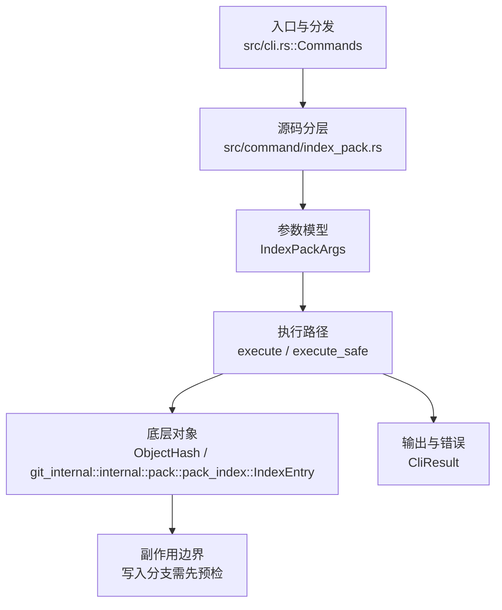

# `libra index-pack` 开发设计

## 命令实现目标

`libra index-pack` 的目标是为已有 pack 归档构建或校验 pack index，是对象传输与 pack 处理的隐藏 plumbing 能力。实现需要继承 SHA-256、pack index handling 和错误码治理，同时把 stdin、thin pack、keep 文件和进度输出列为未完成差异。

## 对比 Git 与兼容性

- 兼容级别：`supported`。hidden plumbing command

- 当前矩阵承诺常用 Git 行为已支持；新增语义必须同步矩阵、用户文档和测试。

## 设计方案

- 入口与分发：已公开接入 `src/cli.rs::Commands`；已由 `src/command/mod.rs` 导出。CLI 层在 `src/cli.rs` 把解析后的参数交给命令模块，命令模块负责把领域错误转换为 `CliError` / `CliResult`。
- 源码分层：主要实现文件为 `src/command/index_pack.rs`。参数/子命令类型包括：`IndexPackArgs`；输出、错误或状态类型包括：源码未暴露独立输出/错误类型，错误通过 `CliResult` 或上层命令错误统一传播；主要执行函数包括：`execute`、`execute_safe`。
- 源码意图：源码模块注释说明该命令读取 pack 数据、计算对象偏移和哈希，并写出对应 `.idx` 输出。
- 执行路径：`execute_safe` 负责 CLI 安全包装、错误映射和输出配置；核心实现读取 pack 文件、解析对象 metadata、计算 fanout/offset/checksum，并按 pack index v1/v2 规则写出 `.idx`。

- 流程图：以下流程图按当前源码分层展示主路径和底层对象边界，便于维护者把代码入口、执行函数和副作用范围对应起来。

- 底层操作对象：pack / idx 对象（传输包、索引、delta 和完整性校验）；`ObjectHash`（SHA-1/SHA-256 对象 ID 和 revision 解析结果）；`git_internal::internal::pack::pack_index::IndexEntry`（pack index 条目，记录对象哈希、CRC、offset 和大 offset 表关系）
- 输出与错误契约：人类输出、`--json` / `--machine` 输出和 quiet/verbose 分支必须继续走现有 `OutputConfig` / `emit_json_data` / `CliError` 路径；新增失败模式要补稳定错误码、用户提示和回归测试。
- 副作用边界：凡是写入索引、对象库、refs/HEAD、reflog、SQLite/D1、工作树或远端的路径，都必须先完成参数校验和 dry-run/预检分支，再执行持久化，避免部分写入后静默成功。

## 实现历史

- 本节依据本地 main 分支提交历史重写；`index-pack` 的早期节点多出现在 pack-index/SHA-256 和批量命令改进提交中，因此本节按实际触达 `src/command/index_pack.rs` 与 `tests/command/index_pack_test.rs` 的节点归纳。
- 2025-12-05 `1f99ce9b`（`Feat/sha256 libra (#74)`）：基础实现节点：该提交把 SHA-256 对象格式支持扩展到 pack/index 相关路径，是后续 `index-pack` plumbing 的底层来源之一。
- 2026-01-04 `2a1dd9ee`（`Add SHA-256 support for transport negotiation and pack index handling (#103)`）：功能演进：继续补齐 pack index handling 与传输协商，形成当前 pack 索引处理的兼容基础。
- 2026-04-06 `bd3aae8b`（`feat(commands): complete improvement batches 6-8 (#342)`）：功能演进：该批次直接触达 `src/command/index_pack.rs`、测试和命令文档，是当前命令实现/测试/说明同步落地的节点。
- 2026-05-24 `7b3b2d80`（`fix(help): inline descriptions for index-pack + ls-remote EXAMPLES (v0.17.919)`）：文档与帮助口径：补齐 `index-pack` 示例的内联描述，要求当前文档继续与 `--help` 可见面一致。
- 历史结论：当前文档应以这些提交之后的代码、测试和兼容矩阵为准；更早的迁移式文档只保留为背景，不再作为事实来源。

## 当前状态

- 公开状态：已公开；模块状态：已导出。
- 用户文档：`docs/commands/index-pack.md`。
- Synopsis：`libra index-pack [OPTIONS] <PACK_FILE>`。
- 公开参数/子命令包括：`Examples`。

## 还未实现的功能

| 类别 | 未完成项 | 当前处理 |
|---|---|---|
| 兼容差异项 | --stdin (read pack from stdin) | 原始对照：未实现；相关参数/替代：是；当前说明：不适用。 后续实现时需要补对应回归测试并同步兼容矩阵。 |
| 兼容差异项 | --fix-thin (add bases for thin packs) | 原始对照：未实现；相关参数/替代：是；当前说明：不适用。 后续实现时需要补对应回归测试并同步兼容矩阵。 |
| 兼容差异项 | --keep (create .keep file) | 原始对照：未实现；相关参数/替代：是；当前说明：不适用。 后续实现时需要补对应回归测试并同步兼容矩阵。 |
| 兼容差异项 | 进度输出 | 原始对照：未实现；相关参数/替代：--progress / --no-progress；当前说明：不适用。 后续实现时需要补对应回归测试并同步兼容矩阵。 |
| 兼容差异项 | 不支持 index version | 当前状态：LBR-CLI-002；Git/相关参数：129。 后续实现时需要补对应回归测试并同步兼容矩阵。 |

## 维护要求

- 改进本命令前，必须先阅读并遵循 [docs/development/commands/_general.md](_general.md)；这是命令设计、实现、测试和文档同步的强制要求。
- 任何行为变更都要先核对实现源码，再同步 `COMPATIBILITY.md`、`docs/commands/<cmd>.md` 和相关测试。
- 新增 Git 兼容参数时必须明确 tier、错误码、JSON/机器输出契约和回归测试。
