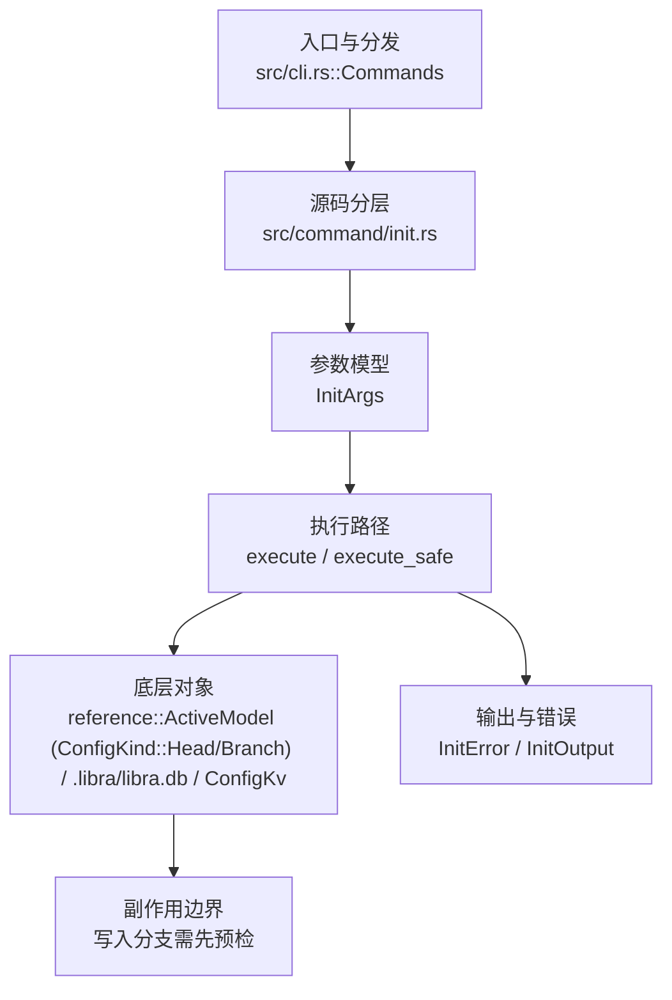

# `libra init` 开发设计

## 命令实现目标

`libra init` 的目标是在目录中初始化 Libra 仓库，创建数据库、对象目录、默认 refs、索引和必要配置。实现需要在已存在仓库上拒绝重复初始化（`is_reinit()` 检测后返回 `InitError::AlreadyInitialized`，尚不支持 Git 式安全重初始化）、shared 模式、从 Git 布局迁移的边界、JSON 输出和错误码，并明确子模块递归初始化不在当前范围。

## 对比 Git 与兼容性

- 兼容级别：`partial`。新仓库初始化已支持；对已有 Libra 仓库执行安全 re-init/top-up 尚未实现。

- 当前矩阵承诺常用 Git 行为已支持；新增语义必须同步矩阵、用户文档和测试。

## 设计方案

- 入口与分发：已公开接入 `src/cli.rs::Commands`；已由 `src/command/mod.rs` 导出。CLI 层在 `src/cli.rs` 把解析后的参数交给命令模块，命令模块负责把领域错误转换为 `CliError` / `CliResult`。
- 源码分层：主要实现文件为 `src/command/init.rs`。参数/子命令类型包括：`InitArgs`；输出、错误或状态类型包括：`InitError`、`InitOutput`；主要执行函数包括：`execute`、`execute_safe`。
- 执行路径：`execute_safe` 负责 CLI 安全包装、错误映射和输出配置；引用路径会读取或更新 SQLite refs、HEAD 与 reflog；数据库路径会通过 SeaORM/SQLite 或 D1 客户端持久化元数据；AI 路径会读写 session、checkpoint、thread graph 或 agent profile 状态。

- 流程图：以下流程图按当前源码分层展示主路径和底层对象边界，便于维护者把代码入口、执行函数和副作用范围对应起来。

- 底层操作对象：`reference::ActiveModel`（直接写入 `ConfigKind::Head` 与 `ConfigKind::Branch` 的 refs 行，无 `Branch` / `Head` 类型实例化）；SeaORM / `.libra/libra.db`（配置、refs、reflog、AI/发布元数据等 SQLite 表）；Vault/libvault（身份、密钥或 vault-backed 签名边界）；agent checkpoint（Agent 运行快照、回放和 transcript 截断输入）；`ConfigKv`（配置键值持久化行）
- 输出与错误契约：人类输出、`--json` / `--machine` 输出和 quiet/verbose 分支必须继续走现有 `OutputConfig` / `emit_json_data` / `CliError` 路径；新增失败模式要补稳定错误码、用户提示和回归测试。
- 副作用边界：凡是写入索引、对象库、refs/HEAD、reflog、SQLite/D1、工作树或远端的路径，都必须先完成参数校验和 dry-run/预检分支，再执行持久化，避免部分写入后静默成功。

## 实现历史

- 本节依据本地 main 分支提交历史重写，筛选与该命令实现、测试或文档路径直接相关的提交；以下是归纳后的实现脉络。
- 2026-01-19 `ae8c949a`（`add tests(init): handle unwritable parent dir, fix pre-commit hook generation, and clarify HEAD default behavior (#151)`）：基础实现节点：add tests(init): handle unwritable parent dir, fix pre-commit hook generation, and clarify HEAD default behavior (#151)；当前实现的主要轮廓可追溯到该提交。
- 2026-06-05 `d29da9bf`（`feat(init): support safe re-initialization of existing repositories`）：该提交曾尝试支持安全重新初始化（topup 布局、`InitOutput.reinitialized`、`handle_reinit()` 分支、`Reinitialized existing ...` 提示），但当前 HEAD 的 `src/command/init.rs` 中这些代码均已不存在（被回退/未最终落地）；现状仍是 `is_reinit()` 检测到已存在仓库即直接返回 `InitError::AlreadyInitialized`。详见下文“还未实现的功能”缺口表。
- 2026-06-05 `901b433b`（`feat(init): persist core.sharedRepository and isolate vault.db from --shared chmod`）：功能演进：persist core.sharedRepository and isolate vault.db from --shared chmod；该节点扩展了当前命令可用的参数或行为。
- 2026-06-07 `99c39206`（`fix(init): close compatibility plan gaps`）：实现修正：close compatibility plan gaps；该节点把边界行为、错误处理或兼容差异纳入当前实现约束。
- 历史结论：当前文档应以这些提交之后的代码、测试和兼容矩阵为准；更早的迁移式文档只保留为背景，不再作为事实来源。

## 当前状态

- 公开状态：已公开；模块状态：已导出。
- 用户文档：`docs/commands/init.md`。
- Synopsis：`libra init [OPTIONS] [DIRECTORY]`。
- 公开参数/子命令包括：`[DIRECTORY]`、`--bare`、`-b, --initial-branch <INITIAL_BRANCH>`、`--object-format <format>`、`--from-git-repository <path>`、`--vault <VAULT>`、`--template <template-directory>`、`--shared <MODE>`、`--ref-format <REF_FORMAT>`、`-q, --quiet`。

## 还未实现的功能

| 类别 | 未完成项 | 当前处理 |
|---|---|---|
| 兼容差异项 | Recurse submodules | 原始对照：git init + git submodule init；相关参数/替代：不适用；当前说明：不适用 (submodules not 支持)。 后续实现时需要补对应回归测试并同步兼容矩阵。 |
| 兼容差异项 | 安全重新初始化（在已存在仓库上再次 `init`） | 原始对照：`git init`（在已存在仓库上打印 `Reinitialized existing ...` 并补齐缺失布局）；相关参数/替代：无；当前说明：`run_init_internal` 中 `is_reinit()` 检测到 `.libra/`（或 bare 布局）即返回 `InitError::AlreadyInitialized`，提示移除已有 Libra 状态后重试，不做 topup 重初始化。提交 `d29da9bf` 的相关实现已不在当前 HEAD。后续实现时需要补对应回归测试并同步兼容矩阵。 |

## 维护要求

- 改进本命令前，必须先阅读并遵循 [docs/development/commands/_general.md](_general.md)；这是命令设计、实现、测试和文档同步的强制要求。
- 任何行为变更都要先核对实现源码，再同步 `COMPATIBILITY.md`、`docs/commands/<cmd>.md` 和相关测试。
- 新增 Git 兼容参数时必须明确 tier、错误码、JSON/机器输出契约和回归测试。
