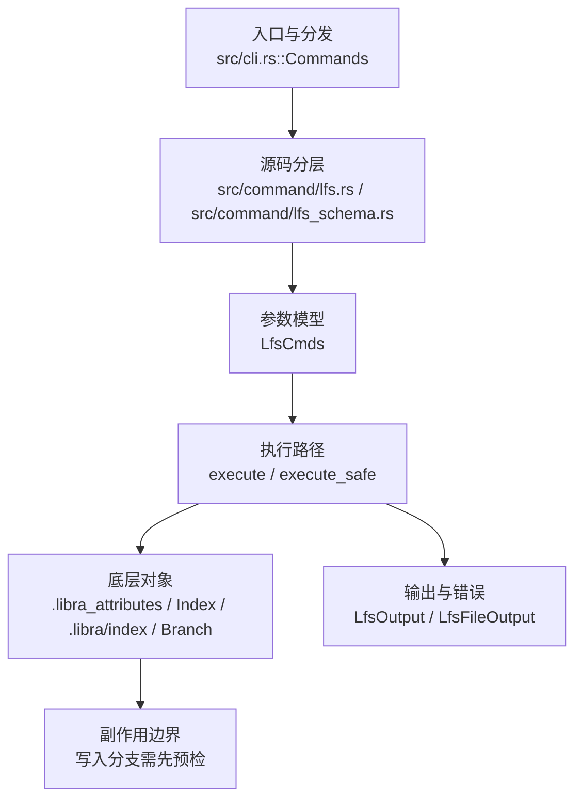

# `libra lfs` 开发设计

## 命令实现目标

`libra lfs` 的目标是提供 Libra 内置大文件管理能力，使用 `.libra_attributes` 记录跟踪规则并生成指针文件。实现需要覆盖 track/untrack/status/push/prune/checkout 等子命令，同时明确它不是 Git LFS filter/hook 桥接实现。

## 对比 Git 与兼容性

- 兼容级别：`partial`。built-in Libra LFS command; uses `.libra_attributes`, not Git LFS filters/hooks (see [docs/development/commands/_compatibility.md#d5-git-lfs-gitattributes-filter--hooks-bridge](docs/development/commands/_compatibility.md#d5-git-lfs-gitattributes-filter--hooks-bridge))

- 当前矩阵明确仍是部分兼容；未覆盖的 Git surface 必须显式列在“还未实现的功能”。

## 设计方案

- 入口与分发：已公开接入 `src/cli.rs::Commands`；已由 `src/command/mod.rs` 导出。CLI 层在 `src/cli.rs` 把解析后的参数交给命令模块，命令模块负责把领域错误转换为 `CliError` / `CliResult`。
- 源码分层：主要实现文件为 `src/command/lfs.rs`、`src/command/lfs_schema.rs`。参数/子命令类型包括：`LfsCmds`；输出、错误或状态类型包括：`LfsOutput`、`LfsFileOutput`；主要执行函数包括：`execute`、`execute_safe`。
- 源码意图：源码模块注释说明 LFS 子命令覆盖认证、batch 协商、锁管理，以及与常规工作流的大文件存储集成。
- 执行路径：`execute_safe` 负责 CLI 安全包装、错误映射和输出配置；索引路径会加载、比较、刷新或保存 `.libra/index`；引用路径会读取或更新 SQLite refs、HEAD 与 reflog；LFS 路径会按 `.libra_attributes` 生成 pointer、锁或 batch 请求。

- 流程图：以下流程图按当前源码分层展示主路径和底层对象边界，便于维护者把代码入口、执行函数和副作用范围对应起来。

- 底层操作对象：LFS pointer / lock / batch 对象（`.libra_attributes` 驱动的大文件路径）；`Index` / `.libra/index`（暂存区状态、路径条目和刷新/保存边界）；`Branch` / branch store（SQLite refs 上的分支读写、过滤和上游关系）；`Head`（SQLite 中的 HEAD 指向、当前分支和 detached 状态）
- 输出与错误契约：人类输出、`--json` / `--machine` 输出和 quiet/verbose 分支必须继续走现有 `OutputConfig` / `emit_json_data` / `CliError` 路径；新增失败模式要补稳定错误码、用户提示和回归测试。
- 副作用边界：凡是写入索引、对象库、refs/HEAD、reflog、SQLite/D1、工作树或远端的路径，都必须先完成参数校验和 dry-run/预检分支，再执行持久化，避免部分写入后静默成功。

## 实现历史

- 本节依据本地 main 分支提交历史重写，筛选与该命令实现、测试或文档路径直接相关的提交；以下是归纳后的实现脉络。
- 2026-05-23 `2c0157f6`（`feat(lfs): wire LFS_EXAMPLES into clap after_help (v0.17.821)`）：基础实现节点：wire LFS_EXAMPLES into clap after_help (v0.17.821)；当前实现的主要轮廓可追溯到该提交。
- 2026-06-05 `4edd8965`（`feat(lfs): prune empty shard dirs and align docs/compatibility for new subcommands`）：功能演进：prune empty shard dirs and align docs/compatibility for new subcommands；该节点扩展了当前命令可用的参数或行为。
- 2026-06-05 `edf7db40`（`feat(lfs): implement prune and checkout commands`）：功能演进：implement prune and checkout commands；该节点扩展了当前命令可用的参数或行为。
- 2026-06-07 `9968c61d`（`fix(lfs): close compatibility plan gaps`）：实现修正：close compatibility plan gaps；该节点把边界行为、错误处理或兼容差异纳入当前实现约束。
- 历史结论：当前文档应以这些提交之后的代码、测试和兼容矩阵为准；更早的迁移式文档只保留为背景，不再作为事实来源。

## 当前状态

- 公开状态：已公开；模块状态：已导出。
- 用户文档：`docs/commands/lfs.md`。
- Synopsis：`libra lfs track [<pattern>...]`。
- 公开参数/子命令包括：`track`、`untrack`、`locks`、`lock`、`unlock`、`ls-files`。

## 还未实现的功能

| 类别 | 未完成项 | 当前处理 |
|---|---|---|
| 兼容矩阵说明 | built-in Libra LFS command; uses `.libra_attributes`, not Git LFS filters/hooks (see [docs/development/commands/_compatibility.md#d5-git-lfs-gitattributes-filter--hooks-bridge](docs/development/commands/_compatibility.md#d5-git-lfs-gitattributes-filter--hooks-bridge)) | 按当前兼容矩阵保留；实现状态变化时同步 `_compatibility.md` 和测试证据。 |

## 维护要求

- 改进本命令前，必须先阅读并遵循 [docs/development/commands/_general.md](_general.md)；这是命令设计、实现、测试和文档同步的强制要求。
- 任何行为变更都要先核对实现源码，再同步 `COMPATIBILITY.md`、`docs/commands/<cmd>.md` 和相关测试。
- 新增 Git 兼容参数时必须明确 tier、错误码、JSON/机器输出契约和回归测试。
