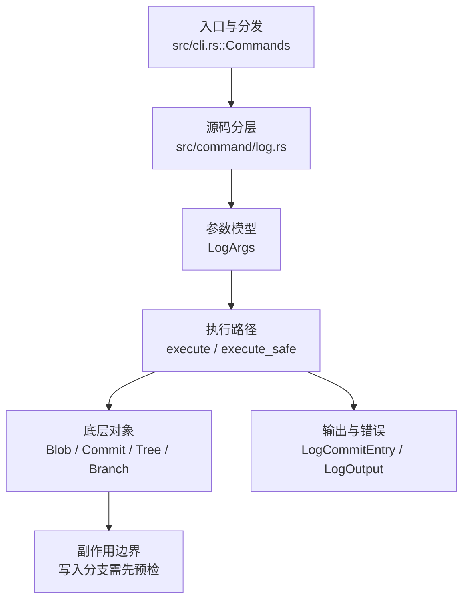

# `libra log` 开发设计

## 命令实现目标

`libra log` 的目标是展示提交历史，并支持数量、时间、作者、graph、format、颜色、revision range（通过 `--range`）、`--all`、`--reverse`、`--follow` 和 `-L` 等常用查看能力。实现需要在 Git 兼容历史查看和 Libra 结构化输出之间保持一致，并把尚未覆盖的复杂格式能力列为后续工作。

## 对比 Git 与兼容性

- 兼容级别：`supported`。

- 当前矩阵承诺常用 Git 行为已支持；`--range`（revision ranges）、`--all`、`--reverse`、`--follow`、`-L` 已补齐。新增语义必须同步矩阵、用户文档和测试。

## 设计方案

- 入口与分发：已公开接入 `src/cli.rs::Commands`；已由 `src/command/mod.rs` 导出。CLI 层在 `src/cli.rs` 把解析后的参数交给命令模块，命令模块负责把领域错误转换为 `CliError` / `CliResult`。
- 源码分层：主要实现文件为 `src/command/log.rs`。参数/子命令类型包括：`LogArgs`；输出、错误或状态类型包括：`LogCommitEntry`、`LogOutput`；主要执行函数包括：`execute`、`execute_safe`。
- 执行路径：`execute_safe` 负责 CLI 安全包装、错误映射和输出配置；对象路径会解析 revision 并读写 blob/tree/commit/tag 等对象；引用路径会读取或更新 SQLite refs、HEAD 与 reflog。

- 流程图：以下流程图按当前源码分层展示主路径和底层对象边界，便于维护者把代码入口、执行函数和副作用范围对应起来。

- 底层操作对象：`Blob`（文件内容或 LFS pointer 写入对象库后的 blob 对象）；`Commit`（提交对象、父提交关系和提交消息载荷）；`Tree`（由索引或对象遍历生成的目录树对象）；`Branch` / branch store（SQLite refs 上的分支读写、过滤和上游关系）；`Head`（SQLite 中的 HEAD 指向、当前分支和 detached 状态）；`ObjectHash`（SHA-1/SHA-256 对象 ID 和 revision 解析结果）；`ConfigKv`（配置键值持久化行）
- 输出与错误契约：人类输出、`--json` / `--machine` 输出和 quiet/verbose 分支必须继续走现有 `OutputConfig` / `emit_json_data` / `CliError` 路径；新增失败模式要补稳定错误码、用户提示和回归测试。
- 副作用边界：凡是写入索引、对象库、refs/HEAD、reflog、SQLite/D1、工作树或远端的路径，都必须先完成参数校验和 dry-run/预检分支，再执行持久化，避免部分写入后静默成功。

## 实现历史

- 本节依据本地 main 分支提交历史重写，筛选与该命令实现、测试或文档路径直接相关的提交；以下是归纳后的实现脉络。
- 2025-12-19 `d45bec8c`（`feat(log): add --abbrev-commit/--abbrev/--no-abbrev-commit for commit… (#93)`）：基础实现节点：add --abbrev-commit/--abbrev/--no-abbrev-commit for commit… (#93)；当前实现的主要轮廓可追溯到该提交。
- 2026-06-06 `f95b80df`（`feat(log): colorize graph columns and align compatibility matrix`）：功能演进：colorize graph columns and align compatibility matrix；该节点扩展了当前命令可用的参数或行为。
- 2026-06-06 `89045f35`（`feat(log): support revision ranges (A..B, A...B, ^A B)`）：该提交曾尝试支持 revision range，但相关改动未保留在当前 HEAD 的 `src/command/log.rs` 中（`LogArgs` 不含 revision/range 位置参数，仍以 HEAD 为起点遍历），因此 revision range 仍属未实现项，见“还未实现的功能”。
- 2026-06-07 `155a430a`（`fix(log): close compatibility plan gaps`）：实现修正：close compatibility plan gaps；该节点把边界行为、错误处理或兼容差异纳入当前实现约束。
- 历史结论：当前文档应以这些提交之后的代码、测试和兼容矩阵为准；更早的迁移式文档只保留为背景，不再作为事实来源。

## 当前状态

- 公开状态：已公开；模块状态：已导出。
- 用户文档：`docs/commands/log.md`。
- Synopsis：`libra log [OPTIONS] [PATHS]...`。
- 公开参数/子命令包括：`-n, --number <NUMBER>`、`--oneline`、`--abbrev-commit`、`--abbrev <N>`、`--no-abbrev-commit`、`-p, --patch`、`--name-only`、`--name-status`、`--author <PATTERN>`、`--since <DATE>`、`--until <DATE>`、`--pretty <FORMAT>`、`--decorate[=<MODE>]`、`--no-decorate`、`--graph`、`--stat`、`--grep <PATTERN>`、`--reverse`、`--all`、`--follow <FILE>`、`-L <RANGE:FILE>`、`--range <SPEC>`、位置参数 `[PATHS]...`（限定 diff 输出范围，无需 `--` 分隔符）等。

## 还未实现的功能

| 类别 | 未完成项 | 当前处理 |
|---|---|---|
| 兼容矩阵说明 | common Git log surface plus `--range` revision expressions, `--all`, `--reverse`, `--follow`, and `-L` supported | 按当前兼容矩阵保留；实现状态变化时同步 `_compatibility.md` 和测试证据。 |
| 功能缺口 | Git 原生位置性 revision range 语法（`A..B`、`A...B`、位置参数）未完全复刻；当前通过 `--range` 标志提供 | 后续实现时需要同步源码、测试和兼容矩阵。 |
| 功能缺口 | `--follow` 重命名跟踪基于 best-effort blob 匹配，不保证复杂重命名场景 | 后续实现时需要同步源码、测试和兼容矩阵。 |
| 功能缺口 | `-L` 行级历史跟踪为 best-effort，尚未实现精确 blame 级行归属 | 后续实现时需要同步源码、测试和兼容矩阵。 |

## 维护要求

- 改进本命令前，必须先阅读并遵循 [docs/development/commands/_general.md](_general.md)；这是命令设计、实现、测试和文档同步的强制要求。
- 任何行为变更都要先核对实现源码，再同步 `COMPATIBILITY.md`、`docs/commands/<cmd>.md` 和相关测试。
- 新增 Git 兼容参数时必须明确 tier、错误码、JSON/机器输出契约和回归测试。
