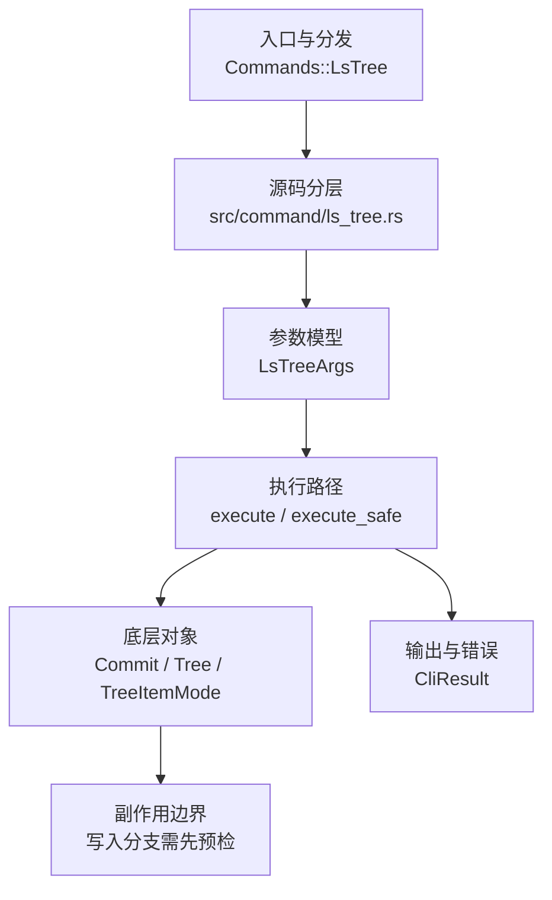

# `libra ls-tree` 开发设计

## 命令实现目标

`libra ls-tree` 的目标是检查指定 tree-ish 下的树对象内容，提供 Git tree inspection 的 plumbing 兼容入口。当前已公开基础 CLI surface，用于列出 commit/tree 下的条目、递归遍历、路径前缀过滤、子目录路径语义、常见输出模式和 JSON envelope。

## 对比 Git 与兼容性

- 兼容级别：`partial`。基础 tree inspection、子目录相对输出、`--full-name`、`--full-tree`、`REV:path` tree-ish 语法和 `--format`（支持 `%(objectmode)`/`%(objecttype)`/`%(objectname)`/`%(objectsize)`/`%(path)` 原子与 `%x09`/`%x0a` 转义）已公开；完整 Git pathspec magic 仍未公开。

## 设计方案

- 入口与分发：`src/cli.rs::Commands::LsTree` 公开顶层 CLI，`src/command/mod.rs` 导出 `ls_tree` 模块；CLI 层在 `src/cli.rs` 把解析后的参数交给 `command::ls_tree::execute_safe`，命令模块负责把领域错误转换为 `CliError` / `CliResult`。
- 源码分层：主要实现文件为 `src/command/ls_tree.rs`。参数/子命令类型包括：`LsTreeArgs`；输出、错误或状态类型包括：源码未暴露独立输出/错误类型，错误通过 `CliResult` 或上层命令错误统一传播；主要执行函数包括：`execute`、`execute_safe`。
- 执行路径：`execute_safe` 负责 CLI 安全包装、错误映射和输出配置；对象路径会解析 revision 并读写 blob/tree/commit/tag 等对象。

- 流程图：以下流程图按当前源码分层展示主路径和底层对象边界，便于维护者把代码入口、执行函数和副作用范围对应起来。

- 底层操作对象：`Commit`（提交对象、父提交关系和提交消息载荷）；`TreeItemMode`（tree 中路径项的 mode；路径项本身通过 `Tree::tree_items` 字段遍历，无独立 `TreeItem` 类型）；`Tree`（由索引或对象遍历生成的目录树对象）；`ClientStorage`（本地/分层对象存储读写入口；blob 大小通过 `ClientStorage::get()` 读取字节长度，而非独立 `Blob` 对象）；`ObjectHash`（SHA-1/SHA-256 对象 ID 和 revision 解析结果）；`ObjectType`（blob/tree/commit/tag 类型分派）
- 输出与错误契约：人类输出、`--json` / `--machine` 输出和 quiet/verbose 分支必须继续走现有 `OutputConfig` / `emit_json_data` / `CliError` 路径；新增失败模式要补稳定错误码、用户提示和回归测试。
- 副作用边界：凡是写入索引、对象库、refs/HEAD、reflog、SQLite/D1、工作树或远端的路径，都必须先完成参数校验和 dry-run/预检分支，再执行持久化，避免部分写入后静默成功。

## 实现历史

- 本节依据本地 main 分支提交历史重写，筛选与该命令实现、测试或文档路径直接相关的提交；以下是归纳后的实现脉络。
- 2026-06-10 `8ca435a7`（`feat(ls-tree): implement tree inspection command (#398)`）：基础实现节点：implement tree inspection command (#398)；当前实现的主要轮廓可追溯到该提交。
- 历史结论：`src/command/ls_tree.rs` 已通过 `src/cli.rs::Commands::LsTree` 公开；早期“未公开 CLI”的记录已经过期，当前状态以源码和本页“当前状态”为准。

## 当前状态

- 公开状态：已公开；模块状态：`src/command/mod.rs` 导出 `ls_tree`，`src/cli.rs::Commands::LsTree` 负责 CLI 接入。
- 用户文档：`docs/commands/ls-tree.md`。
- Synopsis：`libra ls-tree [OPTIONS] <TREE-ISH> [PATH...]`。
- 公开参数/子命令以用户文档和 CLI help 为准；当前未抽取到独立 Options/Subcommands 小节。
- 参数证据：`-r` / `--recursive` 已公开并由 `command_test::command::ls_tree_test::ls_tree_recursive_lists_nested_entries_without_parent_trees` 与 `ls_tree_directory_filter_recurses_when_requested` 覆盖；集成场景 `cli.ls-tree-smoke` 也执行 `libra ls-tree -r HEAD src`。
- 参数证据：`-t`（递归时展示 tree 条目）已公开并由 `ls_tree_recursive_t_includes_tree_entries` 覆盖。
- 参数证据：`-l` / `--long`（展示 blob 大小）已公开并由 `ls_tree_long_includes_blob_size_and_tree_dash` 覆盖。
- 参数证据：`--name-only`（只输出路径）已公开并由 `ls_tree_name_only_prints_paths` 覆盖；集成场景 `cli.ls-tree-smoke` 也执行 `libra ls-tree --name-only HEAD`。
- 参数证据：`--object-only`（只输出对象 ID）已公开并由 `ls_tree_object_only_honors_abbrev_width` 覆盖。
- 参数证据：子目录默认路径语义已由 `ls_tree_from_subdirectory_defaults_to_current_directory` 覆盖；集成场景 `cli.ls-tree-smoke` 也从 `src/` 执行 `libra ls-tree HEAD`。
- 参数证据：`--full-name` 已公开并由 `ls_tree_full_name_from_subdirectory_keeps_repository_paths` 与 `ls_tree_subdirectory_path_filter_is_current_directory_relative` 覆盖；集成场景 `cli.ls-tree-smoke` 也从 `src/` 执行 `libra ls-tree --full-name HEAD`。
- 参数证据：`--full-tree` 已公开并由 `ls_tree_full_tree_from_subdirectory_lists_repository_root` 覆盖；集成场景 `cli.ls-tree-smoke` 也从 `src/` 执行 `libra ls-tree --full-tree HEAD`。

## 还未实现的功能

| 类别 | 未完成项 | 当前处理 |
|---|---|---|
| ✅ 已实现 | 自定义格式 `--format=<FORMAT>` | 支持 `%(objectmode)`/`%(objecttype)`/`%(objectname)`/`%(objectsize)`/`%(path)` 原子与 `%x09`/`%x0a` 转义；未知原子按字面保留（宽松）。与 `--name-only`/`--name-status`/`--object-only`/`-l` 互斥。带单元测试。 |
| ✅ 已实现 | REV:path syntax | `REV:path` 解析 REV 的根树后导航到 `path` 处的子树（`resolve_treeish_to_tree` 在首个 `:` 处切分，复用 `find_tree_entry` 逐组件下行；空 path（`REV:`）列出根树）。目标必须是树，blob path 报 `not a tree object`（`LBR-CLI-003`/CliInvalidTarget），缺失 path 报 path-not-found。带集成测试（`test_ls_tree_rev_path_navigates_into_subtree`、`ls_tree_rev_path_blob_target_errors_as_not_a_tree`）。 |

## 维护要求

- 改进本命令前，必须先阅读并遵循 [docs/development/commands/_general.md](_general.md)；这是命令设计、实现、测试和文档同步的强制要求。
- 任何行为变更都要先核对实现源码，再同步 `COMPATIBILITY.md`、`docs/commands/<cmd>.md` 和相关测试。
- 新增 Git 兼容参数时必须明确 tier、错误码、JSON/机器输出契约和回归测试。
- 若决定发布该命令，最小闭环是：CLI 变体、`src/command/mod.rs` 导出、dispatch、用户文档、兼容矩阵和测试。
