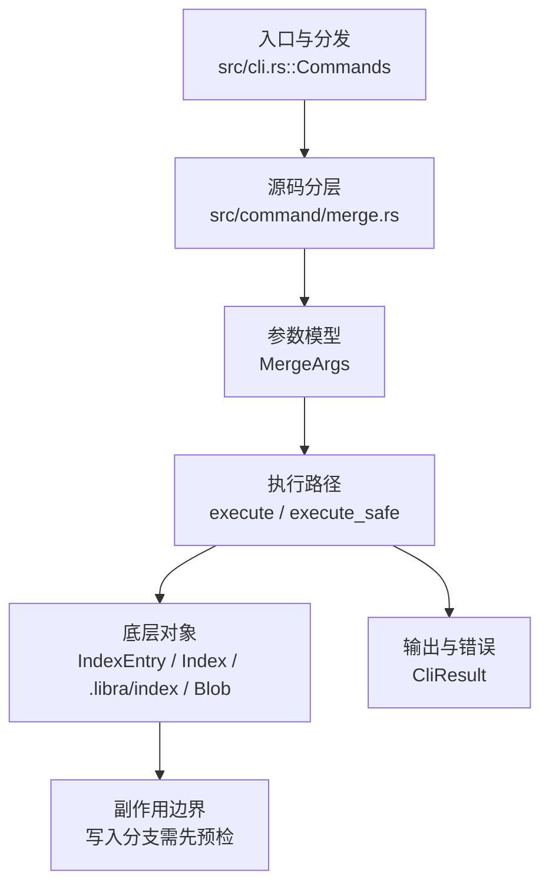

# `libra merge` 开发设计

## 命令实现目标

`libra merge` 的目标是把其他提交或分支合入当前 HEAD，覆盖 fast-forward 和单头 three-way merge。实现需要处理冲突生命周期、autostash、rename detection、签名/策略兼容参数和 JSON 输出；`-m`/`--ff-only`/`--no-ff`/`--squash`/`--no-commit`/`--no-edit`/`-n`(`--no-stat`) 已支持，同时把 octopus、自定义策略、签名验证和 `--stat`（合并后 diffstat）作为未完成差异。

## 对比 Git 与兼容性

- 兼容级别：`partial`。fast-forward 与单头三方合并已支持；`-m <msg>`、`--ff-only`、`--no-ff`、`--squash`、`--no-commit`、`--no-edit`（接受为 no-op；Libra 从不为 merge 打开编辑器）、`-n`/`--no-stat`（接受为 no-op；Libra 的 merge 从不打印 diffstat）已支持；octopus/自定义策略、`--verify-signatures` 与 `--stat`（Git 默认的合并后 diffstat）仍未实现。

- 当前矩阵明确仍是部分兼容；未覆盖的 Git surface 必须显式列在“还未实现的功能”。

## 设计方案

- 入口与分发：已公开接入 `src/cli.rs::Commands`；已由 `src/command/mod.rs` 导出。CLI 层在 `src/cli.rs` 把解析后的参数交给命令模块，命令模块负责把领域错误转换为 `CliError` / `CliResult`。
- 源码分层：主要实现文件为 `src/command/merge.rs`。参数/子命令类型包括：`MergeArgs`；输出、错误或状态类型包括：`PullMergeSummary`（别名 `MergeOutput`）、`PullMergeError`（别名 `MergeError`）、`MergeState`；主要执行函数包括：`execute`、`execute_safe`。
- 执行路径：`execute_safe` 负责 CLI 安全包装、错误映射和输出配置；索引路径会加载、比较、刷新或保存 `.libra/index`；对象路径会解析 revision 并读写 blob/tree/commit/tag 等对象；引用路径会读取或更新 SQLite refs、HEAD 与 reflog；数据库路径会通过 SeaORM/SQLite 或 D1 客户端持久化元数据。

- 流程图：以下流程图按当前源码分层展示主路径和底层对象边界，便于维护者把代码入口、执行函数和副作用范围对应起来。

- 底层操作对象：`IndexEntry`（索引条目，承载路径、mode、object id 和 stat 元数据）；`Index` / `.libra/index`（暂存区状态、路径条目和刷新/保存边界）；`Blob`（文件内容或 LFS pointer 写入对象库后的 blob 对象）；`Commit`（提交对象、父提交关系和提交消息载荷）；`TreeItem` / `TreeItemMode`（tree 中的路径项和 mode）；`Tree`（由索引或对象遍历生成的目录树对象）；`Branch` / branch store（SQLite refs 上的分支读写、过滤和上游关系）；`Head`（SQLite 中的 HEAD 指向、当前分支和 detached 状态）；`ReflogContext` / `with_reflog`（SQLite reflog 写入和动作记录）；`DatabaseTransaction`（需要原子性的数据库写入事务）；SeaORM / `.libra/libra.db`（配置、refs、reflog、AI/发布元数据等 SQLite 表）；`ObjectHash`（SHA-1/SHA-256 对象 ID 和 revision 解析结果）
- 输出与错误契约：人类输出、`--json` / `--machine` 输出和 quiet/verbose 分支必须继续走现有 `OutputConfig` / `emit_json_data` / `CliError` 路径；新增失败模式要补稳定错误码、用户提示和回归测试。
- 副作用边界：凡是写入索引、对象库、refs/HEAD、reflog、SQLite/D1、工作树或远端的路径，都必须先完成参数校验和 dry-run/预检分支，再执行持久化，避免部分写入后静默成功。

## 实现历史

- 本节依据本地 main 分支提交历史重写，筛选与该命令实现、测试或文档路径直接相关的提交；以下是归纳后的实现脉络。
- 2026-05-23 `9b01fe78`（`feat(merge): wire MERGE_EXAMPLES into clap after_help (v0.17.814)`）：基础实现节点：wire MERGE_EXAMPLES into clap after_help (v0.17.814)；当前实现的主要轮廓可追溯到该提交。
- 2026-06-06 `0c7604f9`（`feat(pull): forward merge flags + depth, gate unsupported rebase strategies (#1388)`）：功能演进：forward merge flags + depth, gate unsupported rebase strategies (#1388)；该节点扩展了当前命令可用的参数或行为。
- 2026-06-03 `f4994c4f`（`feat: improve merge handling and embedded libra skill`）：功能演进：improve merge handling and embedded libra skill；该节点扩展了当前命令可用的参数或行为。
- 2026-06-07 `564cff05`（`fix(merge): close compatibility plan gaps`）：实现修正：close compatibility plan gaps；该节点把边界行为、错误处理或兼容差异纳入当前实现约束。
- 历史结论：当前文档应以这些提交之后的代码、测试和兼容矩阵为准；更早的迁移式文档只保留为背景，不再作为事实来源。

## 当前状态

- 公开状态：已公开；模块状态：已导出。
- 用户文档：`docs/commands/merge.md`。
- Synopsis：`libra merge [--ff-only | --no-ff | --squash | --no-commit] [-m <msg>] [--no-edit] [-n | --no-stat] <branch>` / `libra merge --continue` / `libra merge --abort`。
- 公开参数/子命令包括：`<branch>`、`--continue`、`--abort`、`--ff-only`、`--no-ff`、`-m, --message <MSG>`、`--squash`、`--no-commit`、`--no-edit`（接受为 no-op，Libra 从不为 merge 打开编辑器，行为等同默认；不提供 `--edit`）、`-n`/`--no-stat`（接受为 no-op：Libra 的 merge 从不打印 diffstat；`no_stat` 字段解析后不被读取。Git 默认通过 `--stat` 打印 diffstat，Libra 未实现 `--stat`）、`--no-progress`（接受为 no-op：Libra 的 merge 从不渲染进度条；`no_progress` 字段解析后不被读取）。
- `--ff-only`：仅当当前分支可 fast-forward 到目标时才合并，否则失败（非快进退出错误）。`--no-ff`：即使可以 fast-forward 也强制生成两亲合并提交。`-m, --message <MSG>`：覆盖合并提交消息（默认 `Merge <upstream> into <head>`）。`--squash`：执行合并并把结果写入 index/worktree，但**不创建提交、不移动 HEAD、不记录 merge 信息**（永不 fast-forward），随后用普通 `commit` 收尾生成单亲提交。`--no-commit`：执行合并并暂存结果但**停在提交之前**（永不 fast-forward），写入 `MergeState`（无冲突路径），随后用 `libra merge --continue` 收尾两亲提交。**刻意差异**：与 Git 不同，`--no-commit` 后用普通 `commit` 只会记录单亲，必须用 `merge --continue` 收尾。`--squash` 与 `--no-commit` 互斥，且都与 `--ff-only`/`--continue`/`--abort` 互斥。这些 flag 底层复用 pull 已有的 `PullMergeOptions` 引擎路径（`message`/`squash`/`no_commit` 在 `perform_three_way_merge` 计算出 merged tree 后提前返回；`--no-commit` 复用 `merge --continue` 的 MergeState 机制）。

## 还未实现的功能

| 类别 | 未完成项 | 当前处理 |
|---|---|---|
| 兼容矩阵说明 | fast-forward 与单头三方合并、`-m`/`--ff-only`/`--no-ff`/`--squash`/`--no-commit`/`--no-edit`/`-n`(`--no-stat`) 已支持；octopus/自定义策略/`--verify-signatures`/`--stat` 延后 | 按当前兼容矩阵保留；实现状态变化时同步 `_compatibility.md` 和测试证据。 |
| ✅ 已实现 | Squash `--squash` | 执行合并并写入 index/worktree，但不创建提交、不移动 HEAD（永不 ff），随后用普通 `commit` 收尾。复用 pull 引擎路径。 |
| ✅ 已实现 | 提交消息 `-m <msg>` | 覆盖默认 `Merge <branch> into <head>` 消息。 |
| ✅ 已实现 | `--no-edit` | 接受为 no-op：Libra 从不为 merge 打开编辑器（带集成测试 `test_merge_no_edit_accepts_default_message`）。 |
| ✅ 已实现 | `-n` / `--no-stat` | 接受为 no-op：Libra 的 merge 从不打印 diffstat（带集成测试 `test_merge_no_stat_short_n_and_long_are_accepted`）。Git 默认的 `--stat` 仍未实现。 |
| ✅ 已实现 | `--no-progress` | 接受为 no-op：Libra 的 merge 从不渲染进度条（带集成测试 `test_merge_no_progress_is_accepted_noop`）。 |
| 兼容差异项 | Octopus merge | 原始对照：不支持；相关参数/替代：不支持；当前说明：不适用。 后续实现时需要补对应回归测试并同步兼容矩阵。 |
| 兼容差异项 | 自定义策略 | 原始对照：不支持；相关参数/替代：--strategy, -X；当前说明：不适用。 后续实现时需要补对应回归测试并同步兼容矩阵。 |
| 兼容差异项 | 验证签名 | 原始对照：不支持；相关参数/替代：--verify-signatures；当前说明：不适用。 后续实现时需要补对应回归测试并同步兼容矩阵。 |

## 维护要求

- 改进本命令前，必须先阅读并遵循 [docs/development/commands/_general.md](_general.md)；这是命令设计、实现、测试和文档同步的强制要求。
- 任何行为变更都要先核对实现源码，再同步 `COMPATIBILITY.md`、`docs/commands/<cmd>.md` 和相关测试。
- 新增 Git 兼容参数时必须明确 tier、错误码、JSON/机器输出契约和回归测试。
