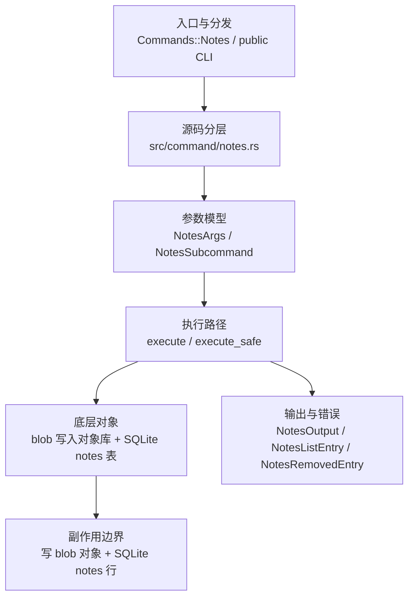

# `libra notes` 开发设计

## 命令实现目标

`libra notes` 的目标是管理提交 notes，包括 add、append、copy、edit、show、list、remove、merge 等操作。当前已实现并公开接入顶层 CLI；`notes merge` 是对扁平 note 行的 2-way 合并（Libra notes 是 SQLite 行、非 commit-backed tree，故无 3-way base），支持 `--strategy=manual|ours|theirs|union|cat_sort_uniq`；后续按需补齐 prune、get-ref 和交互式编辑器支持。

## 对比 Git 与兼容性

- 兼容级别：`partial`。基础 add/append/copy/edit/show/list/remove 与 `merge`（2-way 扁平行合并，`--strategy=manual|ours|theirs|union|cat_sort_uniq`，manual 在冲突时中止、无 NOTES_MERGE worktree）已公开；prune、get-ref 和交互式编辑器未实现。

## 设计方案

- 入口与分发：`src/cli.rs::Commands::Notes` 公开顶层 CLI，`src/command/mod.rs` 与 `src/internal/mod.rs` 均导出 `notes` 模块；CLI 层在 `src/cli.rs` 把解析后的参数交给 `command::notes::execute_safe`，命令模块负责把领域错误转换为 `CliError` / `CliResult`。
- 源码分层：主要实现文件为 `src/command/notes.rs`。参数/子命令类型包括：`NotesArgs`、`NotesSubcommand`；输出、错误或状态类型包括：`NotesOutput`、`NotesListEntry`、`NotesRemovedEntry`；主要执行函数包括：`execute`、`execute_safe`。
- 执行路径：`execute_safe` 负责 CLI 安全包装、错误映射和输出配置。

- 流程图：以下流程图按当前源码分层展示主路径和底层对象边界，便于维护者把代码入口、执行函数和副作用范围对应起来。

- 底层操作对象：`src/internal/notes.rs` 的 `add()` 把消息内容写成 blob 并经对象库 `put` 持久化，同时向 SQLite `notes` 表写入 (`notes_ref`、`object`、`blob`) 映射行；因此实现直接触达 Git 对象库与 SQLite 存储（但不写 refs/索引）。
- 输出与错误契约：人类输出、`--json` / `--machine` 输出和 quiet/verbose 分支必须继续走现有 `OutputConfig` / `emit_json_data` / `CliError` 路径；新增失败模式要补稳定错误码、用户提示和回归测试。
- 副作用边界：当前实现的 `add()` 写入 blob 对象与 SQLite `notes` 行（show/list/remove 含读取与删除行）；后续扩展持久化能力时，需要补齐回滚语义和测试证据。

## 实现历史

- 本节依据本地 main 分支提交历史重写，筛选与该命令实现、测试或文档路径直接相关的提交；以下是归纳后的实现脉络。
- 2026-06-10 `5076e26c`（`feat(notes):implement notes command (#380)`）：基础实现节点：implement notes command (#380)；当前实现的主要轮廓可追溯到该提交。
- 历史结论：`src/command/notes.rs` 与 `src/internal/notes.rs` 已实现，当前 `src/cli.rs::Commands` 已公开 `notes` 入口。

## 当前状态

- 公开状态：已公开；模块状态：`src/command/mod.rs` 导出 `notes`，`src/internal/mod.rs` 导出 `notes`，`src/cli.rs::Commands::Notes` 负责 CLI 接入。
- 用户文档：`docs/commands/notes.md`。
- Synopsis：`libra notes [--ref <ref>] add [-m <message>]... [-F <file>]... [-f] [<object>]`（`-m`/`-F` 可重复并按命令行顺序任意混用）；`libra notes [--ref <ref>] merge [-s|--strategy <manual|ours|theirs|union|cat_sort_uniq>] <other-ref>`。
- 公开参数/子命令包括：`Subcommands`（含 `merge`）、`Flag examples`。`merge` 把 `<other-ref>` 的 note 行合并进当前 `--ref`（默认 refs/notes/commits）：仅在 `<other>` 的对象→复制、相同→跳过、不同→按 `--strategy` 解决（`manual` 默认，冲突即中止且不改任何行；`ours`/`theirs`/`union`/`cat_sort_uniq` 自动解决；未知 strategy→`LBR-CLI-002`/129）。

## 还未实现的功能

| 类别 | 未完成项 | 当前处理 |
|---|---|---|
| 兼容矩阵 | `COMPATIBILITY.md` 已登记该命令。 | 已纳入用户可见兼容矩阵和矩阵守卫。 |
| ✅ 已实现 | Append | `notes append` 在现有 note 后追加（空行分隔；无 note 时新建，复用 `notes::show` 读取 + `notes::add(force)` 写入）。带集成测试（`notes_append_concatenates_to_existing_note`、`notes_append_creates_note_when_absent`）。 |
| ✅ 已实现 | Copy | `notes copy [-f] <from> <to>` 复用 `notes::show(from)`（源无 note 报错）+ `notes::add(to, text, force)`（目标已有 note 且无 `-f` 报错）。带集成测试（`notes_copy_duplicates_note_to_another_object`、`notes_copy_fails_when_source_has_no_note`）。 |
| ✅ 已实现 | Edit | `notes edit` 无条件设置（替换）note，不存在则新建（区别于 `add` 已存在即失败）；复用 `notes::add(force=true)`。交互式编辑器未支持，故需 `-m`/`-F`。带集成测试（`notes_edit_sets_and_replaces_note`）。 |
| ✅ 已实现 | Merge | `notes merge <other-ref>`：2-way 扁平行合并（无 3-way base，Libra notes 是 SQLite 行）。`--strategy=manual`（默认，冲突中止、all-or-nothing、无 NOTES_MERGE worktree）/`ours`/`theirs`/`union`/`cat_sort_uniq`。带集成测试（`test_notes_merge_strategies_copy_and_manual_conflict`：manual-abort/theirs/copy/union/未知 strategy）。 |
| 兼容差异项 | Prune | 原始对照：支持；相关参数/替代：不支持；当前说明：未实现（destructive，依赖存储层严格性，见 dev-loop 备忘的 notes-prune 非收敛记录）。 |
| 兼容差异项 | Editor support | 原始对照：Interactive editor (default)；相关参数/替代：不支持 (-m / -F required)；当前说明：未实现。

## 维护要求

- 改进本命令前，必须先阅读并遵循 [docs/development/commands/_general.md](_general.md)；这是命令设计、实现、测试和文档同步的强制要求。
- 任何行为变更都要先核对实现源码，再同步 `COMPATIBILITY.md`、`docs/commands/<cmd>.md` 和相关测试。
- 新增 Git 兼容参数时必须明确 tier、错误码、JSON/机器输出契约和回归测试。
- `libra notes` 已公开接入顶层 CLI；新增子命令/参数的最小闭环是：CLI 变体、`src/command/mod.rs` 导出、dispatch、用户文档、兼容矩阵和测试一起更新。
