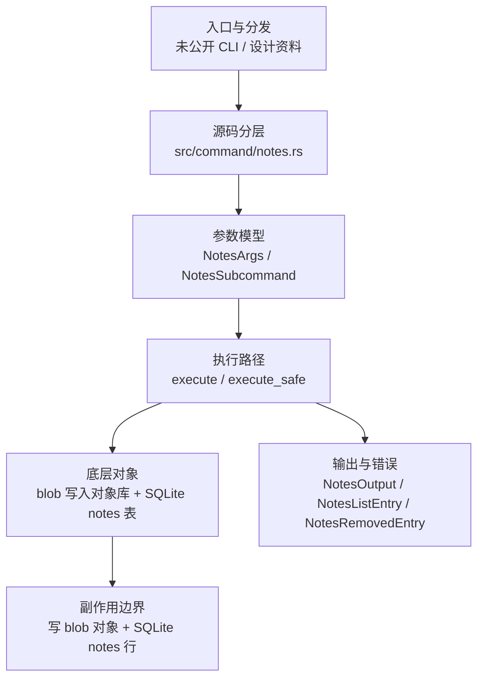

# `libra notes` 开发设计

## 命令实现目标

`libra notes` 的目标是管理提交 notes，包括 add、show、list、remove 等基础操作。当前实现资料存在但顶层 CLI 尚未公开接入，后续需要决定是否公开完整 notes 工作流，以及是否补齐 append/edit/copy/merge/prune 和编辑器支持。

## 对比 Git 与兼容性

- 兼容级别：`unpublished`。未进入 COMPATIBILITY.md；以代码接入状态为准。

- 该资料未对应公开 CLI 命令；用户可见状态按未发布处理。

## 设计方案

- 入口与分发：源码资料存在但尚未公开接入 `src/cli.rs::Commands`；`src/command/notes.rs` 与 `src/internal/notes.rs` 文件虽在磁盘上存在，但 `src/command/mod.rs` 与 `src/internal/mod.rs` 均无 `mod notes` 声明，故两者均未编译进二进制。CLI 层在 `src/cli.rs` 把解析后的参数交给命令模块，命令模块负责把领域错误转换为 `CliError` / `CliResult`。
- 源码分层：主要实现文件为 `src/command/notes.rs`。参数/子命令类型包括：`NotesArgs`、`NotesSubcommand`；输出、错误或状态类型包括：`NotesOutput`、`NotesListEntry`、`NotesRemovedEntry`；主要执行函数包括：`execute`、`execute_safe`。
- 执行路径：`execute_safe` 负责 CLI 安全包装、错误映射和输出配置。

- 流程图：以下流程图按当前源码分层展示主路径和底层对象边界，便于维护者把代码入口、执行函数和副作用范围对应起来。

- 底层操作对象：`src/internal/notes.rs` 的 `add()` 把消息内容写成 blob 并经对象库 `put` 持久化，同时向 SQLite `notes` 表写入 (`notes_ref`、`object`、`blob`) 映射行；因此实现直接触达 Git 对象库与 SQLite 存储（但不写 refs/索引）。
- 输出与错误契约：人类输出、`--json` / `--machine` 输出和 quiet/verbose 分支必须继续走现有 `OutputConfig` / `emit_json_data` / `CliError` 路径；新增失败模式要补稳定错误码、用户提示和回归测试。
- 副作用边界：当前实现的 `add()` 写入 blob 对象与 SQLite `notes` 行（show/list/remove 含读取与删除行）；后续扩展持久化能力时，需要补齐回滚语义和测试证据。

## 实现历史

- 本节依据本地 main 分支提交历史重写，筛选与该命令实现、测试或文档路径直接相关的提交；以下是归纳后的实现脉络。
- 2026-06-10 `5076e26c`（`feat(notes):implement notes command (#380)`）：基础实现节点：implement notes command (#380)；当前实现的主要轮廓可追溯到该提交。
- 历史结论：`src/command/notes.rs` 或配套测试/文档已有历史节点，但当前 `src/cli.rs::Commands` 未公开 `notes` 入口；实现历史不改变当前状态章节中的未接入结论。

## 当前状态

- 公开状态：未公开；模块状态：源码文件 `src/command/notes.rs` 与 `src/internal/notes.rs` 存在，但无 `mod notes` 声明，未编译进二进制。
- 用户文档：`docs/commands/notes.md`，当前仅作为 unpublished historical design 页面保留，不声明可执行 CLI 合约。
- Synopsis：`libra notes [--ref <ref>] add [-m <message>]... [-F <file>]... [-f] [<object>]`（`-m`/`-F` 可重复并按命令行顺序任意混用）。
- 公开参数/子命令包括：`Subcommands`、`Flag examples`。

## 还未实现的功能

| 类别 | 未完成项 | 当前处理 |
|---|---|---|
| 兼容矩阵 | `COMPATIBILITY.md` 尚未登记该命令行。 | 需要决定是否纳入用户可见兼容矩阵和矩阵守卫。 |
| CLI 接入 | `src/cli.rs::Commands` 尚未公开该顶层命令。 | 需要决定接入 CLI、降级为内部设计资料，或移出用户命令文档。 |
| 兼容差异项 | Append / Edit / Copy / Merge / Prune | 原始对照：支持；相关参数/替代：不支持；当前说明：不适用。 后续实现时需要补对应回归测试并同步兼容矩阵。 |
| 兼容差异项 | Editor support | 原始对照：Interactive editor (default)；相关参数/替代：不支持 (-m / -F required)；当前说明：不适用。 后续实现时需要补对应回归测试并同步兼容矩阵。 |

## 维护要求

- 改进本命令前，必须先阅读并遵循 [docs/development/commands/_general.md](_general.md)；这是命令设计、实现、测试和文档同步的强制要求。
- 任何行为变更都要先核对实现源码，再同步 `COMPATIBILITY.md`、`docs/commands/<cmd>.md` 和相关测试。
- 新增 Git 兼容参数时必须明确 tier、错误码、JSON/机器输出契约和回归测试。
- 若决定发布该命令，最小闭环是：CLI 变体、`src/command/mod.rs` 导出、dispatch、用户文档、兼容矩阵和测试。
