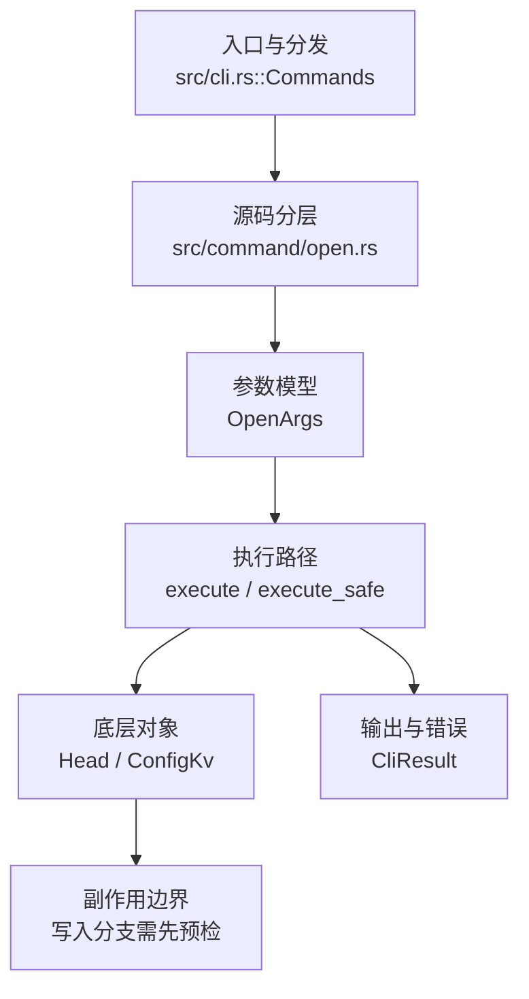

# `libra open` 开发设计

## 命令实现目标

`libra open` 的目标是把仓库远程的 HTTPS/SSH/SCP-like URL 转换为可浏览的网页地址，并在浏览器中打开或（`--json`/`--machine`）以结构化输出返回。实现需要安全校验（仅 http/https）和稳定错误码，确保在没有浏览器或远程信息不足时仍能给出可诊断输出。

## 对比 Git 与兼容性

- 兼容级别：`supported`。

- 当前矩阵承诺常用 Git 行为已支持；新增语义必须同步矩阵、用户文档和测试。

## 设计方案

- 入口与分发：已公开接入 `src/cli.rs::Commands`；已由 `src/command/mod.rs` 导出。CLI 层在 `src/cli.rs` 把解析后的参数交给命令模块，命令模块负责把领域错误转换为 `CliError` / `CliResult`。
- 源码分层：主要实现文件为 `src/command/open.rs`。参数/子命令类型包括：`OpenArgs`；输出、错误或状态类型包括：`OpenOutput`（`--json` 序列化）、`OpenResolution`、`OpenError`（领域错误，经 `open_cli_error` 映射为 `CliError`）；主要执行函数包括：`execute`、`execute_safe`、`resolve_open_target`、`transform_url`、`is_safe_url`、`open_browser`。
- 执行路径：`execute_safe` 负责 CLI 安全包装、错误映射和输出配置；引用路径会读取或更新 SQLite refs、HEAD 与 reflog。

- 流程图：以下流程图按当前源码分层展示主路径和底层对象边界，便于维护者把代码入口、执行函数和副作用范围对应起来。

- 底层操作对象：`Head`（SQLite 中的 HEAD 指向、当前分支和 detached 状态）；`ConfigKv`（配置键值持久化行）
- 输出与错误契约：人类输出、`--json` / `--machine` 输出和 quiet/verbose 分支必须继续走现有 `OutputConfig` / `emit_json_data` / `CliError` 路径；新增失败模式要补稳定错误码、用户提示和回归测试。
- 副作用边界：凡是写入索引、对象库、refs/HEAD、reflog、SQLite/D1、工作树或远端的路径，都必须先完成参数校验和 dry-run/预检分支，再执行持久化，避免部分写入后静默成功。

## 实现历史

- 本节依据本地 main 分支提交历史重写，筛选与该命令实现、测试或文档路径直接相关的提交；以下是归纳后的实现脉络。
- 2026-01-28 `bb28f1a7`（`feat: 新增 open 指令并增加相应的单元测试和集成测试 (#169)`）：基础实现节点：新增 open 指令并增加相应的单元测试和集成测试 (#169)；当前实现的主要轮廓可追溯到该提交。
- 2026-06-10 `a159e52f`（`Feature: open command arg: print only (#394)`）：历史提交记录了 print-only 参数尝试，但当前 `OpenArgs` 仅保留位置参数 `[<REMOTE_OR_URL>]`，该标志未出现在现有代码中（以 `--json`/`--machine` 提供无浏览器结构化输出）。
- 2026-06-06 `1cdd27fd`（`feat(open): branch/commit/issue/pr deep links, platform templates, ref hardening (#1387)`）：历史提交记录了 deep-link/平台模板/ref 硬化尝试，但当前代码并未包含 `Platform` 枚举、`--issue`/`--pr`/`-b`/`-c` 等深链标志或 `open.platform`/`open.template.*` 配置；文档以现有源码为准。
- 2026-05-24 `ca60760a`（`fix(help): open + config-gpg value names + default-source hints (v0.17.905)`）：实现修正：open + config-gpg value names + default-source hints (v0.17.905)；该节点把边界行为、错误处理或兼容差异纳入当前实现约束。
- 2026-05-17 `2d1cee07`（`test(command/open): pin Display for 6 OpenError variants (v0.17.342)`）：测试契约：pin Display for 6 OpenError variants (v0.17.342)；相关行为已有回归守卫，后续变更需要继续满足。
- 历史结论：当前文档应以这些提交之后的代码、测试和兼容矩阵为准；更早的迁移式文档只保留为背景，不再作为事实来源。

## 当前状态

- 公开状态：已公开；模块状态：已导出。
- 用户文档：`docs/commands/open.md`。
- Synopsis：`libra open [OPTIONS] [REMOTE_OR_URL]`。
- 公开参数/子命令包括：`[<REMOTE_OR_URL>]`（位置参数，远程名或直接 URL，省略时从当前分支上游自动探测）；另接受全局输出标志 `--json`、`--machine`、`--quiet`。

## 还未实现的功能

| 类别 | 未完成项 | 当前处理 |
|---|---|---|
| 后续跟踪 | 当前未发现公开未完成项。 | 后续以新增测试、兼容矩阵或用户命令文档变更为准。 |

## 维护要求

- 改进本命令前，必须先阅读并遵循 [docs/development/commands/_general.md](_general.md)；这是命令设计、实现、测试和文档同步的强制要求。
- 任何行为变更都要先核对实现源码，再同步 `COMPATIBILITY.md`、`docs/commands/<cmd>.md` 和相关测试。
- 新增 Git 兼容参数时必须明确 tier、错误码、JSON/机器输出契约和回归测试。
