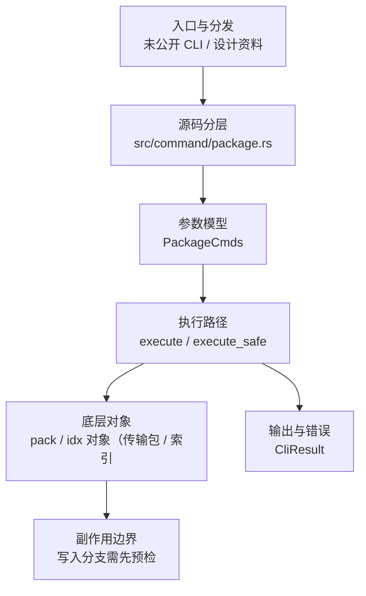

# `libra package` 开发设计

## 命令实现目标

`libra package` 的目标是安装、列出、比较和卸载 agent/package 能力声明，并根据能力是否会修改状态决定默认启用策略。当前实现资料存在但顶层 CLI 尚未公开接入，后续需要决定 package 管理是否进入稳定命令面。

## 对比 Git 与兼容性

- 兼容级别：`unpublished`。未进入 COMPATIBILITY.md；以代码接入状态为准。

- 该资料未对应公开 CLI 命令；用户可见状态按未发布处理。

## 设计方案

- 入口与分发：源码资料存在但尚未公开接入 `src/cli.rs::Commands`；当前未由 `src/command/mod.rs` 导出。CLI 层在 `src/cli.rs` 把解析后的参数交给命令模块，命令模块负责把领域错误转换为 `CliError` / `CliResult`。
- 源码分层：主要实现文件为 `src/command/package.rs`。参数/子命令类型包括：`PackageCmds`；输出、错误或状态类型包括：源码未暴露独立输出/错误类型，错误通过 `CliResult` 或上层命令错误统一传播；主要执行函数包括：`execute`、`execute_safe`。
- 执行路径：`execute_safe` 负责 CLI 安全包装、错误映射和输出配置；网络路径会解析 remote 配置、协商协议并处理 pack/idx 数据；AI 路径会读写 session、checkpoint、thread graph 或 agent profile 状态。

- 流程图：以下流程图按当前源码分层展示主路径和底层对象边界，便于维护者把代码入口、执行函数和副作用范围对应起来。

- 底层操作对象：pack / idx 对象（传输包、索引、delta 和完整性校验）；Agent profile / runtime 对象（外部代理、hook、权限和运行状态）
- 输出与错误契约：人类输出、`--json` / `--machine` 输出和 quiet/verbose 分支必须继续走现有 `OutputConfig` / `emit_json_data` / `CliError` 路径；新增失败模式要补稳定错误码、用户提示和回归测试。
- 副作用边界：凡是写入索引、对象库、refs/HEAD、reflog、SQLite/D1、工作树或远端的路径，都必须先完成参数校验和 dry-run/预检分支，再执行持久化，避免部分写入后静默成功。

## 实现历史

- 本节依据本地 main 分支提交历史重写，筛选与该命令实现、测试或文档路径直接相关的提交；以下是归纳后的实现脉络。
- 2026-06-02 `e3632ad9`（`feat(package): add libra package install/list/diff/uninstall CLI (v0.17.1247, CEX-S2-17)`）：基础实现节点：add libra package install/list/diff/uninstall CLI (v0.17.1247, CEX-S2-17)；当前实现的主要轮廓可追溯到该提交。
- 2026-06-02 `7c014da7`（`feat(package): auto-enable non-mutating packages; mutating stay default-deny (v0.17.1249, CEX-S2-17)`）：功能演进：auto-enable non-mutating packages; mutating stay default-deny (v0.17.1249, CEX-S2-17)；该节点扩展了当前命令可用的参数或行为。
- 2026-06-02 `4a004ba6`（`feat(package): show effective active capability set in list (v0.17.1248, CEX-S2-17)`）：功能演进：show effective active capability set in list (v0.17.1248, CEX-S2-17)；该节点扩展了当前命令可用的参数或行为。
- 历史结论：`src/command/package.rs` 或配套测试/文档已有历史节点，但当前 `src/cli.rs::Commands` 未公开 `package` 入口；实现历史不改变当前状态章节中的未接入结论。

## 当前状态

- 公开状态：未公开；模块状态：未从 `src/command/mod.rs` 导出。
- 用户文档：`docs/commands/package.md`。
- Synopsis：`libra package list`。
- 公开参数/子命令包括：`--yes`、`--enable`。

## 还未实现的功能

| 类别 | 未完成项 | 当前处理 |
|---|---|---|
| 兼容矩阵 | `COMPATIBILITY.md` 尚未登记该命令行。 | 需要决定是否纳入用户可见兼容矩阵和矩阵守卫。 |
| CLI 接入 | `src/cli.rs::Commands` 尚未公开该顶层命令。 | 需要决定接入 CLI、降级为内部设计资料，或移出用户命令文档。 |

## 维护要求

- 改进本命令前，必须先阅读并遵循 [docs/development/commands/_general.md](_general.md)；这是命令设计、实现、测试和文档同步的强制要求。
- 任何行为变更都要先核对实现源码，再同步 `COMPATIBILITY.md`、`docs/commands/<cmd>.md` 和相关测试。
- 新增 Git 兼容参数时必须明确 tier、错误码、JSON/机器输出契约和回归测试。
- 若决定发布该命令，最小闭环是：CLI 变体、`src/command/mod.rs` 导出、dispatch、用户文档、兼容矩阵和测试。
