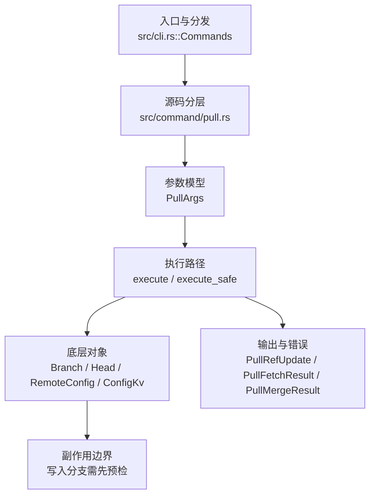

# `libra pull` 开发设计

## 命令实现目标

`libra pull` 的目标是先 fetch 再把远端变化整合进当前分支。实现需要支持 fast-forward、three-way merge、ff-only、rebase 标志、merge flags、depth 转发和挂起/恢复边界，并明确 squash 与部分策略标志的缺口。

## 对比 Git 与兼容性

- 兼容级别：`partial`。fetch + fast-forward/three-way merge supported; `--ff-only` and `--rebase` exposed; `--squash` and `--no-ff` strategy flags not exposed

- 当前矩阵明确仍是部分兼容；未覆盖的 Git surface 必须显式列在“还未实现的功能”。

## 设计方案

- 入口与分发：已公开接入 `src/cli.rs::Commands`；已由 `src/command/mod.rs` 导出。CLI 层在 `src/cli.rs` 把解析后的参数交给命令模块，命令模块负责把领域错误转换为 `CliError` / `CliResult`。
- 源码分层：主要实现文件为 `src/command/pull.rs`。参数/子命令类型包括：`PullArgs`；输出、错误或状态类型包括：`PullRefUpdate`、`PullFetchResult`、`PullMergeResult`、`PullRebaseResult`、`PullOutput`；主要执行函数包括：`execute`、`execute_safe`。
- 执行路径：`execute_safe` 负责 CLI 安全包装、错误映射和输出配置；引用路径会读取或更新 SQLite refs、HEAD 与 reflog；网络路径会解析 remote 配置、协商协议并处理 pack/idx 数据。

- 流程图：以下流程图按当前源码分层展示主路径和底层对象边界，便于维护者把代码入口、执行函数和副作用范围对应起来。

- 底层操作对象：`Branch` / branch store（SQLite refs 上的分支读写、过滤和上游关系）；`Head`（SQLite 中的 HEAD 指向、当前分支和 detached 状态）；`RemoteConfig`（remote URL、refspec 和凭据配置）；pack / idx 对象（传输包、索引、delta 和完整性校验）；`ConfigKv`（配置键值持久化行）
- 输出与错误契约：人类输出、`--json` / `--machine` 输出和 quiet/verbose 分支必须继续走现有 `OutputConfig` / `emit_json_data` / `CliError` 路径；新增失败模式要补稳定错误码、用户提示和回归测试。
- 副作用边界：凡是写入索引、对象库、refs/HEAD、reflog、SQLite/D1、工作树或远端的路径，都必须先完成参数校验和 dry-run/预检分支，再执行持久化，避免部分写入后静默成功。

## 实现历史

- 本节依据本地 main 分支提交历史重写，筛选与该命令实现、测试或文档路径直接相关的提交；以下是归纳后的实现脉络。
- 2026-05-28 `c8c47040`（`feat(pull): add --rebase flag for diverged history`）：基础实现节点：add --rebase flag for diverged history；当前实现的主要轮廓可追溯到该提交。
- 2026-06-06 `0c7604f9`（`feat(pull): forward merge flags + depth, gate unsupported rebase strategies (#1388)`）：功能演进：forward merge flags + depth, gate unsupported rebase strategies (#1388)；该节点扩展了当前命令可用的参数或行为。
- 2026-05-30 `8e987801`（`feat(pull): support ff-only`）：功能演进：support ff-only；该节点扩展了当前命令可用的参数或行为。
- 2026-06-09 `17d26c76`（`fix(pull): avoid fast-forward hang from whole-worktree restore`）：实现修正：avoid fast-forward hang from whole-worktree restore；该节点把边界行为、错误处理或兼容差异纳入当前实现约束。
- 2026-06-01 `17be24e0`（`test(compat): pin pull --ff-only/--rebase surface and fix matrix row (v0.17.1215)`）：测试契约：pin pull --ff-only/--rebase surface and fix matrix row (v0.17.1215)；相关行为已有回归守卫，后续变更需要继续满足。
- 历史结论：当前文档应以这些提交之后的代码、测试和兼容矩阵为准；更早的迁移式文档只保留为背景，不再作为事实来源。

## 当前状态

- 公开状态：已公开；模块状态：已导出。
- 用户文档：`docs/commands/pull.md`。
- Synopsis：`libra pull [--ff-only] [--rebase] [<repository> [<refspec>]]`。
- 公开参数/子命令以用户文档和 CLI help 为准；当前未抽取到独立 Options/Subcommands 小节。

## 还未实现的功能

| 类别 | 未完成项 | 当前处理 |
|---|---|---|
| 兼容矩阵说明 | fetch + fast-forward/three-way merge 支持; squash/no-ff strategy flags 未公开 | 按当前兼容矩阵保留；实现状态变化时同步 `_compatibility.md` 和测试证据。 |
| 兼容差异项 | Force merge commit | 原始对照：不支持；相关参数/替代：git pull --no-ff；当前说明：不适用。 后续实现时需要补对应回归测试并同步兼容矩阵。 |
| 兼容差异项 | Squash | 原始对照：不支持；相关参数/替代：git pull --squash；当前说明：不适用。 后续实现时需要补对应回归测试并同步兼容矩阵。 |

## 维护要求

- 改进本命令前，必须先阅读并遵循 [docs/development/commands/_general.md](_general.md)；这是命令设计、实现、测试和文档同步的强制要求。
- 任何行为变更都要先核对实现源码，再同步 `COMPATIBILITY.md`、`docs/commands/<cmd>.md` 和相关测试。
- 新增 Git 兼容参数时必须明确 tier、错误码、JSON/机器输出契约和回归测试。
