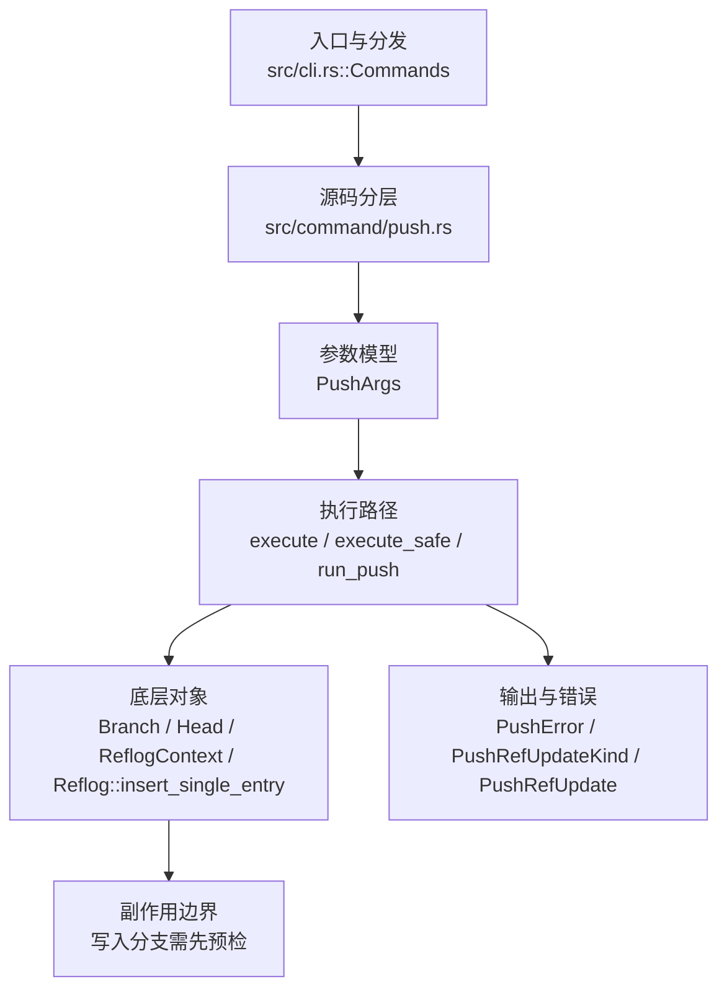

# `libra push` 开发设计

## 命令实现目标

`libra push` 的目标是把本地 branch/tag 更新和相关对象发送到远端。实现需要覆盖多 refspec、delete、`--tags`、`--mirror`、dry-run、force 和本地 file remote 的有意拒绝。

## 对比 Git 与兼容性

- 兼容级别：`partial`。branch/tag update, multi-refspec, delete, `--tags`, and `--mirror` supported; `--force-with-lease[=<ref>[:<expect>]]`（发送前校验远端仍匹配 tracking-ref/expected OID，与 `--force` 互斥）和 `--porcelain`（机器可读的每 ref 行，与 `--json`/`--machine` 互斥）supported；`--atomic` supported（经 `resolve_atomic_capability` 在远端 discovery 通告 `atomic` 时附加该 capability，使远端要么全部更新要么全部不更新；远端未通告则提前以 `PushError::AtomicUnsupported` 拒绝）；`--force-if-includes` 与 `--thin`/`--no-thin` 作为 **no-op** 接受。**unsupported（尚未打通协议层）：** `--signed`、`--push-option`/`-o`、`--follow-tags`。local file remote rejected — intentional (see [docs/development/commands/_compatibility.md#d2-本地-file-remote-的-push](docs/development/commands/_compatibility.md#d2-本地-file-remote-的-push))

- 当前矩阵明确仍是部分兼容；未覆盖的 Git surface 必须显式列在“还未实现的功能”。

## 设计方案

- 入口与分发：已公开接入 `src/cli.rs::Commands`；已由 `src/command/mod.rs` 导出。CLI 层在 `src/cli.rs` 把解析后的参数交给命令模块，命令模块负责把领域错误转换为 `CliError` / `CliResult`。
- 源码分层：主要实现文件为 `src/command/push.rs`。参数/子命令类型包括：`PushArgs`；输出、错误或状态类型包括：`PushError`、`PushRefUpdateKind`、`PushRefUpdate`、`PushOutput`；主要执行函数包括：`execute`、`execute_safe`、`run_push`。
- 源码意图：源码模块注释说明该命令读取 remote 配置、与服务器协商，并发送本地 refs 与 pack 数据完成远端更新。
- 执行路径：`execute_safe` 负责 CLI 安全包装、错误映射和输出配置；核心领域逻辑集中在 `run_push`；对象路径会解析 revision 并读写 blob/tree/commit/tag 等对象；引用路径会读取或更新 SQLite refs、HEAD 与 reflog；网络路径会解析 remote 配置、协商协议并处理 pack/idx 数据；数据库路径会通过 SeaORM/SQLite 或 D1 客户端持久化元数据。

- 流程图：以下流程图按当前源码分层展示主路径和底层对象边界，便于维护者把代码入口、执行函数和副作用范围对应起来。

- 底层操作对象：SSH transport（SSH remote 连接和认证）；pack / idx 对象（传输包、索引、delta 和完整性校验）；`Branch` / branch store（SQLite refs 上的分支读写、过滤和上游关系）；`Head`（SQLite 中的 HEAD 指向、当前分支和 detached 状态）；`ReflogContext` / `Reflog::insert_single_entry`（在数据库事务内直接写入 SQLite reflog 和动作记录）；`Commit`（提交对象、父提交关系和提交消息载荷）；`Tree`（由索引或对象遍历生成的目录树对象）；`Blob`（文件内容或 LFS pointer 写入对象库后的 blob 对象）；`TreeItem` / `TreeItemMode`（tree 中的路径项和 mode）；SeaORM / `.libra/libra.db`（配置、refs、reflog、AI/发布元数据等 SQLite 表）；`ObjectHash`（SHA-1/SHA-256 对象 ID 和 revision 解析结果）；`ConfigKv`（配置键值持久化行）
- 输出与错误契约：人类输出、`--json` / `--machine` 输出和 quiet/verbose 分支必须继续走现有 `OutputConfig` / `emit_json_data` / `CliError` 路径；新增失败模式要补稳定错误码、用户提示和回归测试。
- 副作用边界：凡是写入索引、对象库、refs/HEAD、reflog、SQLite/D1、工作树或远端的路径，都必须先完成参数校验和 dry-run/预检分支，再执行持久化，避免部分写入后静默成功。

## 实现历史

- 本节依据本地 main 分支提交历史重写，筛选与该命令实现、测试或文档路径直接相关的提交；以下是归纳后的实现脉络。
- 2025-11-27 `a4e9881b`（`feat: add force push support to push command (#69)`）：基础实现节点：add force push support to push command (#69)；当前实现的主要轮廓可追溯到该提交。
- 2026-06-07 `6b11a315`（`feat(push): add atomic push safety`）：功能演进：add atomic push safety；该节点新增的 `--atomic` 等 flag 已在后续提交回退，当前 `PushArgs` 不再公开。
- 2026-06-06 `e507dc57`（`feat(push): add --force-with-lease, --porcelain, and no-op compat flags (#1389)`）：功能演进：add --force-with-lease, --porcelain, and no-op compat flags (#1389)；该节点新增的 `--force-with-lease` / `--porcelain` / `--force-if-includes` / `--thin`/`--no-thin` 等 flag 曾被一次 reconcile 丢失内容，已于 2026-06-18 恢复到当前代码（lease 校验 + porcelain 输出 + no-op 兼容 flag），`PushArgs` 重新公开这些参数。
- 2026-05-29 `3a4990e8`（`fix(push): set upstream for up-to-date refspec`）：实现修正：set upstream for up-to-date refspec；该节点把边界行为、错误处理或兼容差异纳入当前实现约束。
- 历史结论：当前文档应以这些提交之后的代码、测试和兼容矩阵为准；更早的迁移式文档只保留为背景，不再作为事实来源。

## 当前状态

- 公开状态：已公开；模块状态：已导出。
- 用户文档：`docs/commands/push.md`。
- Synopsis：`libra push [OPTIONS] [<repository> [<refspec>...]]`。
- 公开参数/子命令包括：`[<repository>]`、`[<REFSPEC>...]`、`-u, --set-upstream`、`-f, --force`、`--force-with-lease[=<ref>[:<expect>]]`、`--force-if-includes`、`--thin`、`--no-thin`、`--porcelain`、`-n, --dry-run`、`--tags`、`--mirror`。

## 还未实现的功能

| 类别 | 未完成项 | 当前处理 |
|---|---|---|
| Git flag | `--signed` / `--push-option` (`-o`) / `--follow-tags` | 当前 `PushArgs` 未公开；恢复时需补 push-cert 签名协议、push-option 转发或 tag 跟随逻辑和测试证据（均需协议层改造）。 |

（`--atomic` 已实现：`resolve_atomic_capability` 在远端 discovery 通告 `atomic` 时附加该 capability，远端未通告则以 `PushError::AtomicUnsupported` 拒绝；`StableErrorCode::NetworkProtocol`。）

## 维护要求

- 改进本命令前，必须先阅读并遵循 [docs/development/commands/_general.md](_general.md)；这是命令设计、实现、测试和文档同步的强制要求。
- 任何行为变更都要先核对实现源码，再同步 `COMPATIBILITY.md`、`docs/commands/<cmd>.md` 和相关测试。
- 新增 Git 兼容参数时必须明确 tier、错误码、JSON/机器输出契约和回归测试。
