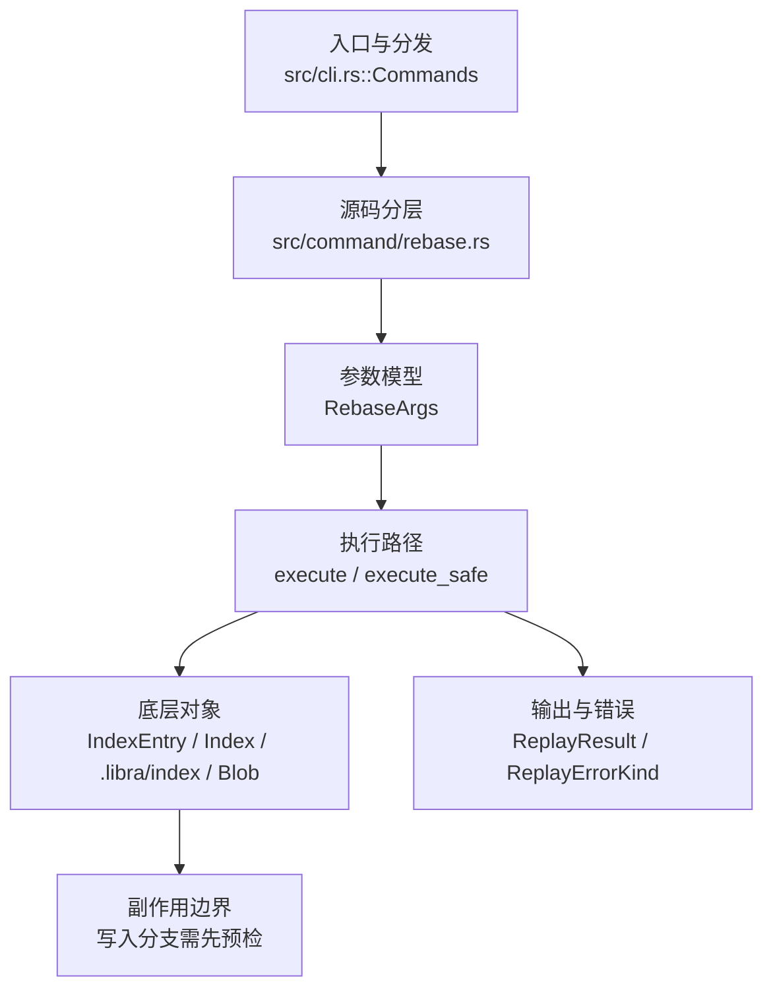

# `libra rebase` 开发设计

## 命令实现目标

`libra rebase` 的目标是把提交重放到新的 base 上，并支持 continue/abort/skip 等冲突恢复流程。实现需要保持作者/提交者语义、文件模式、错误分类和 pull --rebase 交互。已支持 `--onto <newbase> [<upstream>] [<branch>]`（重放 `<upstream>..HEAD` 区间到 `<newbase>`，第三 positional 先切换分支）；`--autosquash`（fixup!/squash!/amend! 折叠）与 `--reapply-cherry-picks` 已支持，`--no-autostash`（接受式 no-op：Libra 的 rebase 从不 autostash）已公开；interactive、exec、`--autostash`（正向 auto-stash）、rebase-merges 等能力仍列为未完成。

## 对比 Git 与兼容性

- 兼容级别：`partial`。`--onto <newbase> [<upstream>] [<branch>]`、`--autosquash`、`--reapply-cherry-picks` 与 `--no-autostash`（接受式 no-op：Libra 的 rebase 从不 autostash，要求干净工作树；字段 `no_autostash` 解析后不被读取。Git 的反向 `--autostash` 未实现）已支持；interactive/exec/`--rebase-merges` 未支持

- 当前矩阵明确仍是部分兼容；未覆盖的 Git surface 必须显式列在“还未实现的功能”。

## 设计方案

- 入口与分发：已公开接入 `src/cli.rs::Commands`；已由 `src/command/mod.rs` 导出。CLI 层在 `src/cli.rs` 把解析后的参数交给命令模块，命令模块负责把领域错误转换为 `CliError` / `CliResult`。
- 源码分层：主要实现文件为 `src/command/rebase.rs`。参数/子命令类型包括：`RebaseArgs`；输出、错误或状态类型包括：`ReplayResult`、`ReplayErrorKind`；主要执行函数包括：`execute`、`execute_safe`。
- 执行路径：`execute_safe` 负责 CLI 安全包装、错误映射和输出配置；索引路径会加载、比较、刷新或保存 `.libra/index`；对象路径会解析 revision 并读写 blob/tree/commit/tag 等对象；引用路径会读取或更新 SQLite refs、HEAD 与 reflog；数据库路径会通过 SeaORM/SQLite 或 D1 客户端持久化元数据。

- 流程图：以下流程图按当前源码分层展示主路径和底层对象边界，便于维护者把代码入口、执行函数和副作用范围对应起来。

- 底层操作对象：`IndexEntry`（索引条目，承载路径、mode、object id 和 stat 元数据）；`Index` / `.libra/index`（暂存区状态、路径条目和刷新/保存边界）；`Blob`（文件内容或 LFS pointer 写入对象库后的 blob 对象）；`Commit`（提交对象、父提交关系和提交消息载荷）；`TreeItem` / `TreeItemMode`（tree 中的路径项和 mode）；`Tree`（由索引或对象遍历生成的目录树对象）；`Branch` / branch store（SQLite refs 上的分支读写、过滤和上游关系）；`Head`（SQLite 中的 HEAD 指向、当前分支和 detached 状态）；`ReflogContext` / `with_reflog`（SQLite reflog 写入和动作记录）；`DatabaseTransaction`（需要原子性的数据库写入事务）；SeaORM / `.libra/libra.db`（配置、refs、reflog、AI/发布元数据等 SQLite 表）；`ObjectHash`（SHA-1/SHA-256 对象 ID 和 revision 解析结果）
- 输出与错误契约：人类输出、`--json` / `--machine` 输出和 quiet/verbose 分支必须继续走现有 `OutputConfig` / `emit_json_data` / `CliError` 路径；新增失败模式要补稳定错误码、用户提示和回归测试。
- 副作用边界：凡是写入索引、对象库、refs/HEAD、reflog、SQLite/D1、工作树或远端的路径，都必须先完成参数校验和 dry-run/预检分支，再执行持久化，避免部分写入后静默成功。

## 实现历史

- 本节依据本地 main 分支提交历史重写，筛选与该命令实现、测试或文档路径直接相关的提交；以下是归纳后的实现脉络。
- 2026-01-04 `1089fd43`（`feat(rebase): add --continue/--abort/--skip for conflict handling (#100)`）：基础实现节点：add --continue/--abort/--skip for conflict handling (#100)；当前实现的主要轮廓可追溯到该提交。
- 2026-05-16 `e21096fc`（`feat(cloud,rebase): align typed outputs and error classification with improvements`）：功能演进：align typed outputs and error classification with improvements；该节点扩展了当前命令可用的参数或行为。
- 2026-05-15 `802c4b4f`（`feat(rebase): route human start through runner`）：功能演进：route human start through runner；该节点扩展了当前命令可用的参数或行为。
- 2026-06-07 `f5824987`（`fix(rebase): preserve ambiguous merge-base errors`）：实现修正：preserve ambiguous merge-base errors；该节点把边界行为、错误处理或兼容差异纳入当前实现约束。
- 2026-05-21 `af91d0c6`（`test(rebase): pin From<RebaseError> for CliError stable_code mapping (v0.17.709)`）：测试契约：pin From<RebaseError> for CliError stable_code mapping (v0.17.709)；相关行为已有回归守卫，后续变更需要继续满足。
- 2026-06-19（PR-14）：新增 `--onto <newbase> [<upstream>] [<branch>]`。抽出 `newbase_id`（onto 缺省退化为 upstream），`run_rebase_start(upstream, onto)` 把 replay 落点（detach 目标、`state.onto`/`current_head`、start reflog、worktree guard 用 newbase 树）与 replay 区间（仍由 `find_merge_base(HEAD, upstream)` 决定）解耦；`--onto` 给定时跳过 fast-forward / already-up-to-date 短路（显式落点恒重放，空区间不移动分支）。第三 positional `<branch>` 经 `switch::execute_safe` 先切换。新增 `RebaseError::OntoResolve`（映射既有 `CliInvalidTarget`/128）。JSON `onto` 填 newbase id、`upstream` 填 upstream 串；人类 "Rebasing from X onto upstream" 文案沿用既有（区间来源），不破坏既有断言。
- 历史结论：当前文档应以这些提交之后的代码、测试和兼容矩阵为准；更早的迁移式文档只保留为背景，不再作为事实来源。

## 当前状态

- 公开状态：已公开；模块状态：已导出。
- 用户文档：`docs/commands/rebase.md`。
- Synopsis：`libra rebase <upstream> | --continue | --abort | --skip`。
- 公开参数/子命令包括：`<upstream>`、`--continue`、`--abort`、`--skip`。

## 还未实现的功能

| 类别 | 未完成项 | 当前处理 |
|---|---|---|
| 兼容矩阵说明 | `--onto`/`--autosquash`/`--reapply-cherry-picks`/`--no-autostash`(no-op) 已支持；interactive/`--rebase-merges`/`--autostash` 未支持 | 按当前兼容矩阵保留；实现状态变化时同步 `_compatibility.md` 和测试证据。 |
| 兼容差异项 | Interactive | 原始对照：不支持；相关参数/替代：-i / --interactive；当前说明：不适用。 后续实现时需要补对应回归测试并同步兼容矩阵。 |
| 兼容差异项 | Exec | 原始对照：不支持；相关参数/替代：--exec <cmd>；当前说明：不适用。 后续实现时需要补对应回归测试并同步兼容矩阵。 |
| ✅ 已实现 | Autosquash | `--autosquash` 已支持（fixup!/squash!/amend! 移动并折叠到目标提交）。 |
| 部分实现 | Autostash | `--no-autostash` 作为接受式 no-op 已公开（Libra 的 rebase 从不 autostash，要求干净工作树）；`--autostash`（正向 auto-stash）仍未实现。 |
| 兼容差异项 | Rebase merges | 原始对照：不支持；相关参数/替代：--rebase-merges；当前说明：默认行为。 后续实现时需要补对应回归测试并同步兼容矩阵。 |
| 兼容差异项 | Keep empty | 原始对照：不支持；相关参数/替代：--keep-empty / --no-keep-empty；当前说明：Default keeps empty。 后续实现时需要补对应回归测试并同步兼容矩阵。 |

## 维护要求

- 改进本命令前，必须先阅读并遵循 [docs/development/commands/_general.md](_general.md)；这是命令设计、实现、测试和文档同步的强制要求。
- 任何行为变更都要先核对实现源码，再同步 `COMPATIBILITY.md`、`docs/commands/<cmd>.md` 和相关测试。
- 新增 Git 兼容参数时必须明确 tier、错误码、JSON/机器输出契约和回归测试。
