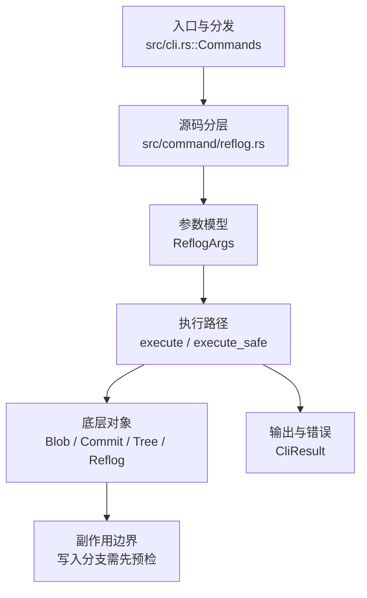

# `libra reflog` 开发设计

## 命令实现目标

`libra reflog` 的目标是查看和维护 SQLite 中的引用变更日志。实现需要支持 show 的 grep/since/until/stat/patch/author/数量参数，以及 expire 的时间、可达性和 stale-fix 规则，使引用历史可审计又可清理。

## 对比 Git 与兼容性

- 兼容级别：`supported`。`show` / `delete` / `exists` / `expire` 子命令均已支持；`expire` 按时间 + 可达性 + `--stale-fix` 清理（`--all`/`--expire`/`--expire-unreachable`/`--rewrite`/`--updateref`/`-n`/`-v`），读取 `gc.reflogExpire`/`gc.reflogExpireUnreachable`（90/30 天默认，只读不写）。刻意差异：无 ref 的 expire 直接报错（退出码 128）而非 Git 的静默 no-op；`--stale-fix` 仅检查 new 值是否能加载为 commit（无传递性对象遍历）；`--updateref` 跳过符号 `HEAD` 与 remote-tracking ref。

- 当前矩阵承诺常用 Git 行为已支持；新增语义必须同步矩阵、用户文档和测试。

## 设计方案

- 入口与分发：已公开接入 `src/cli.rs::Commands`；已由 `src/command/mod.rs` 导出。CLI 层在 `src/cli.rs` 把解析后的参数交给命令模块，命令模块负责把领域错误转换为 `CliError` / `CliResult`。
- 源码分层：主要实现文件为 `src/command/reflog.rs`。参数/子命令类型包括：`ReflogArgs`；输出、错误或状态类型包括：源码未暴露独立输出/错误类型，错误通过 `CliResult` 或上层命令错误统一传播；主要执行函数包括：`execute`、`execute_safe`。
- 执行路径：`execute_safe` 负责 CLI 安全包装、错误映射和输出配置；对象路径会解析 revision 并读写 blob/tree/commit/tag 等对象；引用路径会读取或更新 SQLite refs、HEAD 与 reflog；数据库路径会通过 SeaORM/SQLite 或 D1 客户端持久化元数据。

- 流程图：以下流程图按当前源码分层展示主路径和底层对象边界，便于维护者把代码入口、执行函数和副作用范围对应起来。

- 底层操作对象：`Blob`（文件内容或 LFS pointer 写入对象库后的 blob 对象）；`Commit`（提交对象、父提交关系和提交消息载荷）；`Tree`（由索引或对象遍历生成的目录树对象）；`Reflog`（通过 `Reflog::find_all` / `Reflog::find_one` 读取 reflog 记录，删除走原始 `DELETE FROM reflog` SQL，不经 `ReflogContext` / `with_reflog` 写入路径）；SeaORM / `.libra/libra.db`（配置、refs、reflog、AI/发布元数据等 SQLite 表）；`ObjectHash`（SHA-1/SHA-256 对象 ID 和 revision 解析结果）；`ConfigKv`（配置键值持久化行）
- 输出与错误契约：人类输出、`--json` / `--machine` 输出和 quiet/verbose 分支必须继续走现有 `OutputConfig` / `emit_json_data` / `CliError` 路径；新增失败模式要补稳定错误码、用户提示和回归测试。
- 副作用边界：凡是写入索引、对象库、refs/HEAD、reflog、SQLite/D1、工作树或远端的路径，都必须先完成参数校验和 dry-run/预检分支，再执行持久化，避免部分写入后静默成功。

## 实现历史

- 本节依据本地 main 分支提交历史重写，筛选与该命令实现、测试或文档路径直接相关的提交；以下是归纳后的实现脉络。
- 2026-01-10 `7d256d09`（`feat(reflog): support --grep, --since, --until, --stat, --patch/-p, --author, -n/--number params in reflog show (#112)`）：基础实现节点：support --grep, --since, --until, --stat, --patch/-p, --author, -n/--number params in reflog show (#112)；当前实现的主要轮廓可追溯到该提交。
- 2026-05-15 `75734b60`（`feat(reflog): structure command output`）：功能演进：structure command output；该节点扩展了当前命令可用的参数或行为。
- 2026-05-17 `492feff7`（`test(command/reflog): pin Display for 4 FormatterKind variants (v0.17.366)`）：测试契约：pin Display for 4 FormatterKind variants (v0.17.366)；相关行为已有回归守卫，后续变更需要继续满足。
- 2026-06-06 `aac5351a`（`feat(reflog): implement reflog expire (time/reachability/stale-fix) (#1391)`）：新增 `reflog expire` 子命令。该改动曾被一次 reconcile 丢弃，2026-06-18 重新应用：`src/internal/reflog.rs` 提供 `ExpireCutoff`/`ExpireOptions`/`ExpireResult` 与 `expire_reflog`/`expire_reflog_with_conn`/`collect_reachable`/`parse_expire_cutoff`/`expire_defaults_with_conn`（注入式 `load_parents`/`is_commit` loader，便于单测合成图），`src/command/reflog.rs` 提供两阶段（先校验全部 ref 再逐 ref 事务清理）的 `Expire` 子命令。
- 历史结论：当前文档应以这些提交之后的代码、测试和兼容矩阵为准；更早的迁移式文档只保留为背景，不再作为事实来源。

## 当前状态

- 公开状态：已公开；模块状态：已导出。
- 用户文档：`docs/commands/reflog.md`。
- Synopsis：`libra reflog show [<ref_name>] [--pretty <format>] [--since <date>] [--until <date>] [--grep <pattern>] [--author <pattern>] [-n <N>] [-p/--patch] [--stat]` ｜ `libra reflog delete <selectors>...` ｜ `libra reflog exists <ref_name>`。
- 公开参数/子命令包括：`show [<ref_name>]`（`--pretty <format>`、`--since <date>`、`--until <date>`、`--grep <pattern>`、`--author <pattern>`、`-n, --number <N>`、`-p, --patch`、`--stat`）、`delete <selectors>...`、`exists <ref_name>`、`expire`（`--all`、`--expire <time>`、`--expire-unreachable <time>`、`--rewrite`、`--updateref`、`--stale-fix`、`-n/--dry-run`、`-v/--verbose`、`<refs>...`）。

## 还未实现的功能

| 类别 | 未完成项 | 当前处理 |
|---|---|---|
| 兼容差异项 | `--stale-fix` 传递性对象遍历 | 仅检查 new 值是否能加载为 commit；Git 的 `commit → tree → blob` 完整性遍历交给 `fsck` / 未来的 `gc`。 |

## 维护要求

- 改进本命令前，必须先阅读并遵循 [docs/development/commands/_general.md](_general.md)；这是命令设计、实现、测试和文档同步的强制要求。
- 任何行为变更都要先核对实现源码，再同步 `COMPATIBILITY.md`、`docs/commands/<cmd>.md` 和相关测试。
- 新增 Git 兼容参数时必须明确 tier、错误码、JSON/机器输出契约和回归测试。
