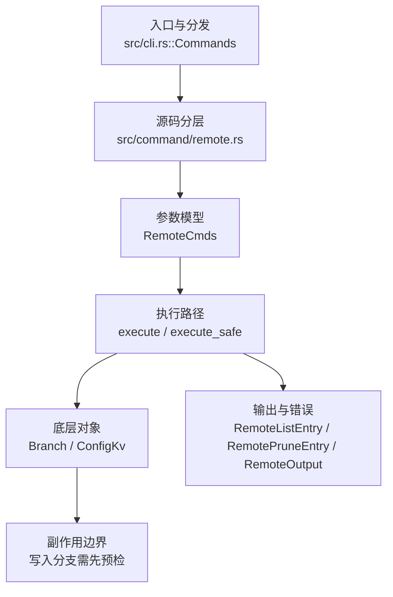

# `libra remote` 开发设计

## 命令实现目标

`libra remote` 的目标是管理远端配置，包括 add/remove/rename/get-url/set-url/prune/show/-v 等子命令。实现需要保护 SSH key namespace、复用 fetch prune 逻辑，并把远端状态以用户可读和结构化方式呈现。

## 对比 Git 与兼容性

- 兼容级别：`partial`。add/remove/rename/list/get-url/set-url/prune 已支持；详细 `remote show <name>` 与 `remote update` 尚未公开。

- 当前矩阵承诺常用 Git 行为已支持；新增语义必须同步矩阵、用户文档和测试。

## 设计方案

- 入口与分发：已公开接入 `src/cli.rs::Commands`；已由 `src/command/mod.rs` 导出。CLI 层在 `src/cli.rs` 把解析后的参数交给命令模块，命令模块负责把领域错误转换为 `CliError` / `CliResult`。
- 源码分层：主要实现文件为 `src/command/remote.rs`。参数/子命令类型包括：`RemoteCmds`；输出、错误或状态类型包括：`RemoteListEntry`、`RemotePruneEntry`、`RemoteOutput`；主要执行函数包括：`execute`、`execute_safe`。
- 执行路径：`execute_safe` 负责 CLI 安全包装、错误映射和输出配置；引用路径会读取或更新 SQLite refs、HEAD 与 reflog；网络路径会解析 remote 配置、协商协议并处理 pack/idx 数据。

- 流程图：以下流程图按当前源码分层展示主路径和底层对象边界，便于维护者把代码入口、执行函数和副作用范围对应起来。

- 底层操作对象：`Branch` / branch store（SQLite refs 上的分支读写、过滤和上游关系）；SSH transport（SSH remote 连接和认证）；Vault/libvault（身份、密钥或 vault-backed 签名边界）；`ConfigKv`（配置键值持久化行）
- 输出与错误契约：人类输出、`--json` / `--machine` 输出和 quiet/verbose 分支必须继续走现有 `OutputConfig` / `emit_json_data` / `CliError` 路径；新增失败模式要补稳定错误码、用户提示和回归测试。
- 副作用边界：凡是写入索引、对象库、refs/HEAD、reflog、SQLite/D1、工作树或远端的路径，都必须先完成参数校验和 dry-run/预检分支，再执行持久化，避免部分写入后静默成功。

## 实现历史

- 本节依据本地 main 分支提交历史重写，筛选与该命令实现、测试或文档路径直接相关的提交；以下是归纳后的实现脉络。
- 2025-10-25 `5703987b`（`feat: add option rename for remote command (#27)`）：基础实现节点：add option rename for remote command (#27)；当前实现的主要轮廓可追溯到该提交。
- 2026-06-09 `b8e6b4f4`（`feat(remote): add detailed `remote show <name>` subcommand (#379)`）：历史节点曾引入带 `<name>` 参数的详细 `remote show <name>` 子命令（fetch/push URL、HEAD 分支、远端及本地跟踪分支），但该带参数的 Show 形态及对应的 `RemoteOutput::Show` 输出变体已不在当前 HEAD；当前 `RemoteCmds::Show` 是无参数的单元变体，分发到 `run_list_remotes(false)`，仅列出远端名称。
- 2026-06-06 `586231c0`（`feat(remote): add set-branches and set-head subcommands (#1392)`）：历史节点曾引入 set-branches / set-head 子命令，但这两个子命令已不在当前 `RemoteCmds` 表面（HEAD 仅保留 add/remove/rename/-v/show/get-url/set-url/prune）。
- 2026-05-29 `a22d3b4b`（`fix(remote): guard ssh key namespace rename`）：实现修正：guard ssh key namespace rename；该节点把边界行为、错误处理或兼容差异纳入当前实现约束。
- 历史结论：当前文档应以这些提交之后的代码、测试和兼容矩阵为准；更早的迁移式文档只保留为背景，不再作为事实来源。

## 当前状态

- 公开状态：已公开；模块状态：已导出。
- 用户文档：`docs/commands/remote.md`。
- Synopsis：`libra remote <subcommand> [OPTIONS] [ARGS]`。
- 公开参数/子命令包括：`add <name> <url>`、`remove <name>`、`rename <old> <new>`、`-v`（verbose 列表）、`show`、`get-url [--push] [--all] <name>`、`set-url [--add] [--delete] [--push] [--all] <name> <value>`、`prune [--dry-run] <name>`。

## 还未实现的功能

| 类别 | 未完成项 | 当前处理 |
|---|---|---|
| 子命令 | `remote show <name>` 详细视图（fetch/push URL、HEAD 分支、远端及本地跟踪分支）。曾在 `b8e6b4f4` 引入，但不在当前 HEAD：`RemoteCmds::Show` 为无参数单元变体，`RemoteOutput` 无 `Show` 变体。 | 当前 `libra remote show` 等价于列出远端名称（`run_list_remotes(false)`）；如需恢复带参数详情，需重新引入 Show 变体与对应输出，并同步兼容矩阵、用户文档与测试。 |
| 子命令 | `remote update`（按 remote group 批量 fetch）。`RemoteCmds` 与 `RemoteOutput` 均无 `Update` 变体。 | 后续以新增测试、兼容矩阵或用户命令文档变更为准。 |

## 维护要求

- 改进本命令前，必须先阅读并遵循 [docs/development/commands/_general.md](_general.md)；这是命令设计、实现、测试和文档同步的强制要求。
- 任何行为变更都要先核对实现源码，再同步 `COMPATIBILITY.md`、`docs/commands/<cmd>.md` 和相关测试。
- 新增 Git 兼容参数时必须明确 tier、错误码、JSON/机器输出契约和回归测试。
