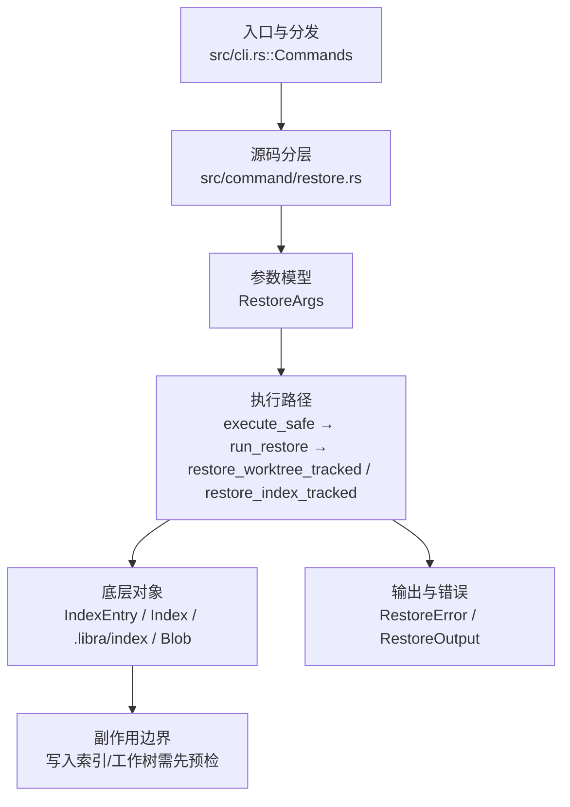

# `libra restore` 开发设计

## 命令实现目标

`libra restore` 的目标是从索引、工作区或指定来源恢复文件内容。实现需要支持 staged/worktree、`--source <tree-ish>` 来源解析和 pathspec 处理，同时把冲突阶段 `--ours/--theirs/-2/-3`、ignore-unmerged、`--overlay`（正向 overlay 模式）、patch、progress、目标 revision 等能力列为差异（`--no-overlay` 已作为接受式 no-op 公开）。

## 对比 Git 与兼容性

- 兼容级别：`partial`。`--source` / `--staged` / `--worktree`、路径 restore、`--no-progress`（接受式 no-op：Libra 的 restore 从不渲染进度条）与 `--no-overlay`（接受式 no-op：Libra 的 restore 从不处于 overlay 模式，已是 Git 默认）已支持；`--overlay`（正向 overlay 模式）、冲突解析、patch 变体与 `--progress` 进度条尚未公开。

- 当前矩阵承诺常用 Git 行为已支持；新增语义必须同步矩阵、用户文档和测试。

## 设计方案

- 入口与分发：已公开接入 `src/cli.rs::Commands`；已由 `src/command/mod.rs` 导出。CLI 层在 `src/cli.rs` 把解析后的参数交给命令模块，命令模块负责把领域错误转换为 `CliError` / `CliResult`。
- 源码分层：主要实现文件为 `src/command/restore.rs`。参数/子命令类型包括：`RestoreArgs`；输出、错误或状态类型包括：`RestoreError`、`RestoreOutput`；主要执行函数包括：`execute_safe`、`run_restore`、`restore_worktree_tracked`、`restore_index_tracked`、`execute_to_output`（`execute` 仅为 `execute_safe` 的薄包装；`execute_checked`、`execute_checked_typed` 为供 `worktree.rs` 与 `checkout`/`clone` 调用的遗留公开 API，不在常规 CLI 分发路径上）。
- 执行路径：CLI 直接分发到 `execute_safe`（`src/cli.rs` 调用 `command::restore::execute_safe`），由其负责 CLI 安全包装、错误映射和输出配置；核心领域逻辑集中在私有 `run_restore`（再调用 `restore_worktree_tracked` / `restore_index_tracked`）；`execute_checked` / `execute_checked_typed` 是遗留路径，常规 CLI 分发不走它们；索引路径会加载、比较、刷新或保存 `.libra/index`；对象路径会解析 revision 并读写 blob/tree/commit/tag 等对象；LFS 路径会按 `.libra_attributes` 生成 pointer、锁或 batch 请求；工作树路径会显式处理目录、注册表和删除/保留语义。

- 流程图：以下流程图按当前源码分层展示主路径和底层对象边界，便于维护者把代码入口、执行函数和副作用范围对应起来。

- 底层操作对象：`IndexEntry`（索引条目，承载路径、mode、object id 和 stat 元数据）；`Index` / `.libra/index`（暂存区状态、路径条目和刷新/保存边界）；`Blob`（文件内容或 LFS pointer 写入对象库后的 blob 对象）；`Commit`（提交对象、父提交关系和提交消息载荷）；`Tree`（由索引或对象遍历生成的目录树对象）；`Branch` / branch store（SQLite refs 上的分支读写、过滤和上游关系）；`Head`（SQLite 中的 HEAD 指向、当前分支和 detached 状态）；`ClientStorage`（本地/分层对象存储读写入口）；`ObjectHash`（SHA-1/SHA-256 对象 ID 和 revision 解析结果）；`ObjectType`（blob/tree/commit/tag 类型分派）；LFS pointer / lock / batch 对象（`.libra_attributes` 驱动的大文件路径）；worktree registry / filesystem layout（附加工作区登记、路径和删除边界）
- 输出与错误契约：人类输出、`--json` / `--machine` 输出和 quiet/verbose 分支必须继续走现有 `OutputConfig` / `emit_json_data` / `CliError` 路径；新增失败模式要补稳定错误码、用户提示和回归测试。
- 副作用边界：凡是写入索引、对象库、refs/HEAD、reflog、SQLite/D1、工作树或远端的路径，都必须先完成参数校验和 dry-run/预检分支，再执行持久化，避免部分写入后静默成功。

## 实现历史

- 本节依据本地 main 分支提交历史重写，筛选与该命令实现、测试或文档路径直接相关的提交；以下是归纳后的实现脉络。
- 2026-06-06 `31378911`（`feat(restore): conflict-stage restore --ours/--theirs/-2/-3, --ignore-unmerged, unmerged guard`）：功能演进：曾引入 conflict-stage restore --ours/--theirs/-2/-3、--ignore-unmerged 和 unmerged guard；但这些参数已在后续提交中回退，当前 `RestoreArgs` 仅保留 `<pathspec>`、`-s/--source`、`-W/--worktree`、`-S/--staged`，相关冲突阶段能力仍为差异项。
- 2026-06-09 `17d26c76`（`fix(pull): avoid fast-forward hang from whole-worktree restore`）：实现修正：avoid fast-forward hang from whole-worktree restore；该节点把边界行为、错误处理或兼容差异纳入当前实现约束。
- 历史结论：当前文档应以这些提交之后的代码、测试和兼容矩阵为准；更早的迁移式文档只保留为背景，不再作为事实来源。

## 当前状态

- 公开状态：已公开；模块状态：已导出。
- 用户文档：`docs/commands/restore.md`。
- Synopsis：`libra restore [--source <tree-ish>] [--staged] [--worktree] [--pathspec-from-file <FILE> [--pathspec-file-nul]] [<pathspec>...]`。
- 公开参数/子命令包括：`<pathspec>...`、`-s, --source <SOURCE>`、`-W, --worktree`、`-S, --staged`、`--pathspec-from-file <FILE>`、`--pathspec-file-nul`、`--no-progress`（接受式 no-op：Libra 的 restore 从不渲染进度条；字段 `no_progress` 解析后不被读取）、`--no-overlay`（接受式 no-op：Libra 的 restore 从不处于 overlay 模式，故已是默认；字段 `no_overlay` 解析后不被读取。Git 的反向 `--overlay` 未实现）。
- `--pathspec-from-file <FILE>`：从文件读取 pathspec（每行一个，`-` 读 stdin），与位置 `<pathspec>` 二选一（clap `required_unless_present`，省略位置参数时由该选项满足）；`--pathspec-file-nul` 改用 NUL 分隔（要求同时给出 `--pathspec-from-file`）。空条目被忽略，换行模式下去除行尾 `\r`。在 `run_restore` 顶部解析后填充 `args.pathspec`，对内部 `execute_checked*` 调用方无影响（它们传显式 pathspec）。

## 还未实现的功能

| 类别 | 未完成项 | 当前处理 |
|---|---|---|
| 部分实现 | overlay 模式 | `--no-overlay` 作为接受式 no-op 已公开（Libra 的 restore 从不处于 overlay 模式，已是 Git 默认）；`--overlay`（正向 overlay 模式）仍未实现。 |
| 兼容差异项 | 冲突解析 | 原始对照：不支持；相关参数/替代：--ours / --theirs / --merge；当前说明：不适用。 后续实现时需要补对应回归测试并同步兼容矩阵。 |
| 兼容差异项 | patch 模式 | 原始对照：不支持；相关参数/替代：-p / --patch；当前说明：不适用。 后续实现时需要补对应回归测试并同步兼容矩阵。 |
| 部分实现 | 进度 | `--no-progress` 作为接受式 no-op 已公开（Libra 的 restore 从不渲染进度条）；`--progress` 进度条本身仍未实现。 |
| 兼容差异项 | 目标 revision | 原始对照：不支持；相关参数/替代：不适用；当前说明：--to <revision>。 后续实现时需要补对应回归测试并同步兼容矩阵。 |
| 兼容差异项 | 恢复指定 revision 的变更 | 原始对照：不支持；相关参数/替代：不适用；当前说明：--changes-in <revision>。 后续实现时需要补对应回归测试并同步兼容矩阵。 |

## 维护要求

- 改进本命令前，必须先阅读并遵循 [docs/development/commands/_general.md](_general.md)；这是命令设计、实现、测试和文档同步的强制要求。
- 任何行为变更都要先核对实现源码，再同步 `COMPATIBILITY.md`、`docs/commands/<cmd>.md` 和相关测试。
- 新增 Git 兼容参数时必须明确 tier、错误码、JSON/机器输出契约和回归测试。
