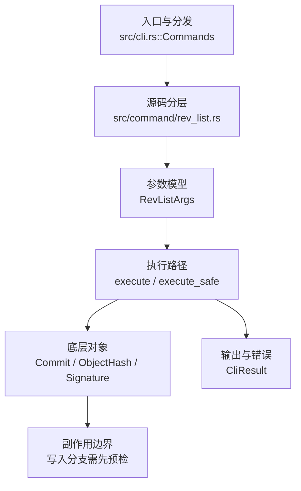

# `libra rev-list` 开发设计

## 命令实现目标

`libra rev-list` 的目标是列出从 revision 可达的提交对象。当前实现接受单个可选定位参数 `[SPEC]`（缺省 `HEAD`），并按提交时间倒序打印可达提交哈希；`--count`、`-n`/`--max-count`、`--skip`、`--parents`、`--timestamp` 已支持。多 revision、排除语法、A..B/A...B 范围和父提交过滤等 Git plumbing 行为尚未实现（见“还未实现的功能”）。

## 对比 Git 与兼容性

- 兼容级别：`partial`。单 revision 可达提交列表、`--count`、`-n`/`--max-count`、`--skip`、`--parents` 和 `--timestamp` 已支持；多 revision/range/exclusion 和父提交过滤尚未公开。

- 当前矩阵承诺常用 Git 行为已支持；新增语义必须同步矩阵、用户文档和测试。

## 设计方案

- 入口与分发：已公开接入 `src/cli.rs::Commands`；已由 `src/command/mod.rs` 导出。CLI 层在 `src/cli.rs` 把解析后的参数交给命令模块，命令模块负责把领域错误转换为 `CliError` / `CliResult`。
- 源码分层：主要实现文件为 `src/command/rev_list.rs`。参数/子命令类型包括：`RevListArgs`；输出、错误或状态类型包括：crate 私有的命名输出结构体 `RevListOutput { input, commits, entries, total, count_only, parents, timestamp, max_count, skip }`（由 `resolve_rev_list` 返回并供 `emit_json_data` 序列化），错误通过 `CliResult` 或上层命令错误统一传播；主要执行函数包括：`execute`、`execute_safe`。
- 执行路径：`execute_safe` 负责 CLI 安全包装、错误映射和输出配置；对象路径会解析 revision 并读写 blob/tree/commit/tag 等对象。

- 流程图：以下流程图按当前源码分层展示主路径和底层对象边界，便于维护者把代码入口、执行函数和副作用范围对应起来。

- 底层操作对象：`Commit`（提交对象、父提交关系和提交消息载荷）；`ObjectHash`（SHA-1/SHA-256 对象 ID 和 revision 解析结果）；`Signature`（作者/提交者/签名时间等提交身份字段）
- 输出与错误契约：人类输出、`--json` / `--machine` 输出和 quiet/verbose 分支必须继续走现有 `OutputConfig` / `emit_json_data` / `CliError` 路径；新增失败模式要补稳定错误码、用户提示和回归测试。
- 副作用边界：凡是写入索引、对象库、refs/HEAD、reflog、SQLite/D1、工作树或远端的路径，都必须先完成参数校验和 dry-run/预检分支，再执行持久化，避免部分写入后静默成功。

## 实现历史

- 本节依据本地 main 分支提交历史重写，筛选与该命令实现、测试或文档路径直接相关的提交；以下是归纳后的实现脉络。
- 2026-05-23 `b3782775`（`feat(rev-list): wire REV_LIST_EXAMPLES into clap after_help (v0.17.828)`）：基础实现节点：wire REV_LIST_EXAMPLES into clap after_help (v0.17.828)；当前实现的主要轮廓可追溯到该提交。
- 2026-06-06 `d288b5f7`（`feat(rev-list): multi-spec, ^/A..B/A...B ranges, -n/--skip/--count, parent filters, --parents/--timestamp`）：该提交曾描述 multi-spec、`^`/`A..B`/`A...B` 范围、父提交过滤、`--parents`/`--timestamp` 等参数；以当前源码为准，`-n`/`--skip`/`--count` 与 `--parents`/`--timestamp` 已重新落地，其余行为仍尚未实现。
- 2026-04-26 `1e60c68c`（`feat(rev): rev-list and rev-parse (#349)`）：功能演进：rev-list and rev-parse (#349)；该节点扩展了当前命令可用的参数或行为。
- 2026-06-16：补齐 Git 兼容输出参数 `--parents` 与 `--timestamp`，人类输出采用 Git 字段顺序，JSON 保持 `commits[]` 为纯提交 ID 并在需要时增加 `entries[]` 元数据。
- 历史结论：当前文档应以这些提交之后的代码、测试和兼容矩阵为准；更早的迁移式文档只保留为背景，不再作为事实来源。

## 当前状态

- 公开状态：已公开；模块状态：已导出。
- 用户文档：`docs/commands/rev-list.md`。
- Synopsis：`libra rev-list [OPTIONS] [SPEC]`。
- 公开参数/子命令包括：`-n, --max-count <N>`、`--skip <N>`、`--count`、`--parents`、`--timestamp`、`[SPEC]`（可选定位参数，缺省为 `HEAD`）；`--json` / `--quiet` 为全局参数，不在 `RevListArgs` 内本地声明。

## 还未实现的功能

| 类别 | 未完成项 | 当前处理 |
|---|---|---|
| 多 revision 与范围 | 多 revision、`^` 排除、`A..B`/`A...B` 范围。 | 当前仅接受单个 `[SPEC]`，缺省 `HEAD`，走 `resolve_rev_list` 单点解析。 |
| 父提交过滤 | `--merges`/`--no-merges`/`--min-parents`/`--max-parents`。 | 暂未提供；当前只支持 `--parents` 输出父提交 ID，不支持按父提交数量过滤。 |

## 维护要求

- 改进本命令前，必须先阅读并遵循 [docs/development/commands/_general.md](_general.md)；这是命令设计、实现、测试和文档同步的强制要求。
- 任何行为变更都要先核对实现源码，再同步 `COMPATIBILITY.md`、`docs/commands/<cmd>.md` 和相关测试。
- 新增 Git 兼容参数时必须明确 tier、错误码、JSON/机器输出契约和回归测试。
