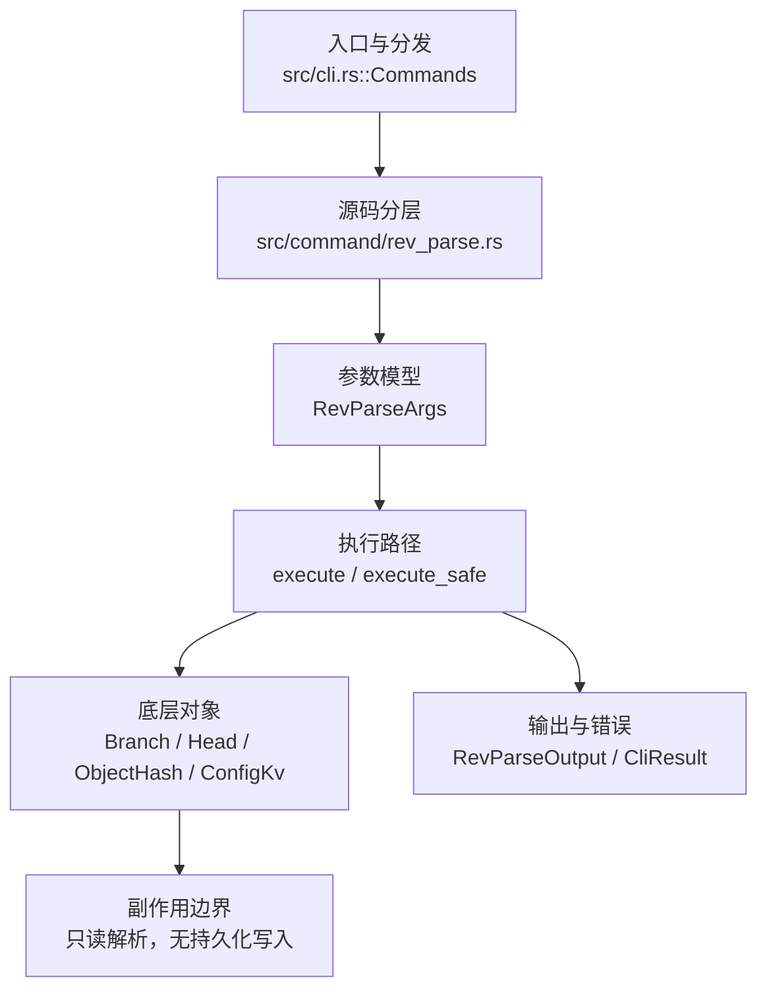

# `libra rev-parse` 开发设计

## 命令实现目标

`libra rev-parse` 的目标是解析和规范化 revision 名称、对象 ID 与仓库路径。实现需要支持 `--short`、`--abbrev-ref`、`--show-toplevel` 以及默认 `HEAD` fallback 和错误码，使脚本可以可靠地区分解析失败与使用错误。

## 对比 Git 与兼容性

- 兼容级别：`partial`。基础 revision 解析、`--short[=<n>]`、`--abbrev-ref`、`--symbolic-full-name`（将 spec 解析为完整 ref 名：`refs/heads/…`/`refs/tags/…`/`refs/remotes/…`，分离 HEAD 输出 `HEAD`；有效但非 ref 的对象不输出且退出码 0，不可解析名退出码 128——Libra 在 stderr 报错而非像 git 那样把 spec 回显到 stdout）、`--symbolic`（把可解析的 spec 按“尽量接近原始输入”原样回显：ref/revision/对象 id 均原样输出、不展开为完整 ref 名，与 `--symbolic-full-name` 不同；不可解析名退出 128，复用 `--symbolic-full-name` 的解析做有效性校验）、`--show-toplevel`、`--verify`/`--default`、`--sq`（对解析出的对象名做 shell 引用）及仓库状态查询（`--show-prefix`/`--show-cdup`/`--is-inside-work-tree`/`--is-inside-git-dir`/`--is-bare-repository`/`--git-dir`/`--absolute-git-dir`）已支持；其余输出过滤（`--flags`/`--revs-only`/`--abbrev=<n>`）和 parseopt 子模式尚未公开。

- 当前矩阵承诺常用 Git 行为已支持；新增语义必须同步矩阵、用户文档和测试。

## 设计方案

- 入口与分发：已公开接入 `src/cli.rs::Commands`；已由 `src/command/mod.rs` 导出。CLI 层在 `src/cli.rs` 把解析后的参数交给命令模块，命令模块负责把领域错误转换为 `CliError` / `CliResult`。
- 源码分层：主要实现文件为 `src/command/rev_parse.rs`。参数/子命令类型包括：`RevParseArgs`；输出、错误或状态类型包括：模块私有的输出结构体 `RevParseOutput`（`mode` / `input` / `value`），错误通过 `CliError` / `CliResult` 统一传播；主要执行函数包括：`execute`、`execute_safe`。
- 执行路径：`execute_safe` 负责 CLI 安全包装、错误映射和输出配置；对象路径会解析 revision 并按短哈希前缀只读检索对象库；引用路径只读取 SQLite refs 上的分支记录、HEAD 指向与 `core.bare` 配置，命令本身不写对象、不更新 refs/HEAD，也不触及 reflog。

- 流程图：以下流程图按当前源码分层展示主路径和底层对象边界，便于维护者把代码入口、执行函数和副作用范围对应起来。

- 底层操作对象：`Branch` / branch store（SQLite refs 上的分支读写、过滤和上游关系）；`Head`（SQLite 中的 HEAD 指向、当前分支和 detached 状态）；`ObjectHash`（SHA-1/SHA-256 对象 ID 和 revision 解析结果）；`ConfigKv`（配置键值持久化行）
- 输出与错误契约：人类输出、`--json` / `--machine` 输出和 quiet/verbose 分支必须继续走现有 `OutputConfig` / `emit_json_data` / `CliError` 路径；新增失败模式要补稳定错误码、用户提示和回归测试。
- 副作用边界：凡是写入索引、对象库、refs/HEAD、reflog、SQLite/D1、工作树或远端的路径，都必须先完成参数校验和 dry-run/预检分支，再执行持久化，避免部分写入后静默成功。

## 实现历史

- 本节依据本地 main 分支提交历史重写，筛选与该命令实现、测试或文档路径直接相关的提交；以下是归纳后的实现脉络。
- 2026-05-23 `d291ad12`（`feat(rev-parse): wire REV_PARSE_EXAMPLES into clap after_help (v0.17.827)`）：基础实现节点：wire REV_PARSE_EXAMPLES into clap after_help (v0.17.827)；当前实现的主要轮廓可追溯到该提交。
- 2026-06-06 `5245812d`（`feat(rev-parse): add --verify (exit 128, -q→1) and --default revision fallback`）：当前 `RevParseArgs` 已公开 `--verify`（单对象断言，失败 128，全局 `-q`→静默退 1）与 `--default <ARG>`（无 SPEC 时的回落 revision）；以现行源码为准。
- 2026-04-26 `1e60c68c`（`feat(rev): rev-list and rev-parse (#349)`）：功能演进：rev-list and rev-parse (#349)；该节点扩展了当前命令可用的参数或行为。
- 历史结论：当前文档应以这些提交之后的代码、测试和兼容矩阵为准；更早的迁移式文档只保留为背景，不再作为事实来源。

## 当前状态

- 公开状态：已公开；模块状态：已导出。
- 用户文档：`docs/commands/rev-parse.md`。
- Synopsis：`libra rev-parse [OPTIONS] [SPEC]`。
- 公开参数/子命令包括：`--short[=<n>]`、`--abbrev-ref`、`--symbolic-full-name`、`--symbolic`、`--show-toplevel`、`--show-prefix`、`--show-cdup`、`--verify`、`--default <ARG>`、`--sq`、`--is-inside-work-tree`、`--is-inside-git-dir`、`--is-bare-repository`、`--git-dir`、`--absolute-git-dir`、`[SPEC]`（位置参数，缺省为 `HEAD`）。`--symbolic` 与 `--symbolic-full-name`/`--short`/`--abbrev-ref`/仓库查询模式互斥（clap `conflicts_with_all`，冲突映射为退出 129）。`--sq` 仅对 `resolve`/`short` 模式的对象名做整值单引号 shell 引用（嵌入单引号转义为 `'\''`），仓库查询模式不受影响。
- `--verify`：断言 SPEC 解析为唯一对象，失败退出 128；配合全局 `--quiet`/`-q` 时静默退出 1。`--default <ARG>`：未提供位置 SPEC 时回退到该修订。`--is-inside-work-tree` / `--is-bare-repository` 打印 `true`/`false`；`--git-dir` 打印 `.libra` 目录路径（Git `$GIT_DIR` 等价；Libra 始终为绝对路径）。`--absolute-git-dir` 复用 `--git-dir` 路径并经 `std::fs::canonicalize` 规范化，保证 Git「canonicalized absolute path」契约（Libra 中两者结果一致）。`--is-inside-git-dir` 在当前目录位于 `.libra` 目录内时打印 `true`，否则 `false`（复用 `util::is_sub_path` 判定 cwd 是否为 `.libra` 的子路径，含相等）。

## 还未实现的功能

| 类别 | 未完成项 | 当前处理 |
|---|---|---|
| ✅ 已实现（仓库状态查询） | `--show-toplevel`、`--show-prefix`、`--show-cdup`、`--is-inside-work-tree`、`--is-inside-git-dir`、`--is-bare-repository`、`--git-dir`、`--absolute-git-dir` 均已支持。 | `--is-inside-git-dir` 带单元测试与集成测试（worktree→`false`，`.libra` 内→`true`）；`--absolute-git-dir` 带集成测试（绝对路径、以 `.libra` 结尾、与 `--git-dir` 一致、与 `--git-dir` 互斥）。 |
| ✅ 已实现（部分输出过滤） | `--symbolic-full-name`（spec → 完整 ref 名；`resolve_symbolic_full_name`：HEAD→分支全名/分离时 `HEAD`，分支→`refs/heads/…`，tag→`refs/tags/…`，远程跟踪→`refs/remotes/…`；有效非 ref 对象→空输出退出 0：先试 commit-ish（`get_commit_base_typed`，并按 `CommitBaseError` 区分 ReadFailure/CorruptReference 透传正确错误码），再按任意类型对象 id 查存储（`ClientStorage::search_result`，覆盖 tree/blob/tag 原始 SHA）；不可解析→fatal 退出 128）已实现，带集成测试 `test_rev_parse_symbolic_full_name` 与解析冲突单元测试（与全部仓库查询模式互斥）。 | 与 git 的有意/既有差异：①不可解析 spec 不回显到 stdout（git 会回显），改为 stderr 报错+退出 128；②`^{tree}`/`^{commit}` 等剥离到非 commit 对象的 revision 语法 → 退出 128（libra rev-parse 的 revision 解析器本就不支持剥离到非 commit 类型，全命令共有，非本 flag 引入）。原始 tree/blob/commit SHA 与 ref 名均与 git 一致。 |
| ✅ 已实现（部分输出过滤） | `--symbolic`（把可解析的 spec 按“尽量接近原始输入”原样回显，与 `--symbolic-full-name` 展开为完整 ref 名不同；`resolve_symbolic` 复用 `resolve_symbolic_full_name` 做有效性门控——ref、revision 表达式、任意类型对象 id 均接受——随后原样回显该 spec。带集成测试 `test_rev_parse_symbolic_echoes_resolvable_specs_verbatim`。） | 与 git 的有意/既有差异：①不可解析 spec 不回显到 stdout（git 会回显），改为 stderr 报错+退出 128（与 `--symbolic-full-name` 一致）；②`@`（git 的 HEAD 别名）不被 Libra 的 revision 解析器识别（全命令共有，非本 flag 引入），故 `--symbolic @` 退出 128 而非回显 `@`；③`^{<type>}` 剥离（如 `HEAD^{commit}`/`HEAD^{tree}`）与完整 ref 的 `~N` 导航（如 `refs/heads/main~0`）不被 Libra revision 解析器支持——这是**全命令共有**的限制（plain `rev-parse`、`--symbolic-full-name`、`--verify` 同样如此，非本 flag 引入；扩展该解析器属跨全部模式的独立工作，超出本 flag 范围），故 `--symbolic` 对这些 git 可解析的 spec 退出 128。其余可解析 ref/revision/对象 id 与 git 逐字节一致。带 `test_rev_parse_symbolic_echoes_resolvable_specs_verbatim` 中的命令级限制断言锁定。 |
| 输出过滤（仍缺口） | Git `--flags`、`--no-flags`、`--revs-only`、`--no-revs`、`--abbrev=<n>` 等输出/过滤选项。（`--short[=<n>]`、`--sq`、`--abbrev-ref`、`--symbolic-full-name`、`--symbolic` 已实现，不再列为缺口。） | 后续以新增测试、兼容矩阵或用户命令文档变更为准。 |
| 参数解析模式 | Git `--parseopt`、`--keep-dashdash`、`--stuck-long`、`--sq-quote` 等 `--parseopt` 子模式；当前未实现。 | 后续以新增测试、兼容矩阵或用户命令文档变更为准。 |

## 维护要求

- 改进本命令前，必须先阅读并遵循 [docs/development/commands/_general.md](_general.md)；这是命令设计、实现、测试和文档同步的强制要求。
- 任何行为变更都要先核对实现源码，再同步 `COMPATIBILITY.md`、`docs/commands/<cmd>.md` 和相关测试。
- 新增 Git 兼容参数时必须明确 tier、错误码、JSON/机器输出契约和回归测试。
