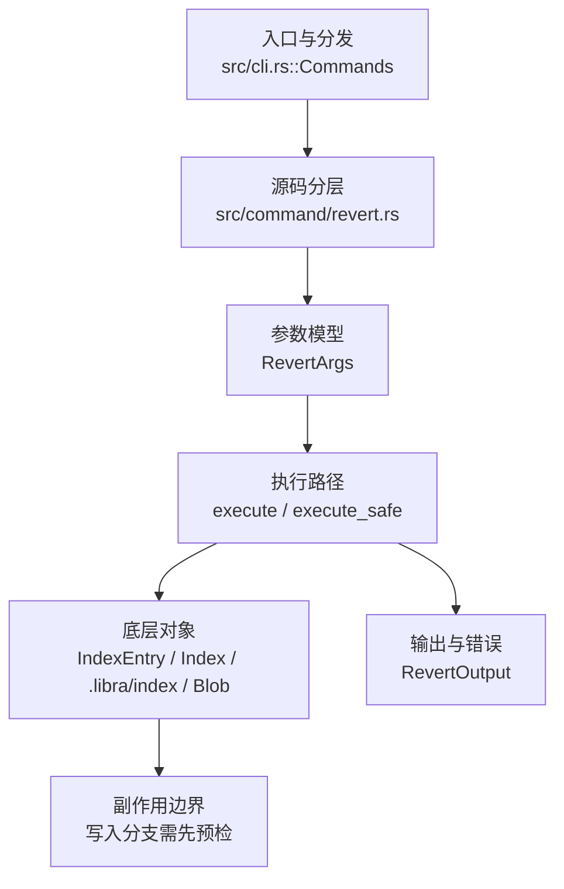

# `libra revert` 开发设计

## 命令实现目标

`libra revert` 的目标是生成抵消已有提交的反向变更，并保留冲突处理和提交控制的清晰边界。当前实现支持单父提交的反向变更、merge commit mainline revert（`-m/--mainline`）、no-commit 流程、`--continue`/`--abort` 冲突恢复和稳定错误输出，同时把 `--skip`、多提交冲突自动续作、编辑器消息和自定义策略列为未完成。

## 对比 Git 与兼容性

- 兼容级别：`partial`。单/多提交 revert、`-n/--no-commit`、`-m/--mainline`（merge commit revert）、`-s/--signoff`（Signed-off-by trailer）与冲突 sequencer（`--continue`/`--abort`，3-way 冲突标记 + `revert-state.json`）已支持；`--skip`、多提交冲突的自动续作（todo 列表）、edit、strategy surface 尚未公开。

- 当前矩阵承诺常用 Git 行为已支持；新增语义必须同步矩阵、用户文档和测试。

## 设计方案

- 入口与分发：已公开接入 `src/cli.rs::Commands`；已由 `src/command/mod.rs` 导出。CLI 层在 `src/cli.rs` 把解析后的参数交给命令模块，命令模块负责把领域错误转换为 `CliError` / `CliResult`。
- 源码分层：主要实现文件为 `src/command/revert.rs`。参数/子命令类型包括：`RevertArgs`；输出、错误或状态类型包括：`RevertOutput`；主要执行函数包括：`execute`、`execute_safe`。
- 执行路径：`execute_safe` 负责 CLI 安全包装、错误映射和输出配置；索引路径会加载、比较、刷新或保存 `.libra/index`；对象路径会解析 revision 并读写 blob/tree/commit/tag 等对象；引用路径会读取或更新 SQLite refs、HEAD 与 reflog。

- 流程图：以下流程图按当前源码分层展示主路径和底层对象边界，便于维护者把代码入口、执行函数和副作用范围对应起来。

- 底层操作对象：`IndexEntry`（索引条目，承载路径、mode、object id 和 stat 元数据）；`Index` / `.libra/index`（暂存区状态、路径条目和刷新/保存边界）；`Blob`（文件内容或 LFS pointer 写入对象库后的 blob 对象）；`Commit`（提交对象、父提交关系和提交消息载荷）；`TreeItem` / `TreeItemMode`（tree 中的路径项和 mode）；`Tree`（由索引或对象遍历生成的目录树对象）；`Branch` / branch store（SQLite refs 上的分支读写、过滤和上游关系）；`Head`（SQLite 中的 HEAD 指向、当前分支和 detached 状态）；`ObjectHash`（SHA-1/SHA-256 对象 ID 和 revision 解析结果）
- 输出与错误契约：人类输出、`--json` / `--machine` 输出和 quiet/verbose 分支必须继续走现有 `OutputConfig` / `emit_json_data` / `CliError` 路径；新增失败模式要补稳定错误码、用户提示和回归测试。
- 副作用边界：凡是写入索引、对象库、refs/HEAD、reflog、SQLite/D1、工作树或远端的路径，都必须先完成参数校验和 dry-run/预检分支，再执行持久化，避免部分写入后静默成功。

## 实现历史

- 本节依据本地 main 分支提交历史重写，筛选与该命令实现、测试或文档路径直接相关的提交；以下是归纳后的实现脉络。
- 基础实现节点：当前 HEAD 支持单父提交的反向变更（`<commit>` + `-n/--no-commit`），并通过 `revert_single_commit` 中的 mainline 选择逻辑支持 merge commit revert（`-m/--mainline`）。
- 2026-05-21 `752c516f`（`test(revert): pin RevertError Display + stable_code surfaces (v0.17.703)`）：测试契约：pin RevertError Display + stable_code surfaces (v0.17.703)；相关行为已有回归守卫，后续变更需要继续满足。
- 2026-06-18：恢复 `-m/--mainline` merge commit revert（原始内容由一次 reconcile 丢弃，仅遗留提交消息），重新应用 `b5af38a` 的源码、错误变体（`MainlineRequired` / `MainlineForNonMerge` / `InvalidMainline`，全部 exit 128）、测试与文档。
- 历史结论：当前文档应以这些提交之后的代码、测试和兼容矩阵为准；更早的迁移式文档只保留为背景，不再作为事实来源。

## 当前状态

- 公开状态：已公开；模块状态：已导出。
- 用户文档：`docs/commands/revert.md`。
- Synopsis：`libra revert [-n | --no-commit] [-m | --mainline <parent-number>] [-s | --signoff] [--json] [--quiet] <commit>...` ｜ `libra revert --continue` ｜ `libra revert --abort`。
- 公开参数/子命令包括：`<commit>...`（位置参数，`--continue`/`--abort` 时可省略）、`-n, --no-commit`、`-m, --mainline <parent-number>`、`-s, --signoff`、`--continue`、`--abort`、`--json`、`--quiet`。多个 commit 按给定顺序依次 revert，每个相对前一次产生的 HEAD 各自生成一个 revert commit；中途失败即停止，已完成的保留。`-n/--no-commit` 与 `-m/--mainline` 与多 commit 互斥（映射 `RevertError::MultiCommitUnsupported`）。`-s/--signoff` 经 `signoff_trailer` 追加 `Signed-off-by`。
- **冲突 sequencer**：当某文件自被 revert 的提交后又被改动且 revert 与之重叠时，`three_way_revert_blob`（`diffy::merge_bytes`，base=被 revert 提交的 blob / ours=当前 / theirs=父提交）写入冲突标记到 index+worktree，并把 `RevertState`（orig_head/reverted_commit/signoff/conflicted_paths）持久化到 `.libra/revert-state.json`，revert 以 exit 1 暂停（`RevertError::Conflicts`）。`--continue` 拒绝 index 中仍含 `<<<<<<<` 标记（`UnresolvedConflicts`），否则从已解决的 index 构建单亲 revert commit 并清理 state；`--abort` reset 到 `orig_head` 并清理 state。开始新 revert 前若已有进行中的 revert 会报 `RevertInProgress`。（区别于 cherry-pick 的 SQLite stage-1/2/3 模型：revert 用 JSON state + stage-0 标记。）

## 还未实现的功能

| 类别 | 未完成项 | 当前处理 |
|---|---|---|
| 兼容差异项 | 编辑消息 | 原始对照：--edit / --no-edit；相关参数/替代：不适用；当前说明：不支持 (use -n then commit -m)。 后续实现时需要补对应回归测试并同步兼容矩阵。 |
| 兼容差异项 | Skip 当前 commit | 原始对照：--skip；相关参数/替代：不适用；当前说明：不支持。 后续实现时需要补对应回归测试并同步兼容矩阵。 |
| 兼容差异项 | 多提交冲突自动续作 | 原始对照：Git sequencer todo；相关参数/替代：`--continue`；当前说明：`--continue` 可完成当前冲突 revert，但未维护剩余 todo 自动续作。 后续实现时需要补对应回归测试并同步兼容矩阵。 |
| 兼容差异项 | 策略 | 原始对照：--strategy <s>；相关参数/替代：不适用；当前说明：不支持。 后续实现时需要补对应回归测试并同步兼容矩阵。 |

## 维护要求

- 改进本命令前，必须先阅读并遵循 [docs/development/commands/_general.md](_general.md)；这是命令设计、实现、测试和文档同步的强制要求。
- 任何行为变更都要先核对实现源码，再同步 `COMPATIBILITY.md`、`docs/commands/<cmd>.md` 和相关测试。
- 新增 Git 兼容参数时必须明确 tier、错误码、JSON/机器输出契约和回归测试。
