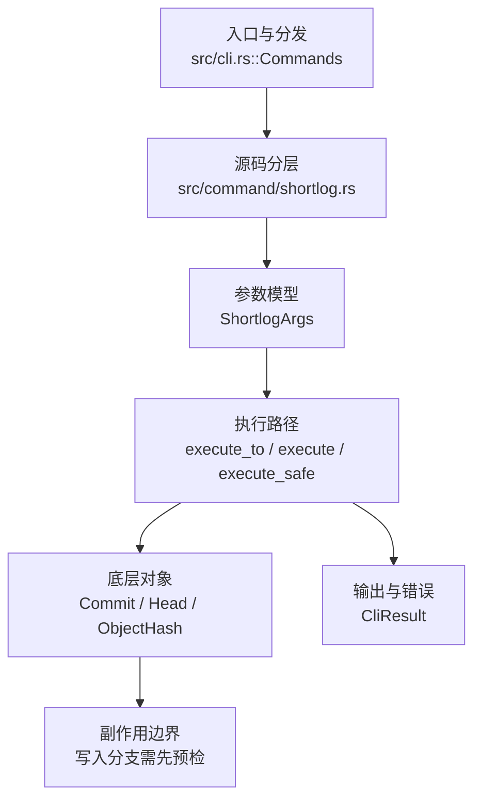

# `libra shortlog` 开发设计

## 命令实现目标

`libra shortlog` 的目标是按作者或提交者汇总提交历史。实现需要支持 committer grouping、no-merges、top 限制、mailmap、范围解析和 JSON 摘要，同时把 group、format、stdin 和更复杂过滤作为差异项。

## 对比 Git 与兼容性

- 兼容级别：`supported`。

- 当前矩阵承诺常用 Git 行为已支持；新增语义必须同步矩阵、用户文档和测试。

## 设计方案

- 入口与分发：已公开接入 `src/cli.rs::Commands`；已由 `src/command/mod.rs` 导出。CLI 层在 `src/cli.rs` 把解析后的参数交给命令模块，命令模块负责把领域错误转换为 `CliError` / `CliResult`。
- 源码分层：主要实现文件为 `src/command/shortlog.rs`。参数/子命令类型包括：`ShortlogArgs`；输出、错误或状态类型包括：源码未暴露独立公开输出/错误类型，错误通过 `CliResult` 统一传播；主要执行函数包括：`execute_to`、`execute`、`execute_safe`。
- 执行路径：`execute_safe` 负责 CLI 安全包装、错误映射和输出配置；核心领域逻辑集中在 `execute_to`；对象路径会解析 revision 并读写 blob/tree/commit/tag 等对象；引用路径会读取或更新 SQLite refs、HEAD 与 reflog。

- 流程图：以下流程图按当前源码分层展示主路径和底层对象边界，便于维护者把代码入口、执行函数和副作用范围对应起来。

- 底层操作对象：`Commit`（提交对象、父提交关系和提交消息载荷）；`Head`（SQLite 中的 HEAD 指向、当前分支和 detached 状态）；`ObjectHash`（SHA-1/SHA-256 对象 ID 和 revision 解析结果）
- 输出与错误契约：人类输出、`--json` / `--machine` 输出和 quiet/verbose 分支必须继续走现有 `OutputConfig` / `emit_json_data` / `CliError` 路径；新增失败模式要补稳定错误码、用户提示和回归测试。
- 副作用边界：凡是写入索引、对象库、refs/HEAD、reflog、SQLite/D1、工作树或远端的路径，都必须先完成参数校验和 dry-run/预检分支，再执行持久化，避免部分写入后静默成功。

## 实现历史

- 本节依据本地 main 分支提交历史重写，筛选与该命令实现、测试或文档路径直接相关的提交；以下是归纳后的实现脉络。
- 2026-06-06 `cec72108`（`feat(shortlog): add -c/--committer grouping and --no-merges filter`）：尽管提交标题宣称新增 `-c/--committer` 与 `--no-merges`，这两个标志在 HEAD 上的 `ShortlogArgs` 及整个 `src/command/shortlog.rs` 中均不存在（编译实现仍只暴露 `-n/-s/-e/--since/--until` 与位置参数 `revision`）——该功能未在当前 HEAD 落地（已回退或从未接入），与下文「还未实现的功能」缺口表一致。
- 2026-06-10 `3b170290`（`feat(shortlog): add --top option (#382)`）：该提交描述的 `--top` 选项当前同样未出现在 `ShortlogArgs` 中，不在当前事实实现范围内。
- 2026-06-01 `1a7501da`（`test(shortlog): pin json revision summary`）：测试契约：pin json revision summary；相关行为已有回归守卫，后续变更需要继续满足。
- 历史结论：当前文档应以这些提交之后的代码、测试和兼容矩阵为准；更早的迁移式文档只保留为背景，不再作为事实来源。

## 当前状态

- 公开状态：已公开；模块状态：已导出。
- 用户文档：`docs/commands/shortlog.md`。
- Synopsis：`libra shortlog [<revision>] [-n] [-s] [-e] [--since <date>] [--until <date>]`。
- 公开参数/子命令包括：`-n, --numbered`、`-s, --summary`、`-e, --email`、`--since <DATE>`、`--until <DATE>`、`[<revision>]`。

## 还未实现的功能

| 类别 | 未完成项 | 当前处理 |
|---|---|---|
| 兼容差异项 | 分组方式 | 原始对照：不支持；相关参数/替代：--group=author\|committer\|trailer:<key>；当前说明：不适用。 后续实现时需要补对应回归测试并同步兼容矩阵。 |
| 兼容差异项 | 格式化输出 | 原始对照：不支持；相关参数/替代：--format=<format>；当前说明：不适用。 后续实现时需要补对应回归测试并同步兼容矩阵。 |
| 兼容差异项 | 提交者分组 | 原始对照：不支持；相关参数/替代：--committer (已弃用，改用 --group=committer)；当前说明：不适用。 后续实现时需要补对应回归测试并同步兼容矩阵。 |
| 兼容差异项 | 管道输入 | 原始对照：不支持；相关参数/替代：从 stdin 读取管道输入；当前说明：不适用。 后续实现时需要补对应回归测试并同步兼容矩阵。 |
| 兼容差异项 | 排除 merge 提交 | 原始对照：不支持；相关参数/替代：--no-merges；当前说明：不适用。 后续实现时需要补对应回归测试并同步兼容矩阵。 |
| 兼容差异项 | 作者过滤 | 原始对照：不支持；相关参数/替代：--author=<pattern>；当前说明：不适用。 后续实现时需要补对应回归测试并同步兼容矩阵。 |
| 兼容差异项 | 换行宽度 | 原始对照：不支持；相关参数/替代：-w[<width>[,<indent1>[,<indent2>]]]；当前说明：`ShortlogArgs` 当前无 `width` 字段。 后续实现时需要补对应回归测试并同步兼容矩阵。 |
| 兼容差异项 | top 限制 | 原始对照：不支持；相关参数/替代：--top；当前说明：`ShortlogArgs` 当前无 `top` 字段。 后续实现时需要补对应回归测试并同步兼容矩阵。 |
| 兼容差异项 | 最小计数过滤 | 原始对照：不支持；相关参数/替代：--min-count；当前说明：`ShortlogArgs` 当前无 `min_count` 字段。 后续实现时需要补对应回归测试并同步兼容矩阵。 |
| 兼容差异项 | 逆序输出 | 原始对照：不支持；相关参数/替代：--reverse；当前说明：`ShortlogArgs` 当前无 `reverse` 字段。 后续实现时需要补对应回归测试并同步兼容矩阵。 |

## 维护要求

- 改进本命令前，必须先阅读并遵循 [docs/development/commands/_general.md](_general.md)；这是命令设计、实现、测试和文档同步的强制要求。
- 任何行为变更都要先核对实现源码，再同步 `COMPATIBILITY.md`、`docs/commands/<cmd>.md` 和相关测试。
- 新增 Git 兼容参数时必须明确 tier、错误码、JSON/机器输出契约和回归测试。
