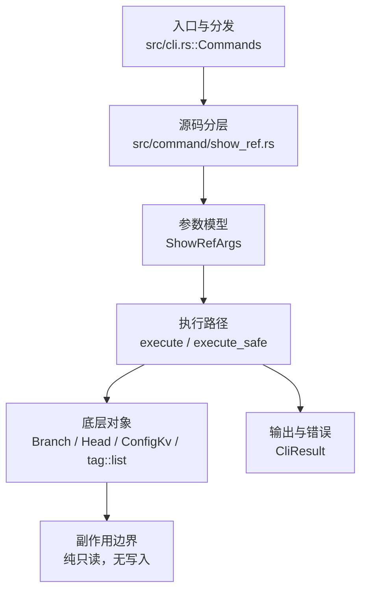

# `libra show-ref` 开发设计

## 命令实现目标

`libra show-ref` 的目标是列出本地 refs（分支、标签）及其对象哈希。当前实现支持 `--heads` / `--tags` 范围过滤、`--head` 纳入 HEAD、`-s, --hash[=<n>]` 仅输出哈希且可选缩短、`--abbrev[=<n>]` 缩短显示哈希、`-d, --dereference` 展开 annotated tag 的 peeled `^{}` 行、`[PATTERN]...` 按 Git 风格完整路径段后缀过滤、远端跟踪分支、`--verify <ref>` 精确 ref 验证以及 `--exists <ref>` 存在性检查。

## 对比 Git 与兼容性

- 兼容级别：`partial`。branch/tag/HEAD listing、`--hash[=<n>]`、`--abbrev[=<n>]`、`--dereference`、`--verify` 和 `--exists` 已支持；`--exclude-existing` 尚未公开。

- 当前矩阵承诺常用 Git 行为已支持；新增语义必须同步矩阵、用户文档和测试。

## 设计方案

- 入口与分发：已公开接入 `src/cli.rs::Commands`；已由 `src/command/mod.rs` 导出。CLI 层在 `src/cli.rs` 把解析后的参数交给命令模块，命令模块负责把领域错误转换为 `CliError` / `CliResult`。
- 源码分层：主要实现文件为 `src/command/show_ref.rs`（由 `src/command/mod.rs` 的 `pub mod show_ref;` 直接声明），annotated tag 展开逻辑位于 `src/command/show_ref_deref.rs` 私有 helper 模块，输出渲染和 hash 缩短逻辑位于 `src/command/show_ref_render.rs` 私有 helper 模块。参数/子命令类型包括：`ShowRefArgs`；输出、错误或状态类型包括：内部 `ShowRefEntry` 和 `ShowRefRenderOptions`，错误通过 `CliResult` / `CliError` 统一传播；主要执行函数包括：`execute`、`execute_safe`、`collect_show_ref_entries`。
- 执行路径：`execute_safe` 负责 CLI 安全包装、错误映射和输出配置；普通列举路径调用 `collect_show_ref_entries`，`--verify` / `--exists` 走精确 refname 检查路径；命令为纯只读，通过 `Branch::list_branches_result`、`tag::list()`、`ConfigKv::all_remote_configs()` 和 `Head::current_commit_result()` 读取 SQLite refs/HEAD 与远端配置；`--dereference` 仅额外读取 annotated tag 指向的对象链以计算 peeled hash；`--abbrev[=<n>]` / `--hash[=<n>]` 只影响渲染出的 hash 字段，不更新 refs、HEAD 或 reflog。

- 流程图：以下流程图按当前源码分层展示主路径和底层对象边界，便于维护者把代码入口、执行函数和副作用范围对应起来。

- 底层操作对象：`Branch` / branch store（SQLite refs 上的本地与远端跟踪分支读取、过滤）；`Head`（SQLite 中的 HEAD 指向，仅在 `--head` 时读取当前提交）；`ConfigKv`（读取远端配置以枚举远端跟踪分支）；`tag::list()` 与 `tag::load_object_trait()`（标签列表读取，并在 `--dereference` 时递归 peel annotated tag）
- 输出与错误契约：人类输出、`--json` / `--machine` 输出和 quiet/verbose 分支必须继续走现有 `OutputConfig` / `emit_json_data` / `CliError` 路径；新增失败模式要补稳定错误码、用户提示和回归测试。
- 副作用边界：凡是写入索引、对象库、refs/HEAD、reflog、SQLite/D1、工作树或远端的路径，都必须先完成参数校验和 dry-run/预检分支，再执行持久化，避免部分写入后静默成功。

## 实现历史

- 本节依据本地 main 分支提交历史重写，筛选与该命令实现、测试或文档路径直接相关的提交；以下是归纳后的实现脉络。
- 2026-03-03 `39686865`（`feat: implement show-ref command to list local references (#253)`）：基础实现节点：implement show-ref command to list local references (#253)；当前实现的主要轮廓可追溯到该提交。
- 2026-06-07 `d399c043`（`feat: support show-ref dereference and commit trailers`）：功能演进：support show-ref dereference and commit trailers；该节点扩展了当前命令可用的参数或行为。
- 2026-06-07 `32987f07`（`feat(show-ref): support exact ref verification`）：功能演进：support exact ref verification；该节点扩展了当前命令可用的参数或行为。
- 2026-06-07 `2de5c022`（`fix(show-ref): query exists refs without decoding objects`）：实现修正：query exists refs without decoding objects；该节点把边界行为、错误处理或兼容差异纳入当前实现约束。
- 历史结论：以 HEAD 实际编译进二进制的 `src/command/show_ref.rs` / `src/command/show_ref_deref.rs` 为准；当前公开 `--verify` / `--exists` 的精确 ref 检查，并重新接入 `--dereference` annotated tag peel 输出。更早的迁移式文档只保留为背景。

## 当前状态

- 公开状态：已公开；模块状态：已导出。
- 用户文档：`docs/commands/show-ref.md`。
- Synopsis：`libra show-ref [OPTIONS] [PATTERN]...`。
- 公开参数/子命令包括：`--heads`、`--tags`、`--head`、`-s, --hash[=<n>]`、`--abbrev[=<n>]`、`-d, --dereference`、`--verify`、`--exists`、`[PATTERN]...`。

## 还未实现的功能

| 类别 | 未完成项 | 当前处理 |
|---|---|---|
| Git 参数 | `--exclude-existing` 尚未公开；`--exists` 已按 Git 用法对缺失 ref 返回退出码 2，但其他错误仍遵循 Libra 稳定错误码契约。 | 后续若落地需新增实现、补稳定错误码与回归测试。 |

## 维护要求

- 改进本命令前，必须先阅读并遵循 [docs/development/commands/_general.md](_general.md)；这是命令设计、实现、测试和文档同步的强制要求。
- 任何行为变更都要先核对实现源码，再同步 `COMPATIBILITY.md`、`docs/commands/<cmd>.md` 和相关测试。
- 新增 Git 兼容参数时必须明确 tier、错误码、JSON/机器输出契约和回归测试。
