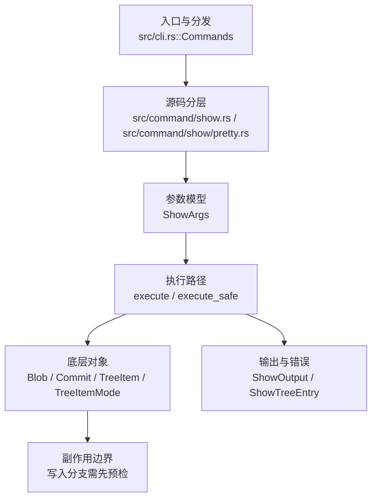

# `libra show` 开发设计

## 命令实现目标

`libra show` 的目标是展示提交、tag、tree 或 blob 对象内容，并按对象类型选择合适的人类可读输出。实现需要处理 annotated tag、pager、diff name-status、大文件/二进制摘要和结构化错误。

## 对比 Git 与兼容性

- 兼容级别：`supported`。

- 当前矩阵承诺常用 Git 行为已支持；新增语义必须同步矩阵、用户文档和测试。

## 设计方案

- 入口与分发：已公开接入 `src/cli.rs::Commands`；已由 `src/command/mod.rs` 导出。CLI 层在 `src/cli.rs` 把解析后的参数交给命令模块，命令模块负责把领域错误转换为 `CliError` / `CliResult`。
- 源码分层：主要实现文件为 `src/command/show.rs`、`src/command/show/pretty.rs`。参数/子命令类型包括：`ShowArgs`；输出、错误或状态类型包括：`ShowOutput`、`ShowTreeEntry`；主要执行函数包括：`execute`、`execute_safe`。
- 执行路径：`execute_safe` 负责 CLI 安全包装、错误映射和输出配置；对象路径会解析 revision 并读写 blob/tree/commit/tag 等对象；引用路径会读取或更新 SQLite refs、HEAD 与 reflog。

- 流程图：以下流程图按当前源码分层展示主路径和底层对象边界，便于维护者把代码入口、执行函数和副作用范围对应起来。

- 底层操作对象：`Blob`（文件内容或 LFS pointer 写入对象库后的 blob 对象）；`Commit`（提交对象、父提交关系和提交消息载荷）；`TreeItem` / `TreeItemMode`（tree 中的路径项和 mode）；`Tree`（由索引或对象遍历生成的目录树对象）；`Branch` / branch store（SQLite refs 上的分支读写、过滤和上游关系）；`Head`（SQLite 中的 HEAD 指向、当前分支和 detached 状态）；`ClientStorage`（本地/分层对象存储读写入口）；`ObjectHash`（SHA-1/SHA-256 对象 ID 和 revision 解析结果）；`ObjectType`（blob/tree/commit/tag 类型分派）
- 输出与错误契约：人类输出、`--json` / `--machine` 输出和 quiet/verbose 分支必须继续走现有 `OutputConfig` / `emit_json_data` / `CliError` 路径；新增失败模式要补稳定错误码、用户提示和回归测试。
- 副作用边界：凡是写入索引、对象库、refs/HEAD、reflog、SQLite/D1、工作树或远端的路径，都必须先完成参数校验和 dry-run/预检分支，再执行持久化，避免部分写入后静默成功。

## 实现历史

- 本节依据本地 main 分支提交历史重写，筛选与该命令实现、测试或文档路径直接相关的提交；以下是归纳后的实现脉络。
- 2026-06-06 `1593a844`（`feat(show): add --name-status diff display mode`）：基础实现节点：add --name-status diff display mode；当前实现的主要轮廓可追溯到该提交。
- 2026-05-15 `aaf16f28`（`feat(show): route human output through pager`）：功能演进：route human output through pager；该节点扩展了当前命令可用的参数或行为。
- 2026-06-07 `5a5e5fcb`（`fix(show): summarize large and binary blobs`）：实现修正：summarize large and binary blobs；该节点把边界行为、错误处理或兼容差异纳入当前实现约束。
- 历史结论：当前文档应以这些提交之后的代码、测试和兼容矩阵为准；更早的迁移式文档只保留为背景，不再作为事实来源。

## 当前状态

- 公开状态：已公开；模块状态：已导出。
- 用户文档：`docs/commands/show.md`。
- Synopsis：`libra show [OPTIONS] [OBJECT] [-- <PATHS>...]`。
- 公开参数/子命令包括：`Examples`。

## 还未实现的功能

| 类别 | 未完成项 | 当前处理 |
|---|---|---|
| 后续跟踪 | 当前未发现公开未完成项。 | 后续以新增测试、兼容矩阵或用户命令文档变更为准。 |

## 维护要求

- 改进本命令前，必须先阅读并遵循 [docs/development/commands/_general.md](_general.md)；这是命令设计、实现、测试和文档同步的强制要求。
- 任何行为变更都要先核对实现源码，再同步 `COMPATIBILITY.md`、`docs/commands/<cmd>.md` 和相关测试。
- 新增 Git 兼容参数时必须明确 tier、错误码、JSON/机器输出契约和回归测试。
